# 1. 版本控制

​		版本控制是指对软件开发过程中各种程序代码、[配置文件](https://baike.baidu.com/item/配置文件/286550)及说明文档等文件变更的管理，是[软件配置管理](https://baike.baidu.com/item/软件配置管理/3765602)的核心思想之一。

​		**版本控制最主要的功能就是追踪文件的变更**。它将什么时候、什么人更改了文件的什么内容等信息忠实地了记录下来。每一次文件的改变，文件的版本号都将增加。除了记录版本变更外，版本控制的另一个重要功能是并行开发。[软件开发](https://baike.baidu.com/item/软件开发/3448966)往往是多人协同作业，版本控制可以有效地解决版本的同步以及不同开发者之间的开发通信问题，提高协同开发的效率。并行开发中最常见的不同版本软件的错误(Bug)修正问题也可以通过版本控制中分支与合并的方法有效地解决。

- 实现跨区域多人协同开发

- 追踪和记载一个或多个文件的历史记录

- 组织和保护源代码和文档

- 统计工作量

- 并行开发、提高开发效率

- 跟踪记录整个软件的开发过程

- 减轻开发人员的负担，节省时间，同时降低人为错误

​		没有进行版本控制或者版本控制本身缺乏正确的的流程管理，在软件开发过程中会引入很多的问题，比如软件代码的一致性、软件内容的冗余、软件开发过程中的并发性、软件源代码的安全性、软件整合等等问题。

## 1.1 常用的版本控制工具

- Git

- SVN(Subversion)

- CVS(Concurrent Versions System)

- VSS(Microsoft Visual Sourcesafe)

- TFS(Team Foundation Server)

- Visual Studio Online

  目前最流行并且影响力最大的是Git和SVN。

## 1.2 版本控制分类

- 本地版本控制

  记录文件每次的更新，可以对每个版本进行一次快照，或者记录补丁文件，适合个人用，如RCS。

  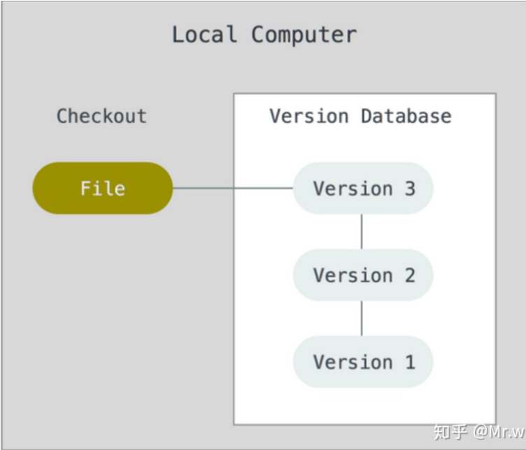

- 集中版本控制

  所有的版本数据都保存在服务器上，协同开发者从服务器上同步更新或上传自己的修改。

  如果不联网用户就无法看到历史版本，也无法在不同的分支工作。最极端的情况是服务器宕机损坏，丢失所有的版本数据。

  典型的集中式版本控制产品包括：CVS、VSS、SVN。

  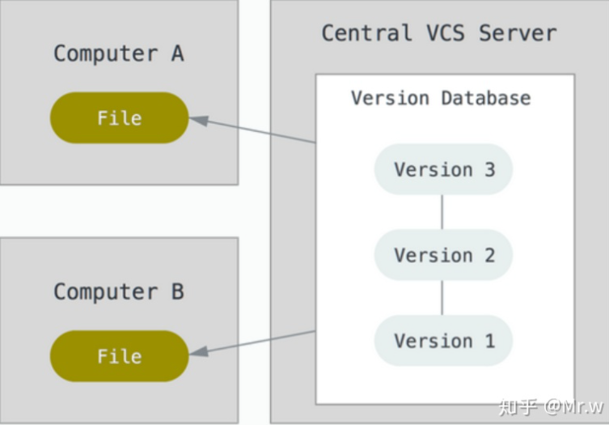

- 分布式版本管理

  所有的版本控制信息全部同步到本地的所有用户，可以在本地看到所有的版本历史。

  在离线时可以在本地提交，只需在联网时push到相应的服务器或者其他用户即可。

  分布式版本管理的好处是只要有一台用户的设备可以工作就可以恢复所有的版本数据，但是这也带来了数据安全的问题。

  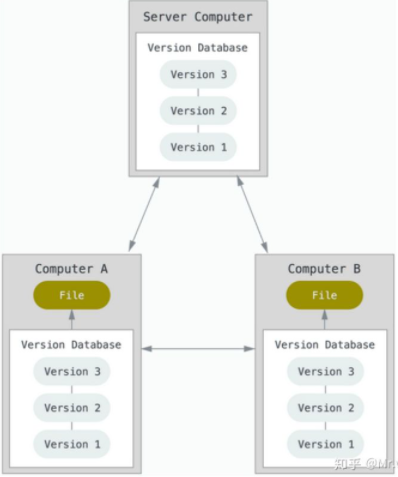

## 1.3 Git和SVN的主要区别

- SVN是集中式版本控制。首先要使用自己的电脑来从服务器获取版本数据，进行工作，工作完成后再把修改的内容推送到中央服务器。集中式版本控制必须联网才能够工作。
- Git是分布式版本控制。没有中央服务器，每个人的电脑都是版本库，工作的时候无需联网。如果是两个人协同开发，只需把各自的修改推送给对方。

# 2. Git环境配置

## 2.1 下载Git

​		Git官网地址：[https://git-scm.com/](https://git-scm.com/)

​		也可以使用镜像源下载：[https://npm.taobao.org/mirrors/git-for-windows/](https://npm.taobao.org/mirrors/git-for-windows/)

​		选择默认方式下载即可。

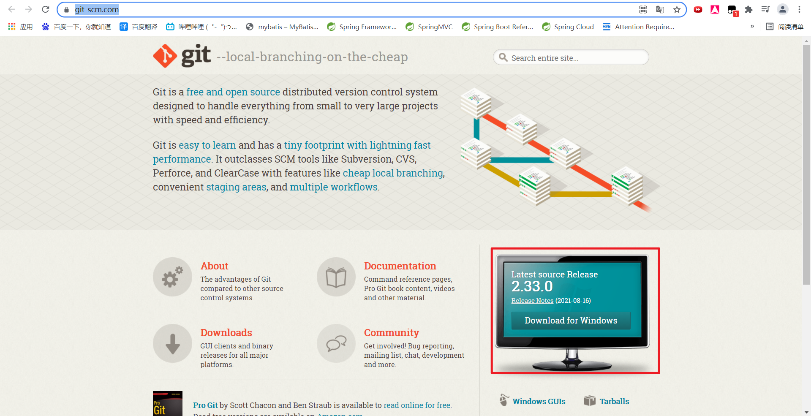

## 2.2 启动Git

​		安装成功后点击在开始菜单栏会新添加3个程序：

- Git Bash：Unix与Linux风格的命令行，使用最多，推荐最多。
- Git CMD：Windows风格的命令行。
- Git GUI：图形界面，不建议初学者使用，尽量先熟悉使用命令。

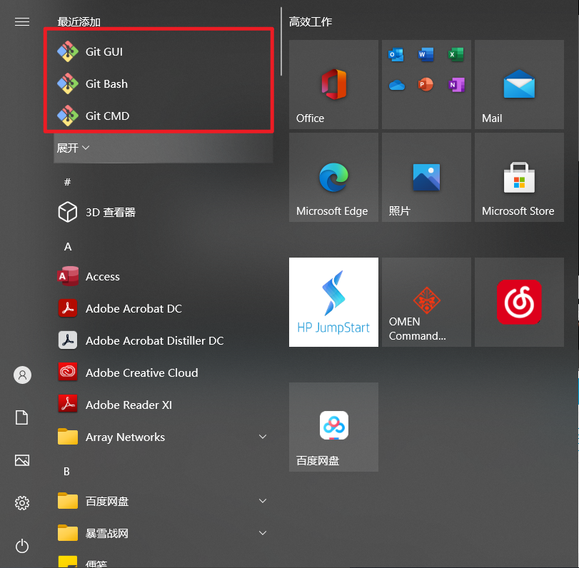

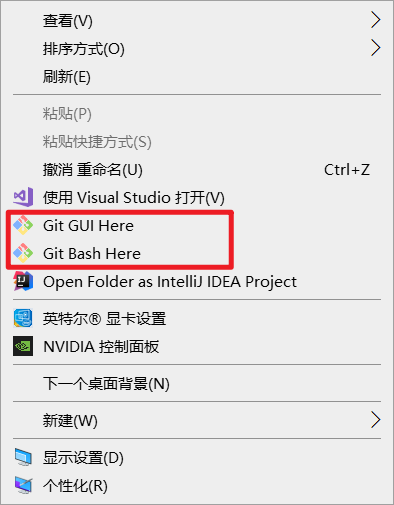

## 2.3 基本的Linux命令学习

- cd：改变目录
- cd ..：回退到上一个目录
- pwd：显示当前所在的目录路径
- ls [ll]：列出当前目录的所有文件，ll列出的内容更加详细
- touch：在当前的目录新建一个文件
- rm：删除一个文件
- mkdir：新建一个文件或者文件夹
- rm -r：删除一个文件夹
- mv：移动文件
- reset：重新初始化终端/清屏
- clear：清屏
- history：查看历史命令
- help：帮助
- exit：退出
- #：注释

## 2.4 Git配置

- 查看配置`git config -l`

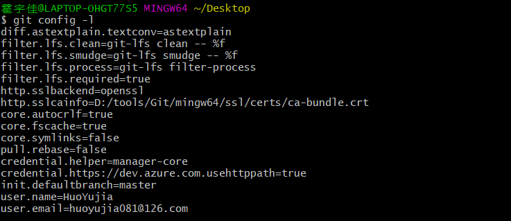

- 查看系统配置`git config --system --list`

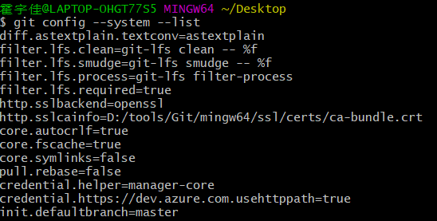

- 查看用户配置`git config --global --list`

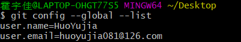

​	**Git的相关配置文件：**

- Git\etc\gitconfig：系统级配置文件
- 用户主目录下的`.gitconfig`：当前用户的配置

## 2.5 设置用户名与邮箱（必需）

​		每次Git提交时都会使用用户名和邮箱进行标识，因此下载完成Git后应该立即设置用户名和邮箱。

```sh
git config --global user.name "huoyujia" #用户名
git config --global user.email huoyujia081@126.com #邮箱
```

​		一旦传递了--global选项，则Git总是会将该信息用于系统中的一切操作。如果希望在一个项目中使用不同的name和email，则可以不添加--global。

# 3. Git基本理论

## 3.1 工作区域

​		Git本地有三个工作区域：工作目录（Working Directory）、暂存区（Stage/Index）、资源库(Repository/Git Repository)。加上远程的Git仓库（Remote Directory）就可以分为四个工作区域。文件在这四个区域之间的转换关系如下：

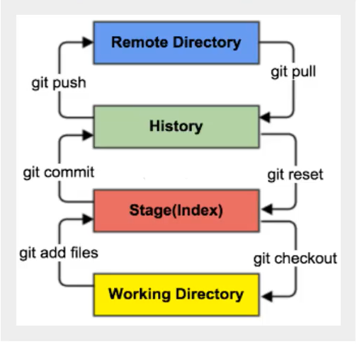

- 工作目录：和平时存放代码的workspace一样。
- 暂存区：用于临时存放改动，只是一个保存即将提交到文件列表信息的文件。
- 资源库：安全存放数据的为止，这里面有所有版本的数据，其中HEAD指向最后放入仓库的版本。
- 远程仓库：托管代码的服务器。

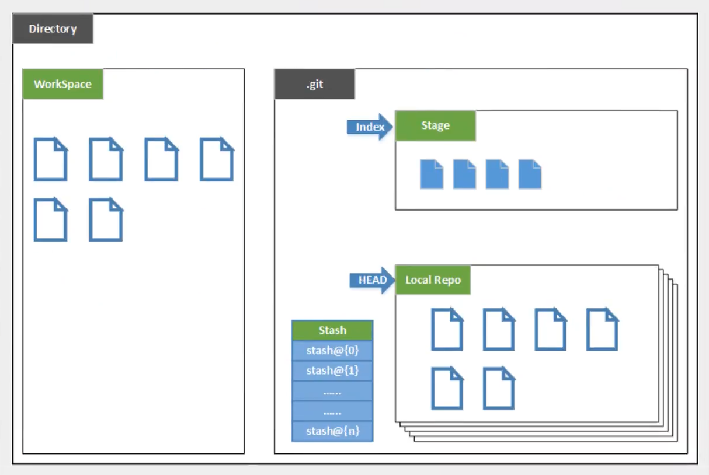

- Directory:使用Git管理的一个目录，也就是一个仓库，包含我们的工作空间和Git的管理空间。
- Workspace：需要通过Git进行版本控制的目录和文件。
- .git：存放Git管理信息的目录，初始化仓库时自动创建。
- Index/Stage:暂存区或者待提交更新区。在提交进入repo前，我们可以把所有的更新放在暂存区。
- Local Repo:本地仓库，一个存放在本地的版本库；HEAD指向当前的开发分支。
- Stash:隐藏，是一个工作状态保存栈，用于保存/恢复WorkSpace的临时状态。

## 3.2 工作流程

1. 在工作目录中添加、修改文件

2. 将需要进行版本控制的文件放进暂存区域

3. 将暂存区域的文件提交到Git仓库。

   因此，Git管理的文件有三种状态：已修改(modified)、已暂存(staged)、已提交(commited)。

   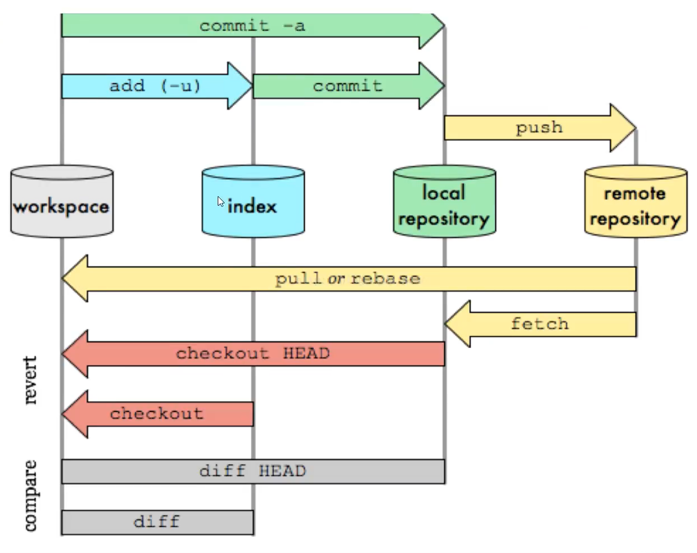

# 4. Git项目搭建

## 4.1 创建工作目录和常用命令

​		工作目录一般就是你希望Git帮忙管理的文件夹，可以是项目的目录，也可以是一个空目录，建议不要有中文。

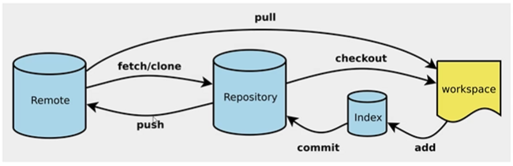

## 4.2 本地仓库搭建

​		创建本地项目的方法有两种：一种是创建全新的仓库，另一种是克隆远程仓库。

- 创建全新的仓库，需要在Git管理的项目的根目录执行

  ```shell
  $ git init #在当前目录创建一个Git仓库
  ```

  命令执行后，文件夹会多出一个.git目录，关于版本的所有信息都在这个文件夹里。

- 克隆远程仓库

  ```shell
  $ git clone [url]
  ```

# 5. Git文件操作

## 5.1 文件的4种状态

- **Untracked**:未跟踪。此文件在文件夹中，但是并没有添加到Git仓库，不参与版本控制。可以通过`git add`状态变为`Staged`。
- **Unmodified**:未修改。文件已经入库，版本库中的文件快照内容和文件夹中的完全一致。如果文件被修改，状态变为`Modified`；如果使用`git rm`移出版本库，状态变为`Untracked`。
- **Modified**:已修改。可通过`git add`变为`Staged`状态；可通过`git checkout`丢弃修改，返回`Unmodified`状态。
- **Staged**:暂存状态。通过`git commit`将修改同步到Git仓库，状态变为`Unmodified`；通过`git reset HEAD filename`取消暂存，状态变为`Modified`。

## 5.2 查看文件状态

```shell
git status [filename] #查看指定文件状态
git status #查看所有文件状态
```

## 5.3 忽略文件

​		有些时候我们不想把某些文件纳入版本控制，比如数据库文件、临时文件、设计文件等等。

​		在项目的根目录下建立`.gitignore`文件，该文件有如下规则：

- 忽略文件中的空行或以井号（#）开始的行会被忽略
- 可以使用Linux通配符。如：星号（\*）代表任意多个字符，问号（？）代表任意一个字符，方括号（[]）代表可选字符范围，大括号（{}）代表可选的字符串。
- 如果过名称的最前面有一个感叹号（！），表示例外规则，将不被忽略。
- 如果名称的最前面是一个路径分隔符（/），表示要忽略的文件在此目录下，而子目录的文件将不忽略。
- 如果名称的最后面是一个路径分隔符（/），表示要忽略的是此目录下该名称的子目录，而非该目录下的文件。
- 默认文件和子目录通通忽略。

```shell
#为注释
*.txt		#忽略所有.txt结尾的文件
!lib.txt	#不忽略lib.txt
/temp		#忽略temp文件夹下的所有文件，但不忽略子目录中的文件
build/		#忽略build文件夹下的所有子目录，但不忽略build文件夹下的文件
doc/*.txt	#忽略doc文件夹中的.txt结尾的文件，但不忽略子目录下的.txt结尾的文件
```

# 6. 使用码云

​		使用GitHub时，国内的用户经常遇到的问题是访问速度太慢，有时候还会出现无法连接的情况（原因你懂的）。

​		如果我们希望体验Git飞一般的速度，可以使用国内的Git托管服务——[Gitee](https://gitee.com/?utm_source=blog_lxf)（[gitee.com](https://gitee.com/?utm_source=blog_lxf)）。

​		和GitHub相比，Gitee也提供免费的Git仓库。此外，还集成了代码质量检测、项目演示等功能。对于团队协作开发，Gitee还提供了项目管理、代码托管、文档管理的服务，5人以下小团队免费。

## 6.1 注册Gitee账号

​		按照常规方法注册即可。

## 6.2 上传SSH公钥

​		Gitee 提供了基于SSH协议的Git服务，在使用SSH协议访问仓库之前，需要先配置好账户/仓库的SSH公钥。

### 6.2.1 生成SSH公钥

​		使用如下命令生成sshkey：

```shell
ssh-keygen -t ed25519 -C "xxxxx@xxxxx.com"  
```

​		其中xxxxx@xxxxx.com为个人邮箱，填写自己的邮箱即可。

​		按照提示完成三次回车，即可生成 ssh key。生成的文件内容位于C盘用户主目录的`.ssh`文件夹下。

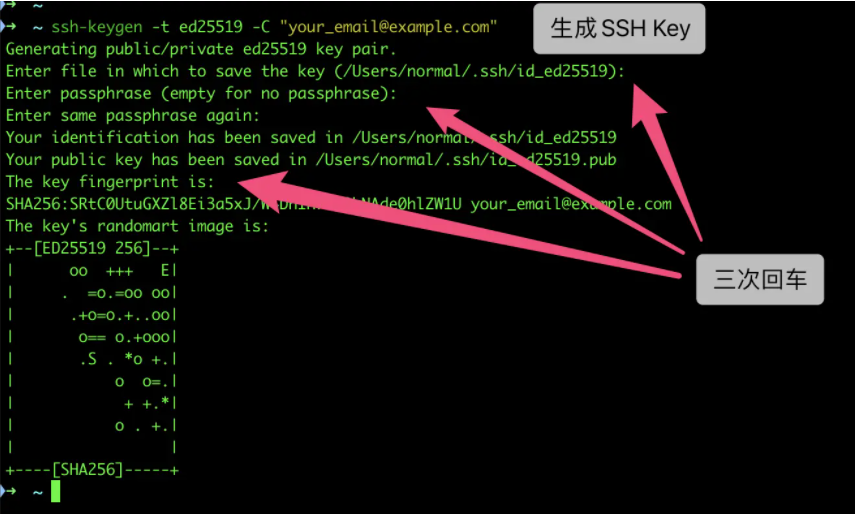

### 6.2.2 上传SSH公钥

​		选择右上角用户头像 -> 菜单“修改资料”，然后选择“SSH公钥”，填写一个便于识别的标题，我们需要把`.ssh`文件夹下的后缀为`.pub`的文件内容复制粘贴进去：

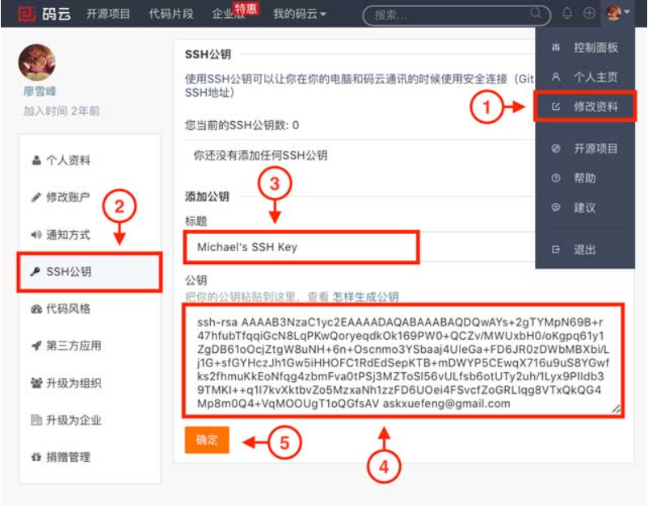

​		点击“确定”即可完成并看到刚才添加的Key：

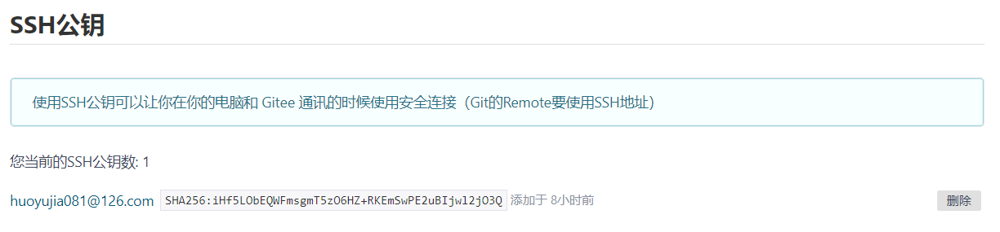

## 6.3 在Gitee中新建一个仓库

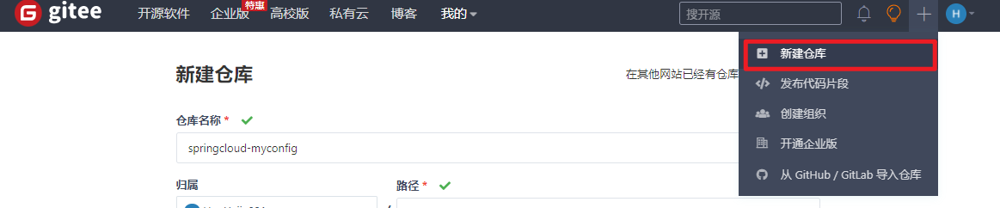

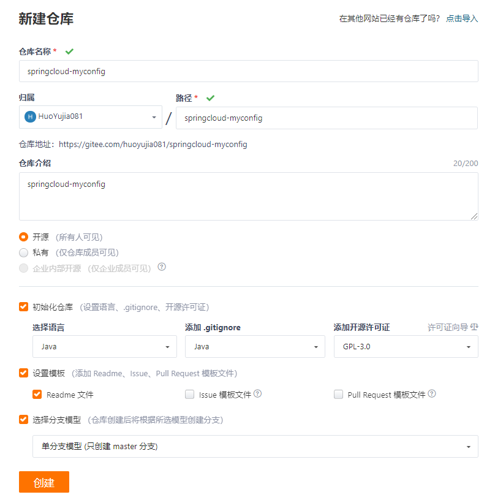

## 6.4 将在Gitee创建的仓库克隆到本地Git仓库

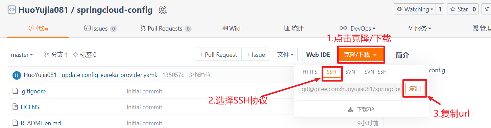

​		在本地已初始化的Git仓库中，输入如下命令进行仓库的克隆：

```shell
git clone git@gitee.com:huoyujia081/springcloud-config.git
```

​		最后一部分是从Gitee中复制而来。

# 7. idea集成Git

## 7.1 新建项目，绑定Git

### 7.1.1 新建一个空的文件夹，用于存放项目源代码

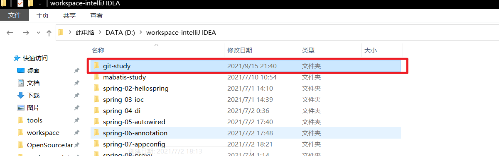

### 7.1.2 将文件夹交给Git进行管理

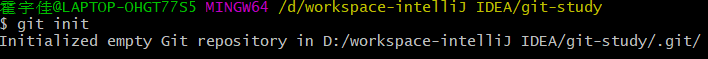

### 7.1.3 在idea中新建一个项目

​		建项目的时候，项目所在的文件夹需要与7.1.2中进行Git初始化的文件夹保持一致。

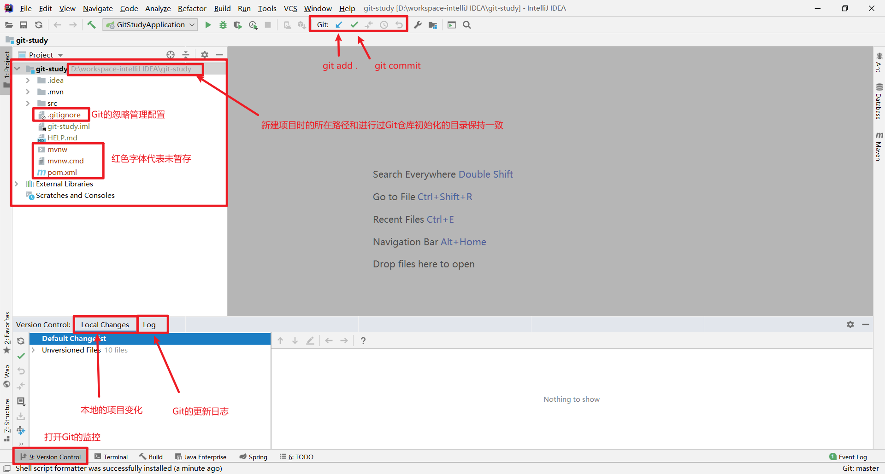

### 7.1.4 将项目绑定Gitee

​		上面这样的方法已经默认绑定Git，但是如果需要绑定Gitee，应该怎么办呢？

​		最简单的方法是在Gitee中新建一个仓库，然后将仓库克隆得到的内容原封不动地复制到项目的文件夹中。

## 7.2 测试

1. 添加到缓存区
2. commit提交
3. push到远程仓库

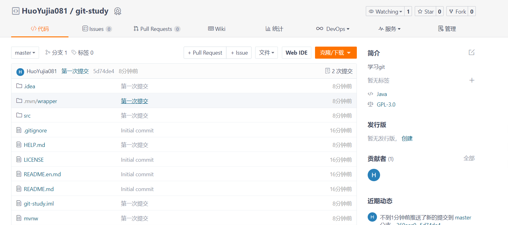

# 8. Git分支

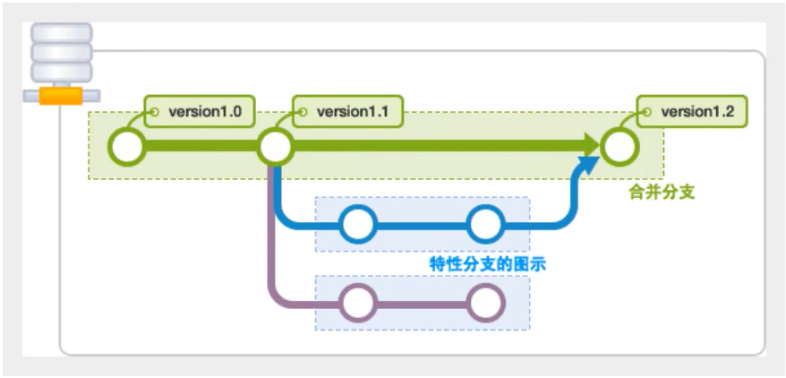

​		一般来说，两个平行的分支不会有影响，但是如果两个分支中有部分交集（即都调用同一部分代码并且都修改了这部分代码），那么就需要处理一些问题。

```shell
#列出所有本地分支
git branch

#列出所有远程分支
git branch -r
#新建一个分支，但依旧停留在当前分支
git branch [branch-name]

#新建一个分支，并切换到该分支
git checkout -b [branch]

#合并指定分支到当前分支
git merge [branch]

#删除分支
git branch -d [branch-name]

#删除远程分支
git push origin --delete [branch-name]
git branch -dr [remote/branch]
```

​		如果同一个文件在合并分支时都被修改了，则会引起冲突。解决的方法是我们可以修改冲突文件后重新提交（选择保留它的代码还是你的代码）。

​		master主分支应该非常稳定，用来发布新版本。

​		dev分支一般用于开发（稳定后可以合并到master）。

​		test分支一般用于测试。
