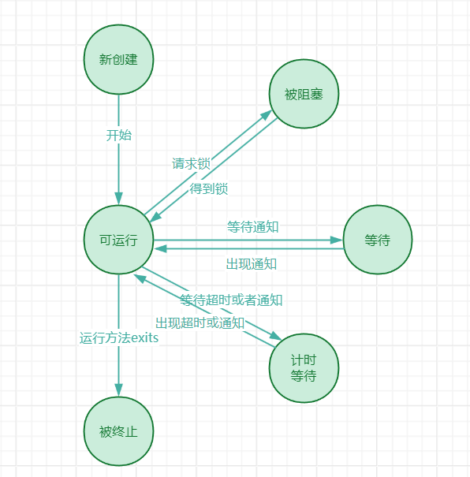
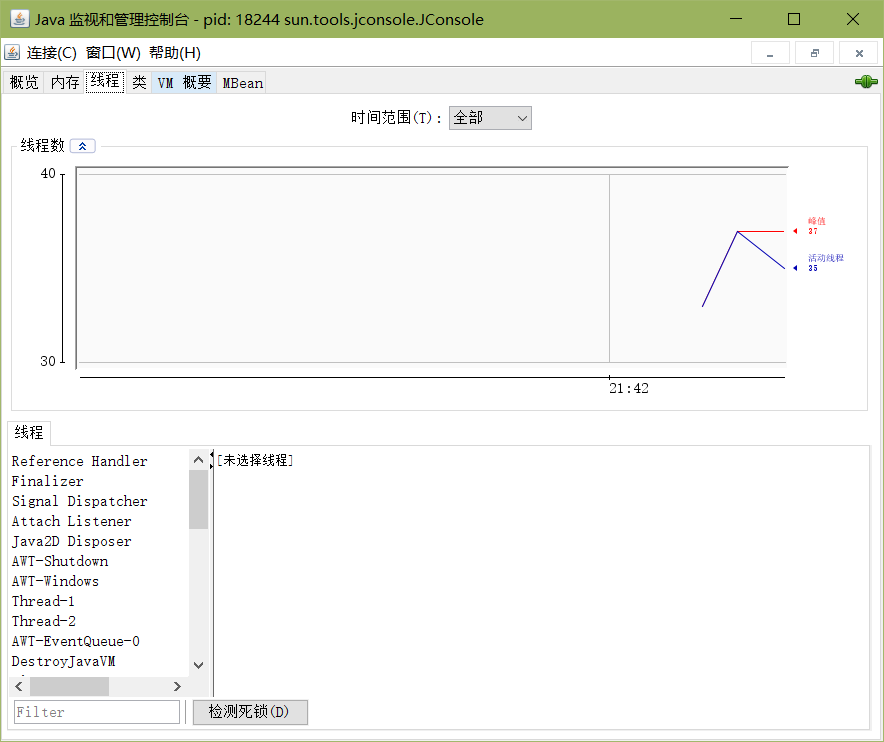

多线程和多进程的区别：

- 每个进程拥有自己的一整套变量，而线程共享数据，因此线程之间的通信比进程之间的通信更高效。
- 与进程相比，线程更加轻量级，创建撤销一个线程的开销要比创建撤销进程更小。

# 14.1 什么是线程

创建线程的一般流程：

1. 将任务代码移动到实现了Runnable接口的类的run方法中。如下，在Runnable接口中只有一个方法：

   ```java
   @FunctionalInterface
   public interface Runnable {
       void run();
   }
   ```

   由于Runnable是一个函数式接口，因此可以使用Lambda表达式创建其一个实例：

   ```java
   Runnable r = () -> {
       ......
   };
   ```

2. 创建一个Thread对象，其参数为1中创建的Runnable实例：

   ```java
   Thread t = new Thread(r);
   ```

3. 启动线程：

   ```java
   t.start();
   ```

> [!NOTE]
>
> 也可以通过构建Thread类的一个子类定义一个线程，并且重写其run方法，如下：
>
> ```java
> public class MyThread extends Thread {
>     public void run() {
>         ......
>     }
> }
> ```
>
> 然后构建一个子类的对象，并调用start方法，如下：
>
> ```java
> new MyThread().start();
> ```
>
> 不过这种方法一般不推荐使用：
>
> 1. 可以实现多个接口，但是只能继承一个类。如果实现Runnable接口，还可以继承其他类；但是如果继承Thread类，就无法再继承其他类。
> 2. 应该将任务和任务运行的机制相区分。
> 3. 实现Runnable接口，可以使用线程池中的线程执行任务。

> [!WARNING]
>
> 不能够直接调用Thread类或者Runnable接口的实例的run方法。如果直接调用run方法并不会创建一个新的线程，而是将其视为一个普通方法执行一次。

# 14.2 中断线程

线程终止的情形：

1. run方法执行完最后一条指令
2. 出现了线程中没有捕获的异常
3. 线程自身执行stop方法（已弃用）
4. **利用线程中断interrupt[^1]请求终止线程**

## 判断中断状态是否被置位

首先调用静态方法`Thread.currentThread()`方法获得当前线程，然后调用`isInterrupted()`[^2]方法，一般的用法如下：

```java
while (!Thread.currentThread().isInterrupted()) {
    ......
    if (......) {
        Thread.currentThread().interrupt();
    }
    ......
}
```

> [!IMPORTANT]
>
> 通常来说，中断并不意味着线程终止，但是普遍用法是将中断视为线程终止的信号，如下：
>
> ```java
> Runnable r = () -> {
>     try {
>         ...
>         while (...) {
>             if (......) {
>         		Thread.currentThread().interrupt();
>             }
>             ...
>             Thread.sleep(1000); // 清除中断置位，并且抛出InterruptedException异常
>         }
>     } catch (InterruptedException e) {
>         // thread was interrupted during sleep();
>     } finally {
>         clean up
>     }
> }
> ```

与`isInterrupted()`方法非常类似，Thread类的静态方法`interrupted()`[^3]方法也常用来检测中断状态，只不过该方法会清除线程的中断状态。


## 子方法处理InterruptedException的一般方法

- 在catch子句中调用`Thread.current().interrupt()`方法来设置中断状态，让方法的调用者来检测

  ```java
  void mySubTask() {
      ...
      try {
          sleep(1000);
      } catch(InterruptedException e) {
          Thread.current().interrupt();
      }
      ...
  }
  ```

- 使用`throws InterruptedException`标记方法，让调用者（一般是最终的run方法）来捕获异常

  ```java
  void mySubTask throws InterruptedException() {
      sleep(1000);
  }
  ```

# 14.3 线程状态

线程有6种状态：New（新创建）、Runnable（可运行）、Blocked（被阻塞）、Waiting（等待）、Timed Waiting（计时等待）、Terminated（被终止）。

- New（新创建）：调用`new Thread()`创建一个新的线程后，该线程还没有开始运行，此时该线程处于New状态。

- Runnable（可运行）：一旦线程调用`start`方法，该线程则处于Runnable状态。

> [!NOTE]
>
> 一个处于Runnable状态的线程既有可能正在运行，也有可能没有运行，这取决于线程是否拿到CPU资源。
>
> 这也正是该状态称为“可运行”而不是“运行”的原因。

- Blocked（被阻塞）：当一个线程试图获得一个内部锁[^4]，但是该锁被其他线程所占有，则该线程处于Blocked状态。一旦其他线程释放锁，该线程若获得锁则会回到Runnable状态。

- waiting（等待）：在调用某个对象的`wait()`[^5]或者某个线程的`join()`[^6]方法，或者等待`java.util.concurrent`库中的`Lock`或`Condition`时，线程进入Waiting状态。

- Timed Waiting（计时等待）：当线程调用带有超时参数的方法，如`Thread.sleep`、`Object.wait`、`Thread.join`、`Lock.tryLock`、`Condition.await`，线程就会进入Timed Waiting状态，直至超时期满或者收到通知为止。

- Terminated（被终止）：线程进入Terminated状态的条件：run方法正常退出而正常死亡或出现没有被捕获的异常。除此之外，调用线程的`stop()`方法也可以杀死进程，不过该方法已经过时。




# 14.4 线程属性

## 14.4.1 线程优先级

可以使用`setPriority()`[^7]方法设置线程的优先级，在Java中线程的优先级从低到高为1~10。

> [!WARNING]
>
> Java线程优先级高度依赖于系统，Java的优先级会映射到宿主机平台的优先级上，优先级个数可能更多，也可能更少，如Windows有7个优先级，而Linux中所有的线程具有相同的优先级。
>
> 因此，**如果想要某个线程的优先级提高，最好不要寄希望于设置优先级。**

## 14.4.2 守护线程

可以通过`t.setDaemon(true)`[^8]来将线程转换为守护线程。守护线程就是为其他线程提供服务的线程，若程序只剩下守护线程在执行，则虚拟机会自动退出。

> [!TIP]
>
> 守护线程不应该访问文件或者数据库等持久性资源，因为守护线程不确定自己是否会在哪一个时刻中断。

## 14.4.3 未捕获异常处理器

线程的run方法无法抛出任何异常，并且非受查异常（RuntimeException）会导致线程终止。在线程终止之前，异常会被传递到一个未捕获异常处理器。该处理器必须实现`Thread.UncaughtExceptionHandler`接口，该接口内容如下：

```java
@FunctionalInterface
public static interface Thread.UncaughtExceptionHandler {
    void uncaughtException(Thread t, Throwable e);
}
```

安装未捕获异常处理器的方法：

- 创建一个实现`Thread.UncaughtExceptionHandler`接口的类实例，使用`setUncaughtExceptionHandler`[^9]方法设置处理器。
- 若线程所属某个线程组，则调用线程的ThreadGroup对象的uncaughtException方法
- 使用`Thread.setDefaultUncaughtExceptionHandler`[^10]方法为所有线程安装一个默认处理器。

> [!CAUTION]
>
> 从下至下，依次判断：
>
> 1. 线程已安装的处理器
> 2. 线程组对象处理器
> 3. 所有线程的默认处理器
> 4. 异常是ThreadDeath实例，不作处理
> 5. 输出异常到System.err


# 14.5 同步

考虑银行转账操作：

```java
public void transfer(int from, int to, double amount) {
    if (accounts[from] < amount) {
        return;
    }
    accounts[from] -= amount;
    System.out.println("10.2f from %d to %d", amount, from, to);
    accounts[to] += amount;
    System.out.println("Total balance: %10.2f", getTotalBalance());
} 
```

显然，该转账操作不是原子操作。`accounts[to] += amount`语句实际上是由以下步骤完成：

1. 将accounts[to]加载到寄存器
2. 增加amount
3. 将寄存器结果写回到accounts[to]

假设线程1执行了1、2两个步骤。此时线程被剥夺执行权，由线程2执行步骤1、2、3。最后线程1执行步骤3。那么线程1的写回操作会覆盖线程2的操作，导致银行总金额错误。

> [!NOTE]
>
> 如果删除打印语句，那么出现错误的概率会少一点，因为打印语句的工作量大，有可能会在线程方法执行完成前剥夺执行权；如果工作量小，CPU可能会等待线程方法执行结束才会切换线程。
>
> 不过这并不影响上面程序是错误的，错误迟早都会发生。

## 14.5.1 锁对象

Java的`java.util.concurrent`库中有一个可重入锁`ReentrantLock`类，其保护代码块的基本结构如下：

```java
Lock myLock = new ReentrantLock(); // 成员变量，以便多个线程共享锁

public void run() {
    myLock.lock(); // 上锁
    try {
        临界区
    } finally {
        myLock.unlock(); // 解锁
    }
}
```

之所以说锁是可重入的，是因为同一个线程可以重复获得已获得的锁。锁对象有一个持有计数（hold count）来跟踪lock方法的嵌套使用。相同的线程每调用一次锁的lock方法，持有计数就会加1；每调用一次锁的unlock方法，持有计数就会减1。当锁的持有计数为0时。线程就会释放锁。因此，已经获得锁的代码可以调用另外一个使用相同锁的方法。

> [!NOTE]
>
> 可以通过构造方法`public ReentrantLock(boolean fair)`构造一个公平锁。
>
> 公平锁偏爱等待时间最长的线程，但是程序性能会大大降低。并且即使使用了公平锁也无法保证绝对公平，调度哪个线程还是由线程调度器决定。

## 14.5.2 条件变量

如果线程进入临界区后发现仍需某个条件才能继续往下执行，此时如果继续占用锁会造成资源的浪费，因此线程想要释放锁，直到条件满足才继续往下执行。这种情况需要用到条件变量。

一个锁对象可以有一个或多个条件变量。可以使用`newCondition`方法获得一个条件变量。和锁类似，条件变量也是多线程共享，因此要把条件变量作为成员变量而不是局部变量。

使用条件变量的一般流程如下，仍以银行转账为例，若转出账户余额小于转出金额，则线程阻塞：

```java
public void transfer(int from, int to, double amount) {
    myLock.lock();
    try {
        while (accounts[from] < amount) {
            sufficientFund.await(); // 等待条件变量满足，阻塞线程，一旦条件满足，该线程竞争CPU成功后继续从此处开始执行
        }
        /*转账*/
        accounts[from] -= amount;
   	 	System.out.println("10.2f from %d to %d", amount, from, to);
    	accounts[to] += amount;
        System.out.println("Total balance: %10.2f", getTotalBalance());
        
        sufficientFund.signalAll(); // 唤醒等待条件变量满足的所有线程
    } finally {
        myLock.unlock();
    }
} 
```

> [!TIP]
>
> 通常条件变量的阻塞应该在一个循环体内：
>
> ```java
> while (条件不满足) {
>     condition.await();
> }
> ```

除了`signalAll`[^11]方法外，还有`signal`[^12]方法也可以唤醒等待条件变量满足的线程，只不过`signal`只能唤醒某一个阻塞线程。如果随机选择的线程仍然不能满足条件，则会继续阻塞。如果没有任何一个线程可以调用`signal`方法，那么程序就会进入死锁。


## 14.5.3 synchronized关键字

如果一个方法使用`synchronized`关键字声明，那么对象的锁将保护整个方法。如下

```java
public synchronized void method() {
    method body
}
```

等价于

```java
public void method() {
    this.intrinsicLock.lock();
    try {
        method body
    } finally{
        this.intrinsicLock.unlock();
    }
}
```

用`synchronized`关键字获得的锁也成为内部对象锁，该锁只有一个条件。`wait`方法添加一个线程到等待集中，`notifyAll/notify`方法解除等待线程的阻塞状态。

将静态方法声明为`synchronized`也是合法的。如果调用这个方法，该方法获得相关的class对象的内部锁。

> [!TIP]
>
> - 最好既不使用Lock/Condition也不使用synchronized关键字。最好是使用`java.util.concurrent`包中的一些机制处理所有的锁。
> - 如果sychronized关键字适合，则使用sychronized关键字。
> - 其他情况使用Lock/Condition机制。

除了使用`synchronized`关键字修饰方法，还可以直接在方法中使用`synchronized`：

```java
Object obj = new Object;
public void method() {
    ...;  
    synchronized(obj) {
        method body;
    }
    ...;
}
```

## 14.5.4 监视器

监视器概念是计算机多线程领域的概念，用Java来解释如下：

- 监视器是只包含私有域的类。
- 每个监视器类的对象都有一个相关的锁。
- 使用该锁对所有的方法加锁，这样可以确保一个线程访问某个域时，没有其他线程可以访问域。
- 该锁可以有任意多个条件。

但是Java只满足每个监视器类的对象都有一个内部锁，其他三个方面都不满足。

## 14.5.5 volatile域

引入`volatile`关键字的原因：

- 多处理器的计算机能够暂时在寄存器或者缓冲区保存内存中的值
- 编译器可能会改变程序指令执行的顺序以提高程序执行的效率

以上可能导致程序出现意想不到的错误，所以引入`volatile`关键字以提醒编译器和虚拟机——该域很有可能被多个线程修改，要求在必要的时候刷新缓存，并且不能随意更改程序指令的顺序。

> [!TIP]
>
> `volatile`主要用于标记那些可能会被多个线程并发访问和修改的变量，尤其是那些不需要加锁的简单变量。但是，如果涉及到复合操作或者需要更复杂的同步控制，那么应该考虑使用其他的同步机制。

## 14.5.6 final域

将域声明为`final`后，其他线程会在构造函数结束后才会看到该域。

```java
final Map<String, Double> accounts = new HashMap<>();
```

如果不使用`final`，就不能保证其他线程看到的是新构造的HashMap，而有可能是null。

## 14.5.7 原子性

`AtomicInteger`类提供了方法`increamentAndGet`和`decrementAndGet`，会以原子方式将一个整数自增或者自减。即获得值、加1、生成新值的操作不会中断。

```java
public static AtomicInteger num = new AtomicInteger(0); // 线程共享变量，初始值为0

// 在某些线程里
int id = num.incrementAndGet();
```

如果是希望以某个复杂函数来读取并更新值，可以使用`updateAndGet`[^13]方法或者`accumulateAndGet`[^14]方法，如下观察不同线程间得到的最大值：

```java
public static AtomicInteger largest = new AtomicInteger(); // 线程共享变量

// 在某些线程里
int max = largest.updateAndGet(x -> Math.max(x, observed)); // 将largest更新为原值和observed之间的最大值

// 在某些线程里
int max = largest.accumulateAndGet(observed, Math::max); // 将largest更新为原值和observed之间的最大值
```

如果有大量线程要访问原子值，按照上面的方法可能性能较差。可以使用`LongAdder`类和`LongAccumulator`类来解决，并且保证原子性。

`LongAdder`包括多个加数，不同的线程会自动分配不同的加数，线程个数增加时会自动提供新的加数，如下：

```java
final LongAdder adder = new LongAdder();

// 在某些线程中
adder.increment(); // 改变变量值

// 汇总
long total = adder.sum();
```

`LongAccumulator`是`LongAdder`的扩展，可以应用于某个函数，这个函数会以原子方式操作，如下：

```java
final LongAccumulator adder = new LongAccumulator(Long::sum, 0);

// 在某些线程中
adder.accumulate(value); // 改变变量值

// 汇总
long total = adder.get();
```

在`LongAccumulator`的构造方法中，第一个参数可以理解为操作符op，第二个参数可以理解为每个变量的初始值ai。调用`accumulate`会对某个ai计算ai=ai+v。`get`的结果为`a0 op a1 op ... op an`。

`DoubleAdder`和`DoubleAccumulator`与上述类同理。


## 14.5.8 死锁Deadlock

当程序发生死锁时，可以使用`jconsole`参考线程面板，观察每个线程发生死锁的位置。



## 14.5.9 线程局部变量ThreadLocal

`ThreadLocal`通常用于线程之间避免共享变量。

> [!TIP]
>
> 通常线程局部变量定义在静态成员位置，并且使用final修饰

```java
public static final ThreadLocal<SimpleDateFormat> dateFormat = ThreadLocal.withInitial(() -> new SimpleDateFormat("yyyy-MM-dd")); // 初始化线程局部变量

// 在某个线程中
SimpleDateFormat sdf = dateFomat.get(); // 获取本线程的线程局部变量
```

静态方法`ThreadLocal.withInitial`[^15]中的参数为返回值为泛型类型的无参方法。在某个线程首次调用`get`方法时会调用该方法，并且该线程在之后的`get`方法会返回初次调用创建的实例。

> [!IMPORTANT]
>
> ThreadLocal与run方法中的局部变量
>
> - ThreadLocal相当于每个线程的成员变量，每个线程方法都可以直接访问，不用进行传递。
> - run方法中的局部变量只能在run方法中使用，除非进行传参。
>
> 可以把ThreadLocal视为每个线程不共享的成员变量。


## 14.5.10 锁测试tryLock和超时

`tryLock`[^16]方法和`lock`方法很类似，都是申请锁。但是`lock`方法若没有获得锁，线程会发生阻塞；而`tryLock`方法若没有获得锁，会返回false。

```java
if (myLock.tryLock()) { // 线程获得锁
    try {
        method body;
    } finally {
        myLock.unlock();
    }
} else { // 线程没有获得锁
    method body;
}
```

`lock`方法若使用不当很容易造成死锁，并且阻塞时无法被中断。

而带超时参数的`tryLock`[^17]方法，如果在等待时发生中断，会抛出`InterruptedException`，可以利用这一特性打破死锁。`lockInterruptibly`[^18]方法相当于超时设为无限的`tryLock`方法，可以用其检测中断。


## 14.5.11 读/写锁ReentrantReadWriteLock

读写锁可以用于解决读者/写者问题。使用读写锁的步骤如下：

1. 构造一个`ReentrantReadWriteLock`对象

   ```java
   private ReentrantReadWriteLock rwl = new ReentrantReadWriteLock();
   ```

2. 抽取读锁和写锁

   ```java
   private Lock readLock = rwl.readLock();
   private Lock writeLock = rwl.writeLock();
   ```

3. 对所有的获取方法加读锁

   ```java
   public double getTotalBalance() {
       readLock.lock();
       try {
           method body;
       } finally {
           readLock.unlock();
       }
   }

4. 对所有的修改方法加写锁

   ```java
   public void transfer(int from, int to, int amount) {
       writeLock.lock();
       try {
           method body;
       } finally {
           writeLock.unlock();
       }
   }
   ```

# 14.6 阻塞队列BlockingQueue

| 方法    | 正常动作               | 特殊情况下的动作                               |
| ------- | ---------------------- | ---------------------------------------------- |
| add     | 添加一个元素           | 如果队列满，则抛出`IllegalStateException`异常  |
| remove  | 移出并返回头元素       | 如果队列空，则抛出`NoSuchElementException`异常 |
| element | 返回队列的头元素       | 如果队列空，则抛出`NoSuchElementException`异常 |
| offer   | 添加一个元素并返回true | 如果队列满，返回false                          |
| poll    | 移出并返回头元素       | 如果队列空，返回null                           |
| peek    | 返回队列头元素         | 如果队列空，返回null                           |
| put     | 添加一个元素           | 如果队列满，则阻塞                             |
| take    | 移出并返回头元素       | 如果队列满，则阻塞                             |

如果把队列当作线程管理工作来使用，推荐使用`put`和`take`方法。

`java.util.concurrent`包提供了阻塞队列的几个变种：

- `LinkedBlockingQueue`：容量没有上边界，当然也可以指定上边界。
- `LinkedBlockingDeque`：双端阻塞队列，可以从阻塞队列队头或者队尾存取元素。
- `ArrayBlockingQueue`：构造时需要指定容量，并且可以指定是否需要公平性（等待时间最长的线程优先使用）
- `PriorityBlockingQueue`：带优先级的队列，按照元素的优先级被移出。同样没有容量上限。
- `DelayQueue`：所包含的元素是实现`Delayed`接口的对象，元素只有在延迟用完的情况下才可以从队列中删除，但是对peek方法无影响。
- `TransferQueue`：允许生产者线程等待，直到消费者准备就绪接收元素。也就是有消费者线程在`take`方法阻塞，生产者线程才会退出`transfer`方法的阻塞状态。

# 14.7 线程安全的Collection

`java.util.concurrent`包提供Map、TreeSet、Queue的并发高效实现，通过允许并发地访问结构的不同部分实现竞争最小化。

`ConcurrentLinkedQueue`：可以被多线程安全访问的无边界非阻塞队列。

`ConcurrentSkipListSet`：可以被多线程安全访问的TreeSet。

`ConcurrentHashMap`：可以被多线程安全访问的HashMap。

`ConcurrentSkipListMap`：可以被多线程安全访问的TreeMap。

> [!NOTE]
>
> 如果多个线程同时修改一个普通的HashMap，它们会破坏内部结构（链表数组或者红黑树数组），使得结构不再可用。

## 14.7.1 `ConcurrentHashMap`的原子更新

对于普通的HashMap的值更新，显然以下不是原子操作：

```java
map.put(key, map.getOrDefault(key, 0) + 1);
```

有几种方法可以实现`ConcurrentHashMap`原子更新：

- 使用`replace`[^19]操作，replace替换成功的前提是没有其他线程把原值替换为其他值。

  ```java
  do {
      oldValue = map.get(key);
      newValue = oldValue == null ? 1 : oldValue + 1;
  } while (!map.replace(key, oldValue, newValue));
  ```

- 值使用原子类型，如`AtomicLong`或者`LongAdder`。

  ```java
  ConcurrentHashMap<String, AtomicLong> map = new ConcurrentHashMap<>();
  
  map.putIfAbsent(key, new AtomicLong()); // 确保不会出现空指针异常
  map.get(key).increment();
  /*或者*/
  map.putIfAbsent(key, new AtomicLong()).increment(); // putIfAbsent返回与指定键相关联的上一个值
  ```

- 使用`compute`[^20]或者`computeIfAbsent`[^21]操作。

  ```java
  map.compute(key, (k, v) -> v == null ? 1 : v + 1);
  /*或者*/
  map.computeIfAbsent(key, k -> new LongAdder()).increment(); // 和putIfAbsent方法类似，只不过computeIfAbsent可以将键作为参数传递给函数
  ```

- 使用`merge`[^22]操作。

  ```java
  map.merge(key, 1L, (existingValue, newValue) -> existingValue + newValue);
  /*或者*/
  map.merge(key, 1L, Long::sum);
  ```

> [!WARNING]
>
> 如果传入compute或者merge的函数返回null，将会从map中删除该键值对。

## 14.7.2 `ConcurrentHashMap`的批操作

`ConcurrentHashMap`的所有批操作，都需要指定一个参数化阈值，只有map的键值对超过阈值，才会启动多个线程并行完成批操作。如果只希望一个线程处理批操作，可以将阈值设为Long.MAX_VALUE；如果希望尽可能使用并发操作，可以将阈值设为1。

对于批操作，有3种不同的操作：

- 搜索（search）：为每个键或者值提供一个函数，直到函数生成非null的结果，此时搜索终止，返回函数的结果。
- 归约（reduce）：组合所有键或值。
- 遍历（forEach）：为所有键或值提供一个函数。

每个操作有4种不同的版本，假设操作为*operation*，则有

- *operation*Keys：处理键
- *operation*Values：处理值
- *operation*：处理键值
- *operation*Entries：处理Map.Entry对象

```java
ConcurrentHashMap<String, Long> map = new ConcurrentHashMap<>();

/*希望找出第一个出现次数超过1000的单词，如果不存在返回null*/
String result = map.search(threshold, (k, v) -> v > 1000 ? k : null);

/*输出所有键值对*/
map.forEach(threshold, (k, v) -> System.out.println(k + "->" + v));
map.forEach(threshold, (k, v) -> k + "->" + v, System.out::println); // 第二个参数是转换函数，结果传递给第三个参数

/*输出出现次数超过1000的单词以及出现次数*/
map.forEach(threshold, (k, v) -> v > 1000 ? k + "->" + v : null, System.out::println); // 第二个参数如果返回null，则会跳过该键值对

/*计算所有单词总共的出现次数*/
Long sum = map.reduceValues(threshold, Long::sum);

/*计算最长单词的长度*/
Integer maxLength = map.reduceKeys(threshold, String::length, Integer::max);

/*统计出现次数超过1000的单词个数*/
long count = map.reduceValues(threshold, v -> v > 1000 ? 1L : null, Long::sum);
```

## 14.7.3 并发Set

实际上，`java.util.concurrent`并没有提供`ConcurrentHashSet`类。

可以使用`ConcurrentHashMap`的键模拟HashSet。`ConcurrentHashMap.<K>newKeySet`方法会生成一个类型为`Set<K>`，可以理解为键的视图，其底层在map中的值默认为`Boolean.TRUE`。

```java
Set<String> set = ConcurrentHashMap.<String>newKeySet(); // 之后可以把set看作并发安全的Set
```

## 14.7.4 写数组的拷贝CopyOnWriteArray

`CopyOnWriteArrayList`以及`CopyOnWriteArraySet`都是线程安全的Collection，可以理解为线程安全的`ArrayList`和线程安全的`Set`。

其底层使用数组存储，所有的修改线程都是对底层数组进行复制，在复制上进行修改。通常用于在Collection上进行遍历的线程远远多于进行修改的线程的情形。在进行遍历时，遍历的线程很有可能拿到的是过时的视图。

## 14.7.5 并行数组算法

`Arrays`类提供了大量并行操作，例如`parallelSort`[^23]方法用于对数组启动多个线程进行排序，`parallelSetAll`[^24]启动多个线程使用函数计算的值填充数组。

```java
int[] arr = new int[100];
Arrays.parallelSetAll(arr, i -> i % 3); // 最终的填充结果为0,1,2,0,1,2,0,1,2...
```

`parallelPrefix`方法会用一个给定结合操作的前缀的累加结果替换各个数组元素。

```java
int[] arr = new int[]{1, 2, 3, 4, ...};
Arrays.parallelPrefix(arr, (x, y) -> x * y); // arr数组将变为{1, 1 * 2, 1 * 2 * 3, 1 * 2 * 3 * 4, ...}
```

## 14.7.6 同步包装器

程序需要确保没有任何线程通过原始的非同步方法访问数据结构，任何集合类都可以通过使用同步包装器来实现线程安全：

```java
List<Integer> list = Collections.synchronizedList(new ArrayList<>());
Map<String, Integer> map = Collections.synchronizedMap(new HashMap<>());
```

> [!WARNING]
>
> 如果在另一个线程可能进行修改时要进行遍历，仍然需要使用客户端锁定（手动实现同步）：
>
> ```java
> synchronized(map) {
>     Iterator<String> it = map.keySet().iterator(); // foreach同理
>     while (it.hasNext()) {
>         ...
>     }
> }
> ```

> [!NOTE]
>
> 最好是使用`java.util.concurrent`包中的线程安全Collection，其效率远远高于同步包装器包装的Collection。除了经常被修改的`ArrayList`，使用同步包装器包装过的`ArrayList`速度要高于`CopyOnWriteArrayList`

# 14.8 Callable与Future

`Callable`和`Runnable`类似，一样是任务，只不过`Callable`可以返回值。`Callable`在声明时候的泛型就是返回值的类型。

`Future`保存异步计算的结果，可以把`Futrue`交给某个线程，然后执行其他操作，在结果计算好后就可以获得它。`Future`接口内容如下：

```java
public interface Future<V> {
    
    boolean cancel(boolean mayInterruptIfRunning); // 取消该计算。如果计算没有开始就不再开始；如果计算正在运行中，如果mayInterrupt参数为true，那么计算的线程就被中断。此方法返回后，后续调用isDone()将始终返回true。随后电话isCancelled()总是返回true如果此方法返回true。
    
    boolean isCancelled(); // 如果此任务在正常完成之前被取消，则返回true。
    
    boolean isDone(); // 如果任务已完成返回true。完成可能是由于正常终止，异常或取消 - 在所有这些情况下，此方法将返回true。
    
    V get() throws InterruptedException, ExecutionException; // 等待计算完成（阻塞），然后检索其结果。
    
    V get(long timeout, TimeUnit unit)
        throws InterruptedException, ExecutionException, TimeoutException; // 和get方法类似，只不过如果超时会抛出TimeoutException
}
```

一般使用`FutureTask`来包装`Callable`，将其转换为`Future`以及`Runnable`，如下：

```java
Callable<Integer> callable = ...;
FutureTask<Integer> futureTask = new FutureTask<>(callable); // 包装Callable
Thread t = new Thread(futureTask); // 把FutureTask作为Runnable
t.start();
...;
Integer result = futureTask.get(); // 把FutureTask作为Future
```

# 14.9 执行器Executor

## 14.9.1 线程池ThreadPool

如果程序中创建了大量生命期很短的线程，应该考虑线程池。线程池中包含大量已经创建好的准备运行的线程。将`Runnable`实例交给线程池，就会有一个空闲线程启动执行该任务。当run方法退出时，线程会回到线程池。

使用线程池的好处：

1. 减少创建线程的开销。
2. 控制并发线程的总数，避免虚拟机崩溃。

### 14.9.1.1 使用线程池的一般步骤

`Executors`类的静态方法可以创建`ExecutorService`接口的实例，如下：

| Executor类工厂方法              | 描述                                                         |
| ------------------------------- | ------------------------------------------------------------ |
| newCachedThreadPool             | 如果没有空闲的线程则创建新的线程，空闲线程会保留60秒。       |
| newFixedThreadPool              | 该线程池包含固定数量的线程，空闲的线程会一直保留。<br />如果提交的任务得不到及时处理，则会保存在队列中等待执行。 |
| newSingleThreadExcutor          | 单线程池，该线程顺序执行提交的任务。                         |
| newScheduledThreadPool          | 用于预定执行而构建的固定线程池。                             |
| newSingleThreadScheduledExcutor | 用于预定执行而构建的单线程池。                               |

`ExecutorService`接口的`submit`方法，可以将`Runnable`或者`Callable`任务交给线程池中的线程执行：

1. `Future<?> submit(Runnable task)`[^25]：虽然`Runnable`的run方法不返回结果，但submit返回的`Future<?>`可以调用`isDone`、`cancel`、`isCancelled`方法。`get`方法在线程执行完成前一样会阻塞，只不过完成后会返回null。
2. `<T> Future<T> submit(Runnable task,T result)`[^26]：和1类似，不过Future的`get`方法将在成功完成后返回给定的result。
3. `<T> Future<T> submit(Callable<T> task)`[^27]：和1类似，不过可以获得计算结果。

当使用完线程池时，调用`shutdown`关闭线程池，其中先前提交的任务将被执行，但不会接受任何新任务。 如果已经关闭，调用没有额外的作用。也可以调用`shutdownNow`，尝试停止所有主动执行的任务（中断还在执行的线程），停止等待任务的处理，并返回正在等待执行的任务列表。

使用线程池的一般步骤如下：

1. 调用`Executors`类的静态方法`newCachedThreadPool`或者`newFixedThreadPool`。
2. 调用`submit`提交`Runnable`或者`Callable`。
3. 如果想要取消任务或者获取线程结果，需要保存返回的`Future`对象。
4. 当不再提交任何任务时，调用`shutdown`关闭线程池。

### 14.9.1.2 预定执行Scheduled Execution

如果想要使用预定执行的线程池，需要调用`Executors`类的静态方法`newScheduledThreadPool`和`newSingleThreadScheduledExcutor`。与普通的线程池返回`ExecutorService`不同，这两个静态方法返回的是`ScheduledExecutorService`接口的对象。

可以预定`Runnable`或者`Callable`在初始延时之后只执行一次，也可以预定周期性执行。`ScheduledExecutorService`接口的`schedule`方法，可以将`Runnable`或者`Callable`任务交给线程池中的线程执行：

1. `<V> ScheduledFuture<V> schedule(Callable<V> callable, long delay, TimeUnit unit)`[^28]

   `ScheduledFuture<?> schedule(Runnable command, long delay, TimeUnit unit)`[^29]

   预定在指定的时间之后执行。

2. `ScheduledFuture<?> scheduleAtFixedRate(Runnable command, long initialDelay, long period, TimeUnit unit)`[^30]：预定在指定的延时结束后，周期性地运行给定任务，周期为period。

3. `ScheduledFuture<?> scheduleWithFixedDelay(Runnable command, long initialDelay, long delay, TimeUnit unit)`[^31]：预定在指定的延时结束后，周期性地运行给定任务，在一次调用结束和下一次调用开始之间有delay延迟。

## 14.9.2 控制任务组

`ExecutorService`的`invokeAny`[^32]方法执行给定Collection中的所有任务，并返回某个最先完成的任务结果。常常用于搜索一个可行方案。

`ExcutorService`的`invokeAll`[^33]方法将执行Collection的所有任务，并返回一个`Future`对象的列表，表示所有的解决方案。缺点是如果某一个任务花费特别长的时间，需要进行等待。使用该方法的处理如下：

```java
List<Callable<Integer>> tasks = new ArrayList<>();
...;
List<Future<Integer>> results = executor.invokeAll(task);
for (Future<Integer> result : results) {
    int num = result.get(); // 如果某个线程没有执行完成，会在此阻塞
    ...;
}
```

如果想按照线程执行结束的先后顺序获取结果，可以使用`ExecutorCompletionService`来收集`ExecutorService`的结果。该类用于管理`Future`对象的阻塞队列，其中只包含已经执行完成的任务结果。使用的案例如下：

```java
List<Callable<Integer>> tasks = new ArrayList<>();
...;
ExecutorCompletionService<Integer> service = new ExecutorCompletionService<>(executor); // 包装一个线程池
for (Callable<Integer> task : tasks) {
    service.submit(task);
}
for (int i = 0; i < tasks.size(); i++) {
    int num = service.take().get(); // 如果阻塞队列中没有执行完成的结果，则会在take方法处阻塞
}
```

## 14.9.3 Fork-Join框架

`Fork-Join`的中文翻译为分而治之，显然可以利用多线程处理。使用`Fork-Join`框架的流程如下：

如果计算生成类型为T的结果，需要提供一个扩展`RecusiveTask<T>`的类；如果计算不生成结果，需要提供一个扩展`RecursiveAction`的类。接着覆盖其`compute`方法来生成并调用子任务，然后合并结果。

```java
class Counter extends RecursiveTask<Integer> { // 扩展类
    ...;
    /*覆盖compute方法*/
    protected Integer compute() {
        if (子任务到达最小粒度) {
            直接解决子任务;
        } else {
            /*生成规模缩小的子任务*/
            Counter first = new Counter(...);
            Counter second = new Counter(...);
            ...
            /*调用子任务*/
            invokeAll(first, second, ...);
            /*合并子任务*/
            return first.join() + second.join() + ...;
        }
    }
}
```

`invokeAll`会执行所有任务；`join`方法返回子任务的结果。

> [!NOTE]
>
> Fork/Join框架通过工作窃取算法（Work-Stealing Algorithm）来平衡工作负载。这种算法允许一个线程从其他线程的工作队列的队尾中“窃取”任务来执行，从而确保所有线程都有工作可做，避免线程空闲，从而提高整个程序的并行效率。
>
> 之所以是从队尾窃取任务，主要是减少和被窃取线程对双端队列的冲突。

## 14.9.4 CompletableFuture

如果想要多个线程之间完成一个控制流程，可以使用`CompletableFuture`。

首先应该使用`CompletableFuture`的静态方法`runAsync`或者`supplyAsync`提供一个初始的`Completable`对象，这两个方法会启动新的线程；也可以调用`completedFuture`方法提供初始对象，但该方法不会提供新的线程，之后对该对象不断添加动作。

有多个方法可以为`CompletableFuture<T>`对象增加一个动作，这些动作不会阻塞，而是类似于AJAX回调函数，只有结果上一个操作完成，才会接着执行以下操作。如下：

| 方法         | 参数（T表示调用方法的实例的泛型） | 描述                                                         |
| ------------ | --------------------------------- | ------------------------------------------------------------ |
| thenApply    | T -> U                            | 对结果应用一个函数，结果仍然是原来的`ComletableFuture`。     |
| thenCompose  | T -> CompletableFuture<U>         | 对结果调用函数，并且需要返回CompletableFuture<U>，与`thenApply`相比更加灵活，因为结果是一个新的`CompletableFuture`。 |
| handle       | (T, Throwable) -> U               | 处理结果或者错误。                                           |
| thenAccept   | T -> void                         | 类似于`thenApply`，不过结果为void。                          |
| whenComplete | (T, Throwable) -> void            | 类似于`handle`，不过结果为void。                             |
| thenRun      | Runnable                          | 执行`Runnable`，结果为void。                                 |

> [!NOTE]
>
> 1. **thenApply**：
>
>    - `thenApply` 的操作是接着在上一个`Completable`线程（或执行当前CompletableFuture的线程）上同步执行的。这意味着它不会启动一个新的线程来执行后续的操作。
>
>    - 由于是同步执行，`thenApply` 可能会阻塞当前线程，直到函数执行完成。
>
> 2. **thenApplyAsync**：
>
>    - 与 `thenApply` 不同，`thenApplyAsync`的操作是异步执行的。它会使用默认的 ForkJoinPool 来启动一个新的线程执行后续的操作。
>    - 这意味着 `thenApplyAsync`不会阻塞当前线程，而是立即返回一个新的CompletableFuture，这个新的 CompletableFuture 代表了异步执行的结果。

以下是使用`thenCompose`的案例：

```java
CompletableFuture<String> future1 = CompletableFuture.supplyAsync(() -> {  
    try {  
        Thread.sleep(1000); // 模拟耗时操作  
    } catch (InterruptedException e) {  
        throw new IllegalStateException(e);  
    }  
    return "Hello, ";  
});  

/*thenCompose方法会等待future1结果完成，这里不会阻塞，而是会马上执行22行的语句*/
CompletableFuture<String> future2 = future1.thenCompose(result -> {  
    // 这里的 result 是 future1 的结果  
    return CompletableFuture.supplyAsync(() -> {  
        try {  
            Thread.sleep(1000); // 模拟耗时操作  
        } catch (InterruptedException e) {  
            throw new IllegalStateException(e);  
        }  
        return result + "World!";  
    });  
});  
System.out.println("你好");
// 获取 final 结果并打印  
System.out.println(future2.get()); // 输出: Hello, World!
```

以下是多个`Completable`组合的方法：

| 方法           | 参数（T表示调用方法的实例的泛型）    | 描述                                                         |
| -------------- | ------------------------------------ | ------------------------------------------------------------ |
| thenCombine    | CompletableFuture<U>, (T, U) -> V    | 执行两个动作并用给定函数组合结果                             |
| thenAcceptBoth | CompletableFuture<U>, (T, U) -> void | 与`thenCombine`类似，不过结果为void                          |
| runAfterBoth   | CompletableFuture<?>, Runnable       | 两个都完成后执行Runnable                                     |
| applyToEither  | CompletableFuture<T>, T ->V          | 得到其中一个的结果后，传入给定的参数                         |
| acceptEither   | CompletableFuture<T>, T -> void      | 与`applyToEither`类似，不过结果为void                        |
| runAfterEither | CompletableFuture<?>, Runnable       | 其中一个完成后执行Runnable                                   |
| static AllOf   | CompletableFuture<?>...              | 所有给定的future都完成后完成，结果为`CompletableFuture<void>` |
| static anyOf   | CompletableFuture<?>...              | 任意给定的future完成后完成，结果为`CompletableFuture<void>`  |

1. 前三个方法并行运行两个`CompletableFuture`动作。
2. 接下来三个方法也是并行运行两个`CompletableFuture`动作，一旦某个动作完成就传递其结果，忽略另外一个结果。
3. 最后两个方法并行运行所有传入的`CompletableFuture`动作，生成一个`CompletableFuture<void>`，会在所有`CompletableFuture`或者一个`CompletableFuture`完成时结束。

# 14.10 同步器

`java.util.concurrent`包包含了能够帮助人们管理相互合作的线程的类，如果有一个相互合作的线程集满足模式之一，尽量使用这些库类。

| 类                           | 它能做什么                                                   | 说明                                                 |
| ---------------------------- | ------------------------------------------------------------ | ---------------------------------------------------- |
| CycllicBarrier（循环障栅）   | 允许线程集等待直至其中预定数目的线程到达一个公共障栅（barrier），然后可以选择执行一个处理障栅的动作 | 需要所有线程都准备好之后才能一起进行下一步操作的场景 |
| Phaser                       | 类似于`CycllicBarrier`，不过障栅的阈值可变                   |                                                      |
| CountDownLatch（倒计时门栓） | 允许线程集等待直至计数器减到0                                | 当多个线程需要等待指定数目的时间发生时               |
| Exchanger（交换器）          | 允许两个线程在要交换的对象准备好时交换对象                   | 通常用于生产者-消费者问题                            |
| Semaphore（信号量）          | 允许线程集等待直到被允许继续运行                             | 类似于操作系统的信号量机制                           |
| SynchronousQueue（同步队列） | 允许一个线程把对象交给另外一个线程                           | 同样使用于生产者-消费者问题                          |

## 14.10.1 障栅CyclicBarrier

考虑大量线程运行不同的计算部分，当所有的结果运算结束后组合在一起。当一个线程完成了自己的部分时，移动到障栅处。一旦所有的线程都到达障栅，障栅撤销，线程继续运行。

使用障栅的示例如下：

```java
CyclicBarrier barrier = new CyclicBarrier(n); // 参数为参与的进程数

/*在某个线程中*/
public void run() {
    doWork(); // 线程运行自己的部分
    barrier.await(); // 到达障栅
    continueWork(); // 线程继续工作 
}
```

线程到达障栅时，也可以在`await`方法中设置超时参数。一旦某个线程超时离开障栅或者被中断，那么在障栅等待的其他线程都会抛出`BrokenBarrierException`异常，导致障栅被破坏。

可以在创建障栅时可以提供一个障栅动作（barrier action），当所有线程到达障栅时就会执行这一动作。如下：

```java
CyclicBarrier barrier = new CyclicBarrier(n, barrierAction); // 参数为参与的进程数以及障栅动作
```

> [!NOTE]
>
> 之所以障栅是循环（cylic）的，是因为可以在所以等待的线程释放后，障栅可以复用到其他线程组。

# 14.11 进程

Java提供API，用于执行其他程序，相当于创建新的进程。

`Process`类在一个单独的操作系统进程中执行命令。

`ProcessBuilder`类允许配置`Process`类。

## 14.11.1 创建进程

首先指定想要执行的命令，可以提供一个`List<String>`或者直接提供命令字符串。如下：

```java
ProcessBuilder builder = new ProcessBuilder("gcc", "myapp.c");
```

> [!WARNING]
>
> 第一个字符串必须是可执行命令，而不是shell内置指令。如windows中运行命令，第一个字符串必须是`“cmd.exe”`，用于启动命令行。

默认进程的工作目录和虚拟机一样（一般是启动Java程序的目录）。如果想要切换当前的工作目录，可以使用`directory`方法切换。如下：

```java
builder.directory(new File("目录"));
```

> [!NOTE]
>
> `ProcessBuilder`支持链式编程，如：
>
> ```java
> Process p = new ProcessBuilder(...).directory(...).....start();
> ```

## 14.11.2 控制进程的输入输出错误流

默认情况下，新创建进程的输入输出错误流是一个管道，可以访问：

```java
OutputStream processIn = p.getOutputStream();
InputStream processOut = p.getInputStream();
InputStream processErr = p.getErrorStream();
```

> [!CAUTION]
>
> 对新创建的进程p来说，我们写出的内容相当于它写入的内容，Java的API命名者已经考虑了这一点，因此如果需要往p写入内容，调用`getOutputStream`可获得p的输入流。
>
> 同理，如果需要从p获取内容，调用`getInputStream`和`getErrorStream`。

可以指定新进程的输入输出错误流和JVM一致，如下：

```java
builder.redirectIO(); // 指定控制台为输入输出通道
```

也可以重定向到文件，如下：

```java
builder.redirectInput(inputFile).redirectOutput(outputFile).redirectError(errorFile); // 删除和创建新的文件
/*或者*/
builder.redirectOutput(ProcessBuilder.Redirect.appendTo(outputFile)); // 追加到已有文件
```

可以合并输出流和错误流，如下：

```java
builder.redirectErrorStream(true); // 此后只需要操作输出流即可
```

## 14.11.3 运行一个进程

配置完成`ProcessBuilder`后，可以调用`start`方法启动进程。

```java
Process p = new ProcessBuilder(...).directory(...).....start();
```

如果需要等待该进程执行完成，可以调用`waitFor`方法：

```java
int result = process.waitFor();
```

可以调用`isAlive`方法确认进程是否存活，可以调用`destroy`或者`destroyForcibly`终止进程。

最后可以在进程完成后收到异步通知，调用`onExit`方法可以获得`CompletableFuture<Process>`，简单的使用如下：

```java
process.onExit().thenAccept(
	p -> System.out.println("Exit value: " + p.exitValue()); // 获取进程的退出码
)
```

## 14.11.4 进程句柄

有以下方式获取进程的句柄：

- 给定进程p，`p.toHandle`方法会直接生成p的句柄。
- 给定一个long类型的进程id，`Process.of(id)`可以生成对应进程的句柄。
- `Process.current`可以获得Java虚拟机进程的句柄。
- `ProcessHandle.allProcesses`可以生成当前进程可见的所有进程的`Stream<ProcessHandle>`。

获得进程的句柄后，可以获得进程的相关信息：

```java
long id = handle.pid(); // 获取进程id
Optional<ProcessHandle> parent = handle.parent(); // 获取父进程句柄
Stream<ProcessHandle> children = handle.children(); // 获取子进程句柄
Stream<ProcessHandle> descendants = handle.descendants(); // 获取所有子孙进程句柄
```

通过进程句柄也可以操作进程，例如`destroy`、`destroyForcibly`销毁进程。

[^1]: public void interrupt()<br>向线程发送中断请求。线程的中断状态将被设置为true。如果该线程之前被中断，此时调用sleep或者wait等方法阻塞该线程，那么线程的中断状态将被清除，并且将抛出一个InterruptedException 。
[^2]: public boolean isInterrupted()<br>测试线程是否终止，不改变线程的中断状态。
[^3]: public static boolean interrupted()<br>测试当前线程是否中断。 该方法可以清除线程的中断状态 。
[^4]: 指的是使用synchronized关键字请求锁，与之相对的是`java.util.concurrent`库中的锁
[^5]: public final void wait() throws InterruptedException<br>导致当前线程等待，直到另一个线程调用该对象的`notify()`方法或`notifyAll()`方法。
[^6]: public final void join() throws InterruptedException<br>等待这个线程死亡。
[^7]: public final void setPriority(int newPriority)<br>更改此线程的优先级。
[^8]: public final void setDaemon(boolean on)<br>将此线程标记为daemon线程或用户线程。  当运行的唯一线程都是守护进程线程时，Java虚拟机将退出。线程启动前必须调用此方法。
[^9]: public void setUncaughtExceptionHandler(Thread.UncaughtExceptionHandler eh)<br>设置当该线程由于未捕获的异常而突然终止时调用的处理程序。
[^10]: public static void setDefaultUncaughtExceptionHandler(Thread.UncaughtExceptionHandler eh)<br>设置当线程由于未捕获的异常突然终止而调用的默认处理程序
[^11]: void signalAll()<br>唤醒所有等待线程。
[^12]: void signal()<br>唤醒一个等待线程。
[^13]: public final int updateAndGet(IntUnaryOperator updateFunction)<br>使用给定的一元函数的结果原子更新当前值，返回更新的值。
[^14]: public final int accumulateAndGet(int x, IntBinaryOperator accumulatorFunction)<br>使用将给定函数应用于当前值和给定值的结果原子更新当前值，返回更新后的值。该函数应用当前值作为其第一个参数，给定的更新作为第二个参数。
[^15]: public static <S> ThreadLocal<S> withInitial(Supplier<? extends S> supplier)<br>创建线程局部变量。 变量的初始值是通过调用`get`方法来调用`Supplier`方法 。
[^16]: boolean tryLock()<br>如果可用，则获取锁定，并立即返回值为`true`。如果锁不可用，则此方法将立即返回值为`false`。
[^17]: boolean tryLock(long time, TimeUnit unit) throws InterruptedException<br>如果锁可用，此方法将立即返回值为`true` 。如果锁不可用，则当前线程将被禁用以进行线程调度，并且处于休眠状态，直至发生三件事情之一：<br>1. 锁是由当前线程获取的，如果获取锁，则返回值`true`；<br>2. 要么一些其他线程interrupts当前线程，并且中断锁获取被支持，该线程的中断状态被清除，并且抛出中断异常；<br>3. 要么指定的等待时间过去了，返回值`false`。如果时间小于或等于零，该方法根本不会等待。
[^18]: void lockInterruptibly() throws InterruptedException<br>相当于无限等待时间的`tryLock`
[^19]: public boolean replace(K key, V oldValue, V newValue)<br>仅当当前映射到给定值时才替换密钥的条目。<br>这相当于`if (map.containsKey(key) && Objects.equals(map.get(key), oldValue)) { map.put(key, newValue); return true; } else return false;`动作以原子方式执行。
[^20]: public V compute(K key, BiFunction<? super K,? super V,? extends V> remappingFunction)<br>尝试计算用于指定键和其当前映射的值的映射（或`null`如果没有当前映射）。整个方法调用是以原子方式执行的。在计算过程中可能会阻止其他线程对此映射进行的一些尝试更新操作，因此函数应该简单，并且不能更新map的其他部分（如键）
[^21]: public V computeIfAbsent(K key, Function<? super K,? extends V> mappingFunction)<br>如果指定的键尚未与值相关联，则尝试使用给定的一元函数计算其值，并将其输入到此映射中，除非`null` 。
[^22]: public V merge(K key, V value, BiFunction<? super V,? super V,? extends V> remappingFunction)<br>如果指定的键尚未与（非空）值相关联，则将其与给定值相关联。<br>否则，使用给定的重映射函数的结果替换该值，原值将作为函数的第一个参数，value将作为函数的第二个参数。整个方法调用是以原子方式执行的。
[^23]: public static void parallelSort(数组类型[] a)<br>排序算法是一个并行排序合并，将数组分解为子数组，这些子数组本身被排序然后合并。当子数组长度达到最小粒度时，使用适当的`Arrays.sort`方法对子数组进行排序。
[^24]: public static void parallelSetAll(数组类型[] array, IntToLongFunction generator)<br>使用提供的生成函数来并行设置指定数组的所有元素来计算每个元素。第二个参数为接受索引并产生该位置所需值的函数。
[^25]: Future<?> submit(Runnable task)<br>提交一个可运行的任务执行，并返回一个表示该任务的Future。当线程执行完成后，Future的`get`方法将返回null。
[^26]: <T> Future<T> submit(Runnable task,T result)<br>提交一个可运行的任务执行，并返回一个表示该任务的Future。Future的`get`方法将在成功完成后返回给定的result。
[^27]: <T> Future<T> submit(Callable<T> task)<br>提交值返回任务以执行，并返回代表任务待处理结果的Future。Future的`get`方法将在成功完成后返回任务的结果。<br>如果您想立即阻塞等待任务，您可以使用`result = exec.submit(aCallable).get();`
[^28]: <V> ScheduledFuture<V> schedule(Callable<V> callable, long delay, TimeUnit unit)<br>预定在指定的时间之后执行callable。
[^29]: ScheduledFuture<?> schedule(Runnable command, long delay, TimeUnit unit)<br>预定在指定的时间之后执行command。
[^30]: ScheduledFuture<?> scheduleAtFixedRate(Runnable command, long initialDelay, long period, TimeUnit unit)<br>创建并执行在给定的初始延迟之后，随后以给定的时间段首先启用的周期性动作;  那就是执行将在`initialDelay`之后开始，然后`initialDelay+period`，然后是`initialDelay + 2 * period`，等等。如果任务执行时间比其周期长，则后续执行可能会迟到，但不会同时执行。
[^31]: ScheduledFuture<?> scheduleWithFixedDelay(Runnable command, long initialDelay, long delay, TimeUnit unit)<br>预定在指定的延时结束后，周期性地运行给定任务，在一次调用结束和下一次调用开始之间有delay延迟。
[^32]: <T> T invokeAny(Collection<? extends Callable<T>> tasks)<br>执行给定的任务，返回一个成功完成的结果（即没有抛出异常）。
[^33]: <T> List<Future<T>> invokeAll(Collection<? extends Callable<T>> tasks)<br>执行给定的任务，返回所有任务的结果。