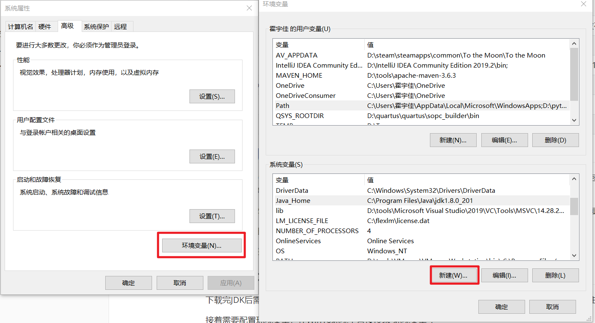
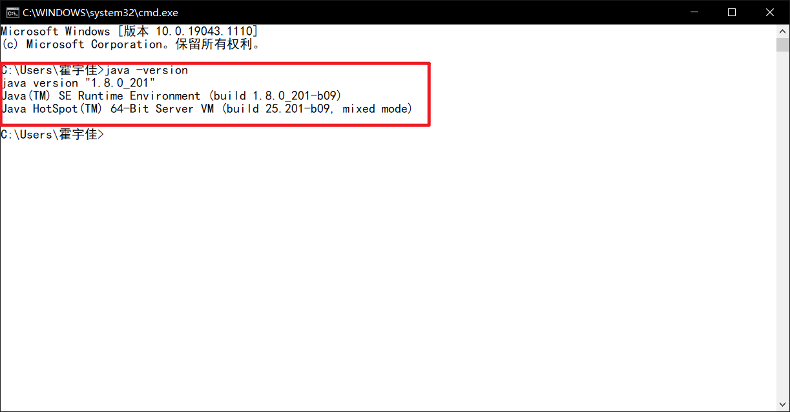
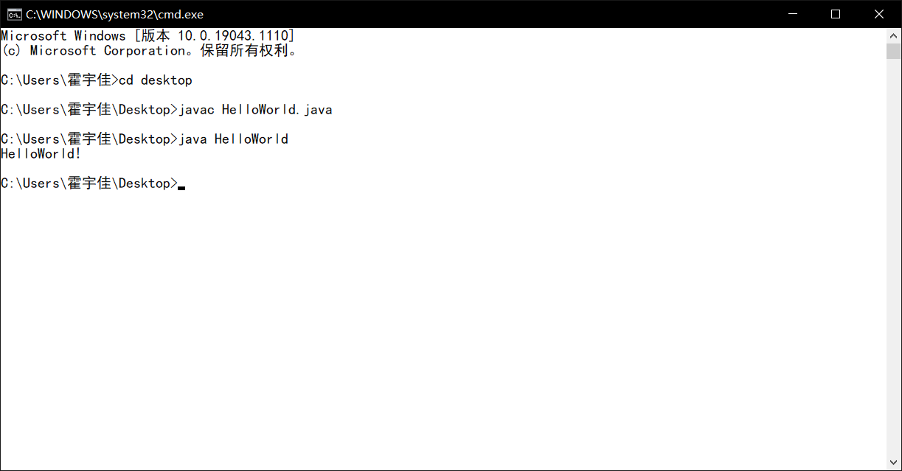

# 2.1 安装Java开发工具包

Java涉及到的专业术语如下：

| 术语名                   | 缩写 | 解释                                                         |
| :----------------------- | :--- | :----------------------------------------------------------- |
| Java Development Kit     | JDK  | 编写Java程序的程序员使用的软件                               |
| Java Runtime Enviroment  | JRE  | 运行Java程序的用户使用的软件                                 |
| Server JRE               | -    | 在服务器上运行Java程序的软件                                 |
| Standard Edition         | SE   | 用于桌面或简单服务器应用的Java平台                           |
| Enterprise Edition       | EE   | 用于复杂服务器应用的Java平台                                 |
| Micro Edition            | ME   | 用于手机和其他小型设备的Java平台                             |
| Java FX                  | -    | 用于图形化用户界面的一个替代工具包，在Oracle的Java SE发布版本中提供 |
| OPENJDK                  | -    | Java SE的一个免费开源实现，不包含浏览器集成或Java FX         |
| Java 2                   | J2   | 一个过时的术语，用于描述1998年~2006年之间的Java版本（1.0~6） |
| Software Development Kit | SDK  | 一个过时的术语，用于描述1998年~2006年之间的JDK               |
| Update                   | u    | Oracle术语，表示Bug修复的版本                                |
| NetBeans                 | -    | Oracle的集成开发环境                                         |

## 2.1.1 下载JDK

​		JDK是**Java Development Kit**的缩写 。JDK需要和JRE（Java运行环境）进行区分，JDK包含JRE，但同时包含编译器。因此，对于Java开发人员来说需要下载JDK，但是对于只需要运行Java程序的用户而言下载JRE即可。

​		下面对Java版本号进行说明。Java SE 8u31是Java SE 8的第31次更新，它的内部版本号是1.8.0_31。每次更新都会包含整个JDK。

​		JDK的下载地址是：https://www.oracle.com/cn/java/technologies/javase-downloads.html

​		目前国内使用的主流JDK为JDK8。

## 2.1.2 Windows设置JDK

​		下载完JDK后需要进行安装，默认的安装路径是：C:\Program Files\Java\jdk1.8.0_version。我们需要记住这个安装路径。

​		接着需要配置环境变量，在Win10环境中直接搜索“环境变量”。弹出对话框，点击“环境变量”。在系统变量中新建变量。

设置的环境变量如下：

- Java_Home = C:\Program Files\Java\jdk1.8.0_201

- path = %JAVA_HOME%\bin

设置完成之后点击确定退出对话框。在cmd中输入`java -version`后回车，如显示JDK信息则证明环境变量配置正确。



**提示：JDK1.5以上版本无需再配置CLASSPATH。如果需要使用JDK1.5或者以下版本，需要配置CLASSPATH环境变量。自行百度即可。**

# 2.2 使用命令行工具

在安装完JDK并配置完环境变量后，我们就可以开始编写第一个Java程序。

1. 在任意位置新建HelloWorld.java文件，文件的内容如下：

```java
public class HelloWorld{
	public static void main(String[] args){
		System.out.println("HelloWorld!");
	}
}
```

2. 打开命令行工具，进入到上面文件所在的目录。
3. 在命令行工具中输入下述命令：

> javac HelloWorld.java
>
> java HelloWorld

4. Java程序运行得到的结果如下：



​		Javac程序可以看成Java的编译器，负责将Java代码文件编译成一个字节码文件，如上所示将HelloWorld.java编译成HelloWorld.class。之后运行Java程序，启动Java虚拟机（JVM，如果想要深入学习Java必须学习其内在原理）。Java虚拟机负责执行class字节码文件。Java的跨平台代码移植性就是基于JVM的强大功能所实现的。

​		**注意：如果java命令出现找不到HelloWorld类，很有可能是因为环境变量中的CLASSPATH配置错误，需要添加“CLASSPATH = .”**

# 2.3 使用集成开发环境

​		目前最常用的Java集成开发环境包括Eclipse，MyEclipse，IntelliJ IDEA等等。我们可以选择喜欢的集成开发环境进行Java的开发。
