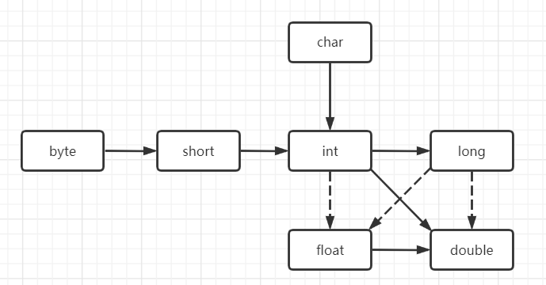
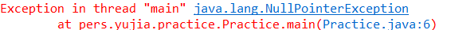
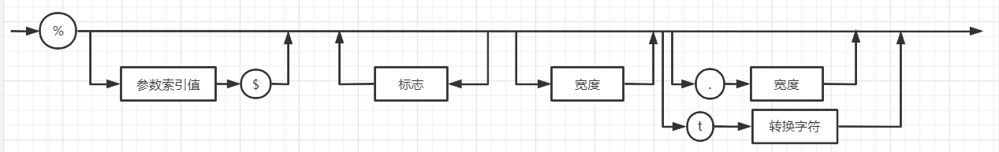
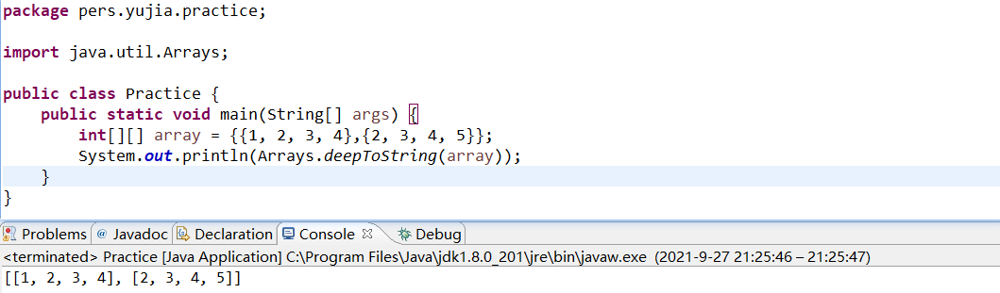

# 3.1 一个简单的Java应用程序

```java
public class FirstSample{
    public static void main(String[] args){
        System.out.println("We will not use 'Hello,World!'");
    }
}
```

- Java区分大小写

- 关键字**public**称为*访问修饰符*（access modifier），这些修饰符用来控制程序的其他部分对这段代码的访问级别。

- 关键字**class**表示Java程序的全部内容都包含在类里。

- class后面紧跟类名。名字必须以字母开头（Java规范是以大写字母开头），后面可以跟字母和数字的任意组合，长度没有限制，但不能使用Java保留字（如public或者class）作为类名。

- Java的类名规范为：类名是以大写字母为开头的名词，如果包含多个单词，则每个单词的首字母都应该大写（驼峰命名法）。

- 源代码的文件名必须和公共类的类名相同，如上述的Java程序的文件名为**FirstSample.java**。

- 运行已编译的程序时，Java虚拟机将从指定类中的main方法开始执行。因此，在类的源文件中必须包含一个main方法，从Java1.4版本开始，main方法必须要被public修饰。

- Java中的任何方法都用“{”开始，用“}”结束。

- Java调用方法的通用语法是：

  > object.method(parameter);

- Java采用双引号分隔字符串。


# 3.2 注释

```java
/**
* 第一种注解方式，可以自动生成文档
*/
public class FirstSample{
    /*第二种注解方式*/
    public static void main(String[] args){
        System.out.println("We will not use 'Hello,World!'");	//第三种注解方式
    }
}
```

**注意：在Java中/\*\*/不能嵌套，即/\*\*/中不能再嵌套/\*\*/**


# 3.3 数据类型

​		Java是一种强类型语言，必须为每一个变量都声明一种类型。在Java中一共有==8种基本数据类型==，分别是：

|   类型   | byte  | short |  int  | long  | float | double | boolean | char  |
| :------: | :---: | :---: | :---: | :---: | :---: | :----: | :-----: | :---: |
| 存储需求 | 1字节 | 2字节 | 4字节 | 8字节 | 4字节 | 8字节  |  1字节  | 2字节 |

可以用以下方法记住这几种基本类型：

- byte,short,int,long.

- float,double,boolean,char.

- 他们的存储大小分别是1248，4812。


## 3.3.1 整型

| 类型  | 存储需求 | 取值大小                                                |
| ----- | -------- | ------------------------------------------------------- |
| byte  | 1字节    | -128 ~ 127                                              |
| short | 2字节    | -32768 ~ 32767                                          |
| int   | 4字节    | -2 147 483 648 ~ 2 147 483 647（正好超过20亿）          |
| long  | 8字节    | - 9 223 372 036 854 775 808 ~ 9 223 372 036 854 775 807 |

Java中一共包含4种整型，分别是byte,short,int,long。

- 通常情况下，int类型最常用。
- 超过int所能表示的最大范围，则只能用long类型。
- byte和short类型主要用于特定的应用场合，如底层的文件或需要控制占用存储空间量的大数组。
- 在Java中，整型的范围和运行Java代码的机器完全没有关系，这就给Java提供了强大的跨平台代码移植能力。

有一些特殊类型的数值，需要添加特定的前缀或者后缀，如下：

- long类型的数值有一个后缀L或者l（如4000L或4000l）
- 十六进制的数值前有一个前缀0x或者0X（如0x12AB）
- 八进制的数值前有一个前缀0（如070）
- Java7开始支持二进制数值表示，二进制数值前有一个前缀0b或者0B（如0B1010或0b1010）
- 可以为数字字面值添加下划线以便阅读，如1_000_000

**注意：Java中没有任何无符号（unsigned）形式的整型数据类型。**


## 3.3.2 浮点类型

Java中有float和double两种浮点类型。

- float的精度大概是6~7位，double的精度大概是15位，因此又称double为双精度。
- 绝大部分情况都使用double作为浮点类型。
- float类型的数值有一个后缀F或者f（如3.14f或3.14F），double类型的数值有一个后缀D或者d（如3.14d或3.14D）。
- 没有后缀的小数默认为double类型（如3.14）。
- float和double的精度都有限。如果在数值计算中不允许有任何的舍入，应该使用**BigDecimal**类。

有三个特殊的浮点类型：Double.POSITIVE_INFINITY（正无穷）、Double.NEGATIVE_INFINITY（负无穷）和 Double.NaN（不是一个数字）,通常在应用中很少使用。

> 不能这样检测一个特定值是否等于Double.NaN：
>
> x == Double.NaN
>
> 应该使用下面这种方式：
>
> Double.isNaN(x)


## 3.3.3 char类型

​		char类型原本表示单个字符，但Java支持Unicode编码，有的Unicode编码可以用一个char字符描述，但是有的Unicode字符需要两个甚至更多的char值，这需要具体看3.3.4小节的内容。

- char类型的字面值通常要用单引号括起来，如‘A’是编码值为65（十进制）所对应的字符常量。

- char类型的值可以表示为十六进制值，但是需要使用==\u==来转义，如\u03C0表示希腊字母π。

- 转义序列\u可以出现在加引号的字符常量或字符串中，如‘\u2122’和“hello\n”，也可以出现在引号之外，如：

  > public static void main(String\u005B\u005D args)

- 常用转义序列：

  | 转义序列 | 名称   | Unicode值 |
  | -------- | ------ | --------- |
  | \b       | 退格   | \u0008    |
  | \t       | 制表   | \u0009    |
  | \n       | 换行   | \u000a    |
  | \r       | 回车   | \u000d    |
  | \\"      | 双引号 | \u0022    |
  | \\'      | 单引号 | \u0027    |
  | \\\      | 反斜杠 | \u005c    |
  

**注意：Unicode中的转义字符会在解析代码前得到处理。如“\u0022+\u0022”最终得到的是“”+“”，即最后为字符串空串。同样的，注释里面的\u也需要特别注意，如：// \u000A is a newline会产生错误，\u000A会替换成换行符。同理// Look at c:\users也会产生错误，因为\u后面没有跟十六进制数**。


## 3.3.4 Unicode类型和char类型

- Unicode和utf8的联系

  Unicode是字符集，指的是某个字符和代码值之间的映射关系。utf8是编码规则，指的是Unicode的代码值如何存储在内存中。

  **字符→Unicode→代码值(码点)→utf8→最终编码**

  

- **码点是指与一个编码表中的某个字符对应的代码值**。在Unicode标准中，码点采用十六进制编写，并加上前缀U+，例如U+0041为A的码点。

- Unicode码点可以分为17个代码级别。**第一个代码级别称为基本的多语言级别**，码点从U+0000到U+FFFF其中包括经典的Unicode编码。其余的16个级别码点从U+010000到U+10FFFF，包括一些辅助字符。


​		在Unicode中的UTF-16编码采用变长的编码表示所有Unicode码点。**在基本的多语言级别中，每个字符用每个字符都用16位表示（Java的char类型只涉及基本的多语言级别，因此为2字节大小）**。其余的级别中可以用以下的二进制格式表示：

> 1101_10xx_xxxx_xxxx_1101_11xx_xxxx_xxxx

​		将码点的二进制填充进上述的二进制即为UTF16编码。


- Java的char类型和UTF-16的关系

  在Java中，char类型描述了UTF-16编码的一个代码单元。因此，**我们使用一个char时，和经典的Unicode代码没有区别；我们使用连续的两个char时，代表辅助字符。**


将Unicode的码点转换为UTF16编码的规则如下（仅限辅助字符，经典Unicode代码保持不变）：

1. 将码点减去 0x10000，仅保留低 20 位；
2. 将高 10 位加上 0xD800，得到高代理；
3. 将低 10 位加上 0xDC00，得到低代理；

```java
// 打印Emoji笑脸，已知Unicode码点为0x1F600
int lowBits = 0x1F600 - 0x10000;
// 由于char 的长度为 16 位，采用代理对方式表示（surrogate pair）必须使用两个 char，并使用 String 包装
char highSurrogate = (char) ((lowBits >> 10) + 0xD800);
char lowSurrogate = (char) ((lowBits & 0x3FF) + 0xDC00);
System.out.println(new String(new char[]{highSurrogate, lowSurrogate}));
```


## 3.3.5 boolean类型

​		boolean类型有两个值：false和true。**在Java中，整型值和Java值是不能相互转化的**


# 3.4 变量

- Java属于强类型语言，每各变量都需要有一个类型。

- 变量名必须是一个以字母开头并且由字母和数字构成的序列。

  字母包括‘A’~’Z’，‘a’~’z’，‘_’，‘$’，以及**某种语言中表示字母的Unicode字符，如希腊中的‘π’**。

  数字包括‘0’~’9’，以及**在某种语言中表示数字的Unicode字符**。

- Java中的变量名是大小写敏感的，如hireday和hireDay是两个不同的变量名。

- 尽管‘$’是合法的，但是尽量不要在代码中使用它作为变量名的一部分。它只用作Java编译器或其他工具生成的名字中。


## 3.4.1 变量的声明和初始化

- 声明变量时，变量的类型名位于变量名之前。如：

  > double salary;
  >
  > int vacationDays;

- 可以在一行中声明多个变量，不过**提倡一行中只声明一个变量以提高程序的可读性**，如

  > int i, j;	//i和j都属于int类型的变量

- 除了基本数据类型外，许多程序员都将变量名命名为类型名（首字母小写），以提高程序的可读性。

- Java中声明可以放在任何位置（C89中变量声明必须在所有执行语句之前）。

- Java对已声明变量进行赋值，要将变量名放在等号的左端，取值的表达式放在等号的右端。也可将声明和初始化放在同一行，如：

  > int vacationDays;
  >
  > vacationDays = 12;
  >
  > // 以上代码和以下代码完全等价
  >
  > int vacationDays = 12;
  
  

## 3.4.2 常量

- Java中使用关键字final指示常量（虽然const也是Java的保留关键字，但还未使用）。如：

  > final double CM_PER_INCH = 2.54;

- final表示这个变量只能被赋值一次。

- 习惯上常量用全大写的英文名，并且每个单词之间用下划线分隔。

- 在Java中如果希望某个常量在一个类的多个方法使用，可以使用static final来设置。如：

  ```java
  public class MyClass{
      public static final double PI = 3.14;
  }
  ```

  其他类需要使用时，就可以用MyClass.PI直接代表该常量。


# 3.5 运算符

- Java中，使用算术运算符+，-，\*，/表示加减乘除运算，使用%表示求余运算。

- 整数除以0将会抛出一个异常，而浮点数除以0将会得到NaN或无穷大结果。

- 在默认情况下，虚拟机设计者允许对中间计算结果采用扩展的精度。如：

  double w = x \* y / z;

  很多64位处理器使用80位浮点寄存器，但double类型为64位，因此在处理x \* y时Java虚拟机就会保留80位的计算结果，这样既可以避免指数溢出，又节省了截断操作的时间。在进行除法运算的时候，将结果进行截断64位的操作保存到w变量。

- 如果想用严格的浮点计算（任何指令的double结果都保留64位），可以在方法前使用==strictfp==进行修饰。如：

  > public static strictfp void main(String[] args)
  
- 在默认情况下，中间结果允许使用扩展的指数，但不允许使用扩展的尾数。因此，上述两种计算的区别仅仅是默认的方法不会导致溢出，而严格的浮点计算可能会导致溢出。**与计算的精度无关。**


## 3.5.1 数学函数与常量

在Java的Math类中，包含了各种各样的数学函数。常用的数学函数如下：

- ```java
   public static double sqrt(double a)
   ```

   返回`double`值正确舍入的正平方根。特殊情况：
   - 如果参数为NaN或小于零，则结果为NaN。 
   
   - 如果参数为无穷大，则结果为正无穷大。 

   - 如果参数为正零或负零，则结果与参数相同。 
   

   否则，结果是`double`最接近参数值的真实数学平方根值。

- ```java
   public static double pow(double a,double b)
   ```
   
   计算结果为a的b次幂（a^b）
   
- ```java
   public static int floorMod(int x,int y)
   ```
   
   在Java中，对于n % 2，n如果为负数，则结果为-1。但是实际上经常会遇到n为负数结果要求是正数的情况。如：
   
   调整时钟时针的位置，计算公式为：**(position + adjustment) % 12**
   
   将时间调回到15个小时之前，则(position - 15) % 12，显然%得到的结果-1不满足我们的要求。
   
   但如果使用**floorMod(position - 15,12)**，得到的结果将始终位于0到11之间。
   
- ```java
   //Math类常用的三角函数
   public static double sin(double a)	//角度正弦
   public static double cos(double a)  //角度余弦 
   public static double tan(double a)	//角度正切
   public static double atan(double a)	//反正切
   public static double atan2(double y,double x)	//知道直角坐标的反正切
   ```
   
- ```java
   //Math类常用的指数函数和对数函数
   public static double exp(double a)	//e的指数函数
   public static double log(double a)	//自然对数
   public static double log10(double a)//以10为底的对数    
   ```
   
- ```java
   //Math类常用的常量
   Math.PI	
   Math.E    
   ```


## 3.5.2 数值类型之间的转换

下图表示数值类型之间的合法转换，其中实心箭头表示无信息丢失的转换；虚箭头表示可能有精度损失的转换。



当两个数值进行二元操作时，想要将两个操作数转化为同一种类型，然后再进行计算。

- 如果两个操作数有一个是double类型，另一个操作数就会转换为double类型

  byte + double, short + double, int + double, long + double, char + double, float + double, double + double

- 否则，如果其中一个操作数是float类型，另一个操作数就会转换为float类型

  byte + float, short + float, int + float, long + float, char + float, float + float

- 否则，如果其中一个操作数是long类型，另一个操作数就会转换为long类型

  byte + long, short + long, int + long, long + long, char + long

- 否则，两个操作数都会转换为int类型

  byte + int, short + int, int + int, char + int, ==byte + char, short + char, char + char, byte + short, short + short, byte + byte==


## 3.5.3 强制类型转换

- 强制类型转换的语法格式是在圆括号中给出想要转换的目标类型，后面紧跟待转换的变量名。如

  ```java
  double x = 9.997;
  int nx = (int)x;	//nx最终的值为9
  ```

  强制类型转换通过截断小数部分将浮点值转换为整型。

- 使用`Math.round`方法对浮点数进行四舍五入的运算。该方法的返回值类型为long，如果需要转换为int类型仍需强制类型转换。


## 3.5.4 结合赋值和运算符

二元运算符包括+=，-=，\*=，/=，%=。

如x += 4等价于x = x + 4。

**注意：二元运算符默认使用强制类型转换。如果x是一个int类型的变量，则x += 3.5等价于x = (int)(x + 3.5)**


## 3.5.5 自增和自减运算符

- n++将n的当前值加1，n--将n的当前值减1。

- 自增和自减运算符的操作数不能是数值，如4++不是一个合法的语句。

- 前缀形式++n，后缀形式n++。

  前缀形式会先完成加1；后缀形式是先计算或赋值，然后再加1。

  ```java
  int m = 7;
  int n = 7;
  int a = 2 * ++m;	//语句执行完，a=16，m=8
  int b = 2 * n++;	//语句执行完，b=14，n=8
  ```

- 自增和自减运算符**没有强制类型转换**


## 3.5.6 关系和boolean运算符

| 关系运算符 |  ==  |   !=   |  <   |  >   |    <=    |    >=    |   &&   |  \|\|  |  &   |  \|  |
| ---------- | :--: | :----: | :--: | :--: | :------: | :------: | :----: | :----: | :--: | :--: |
| 含义       | 等于 | 不等于 | 小于 | 大于 | 大于等于 | 大于等于 | 短路与 | 短路或 |  与  |  或  |

**注意：&&或||运算符是按照“短路”方式来求值的：如果第一个操作数已经能够确定表达式的值，第二个操作数就不用计算了，即使第二个操作数是(1 / 0 == 0)也可以。**


## 3.5.7 位运算符

位操作符只适用于左操作数和右操作数都是整数类型的情况。

| 位运算符 |  &   |  \|  |  ^   |  ~   |    >>    |    <<    |   >>>    |
| :------: | :--: | :--: | :--: | :--: | :------: | :------: | :------: |
|   含义   | and  |  or  | xor  | not  | 算术右移 | 算术左移 | 逻辑右移 |

- 掩码技术：得到整数的二进制中的某一位。

  如：得到n的从右到左第四位：(n & 0b1000) / 0b1000

- 算数右移>>和逻辑右移>>>的区别

  算术右移>>是符号位的扩展（即扩充之后正负不变），如果符号位为1则用1扩充高位，如果符号位为0则用0扩充高位。

  逻辑右移>>>会用0来扩充高位，扩充之后负数会变为正数。

- **模运算会强制将运算结果转换成int类型（左操作数为byte，short，int，char）或long类型（左操作数为long）**

  因此，右操作数要先做模32（左操作数不是long类型）或模64（左操作数是long类型）操作，然后进行移位。

  如1 << 35等价于1 << 3和1 * (2 ^ 3)

## 3.5.8 括号与运算符级别

运算符从高到低的优先级如下表所示（此部分只用作参考，不作要求）：

|                            运算符                            |  结合性   |
| :----------------------------------------------------------: | :-------: |
|                      [] . ()(方法调用)                       | 从左往右  |
| ！~ ++ --  +(一元运算，即正数) -(一元运算) ()(强制类型转换) new | 从右到左  |
|                            \* / %                            | 从左到右  |
|                             + -                              | 从左到右  |
|                          << >> >>>                           | 从左到右  |
|                    < <= > >= instacnceof                     | 从左到右  |
|                            == !=                             | 从左到右  |
|                              &                               | 从左到右  |
|                              ^                               | 从左到右  |
|                              \|                              | 从左到右  |
|                              &&                              | 从左到右  |
|                             \|\|                             | ‘从左到右 |
|                              ?:                              | 从右到左  |
|       =  +=  -=  \*=  /=  %=  \|=  ^=  <<=  >>=  >>>=        | 从右到左  |


## 3.5.9 枚举类型

​		有时候变量的取值只在一个有限的集合中。如销售服装的尺寸（L、XL、XXL、XXXL）和一年四季（spring、summer、autumn、winter）。这种情况下可以使用自定义的枚举类型。如：

```java
public enum Season{
    SPRING,SUMMER,AUTUMN,WINTER
}
```

可以声明这种类型的变量：

```java
Season s = Season.SPRING;
```

- 枚举类型的变量只能存储类型声明中的某个枚举值或者null。

- 枚举类型常常用于switch-case语句中的条件。


# 3.6 字符串

​		Java字符串就是Unicode字符序列。Java中没有内置的字符串类型，而是提供了一个预定义类String。

​		**注意：Java中字符串存储，结尾是没有“\0”的。因为String类型是以字符数组来存储字符串的。要想知道字符串结尾只用求数组长度即可，没有必要花费2字节来额外存储字符串结尾。**


## 3.6.1 子串

```java
public String substring(int beginIndex)
//返回一个字符串，该字符串是此字符串的子字符串。子字符串以指定索引处的字符开头，并扩展到该字符串的末尾。     
    
public String substring(int beginIndex,int endIndex)  
//返回一个字符串，该字符串是此字符串的子字符串。子串开始于指定beginIndex并延伸到字符索引endIndex - 1 。因此，子串的长度为endIndex-beginIndex 。 
```

- substring方法的第一个参数是想要复制的第一个位置（下标从0开始）
- substring方法的第二个参数是不想复制的第一个位置（如想要0、1、2三个下标的字符，那么endIndex就应该为3）
- substring的字串长度为**endIndex - beginIndex**。

- 可以认为s.substring(beginIndex)等价于s.substring(int beginIndex,s.length())。**但实际上源码并不是这样**。


## 3.6.2 拼接

- Java语言允许使用+号连接两个字符串。

  ```java
String expletive = "Expletive";
String PG13 = "deleted";
String message = expletive + PG13;	//message的值为"Expletivedeleted"

- 将一个字符串与一个非字符串的值进行拼接时，后者就被转换成字符串。

  ```java
  int age = 13;
  String rating = "PG" + age;	//rating的值最终为"PG13"
  ```

- 如果需要多个字符串放在一起并用一个定界符分割，使用静态的**join方法**。

  ```java
  String all = String.join("/","S","M","L","XL");
  //all的值为"S/M/L/XL"
  ```


## 3.6.3 不可变字符串

​		String类型没有提供修改字符串的方法。**可以修改字符串变量引用另外一个字符串，但是不能修改字符串其中的任何一个字符。**

​		不可变字符串的优点：**编译器可以让字符串共享**。Java的字符串存放在公共的存储池中，字符串变量指向存储池中的相应位置。如果复制一个字符串变量，原始字符串与复制的字符串共享相同的字符。

​		如果字符串变量赋值之后又赋予另外一个值，并不会造成内存泄漏。Java将自动地进行垃圾回收，如果一块内存不用了，系统会自动回收。


## 3.6.4 检测字符串是否相等

- 可以使用`equals`方法检测两个字符串是否相等。比较的两个字符串既可以是字符串字面量，也可以是字符串变量。

  ```java
  String s = "hello";
  String t = "hello";
  boolean b = s.equals(t);	//b的值为true
  b = "hello".equals(s);		//b的值为true，如果要比较字符串常量和变量，我们通常使用这种方式，避免s为null时抛出异常
  ```

- 要检测两个字符串不区分大小写是否相等，可以使用`equalsIgnoreCase`方法。

  ```java
  boolean b = "Hello".equalsIgnoreCase("hello");	//b的值为true
  ```

- **一定不能使用==运算符检测两个字符串是否相等**。==运算符比较的是内存位置。如果字符串放置在相同的位置，他们必然相等；但如果相同的字符串放置在不同的位置，那就不会相等。**如+或substring操作产生的结果不是共享的。**

  ```java
  String greeting = "Hello";
  System.out.println(greeting == "Hello");	//输出true
  System.out.println(greeting.substring(2) == "llo");	//输出false
  ```


## 3.6.5 空串和Null

- 空串”“是长度为0的字符串。在堆内存中会分配内存空间。

- String变量还可以存放特殊值null，表示没有任何对象与该变量关联。

- 如果我们要检查一个字符串既不是null也不是空串，可以如下：

  ```java
  if(str != null && str.length() != 0)
  //或者
  if(str != null && !str.equals(""))
  ```

  首先要检查str是否为null，避免抛出空指针异常。

  


## 3.6.6 码点和代码单元

​		Java字符串底层就是使用一个char数组来存储所有的字符，而char数据类型是一个采用UTF-16编码表示Unicode码点的代码单元。因此，字符串的底层存储实际上就是UTF-16编码的数组。大多数常用的Unicode字符使用一个代码单元就可以表示，而辅助字符需要一对代码单元表示。

- `length`方法返回用UTF-16编码表示的给定字符串所需要的代码单元数量（辅助字符需要两个代码单元）。

  ```java
  String greeting = "Hello";
  int n = greeting.length();	//5
  ```

- 得到实际的长度，即码点数量，可以使用`codePointCount`方法。

  ```java
  String greeting = "😂";
  System.out.println(greeting.codePointCount(0, greeting.length()));	//1
  System.out.println(greeting.length());	//2
  ```

- 使用`charAt`方法获取某个位置的代码单元，n位于==0~s.length()-1==之间。

  ```java
  String greeting = "Hello";
  char first = greeting.charAt(0);	//‘H’
  char last = greeting.charAt(4);	//‘o’
  ```

- 要想得到第i个码点（获取字符串的某个字符），应该使用下述语句：

  ```java
  int index = greeting.offsetByCodePoints(0,i);
  int cp = greeting.codePointAt(index);
  ```

- 字符串和码点数组之间的转换。

  ```java
  int[] codePoints = str.codePoints().toArray();	//字符串转换为码点数组
  String str = new String(codePoints,0,codePoints.length);	//码点数组转换为字符串
  ```


## 3.6.7 String API

下面的API注释汇总了常用的String类方法。其中的`CharSequence`是一种接口类型，所有的字符串都属于这个接口。

- **char charAt(int index)**

  返回给定位置的代码单元。除非对底层代码感兴趣，否则不需要调用该方法。

  一般使用str.codePointAt(0, str.length())来返回指定位置的字符。

- **int codePointAt(int index)**

  返回从给定位置开始的码点。

- **int offsetByCodePoints(int startIndex, int cpCount)**

  返回从startIndex代码点开始，再位移cpCount（代码点的偏移量）后的码点索引。

- **int compareTo(String other)**

  按照字典顺序，如果字符串位于other之前，返回一个负数；如果字符串位于other之后，返回一个正数；如果两个字符串相等，返回0。

- **IntStream codePoints()**

  将这个字符串的码点作为一个流返回。调用toArray将它们放进一个数组。

  使用方法一般为str.codePoints().toArray()，返回结果为字符串的码点数组。

- **new String(int[] codePoints, int offset, int count)**

  用数组中从offset开始的count个码点构造一个字符串。

  使用方法一般为new String(codePoints, 0, codePoints.length)。

- **boolean equals(Object other)**

  如果字符串与other相等，返回true。

- **boolean equalsIgnoreCase(String other)**

  如果字符串与other相等（忽略大小写），返回true。

- **boolean startsWith(String prefix)**

  如果字符串以prefix开头，返回true。

- **boolean endsWith(String suffix)**

  如果字符串以suffix结尾，返回true。

- **int indexOf(String str)**

  **int indexOf(String str, int formIndex)**

  **int indexOf(int cp)**

  **int indexOf(int cp, int formIndex)**

  返回与字符串str或代码点cp匹配的第一个子串的开始位置。这个位置从索引0或者formIndex开始计算。如果在原始串中不存在str，返回-1。

- **int lastIndexOf(String str)**

  **int lastIndexOf(String str, int formIndex)**

  **int lastIndexOf(int cp)**

  **int lastIndexOf(int cp, int formIndex)**

  返回与字符串str或代码点cp匹配的最后一个子串的开始位置。这个位置从原始串尾端或者formIndex开始计算。如果在原始串中不存在str，返回-1。

- **int length()**

  返回字符串所需的代码单元数量。

  如果要想得到真正的码点数量，使用str.codePointCount(0, str.length())。

- **int codePointCount(int startIndex, int endIndex)**

  返回startIndex和endIndex - 1之间的代码点数量。没有配成对的代用字符将计入代码点。

- **String replace(charSequence oldString, charSequence newString)**

  返回一个新字符串。这个字符串用newString

- **String substring(int beginIndex)**

  **String substring(int beginIndex, int endIndex)**

  返回一个新字符串。这个字符串包含原始字符串中从beginIndex到串尾或endIndex - 1的所有代码单元。

- **String toLowerCase()**

  **String toUpperCase()**

  返回一个新字符串。这个新字符串将原始字符串中的所有大写字母改为小写，或者将原始字符串中的所有小写字母改为大写。

- **String trim()**

  返回一个新字符串。这个新字符串删除了原始字符串头部和尾部的空格。

- **String join(CharSequence delimiter, CharSequence... elements)**

  返回一个新字符串，用给定的定界符连接所有的元素。


## 3.6.8 阅读联机API文档

Java的API文档的官方网址为：[https://docs.oracle.com/javase/8/docs/api/index.html](https://docs.oracle.com/javase/8/docs/api/index.html)


## 3.6.9 构造字符串

​		有些时候需要由一组较短的字符串来构建一个字符串，例如按键和文件中的单词。**如果采用+号连接字符串，每次连接字符串都会构建一个新的String对象，既耗费时间又耗费空间。**因此我们可以采用`StringBuilder`或者`StringBuffer`类来避免该问题。

1. 首先构造一个空的字符串构造器

   ```java
   StringBuilder builder = new StringBuilder();
   ```

2. 每次在字符串中连接新的字符串时，调用`append`方法。

   ```java
   builder.append(ch);
   builder.append(str);
   ```

3. 需要构建一个字符串时调用`toString`方法，就可以得到一个字符串。

   ```java
   String completedString = builder.toString();
   ```

- `StringBuilder`和`StringBuffer`的区别

  `StringBuilder`是线程不安全的，`StringBuffer`是线程安全的。但是`StringBuilder`的效率要比`StringBuffer`高。

  因此，在单线程的情况下使用`StringBuilder`来提高效率，在多线程的情况下使用`StringBuffer`来保证线程安全。

- StringBuilder中的常用方法

  ```java
  StringBuilder()
  构造一个空的字符串构造器
      
  int length()
  返回构造器或缓冲器中的代码单元数量
      
  StringBuilder append(String str)
  追加一个字符串并返回this
      
  StringBuilder append(char c)
  追加一个字符并返回this
      
  StringBuilder appendCodePoint(int cp)
  追加一个码点，并将其转换为一个或两个代码单元并返回this
      
  void setCharAt(int i, char c)
  将第i个代码单元设置为c
      
  StringBuilder insert(int offset, String str)
  在offset位置插入一个字符串并返回this
      
  StringBuilder insert(int offset, char c)
  在offset位置插入一个字符并返回this
     
  StringBuilder delete(int startIndex, int endIndex)
  删除偏移量从startIndex到endIndex - 1的代码单元并返回this
      
  String toString()
  返回一个与构造器或缓冲器内容相同的字符串
  ```


# 3.7 输入输出

​		现代的程序都使用GUI（图形用户界面）来收集用户的输入，但是需要使用较多的工具与技术。本节主要讨论简单的用于控制台的输入输出。


## 3.7.1 读取输入

- 想要通过控制台输入，首先需要构造一个`Scanner`对象，并与标准输入流`System.in`关联

  ```java
  Scanner scanner = new Scanner(System.in);
  ```

- 使用`nextLine`方法输入一行

  ```java
  String name = scanner.nextLine();
  ```

- 使用`next`方法读取一个单词（以空白符作为分隔符）

  ```java
  String firstName = scanner.next();
  ```

- 使用`nextInt`方法读取一个整数

  ```java
  int age = scanner.nextInt();
  ```

- 使用`nextDouble`方法读取一个浮点数

  ```java
  double score = scanner.nextDouble()
  ```

**注意：在使用`next`,`nextInt`,`nextDouble`后，紧跟着使用`nextLine`方法，`nextLine`方法将会读取到空白符。**

**因为`next`,`nextInt`,`nextDouble`方法读取完成后输入回车，`nextInt()`函数在缓冲区中遇到“空格”、“回车符”等空白字符时会将空白字符前的数据读取走，但空白字符不会被处理掉，而`nextLine()`函数是在缓冲区中读取一行数据，这行数据以“回车符”为结束标志，`nextLine()`会把包括回车符在内的数据提走。所以`nextInt()`后的`nextLine()`函数并非读取不到数据，因为`nextInt()`将“回车符”留在了缓冲区，`nextLine()`读取时遇到的第一个字符便是“回车符”，所以直接结束了。**

**因此，`next`,`nextInt`,`nextDouble`后尽量不跟`nextLine`方法，或者可以使用两个`nextLine`方法**

- `Scanner`类常用方法

  ```java
  Scanner(InputStream in)
  用给定的输入流创建一个Scanner对象
      
  String nextLine()
  读取输入的下一行内容
      
  String next()
  读取输入的下一个单词
      
  int nextInt()
  double nextDouble()
  读取并转换下一个表示整数或浮点数的字符序列
      
  boolean hasNext()
  检测输入中是否还有其他单词
      
  boolean hasNextInt()
  boolean hasNextDouble()
  检测是否还有表示整数或浮点数的下一个字符序列
  ```


## 3.7.2 格式化输出

- 用于printf的转换符

  | 转换符 |      类型      |    举例    | 转换符 |         类型         |  举例   |
  | :----: | :------------: | :--------: | :----: | :------------------: | :-----: |
  |   d    |   十进制整数   |    159     |   s    |        字符串        |  Hello  |
  |   x    |  十六进制整数  |     9f     |   c    |         字符         |    H    |
  |   o    |   八进制整数   |    237     |   b    |         布尔         |  True   |
  |   f    |   定点浮点数   |    15.9    |   h    |        散列码        | 42628b2 |
  |   e    |   指数浮点数   |  1.59e+01  | tx或Tx | 日期时间（已经过时） |    -    |
  |   g    |   通用浮点数   |     -      |   %    |        百分号        |    %    |
  |   a    | 十六进制浮点数 | 0x1.fccdp3 |   n    | 与平台有关的行分隔符 |    -    |

  如System.out.printf(“%8.2f”,x)，以8个字符的宽度和小数点后两个字符的精度打印x

  如System.out.printf(“Hello, %s. Next year, you’ll be %d”, name, age)

- 用于printf的标志

  |       标志        |                             目的                             |     举例     |
  | :---------------: | :----------------------------------------------------------: | :----------: |
  |         +         |                     打印正数和负数的符号                     |   +3333.33   |
  |       空格        |                      在正数之前添加空格                      | \| 3333.33\| |
  |         0         |                         数字前面补0                          |  003333.33   |
  |         -         |                            左对齐                            | \|3333.33 \| |
  |         (         |                       将负数括再括号内                       | （3333.33）  |
  |         ,         |                        添加分组分隔符                        |   3,333.33   |
  |  #（对于f格式）   |                          包含小数点                          |    3,333.    |
  | #（对于x或0格式） |                        添加前缀0x或0                         |    0xcafe    |
  |         $         | 给定被格式化的参数索引。例如，%1$d，%1$x将以十进制和十六进制格式打印第1个参数 |    159 9F    |
  |         <         | 格式化前面说明的数值。例如，%d%<X以十进制和十六进制打印同一个数值 |    159 9F    |

  如System.out.printf(“%,.2f”, 10000.0 / 3.0)打印3,333.33

  如“%,(.2f”使用分组的分隔符并将负数括在括号内

- 可以使用静态的`String.format`方法构建一个格式化的字符串，而不打印输出，如：

  ```java
  String message = String.format("Hello, %s. Next year, you'll be %d", name, age);
  ```

- 格式说明符语法：

  


## 3.7.3 文件输入与输出

- 想要对文件进行读取，就需要用File对象或者Path对象来构造一个Scanner对象，如：

  ```java
  Scanner scanner = new Scanner(Paths.get("myfile.txt"), "UTF-8");
  //如果文件名含有反斜杠，则需要在每个反斜杠前添加一个额外的反斜杠，如"C:\\mydirectory\\myfile.txt"
  ```

  之后就可以利用scanner的nextLine，next等方法进行读取。

  **注意：读取一个文本文件时，需要知道它的字符编码。如果省略字符编码，则会使用运行这个Java程序的机器的“默认编码”。**

  **注意：可以构造带有字符串参数的Scanner，但这个Scanner将字符串解释为数据，而不是文件名。**

- 要想写入文件，就需要构造一个PrintWriter对象，如：

  ```java
  PrintWriter out = new PrintWriter("myfile.txt","UTF-8");
  ```

  如果文件不存在，创建该文件。可以使用print、printf以及println等。


# 3.8 控制流程

## 3.8.1 块作用域

​		块（即复合语句）是指由一对大括号括起来的若干条简单的Java语句。块确定了变量的作用域，一个块可以嵌套在另一个块中，但不能在嵌套的两个块中声明相同的变量，如：

```java
public static void main(String[] args){
    int n;
    {
        int k;	//k变量只能在该块被使用
        int n;	//错误，不能重复定义n
    }
}
```


## 3.8.2 条件语句

​		在Java中，条件语句的格式为**if (condition) statement**。如果希望某个条件为真时执行多条语句，应该使用块。如：

```java
if(condition)
    statement
    
if(condition_1){
    statement_1
    statement_2
}
```

​		在Java中，更一般的条件语句格式为：**if (condition) statement_1 else statement_2**

```java
if(condition)
	statement_1
else
	statement_2
```

​		在Java中重复地交替出现**if...else if...**是一种很常见的情况

```java
if(condition_1){
    statement_1
}else if(condition_2){
    statement_2
}else if(condition_3){
    statement_3
}...
 else{
     statement_n
 }
```


## 3.8.3 循环语句

​		循环语句的一般格式为：**while(condition) statement**。如果开始循环条件的值为false，则while循环体一次也不会执行。

```java
while(condition){
    statement
}
```

​		如果希望循环体至少执行一次，则应该将检测条件放在最后。使用**do statement while(condtion)**可以实现这种操作方式。

```java
do{
    statement
}while(condition)
```


## 3.8.4 确定循环

​		for循环语句是支持迭代的一种通用结构，利用每次迭代之后更新的计数器或类似的变量来控制迭代次数。

```java
for(初始条件;循环条件;更新语句){
    statement
}
```

​		**注意：有一条不成文的规定，for语句的三个部分应该对同一个计数器变量进行初始化、检测和更新。**

​		在循环中检测两个浮点数是否相等尤其需要小心。如下面的程序：

```java
public class Practice {
	public static void main(String[] args) {
		for (double x = 0; x != 10; x += 0.1) {
			System.out.println("Counting down..." + x);
		}
		System.out.println("Blastoff!");
	}
}
```

​		该程序永远都不会结束，因为0.1无法用精确的二进制数来表示，所以x将从9.999 999 999 999 98跳到10.099 999 999 999 98。**我们应当尽量避免浮点数是否相等的比较。**

- for循环的变量作用域

  - 当for循环的第一部分声明一个变量后，这个变量的作用域就为for循环的整个循环体。for循环的第一部分只能声明相同类型的变量用逗号间隔

    ```java
    for(int i = 0, b = 1; i < 10; i++)	//合法
    for(int i = 0, double d = 0.0; i < 10; i++)	//非法
    ```

  - 如果在for循环中定义一个变量，这个变量就不能在循环体外使用。因此，如果希望在for循环体外使用循环计数器的值，就要确保这个变量在循环语句的前面并且是在外部声明。

  - 可以在各自独立的不同for循环中定义同名的变量。

- for语句和while语句可以进行互换

  ```java
  for(int i = 10; i > 0; i--){
      System.out.println("Counting down..." + i);
  }
  //等价于
  int i = 10;
  while(i > 0){
      System.out.println("Counting down..." + i);
      i--;
  }
  ```

  

## 3.8.5 多重选择：switch语句

​		在处理多个选项时，使用if/else结构显得笨拙。经常使用switch语句来替代。swirch...case...的示例如下：

```java
Scanner in = new Scanner(System.in);
System.out.print("Select an option(1, 2, 3, 4)");
int choice = in.nextInt();
switch(choice){
    case 1:
        ...
    	break;
    case 2:
        ...
        break;
    case 3:
        ...
    	break;
    case 4:
        ...
        break; 
    default:
        ...
        break;
}
```

​		switch语句将从与选项值相匹配的case标签处开始执行直到遇到break语句，或者执行到switch语句的结束处为止。如果没有相匹配的case标签，而有default标签，就执行这个子句。

​		case标签可以是：

- 类型为char、byte、short、int的常量表达式（包括final修饰的常量）

- 枚举常量（当switch语句中使用枚举常量时，不必在每个标签中指明枚举名，可以由switch的表达式值确定）

- 从Java SE 7开始，case标签可以是字符串字面值（包括final修饰的常量）

  **注意：如果在case分支语句的末尾没有break语句，那么就会接着执行下一个case分支语句。**


## 3.8.6 中断流程语句

​		尽管Java中将goto作为保留字，但是实际上并没有打算在语言中使用。Java中使用**break/continue**作为中断流程语句。

​		**break用于跳出循环语句：**

- Java提供了一种带标签的break语句，用于跳出多重嵌套的循环语句。标签必须放在希望跳出的最外层循环之前，并且必须紧跟一个冒号。

- 对于任何使用break语句的代码都需要检测循环是否正常结束还是由break跳出。

- break还可以应用到if语句或者块语句中。不过只能跳出语句块，不能跳入语句块。

  **continue语句将控制转移到最内层循环的首部：**

- 如果将continue语句用于for循环，就可以跳到for循环的“更新”部分。

- 带标签的continue语句，将跳到与标签匹配的循环首部。


# 3.9 大数值

​		如果基本的整数和浮点数精度不能达到需求，那么可以使用`java.math`包下的两个类：`BigInteger`和`BigDecimal`。这两个类可以处理包含任意长度数字序列的数值。`BigInteger`类实现了任意精度的整数运算，`BigDecimal`实现了任意精度的浮点数运算。

​		**下面是`BigInteger`的常用API：**

- BigInteger add(BigInteger other)

  BigInteger substract(BigInteger other)

  BigInteger multiply(BigInteger other)

  BigInteger divide(BigInteger other)

  BigInteger mod(BigInteger other)

  返回这个大整数和另一个大整数other的和、差、积、商以及余数。

- int compareTo(BigInteger other)

  如果这个大整数与另一个大整数other相等，返回0；如果这个大整数小于另一个大整数other，返回负数；否则返回正数。

- static BigInteger valueOf(long x)

  返回值等于x的大整数。

​        **下面是`BigDecimal`的常用API：**

- BigDecimal add(BigDecimal other)

  BigDecimal subtract(BigDecimal other)

  BigDecimal multiply(BigDecimal other)

  BigDecimal divide(BigDecimal other, RoundingMode mode)

  返回这个大实数与另一个大实数other的和、差、积、商。要想计算商，必须给出舍入方式，如RoundingMode.HALF_UP（四舍五入）等。

- int compareTo(BigDecimal other)

  如果这个大实数与另一个大实数other相等，返回0；如果这个大实数小于另一个大实数other，返回负数；否则返回正数。

- static BigDecimal valueOf(long x)

  static BigDecimal valueOf(long x, int scale)

  返回值为x或x/(10^scale)的一个大实数。


# 3.10 数组

数组是一种数据结构，用来存储相同类型的值的集合。通过下标可以访问数组的每一个值。

```java
/*声明数组有两种方式*/
int[] a;
int x[];

/*声明数组的同时初始化数组，下面的数组下标从0到99*/
int[] a = new int[100];

/*数组长度不要求是常量，下面创建了一个长度为n的数组*/
int[] b = new int[n];
```

- 创建一个数字数组时，所有的元素初始化为0。
- 创建一个boolean数组时，所有元素初始化为false。
- 创建一个对象数组时，所有元素初始化为null。

可以通过数组的属性`length`来获取该数组的长度。如`a.length`表示a的数组长度。

**注意：一旦创建了数组，就不能够随意改变数组的大小。**


## 3.10.1 foreach循环

`foreach`循环又被称作增强for循环。语句格式为：

```java
for(type variable : collection) statement
```

**注意：collection这一集合表达式必须是一个数组或者是一个实现了Iterator接口的类对象。**

如遍历int类型的数组a，如下：

```java
for(int element : a) statement;
/*等价于*/
for(int i = 0; i < a.length; i++) statement;
```

如果在循环的过程中使用下标值，则`foreach`循环不能够实现该效果，只能使用传统的`for`循环。

- **在`Eclipse`中，foreach循环的快捷方式是先输入`foreach`，再输入提示键。**
- **在 `IntelliJ IDEA`中，foreach循环的快捷方式是先输入`变量名.foreach`，再输入提示键。**


## 3.10.2 数组初始化以及匿名数组

Java提供了一种创建数组对象并同时赋予初始值的简化书写方式，如下：

```java
/*这种方式只适用于声明时，同时进行数组初始化*/
int[] smallPrimes = {2, 3, 5, 7, 11, 13};

/*以下程序不合法*/
int[] a;
a = {1};	
```

但是上面的赋予数组初始值的方式只用于声明数组时使用。如果声明和赋予数组初始值分开，可以使用==匿名数组==。使用匿名数组的方式如下：

```java
int[] a;
a = new int[]{1, 2};
```

**注意：匿名数组通常使用在方法的参数中，这样不用额外设置变量。**

在Java中，允许数组的长度为0。但是，==数组长度为0与数组变量为null完全不同。==


## 3.10.3 数组拷贝

在Java中，允许将一个数组变量拷贝给另一个数组变量。这时，==两个变量将引用同一个数组==。

```java
int[] luckyNumbers = smallPrimes;
luckyNumbers[5] = 12;//这时smallPrimes[5]也为12
```

如果希望将一个数组的所有值拷贝到一个新的数组，可以使用`Arrays`类的`copyOf`方法。第一个参数是要复制的数组，第二个参数是新数组的长度。

```java
int[] copiedLuckyNumbers = Arrays.copyOf(luckyNumbers, luckyNumbers.length);
```

==用数组拷贝也可以增加数组的大小==。

```java
luckyNumbers = Arrays.copyOf(luckyNumbers, 2 * luckyNumbers.length);
```

- 如果数组元素是数值型，那么多余的元素就将赋值为0
- 如果数组元素是布尔型，那么多余的元素就将赋值为false
- 如果长度小于原始数组的长度，则只拷贝最前面的数据元素


## 3.10.4 命令行参数

每一个Java的应用程序都有一个带`String[] args`参数的`main`方法。这个参数表明`main`方法将接收一个字符串数组，也就是==命令行参数==。如下面的程序：

```java
public class Message{
    public static void main(String[] args){
        if(args.length == 0 || args[0].equals("-h"))
            System.out.print("Hello,");
        else if(args[0].equals("-g"))
            System.out.print("Goodbye,")
        for(int i = 1; i < args.length; i++)
            System.out.print(" " + args[i]);
        System.out.println("!");
    }
}
```

如果使用下面的形式运行该程序：

```shell
java Message -g cruel world
```

`args`数组将包含下列内容：

```java
args[0]:"-g"
args[1]:"cruel"
args[2]:"world"
```

这个程序将显示信息：`Goodbye, cruel world!`。


## 3.10.5 数组排序

想要对数组进行排序，可以使用`Array`类的`sort`方法：

```java
int[] a = new int[10000];
Arrays.sort(a);
```

该方法使用了==优化的快速排序算法==。

下面是`Arrays`类的常用方法：

```java
static String toString(type[] a)
返回包含a中数据元素的字符串，这些数据元素被放在括号内，并用括号分隔
    
static type copyOf(type[] a, int length)
static type copyOfRange(type[] a, int start, int end)
返回和a类型相同的数组，其长度为length或者end-start，数组元素为a的数组元素
参数：
    a		类型为byte、short、int、long、float、double、boolean、char的数组
   	start	起始下标（包含这个值）
    end		终止下标（不包含这个值）。这个值大于a.length时，多出来的数组元素结果为0或false。
    length	拷贝的数据元素长度。如果length大于a.length,多出来的数组元素结果为0或false。
    
static void sort(type[] a)
采用优化的快速排序算法对数组进行排序
    
static int binarySearch(type[] a, type v)
static int binarySearch(type[] a, int start, int end, type v)
采用二分搜索算法查找值v。如果查找成功，则返回相应的下标值；否则，返回一个负数值r。-r-1是为保持a有序应插入的位置。
参数：
    a		类型为byte、short、int、long、float、double、boolean、char的数组。
   	start	起始下标（包含这个值）。
    end		终止下标（不包含这个值）。
    v		同a的数据元素类型相同的值。    
    
static void fill(type[] a, type v)
将数组的所有元素值设置为v。
参数：
    a	类型为byte、short、int、long、float、double、boolean、char的数组。
    v	与a数据元素类型相同的一个值。

static boolean equals(type[] a, type[] b)
如果两个数组大小相同，并且下标相同的元素都对应相等，返回true。
参数：
    a、b	类型为byte、short、int、long、float、double、boolean、char的数组。
```


## 3.10.6 多维数组

多维数组将使用多个下标访问数组元素，它适用于表示==表格或更复杂的排列形式==。

```java
/*声明一个二维数组*/
double[][] balances;

/*二维数组初始化*/
balances = new double[NYEARS][NRATES];
```

如果知道数组元素，就可以不调用`new`，而直接使用简化的书写形式对多维数组进行初始化：

```java
int[][] magicSquare = {{16, 3, 2, 13},
                       {5, 10, 11, 8},
                       {9, 6, 7, 12},
                       {4, 15, 14, 1}};
```

一旦数组被初始化，就可以利用两个方括号访问每个元素，例如，`balances[i][j]`。

- `for each`循环语句不能自动处理二维数组的每一个元素。要想遍历二维数组的所有元素，可以使用两个嵌套的循环，如下所示：

  ```java
  for(double[] row : a)
      for(double value : row)
          do something with value
  ```

- 要想快速打印一个二维数组的数据元素列表，可以调用`Arrays.deepToString(type[][] a)`

  


## 3.10.7 不规则数组

不规则数组，即数组的每一行有不同的长度，如下所示：

1

1		1

1		2		1

1		3		3		1

1		4		6		4		1

1		5		10	 10	 5		1

1		6		15	 20	 15	 6		1

该数组的创建如下所示：

```java
int[][] odds = new int[NMAX + 1][];
for (int n = 0; n <= NMAX; n++)
    odds[n] = new int[n + 1];
```


