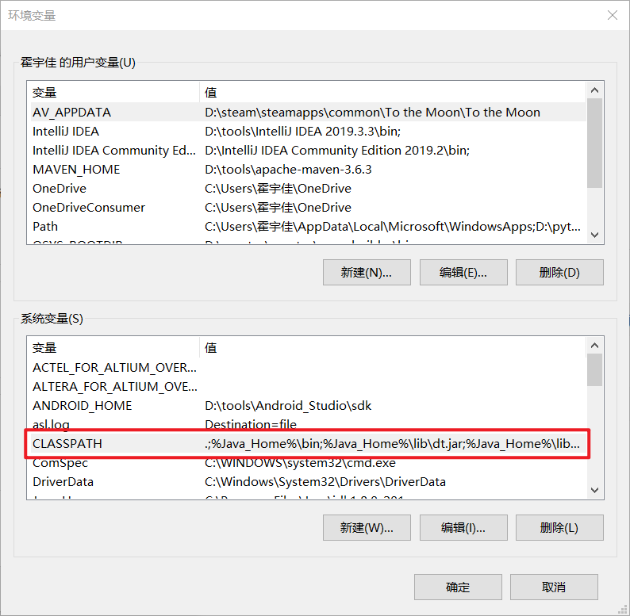

# 4.1 面向对象程序设计概述

- ==面向对象程序设计（OOP）==是当今主流的程序设计泛型，Java、Python等语言均完全面向对象。
- 面向对象的程序是由对象组成的，每个对象包含==对用户公开的特定功能部分和隐藏的实现部分==。在OOP中，不必关注对象的具体实现，只要满足用户的需求即可。
- 传统的结构化程序设计通过设计一系列的过程（即算法）来求解问题。确定了过程就需要考虑存储数据的方式。这就是Pascal语言的设计者Niklaus Wirth将其著作命名为《算法+数据结构=程序》的原因。算法是第一位的，数据结构是第二位的。首先要决定如何操作数据，然后再决定如何组织数据，以便操作数据。
- 但是OOP调换了该次序，将数据放在第一位，然后再考虑操作数据的算法。

比如实现一个简单的Web浏览器大概需要2000个过程，如果采用OOP设计风格，大概需要100个类，每个类大概20个方法。假设给定对象的数据出错了，在访问过这个数据项的20个方法中查找错误要比在2000个过程中查找容易得多。


## 4.1.1 类

> **类（class）**是构造对象的模板或蓝图。由类构造（construct）对象的过程称为创建类的**实例（instance）**。

> **封装**（ecapsulation，有时称为数据隐藏）是将数据和行为组合在一个包中，并对对象的使用者隐藏了数据的实现方式。

> 对象中的数据称为**实例域**（instance field），操作数据的过程称为方法（method）。

```java
/*这一整个class就是一个类*/
public class Student{
    /*以下的三个对象数据就为实例域，也称为对象的属性*/
    private Integer id;
    private String name;
    private int age;
    
    /*以下的三个操作数据的过程就称为方法*/
    public Integer getId(){
        return this.id;
    }
    
    public String getName(){
        return this.name;
    }
    
    public int getAge(){
        return this.age;
    }
}
```

对于每个特定的类实例（对象）都有一组特定的实例域值。这些值的集合就是这个对象的当前==状态==（status）。

- 实现封装的关键在于==绝对不能让类中的方法直接地访问其他类的实例域==。程序仅能通过其他对象的方法与对象数据进行交互。
- 封装意味着一个类可以全面地改变存储数据的方式，只要仍旧使用同样的方法操作数据，其他的对象就不会知道或介意所发生的变化。这是提高==重用性和可靠性==的关键。


## 4.1.2 对象

- 对象的三个主要特征：

  - ==对象的行为（behavior）==：可以对对象施加哪些操作，或可以对对象施加哪些方法？

  - ==对象的状态（state）==：当施加方法时，对象应该如何响应？

  - ==对象的表示（identity）==：如何分辨具有相同行为与状态的不同对象？

- 对象状态的改变必须通过调用方法实现，如果不经过调用方法就可以改变对象的状态，只能说明封装性遭到了破坏。
- 作为一个类的实例，每个对象的标识==永远==是不同的，状态==常常==也存在着差异。

- 对象的状态和行为互相影响。


## 4.1.3 识别类

识别类的简单规则是在分析问题的过程中寻找名词，而方法对应着动词。


## 4.1.4 类之间的关系

在类之间最常见的关系有：==依赖（“uses-a”）、聚合（“has-a”）、继承（“is-a”）==。

- **依赖**

  依赖（dependence），即“==uses-a==”关系，是一种最明显、最常见的关系。例如Order（订单）类使用Account（账户）类是因为Order对象需要访问Account对象查看信用状态。但是Item（商品）类不依赖于Account类，因为Item对象与客户账户无关。因此，如果一个类的方法操纵另一个类的对象，我们就说一个类依赖于另一个类。

- **聚合**

  聚合（aggregation），即“==has-a==”关系，是一种具体且易于理解的关系。例如，一个Order对象包含一些Item对象。聚合关系意味着类A的对象包含类B的对象。

- **继承**

  继承（inheritance），即“==is-a==”关系，是表示特殊和一般关系的。例如，RushOrder类由Order类继承而来。一般来说，如果类A扩展类B，类A不但包含从类B继承的方法，还会拥有一些额外的功能。

很多程序员采用==UML==（Unified Modeling Language，统一建模语言）绘制类图。

|         关系         |                          UML连接符                           |
| :------------------: | :----------------------------------------------------------: |
|     继承（泛化）     |  |
|       接口实现       |  |
|         依赖         |  |
|         聚合         |  |
|         组合         |  |
|   关联（双向关联）   |  |
| 直接关联（单向关联） |  |

**注意：聚合和组合的区别是聚合不是“同生共死”的，组合是“同生共死”的。如人和器官的关系是组合，人和财物的关系是聚合。关联是指双方都存在对方类类型的属性，单向关联是一个类里面有的属性的类型是另一个类。一般来说，开发过程不会特别注重这些概念的区别，了解即可。**


# 4.2 使用预定义类

在Java中，没有类就无法做任何事情。但是并不是所有的类都有面向对象的特征（比如`Math`类）。`Math`类只封装了功能，不需要也不必隐藏数据，所以不用担心生成对象以及初始化实例域。


## 4.2.1 对象与对象变量

在Java程序设计语言中，使用==构造器（constructor）==构造新的实例。构造器是一种特殊的方法，用来构造和初始化对象。下面我们以Java标准库中的`Date`类举例。

构造器的名称应该与类名完全一致。要想构造一个`Date`对象，需要在构造器前面加上`new`操作符。

```java
/*构造一个Date对象*/
new Date()
```

如果希望构造的对象使用多次，我们需要将对象存放到一个变量中。

```java
Date date = new Date();
```

但是，需要注意的是，上面的`date`仅仅是一个对象变量（也常常称为==引用==），和对象有着本质的区别。事实上，所有的Java对象都存储在堆内存中，**一个对象变量并没有实际包含一个对象，只是引用一个堆内存中已经存在的对象而已。**


如果仅仅只是声明了一个变量，如下：

```java
Date date;
```

则`date`无法使用任何方法，使用方法将会导致编译错误。

我们可以显式地将对象变量设置为null，表面对象变量目前没有引用任何对象。

**注意：局部变量（定义在方法里的变量）不会像成员变量（定义在类的变量）一样默认地初始化为null，必须调用new或者设置为null进行初始化。**


## 4.2.2 Java类库中的LocalDate类

`Date`类有一个状态，即特定的时间点。在`Date`类中，时间是用距离一个固定时间点的毫秒数（可正可负）表示的，这个点就是所谓的纪元（epoch），它是UTC（Coordinated Universal Time，协调世界时）时间1970年1月1日00:00:00。

`Date`类目前已经不被Java所推荐使用，原因有三：

- `Date`如果不格式化，打印出的日期可读性差，如：Tue Sep 10 09:34:04 CST 2019。
- 使用`SimpleDateFormat`对时间进行格式化，但`SimpleDateFormat`是线程不安全的
- `Date`对时间处理比较麻烦，比如想获取某年、某月、某星期，以及`n`天以后的时间，如果用`Date`来处理的话真是太难了，你可能会说`Date`类不是有`getYear`、`getMonth`这些方法吗，但是这些方法都已被弃用。


因此，标准Java类库包含了两个类：一个是用来表示时间点的`Date`类，一个是用来表示大家熟悉的日历表示法的`LocalDate`类。==我们一般表示某个时间点使用`Date`类，表示日常的日历使用`LocalDate`类。==

- 不要使用构造器来构造`LocalDate`类的对象。可以使用静态工厂方法（factory method）调用构造器：

  ```java
  /*构造一个新对象，表示构造这个对象时的日期*/
  LocalDate.now();
  
  /*使用年月日构造一个特定日期的对象*/
  LocalDate.of(1999, 12, 31);
  ```

  

- 我们可以通过方法`getYear`、`getMonthValue`、`getDayOfMonth`得到年月日。
- `plusDays`方法会得到一个新的`LocalDate`。


## 4.2.3 更改器方法和访问器方法

```java
LocalDate aThousandDaysLater = newYearsEve.plusDays(1000);
```

`plusDays`方法会生成一个新的`LocalDate`对象，然后把这个新对象赋给aThousandDaysLater变量。原来的newYearsEve变量没有任何的改动。这类似于`String`类中的`toUpperCase`方法，在一个字符串调用该方法后，该字符串保持不变，返回一个将字符大写的新字符串。

`GregorianCalendar`类（Java较早的日期类）的方法`add(int field, int amount)`同样也是给当前日期增加天数，但是调用该方法后，并不会返回一个新对象，而原来的对象的状态将会发生改变。这就是**更改器方法**。

相反，只访问对象而不修改对象的方法称为**访问器方法**（accessor method）。比如`LocalDate.getYear`和`GregorianCalendar.get`就是访问器方法。

> java.time.LocalDate 8

```java
/*构造一个表示当前日期的对象*/
static LocalDate now()
    
/*构建一个表示给定日期的对象*/
static LocalDate of(int year, int month, int day)
    
/*得到当前日期的年月日*/
int getYear()
int getMonth()
int getDay()
  
/*得到当前日期是星期几，作为DayOfWeek类的一个实例返回。调用getValue来得到1~7之间的一个数，表示这是星期几，1代表星期一，7代表星期天*/
DayOfWeek getDayOfWeek()

/*生成当前日期之后或之前n天的日期*/
LocalDate plusDays(int n)
LocalDate minusDays(int n)    
```


# 4.3 用户自定义类

现在开始学习如何设计复杂应用程序所需要的各种**主力类（workhorse class）**。通常这些类没有main方法，却有自己的实例域和实例方法。==要想创建一个完整的程序，应该将若干类组合在一起，其中只有一个类有main方法。==


## 4.3.1 Employee类

在Java中，最简单的类定义形式为：

```java
/*Java命名规范，遵守驼峰命名规则，类名首字母大写，每个单词的首字母大写*/
class ClassName{
    field1;
    field2;
    ...
    constructor1
    constructor2
    ...
    method1
    method2
    ...    
}
```

接下来介绍一个非常简单却又非常经典的Java类——`Employee`类（雇员）。实际应用中可能很少会碰到，但是在今后的无数例子中都将会使用。

> Employee.java

```java
class Employee{
    /*实例域*/
    private String name;//雇员名字
    private double salary;
    private LocalDate hireDay;
    
    /*构造器，以后会具体介绍*/
    public Employee(String name, double salary, int year, int month, int day){
        this.name = name;
        this.salary = salary;
        this.hireDay = LocalDate.of(year, month, day);
    }
    
    /*访问器方法*/
    public String getName(){
        return this.name;
    }
    
    /*访问器方法*/
    public double getSalary(){
        return this.salary;
    }
    
    /*访问器方法*/
    public LocalDate getLocalDate(){
        return this.hireDay;
    }
    
    /*更改器方法*/
    public void raiseSalary(double byPercent){
        double raise = salary * byPercent / 100;
        salary += raise;
    }
}
```

接下来介绍我们如何实际使用`Employee`类。

> EmployeeTest.java

```java
import java.time.*;

public class Employee{
    public static void main(Strings[] args){
        Employee[] staff = new Employee[3];
        
        staff[0] = new Employee("Carl Cracker", 75000, 1987, 12 ,15);
        staff[1] = new Employee("Harry Hacker", 50000, 1989, 10, 1);
        staff[2] = new Employee("Tony Tester", 40000, 1990, 3, 15);
        
        for(Employee e : staff){
            e.raiseSalary(5);
        }
        
        for(Employee e : staff){
            System.out.println("name=" + e.getName() + ",salary=" + e.getSalary() + ",hireDay=" + e.getHireDay());
        }
    }
}
```

在这个程序中，构建了一个`Employee`数组，并填入了三个雇员对象，接下来利用`Employee`类的`raiseSalary`方法将每个雇员的薪水提高5%，最后调用`getName`方法、`getSalary`方法和`getHireDay`方法将每个雇员的信息打印出来。

- 文件名必须和public（公有）类的名字相匹配。
- 在一个源文件中，只允许有一个公有类，但可以有任意数目的非公有类。
- 每当有一个类在main方法中被使用，编译器（javac）就会在目录下创建这个类的class文件。
- 将程序中包含main方法的类名提供给字节解释器，可以启动这个程序：`java 类名`，如上为`java EmployeeTest`。


## 4.3.2 多个源文件的使用

许多程序员习惯将一个类存储在一个单独的源文件中，这是约定俗成的规则。但是在Leetcode等刷题网站中，往往只能有一个public类，我们需要将剩余的类去掉`public`修饰词，才能在刷题网站中通过。

例如，将4.3.1小节中的`Employee`类存放在文件`Employee.java`中，将`EmployeeTest`类存放在文件`EmployeeTest.java`中。如果以这种方式组织文件，那么就可以使用两种编译源程序的方式：

1. 使用通配符调用Java编译器：`javac Employee*.java`。
2. 键入以下命令：`javac EmployeeTest.java`。

第二种方式并没有显性地编译`Employee.java`，但是当编译器发现`EmployeeTest.java`使用了`Employee`类时会自动寻找名为`Employee.class`的文件。如果没有找到这个文件就会自动地搜索`Employee.java`，然后对它进行编译。==更重要的是，如果`Employee.java`比已有的`Employee.class`文件版本新，那么Java编译器就会自动地重新编译这个文件。==


## 4.3.3 剖析Employee类

`Employee`类包含一个构造器和四个方法：

```java
public Employee(String name, double salary, int year, int month, int day)
public String getName()
public double getSalary()
public LocalDate getHireDay()
public void raiseSalary(double byPercent)
```

这个类的所有方法都被标记为`public`，意味着任何类的任何方法都可以调用这些方法，具体的类修饰词将会在接下来介绍。

需要注意`Employee`类的实例中有三个实例域用来存放将要操作的数据：

```java
private String name
private double salary
private LocalDate hireDay
```

这些实例域都被标记为`private`，确保只有`Employee`类自身的方法可以访问到这些实例域，其他类的方法不能够读写这些域。==不提倡使用`public`标记实例域，这意味着允许程序中的任何方法对其进行修改和读取，这完全破坏了封装，强烈建议将实例域标记为`private `。==

有两个实例域本身就是对象：`name`域是`String`类对象，`hireDay`域是`LocalDate`类对象。


## 4.3.4 从构造器开始

接下来解析`Employee`类的构造器：

```java
public Employee(String name, double salary, int year, int month, int day){
    this.name = name;
    this.salary = salary;
    this.hireDay = LocalDate.of(year, month, day);
}
```

构造器与类同名，在构造`Employee`类的对象时，构造器会运行，以便将实例域初始化为所希望的状态。例如，当使用下面这条代码创建`Employee`类实例时：

```java
Employee james = new Employee("James Bond", 100000, 1950, 1 ,1);
```

将会把`Employee`类的实例中的实例域设置为：

```java
name = "James Bond";
salary = 100000;
hireDay = LocalDate.of(1950, 1, 1);
```

构造器是特殊的方法，与其他的方法不同的重要一点是：构造器总是伴随着`new`操作符的执行被调用，而不能对一个已经存在的对象调用构造器来达到重新设置实例域的目的。例如：

```java
/*下面的语句将会产生编译错误*/
james.Employee("James Bond", 250000, 1950, 1, 1);
```

接下来还会具体介绍构造器，现在只需注意：

- 构造器与类同名。
- 每个类可以有一个以上的构造器。
- 构造器可以有0个、1个或多个参数。
- 构造器没有返回值。
- 构造器总是伴随着`new`操作一起调用。
- 所有的Java对象都是在堆中构造的。
- ==不要在构造器中定义与实例域重名的局部变量，定义之后将无法设置实例域。==


## 4.3.5 隐性参数和显性参数

方法用于操作对象以及存取它们的实例域。例如方法：

```java
void raiseSalary(double byPercent){
    double raise = salary * byPercent / 100;
    salary += raise;
}
```

`raise`方法有两个参数：第一个参数称为隐性（implicit）参数，是出现在方法名前的`Employee`类对象。第二个参数位于方法名后面括号中的数值，这是一个显性（explicit）参数。

在每一个方法中，关键字`this`表示隐性参数。下面的方法和上面的方法等价：

```java
void raiseSalary(double byPercent){
    double raise = salary * byPercent / 100;
    this.salary += raise;
}
```

这样可以将实例域与局部变量明显地区分开。


## 4.3.6 封装的优点

在`Employee`类中，`getName`方法、`getSalary`方法和`getHireDay`方法都是典型的访问器方法。由于它们只返回实例域值，因此又称为域访问器。

如果将`name`、`salary`或者`hireDay `实例域标记为`private`，那么将会产生一系列的好处：

- `name`是一个只读域，一位雇员在一般情况下都不会更改名字。一旦在构造器中设置完毕，就没有其他任何一个方法对它进行修改，这样就可以确保`name`不会受到外界的破坏。
- `salary`不是只读域，但是它只能够通过`raiseSalary`方法修改。一旦这个域值出现了错误，那么只需要调试这个方法即可。如果`salary`被`public`标记，那么破坏这个域值就可能会出现在任何的地方。

有些时候，需要获得或设置实例域的值。因此应该提供下面三项内容：

- 一个私有的实例域
- 一个公有的域访问器方法
- 一个公有的域更改器方法

==这就是Java的三大特性之一——封装==。

封装的好处如下：

1. 可以改变内部实现，除了该类的方法之外，不会影响其他代码。例如，如果将存储名字的域更改为

   ```java
   String firstName;
   String lastName;
   ```

   那么访问器方法可以更改为返回`firstName + " " + lastName`，程序的其他部分完全不会意识到名字已经进行了域更改。

2. 更改器方法可以执行错误检查。比如`setSalary`方法可以检查薪金是否小于0。

> **注意：不要编写返回引用可变对象的访问器方法。**
>
> 如果`getHireDay`方法返回了一个Date类对象，那么假如出现以下情况：
>
> ```java
> Employee e = new Employee("James Bond", 15000, 1950, 1, 1);
> Date d = e.getHireDay();
> d.setTime(d.getTime - 10 * 365.25 * 24 * 60 * 60 * 1000);//倒退十年
> ```
>
> `d`和`e.getHireDay()`引用同一个对象。调用`d`的更改器方法，而不是`e`的更改器方法，即可改变`e`的私有状态。这就破坏了`e`的封装性。
>
> 如果需要返回一个可变对象的引用，应该首先对它进行克隆（clone）。克隆的内容将会在第6章讨论。
>
> ```java
> public Date getHireDay(){
>     return (Date)this.hireDay.clone();
> }
> ```


## 4.3.7 基于类的访问权限

==一个类中的方法可以访问所属类的所有对象的私有数据==，如下：

```java
class Employee{
    ...
    public boolean equals(Employee other){
        return name.equals(other.name);
    }
}
```

这个方法是合法的，`Employee`类的方法可以访问`Employee`类的任何一个对象的私有域。


## 4.3.8 私有方法

由于公有数据非常危险，所以应当将所有的数据域都设置为私有的。尽管大多数情况下方法都是公有的，但在某些情况下，也可能将它们设计为私有的。比如，==可能希望将一个计算代码划分成若干个独立的辅助方法，由于辅助方法与当前的实现机制非常紧密，或者需要一个特殊的协议或者一个特别的调用顺序，那么这些辅助的方法就不应该被暴露在外。==

对于私有的方法，如果改用其他的方式实现了相应的操作，或者数据的表达方式发生了变化，我们可能就不再需要原来的方法。Java中，只要方法是私有的，它就不会被外部的其他类操作调用，可以放心将其删去；但是如果方法是公有的，就不能将其删去，因为其他的代码很可能依赖它。


## 4.3.9 final实例域

可以将实例域定义为`final`。一旦某个域被`final`标记，那么在构造对象时就必须初始化这样的域，并且在之后的操作中，不能再对它进行修改。

`final`修饰词大都应用于基本（primitive）类型域，或不可变（immutable）类的域（如果类中的所有方法都不会改变其对象，这个类就是不可变的类。比如`String`类就是一个不可变的类）。

对于可变的类，使用`final`修饰可能会对读者造成混乱。`final`只是表示被标记的域的对象引用不会再指示其他对象，==但是不保证这个对象内部不会进行修改==。因此我们尽量不用`final`来标记可变类。


# 4.4 静态域与静态方法


## 4.4.1 静态域

静态域可以和实例域进行区分。一个类中，如果其实例被`static`标记，则该实例是静态域；如果其实例没有被`static`标记，则该实例是实例域。

例如下面的`Employee`类：

```java
class Employee{
    private static int nextId = 1;
    private int id;
    ...
}
```

现在，每一个`Employee`对象都有一个自己的id域，但是这个`Employee`类的所有实例都会共享一个nextId域。即便没有一个`Employee`对象，静态域nextId也存在，它属于类，而不属于任何一个独立的对象。


## 4.4.2 静态常量

静态变量在实际开发中用得很少，而静态常量使用得很多。例如`Math`类定义了一个静态常量：

```java
public class Math{
    ...
    public static final double PI = 3.14159265358979323846;
	...
}
```

在程序中，可以使用`Math.PI`的形式获得这个常量。

另外一个经常使用的静态常量是`System.out`：

```java
public class System{
    ...
    public static final PrintStream out = ...;
    ...
}
```

之前有介绍说最好不要将域设计为`public`。但是常量却没问题，因为`out`被声明为`final`，所以不允许修改。

**注意：`System`类中有一个`setOut`方法是可以更改out的值的，这是因为`setOut`是一个本地方法，不是用Java语言实现的。本地方法可以绕过Java语言的存取控制机制。我们在编写程序时不应该这样做。**


## 4.4.3 静态方法

静态方法是一种不能向对象实施操作的方法，可以简单地认为静态方法是没有隐性参数的方法。

静态方法不可以操作对象，但是静态方法可以访问自身类中的静态域。下面是使用静态方法的实例：

```java
public class Employee{
    public static int getNextId(){
        return nextId;
    }
}
```

可以通过类名调用这个方法：

```java
int n = Employee.getNextId();
```

我们也可以使用对象调用静态方法，不过这种方式容易造成混淆，其原因是静态方法计算得到的结果跟其对象没有一点关系。

==使用静态方法的两种情况：==

- 一个方法不需要访问对象状态，其所需参数都是由显式参数提供。（例如`Math.pow`）
- 一个方法只需访问类的静态域。（例如`Employee.getNextId`）


## 4.4.4 工厂方法

静态方法通常还有另外一种用途。类似`LocalDate`和`NumberFormat`类使用静态工厂方法来构造对象。`LocalDate.now`和`LocalDate.of`就是典型的工厂方法。

下面是`NumberFormat`类使用工厂方法生产不同风格的格式化对象：

```java
NumberFormat currencyFormatter = NumberFormat.getCurrencyInstance();
NumberFormat percentFormatter = NumberFormat.getPercentInstance();
double x = 0.1;
System.out.println(currencyFormatter.format(x));// 输出 $0.10
System.out.println(percentFormatter.format(x));// 输出 10%
```

为什么要使用工厂方法而不使用构造器方法呢？原因主要有两个：

1. 无法命名构造器。构造器的名称必须和类名相同。但是我们希望将得到的货币实例和百分比实例采用不同的名字。
2. 当使用构造器时，无法改变所构造的对象类型。而工厂方法返回一个`DecimalFormat`类对象，这是`NumberFormat`的子类。


## 4.4.5 main方法

main方法也是一个静态方法。

```java
public class Application{
    public static void main(String[] args){
        // construct objects here
        ...
    }
}
```

main方法不对任何对象进行操作，事实上在启动程序时还没有任何的对象。静态的main方法将执行并创建程序所需要的对象。

但是每一个类都可以有一个main方法。我们在运行编译的程序时，只需运行对应的Java类，就会加载对应的main方法。


# 4.5 方法参数

在程序设计语言中，将参数传递给方法（或函数）一般有两种方式：

- **按值调用：**方法接收的是调用者提供的值。
- **按引用调用：**方法接收的是调用者提供的变量地址。

一个方法可以修改传递引用所对应的变量值，但不能修改传递值调用所对应的变量值。

==Java程序设计语言总是采用按值调用。==也就是说，方法得到的是所有参数值的一个拷贝，方法不能修改传递给它的任何参数变量的内容。

假设一个方法视图将一个参数值增加至3倍：

```java
public static void tripleValue(double x){
    x = 3 * x;
}
```

然后调用这个方法：

```java
double percent = 10;
tripleValue(percent);
```

调用这个方法后，percent的值还是10。下面为具体的执行过程：

1. x被初始化为percent的一个拷贝（也就是10）。
2. x被乘以3后等于30。但是percent仍是10.
3. 这个方法结束之后，参数变量x不再使用。


但是如果是对象引用作为参数就不同了。假设一个方法将一个雇员的佣金提升3倍：

```java
public static void tripleSalary(Employee x){
    x.raiseSalary(200);
}
```

当调用：

```java
harry = new Employee(...);
tripleSalary(harry);
```

下面为具体的执行过程：

1. x被初始化为harry值的拷贝，这里是一个对象的引用拷贝。
2. `raiseSalary`方法应用于这个对象引用。x和harry同时引用的那个`Employee`对象的薪金提升了200%。
3. 方法结束后，参数变量x不再使用，但是，对象变量harry继续引用那个薪金增至3倍的雇员对象。


但是，上面这种方式和按引用调用仍有一定的区别（Java只有按值调用的方式），下面以一个交换两个雇员对象的方法为例：

```java
public static void swap(Employee x, Employee y){
    Employee temp = x;
    x = y;
    y =temp;
}
```

如果Java对对象采用的是按引用调用，那么上面的方法就应该能够实现交换数据的效果，但是实际上上面的方法并没有实际生效，这个方法交换的是x和y这两个引用的拷贝。在方法结束时x和y就被丢弃了。原来的变量仍然引用这个方法调用之前所引用的对象。

==下面总结Java中方法参数的使用情况：==

- ==一个方法不能修改一个基本数据类型的参数。==
- ==一个方法可以改变一个对象参数的状态。==
- ==一个方法不能让对象参数引用一个新的对象。==


# 4.6 对象构造


## 4.6.1 重载

有些类可以有多个构造器。例如`StringBuilder`类，如下：

```java
/*构造一个空的StringBuilder对象*/
StringBuilder messages = new StringBuilder();

/*指定一个初始字符串*/
StringBuilder todoList = new StringBuilder("To do:\n");
```

这种特征称为**重载（overloading）**，如果多个方法有相同的名字，不同的参数，便产生了重载。

编译器通过用各个方法给出的参数类型与特定方法调用所使用的值类型进行匹配来挑选出相应的方法。这个过程称为**重载解析（overloading resolution）**。如果编译器找不到匹配的参数，就会产生编译时错误。

Java允许重载任何方法，而不仅限于构造器方法。要完整地描述一个方法，需要指出方法名以及参数类型，这称为**方法的签名（signature）**。如下为`String.indexOf`的方法签名：

```java
indexOf(int)
indexOf(int, int)
indexOf(String)
indexOf(String, int)
```

返回类型不是方法签名的一部分，即不能存在两个方法名和参数类型相同，但返回类型不同的方法。


## 4.6.2 默认域初始化

如果在构造器中没有显式地给域赋予初值，那么实例域就会被自动地赋为默认值：数值为0，布尔值为false，字符（char）为空字符，对象引用为null。

但是局部变量（方法中声明的变量）必须明确地初始化，否则会出现编译时异常。


## 4.6.3 无参数的构造器

很多类都包含无参数的构造函数，对象由无参数的构造函数创建时，其状态会被设置为适当的默认值。例如，以下是`Employee`类的无参数构造函数：

```java
public Employee(){
    this.name = "";
    this.salary = 0;
    this.hireDay = LocalDate.now();
}
```

如果在编写一个类时既没有编写无参构造器，又没有编写有参构造器，那么系统就会自动提高一个无参构造器。这个构造器将所有的实例域都设置为默认值。于是实例域中的数值型数据设置为0、布尔型数据设置为false、所有对象域设置为null。

如果一个类中提供了至少一个有参构造器，但是没有提供无参构造器，则系统不会自动生成无参构造器。在构造对象时如果没有提供参数将会被视为不合法。

如果希望所有的域都被赋予默认值，可以采用下列的格式：

```java
public ClassName(){
    
}
```

**注意：Java规范是类中如果提供了至少一个有参构造器，那么同时也应该提供一个无参构造器。**


## 4.6.4 显式域初始化

确保不管怎么调用构造器，每个实例域都可以被设置为一个有意义的初值，这是一种很好的设计习惯。可以在类定义中，直接将一个值赋给任何域。例如：

```java
class Employee{
    private String name = "";
    ...
}
```

初始值不一定是常量值，也可以调用方法来对域进行初始化。如下：

```java
class Employee{
    private static int nextId;
    private int id = assignId();
    ...
    private static int assignId(){
        int r = nextId;
        nextId ++;
        return r;
    }
}
```

当我们希望一个类中的所有构造器都把相同的值赋予某个特定的实例域时，我们就可以在执行构造器前先进行显示域初始化的操作。


## 4.6.5 参数名

以前构造器方法的参数通常使用单个字符命名，如下：

```java
public Employee(String n, double s){
    name = n;
    salary = s;
}
```

这样做的缺陷就是只有阅读代码才能够知道参数n和参数s的含义。

有些程序员习惯在构造器的每个参数前加上一个前缀“a”，如下：

```java
public Employee(String aName, doublie aSalary){
	name = aName;
    salary = aSalary;
}
```

这样比单个字母清晰。每一个读者都能知道参数的含义。

下面是我们现在一般使用的参数命名方式，它基于这样的事实：参数变量用同样的名字将实例域屏蔽起来（如果将参数命名为salary，salary将引用这个参数，而不是实例域）。但是，可以采用`this.salary`的形式访问实例域。

4.3.5节中有介绍：this指示隐性参数，也就是所构造的对象。下面是一个示例：

```java
public Employee(String name, double salary){
    this.name = name;
    this.salary = salary;
}
```


## 4.6.6 调用另一个构造器

关键字`this`除了引用方法的隐形参数外，还有另外一个含义。

如果构造器的第一个语句形如`this(...)`，这个构造器将调用同一个类的另一个构造器。如下：

```java
public Employee(double salary){
    this("Employee #" + nextId, salary);
    nextId++;
}
```

当调用`new Employee(60000)`时，`Employee(double)`构造器将调用`Employee(String, double)`构造器。


## 4.6.7 初始化块

前面已经讲了两种初始化数据域的方法：在构造器中设置值和在域声明时赋值。

实际上，Java还有第三种初始化域的方法：**初始化块**。在一个类的声明中，可以有多个代码块，只要构造类的对象，这些块就会被执行。如下：

```java
class Employee{
    private static int nextId;
    
    private int id;
    private String name;
    private double salary;
    
    /*对象初始化块*/
    {
        id = nextId;
        nextId++;
    }
    
    public Employee(){
        name = "";
        salary = 0;
    }
    
    public Employee(String name, double salary){
        this.name = name;
        this.salary = salary;
    }
    ...
}
```

在上面的示例中，无论使用哪个构造器构造对象，id域始终在对象初始化块中被初始化。首先会运行初始化块，然后才运行构造器的主体部分。不过这种机制不太常见，也不是必需的。

**注意：即使在类的后面定义，仍然可以在初始化块中设置域。但是为了避免循环定义，不要读取在后面初始化的域。建议将初始化块放在域定义之后。**

下面是调用构造器的具体处理步骤：

1. 所有数据域被初始化为默认值（0、false或null）。
2. 按照在类声明中出现的次序，依次执行所有域初始化语句和初始化块。
3. 如果构造器第一行调用了第二个构造器，则执行第二个构造器的主体。
4. 执行这个构造器的主体。

可以提供一个初始值或者使用一个静态的初始化块来对静态域进行初始化。前面已经介绍了第一种机制：

```java
public static int nextId = 1;
```

如果对域的静态域进行初始化的代码比较复杂，那么可以使用静态的初始化块。将代码放到一个块内，并标记关键字`static`。在类第一次加载的时候，将会进行静态域的初始化。如下：

```java
static{
    Random generator = new Random();
    nextId = generator.nextInt(10000);
}
```

==所有的静态初始化语句以及静态初始化块都将按照类定义的顺序执行。（只看最后出现的初始化）==

> java.util.Random

```java
/*构造一个新的随机数生成器*/
Random()

/*返回一个0~(n-1)之间的随机数*/
int nextInt(int n)
```


## 4.6.8 对象析构与finalize方法

有些面向对象的程序设计语言，特别是C++，有显示的析构器方法，其中放置一些当对象不再使用时需要执行的清理代码。在析构器中，最常见的操作是回收分配给对象的存储空间。

在Java中有自动的垃圾回收器，不需要人工回收内存，所以Java不支持析构器。

当然，某些对象使用了内存之外的资源，如文件使用了系统资源的另一个对象的句柄（标识对象或者项目的标识符，可以用来描述窗体、文件等）。在这种情况下，当资源不再需要时，将其回收和再利用将显得十分重要。

可以为任何一个类添加`finalize`方法。`finalize`方法将在垃圾回收器清除对象之前调用。==不过在实际应用中不要依赖`finalize`方法回收任何短缺的资源==，因为很难知道该方法什么时候被调用。

如果某个资源需要在使用结束后立刻被关闭，那么就需要人工来处理。对象用完后，可以使用一个`close`方法来完成相应的清理工作。7.2.5小节将会介绍这个方法自动得到调用。


# 4.7 包

Java允许使用**包（package）**将类组织起来。借助包可以方便地组织自己的代码，并将自己的代码和别人提供的代码库分开管理。

标准的Java类库分布在多个包中，包括`java.lang`、`java.util`和`java.net`等。标准的Java类库也有一个层次结构。如同硬盘的目录嵌套一样，也可以使用嵌套层次组织包。所有标准的Java包都位于`java`和`javax`包层次中。

==使用包的主要目的是确保类名的唯一性==。事实上，为了保证类名的绝对唯一性，Sun公司建议将公司的因特网域名以逆序的形式作为包名，并且不同的项目使用不同的子包。例如，`horsemann.com`是本书作者之一注册的域名，逆序形式为`com.horsemann`。这个包还可以进一步划分为子包，如`com.horsemann.corejava`。

不过，从编译器的角度来看，嵌套的包之间没有任何的关系。例如，`java.util`包与`java.util.jar`包毫无关系。每一个都有独立的类集合。


## 4.7.1 类的导入

一个类可以导入所属包中的所有类，和其他包中的公有类（public class）。我们可以采用以下两种方式访问另一个包的公有类：

1. 在每个类名前添加完整的包名，例如：

   ```java
   java.time.LocalDate today = java.time.LocalDate.now();
   ```

2. 上面的方式很繁琐，一般我们使用`import`语句的方式。

   `import`语句是一种引用包含在包中的类的简明描述。一旦使用了`import`语句，在使用类时就不必写出包的全名了。可以使用`import`语句导入一个特定的类或者整个包。
   
   `import`语句应位于源文件的顶部（但位于`package`语句的后面）。

例如可以使用下面这条语句导入`java.time`包中的所有类：

```java
import java.time.*;
```

然后就可以使用下面的`LocalDate`，无需再前面加上包的前缀。

```java
LocalDate today = LocalDate.now();
```

除此之外，我们还可以导入一个包中的特定类：

```java
import java.time.LocalDate;
```

**注意：使用星号（\*）只能导入一个包，而不能使用`import java.*`或者`import java.*.*`导入以java为前缀的所有包。**

在大多数情况下，我们只需导入所需的包，而不必过多地理睬它们。但是发生命名冲突的时候就必须要注意包的名字了。如`java.util`和`java.sql`包都有日期（Date）类。如果在程序中这样导入：

```java
import java.util.*;
import java.sql.*;
```

那么在使用Date类时，就会产生编译错误——编译器无法确定Date类究竟是哪一个包的。可以采用增加一个特定的import语句来解决这个问题：

```java
import java.util.*;
import java.sql.*;
import java.util.Date;
```

如果这两个包的Date类都需要使用，我们就必须在每个类名前面加上完整的包名了：

```java
java.util.Date deadline = new java.util.Date();
java.sql.Date today = new java.sql.Date();
```

> 在Eclipse中，可以使用菜单选项Source→Organize Imports，将会自动地将文件中所需的特定的类导入。
>
> 使用菜单选项Source→Add Imports，将光标放在需要导入的类名上，将会自动导入该类。


## 4.7.2 静态导入

`import`语句不仅可以导入类，还可以导入静态方法和静态域。

例如在源文件的顶部添加了一条指令：

```java
import static java.lang.System.*;
```

就可以使用`System`类的所有静态域和静态方法，而不必加类名的前缀：

```java
out.println("HelloWorld!");
exit(0);//正常退出程序
```

另外还可以导入特定的静态方法和静态域：

```java
import static java.lang.System.out;
```

不过一般我们不使用这种方法导入静态方法和静态域，不利于代码的清晰度。


## 4.7.3 将类放进包中

要想将一个类放进包中，就必须==把包的名字放在源文件的开头，包中定义类的代码之前。==例如把`Employee`

类放在`com.horstmann.corejava`包，如下：

```java
package com.horsemann.corejava;

public class Employee{
    ...
}
```

如果没有在源文件中放置`package`语句，这个源文件的类就会被放置在一个**默认包（default package）**中。默认包是一个没有名字的包。

我们必须将包中的文件放到与完整的包名相匹配的子目录中。例如，`com.horsemann.corejava`包中的所有文件都需要放置在子目录`com\horsemann\corejava`中。编译器也会将编译后的class文件放在相同的目录结构中。

**注意：编译器在编译源文件的时候是不会检查目录结构的。如果它不依赖于其他的包，那么即使没有位于正确的目录下也不会产生编译错误。但是最终程序是无法运行的，除非将所有的文件（包括依赖文件）都放置在正确的目录下。**

下面为实际开发中可能会涉及到的目录结构。

------


PackageTest类放置在默认包下，Employee类放置在`com.horstmann.corejava`包下，PackageTest类依赖于Employee类。因此`PackageTest.java`必须在根目录下，`Employee.java`必须在`com/horstmann/corejava`目录下。

要想编译该程序，只需在根目录中运行命令`java PackageTest`即可，编译器会自动查找文件`com/horstmann/corejava`并进行编译。

------


该例子更接近于实际的开发，我们一般不会将文件直接存储在根目录下，即不会把类放置在默认包中，而是会放在不同的包中。在这种情况下，我们仍然要在根目录编译和运行类，即在根目录运行下面的命令：

```shell
javac com/mycompany/PayrollApp.java
java com.mycompany.PayrollApp
```

**注意：编译器对文件进行操作，Java解释器加载类，因此javac后跟的是类文件（带有文件分隔符和扩展名.java的文件），java后跟的是完整的类名。**


## 4.7.4 包作用域

- 标记为public的部分（类、方法、变量）可以被任意的类使用
- 标记为private的部分（方法、变量）只能被定义它们的类使用
- 没有指定public或private的部分（类、方法、变量）可以被同一个包内的所有方法访问。

只有类不可见，那类中的方法和变量必定不可见，即使被标记为public。

在默认情况下，包并不是一个封闭的实体，即任何人都可以向包中添加更多的类。但是这样带来的坏处是低水平或者有敌意的程序员会利用包的可见性来添加一些具有修改变量功能的代码。如在Java程序设计语言的早期版本中，只要将语句`package java.awt`放在类文件的开头，并且把类文件放置在类路径某处的`java/awt`子目录下，就可以访问`java.awt`包的内部，利用这一特性，甚至可以对警告框进行修改。

为此，从1.2版本开始明确禁止加载用户自定义的、包名以`java.`开始的类。用户自定义的包也可以通过**包封闭（package sealing）**机制解决各种包混杂在一起的问题。这将在以后介绍。


# 4.8 包路径

类文件除了可以存储在文件系统的子目录下，还可以存储在JAR（Java归档）文件中。在一个JAR文件中，可以包含多个压缩形式的类文件和子目录。程序中用到第三方的库文件时，通常会给出一个或多个需要包含的JAR文件。JDK也提供了许多JAR文件，如著名的`jre/lib/rt.jar`中就包含数千个类库文件。如何创建JAR文件将在以后介绍。

------

为了能够使类被多个程序共享，我们需要做到：

- ==把类放在一个目录下面==，例如`/home/user/classdir`。需要注意这个目录是包树状结构的基目录。如果希望把`com.horstmann.corejava.Employee`类添加到其中，这个`Employee.class`文件就必须位于子目录`/home/user/classdir/com/horstmann/corejava`中。
- ==将JAR文件放在一个目录下==，例如`/home/user/archives`。archives表示档案。
- ==设置**类路径（class path）**。==类路径是所有包含类文件的路径的集合。

------

- 在UNIX环境中，类路径的不同项目之间采用冒号（:）间隔，如`/home/user/classdir:.:/home/user/archives/archives.jar`。而在Windows环境中，类路径则以分号（;）间隔，如`C:\classdir;.;C:\archives\archives.jar`。以上句点（.）都是代表当前目录。

- 类路径需包含：
  - 基目录`/home/user/classdir`或者`C:\classdir`
  - 当前目录（.）
  - JAR文件`/home/user/archives/archives.jar`或者`C:\archives\archives.jar`

==从Java1.6开始，可以在JAR文件目录下使用通配符==，如`/home/user/archives/‘*’`或者`C:\archives\*`。在UNIX中必须使用转义字符（单引号或者反斜杠）以防止shell命令扩展。

库文件（rt.jar和在jre/lib与jre/lib/ext目录下的其他JAR文件）会被自动地搜索，因此不必显式地列在类路径中。

**注意：有人建议将所有的文件都放置在`jre/lib/ext`目录下，坏处有二：一是当JAR文件放在该目录下时，一旦在它的类中有一个类需要调用既不是系统类也不是扩展类，那么就会报错；二是如果程序员忘将新的文件放置在该目录下后，加载的实际上也会是该目录的旧的文件。分析见：https://blog.csdn.net/qinzhengping/article/details/84203723**

**注意：如果没有设置类路径，Java虚拟机会默认使用当前目录作为类路径。但是一旦设置了类路径却没有包含当前目录，那么程序可以通过编译（Java编译器总是在当前的目录下查找文件），但是不能运行。**

------

下面以一个实例演示Java虚拟机和编译器查找类文件`com.horstmann.corejava.Employee`的过程：

类路径为`/home/user/classdir:.:/home/user/archives/archives.jar`。

- Java虚拟机

  1. 查看存储在`jre/lib`和`jre/lib/ext`目录下的JAR文件中存放的系统类文件
  2. 查找`/home/user/classdir/com/horstmann/corejava/Employee.class`
  3. 从当前目录开始查找相对路径`com/horstmann/corejava/Employee.class`
  4. 在JAR文件中查找`com/horstmann/corejava/Employee.class`

- Java编译器

  假设源代码文件包含指令`import java.util.*`和`import com.horstmann.corejava.*`，并且源代码引用了Employee类，编译器将依次寻找：

  1. `java.lang.Employee`（java.lang包默认导入）
  2. `java.util.Employee`
  3. `java.com.horstmann.corejava.Employee`
  4. 当前包中的Employee。

  如果找到了一个以上的类，就会产生编译错误。


## 4.8.1 设置类路径

最好采用指定`-classpath`或`-cp`选项的方法设置类路径：

```shell
java -classpath /home/user/classdir:.:/home/user/archives/archives.jar MyProg
```

或者

```shell
java -classpath C:\classdir;.;C:\archives\archives.jar
```

当然，也可以通过设置环境变量的方式设置类路径，在此不赘述。




# 4.9 文档注释

JDK包含一个很有用的工具，叫做**Javadoc**。它可以由一个源文件生成一个HTML文件。如果在源代码中添加以专用的定界符`/**`开始的注释，就可以很容易生成一个看上去很有专业水准的文档。同时，由于文档注释和源代码在同一个文件中，我们可以在修改源代码的同时修改文档注释，这样就保证了文档注释和源代码的一致性。


## 4.9.1 注释的插入

Javadoc将从以下几个特性中抽取信息：

- 包
- 公有类与接口
- 公有的和受保护的构造器及方法
- 公有的和受保护的域

应该为上面几部分编写注释。==注释应该放置在所描述特性的前面。以`/**`开始，以`*/`结束。==

每个文档注释在标记后紧跟着**自由格式文本（free-form text）**。标记由@开始，例如@author和@param就是常用的标记。

- 自由格式文本的第一句一般是一个概要性的句子。Javadoc将会自动地将这些句子抽取出来形成概要页。

- 在自由格式文本中，可以使用HTML修饰符。例如用于强调的`<em></em>`，用于着重强调的`<strong></strong>`以及包含图像的``。不过仍有一些标签是不能够使用的，例如`<h1></h1>`和`<code></code>`等等。

- 若要键入等宽代码，需使用`{@code ...}`。

- 如果文本中有到其他文件的链接，就应该把这些文件放到子目录`doc-file`中（规范）。例如插入图片``。


## 4.9.2 类注释

类注释必须放在import语句之后，类定义之前。下面是一个类注释的例子：

```java
/**
 * A {@code Card} object represents a playing card, such
 * as "Queen of Heart". A card has a suit(Diamond, Heart,
 * Spade or Club) and a value(1 = Ace, 2 ... 10, 11 = Jack,
 * 12 = Queen, 13 = King)
 */
public class Card{
    ...
}
```

每一行的开始没有必要都是星号，但是现在的IDE基本都会自动添加星号。只要在IDE中输入`/**`，回车后将会自动生成注释（当然注释的内容还是需要自己写）。


## 4.9.3 方法注释

方法注释必须在所描述的方法之前。除了通用的标记之外，还可以使用下面常用的方法标记：

- **@param 变量描述**

  这个标记可以对当前方法的参数部分添加一个条目。该描述可以占据多行，并且可以使用使用HTML标记。一个方法的所有@param标记必须是连续的。（即中间不允许出现其他的标记）

- **@return 返回值描述**

  这个标记将对当前方法添加返回部分。这个描述可以跨越多行，并且可以使用HTML标记。

- **@throw 异常描述**

  这个标记将添加一个注释，用于表述这个方法有可能抛出异常。

下面是一个方法的注释的示例：

```java
/**
* {@code getName}方法用于获取用户姓名
* @param age 用户名字
* @param id 用户id
* @return 返回用户名字
*/
public static String getName(int age, int id) {

}
```


## 4.9.4 域注释

只需要对公有域（通常是指静态常量）建立文档，例如

```java
/**
 * The "Hearts" card suit
 */
public static int HEARTS = 1;
```


## 4.9.5 通用注释

下面的注释可以用在类文档的注释中

- **@author 姓名**

  这个标记将会产生一个“author”（作者）条目。可以使用多个@author，每一个标记将会对应一个作者。

- **@version 版本**

  这个标记将会产生一个“version”（版本）条目。这里的文本可以是对当前版本的任何描述。

- **@since 文本**

  这个标记将会产生一个“since”（始于）条目。这里的文本可以是对引入特性的版本描述。例如，`@since version 1.7.1`。

- **@deprecated 文本**

  这个标记将对类、方法、变量添加一个不再使用的注释。文本中可以是对取代内容的建议。例如，

  ```java
  @deprecated Use <code>setVersible(true)</code> instead
  ```

  通过`@see`和`@link`标记，可以使用超级链接，链接到Javadoc文档的相关部分或者是外部文档。

- **@see 引用**

  这个标记将在“see also”部分增加一个超链接。我们可以为一个特性添加多个@see标签，但必须将它们放到一起。它可以用在类注释，也可以用在方法注释。==以下的`label`表示链接锚，如果忽略了链接锚，那么用户看到的锚名称就是目标代码名或者URL。==这里的引用可以选择下列情形之一：

  - **package.class#feature label**

    第一种情况是最常见的。只要提供类、方法或变量的名字，Javadoc就可以在文档中插入一个超链接。例如：

    ```java
    @see com.horsemann.corejava.Employee#raiseSalary(double)
    ```

    将会建立一个链接到`com.horsemann.corejava.Employee`类的`raiseSalary(double)`方法的超链接。==可以省略包名，甚至可以把包名和类名都省略，此时超链接将指向当前包或当前类。==

    **需要注意，一定要使用井号（#）而不是句号（.）来分隔类名和方法名，或类名与变量名。**

  - **\<a href="...">label\</a>**

    如果在@see后面有一个`<`字符，就需要指定一个超链接。可以链接到任意的URL，例如

    ```java
    @see <a href="www.baidu.com">百度</a>
    ```

  - **“text”**

    如果@see后面有一个双引号（“）字符，文本就会显示在“see also”部分，例如：

    ```java
    @see "Core Java volume 2"
    ```

- 可以在文档任何位置放置指向其他类或方法的超级链接，以及插入一个专用的标记，例如：

  ```java
  {@link package.class#feature label}
  ```
  
  这里的描述特性规则和`@see`标记规则一样。
  
  

## 4.9.6 包与概述注释

如果想要产生包的注释，需要在每一个包目录下添加一个单独的文件，有两种方法：

- 提供一个以`package.html`命名的HTML文件。在`<body></body>`之间的所有文本都会被提取出来。
- 提供一个以`package-info.java`命名的Java文件。这个文件必须包含并且只能包含一个初始的以`/**`和`*/`界定的Javadoc注释，跟随在一个`package ...`语句后面。

还可以为所有的源文件提供一个概述性的注释。这个注释放置在一个名为`overview.html`的文件中，这个文件位于包含所有源文件的父目录下。`<body></body>`之间的所有文本将会被抽取出来。当用户在导航栏里选择`Overview`时，就会显示这些注释内容。

  

## 4.9.7 注释的抽取

这里，假设Javadoc将要生成的HTML文件存放在目录`docDirectory`下。执行以下步骤：

1. 切换到包含想要生成文档的源文件目录的源文件目录下。如果有某个包想要生成文档，例如`com.horsemann,corejava`，就必须切换到包含子目录`com`的目录（如果存在`overview.html`文件，那么这也是该文件的所在目录）。

2. 如果是一个包，应该执行命令：

   ```shell
   javadoc -d docDirectory 包名
   ```

   或对于多个包生成Javadoc文档，运行：

   ```shell
   javadoc -d docDirectory 包名1 包名2
   ```

   如果文件在默认包中，运行

   ```shell
   javadoc -d docDirectory *.java
   ```

   如果忽略`-d docDirectory`，那么HTML文件就会被提取到当前目录下。

------

可以使用多种形式的命令行选项对Javadoc程序进行调整。例如可以使用`-author`或者`-version`在文档中包含`@author`或者`@version`（这些在源代码文件中的标记将会被忽略）。除此之外，`-link`可以为标准类添加超链接，如下：

```shell
javadoc -link http://docs.oracle.com/javase/8/docs/api *.java
```

那么所有的标准库类都会自动地链接到Oracle网站的文档。

如果使用`-linksource`选项，则每个源文件被转换为HTML（不对代码上色，但包含行编号），并且每个类名和方法名将转变为指向源代码的超链接。


# 4.10 类设计技巧

1. **一定要保证数据私有**

   很多刚开始编写Java语言的初学者都倾向于不使用`private`来修饰域，这实际上是相当危险的。很多惨痛的经验教训都会提示：数据的表现形式经常会发生改变，但是它们的使用方式不会经常发生改变。当数据保持私有时，它们表现形式的改变不会影响到使用方式，这也利于我们排查BUG。

2. **一定要对数据初始化**

   Java不对局部变量进行初始化，但是会对对象的实例域进行初始化。但是最好不要依赖于系统的默认值，最好在程序中显式地对变量进行初始化。初始化方式可以是提供默认值，也可以是在构造器中设置默认值。

3. **不要在类中使用过多的基本类型**

   最好使用其他的类代替多个相关的基本类型的使用。这样会使类更加易于理解且易于修改。例如用一个`Address`类替换掉`Customer`类以下的实例域：

   ```java
   private String Street;
   private String city;
   private String state;
   private int zip;
   ```

   这样就很容易处理地址的变化。例如新增对国际地址的处理。

4. **不是所有的域都需要独立的域访问器和域更改器**

   比如一旦构造了`Employee`对象，那么就应该禁止更改雇用的日期。并且对象中也会经常存在不希望别人获取或者设置的实例域，比如说`Address`类存放州缩写的数组。

5. **将职责过多的域进行分解**

   如果一个类过于复杂，我们就应该把这个类进行拆分。不过这还是依赖于个人的编程习惯。

6. **类名和方法名要体现它们的职责**

   命名类名最好是使用名词（比如Order、Address等），前面可以使用形容词或者动名词修饰（比如RushOrder、BillingAddress等）。对于方法来说，更改器方法一般用小写的set开头（比如setSalary），访问器方法一般使用小写的get开头（比如getSalary）。

7. **优先使用不可变的类**

   更改对象的问题就在于，如果多个线程试图同时更新一个对象，就会发生并发更改。其结果是不可预料的。如果类是不可变的，那么就可以安全地在多个线程中共享这个对象。

   比如我们要尽可能地使用`LocalDate`类而不是可变的`Date`类。但是并不是说所有的类都是不可变的，例如`Employee`类的`raiseSalary`方法，加薪如果生成了一个新的`Employee`对象，那将会十分奇怪。


