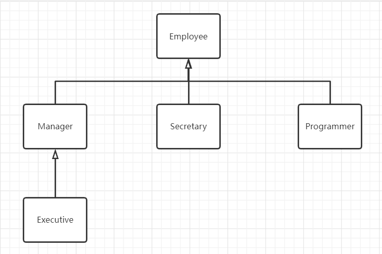
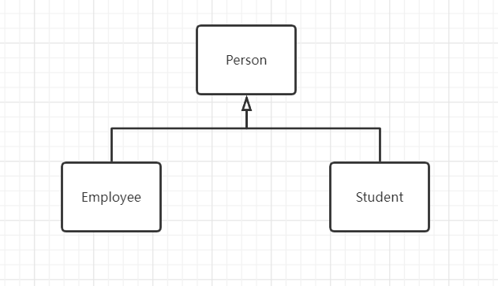
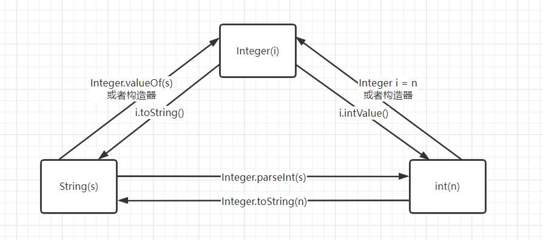
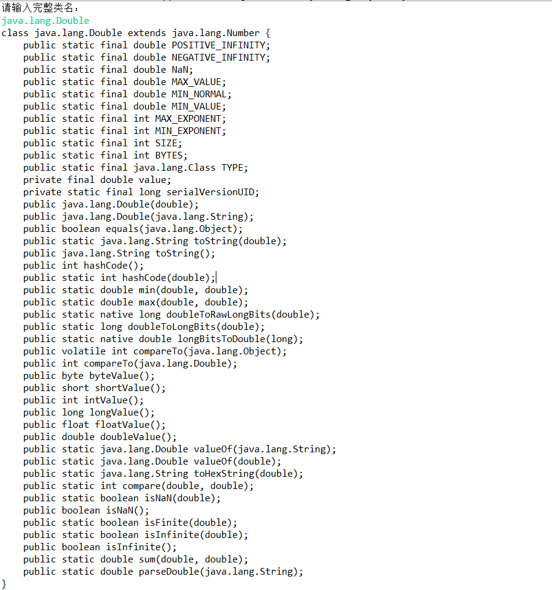

# 5.1 类、超类和子类

假如说我们在某个公司工作，这个公司的经理的待遇与普通员工（Employee类）的待遇存在一些差异。不过他们之间也存在一些相同的地方，比如说它们都领取薪水。只是普通员工在完成本职工作之后领取薪水，而经理在完成预期的工作之后还可以获得奖金。这种情形就可以使用**继承**。这是因为需要为经理定义一个新类Manager，以便增加一些新的功能。

但是可以重用Employee类中已经编写的部分代码，并将所有的域都保留下来。==从理论上讲，在Manager与Employee类之间存在着明显的“is-a”（是）关系，每个经理都是一个雇员：“is-a”关系是继承的一个明显的特征。==


## 5.1.1 定义子类

下面是由继承Employee类来定义Manager类的格式，关键字`extends`表示继承。

```java
public class Manager extends Employee{
    定义方法和域
}
```

关键字`extends`表示正在构建的新类派生与一个已存在的类。

- 已存在的类称为==超类（super class）、基类（base class）或父类（parent class）==
- 新类称为==子类（subclass）、派生类（derived class）或孩子类（super class）==

超类和子类通常是Java程序员最常用的两个术语。

尽管Employee类是超类，但并不是说它优于子类或是比子类拥有更多的功能，事实上恰恰相反，==子类比超类拥有的功能更加丰富。==

> 前缀“超”和“子”源于计算机科学和数学理论中集合语言的术语。所有雇员组成的集合包含所有经理组成的集合。因此可以这样说，雇员集合是经理集合的超集，经理集合是雇员集合的子集。

在Manager类中，增加了一个储存奖金的域，以及一个设置这个域的方法：

```java
public class Manager extends Employee{
    private double bonus;
    ...
    public void setBonus(double bonus){
        this.bonus = bonus;
    }
}
```

在超类中定义方法和域并没有什么特殊的地方。当然由于setBonus方法不是在Employee类定义的，因此Employee的对象无法使用这个方法。

但是，尽管Manager类没有显式地定义getName和getHireDay等方法，但是Manager类的对象仍然可以使用这些方法，==这是因为Manager类自动地继承了超类Employee类的这些方法。==

同样子类Manager还继承了超类的name、salary、hireDay这三个域。因此，Manager类实际上包含name、salary、hireDay、bonus四个域。

在通过扩展超类定义子类的时候，我们仅仅需要指明子类与超类的不同之处。==因此在设计类的时候，应该把通用的方法放在超类中，把具有特殊用途的方法放在子类中。==

·

## 5.1.2 覆盖方法

超类中的某些方法对子类不一定适用。比如说Manager类的getSalary方法应该返回薪水和奖金的总和。为此需要提供一个新的方法来**覆盖（override）**超类中的这个方法：

```java
public class Manager extends Employee{
    ...
    public double getSalary(){
        ...
    }
}
```

应该如何实现这个方法呢，很多人会直接想到返回salary和bonus域的总和就可以了：

```java
public double getSalary(){
    return salary + bonus;
}
```

但是实际上这个方法不能运行，因为==Manager类的getSalary方法不能直接地访问超类的私有域。==也就是说尽管每个Manager类的对象都拥有一个名为salary的域，但在Manager类的方法并不能直接地访问salary域。只有Employee类的方法才能访问到私有域。因此，==如果Manager类需要访问Employee的私有域，就必须借助公有的接口==，如下：

```java
public double getSalary(){
    return getSalary() + bonus;
}
```

但是上面的代码仍然不能运行，==这是因为Manager类实际上也有一个getSalary方法（上面的例子中是它本身），所以这条语句会无限次地调用自己。==

需要注意的是，==我们希望调用的是父类Employee中的getSalary方法，而不是当前类的getSalary方法，因此可以使用关键字`super`来解决这个问题==：

```java
public double getSalary(){
    return super.getSalary() + bonus;
}
```

上面的方法才会最终返回我们所需要的结果。

**需要注意：在子类中可以增加域、增加方法或是覆盖超类的方法，但是绝对不可能删除继承的任何域和方法（即便不可以调用超类的方法，也算作继承超类的方法）。**

> 有些人会认为super和this是类似的概念，但是实际上这种想法是错误的。因为super并不是一个对象的引用，不能将super赋给另一个对象变量，它只是一个指示编译器调用父类方法的特殊关键字。而this是可以赋给其他变量的。


## 5.1.3 子类构造器

```java
public Manager(String name, double salary, int year, int month, int day){
    super(name, salary, year, month, day);
    bonus = 0;
}
```

在这里的关键字`super`具有不同的含义。语句`super(name, salary, year, month, day)`表示调用超类Employee中含有name、salary、year、month、day参数的构造器。

==由于Manager类的构造器不能访问超类Employee类的私有域，因此必须利用Employee的构造器对这一部分私有域进行初始化。==我们可以通过`super`实现对超类构造器的调用。

**需要注意：使用super调用超类构造器的语句必须是子类构造器的第一条语句。**

==当子类对象在没有显式调用超类构造函数的情况下构造时，该超类必须具有无参数构造函数。该构造函数在子类构造之前被调用。==

关键字`this`有两个作用：

1. 引用隐式参数
2. 调用该类的其他构造器

关键字`super`同样有两个作用：

1. 调用超类的方法
2. 调用超类的构造器

二者的调用构造器的语句只能作为另一个构造器的第一条语句出现。


## 5.1.4 继承层次

继承并不仅限于一个层次。例如，也可以由Manager类派生Executive类。由一个公共超类派生出来的所有类的集合称为**继承层次（inheritance hierarchy）**，如下图所示：



在继承层次中，从某个特定的类到其祖先的路径被称为该类的**继承链（inheritance chain）**。

通常，一个祖先可以由多个子孙的继承链。例如可以由Employee类派生出子类Manager、Secretary或Programmer，它们之间可能没有任何关系。

**注意：Java不支持多继承，如果需要实现多继承，可以使用接口，将在之后进行介绍。**


## 5.1.5 多态

有一个用来判断是否应该设计为继承关系的简单规则，这就是`is-a`规则，==它表明子类的每一个对象也是超类的对象。==例如每个经理（Manager）同时也是雇员（Employee），因此应当将Manager类设计为Employee类的子类。

`is-a`规则的另一种表述法是`置换法则`。==它表示出现超类对象的任何地方都可以用子类对象来替换。==例如可以将一个子类对象赋给超类变量：

```java
Employee e;
e = new Employee(..);
/* 下面这样使用也是可以的 */
e = new Manager(...);
```

==在Java程序设计语言中，对象变量是多态的。==一个Employee类的变量既可以引用一个Employee类的对象，也可以引用一个Employee类的任意子类的对象（如Manager类、Secretary类等）。下面是多态的一个例子：

```java
Manager boss = new Manager(...);
Employee[] staff = new Employee[3];
staff[0] = boss;
```

在这个例子中，staff[0]和boss引用同一个对象。但是编译器将staff[0]看成是Employee类的对象（因为声明的类型是Employee）。

这意味着可以这样调用：`boss.setBonus(5000)`，但是不能这样调用：`staff[0].setBonus(5000)`，这是因为staff[0]声明的类型是Employee，而setBonus方法不是Employee的方法。

多态并不意味着我们可以将一个超类的对象赋给子类的变量。例如这样赋值是非法的：`Manager m = staff[i]`。这是因为不是所有的雇员都是经理，如果这样赋值，万一m引用的不是经理的Employee对象，在后面调用m.setBonus(...)就很有可能出错。

> 在Java中，子类数组的引用可以转换为超类数组的引用，而无需强制类型转换。例如下面是一个Manager数组
>
> Manager[] managers = new Manager[10]
>
> 把它转换为Employee[]数组是完全可以的
>
> Employee[] employees = managers
>
> 我们需要切记employees和managers实际上引用的是相同的数组，但是如果使用下面的语句：
>
> employees[0] = new Employee(...)
>
> 编译器会通过这个赋值操作，但是我们把这个普通雇员也归为经理了（managers[0]和employees[0]实际上是引用同一个对象）。当调用manager[0].setBonus(1000)的时候，会导致调用一个不存在的实例域，进而搅乱相邻存储空间的内容。
>
> 为了确保不发生这种错误，我们需要牢记所有数组的元素类型，并负责监督仅将类型兼容的引用存储到数组中。如果试图存储一个Employee类型的引用，就会引发ArrayStoreException异常。


## 5.1.6 理解方法调用

下面假如说要调用`x.f(args)`，隐性参数x（[x为何为隐式参数](https://blog.csdn.net/bornlone/article/details/83330199)）声明为类C的对象。下面是调用过程的详细描述：

1. **编译器查看对象的声明类型和方法名。**编译器会一一列举所有C类中名为f的方法和其超类中访问属性为public的方法（超类的私有方法不可访问）。

2. **编译器将查看调用方法时提供的参数类型。**如果在所有名f的方法中存在一个与提供的参数类型完全匹配，就选择这个方法。这个过程称为**重载解析（overloading resolution）**。例如，对于调用x.f(“Hello”)来说，编译器将会挑选f.(String)，而不是f.(int)。由于允许类型转换（int可以转换为double，Manager可以转换为Employee），所以实际上重载解析的过程会很复杂。如果编译器没有找到与参数类型匹配的方法，或者找到了多个匹配的方法，就会报告错误。

   > 方法的名字和参数列表称为方法的签名。例如f(int)和f(String)是方法名相同、签名不同的方法。如果在子类中定义了一个签名与超类签名相同的方法，那么子类的这个方法就会覆盖超类中这个相同签名的方法。
   >
   > 返回类型并不是方法签名的一部分。因此在覆盖方法时一定要保证返回类型的兼容性。**允许子类将覆盖方法的返回类型定义为原返回类型的子类。**例如Employee有
   >
   > public Employee getBuddy()
   >
   > Manager类可以用下面这种方式来覆盖掉上面的方法
   >
   > public Manager getBuddy()
   >
   > 但是不可以用下面这种方式来覆盖掉上面的方法
   >
   > public Person getBuddy() //不合法，即使Person类是Employee类的超类
   >
   > 或者
   >
   > public int getBuddy() //不合法

3. **如果是private方法、static方法·、final方法或者构造器，那么编译器将可以准确地知道调用哪个方法，我们将这种方法称为静态绑定。**其他的方法需要在运行时才能确认调用哪个方法，称为**动态绑定**。
4. **当程序运行，并且采用动态绑定的方式调用方法时，虚拟机一定调用与x所引用对象的实际类型最合适的方法。**假设x的实际类型是D，它是C类的子类。如果D类定义了f(String)，那么就会直接调用它；否则会到D类的超类中寻找f(String)，以此类推。

由于每次调用方法都需要搜索，时间开销相当大。因此虚拟机为每个类预先创建了一个**方法表（method table）**，其中列举了所有方法的签名和实际调用的方法。

------

现在以调用e.getSalary()的详细过程举例（e的实际类型是Manager，声明类型是Employee）：

- **编译，下面的工作由编译器来执行**

  1. 编译器查看e的声明类型和方法名。并且一一列举Employee类的所有方法以及其超类的方法。
  2. 由于Employee中只有一个方法名为getEmployee的方法，因此无需进行重载解析。
  3. 由于该方法不是private方法、static方法、final方法，因此绑定方式是动态绑定。只有当程序运行时才能确定调用的方法。以上就是编译的过程。

- **运行，下面的工作由虚拟机执行**

  1. 虚拟机预先为Employee类和Manager类生成两个方法表。在Employee类中列出了这个类的所有方法：

     ```java
     Employee:
     	getName() -> Employee.getName()
         getSalary() -> Employee.getSalary()
         getHireDay() -> Employee.getHireDay()
         raiseSalary(double) -> Employee.raiseSalary(double)
     ```

     实际上上面的方法列的还不是很完整，Employee类是Object类的子类，而Object类中还有许多方法。在此省略。Manager类的方法表如下：
  
     ```java
     Manager:
     	getName() -> Employee.getName()
         getSalary() -> Manager.getSalary()	//这里Manager类对该方法进行了覆盖
         getHireDay() -> Employee.getHireDay()
         raiseSalary(double) -> Employee.raiseSalary(double)
         setBonus(double) -> Manager.setBonus(double)	//Manager类特有的方法
     ```

    2. 虚拟机提取e的实际类型（Manager）的方法表。
  
    3. 虚拟机搜索定义getSalary签名的类。确定需要调用的方法。
  
    4. 虚拟机调用方法。
  
  > 动态绑定的好处是：
  >
  > 无需对现存的代码进行任何修改，就可以扩展程序。假设新增一个新类Executive，我们无需对包含调用e.getSalary()的代码重新编译，只需让e引用Executive类的对象即可。

**需要注意：在覆盖一个方法的时候，子类方法不能低于超类方法的可见性。例如超类如果方法是public，那么子类的覆盖方法必须使用public修饰。**


## 5.1.7 阻止继承：final类和方法

人们有时候可能希望阻止某个类定义子类。不允许扩展的类称为**final类**。如果人们在定义类的时候使用了Java修饰符就表明这个类是final类。例如人们希望阻止定义Executive的子类：

```java
public final class Executive{
    ...
}
```

类中特定的方法也可以被`final`修饰。如果这样做，这个类的子类就无法覆盖该方法。final类的所有所有方法将会自动地称为final方法。例如我们不希望Employee类的getName方法被覆盖，如下：

```java
public class Employee{
    ...
    public final String getName(){
        return name;
    }
}
```

> 域也可以声明为final。对于final域来说构造对象就不允许再更改它们的值了，因此Java强制必须显式地初始化final域。
>
> 不过final类只有其中的方法自动变为final，不包括域。

在早期的Java中，有些程序员会为了避免动态绑定带来的额外系统开销而使用`final`关键字。==如果一个方法没有被覆盖而且很短，那么编译器就能对它进行优化处理。这个过程称为**内联**。==例如内联调用e.getName()将会被替换为访问e.name域。如果某个方法被覆盖了，那么编译器就无法知道实际调用的是哪个方法，也就不能对它进行内联了。

幸运的是，现代的Java虚拟机中的即时编译器已经能够确定类之间的继承关系，检测出某个方法是否被其他子类的方法所覆盖。如果方法很简短、被频繁调用并且没有真正被覆盖，那么即时编译器就会对这个方法进行内联操作。==因此，我们现在无需为了节省开销而刻意地使用final关键字。==


## 5.1.8 强制类型转换

在第3章有提到基本数据类型的强制类型转换，如

```java
double x = 3.14;
int y = (int)x;
```

我们有时候不光需要将浮点型数值转换成整型数值一样，有时候也可能需要将某个类的对象引用转换成另外一个类的对象引用。对象引用的类型转换语法与数值的转换语法一样，仅==需要用一对圆括号将目标类名括起来，并放置在需要转换的对象引用之前就可以了。==

```java
Manager boss = (Manager)employees[0];	//employees[]数组的声明类型是Employee
```

==进行类型转换的唯一原因是：在暂时忽视对象的实际类型后，使用对象的全部功能。==

在Java中，每个对象都属于一个类型。对象描述了这个变量所引用的以及能够引用的对象类型。例如，employees[i]引用的是Employee对象，因此它还能够引用一个Manager对象。

==将一个值存入变量的时候，编译器将检查是否允许该操作。将一个子类的引用赋给一个超类的变量是允许的，但是将一个超类的引用赋给一个子类的变量必须经过类型转换。==

------

如果在继承链上进行了向下的转换（父类引用强转为子类），并且“谎报”了有关对象包含的内容（使用变量实际类型根本不存在的域或者方法），程序在运行时将会抛出一个`ClassCastExcetion`异常。如果没有捕获这个异常，那么程序将会终止运行。因此，我们应该养成一个良好的习惯：==在进行强制类型转换时，先查看以下是否能够成功转换。==这个过程可以使用`instanceof`操作符实现：

```java
if(employees[0] instanceof Manager){
    Manager boss = (Manager)Employees[0];
    ...
}
```

编译器会自动检查类型转换不可能成功的情形，例如下面这个类型转换：

```java
String c = (String) Employees[0];
```

这将会产生编译错误，因为String类不是Employee类的子类。

**综上所述：**

- **只能在继承层次内进行类型的转换**
- **在超类转换为子类的时候，需要提前使用instanceof进行检查**

> 如果x为null，那么进行x instanceof Manager时不会抛出异常，而是返回false。

只有我们在使用一个声明为父类的引用，并且需要使用其子类特有的方法时，才会用到强制类型转换。如果频繁地使用到强制类型转换，那我们必须思考类的设计是否合理。==在一般情况下，应该尽量少地使用instanceof操作符和强制类型转换，以避免出现ClassCastException异常。==


## 5.1.9 抽象类

从某种角度来说，超类或者祖先类是更加常用的，人们可以只将它作为派生其他类的基类，而不作为想使用的特定的实例类。例如，一位雇员是一个人，一位学生也是一个人。下面将类Person和类Student添加到类的层次结构：



为什么要花费精力设计这样更高层次的类呢？每个人都有诸如姓名这样的属性。学生和雇员都有姓名属性，因此可以将getName()方法放置在继承关系更高层次的通用类中。现在再加入一个getDescription()方法返回一个人的简短描述。

在一个雇员或者一个学生类中很容易返回描述，但是一个人返回的描述，除了姓名之外也不能更深层次地返回他的职业、薪酬等属性（这些属性在职业类中较合适）。Person类当然可以返回一个空字符串来作为描述，但是Java设计了一个 更好的方法：使用`abstract`关键字。这样这个方法就可以不用实现了。

```java
public abstrct class Person{
    ...
    public abstract String getDescription();
}
```

除了抽象方法之外，抽象类还可以包含具体的数据和具体的方法，==不管超类是不是抽象类，我们都应该将通用的域和方法放在超类中==，例如：

```java
public abstract class Person{
    private String name;
    
    public Person(String name){
        return this.name;
    }
    
    public abstrct String getDescription();
    
    public String getName(){
        return this.name;
    }
}
```

扩展抽象类有两种方法：一种是在子类中定义部分的抽象方法或者不定义抽象方法，这样子类也必须是抽象类；另外一种是子类将超类的所有抽象方法都定义出来，这样子类就不必是抽象类了。

**抽象类需要注意的地方：**

- **具有一个或多个抽象方法的类必须声明为抽象类**
- **类即使不具有抽象方法，也可以定义为抽象类（不想该类作为特定的实例类）**
- **抽象类不能被实例化，但是可以声明变量，但它可以引用一个非抽象子类的对象**

------

下面以一个Student类扩展Person类说明抽象类的用法：

```java
public class Student extends Person{
    private String major;	//学生的主修课程
	
    public Satudent(name, major){
        super(name);
        this.major = major;
    }
    
    public String getDescription(){
        return "a student majoring in " + this.major;
    }
}
```

由于在Student中定义了getDescription()方法，因此在Student类中的全部方法都是非抽象的，这个类不必是抽象类。

我们可以如下输出这些对象的姓名和信息描述：

```java
Person[] people = new Person[2];
people[0] = new Employee(...);
people[1] = new Student(...);

for(Person p : people){
    System.out.println(p.getName() + "," + p.getDescription());
}
```

那么是否可以忽略抽象超类中的抽象方法呢，仅在子类中定义getDescription()方法呢？如果这样的话，就无法通过变量p来调用getDescription()方法了，因为编译器只允许调用变量声明的类中已声明的方法。


## 5.1.10 受保护访问

有的时候，人们希望超类中的某些方法可以被子类访问，或允许子类中的某个方法能够访问超类中的某个域。为此需要将这些域或者方法声明为`protect`。

例如，如果将超类Employee中的hireDay声明为protected，而不是私有的，Manager类中的方法就可以直接访问它。不过Manager类中的方法只能够访问Manger对象中的hireDay域，而不能访问其他Employee对象的hireDay域。

在实际的应用中，受保护的方法通常更有实际意义。如果需要限制某个方法的使用，就可以将它声明为`protected`。这表明子类得到信任，可以正确地使用这个方法，但是其他类不行。

**Java用于控制可见性的4个访问修饰符：**

- **private：**仅本类可见
- **public：**对所有类可见
- **protected：**对本包和所有子类可见
- **不添加修饰符：**对本包可见


# 5.2 Object：所有类的超类

`Object`类是Java所有类的始祖类，在Java中每个类都由它扩展而来。但是并不需要每个类显式地继承Object类，如果定义类时没有明确地指出超类，那么Object类就会被认为是这个类的超类。

可以使用Object类声明的变量引用任何类的对象，例如：

```java
Object obj = new Employee(...);
```

当然Object类的变量只能作为各种值的通用持有者，要想对其中的内容进行具体的操作，还需要清楚对象的原始类型，并进行相应的类型转换：

```java
Employee e = (Employee)obj;
```

- ==在Java中只有基本类型不是对象==，例如数值、字符和布尔类型的值都不是对象。

- 所有的数组类型不管是对象数组还是基本类型的数组都扩展了Object类，如下：

  ```java
  Employee[] employees = new Employee[10];
  object obj = employees;	//合法
  obj = new int[10];	//合法
  ```


## 5.2.1 equals方法

Object类中的`equals`方法用于检测一个对象是否等于另一个对象。==在Object类中，这个方法将判断两个对象是否具有相同的引用。==如果两个对象具有相同的引用，它们一定是相等的。

然而对于多数的类来说，这并没有什么意义，==我们只需判断两个对象的状态的相等性即可，如果两个对象的状态相等，就可以认为它们是相等的。==例如比较两个雇员对象的姓名、薪水和雇佣日期都一样，就可以认为它们是相等的（在实际的雇员数据库，比较两个雇员的ID就可以了），如下：

```java
public class Employee{
    ...
    /* 方法覆盖掉Object类的equals方法 */
    public boolean equals(Object otherObject){
        //a quick test to see if the objects are identical
        if(this == otherObject){
            return true;
        }
        
        //must return false if the explicit parameter if null 
    	if(otherObject == null){
            return false;
        }
        
        //if the classes don't match, they can't be equal
        if(getClass() != otherObject.getClass()){
            return false;
        }
        
        //now we know otherObject is a non-null Employee
        Employee other = (Employee) otherObject;
        
        //test whether ther fields have identical values
        return name.equals(other.getName()) && salary == other.getSalary() && hireDay.equals(other.getHireDay);
    }
}
```

`getClass`方法将返回一个对象所属的类，在检测中，只有在两个对象都属于同一个类时才有可能相等。

实际上，上面的代码还不是很完善，为了防备name和hireDay都有可能为空的情况，需要使用`Objects.equals`方法。`Objects.equals`静态方法的作用如下：

- 如果两个参数都为null，则返回true
- 如果其中一个参数为null，则返回true
- 否则，如果两个参数都不为null，返回a.equals(b)

利用这个方法，Employee.equals方法的最后一条语句可以修改为：

```java
return Objects.equals(name, other.getName()) && salary == other.getSalary() && Objects.equals(hireDay, other.getHireDay());
```

==在子类中定义`equals`方法时，首先要调用超类的`equals`方法==，这是一个编程的经验。如果超类的`equals`方法都检测失败，那么两个对象就不可能相等。如果超类中的域都相等，就需要比较子类中的实例域。例如：

```java
public class Manager extends Employee{
    ...
    public boolean equals(Object otherObject){
        if(super.equals(otherObject) == false) return false;
        //super.equals check that this and otherObject belongs to the same class
        Manager other = (Manager) otherObject;
        return bonus == other.getBonus();
    }
}
```


## 5.2.2 相等测试与继承

如果隐性参数和显性参数不属于同一个类，那么`equals`方法将要如何处理呢？有两种方法：

1. 使用`instanceof`来进行检测

   ```java
   if(!(otherObject instanceof Employee)) return false;
   ```

2. 使用`getClass`进行检测

   ```java
   if(this.getClass() != otherObject.getClass()) return false;
   ```

实际上这两种方法都有其优势和劣势。Java语言规范要求`equals`方法具有下面的特性：

- **自反性：**对于任何非空引用x，x.equals(x)都应该返回true。
- **对称性：**对于任何引用x和y，当且仅当x.equls(y)返回true，y.equals(x)也应该返回true。
- **传递性：**对于任何引用x、y、z，如果x.equals(y)返回true，y.equals(z)也返回true，那么x.equals(z)也应该返回true。
- **一致性：**如果x和y引用的对象没有发生改变，反复地调用x.equals(y)应该返回一样的结果。
- 对于任何非空引用x，x.equals(null)应该返回false。

------

就对称性而言，当参数不属于同一个类时需要仔细思考一下。如下：

```java
e.equals(m);//e是一个Employee对象，m是一个Manager对象，并且两个对象具有相同的名字、薪水和雇佣日期
```

如果在Employee.equals和Manager.equals中都使用`getClass`来判断，那么很明显e.equals(m)和m.equals(e)都会返回false。但是如果我们仅需要比较两个类的公有属性（如姓名和薪水），那么肯定是不符合要求的。

如果在Employee.equals和Manager.equals中都使用`instanceof`来判断，如下：

```java
public class Employee{
    ...
    public boolean equals(Object otherObject){
        ...
        if(!(otherObject instanceof Employee)) return false;
        ...
    }
}
```

```java
public class Manager extends Employee{
    ...
    public boolean equals(object otherObject){
        /* 编程经验，子类在定义equals方法时首先要调用超类的equals方法 */
        if(super.equals(otherObject) == false) return false;
        ...
        if(!(otherObject instanceof Manager)) return false;
        ...
    }
}
```

那么e.equals(m)就会返回true，但是m.equals(e)会返回false。==这并不符合对称性。==

下面从两个截然不同的情况思考这个问题：

- 如果子类能够拥有自己的相等概念（如需要比较Manager类中的奖金属性），则对称性需求则要求必须使用`getClass`来进行检测。
- 如果由超类决定相等的概念（子类不覆盖超类的equals方法），那么就可以使用`instanceof`进行检测，这样可以在不同子类的对象之间进行相等的比较。

在Employee和Manager的例子中，只要对应的域相等，就认为两个对象相等。如果两个Manager对象所对应的姓名、薪水和雇佣日期相等，但是奖金不等，就可以认为他们是不相等的。这就需要Manager类的equals方法要覆盖Employee类。这时候Employee类中就需要使用`getClass`检测。

但是假设使用雇员的ID作为相等的检测标准，并且这个标准符合Employee的所有子类，那么就可以使用`instanceof`进行检测，并且Employee.equals方法应该声明为`final`。

------

综上所述，下面给出一个完美的`equals`方法的建议：

1. 显式参数命名为`otherObject`，稍后需要将它转换为另一个叫做other的变量。

2. 如果是在子类中重新定义`equals`，就要在其中包含调用`super.equals(other)`。

3. 检测this和otherObject是否引用同一个对象：

   ```java
   if(this == otherObject) return true;
   ```

   这条语句只是优化代码的性能。因为计算这个等式要比一个一个比较类中的域所付出的代价小得多。

4. 检测otherObject是否为null，如果为null返回false。这一步是相当重要的。

   ```java
   if(otherObject == null) return false;
   ```

5. 比较this和otherObject是否属于同一个类。

   - 如果equals的语义在该类的每一个子类有所修改，就使用`getClass`检测：

     ```java
     if(getClass() != otherObject.getClass()) return false;
     ```

   - 如果该类的所有子类都拥有统一的语义，那么在该类就应该使用`instanceof`检测，并且equals方法应该声明为`final`。

     ```java
     if(!(otherObject instanceof ClassName)) return false;
     ```

6. 将otherObject转换为相应的类类型变量：

   ```java
   ClassName other = (ClassName)otherObject;
   ```

7. 现在开始对所有需要比较的域进行比较。使用`==`比较基本数据类型的域，使用`equals`或`Objects.equals`比较对象域（具体要看情况而定，如果考虑null的情况就使用`Objects.equals`）。如果所有的域都匹配返回true，否则返回false：

   ```java
   return field1 == other.field1 && Objects.equals(field2, other.field2) && ...
   ```

**注意：对于数组类型的域，可以使用静态的`Arrays.equals`方法检测相应的数组元素是否相等。**

> 我们很容易犯一种错误：
>
> ```java
> public class Employee{
>     ...
>     public boolean equals(Employee other){
>         return other != null 
>             && getClass() == other.getClass()
>             && Objects.equals(name, other.getName())
>             ...
>     }
> }
> ```
>
> 这个方法的显式参数类型是Employee，导致该方法并没有覆盖掉Object.equals方法，而是定义了一个完全无关的方法。
>
> 为了避免覆盖方法时不会犯这种错误骂我们可以使用`@override`对覆盖超类的方法进行标记：
>
> ```java
> public class Employee{
>     ...
>     @override
>     public boolean equals(Object otherObject){
>         ...
>     }
> }
> ```
>
> 这样如果该方法没有覆盖掉超类的方法，编译器就会检测出来。

------

>  java.util.Ararays 1.2

- **static Boolean equals(Object a, Object b)**

  如果两个数组元素相等，并且在相应位置的数据元素也相等，则返回true。数组的元素类型可以是任意的。

> java.util.Objects 7

- **static boolean equals()**

  如果a和b都为null，返回true；如果只有其中之一为null，返回false；否则返回a.equals(b)


## 5.2.3 hashCode方法

**散列码（hash code）**是由对象导出的一个整数值。散列码是没有规律的，如果x和y是两个不同的对象，x.hashCode()和y.hashCode()方法基本上不会相同。

String类使用下列算法得到散列值：

```java
int hash = 0;
for(int i = 0; i < length(); i++){
    hash = 31 * hash + charAt(i);
}
```

以上代码无需记忆，只需了解String类的散列码是根据内容导出即可。

下面列出了几个通过调用String类的hashCode方法得到的散列码：

| 字符串 |   散列码    |
| :----: | :---------: |
| Hello  |  69609650   |
| Harry  |  69496448   |
| Hacker | -2141031506 |

由于hashCode方法定义在Object类中，因此每个对象都有一个默认的散列码，其值为对象的存储地址。下面来看这样一个例子：

```java
String s = "OK";
StringBuilder sb = new StringBuilder(s);
System.out.println(s.hashCode + " " + sb,hashCode());
String t = new String("OK");
StringBuilder tb = new StringBuilder(t);
System.out.println(t.hashCode() + " " + tb.hashCode());
```

下面是代码执行得到的结果：

| 对象 |  散列码  |
| :--: | :------: |
|  s   |   2556   |
|  sb  | 20526976 |
|  t   |   2556   |
|  tb  | 20527144 |

s和t具有相同的散列码，但是sb和tb却有不同的散列码，这是因为：

- 字符串的散列码是由内容导出的
- StringBuilder类没有定义hashCode方法，它的散列码是由Object类的默认hashCode方法导出的对象存储地址

**注意：如果重新定义equals方法，就必须重新定义hashCode方法，hashCode方法的值应该和equals方法中比较的相关的域有关，以便用户能够将对象插入到散列表中。散列表将会在以后介绍。**

------

下面介绍如何自定义一个自己的hashCode方法。

hashCode方法应该返回一个int类型的整型数值（也可以是负数），并合理地组合实例域的散列码，以便能够让==各个不同的对象产生的散列码更加均匀==。例如下面是Employee类的hashCode方法：

```java
public class Employee{
    ...
    public int hashCode(){
        /* 生成散列码的算法可以自定义，没有必要完全像下面这样 */
        return 7 * name.hashCode() 
            + 11 * new Double(salary).hashCode() 
            + 13 * hireDay.hashCode;
    }
}
```

不过，还可以做的更好。首先最好使用null安全（考虑name、hireDay为null的情况）的方法`Objects.hashCode`。如果参数为null，这个方法会返回0，否则返回参数调用hashCode的结果。另外还可以使用静态方法`Double.hashCode`来避免产生一个新的Double对象：

```java
public class Employee{
    ...
    public int hashCode(){
        return 7 * Objects.hashCode(name)
            + 11 * Double.hashCode(salary)
            + 13 * Objects.hashCode(hireDay);
    }
}
```

除此之外还有一个更好的做法，需要组合多个散列值时，可以调用`Objects.hash`并提供多个参数。这个方法会对各个参数调用`Objects.hashCode`方法，并组合这些散列值。这样Employee的hashCode可以简单地写为：

```java
public class Employee{
    ...
    public int hashCode(){
    	return Objects.hash(name, salary, hireDay);
	}
}
```

以后我们基本就可以使用上面这种方法生成自定义的散列值。

**需要注意：equals和hashCode的定义必须一致。**例如x.equals(y)返回true，那么x.hashCode()和y.hashCode()返回的结果必须相等。如果Employee.equals方法比较的是雇员ID，那么hashCode方法就需要散列雇员ID，而不是散列雇员的姓名或者存储地址。

> 如果存在数组类型的域，那么可以使用静态的`Arrays.hashCode`方法计算一个散列码，这个散列码由数组元素的散列码组成。

------

> java.util.Object 1.0

- **int hashCode()**

  返回对象的散列码。散列码可以是任意的整数，包括正数和负数。两个相等的对象要求返回相等的散列码。

> java.util.Objects 7

- **static int hash(Object... objects)**

  返回一个散列码，由提供的所有对象的散列码组合而得到。

- **static int hashCode(Object a)**

  如果a为null则返回0，否则返回a.hashCode()

> java.lang.(Byte|Short|Integer|Long|Float|Double|Boolean|Character) 1.0

- **static int hashCode((Byte|Short|Integer|Long|Float|Double|Boolean|Character) value)**

  返回给定值的散列码

> java.util.Arrays 1.2

- **static int hashCode(type[] a)**

  计算数组a的散列码。组成这个数组的元素类型可以是对象或者基本数据类型。


## 5.2.4 toString方法

`toString`方法用于返回表示对象值的字符串。Object类定义的toString方法，将会输出对象所属的类名以及散列码，如果我们自定义的类没有覆盖，那么调用toString方法将会返回类名和散列码，如下：

```java
System.out.println(System.out);	//输出"java.io.PrintStream@2f6684"
```

但是绝大多数类都覆盖了该方法，例如Point类的toString方法将返回下面的字符串：`java.awt.Point[x=10,y=20]`。

------

如果x是任意一个对象，并调用System.out.println(x)，将会自动地调用x.toString方法，并打印输出得到的字符串。在调用x.toString()的地方可以使用`“” + x`来替代，表示将一个空字符串与x的字符串表示连接。这样做的好处就是即使x是基本数据类型也可以执行。

随处可见toString方法的原因是：==只要对象与一个字符串通过操作符`+`进行连接，那么Java编译就会自动地调用`toString`方法，以便获得这个对象的字符串描述。==例如：

```java
Point p = new Point(10, 20);
String message = "The current position is " + p;	//这里会自动调用p.toString方法
```

`toString`方法是一种非常有用的调试工具。在标准类库中，许多类都定义了`toString`方法，以便用户能够获取到对象状态的相关信息。像下面这样显示调试信息是十分有用的：

```java
System.out.println("current position is " + position);
```

不过以后将会由更合适的方法来显示对象状态：

```java
Logger.global.info("current position is " + position);
```

------

==绝大多数类的`toString`方法遵循这样的格式：类的名字，随后是一对中括号括起来的域值。==下面是Employee类中的`toString`方法的实现：

```java
public class Employee{
    ...
    public String toString(){
        return "Employee[name=" + name + ",salary=" salary ",hireDay=" + hireDay + "]";
    }
}
```

实际上最好通过`getClass().getName()`获取类名的字符串，而不要直接将类名放入到toString方法，如下：

```java
public class Employee{
    ...
    public String toString(){
        return this.getClass().getName() + "[name=" + name + ",salary=" salary ",hireDay=" + hireDay + "]";
    }
}
```

这样toString方法还可以被子类所复用。例如，下面是Manager类的toString方法的实现：

```java
public class Manager{
    ...
    public String toString(){
        return super.toString() + "[bonus=" + bonus + "]";
    }
}
```

现在Manager对象的toString方法将打印输出如下所示的内容：

`Manager[name=...,salary=...,hireDay=...][bonus=...]`

**注意：如果我们想打印数组的元素，可以使用`Arrays.toString`静态方法，将数组作为显性参数传递。**

> java.lang.Object 1.0

- **Class getClass()**

  返回包含对象信息的类对象。

- **boolean equals(Object otherObject)**

  比较两个对象是否相等，如果两个对象指向同一块存储区域，方法返回true；否则方法返回false。在自定义的类中应该覆盖这个方法。

- **String toString()**

  返回描述该对象值的字符串。在自定义的类中，应该覆盖这个方法。

> java.lang.Class 1.0

- **String getName()**

  返回这个类的名字

- **Class getSuperClass()**

  以Class对象的形式返回这个类的超类信息。


# 5.3 泛型数组列表

在Java中，允许在运行的时候确定数组的大小，如下：

```java
int actualSize = ...;
Employee[] employees = new Employee[actualSize];
```

当然，上面还不能完全解决运行时动态更改数组的问题，一旦确定了数组的大小，那么就很难再修改了。在Java中，解决这个问题最简单的方法是使用`ArrayList`类。

`ArrayList`类是一个采用**类型参数（type parameter）的泛型类（generic class）**。泛型类将在以后具体介绍。为了指定数组列表保存的数据元素类型，需要用一对尖括号`<>`将类名括在后面，例如`ArrayList<Employee>`。

下面声明和构造一个保存`Employee`对象的数组列表：

```java
ArrayList<Employee> employees = new ArrayList<Employee>();
```

当然如果两边都使用类型参数，那么有点繁琐，因此Java SE 7中可以省去右边的类型参数：

```java
ArrayList<Employee> employees = new ArrayList<>();
```

这称为**菱形语法**，需要结合`new`操作符使用。==如果赋值给一个变量，或者传递给某个方法，或者从某个方法返回，编译器会检查这个变量、参数类型或者方法返回类型的泛型类型，然后将这个类型放在`<>`中。==在上面的例子中，因为是赋值给一个类型为`ArrayList<Employee>`的变量，所以泛型类型为Employee。

**需要注意：泛型语法是Java SE 5.0才出现的，如果使用之前的版本，需要将所有的后缀`<>`都删去。当然现在也可以不加类型参数使用数组列表。**

- 使用`add`方法可以将元素添加到列表里，如下：

  ```java
  employees.add(new Employee(...));
  employees.add(new Employee(...));
  ```
  如果调用add并且内部数组已经满了，数组列表就会自动创建一个更大的数组，并将所有的对象从较小的数组拷贝到一个更大的数组中。
  
- 如果已经清除或者能够估计出数组可能存储的元素数量，就可以在填充数组之前调用`ensureCapacity`方法，如下：

  ```java
  employees.ensureCapacity(100);
  ```

  这个方法调用将分配一个包含100个对象的内部数组。然后调用100次add而不用重新分配空间。如果超过100个元素，还是会重新分配空间。

- 可以传递初始容量给ArrayList构造器，如下：

  ```java
  ArrayList<Employee> employee = new ArrayList<>(100);
  ```

- `size`方法将返回数组列表中包含的实际元素数量，如下：

  ```java
  employees.size();	//等价于数组a的a.length
  ```

- 一旦能够确定数组列表的大小不会再发生变化，可以调用`trimToSize`方法。这个方法将存储区域的大小调整为当前元素数量所需要的存储空间数量。垃圾回收器将回收多余的存储空间。

  ==如果调用了`trimToSize`方法后，一旦添加新元素，就会再次分配存储空间。所以需要确认不会再添加任何元素时，使用该方法。==

> java.util.ArrayList<E> 1.2

- **ArrayList<E>()**

  构造一个空数组列表。

- **ArrayList<E>(int initialCapacity)**

  构造一个初始容量为initialCapacity的数组列表。

- **boolean add(E obj)**

  在数组列表的尾端添加一个元素，永远返回true。

- **int size()**

  返回存储在数组列表的实际元素数量。

- **void ensureCapacity(int capacity)**

  确保数组列表在不重新分配空间的情况下，就能够保存给定数量的元素。

- **void trimToSize()**

  将数组列表的存储容量削减到当前的尺寸。


## 5.3.1 访问数组列表元素

使用`get`和`set`方法实现访问或改变数组元素的操作，而不是使用人们通常使用的`[]`语法格式。

例如要设置第i个元素，可以使用：`employees.set(i, harry)`，它等价于对数组a的元素赋值（数组的下标从0开始）：`a[i] = harry`。并且只有i小于或等于数组列表的实际大小时，才能够调用`list.set(i, x)`。

**注意，不要使用`set`方法为列表添加新元素，它只能够替换数组中已经存在的元素内容。应该使用`add`方法为数组列表添加新元素。**

使用格式获取数组列表的元素：`Employee e = employees.get(i)`，等价于`Employee e = a[i]`。

> 没有类型参数的时候，原始的ArrayList类提供的get方法只能返回`Object`，因此，get方法的调用者必须对返回值进行类型转换：
>
> ```java
> Employee e = (Employee)employee.get(i);
> ```
>
> 原始的ArrayList存在一定的危险性，因为它的`add`方法和`set`方法允许接收任意类型的对象，例如：
>
> ```java
> employees.set(i, "Harry Hacker");
> ```
>
> 编译器不会给出任何的警告，只有在检索对象并试图对它进行类型转换的时候，才会发现问题。但是如果使用`ArrayList<Employee>`，编译器就会检测到这个错误。

- 下面这个技巧既可以灵活地扩展数组，又可以方便地访问数组元素。

  1. 创建一个数组，并添加所有的元素。

     ```java
     ArrayList<X> list = new ArrayList<>();
     while(...){
         x = ...;
         list.add(x);
     }
     ```

  2. 使用`toArray`方法将数组列表的元素拷贝到一个数组中：
  
     ```java
     X[] a = new X[list.size()];
     list.toArray(a);	//该方法会将数组列表的所有元素按照顺序拷贝的a数组中
     ```

- 除了在数组列表的尾部追加元素之外，还可以在数组列表的中间插入元素，使用带索引参数的`add`方法：

  ```java
  int n = employees.size() / 2;
  employees.add(n, e);
  ```

  为了插入一个新元素，位于n之后的所有元素都会向后移动一个位置。如果插入新元素后数组列表的大小超过了容量，数组列表就会被重新分配空间。

- 可以在数组列表中间删除一个元素：

  ```java
  Employee e = employees.remove(n);
  ```

  位于这个元素之后的所有元素都将向前移动一个位置，并且数组的大小减1。

- 可以使用`for each`循环遍历数组列表：

  ```java
  for(Employee e : employees){
      do something with e
  }
  ```

> java.util.ArrayList<T> 1.2

- **void set(int index, E obj)**

  设置数组列表指定位置的元素值，这个操作将覆盖这个位置的原有内容。其中index必须介于0~size()-1。

- **E get(int index)**

  获取指定位置的元素值。其中index必须介于0~size()-1。

- **void add(int index, E obj)**

  向后移动元素，以便插入元素。其中index必须介于0~size()-1。

- **E remove(int index)**

  删除一个元素，并将后面的元素向前移动。被删除的元素由返回值返回。其中index必须介于0~size()-1。


## 5.3.2  类型化与原始参数列表的兼容性

在这一节中，将会了解如何与没有使用类型参数的遗留代码进行交互操作。假设有下面这个遗留下的类：

```java
public class EmployeeDB{
    public void update(ArrayList list){
        ...
    }
    
    public ArrayList find(String query){
        ...
    }
}
```

可以将一个类型化的数组列表传递给update方法，而不需要进行任何类型转换：

```java
ArrayList<Employee> employees = ...;
employDB.update(employees);
```

相反地，将一个原始的ArrayList赋给一个类型化ArrayList会得到一个警告：

```java
ArrayList<Employee> result = employeeDB.find(query);//产生警告
```

即使使用类型转换也不能避免警告：

```java
ArrayList<Employee> result = (ArrayList<Employee>)employeeDB.find(query);//产生警告，指出类型转换有误
```

鉴于兼容性的考虑，编译器在对类型转换进行检查后，如果没有发现违反规则的现象，就会将所有的类型化参数列表转化为原始的ArrayList对象。在程序运行的时候，所有的数组列表都是一样的，没有虚拟机中的类型参数。==ArrayList和ArrayList\<Employee>将执行一样的运行时检查。==

在这种情形下，我们只需在与遗留性代码的交叉操作时，研究一下编译器的警告性提示，并确保这些提示不会造成严重的后果即可。

> 一旦确保不会造成严重的后果，可以用`@SuppressWarning("unchecked")`标注来标记这个变量能够进行类型转化，如下：
>
> ```java
> @SuppressWarning("unchecked")ArrayList<Employee> result = (ArrayList<Employee>) employeeDB.find(query);
> ```


# 5.4 对象包装器与自动装箱

有时候，需要将int这样的基本数据类型转换成对象。例如数组列表ArrayList的类型参数是不支持基本数据类型的，如果我们想存储基本数据类型就必须将其转换为类。事实上，所有的基本数据类型都有一个相对应的类，通常这些类被称为**包装类（wrapper）**。这些对象包装类包括：**Byte、Short、Integer、Long、Float、Double、Boolean、Character 、Void**（前六个类派生于公共的超类Number）。

**需要注意：包装类是不可变的，即一旦定义了包装类，就不允许更改包装在其中的值。同时对象包装类还是final，因此不能定义它们的子类。**

包装类有一个很有用的特性：**自动装箱（autoboxing）**，可以更方便地添加int类型的元素到ArrayList\<Integer>中，如下：

```java
ArrayList<Integer> list = new ArrayList<>();
list.add(3);
/*上面这个调用将会自动地变换成list.add(Integer.valueOf(3))*/
```

相反地，当将一个Integer对象赋给一个int值的时候，就会自动地拆箱。也就是说编译器会自动地将语句`int n = list.get(i)`翻译为`int n = list.get(i).intValue()`。

甚至在算术表达式里也可以自动地装箱与拆箱。例如可以将自增操作符应用于一个包装器的引用：

```java
Integer n = 3;
n++;
```

编译器将会自动地插入一条对象拆箱的指令，然后进行自增计算，最后再将结果装箱。

------

大多数情况下，基本类型和它们的对象包装器是一样的，只是它们的相等性不同。例如，==运算符可以应用于包装器对象，但是检测的是对象是否指向同一个存储区域，因此下面的等式通常不会成立：

```java
Integer a = 1000;
Integer b = 1000;
if(a == b){
    ...
}
```

然而Java却有可能让它成立，如果将经常出现的值包装到同一个对象里面，这种比较就有可能成立（如下所示）。解决这种不确定性的方法就是在对象比较的时候使用`equals`方法。

> 自动装箱规范要求boolean、byte、char≤ 127、介于-128~127之间的short和int被包装到固定的对象里。例如前面的例子中，如果a和b初始化为100，那么a == b就必定成立。

------

包装类引用为null，那么自动拆箱就有可能抛出一个`NullPointerException`异常：

```java
Integer n = null;
System.out.println(2 * n);
```

==另外，如果在一个条件表达式里混用Integer和Double类型，Integer值就会拆箱，提升为double类型，再装箱为Double：==

```java
Integer n = 1;
Double x = 2.0;
System.out.println(true ? n : x);	//结果为1.0
```

最后强调，装箱和拆箱是编译器认可的，而不是虚拟机。编译器在生成类的字节码的时候，会自动地插入必要的方法调用。虚拟机只是执行这些字节码。

有人认为包装器类可以用来实现修改数值参数的方法，这种看法是错误的，因为包装类本身就是不可改变的，如果想要编写一个修改参数数值的方法，可以使用`org.omg.CORBA`包中定义的持有者（holder）类型，包括IntHolder、BooleanHolder等。每个持有者类型都有一个**公有域值**，通过它可以访问存储在其中的值。

```java
public static void triple(IntHolder x){
    x.value = 3 * x.value;
}
```

> java.lang.Integer 1.0

- **int intValue()**

  以int的形式返回Integer对象的值（在Number类覆盖了intValue方法）。

- **static String toString(int i)**

  以一个新String对象的形式返回给定数值i的十进制表示。

- **static String toString(int i, int radix)**

  返回数值i的基于给定radix参数进制的表示。

- **static int parseInt(String s)**

- **static int parseInt(String s, int radix)**

  返回字符串s表示的整型数值，给定字符串表示的是十进制的整数（第一种方法）。或者是radix参数进制的整数（第二种方法）。

- **static Integer valueOf(String s)**

- **static Integer valueOf(String s, int radix)**

  返回用s表示的整型数值进行初始化后的一个新Integer对象，给定字符串表示的是十进制的整数（第一种方法），或者是radix参数进制的整数（第二种方法）。

int、Sring、Integer类型的相互转换如下图所示：




# 5.5 参数数量可变的方法

在Java SE 5.0以前的版本，每个Java方法都有固定数量的参数。然而现在的版本提供了可以用可变的参数数量调用的方法（有时称为“变参”方法）。

比如说printf方法是这样定义的：

```java
public class PrintStream{
    public PrintStream printf(String fmt, Object... args){
        return format(fmt, args);
    }
}
```

这里的省略号`...`是Java代码的一部分，它表示这个方法可以接受任意数量的对象。

实际上，printf方法接收两个参数，一个是格式字符串，另一个是Object[]数组，其中保存着所有的参数（如果调用者提供的是整型数组或者是其他基本类型的值，自动装箱功能会把它们自动转换成对象）。现在将扫描fmt字符串，并将第i个格式说明符与args[i]的值相匹配。

==换句话说，对于printf的实现者来说，Object...参数与Object[]完全一样。我们也可以用args[i]来获取第i个Object对象。==编译器将会对printf的每次调用进行转换，以便将参数绑定到数组上，并在适当的时候进行自动装箱：

```java
System.out.printf("%d %s", new Object[]{new Integer(n), "widgets"});
```

上面的代码和下面的代码完全等价：

```java
System.out.printf("%d %s", new Integer(n), "widges");
```

我们也可以自定义可变参数的方法，并将参数指定为任意类型。甚至是基本类型。例如：

```java
public static double max(double... value){
    double largest = Double.NEGATIVE_INFINITY;
    for(double v : value){
        if(v > largest){
            largest = v;
        }
    }
    return largest;
}
```

我们可以像下面这样调用方法：

```java
double m = max(1, 2, 3, 1.1);
```

**需要注意：允许将一个数组传递给可变参数方法的最后一个参数。**


# 5.6 枚举类

在3.5.9小节已经初步介绍了枚举类，下面是枚举类的一个典型例子：

```java
public enum Size{
    SMALL, MEDIUM, LARGE, EXTRA_LARGE
}
```

实际上枚举类也是一个类。所有的枚举类型都是Enum类的子类。上面的声明中恰好有4个实例。

因此在比较两个枚举类型的值时，永远不需要调用equals，而直接使用`==`即可。

如果需要的话，可以在枚举类中添加一些构造器、方法和域，如下：

```java
public enum Size{
    SMALL("S"), MEDIUM("M"), LARGE("L"), EXTRA_LARGE("XL");
    
    private String abbreviation;	//缩写
    
    /*构造方法只能是private，即使不加修饰词也默认为private*/
    private Size(String abbreviation){
        this.abbreviation = abbreviation;
    }
    
    public String getAbbreviation(){
        return this.abbreviation;
    }
}
```

- ==在枚举类中定义的枚举值后面的括号表示调用的构造器方法。==例如`SMALL("S")`表示Size.SMALL常量是通过调用`new Size(“S”)`生成的。
- ==枚举类的构造器必须是私有的，即使不加修饰词也默认是私有的。==

- 所有的枚举类都是`Enum`类的子类，因此继承了`Enum`类的许多方法，其中经常用到的是`toString`，这个方法可以返回枚举常量名。例如`Size.SMALL.toString()`将返回字符串“SMALL”。
- toString的逆方法是静态方法valueOf。例如语句`Size s = Enum.valueOf(size.class, "SMALL")`，将会为s赋值为Size.SMALL。
- 每个枚举类型都有一个静态的`values`方法，它将返回一个包含全部枚举值的数组。例如调用`Size,values()`将会返回元素Size.SMALL、Size.MEDIUM、Size.LARGE、Size.EXTRA_LARGE的数组。
- ordinal方法返回enum声明中枚举常量的位置，位置从0开始计数。例如`Size.MIDIUM.ordinal()`返回1。

> java.lang.Enum\<E> 5.0

- **static Enum valueOf(class Enumclass, String name)**

  返回指定名字、给定类的枚举常量

- **String toString()**

  返回枚举常量名

- **int ordinal()**

  返回枚举常量在enum中的位置，位置从0开始计数。

- **int compareTo(E other)**

  如果枚举常量出现在other之前，则返回一个负值；如果this==other，返回0；否则返回正值。枚举常量的出现次序在enum声明时提出。


# 5.7 反射

**反射库（reflection library）**提供了一个非常丰富且精心设计的工具集，以便编写能够动态操纵Java代码的程序。使用反射，Java可以支持Visual Basic用户使用的工具。特别是在设计或运行中添加新类时，能够快速地应用开发工具动态地查询新添加类的能力。

能够分析类能力的程序称为**反射（reflective）**，反射机制的功能极其地强大，可以用来：

- 在运行时分析类的能力
- 在运行时查看对象，例如，编写一个toString方法供所有类使用
- 实现通用的数组操作代码
- 利用Method对象


## 5.7.1 Class类

==在程序运行期间，Java运行时系统始终为所有的对象维护一个被称为运行时的类型标识。这个信息跟踪着每个对象所属的类。虚拟机利用运行时类型信息选择相应的方法执行。==

保存这些信息的类称为`Class`，获取Class类型的方式有三种：

```java
Employee e = new Employee(...);

Class c1 = e.getClass();

Class c2 = Employee.class;

Class c3 = Class.forName("Employee");	//这种方式必须将完整类名（包括包名）传递给参数
```

最常使用的Class方法是`getName`，这个方法将返回类的完整名字（包括包名）。

**需要注意：一个Class对象实际上表示的是一种类型，而这个类型不一定是一种类。例如int不是类，但int.class是一个Class类型的对象。**

虚拟机会为每个类型都管理一个Class对象，因此可以使用`==`运算符实现两个类对象比较的操作。

类对象还有一个很有用的方法`newInstance()`，可以用来动态地创建一个类的实例，例如：

```java
e.getClass().newInstance();
```

上述代码会创建一个与e有着相同类型的实例。需要注意`newInstance()`方法调用默认的构造器（没有参数的构造器）初始化新构造的对象。如果这个类没有无参数的构造器，那么就会抛出一个异常。

将`Class.forName(String)`和`newInstance()`方法配合起来使用，就可以根据存储在字符串中的类名创建一个对象：

```java
String s = "java.util.Random";
Object m = Class.forName(s).newInstance();
```

> 如果需要以反射的方式，向希望按名称创建的类的构造器提供参数，必须使用`Constructor`类的`newInstance`方法


## 5.7.2 捕获异常

当程序运行错误的时候，就会抛出异常。抛出异常会比程序终止运行灵活很多，因为可以提供一个捕获异常的**处理器（handler）**对异常情况进行处理（比如事务的回滚，异常错误的打印等等）。

如果没有提供处理器，程序运行错误的时候就会终止，并在控制台输出信息，其中给了异常的类型。

==异常有两种异常：未检查异常（编译时异常）和已检查异常（运行时异常）。==对于已检查异常，编译器将会检查是否提供了处理器。但是对于未检查异常，编译器就不会查看是否为这些错误提供处理器，比如说null引用、数组越界等。==也有一种通俗的说法：编译时异常就是较少出现的异常，运行时异常就是经常出现的异常。==

并不是所有的错误都可以避免的，比如说`Class.forName`方法就是一个抛出已检查异常的例子。我们需要将可能抛出已检查异常的一个或多个方法调用代码放在`try`块中，然后在`catch`子句提供处理器代码。

```java
try{
    statements that might throw exceptions
}catch(Exception e){
    handler action
}
```

如果调用抛出已检查异常的方法，而又没有提供处理器，那么编译器就会给出错误报告。

> java.lang.Class 1.0

- **static Class forName(String className)**

  返回描述名为className的Java对象。

- **Object newInstance()**

  返回这个类的一个新实例。

> java.lang.reflect.Constructor 1.1

- **Object newInstance(Object[] args)**

  构造一个这个构造器所属类的新实例。

> java.lang.Throwable 1.0

- **void printStackTrace()**

  将Throwable对象和栈的轨迹输出到标准输出流。


## 5.7.3 利用反射分析类的能力

检查类的结构是反射机制最重要的能力。

在`java.lang.reflect`包中有三个类：`Field`、`Method`、`Constructor`分别用于描述类的域、方法和构造器。用法如下：

- 这三个类都有一个叫做`getName`的方法，用来返回项目的名称。
- `Field`类有一个`getType`的方法，用来返回描述域所属类型的Class对象。
- `Method`和`Constructor`类有能够报告参数类型的方法，`Method`类还有一个可以报告返回类型的方法。
- 这三个类还有一个叫做`getModifers`返回的整型数组，它将返回一个整型数值，用不同的位开关描述`public`和`static`这样的修饰符的使用情况。
- 可以使用`java.lang.reflect`包中的`Modifier`类的静态方法判断方法或者构造器是否为`public`、`private`或者`final`。
- 可以利用`Modifier.toString`方法将修饰符打印出来。

`Class`类中的`getFields`、`getMethods`、`getConstructors`方法将分别返回类提供的`public`域、方法和构造器数组，**其中包括超类的公有成员。**

`Class`类中的`getDeclareFields`、`getDeclareMethods`、`getDeclareConstructors`方法将分别返回类中声明的所有域、方法和构造器，其中包括私有成员、受保护的成员，**但不包括超类的成员**。

下面的程序显示了如何打印一个类的全部信息，其中涉及到的方法需要掌握：

```java
package pers.yujia.practice;

import java.lang.reflect.Constructor;
import java.lang.reflect.Field;
import java.lang.reflect.Method;
import java.lang.reflect.Modifier;
import java.util.Scanner;

public class ReflectionTest {
	public static void main(String[] args) {
		System.out.println("请输入完整类名：");
		Scanner scanner = new Scanner(System.in);
		String className = scanner.nextLine();
		try {
			/* 获取输入类的类对象 */
			Class cl = Class.forName(className);
			
			/* 获取修饰符 */
			String modifiers = Modifier.toString(cl.getModifiers());
			
			if (modifiers.length() > 0) {
				System.out.print(modifiers + " ");
			}
			
			System.out.print("class " + className + " ");
			
			/* 获取该类的超类 */
			Class superclass = cl.getSuperclass();
			
			if (superclass != Object.class) {
				System.out.print("extends" + " " + superclass.getName());
			}
			
			System.out.print(" {");
			printFields(cl);
			printConstructor(cl);
			printMethods(cl);
			System.out.println();
			System.out.print("}");
		} catch (ClassNotFoundException e) {
			// TODO Auto-generated catch block
			e.printStackTrace();
		}
	}
	
	/**
	 * 该方法用来打印构造器
	 * @param cl
	 */
	public static void printConstructor(Class cl) {
		/* 获取所有声明的构造器 */
		Constructor[] constructors = cl.getDeclaredConstructors();
		
		for (Constructor constructor : constructors) {
			System.out.println("");
			System.out.print("    ");
			
			/* 获取构造器的名称 */
			String name = constructor.getName();
			
			/* 获取构造器所有的修饰符 */
			String modifiers = Modifier.toString(constructor.getModifiers());
			
			if (modifiers.length() > 0) {
				System.out.print(modifiers + " ");
			}
			
			System.out.print(name + "(");
			
			//打印参数类型
			Class[] parameterTypes = constructor.getParameterTypes();
			for (int i = 0; i < parameterTypes.length; i++) {
				if (i > 0) {
					System.out.print(", ");
				}
				System.out.print(parameterTypes[i].getName());
			}
			
			System.out.print(");");
		}
	}
	
	/**
	 * 打印所有的方法
	 * @param cl
	 */
	public static void printMethods(Class cl) {
		Method[] methods = cl.getDeclaredMethods();
		for (Method method : methods) {
			System.out.println("");
			System.out.print("    ");
			
			/* 获取方法的名称 */
			String name = method.getName();
			
			/*获取方法所有的修饰符*/
			String modifiers = Modifier.toString(method.getModifiers());
			
			if (modifiers.length() > 0) {
				System.out.print(modifiers);
			}
			
			/* 获取方法的返回参数 */
			Class returnType = method.getReturnType();
			
			System.out.print(" " + returnType.getName() + " " + name + "(");
			
			/* 获取方法的所有参数类型 */
			Class[] parameterTypes = method.getParameterTypes();
			for (int i = 0; i < parameterTypes.length; i++) {
				if (i > 0) {
					System.out.print(", ");
				}
				
				/* 获取参数类型的名称 */
				System.out.print(parameterTypes[i].getName());
			}
			
			System.out.print(");");
		}
	}
	
	/**
	 * 打印所有的域
	 * @param cl
	 */
	public static void printFields(Class cl) {
		/* 获取所有的域 */
		Field[] fields = cl.getDeclaredFields();
		
		for (Field field : fields) {
			System.out.println("");
			System.out.print("    ");
			
			/* 获取域所有的修饰符 */
			String modifiers = Modifier.toString(field.getModifiers());
			
			if (modifiers.length() > 0) {
				System.out.print(modifiers);
			}
			
			/* 获取域的类型 */
			Class type = field.getType();
			
			System.out.print(" " + type.getName());
			
			/*获取域的名字*/
			String name = field.getName();
			
			System.out.print(" " + name);
			
			System.out.print(";");
		}
	}
}
```

下面是该类的使用示例：



> java.lang.Class 1.0

- **Field[] getFields()**

- **Field[] getDeclareFields()**

  getFields方法将返回一个包含Field对象的数组，这些对象记录了这个类或者超类的公有域。getDeclareFields方法也将返回包含Field对象的数组，这些对象记录了这个类的全部域。如果类中没有域，或者Class对象描述的是基本类型或者数组类型，这些方法将返回一个长度为0的数组。

- **Method[] getMethods()**

- **Method[] getDeclareMethods()**

  返回包含Method对象的数组：getMethods将返回所有的公有方法，包括从超类继承来的公有方法；getDeclareMethods返回这个类或接口的全部方法，但不包括从超类继承的方法。

- **Constructor[] getConstructors()**

- **Constructor[] getDeclareConstructors()**

  返回包含Constructor对象的数组，其中包含了Class对象所描述的类的所有公有构造器（getConstructors）或所有构造器（getDeclareConstructors）。

> java.lang.reflect.Field 1.1

> java.lang.reflect.Method 1.1

> java.lang.reflect.Constructor 1.1

- **Class getDeclaringClass()**

  返回如果由此类对象表示的类或接口是另一个类的成员，则返回表示其声明的类的类对象。例如某个Field对象是通过`java.lang.Double.class.getFields()`获取得到的，那么该Field对象调用`getDeclaringClass`将会返回`java.lang.Double`的类对象。

- **Class[] getExceptionTypes()** （在Constructor和Method类中）

  返回一个用于描述方法抛出的异常类型的Class对象数组。

- **int getModifier()**

  返回一个用于描述构造器、方法或域的修饰符的整型数组。使用Modifier类中的方法可以分析这个返回值。

- **String getName()**

  返回一个用于描述构造器、方法或域的名称的字符串。

- **Class[] getParameterTypes()** （在Constructor和Method类中）

  返回一个用于描述参数类型的Class对象数组。

- **Class getReturnType()**  （在Method类中）

  返回一个用于描述返回类型的Class对象。

> java.lang.reflect.Modifier 1.1

- **static String toString(int modifiers)**

  返回对应modifiers中位设置的修饰符的字符串表示

- **static boolean isAbstract(int modifiers)**

- **static boolean isFinal(int modifiers)**

- **static boolean isInterface(int modifiers)**

- **static boolean isNative(int modifiers)**

- **static boolean isPrivate(int modifiers)**

- **static boolean isProtected(int modifiers)**

- **static boolean isPublic(int modifiers)**

- **static boolean isStatic(int modifiers)**

- **static boolean isSynchronized(int modifiers)**

- **static boolean isVolatile(int modifiers)**

  这些方法会检测方法名中对应的修饰符在modifiers值中的位。


## 5.7.4 在运行时使用反射分析对象

在编写程序的时候，如果知道想要查看的域名和类型，查看指定的域是一件很轻松的事情。但是利用反射的机制可以查看在编译的时候还不清楚的对象域。==查看对象域的关键方法是`Field`类的`get`方法。==如果f是一个Field类型的对象（例如通过getDeclaredFields得到的对象），obj是某个包含f域的类的对象，`f.get(obj)`将返回一个对象，其值为obj域的当前值。如下：

```java
Employee employee = new Employee("Harry Hacker", 35000, 1989, 10, 1);
Class cl = employee.getClass();
Field f = cl.getDeclaredField("name");
Object v = f.get(employee);
```

实际上，上面的代码会抛出异常。因为name是一个私有域，所以get方法将会抛出`IllegalAccessException`。只有利用get方法才能得到可访问域的值。==除非拥有访问权限，否则Java安全机制只允许查看任意对象有哪些域，而不允许读取它们的值。==

但是，如果一个Java程序没有受到安全管理器的控制，就可以覆盖访问控制，因此需要调用Field、Method、Constructor对象的`setAccessible`方法：

```java
f.setAccessible(true);
```

这个特性是为调试、持久存储和相似机制提供的。

假如说我们想利用`f.get`方法获取对象的基本数据类型的域，反射机制会自动地将这个域值打包到相应的对象包装器中，也可以使用`f.getBoolean`、`f.getInt`等方法直接返回基本数据类型的域值。

当然可以获取就可以设置，调用`f.set(obj, value)`可以将boj对象的f域设置成新值。

下面是自定义的可供任意类使用的通用toString方法。下面的方法对于熟悉递归十分有用。

```java
package pers.yujia.practice;

import java.lang.reflect.AccessibleObject;
import java.lang.reflect.Array;
import java.lang.reflect.Field;
import java.lang.reflect.Modifier;
import java.util.ArrayList;
import java.util.Iterator;

public class ObjectAnalyzer {
	private ArrayList<Object> visited = new ArrayList<>();
	public String toString(Object obj) {
        /* obj为空 */
		if(obj == null) return "null";
        
		/* 避免循环引用导致的无线循环 */
        if(visited.contains(obj)) return "...";
		visited.add(obj);
        
		Class cl = obj.getClass();
        
        /* obj为字符串 */
		if(cl == String.class) return (String)obj;
        
        /* obj为数组 */
		if(cl.isArray()) {
			/* getComponentType方法用于返回数组元素的类型，这里自动转换为字符串 */
			String r = cl.getComponentType() + "[]{";
			for (int i = 0; i < Array.getLength(obj); i++) {
				if(i > 0) r += ",";
				Object val = Array.get(obj, i);
				/* isPrimitive表示是否数组元素是基本数据类型 */
				if(cl.getComponentType().isPrimitive()) r += val;
				r += toString(val);
			}
			return r += "}";
		}
		String r = cl.getName();
		do {
			r += "[";
			Field[] fields = cl.getDeclaredFields();
			/* 批量设置域的访问权限 */
			AccessibleObject.setAccessible(fields, true);
			for (Field field : fields) {
				if(!Modifier.isStatic(field.getModifiers())) {
					if(!r.endsWith("[")) r += ",";
					r += field.getName() + "=";
					try {
						Class t = field.getType();
						Object val = field.get(obj);
						if(t.isPrimitive()) {
							r += val;
						}else {
							r += toString(val);
						}
					} catch (IllegalArgumentException e) {
						// TODO Auto-generated catch block
						e.printStackTrace();
					} catch (IllegalAccessException e) {
						// TODO Auto-generated catch block
						e.printStackTrace();
					}
				}
				r += "]";
				cl = cl.getSuperclass();
			}
		}while(cl != null);
		return r;
	}
}
```

> java.lang.reflect.AccessibleObject 1.2

- **void setAccessible(boolean flag)**

  为反射对象设置可访问标志。flag为true表示屏蔽Java语言的访问控制，使得对象的私有属性也可以被查询和访问。

- **boolean isAccessible()**

  返回反射对象的可访问标志的值

- **static void setAccessible(AccessibleObject[] array, boolean flag)**

  是一种设置对象数组可访问标志的快捷方式

> java.lang.Class 1.1

- **Field getField(String name)**

- **Field[] getField()**

  返回指定名称的公有域，或包含所有域的数组。

- **Field getDeclaredField(String name)**

- **Field[] getDeclaredFields()**

  返回类中声明的给定名称的域，或者包含声明的全部域的数组。

> java.lang.reflect.Field 1.1

- **Object get(Object obj)**

  返回obj对象中用Field对象表示的域值。

- **void set(Object obj, Object newValue)**

  用一个新值设置obj对象中Field对象表示的域。


## 5.7.5 利用反射编写泛型数组代码

java.lang.reflect包中的`Array`类允许动态地创建数组。例如，将这个特性应用到Array类中的`copyOf`方法实现中，可以用于扩展已经填满的数组。

```java
Employee[] employees = new Employee[100];
...
employees = Array.copyOf(a, 2 * a.length);
```

下面编写一个通用的扩展数组的方法：

```java
public static Object[] badCopyOf(Object[] a, int newLength){
    Object[] newArray = new Object[newLength];
    System.arrayCopy(a, 0, newArray, 0, Math.min(a.length, newArray));
    return newArray;
}
```

==上面的代码存在很大的缺陷：一个Object数组是不能够转换为Employee数组的。==如果进行强制转换，运行时Java将会产生ClassCastException异常。这是因为，Java数组会记住每个元素的类型，即创建数组时new表达式中使用的元素类型。将一个Employee[]数组临时转换为Object[]数组，然后再转换回来是可以的，但一个从开始就是Object[]的数组永远不能转换为Employee[]数组。

因此为了能够编写这一类通用的数组代码，需要能够创建与原数组类型相同的新数组。最关键的是`Array`类中的静态方法`newInstance`。在调用时需要提供两个参数：一个是数组的元素类型，一个是数组的长度。

```java
Object newArray = Array.newInstance(componentType, newLength);
```

可以通过调用`Array.getLength(a)`获取数组的长度，而要获取新数组的元素类型，需要进行以下工作：

1. 首先获取a数组的类对象
2. 确认它是一个数组
3. 使用Class类的`getComponentType`方法确定数组对应的类型

下面是扩展数组的有效方法：

```java
public static Object goodCopyOf(Object a, int newLength){
    Class cl = a.getClass();
    if(!cl.isArray()) return null;
    Class compontType = cl.getComponentType();
    int length = Array.getLength(a);
    Object[] newArray = Array.newInstance(componentType, newLength);
    System.arrayCopy(a, 0, newArray, 0, Math.min(newLength,length));
    return newArray;
}
```

注意：这个copyOf方法可以用于扩展任意类型的数组，包括基本数据类型的数组，因为显性参数a的类型是Object而不是Object[]。整型数组类型int[]可以被转换为Object，但不能被转换为Object[]。

> java.lang.reflect.Array 1.1

- **static Object get(Object array, int index)**

- **static xxx getXxx(Object array, int index)**(xxx是任一种基本数据类型)

  这些方法将返回存储在指定位置上的给定数组的内容。

- **static void set(Object array, int index, Object newValue)**

- **static void set(Object array, int index, xxx newValue)(xxx是任一种基本数据类型)**

  这些方法将一个新值存储到一个给定数组的给定位置。

- **static int getLength(Object array)**

  返回数组的长度

- **static Object newInstance(Class componentType, int length)**

- **static Object newInstance(Class componentType, int[] length)**

  返回一个具有给定类型、给定维数的新数组。


## 5.7.6 调用任意方法

反射机制允许你调用任意方法。在`Method`类中有一个`invoke`方法，它允许调用包装在当前Method对象中的方法。invoke方法的签名是：

```java
Object invoke(Object obj, Object... args)
```

第一个参数是隐式参数，其余的对象提供了显式参数。

对于静态方法，第一个参数可以被忽略，即可以将它设置为null。如果方法的返回类型是基本数据类型，invoke方法会返回其包装器类型。例如假设m2表示Employee类的getSalary方法，那么返回的对象实际是一个Double，必须相应地完成类型的转换。可以使用自动拆箱：

```java
double s = (Double)m2.invoke(harry);
```

如何得到Method对象呢？

1. 可以通过调用`getDeclaredMethod`方法，然后对返回的Method数组进行查找，知道发现想要的方法为止。

2. 调用Class类中的`getMethod`方法，必须提供想要的方法的参数类型，如下：

   ```java
   Method getMethod(String name, Class parameterTypes)
   ```

建议仅仅在必要的时候使用Method对象，而最好使用接口以及lambda表达式。并且不要轻易地使用Method的回调方法，使用接口进行回调会使得代码的执行速度更快，更易于维护。

> java.lang.reflect.Method 1.1

- **public Object invoke(Object implicitParameter, Object[] explicitParameters)**

  调用这个对象所描述的方法，传递给定参数，并返回方法的返回值。对于静态方法，把null作为隐式参数传递。在使用包装器传递基本类型的值时，基本类型的返回值必须是未包装的。


# 5.8 继承的设计技巧

1. **将公共操作和域放在超类中**

2. **不要使用受保护的域**

   其原因有两点：第一，子类集合是无限制的，任何一个人都能从某个类派生出一个子类，并编写代码以直接访问protected的实例域，从而破坏了封装性。第二，在Java程序设计语言中，在同一个包中的所有类都可以访问protected域，而不管它是否为这个类的子类。

3. **使用继承实现“is-a”关系**

4. **除非所有继承的方法都有意义，否则不要使用继承**

   有时候，某个超类的实例如果调用了某个方法，使其子类不再满足“is-a”关系，这时候继承的逻辑关系便不再成立，类的设计是有缺陷的。

5. **在覆盖方法时，不要改变预期的行为**

6. **使用多态，而非类型信息**

   使用多态方法或接口编写的代码，比使用对多种类型进行检测的代码更加易于维护和扩展。

7. **不要过多地使用反射**

   使用反射后，编译器很难发现程序中的错误，只有运行时才会发现错误并导致异常。

