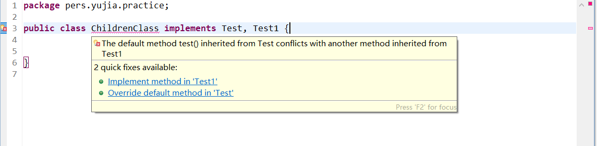
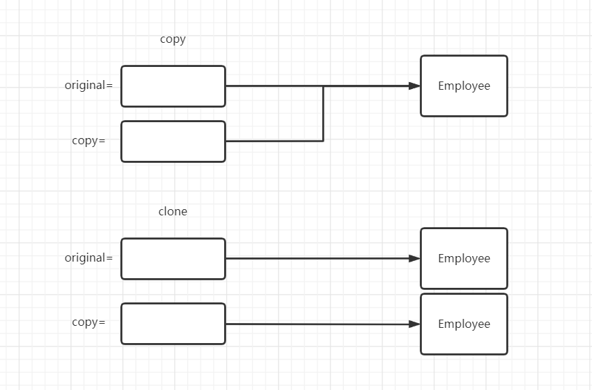
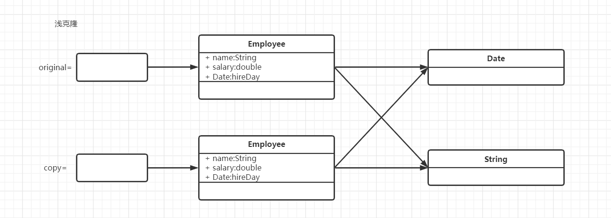
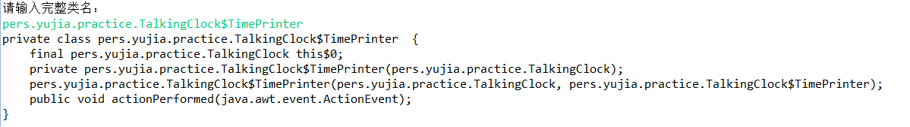
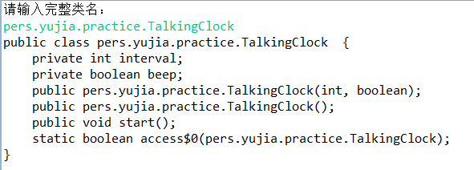
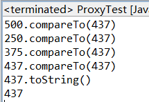

# 第6章 接口、lambda表达式与内部类

首先介绍一下接口（interface）技术，这种技术主要用来描述类有什么功能，而并不给出每个功能的具体实现。一个类可以实现（implement）一个或多个接口。

再继续介绍lambda表达式，这是一种表示可以再将来某个时间点执行的代码块的简洁方法。

接下来讨论内部类（inner class）机制。内部类定义在另外一个类的内部，其中的方法可以访问包含它们的外部类的域。内部类技术主要用于设计具有协作关系的类集合。

最后将介绍代理（proxy），这是一种实现任意接口的对象。


# 6.1 接口

## 6.1.1 接口概念

在Java程序设计语言中，接口不是类，而是对类的一组需求描述，这些类要遵从接口描述的统一格式进行定义。

`Arrays`类（注意和Array类进行区分，Arrays类是java.util包的，Array类是java.reflect包的）的`sort`方法承诺可以对对象数组进行排序，但要求满足下列前提：对象所属的类必须实现了`Comparable`接口。下面是`Comparable`接口的代码：

```java
public interface Comparable{
    int compareTo(Object other);
}
```

这就是说任何实现Comparable接口的类必须包含compareTo方法，并且这个方法的参数必须是一个Object对象，返回一个整型数值。

> 在Java SE 5.0中，Comparable接口已经改进成泛型类型。
>
> ```java
> public interface Comparable<T>{
>     int compareTo(T other);
> }
> ```
>
> 例如在实现Comparable\<Employee>接口的类中，必须提供方法：int compareTo(Employee other)

compareTo方法的设计规范是必须确实比较两个对象的内容，并返回比较的结果。`x.compareTo(y)`当x小于y时返回一个负数，当x等于y时返回0，否则返回一个正数。

接口可以包含多个方法，也可以在接口中定义常量，但是接口不能有实例域，在Java SE 8之前接口中也不能实现方法。

现在假设使用`Array`类的`sort`方法对Employee对象数组进行排序，那么Employee类就必须实现`Comparable`接口。为了让类实现一个接口，通常需要以下两个步骤：

1. 将类声明为实现给定的接口
2. 对接口中的所有方法进行定义

要将类声明为实现某个接口，需要使用关键字`implements`：

```java
class Employee implements Comparable{
    ...
}
```

假设希望根据雇员的薪水对雇员进行比较，以下为`compareTo`方法的实现：

```java
public int compareTo(Object otherObject){
    Employee other = (Employee)otherObject;
    return Double.compare(salary, other.salary);
}
```

我们可以做的更好一些。可以为泛型\<comparable>接口提供一个类型参数：

```java
class Employee implements Comparable<Employee>{
    ...
    public int compareTo(Employee other){
        return Double.compare(salary, other.salary);
    }
}
```

在接口声明中，可以不加修饰符`public`给方法，这是因为接口中的所有方法都自动地是public。不过在实现方法的时候，方法的访问权限就跟所加的修饰符相关了。

**注意：为什么不能在Employee类中直接提供一个compareTo方法，而必须实现Comparable接口呢？这是因为Java程序设计语言是一种强类型语言。在调用方法的时候，编译器将检查这个方法是否存在。为此编译器必须确保`x.compareTo(y)`中的x包含compareTo方法。**

> 有人认为将`Array`类中的`sort`方法定义为接收一个`Comparable`数组，就可以由编译器检查是否传入的数组实现了`Comparable`接口。
>
> 这样做有两个弊端：一是一开始就要创建Comparable[]数组（本质为Object[]类型的数组不能强转为Comparable[]数组），二是很多方法返回的就是Object[]数组，如果要进行排序，那么就需要复制元素到一个Comparable[]数组，这样相当麻烦。

与equals一样，compareTo方法在继承的时候可能会出现问题。如下：

```java
class Manager extends Employee{
    public int compareTo(Employee other){
        Manager otherManager = (Manager)other;
        ...
    }
}
```

调用x.compareTo(y)时，假设x是一个Employee对象，y是一个Manager对象，那么不会有问题，但是如果x是一个Manager对象，y是一个Employee对象，那么就会抛出异常。

有两种修改代码的方法：

1. 如果子类之间的比较含义不一样，那就属于不同类对象的非法比较。每个compareTo方法前应该进行检测：

   ```java
   if(getClass() != other.getClass())throm new ClassCastException();
   ```

2. 如果存在一个通用的算法，它能够对两个不同的子类对象进行比较，则应该在超类中提供一个`compareTo`方法，并将这个方法声明为`final`。

> java.lang.Comparable\<T> 1.0

- **int compareTo(T other)**

  用这个对象与other进行对比。如果这个对象小于other则返回负数；如果相等返回0；否则返回正数。

> java.util.Arrays

- **static void sort(Object[] a)**

  使用mergesort算法对数组a中的元素进行排序。要求数组中的元素必须属于实现了Comparable接口的类，并且元素之间必须是可以比较的。

> java.lang.Integer 1.0

- **static int compare(int x, int y)**

  如果x<y返回一个负数；如果x和y相等返回0；否则返回一个正整数。

> java.lang.Double 1.0

- **static int compare(double x, double y)**

  如果x<y返回一个负数；如果x和y相等返回0；否则返回一个正整数。


## 6.1.2 接口的特性

接口不是类，尤其不能直接使用`new`操作符实例化一个接口，但是却能声明一个变量的类型：`Comparable x`，接口变量必须引用实现了接口的类对象：`x = new Employee(...);`，接下来可以使用`instanceof`检查一个对象是否实现了某个特定的接口：`if(anObject instanceof Comparable){...}`。

接口可以扩展（继承），接口可以继承另一个接口。

虽然在接口中不能包含实例域或者静态方法，但是可以包含常量，例如：

```java
public interface Powered extends Moveable{
    double  milesPerGallon();
    double SPEED_LIMIT = 95;
}
```

与接口中的方法都自动地被设置成public一样，接口中的域将自动设为`public static final`。

> 虽然接口中的方法自动设为public，接口中的域自动设为public static final，但是我们仍然可以显性地进行标记，以提高代码的清晰度。

尽管每个类只能有一个超类，但是却可以实现多个接口，这就为定义类的行为提供了很大的灵活性。

例如Java程序设计语言有一个非常重要的内置接口，称为cloneable（将在之后进行详细地讨论）。如果某个类实现了这个接口，那么Object类的`clone`方法就可以创建类对象的一个拷贝。如果希望自己设计的类既具有克隆的能力，又具有比较的能力，那么同时实现这两个接口就可以了。使用逗号将实现的各个接口隔开：

```java
class Employee implements Cloneable, Comparable
```

**注意：类实现接口中的方式时，修饰词必须是public，因为子类的权限必须大于或等于父类的权限，接口中的成员都被public修饰，所以子类也要被public修饰。**

## 6.1.3 接口与抽象类

Java已经有抽象类的概念了，为什么还要引入接口这个概念呢？

使用抽象类表示通用属性存在这样一个问题：每个类只能扩展一个超类。假如Employee类已经扩展于一个类，例如Person，他就不能再扩展第二个类。

但每个类可以实现多个接口。

有些程序设计语言允许一个类有多个超类，例如C++。我们将这种特性称为**多重继承（multiple inheritance）**。而Java的设计者选择不支持多继承，主要原因是多继承会让语言变得相当复杂，效率也会降低。

实际上，接口可以提供多重继承的大多数好处，同时还能避免多重继承的复杂性和低效性。


## 6.1.4 静态方法

在Java SE 8中，允许在接口中添加静态方法。只是这违背了接口作为抽象规范的初衷。

目前为止，通常都是将静态方法放到伴随类中。在标准库中，你会看到成对的接口和使用工具类，如`Collection/Collections`或`Path/Paths`。

下面来看Paths类，其中只包含了两个工厂方法。可以由一个字符串序列构造一个文件或者目录的路径，如`Paths.get("jdk1.8.0", "jre", "bin")`。在Java SE 8中，可以为Path接口增加以下方法：

```java
public interface Path{
    public static Path get(String first, String... more){
        return FileSystems,getDefault().getPath(first, more);
    }
    ...
}
```

这样，Paths类就不是必要的了。==不过整个Java库以这种方式来重构是不太可能的，但是实现自己的接口时，不再需要为实用工具方法另外提高一个伴随类。==


## 6.1.5 默认方法

可以为接口方法提供一个默认实现。必须使用`default`修饰符标记这样一个方法。

```java
public interface Comparable<T>{
    default int compareTo(T other){
        return 0;
    }
}
```

当然，对于`Comparable`接口来说这样做并没有意义，因为实现Comparable接口的类都会覆盖掉这个方法，否则实现Comparable接口就没有意义。但是在某些情况下，默认方法可能会很有用。例如希望在发生鼠标点击事件时得到通知，就要实现一个包含5个方法的接口：

```java
public interface MouseListener{
    void mouseClicked(MouseEvent event);
    void mousePressed(MouseEvent event);
    void mouseReleased(MouseEvent event);
    void mouseEntered(MouseEvent event);
    void mouseExited(MouseEvent event);
}
```

大多数情况下，我们只需要实现其中的一两个方法即可。在Java SE 8中，可以把所有方法声明为默认方法，这些默认方法什么也不做。

```java
public interface MouseListener{
    default void mouseClicked(MouseEvent event){}
    default void mousePressed(MouseEvent event){}
    default void mouseReleased(MouseEvent event){}
    default void mouseEntered(MouseEvent event){}
    default void mouseExited(MouseEvent event){}
}
```

这样一来，实现这个接口的程序员只需为他们真正关心的事件覆盖相应的监视器。如下：

```java
public class MyListener implements MouseListener{
    public void mouseClicked(MouseEvent event){
        ...
    }
    //仅仅实现这一个方法也是合法的
}
```

==默认方法可以调用其他的方法。==如下：

```java
public interface Collection{
    int size();
    default boolean isEmpty(){
        return size() == 0;
    }
}
```

默认方法的一个重要用法是**“接口演化”（interface evolution）**，假设以前你提供了这样一个类：

```java
public class Bag implements Collection
```

后来在Java SE 8中，Collection接口又增加了一个Stream方法。

假设Stream方法不是一个默认方法，那么Bag类将不能够编译，因为它没有实现Stream方法。为接口增加一个非默认方法不能保证**“源代码兼容”（source compatible）**。

不过，假设不重新编译这个类，而只是使用原先的一个包含这个类的JAR文件，这个类仍然能够正常加载（为接口增加方法可以保证“二进制兼容”）。不过，如果程序在一个Bag实例上调用Stream方法，就会出现一个AbstractMethodError。

将方法实现为一个默认方法就可以解决上面的问题，Bag类可以正常地编译，另外如果调用了Stream方法，也不会出现错误。


## 6.1.6 解决默认方法中的冲突

如果先在一个接口中将一个方法定义为默认方法，然后又在超类或另一个接口中定义同样的方法，将会发生什么？Java处理默认方法冲突的规则如下：

1. ==超类优先。==如果超类提供了一个具体的方法，同名而且有相同参数类型的默认方法将会被忽视。
2. ==接口冲突。==如果一个超接口提供了一个默认方法，另一个接口提供了同名并且参数类型相同的方法，必须覆盖这个方法来解决冲突。

下面来看第二个规则。考虑Test接口和Test1接口都有默认实现的test方法（或者其中一个接口含有默认实现的test方法），如果有一个类同时实现了这两个接口：

```java
class Student implements Person, Named{
    ...
}
```

此时Java编译器会报告一个错误，让程序员来解决二义性的问题。



==我们可以使用语句`Test1.super.test()`方法来调用接口实现的默认方法。==

**注意：千万别让默认方法重新定义Object类的任何一个方法。因为Java的任何一个类都是Object类的子类，任何接口的默认方法都无法超越Object类的方法。**


# 6.2 接口示例


## 6.2.1 接口与回调

**回调（callback）**是一种常见的程序设计模式。在这个模式中，可以指定某个特定事件发生时应该采取的行动。

在`java.swing`包中有一个`Timer`类，可以使用它在到达给定的时间间隔时发出通告。==在构造定时器的时候，需要设置一个事件间隔，并告诉定时器当到达事件间隔时需要执行什么操作。==如何告知定时器应该做什么呢？大多数程序设计语言可以提供一个函数名，定时器周期性地调用该函数。Java采用的是将某个类的对象传递给计时器，然后由定时器调用这个对象的方法。

当然定时器需要知道调用的是哪一个方法，并要求传递的对象所属的类实现了`java.awt.event`包的`ActionListener`接口。下面是这个接口：

```java
package java.awt.event;

import java.util.EventListener;

/**
 * The listener interface for receiving action events.
 * The class that is interested in processing an action event
 * implements this interface, and the object created with that
 * class is registered with a component, using the component's
 * <code>addActionListener</code> method. When the action event
 * occurs, that object's <code>actionPerformed</code> method is
 * invoked.
 *
 * @see ActionEvent
 * @see <a href="https://docs.oracle.com/javase/tutorial/uiswing/events/actionlistener.html">How to Write an Action Listener</a>
 *
 * @author Carl Quinn
 * @since 1.1
 */
public interface ActionListener extends EventListener {

    /**
     * Invoked when an action occurs.
     */
    public void actionPerformed(ActionEvent e);

}
```

当到达指定的时间间隔时，定时器就调用`actionPerformed`方法。

假设希望每隔10秒钟打印一条信息，然后响一声，就应该定义一个实现了`ActionListener`接口的类，然后将需要执行的语句放在`actionPerformed`方法中。

```java
class TimePrinter implements ActionListener{
    public void actionPerformed(ActionEvent event){
        System.out.println("At the tone. the time is " + new Date());
        Toolkit.getDefaultToolkit().beep();
    }
}
```

需要注意`actionPerformed`方法的`ActionEvent`参数。这个参数提供了事件的相关信息，例如产生这个事件的源对象。

接下来，构造这个类的一个对象，并将它传递给Timer构造器。

```java
ActionListener listener = new TimePrinter();
Timer t = new Timer(10000, listener);
```

最后启动计时器：

```java
t.start();
```

每隔10秒钟，下列的信息就会显示一次，然后响一次铃：

```java
At the tone. the time is Web Apr 13 23:29:08 PDT 2016
```

> java.swing.JOptionPane 1.2

- **static void showMessageDialog(Component parent, Object message) **

  显示一个包含一条信息和OK按钮的对话框。这个对话框将位于其parent组件的中央。如果Parent为null，对话框将显示在屏幕的中央。

> javax.swing.Timer 1.2

- **Timer(int interval, ActionListener listener)**

  构造一个定时器，每隔interval毫秒通告listener一次。

- **void start()**

  启动计时器。一旦启动成功，定时器将调用监听器的actionPerformed。

- **void stop()**

  停止计时器。一旦停止成功，计时器将不再调用监听器的actionPerformed。

> java.awt.Toolkit 1.0

- **static Toolkit getDefaultToolkit()**

  获得默认的工具箱。工具箱包含有关GUI环境的信息。

- **void beep()**

  发出一声铃响。


## 6.2.2 Comparator接口

6.1.1节中，我们已经了解了如何对一个对象数组进行排序，前提是这些对象是实现了Comparable接口的类的实例。

但是这样对数组排序有一个问题：Java原有的类无法自定义compareTo方法。假如我们希望String类能够按照字符串长短进行排序，而不是字典顺序进行排序，我们无法修改String类的compareTo方法。

要处理这种情况，`Array.sort`方法有第二个版本，有一个数组和一个比较器作为参数，比较器是实现了Comparator接口的类的实例。`Comparator`的部分源代码如下：

```java
public interface Comparator<T>{
	int compare(T first, T second);
}
```

要按长度比较字符串，可以如下定义一个实现Comparator\<String>的类：

```java
class LengthComparator implements Comparator<String>{
    public int compare(String first, String second){
        return first.length() - second.length();
    }
}
```

==这个compare方法要在比较器对象上调用，而不是在字符串本身上调用。==

要对一个数组排序，需要为`Array.sort`方法传入一个LengthComparator对象：

```java
String friends = {"Peter", "Paul", "Mary"};
Array.sort(friends, new LengthComparator());
```


## 6.2.3 对象克隆

本节我们将讨论`Cloneable` 接口，这个接口指示一个类提供了一个安全的`clone`方法。

要了解克隆的具体含义，先来回忆为一个包含对象引用的变量建立一个副本会发生什么。原变量和副本都是同一个对象的引用，任何一个对象的变化都会引起另一个对象改变，如下：

```java
Employee original = new Employee("John Public", 50000);
Employee copy = original;
copy.raiseSalary(10);
```

如果希望copy是一个新对象，它的初始状态与original相同，但是之后它们会有不同的状态，这种情况下就可以使用`clone`方法：

```java
Employee copy = original.clone();
copy.raiseSalary(10);
```



在Object类中，`clone`方法是一个被protected修饰的方法，因此只能在子类或者本类中调用，不能在其他的类的方法中调用。这样的限制是有原因的：==如果对象中的所有数据域都是数值或者其他基本类型，那么拷贝这些域是没有问题的，但是如果对象的数据域包含其他对象的引用，拷贝数据域域就会得到相同对象的另一个引用，这样一来，原对象和克隆的对象仍然会共享一些信息。==

这称为**浅拷贝**。浅拷贝是默认的克隆方式，并没有克隆对象中引用的其他对象。如果原对象和浅克隆对象共享的子对象是不可变的，那么这种共享就是安全的，或者在对象的生命期中，子对象一直包含不变的常量，没有更改器方法会改变他，也没有方法生成它的引用，这种情况一样是安全的。



通常数据域中的对象都是可变的，因此必须重新定义`clone`方法来实现**深拷贝**，在上面的例子中，hireDay是Date类型的，这是可变的，因此它也需要额外进行克隆。

对于每一个类需要确定：

1. 默认的`clone`方法是否满足需求。
2. 是否可以在可变的数据域对象上调用`clone`方法来修补默认的`clone`方法。
3. 是否不该使用`clone`方法。

实际上第三点是默认的选项。如果选择第一点或者第二点，类必须：

1. 实现`cloneable`接口。
2. 重新定义`clone`方法，并指定public为该方法的访问修饰符。

由于Object类的clone方法的访问修饰符是protected，因此子类只能调用受保护的方法来克隆它的对象。必须重新定义clone为public才能允许所有的方法克隆对象。

**注意：`cloneable`接口中并没有包含`clone`方法，类中的clone方法是从Object类中继承而来的。这个接口只是作为标记使用，指示类设计者了解克隆的过程。如果一个对象请求克隆，但是没有实现这个接口，就会生成一个受查异常`CloneNotSupportedException`。**

> 标记接口不含任何的方法：它唯一的作用就是允许在类型查询中使用instanceof。

即使浅拷贝已经满足要求，还是需要实现`cloneable`接口，将clone方法重新定义为public，再调用`super.clone()`，如下：

```java
class Employee implements Cloneable{
    public Employee clone() throws CloneNotSupportedException{
        return (Employee)super.clone();
    }
}
```

下面是一个实现深拷贝的例子：

```java
class Employee implements Cloneable{
    ...
    public Employee clone() throws CloneNotSupportedException{
        Employee cloned = (Employee)super.clone();
        
        /*实现深拷贝，数据域中的其他对象也要进行克隆*/
        cloned.hireDay = (Date)hireDay.clone();
        
        return cloned;
    }
}
```

最好保留throws说明符，这样就允许子类在不支持克隆的时候选择抛出一个`CloneNotSupportedException`。

必须当心子类的克隆，例如一旦为Employee类定义了public的clone方法，任何类的任何方法都可以克隆Manager类。一旦Manager类的数据域中新增了可变的其他对象，那么必须要重新定义clone方法。不能保证子类的实现者一定会修正clone方法让它正常工作，出于这个原因，在Object类中的clone方法声明为protected。

**注意：所有数组类型都有一个public的clone方法，而不是protected。可以使用这个方法建立一个新的数组，包含原数组所有元素的副本。即对象数组会把对象的引用完整地复制过去，而不会克隆一个新的对象。**


# 6.3 lambda表达式


## 6.3.1 为什么要引入lambda表达式

`lambda`表达式是一个可传递的代码块，可以在以后执行一次或者多次。

在6.2小节介绍的`ActionListener`类的`actionPerformd`方法以及`Comparator`类的`caompare`方法，都有一个共有的特点：都是将一个代码块传递到某个对象（`Timer`类的构造方法以及`Arrays.sort`方法），这个代码块会在将来的某个时间点调用。

Java是一种面向对象的程序设计语言，所以必须构造一个对象，这个对象的类需要有一个方法来包含所需的代码。Java一直拒绝增加直接处理代码块的特性，因为Java的强大之处就在于其简单性和一致性。


## 6.3.2 lambda表达式的语法

```java
(String first, String second) -> first.length() - second.length()
```

上面是我们看到的第一个lambda表达式。lambda表达式就是一个代码块，以及必须传入代码的参数规范。

> 实际上，《数学原理》一书使用重音符（^）表示自由变量，受此启发，Church使用大写lambda（Λ）表示参数，后来改为使用小写的lambda（λ）。从那以后，带参数的表达式称为lambda表达式。

上面是lambda表达式的其中一种形式：参数，箭头（->）以及一个表达式。

- 如果代码要完成的计算无法放在一个表达式里，就可以像写方法一样，把代码放入{}中，并包含显式的return语句，例如：

  ```java
(String first, String second) -> {
    if(first.length() < second.length()) return -1;
    else if(first.length() == second.length()) return 0;
    else return 1;
}
  ```

- 即便lambda表达式没有参数，仍然要提高空括号，就像无参数方法一样：

  ```java
() -> {
    for(int i; i < 100; i++){
        System.out.println(i);
    }
}
  ```

- 如果可以推导出一个lambda表达式的参数类型，则可以忽略其类型。例如：

  ```java
Comparator<String> comp = (first, second) -> first.length() - second.length();
  ```

  在这里，编译器可以推断出first和second必然是字符串，因为这个lambda表达式将赋值给一个字符串比较器。

- 如果方法只有一个参数，而且这个参数的类型可以推导出来，那么甚至可以忽略小括号：

  ```java
  ActionListener listener = event -> System.out.println("The time is " + new Date());
  ```

  无需指定lambda表达式的返回类型，lambda表达式的返回类型总是可以由上下文推导出来。


## 6.3.3 函数式接口

Java有很多封装代码块的接口，如`ActionListener`或者`Comparator`。lambda表达式和这些接口是兼容的。

对于只有一个抽象方法（可以含有多个非抽象方法）的接口，需要这种对象的时候，就可以提供一个lambda表达式。这种接口称为**函数式接口（funtional interface）**。

> 接口可以声明Object类的方法，如toString或clone，或者声明Java SE 8中的接口静态方法，这些声明都不会影响函数式接口的有效性。我们可以这样认为，只要接口中的抽象方法有且只有一个，那么这个接口就是函数式接口。

我们可以在接口的上面使用`@FuntionalInterface`注解，来注明该接口满足函数式接口的定义。

下面的接口仍然属于函数式接口：

```java
@FunctionalInterface
public interface MyInterface {

    void test();
    String toString();
	static void myTest(){
        System.out.println("test");
    }
}
```

下面展示如何转换为函数式接口，以`Array.sort`方法为例，它的第二个参数需要一个Comparator实例，而Comparator就是有且只有一个抽象方法的接口，所以可以提供一个lambda表达式：

```java
Array.sort(words, (first, second) -> first.length() - second.length());
```

在底层，Array.sort方法会接受实现了Comparator\<String>的某个类的对象，在这个对象上执行compare方法会执行这个lambda表达式的体。

==实际上，在Java中，对lambda表达式所能做的也只能是转换为函数式接口，不过Java设计者还是保留熟悉的接口的概念，没有为Java语言增加函数类型。我们也不能把lambda表达式赋值给Object类型的变量，因为Object不是一个函数式的接口。==

Java API在`java.util.function`包中定义了很多非常常用的函数式接口，其中一个接口`BiFunction<T, U, R>`描述了参数类型为T和U而且返回类型为R的函数。可以把我们的字符串比较lambda表达式保存在这个类型的变量中：

```java
BiFunction<String, String, Integer> comp = (first, second) -> first.length() - second.length();
```

不过，`Array.sort`方法不会接收BiFunction类型的变量，只接收Comparator类型的变量。

`java.util.function`包中有一个尤其有用的接口`Predicate`：

```java
public Interface Predicate<T>{
    boolean test(T t);
}
```

`ArrayList`类有一个`removeIf`方法，它的参数就是一个`Predicate`。这个接口专门用来传递lambda表达式。例如，下面的语句将从一个数组列表删除所有null值的元素：

```java
list.removeIf(e -> e == null);
```


## 6.3.4 方法引用

表达式`System.out::println`是一个**方法引用（method reference）**，它等价于lambda表达式`x -> System.out.println(x)`。

方法引用要使用`::`操作符分隔方法名与对象或类名，主要有3种情况：

- object::instanceMethod
- Class::staticMethod
- Class::instanceMethod

前两种情况方法引用等价于提供方法参数的lambda表达式。前面已经提到，`System.out::println`等价于`x -> System.out.println(x)`。类似地，`Math::pow`等价于`(x, y) -> Math.pow(x, y)`。

对于第三种情况，第一个参数会成为调用方法的实例，例如 ，`String::compareToIgnoreCase`等价于`(x, y) -> x.compareToIgnoreCase(y)`。

> 如果有多个同名的重载方法，编译器就会根据上下文选出我们指定的那个方法。例如Math.max有两个版本，一个用于整数，一个用于浮点数。选择哪一个取决于Math::max转换为哪个函数式接口的方法参数。

方法引用类似于lambda表达式，不能独立存在，总是会转换为函数式接口的实例。

可以在方法引用中使用this参数。例如，`this::equals`等价于`x -> this.equals(x)`。使用super也是合法的。`super::instanceMethod`会使用给定方法的超类版本。


## 6.3.5 构造器引用（可以不看）

构造器引用和方法引用很类似，只不过方法名为`new`。

例如，`Person::new`是Person构造器的一个引用，具体是哪一个构造器需要根据上下文判断。假设我们有一个字符串列表，可以把它转化为一个Person对象数组，为此要在各个字符串上调用构造器，如下：

```java
ArrayList<String> names = ...;
Stream<Person> stream = names.stream().map(Person::new);
List<Person> people = stream.collect(Collectors.toList());
```

以上的代码看不懂没有太大的关系，现在重点是map方法会为各个列表元素调用Person(String)构造器。如果有多个Person构造器，编译器会自动选择一个String参数的构造器。

可以使用数组类型建立构造器引用。例如，`int[]::new`是一个构造器引用，它的参数是数组的长度，等价于lambda表达式`x -> new int[x]`。

==Java有一个限制：无法构造泛型类型为T的数组。无论是`new T[]`还是`T[]::new`都是不支持的。==泛型具有类型擦除的特性，即运行时无法知道T的类型，但是数组在创建的时候必须知道数组的元素类型，因此无法构造泛型类型为T的数组。（但是可以通过反射来创建泛型类型T的数组）

但是通过数组构造器引用可以实现返回我们所期待的数组类型。以`Stream.toArray`为例，stream.toArray()会返回一个Object数组，但是stream.toArray(Person[]::new)会返回一个Person类型的数组。


## 6.3.6 变量作用域

考虑下面这个例子：

```java
public static void repeatMessage(String text, int delay){
    ActionListener listener = event -> {
        System.out.println(text);
        ToolKit.getDefaultToolKit().beep();
    };
    new Timer(delay, listener).start();
}
```

调用上面这个方法：`repeatMessage("Hello", 1000)`。

现在来看lambda表达式中的变量text，它并不是在lambda表达式的参数部分定义。

lambda表达式有三个部分：

1. 一个代码块
2. 参数
3. 自由变量的值，这里指的是非参数而且不在代码块中定义的变量

显然text就属于自由变量。text的值是“Hello”，我们可以说它被lambda表达式所**捕获（captured）**。

> 关于代码块和自由变量值有一个名词：闭包（closure）

==在Java中，要确保所捕获的值是明确定义的。lambda表达式只能引用值不会变化的变量。如下的代码是不合法的：==

```java
public static void countDown(int start, int delay){
    ActionListener listener = event -> {
        start--;
        System.out.println(start);
    }
    new Timer(delay, listener).start();
}
```

```java
public static void repeat(String text, int count){
    for(int i; i <= count; i++){
        ActionListener listener = event -> {
            System.out.println(i + ":" + text);
        }
        new Timer(1000, listener).start();
    }
}
```

==这里有一条规则：lambda表达式中捕获的变量必须实际上是最终变量。实际上的最终变量是指，这个变量初始化之后就不会再为它赋新值。lambda表达式的体与嵌套的块具有相同的作用域，这里同样适用于命名冲突和遮蔽的有关规则。在lambda表达式中声明与一个局部变量同名的参数或局部变量是不合法的。如下：==

```java
/*以下的语句不合法*/
Path first = Path.get("/usr/bin");
Comparator<String> comp = (first, second) -> first.length() - second.length();
```

在一个lambda表达式中使用this关键字的时候，是指创建这个lambda表达式的方法的this参数。

```java
public class Application{
    public void init(){
        ActionListener listener = event -> {
            System.out.println(this.toString());//this.toString()方法会调用Application对象的toString()方法。
        }
    }
}
```


## 6.3.7 处理lambda表达式

使用lambda表达式的重点是**延迟执行（deferred execution）**。之所以希望以后再执行代码，有很多原因，如：

- 在一个单独的线程中运行代码
- 多次运行代码
- 在算法的适当位置运行代码（例如，排序中的比较操作）
- 发生某种情况时执行代码（如点击一个按钮，数据到达等）
- 只有必要时才运行代码

假如说我们想重复一个动作n次，将这个动作传递到一个repeat方法：

```java
repeat(10, () -> System.out.println("HelloWorld!"));
```

要接收这个lambda表达式，需要选择（只有很少的情况需要提供）一个函数式接口。在这里，我们可以选择`Runnable`接口：

```java
public static void repeat(int n, Runnable action){
    for(int i = 0; i < n; i++){
        action.run();
    }
}
```

下面列出了Java API最重要的函数式接口：

| 函数式接口           | 参数类型 | 返回类型 | 抽象方法名 |             描述             | 其他方法                   |
| -------------------- | :------: | :------: | :--------: | :--------------------------: | :------------------------- |
| Runnable             |    无    |   void   |    run     | 作为无参数或返回值的动作运行 |                            |
| Supplier\<T>         |    无    |    T     |    get     |      提供一个T类型的值       |                            |
| Consumer\<T>         |    T     |   void   |   accpet   |      处理一个T类型的值       | andThen                    |
| BiConsumer\<T, U>    |   T, U   |   void   |   accpet   |       处理T和U类型的值       | andThen                    |
| Function\<T, R>      |    T     |    R     |   apply    |    有一个T类型参数的函数     | compose, andThen, identity |
| BiFunction\<T, U, R> |   T, U   |    R     |   apply    |     有T和U类型参数的函数     | andThen                    |
| UnaryOperator\<T>    |    T     |    T     |   apply    |     类型T上的一元操作符      | compose, andThen, identity |
| BinaryOperator\<T>   |   T, T   |    T     |   apply    |     类型T上的二元操作符      | andThen, maxBy, minBy      |
| Predicate\<T>        |    T     | boolean  |    test    |          布尔值函数          | and, or, negate, isEqual   |
| BiPredicate\<T ,U>   |   T, U   | boolean  |    test    |    有两个参数的布尔值函数    | and, or, negate            |

下面让这个例子更复杂一些，我们希望告诉动作它出现在哪一次迭代里面。为此，需要选择一个合适的函数式接口，其中要包含一个方法，这个方法有一个int参数并且返回类型为void。处理int值的Java API标准接口如下：

```java
public interface IntConsumer{
    void accept(int value);
}
```

下面给出repeat方法的改进版本：

```java
public static void repeat(int n, IntConsumer action){
    for(int i; i < n; i++) action.accept(i);
}
```

可以如下调用它：

```java
repeat(10, i -> System.out.println("Countdown:" + (9 - i)));
```

下面列出了基本类型int、long、double的34个可能的规范。最好使用这些特殊化规范来减少自动装箱。

| 函数式接口           | 参数类型 | 返回类型 |  抽象方法名  |
| -------------------- | :------: | :------: | :----------: |
| BooleanSupplier      |   none   | boolean  | getAsBoolean |
| PSupplier            |   none   |    p     |    getAsP    |
| PConsumer            |    p     |   void   |    accpet    |
| ObjPConsumer\<T>     |   T, p   |   void   |    accept    |
| PFunction\<T>        |    p     |    T     |    apply     |
| PToQFunction         |    p     |    q     |   applyAsQ   |
| ToPFunction\<T>      |    T     |    p     |   applyAsP   |
| ToPBiFunction\<T, U> |   T, U   |    p     |   applyAsP   |
| PUnaryOperator       |    p     |    p     |   applyAsP   |
| PBinaryOperator      |   p, p   |    p     |   applyAsP   |
| PPredicate           |    p     | boolean  |     test     |

*注：p，q为int，long，double；P，Q为Int，Long，Double*

> 最好使用上面两个表中的函数式接口、只有一种情况可以不这么做，那就是已经有很多方法可以生成函数式接口的实例了。

> 大多数标准函数式接口都提供了非抽象方法来生成或者合并函数。例如，Predicate.isEqual(a)等同于a::equals，不过即使a为null也可以正常工作。已经提供了默认方法and、or和negate（否）来合并谓词。例如，Predicate.isEqual(a).or(Predicate.isEqual(b))就等同于x -> a.equals(x) || b.equals(x)


## 6.3.8 再谈Comparator（以下只要知道用法即可，不必深究）

Comparator接口包含很多方便的静态方法来创建比较器。这些方法可以用于lambda表达式或方法引用。

静态`comparing`方法取一个“键提取器”函数，它将类型T映射为一个可比较的类型（如String）。对要比较的对象应用这个函数，然后对返回的键完成比较。例如，假设有一个Person对象数组，可以如下按名字对这些对象进行排序：

```java
Arrays.sort(people, Comparator.comparing(Person::getName));
```

这样比手工生成一个Comparator要容易得多。

也可以把比较器与`thenComparing`方法串起来，例如：

```java
Arrays.sort(people, Comparator.comparing(Person::getLastName).thenComparing(Person::getFirstName));
```

如果两人的姓相同，就会使用第二个比较器。

这些方法有很多变体，可以为`comparing`和`thenComparing`方法提取的键指定一个比较器。例如，可以如下根据人名长度完成排序：

```java
Arrays.sort(people, Comparator.comparing(Person::getName, (s, t) -> Integer.compare(s.length(), t.length())));
```

另外，`comparing`和`thenComparing`方法都有变体形式，可以避免int、long、double值的装箱。要完成前一个操作，还有一个更容易的做法：

```java
Array.sort(people, Comparator.comparingInt(p -> p.getName().length()));
```

如果键函数可以返回null，可能就需要要到`nullsFirst`和`nullsLast`适配器。这些静态方法会修改现有的比较器，从而在遇到null值时不会抛出异常，而是将这个值标记为小于或大于正常值。例如，假设一个人没有中名时getMiddleName会返回一个null，就可以使用`Comparator.comparing(Person::getMiddleName, Comparator.nullsFirst(...))`。

`nullsFirst`方法需要一个比较器，在这里就是比较两个字符串的比较器。`naturalOrder`方法可以为任何实现了`Comparable`接口的类建立一个比较器。在这里，`Comparator.<String>naturalOrder()`正是我们需要的。下面是一个完整调用：

```java
import static java.util.Comparator.*;//静态导入
Arrays.sort(people, comparing(Person::getName, nullsFirst(naturalOrder())));//naturalOrder的类型可以推导得出
```

静态`reverseOrder`方法会提供自然顺序的逆序，也可以使用`reversed`实例方法。`naturalOrder().reversed()`等价于`reverseOrder()`。


# 6.4 内部类

**内部类（inner class）**是定义在另一个类中的类。使用内部类的原因主要有三点：

1. 内部类方法可以访问该类定义所在的作用域中的数据，包括私有的数据。
2. 内部类可以对同一个包中的其他类隐藏起来
3. 当想要定义一个回调函数且不想编写大量代码的时候，使用**匿名（anonymous）内部类**比较便捷。

以下分为几部分对内部类进行介绍：

- 在6.4.1节中，给出一个简单的内部类，它将访问外围类的实例域
- 在6.4.2节中，给出内部类的特殊语法规则
- 在6.4.3节中，领略内部类的内部，探讨一下如何将其转换为常规类
- 在6.4.4节中，讨论**局部内部类**，它可以访问外围作用域中的局部变量
- 在6.4.5节中，讨论**匿名内部类**，说明Java有lambda表达式之前用于实现回调的基本方法
- 在6.4.6节中，介绍如何将静态内部类嵌套在辅助类中


## 6.4.1 使用内部类访问对象状态

内部类的语法较为复杂，先用一个简单但是不太实用的例子说明内部类的使用方法，如下：

```java
public class TalkingClock{
    private int interval;
    private boolean beep;
    
    public TalkingClock(int interval, boolean beep){...}
    
    public void start(){...}
    
    public class TimePrinter implements ActionListener{
        ...
    }
}
```

这里的TimePrinter类位于TalkingClock类内部。但是这并不意味着每一个TalkingClock实例都有一个TimePrinter实例域。TimePrinter类（内部类）的对象是由TalkingClock类（外部类）的方法构造。

下面是TimePrinter类的详细内容。需要注意一点，actionPerformed方法在发出铃声之前检查了beep标志：

```java
public class TimePrinter implements ActionListener{
    public void actionPerformed(ActionEvent event){
        System.out.println("At the tone, the time is " + new Date());
        if(beep) Toolkit.getDefaultToolkit().beep();
    }
}
```

TimePrinter类并没有实例域或者名为beep的局部变量，取而代之的是beep引用了创建TimePrinter的TalkingClock对象的域。==一个方法可以引用调用这个方法的对象数据域，内部类既可以访问自身的数据域，也可以访问创建它的外围类对象的数据域。==

如果TimePrinter是一个常规的类，那么它就需要TalkingClock类的公有方法访问beep标志，但是使用内部类就可以直接访问，不必所提供用于其他类访问的访问器。

> TimePrinter类声明为私有的。这样只有TalkingClock的方法能够构造TimePrinter类对象。
>
> 只有内部类才可以声明为private，而常规的类只可以具有包可见性（无访问修饰词）或者公有可见性（public修饰）。

下面是`TalkingClock`类的完整程序：

```java
package pers.yujia.practice;

import java.awt.Toolkit;
import java.awt.event.ActionEvent;
import java.awt.event.ActionListener;
import java.util.Date;

import javax.swing.Timer;

public class TalkingClock {
	private int interval;
	private boolean beep;
	public TalkingClock(int interval, boolean beep) {
		super();
		this.interval = interval;
		this.beep = beep;
	}
	public TalkingClock() {
		super();
		// TODO Auto-generated constructor stub
	}
	
	private class TimePrinter implements ActionListener{

		@Override
		public void actionPerformed(ActionEvent e) {
			System.out.println("At the tone, the time is " + new Date());
			if(beep) Toolkit.getDefaultToolkit().beep();
		}
		
	}
	
	public void start() {
		ActionListener listener = new TimePrinter();
		Timer timer = new Timer(interval, listener);
		timer.start();
	}
	
}
```


## 6.4.2 内部类的特殊语法规则

- ==表达式[*OuterClass*.this]显性表示外围类的引用。==例如，6.4.1节中TalkingClock类中的beep在内部类中也可以这样表示：`TalkingClock.this.beep`。

- ==表达式[*OuterObject*.new *InnerClass(Construction parameters)*显性表示调用内部对象的构造器。==例如，6.4.1节中的TimePrinter（内部类）对象可以这样构造：`this.new TimePrinter()`。在这里，最新构造的TimePrinter对象的外围类引用被设置为创建内部类对象的方法中的this引用。这是最常见的情况，不过this限定词是多余的。

- ==可以显式地将外围类引用设置为其他的对象==，例如，如果TimePrinter是一个公有的内部类，对于任意的TalkingClock都可以构造一个TimePrinter：

  ```java
  TalkingClock jabberer = new TalkingClock(1000, true);
  TalkingClock.TimePrinter = jabberer.new TimePrinter();
  ```

  ==在外围类的范围之外，可以这样引用内部类：[*OuterClass.InnerClass*]。==

- ==内部类声明的所有静态域都必须是final的。==原因是我们希望一个静态域只有一个实例，不过对于每个外部对象会分别有一个单独的内部类实例。如果这个域不是final，它就有可能不是唯一的。

- ==内部类最好不要有static方法，如果必须有那只能访问外部类的静态域和方法。==


## 6.4.3 内部类是否有用、必要和安全

内部类的语法十分复杂，这其实违背了Java“简单”的设计理念。

==内部类是一种编译器现象，与虚拟机无关。==编译器会把内部类翻译成用$（美元符号）分隔外部类名与内部类名的常规类文件，虚拟机对此一无所知。例如，在TalkingClock类内部的TimePrinter类将被编译成为类文件TalkingClock$TimePrinter.class。

我们下面看一下编译后的内部类实际是怎么样的，使用第5章反射所写的程序ReflectionTest，并将类TalkingClock$TimePrinter传递给它进行反射，结果如下：



可以看到，编译器为了引用外围类，==生成了一个附加的实例域`this$0`。另外还可以看到内部类的构造器中携带有TalkingClock（外部类）参数。==

------

那内部类是如何管理额外的访问特权的？我们下面再次使用ReflectionTest类对TalkingClock（外围类）进行反射：



可以看到==编译器在外围类额外添加了一个静态方法`access$0`==，它将返回内部类需要访问的外围类数据域beep。TimePrinter类如果使用到外围类的数据域beep，那么实际上将会调用外围类的`access$0`方法。

Java编译器这样做实际上是存在风险的，任何人都可以通过`access$0`方法来访问到TalkingClock类的私有域beep。当然`access$0`并不是一个合法的方法名，但是熟悉类文件结构的黑客可以使用十六进制编辑器轻松创建一个用虚拟机指令调用那个方法的类文件。由于隐秘地访问方法需要拥有包可见性，所以攻击代码需要与被攻击的类放在同一个包（当然如果被攻击类是public的，无需放在同一个包也可以）。


## 6.4.4 局部内部类

例如TalkingClock.TimePrinter，如果某个内部类只在某个方法中使用，这种情况可以在方法里定义局部内部类。

```java
public void start(){
    class TimePrinter implements ActionListener{
        public void actionPerformed(ActionEvent event){
            System.out.println("At the tone, the time is " + new Date());
            if(beep) Toolkit.getDeafaultToolkit().beep();
        }
    }
    ActionListener listener = new TimerPrinter();
    Timer timer = new Timer(interval, listener);
    timer.start();
}
```

==局部类不能使用public或者private来进行访问控制。==它的作用域被限定在声明这个局部类的块中。

局部内部类有一个优势，就是对外部世界可以完全地隐藏起来。即使TalkingClock类的其他代码也无法访问它。除了start方法，没有任何方法知道TimePrinter这个类的存在。

​                        

## 6.4.5 由外部变量访问变量

局部内部类不仅能够访问包含它们的内部类，还可以访问局部变量，不过==这些局部变量必须事实上为final==。这说明，它们一旦赋值就不能被改变。

将TalkingClock构造器的参数interval和beep移至start方法中：

```java
public void start(int interval, boolean beep){
    class TimePrinter implements ActionListener{
        public void actionPerformed(ActionEvent event){
            System.out.println("At the tone, the time is " + new Date());
            if(beep) Toolkit.getDefaultToolkit().beep();
        }
    }
    ActionListener listener = new TimePrinter();
    Timer timer = new Timer(interval, listener);
    t.start();
}
```

上面程序的流程为：

1. 调用start方法
2. 调用内部类TimePrinter的构造器，一边初始化对象变量listner。
3. 将listner引用传递给TImer构造器，定时器开始计时，start方法结束。此时，start方法的beep参数变量将不复存在。
4. actionPerformed方法执行。

Java编译器为了能够让actionPerformed方法工作，TimePrinter类在beep域释放之前将beep域用start方法的局部变量进行了备份。使用反射查看TimePrinter的内容如下：

```java
class TalkingClock$TimePrinter{
    TalkingClock$TimePrinter(TalkingClock, boolean);
    
    public void actionPerformed(java.awt.event.ActionEvent);
    
    final boolean val$beep;
    final TalkingClock this$0;
}
```

当创建一个对象的时候，beep就会被传递给构造器，并存储在val$beep域中。==编译器会事先检测对局部变量的访问，为每一个变量建立相应的数据域，并将局部变量拷贝到构造器中，以便这些数据域初始化为局部变量的副本。==

在Java SE 8之前，必须把局部类访问到的局部变量声明为final，以便内部类中建立的拷贝和局部变量保持一致。但是这样限制十分不方便。例如想要统计一下在排序过程中调用compareTo方法的次数。

```java
int counter = 0;//计数器
Date[] dates = new Date[100];
for(int i = 0; i < 100; i++){
    /*匿名内部类*/
    dates[i] = new Date(){
        public int compareTo(Date other){
            counter++;//这样很明显是错的，因为内部类中的数据域仅仅是局部变量的拷贝
            return super.compareTo(other);
        }
    }
}
Arrays.sort(dates);
```

由于清楚地知道counter需要更新，因此不可能将counter声明为final，==并且Integer类是不可变的，所以也不能使用Integer类代替。==补救的方法是使用一个长度为1的数组：

```java
int[] counter = new int[]{0};//计数器
Date[] dates = new Date[100];
for(int i = 0; i < 100; i++){
    dates[i] = new Date(){
        public int compareTo(Date other){
            counter[0]++;
            return super.compareTo(other);
        }
    }
}
Arrays.sort(dates);
```


## 6.4.6 匿名内部类

假如只创建某一个类的一个对象，就不必给这个类命名了。这种类**匿名内部类（anonymous inner class）**。如下：

```java
public void start(int interval, boolean beep){
    ActionListener listener = new ActionListener(){
        public void actionPerformed(ActionEvent event){
            System.out.println("At the tone, the time is " + new Date());
            if(beep) Toolkit.getDefaultToolkit().beep();
        }
    };
    Timer timer = new Timer(interval, listener);
    t.start();
}
```

上面代码的含义是：创建一个实现ActionListener接口的类的新对象，需要实现的方法actionPerformed定义在大括号{}中。通常的语法规则是：

> new SuperType(constrction parameters){
>
> ​		inner class methods and data
>
> }

其中SuperType可以是ActionListener这样的接口，于是内部类就要实现这个接口。SuperType也可以是一个类，于是内部类就可以扩展它。

由于构造器的名字必须和类名相同，但是匿名内部类没有名字，所以匿名类不能定义构造器。取而代之的是，将构造器参数（constructor parameters）传递给超类构造器。==如果内部类实现接口的时候，不能有任何构造参数。==不仅如此，还要像下面这样提供一组大括号：

> new InterfaceType(){
>
> ​		methods and data
>
> }

如果构造参数的闭小括号后面跟一个开大括号，正在定义的就是匿名内部类，如6.4.5小节中的部分代码就涉及了匿名内部类。

多年来，Java程序员习惯的做法就是用匿名内部类实现事件监听器和其他回调函数。不过Java SE 8之后，最好还是使用lambda表达式，代码更加简洁易懂。如下：

```java
public void start(int interval, boolean beep){
    Timer t = new Timer(interval, event -> {
        System.out.println("At the tone, the time is " + new Date());
        if(beep) Toolkit.getDefaultToolkit().beep();
    });
    t.start();
}
```

### 6.4.6.1 双括号初始化

**双括号初始化（double brace initialization）**利用了匿名内部类的语法。如果你想构造一个数组列表，并将它传递进一个方法：

```java
ArrayList<String> friends = new ArrayList<>();
friends.add("Harry");
friends.add("Tony");
invite(friends);
```

如果之后不再使用这个数组列表，最好让它作为一个匿名的数组列表。不过作为一个匿名的列表，如何为它添加元素呢（匿名内部类无法定义构造器）？方法如下：

```java
invite(new ArrayList<String>(){
    {
        this.add("Harry");
        this.add("Tony");
    }
});
```

外层括号建立了ArrayList的一个匿名子类，内层括号则是一个对象的初始化块（具体内容可见4.6.7小节）。

### 6.4.6.2 equals方法

对于equals方法要特别当心，在第5章中equals方法最好最下面的测试：

```java
if(getClass() != other.getClass()) return false;
```

但是因为匿名内部类没有类名，所以上面的方法不适应在匿名内部类中定义。

### 6.4.6.3 静态方法中获取类名

生成日志或者调试的信息时，通常希望包含当前类的类名，例如：

```java
System.err.println("Something awful happened in " + getClass());
```

但是这对于静态方法来说是不起作用的，因为调用getClass方法时实际上使用的是this.getClass，但是静态方法没有this，所以应该使用下面的表达式：

```java
new Object(){}.getClass().getEnclosingClass()//获取静态方法的class
```

在这里，new Object(){}是创建一个Object类的匿名子类的一个匿名对象，getEnclosingClass则得到其外围类，也就是包含这个静态方法的类。


## 6.4.7 静态内部类

==有时候，使用静态内部类只是为了把一个类隐藏在另外一个类的内部，并不需要内部类引用外围类的对象。为此可以将内部类声明为static，以便取消产生的外围类引用。==

下面是一个使用静态内部类的典型例子。考虑一下计算数组中最大值和最小值的问题。当然可以编写两个方法，一个方法用于计算最大值，另一个方法用于计算最小值。但是这样数组就被遍历两次了，如果只遍历一次数组，并同时能够计算出最小值和最大值，那么就可以大大提升效率了。

```java
double min = Double.POSITIVE_INFINITY;
double max = Double.NEGATIVE_INFINITY;
for(double v:values){
    if(min > v) min = v;
    if(max < v) max = v;
}
```

但是如何同时返回最大值和最小值，为此可以定义一个包含两个值的类Pair：

```java
class Pair{
    private double first;
    private double second;
    public Pair(double f, double s){
        this.first = f;
        this.second = s;
    }
    public double getFirst(){
        return this.first;
    }
    public double getSecond(){
        return this.second;
    }
}
```

minmax方法可以返回一个Pair类型的对象：

```java
public class ArrayAlg{
    public static Pair(double[] values){
        ...
        return new Pair(min, max);
    }
}
```

这个类的调用者可以使用getfirst或者getSecond方法获得答案：

```java
Pair p = ArrayAlg.minmax(d);
System.out.println("min = " + p.getFirst());
System.out.println("max = " + p.getSecond());
```

==当然Pair是一个相当常见的名字。在大型项目中，除了定义包含一对字符串的Pair类之外，其他程序员也可能使用这个名字，这样命名可能发生冲突。解决这个问题的方法是将Pair定义为ArrayAlg的内部共有类。==此后通过ArrayAlg.Pair来访问它。

```java
ArrayAlg.Pair p = ArrayAlg.minmax(d);
```

不过由于在Pair对象中不需要引用任何其他的对象，为此可以将这个内部类声明为static：

```java
class ArrayAlg{
	public static class Pair{
        ...
    }
}
```

当然普通的类是不可以声明为static的，只有内部类可以声明为static。静态内部类的对象除了没有对生成它的外围类对象的引用特权外，与其他所有内部类完全一样。==如果内部类对象是在静态方法中构造的，那么必须使用静态内部类。==

**需要注意：**

- **在内部类无需访问外围对象的时候，应该使用静态内部类**
- **静态内部类可以有静态域和静态方法**
- **声明在接口中的内部类自动成为static和public类**


# 6.5 代理

利用**代理（proxy）**可以在运行的时候创建一个实现了一组给定接口的新类。这种功能只有在编译的时候无法确定需要实现哪个接口时才有必要使用。代理是现在很多流行框架的底层原理，比如Spring等等，虽然平时工作很少遇到，但是面试的时候常常会问到，因此是一个重点也是一个难点。


## 6.5.1 何时使用代理

==假设有一个表示接口的Class对象（有可能只包含一个接口），它的确切类型在编译的时候无法知道。要想构造一个实现这些接口的类，就需要使用newInstance方法或反射找出这个类的构造器。但是，不能实例化一个接口，需要在程序处于运行状态时定义一个新类。==

为了解决这个问题，有些程序会生成代码，将这些代码放置在一个文件中，调用编译器，然后再加载结果类文件。但是这样做速度比较慢，并且需要将编译器和程序放在一起。使用代理类可以更好地解决问题。代理类可以在运行的时候创建全新的类。这样的代理类能够实现指定的接口，它具有下列的方法：

- 指定接口所需要的所有方法
- Object类中的全部方法，例如toString，equals等

然而不能在运行的时候定义这些方法的新代码，而是要提供一个**调用处理器（invocation handler）**。调用处理器是实现了InvocationHandler接口的类对象，在这个接口中只有一个方法：

```java
Object invoke(Object proxy, Method method, Object[] args)
```

==无论何时调用代理对象的方法，调用处理器的invoke方法都会被调用，并向其传递Method对象和原始的调用参数。调用处理器必须给出处理调用的方法。==


## 6.5.2 创建代理对象

要想创建一个代理的对象，需要使用`proxy`类的`newProxyInstance`方法。这个方法有三个参数：

- ==一个类加载器（class loader）==。作为Java安全模型的一部分，对于系统类和从互联网上下载下来的类，可以使用不同的类加载器。目前，用null表示使用默认的类加载器。
- ==一个Class对象数组==，数组中的每个元素都是需要实现的接口。
- ==一个调用处理器==。

目前还有两个问题，如何定义一个处理器？能够调用结果代理对象来做什么？使用代理可能出于很多原因，例如：

-  路由对远程服务器的方法调用
- 在程序运行期间，将用户接口事件与动作关联起来
- 为调试，跟踪方法调用

下面的示例程序中，使用代理和调用处理器跟踪方法调用，并且定义了一个TraceHandler包装器类存储包装的对象。其中的invoke方法打印出被调用方法的名字和参数，随后用包装好的对象作为隐式参数调用这个方法：

```java
class TraceHandler implements InvocationHandler{

	private Object target;//被代理对象
	
	public TraceHandler() {
		super();
		// TODO Auto-generated constructor stub
	}

	public TraceHandler(Object target) {
		super();
		this.target = target;
	}

	@Override
	public Object invoke(Object proxy, Method method, Object[] args) throws Throwable {
		/*输出隐式参数*/
		System.out.print(target);
		/*输出方法名字*/
		System.out.print("." + method.getName() + "(");
		/*输出显式参数*/
		if (args.length != 0) {
			for (int i = 0; i < args.length; i++) {
				System.out.print(args[i]);
				if (i != 0) {
					System.out.print(",");
				}
			}
		}
		System.out.print(")");
		
		/*调用实际的方法*/
		return method.invoke(target, args);
	}
	
}
```

下面说明如何构造用于跟踪方法调用的代理对象（一般的流程跟下面类似）：

```java
Object value = ...;//被代理对象
InvocationHandler handler = new TraceHandler(value);//包装类的构造器
/*为一个或者多个接口创建代理*/
Class[] interfaces = new Class[]{Comparable.class};
Object proxy = Proxy.newProxyInstance(null, interfaces, handler);
```

现在，无论什么时候用proxy调用某个方法，这个方法的名字和参数就会被打印出来，之后再使用value取调用它。

下面以使用代理对象对二分查找进行跟踪举例。这里首先使用1~1000整数的代理来填充数组，然后调用`Arrays`类中的`binarySearch`方法在数组中查找一个随机整数，最后打印出与之匹配的元素。

```java
public class ProxyTest {
	public static void main(String[] args) {
		Object[] elements = new Object[1000];
		/*创建代理的数组*/
		for (int i = 0; i < elements.length; i++) {
			Integer value = i + 1;
			InvocationHandler handler = new TraceHandler(value);
			Object proxy = Proxy.newProxyInstance(null, new Class[]{Comparable.class}, handler);
			elements[i] = proxy;
		}
		/*获取一个随机的整数*/
		Integer key = new Random().nextInt(elements.length) + 1;
		/*查找key*/
		int result = Arrays.binarySearch(elements, key);
		if (result >= 0) {
			System.out.println(elements[result]);
		}
	}
}
```

在上述的代码中，Integer类实现了Comparable接口，代理对象属于在运行时定义的类（它有一个名字，如`$proxy0`）。这个类也实现了Comparable接口。然而，它的compareTo方法调用了代理对象处理器的invoke方法。

下面是程序运行的全部跟踪结果：



**注意：即便不属于Comparable接口，toString方法也会被代理。即代理对象（实际上包含接口的所有方法和Object类的`toString`、`equals`、`hashCode`方法）方法调用，都会触发调用处理器的invoke方法。**


## 6.5.3 代理类的特性

- 代理类是在程序运行过程中创建的。一旦被创建，就变成了常规类，与虚拟机中的其他类没有任何区别。

- 所有的代理类都扩展于`Proxy`类。==一个代理类只有一个实例域——调用处理器，它定义在`Proxy`的超类中。==为了履行代理对象的职责，代理类所需要的所有附加数据都定义在调用处理器中。如6.5.2节中代理Comparable对象时，`TraceHandler`包装了实际的对象。

- 所有的代理类都覆盖了Object类的方法`toString`、`equals`、`hashCode`。如同所有的代理方法一样，这些方法仅仅调用了调用处理器的invoke方法。Object类的其他方法则没有被重新定义，因此调用不会触发调用处理器的invoke方法。

- 没有定义代理类的名字，虚拟机中的Proxy类将生成一个以字符串`$Proxy`开头的类名。

- 对于特定的类加载器和预设的一组接口来说，只能有一个代理类，可以通过getProxyClass方法获得这个类：

  ```java
  Class proxyClass = Proxy.getPrpxyClass(null, interfaces);
  ```

- 代理类一定是public和final的。如果代理类实现的所有接口都是public的，那么这个代理类就不属于某个特定的包；否则，所有非公有的接口都必须属于同一个包，代理类也属于这个包。

- 可以通过调用Proxy类的isProxyClass方法检测一个特定的Class对象是否代表一个代理类。

> java.lang.reflect.InvocationHandler 1.3

- **Object invoke(Object proxy, Method method, Object[] args)**

  定义了代理对象调用方法时希望执行的动作。

> java.lang.reflect.Proxy 1.3

- **static Class\<?> getProxyClass(ClassLoader loader, Class<?>... interfaces)**

  返回实现指定接口的代理类。

- **static Object newProxyInstance(ClassLoader loader, Class<?>[] interfaces, InvocationHandler handler)**

  构造实现指定接口的代理类的一个新实例。

  所有方法会调用给定处理器对象的invoke方法。

- **static boolean isProxyClass(Class<?> cl)**

  如果cl是一个代理类则返回true。
