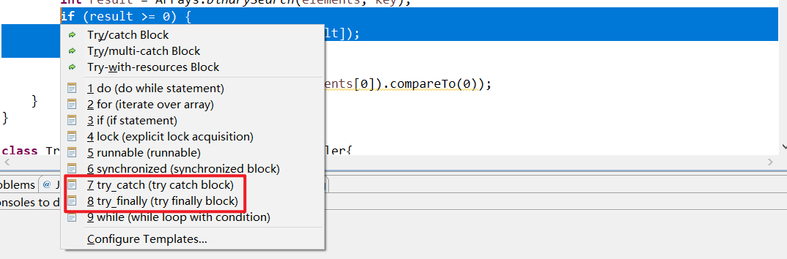

# 第7章 异常、断言和日志

人们在遇到错误时会感觉不适。如果一个用户在程序运行期间，由于程序的错误或一些外部环境的影响造成了用户数据的丢失，用户就可能不再使用这个程序了。为了避免这种情况的发生，至少应该做到以下几点：

- 向用户通报错误
- 保存所有的工作结果
- 允许用户以妥善的方式退出程序

对于的情况，例如，可能造成程序崩溃的错误输入，Java使用一种成为**异常处理（exceprion handing）**的错误捕获机制处理。本章的第一部分先介绍Java的异常。

在测试期间，需要进行大量的检测以验证程序操作的正确性。然而这些检测非常耗时，在测试结束之后也不必保留它们，因此可以将这些检测删除，并在其他测试需要时再复制粘贴回来。本章的第二部分将介绍如何使用断言来有选择地启用检测。

当程序出现错误时，并不总是能够与用户或终端进行沟通。此时，可能希望记录下出现的问题，以备日后进行分析。本章的第三部分将讨论标准Java日志框架。


# 7.1 处理错误

用户期望在出现错误时，程序能够采用一些理智的行为。如果由于出现错误而导致某些操作没有完成，程序应该：

- 返回到一种安全的状态，并能够让用户执行一些其他的命令
- 允许用户保存所有操作的结果，并以妥善的方式终止程序

要做到这些可能并不是一件容易的事，其原因是检测（或引发）错误条件的代码通常离那些能够让数据恢复到安全状态，或者能够保存用户数据并能正确退出程序的代码很远。==异常处理的任务就是将控制权从错误产生的地方转移给能够处理这种情况的错误处理器。==可能引起程序出现错误原因有以下几种：

- **用户输入错误**：比如用户输入的数据不符合程序的要求
- **设备错误**：比如打印机没有纸
- **物理限制（如内存满了）**：可用存储空间已被用完
- **代码错误**：比如数组的索引不合法，让空栈弹出数据

对于方法中的一个错误，传统的做法是返回一个区别于输出的特殊错误码或者返回空值（null），由调用方法分析。但是并不是任何一种情况都能返回错误码。==有可能无法明确地将有效数据与无效数据相区分。==比如一个返回整型的方法就不能简单地通过返回-1表示错误，因为正确结果也有可能是-1。

在Java中，如果某个方法不能够采用正确的途径完整它的任务，就可以通过另外一个途径退出方法。在这种情况下，方法并不返回任何值，而是**抛出（throw）**一个封装了错误信息的对象。需要注意的是，==这个方法会立即退出，不返回任何值。此外调用这个方法的代码也无法继续执行下去，取而代之的是，异常处理机制开始搜索能够处理这种异常情况的**异常处理器（exception handler）。**==


## 7.1.1 异常分类


==所有的异常都由`Throwable`继承而来，但是下一层会分解成两个分支：`Error`和`Exception`。==

`Error`类层次结构描述了Java运行时系统的内部错误和资源耗尽警告，应用程序不应该抛出这个类型的对象。出现这种错误的话，除了通告给用户并尽力使程序安全地终止之外，没有别的方法了。这种情况一般很少会发生。

在设计Java程序时，需要关注`Exception`层次结构。这个层次结构又分成两个分支：一个分支派生于RuntimeException，另一个分支包含其他异常。==划分两个分支的规则是：程序错误导致的异常属于RuntimeException；而程序没有错误，但由于像I/O错误这类问题导致的异常属于其他异常。====也可以这样划分：完全取决于方法调用方的异常属于RuntimeException，不仅仅取决于方法调用方（比如环境异常）的异常属于其他异常。==

派生于RuntimeException的异常包含以下几种情况：

- 错误的类型转换
- 数组访问越界
- 访问null指针

不是派生于RuntimeException的异常包含：

- 试图在文件尾部后面读取数据
- 试图打开一个不存在的文件
- 试图根据给定的字符串查找Class对象，而这个字符串表示的类并不存在。

“如果出现RuntimeException异常，那么就一定是你的问题”。比如可以通过检测数组下标是否越界来避免ArrayIndexOutOfBoundsException异常；应该在使用变量之前检测是否为null来杜绝NullPointerException异常的发生。

如何处理不存在的文件呢？确实可以在先检查文件是否存在然后再打开，但是这个文件可能在检查之前就已经被删除了，因此“是否存在”取决于环境，而不仅仅取决于代码。

Java将派生于Error或RuntimeException类的所有异常称为**非受查异常（unchecked exception）**，所有其他的异常称为**受查异常（checked exception）**。编译器将核查是否所有的受查异常提供了异常处理器，因此受查异常也成为编译时异常。


## 7.1.2 声明受查异常

一个方法不仅需要告诉编译器将要返回什么值，还要告诉编译器有可能发生什么错误。例如，一段读取文件的代码知道有可能读取的文件不存在，或者读取的文件为空，因此试图处理文件信息的代码就需要通知编译器可能会抛出IOException类的异常。

==方法应该在首部声明所有可能抛出的异常。==这样可以从首部反映出这个方法可能抛出哪类受查异常。例如，下面是标准类库中提供的FileInputStream类的一个构造器的声明：

```java
public FileInputStream(String name) throws FileNotFoundException
```

这个声明表示这个构造器将根据给定的String参数产生一个FileInputStream对象，但也有可能抛出一个FileNotFoundException异常。如果抛出了异常，构造器将不会初始化一个新的FileNotFoundException对象，而是抛出一个FileNotFoundException类对象。如果这个方法真的抛出一个FileNotFoundException类对象，运行时系统就会开始搜索异常处理器，以便知道如何处理FileNotFoundException对象。

==遇到下面4种情况时可能抛出异常：==

1. ==调用一个抛出受查异常的方法。==
2. ==程序运行过程中发生错误，并且利用throw语句抛出一个受查异常。==
3. ==程序出现错误。==
4. ==Java虚拟机和运行时库出现的内部错误。==

如果出现前面两种情况之一，则必须告诉调用这个方法的程序员有可能抛出异常。对于那些可能被他人使用的Java方法，应该根据**异常规范（exception specification）**，在方法的首部声明这个方法可能抛出异常。

```java
class MyAnimation{
    ...
    public Image loadImage(String s)throws IOException{
        ...
    }
}
```

如果一个方法有可能抛出多个受查异常类型，那么就必须在方法的首部列出所有的异常类。每个异常类之间用逗号隔开。如下所示：

```java
class MyAnimation{
    ...
    public Image loadImage(String s)throws FileNotFoundException, EOFException{
        ...
    }
}
```

==但是，不需要声明Java的内部错误，即从Error继承的错误。==任何程序代码都有可能抛出那些异常的潜能，而我们对其没有任何控制能力。

==同样也不应该声明从RuntimeException继承的那些非受查异常。==因为运行时异常完全在我们的控制之下，完全有可能通过修正代码来避免产生这些非受查异常。

```java
class MyAnimation{
    ...
    /*ArrayIndexOutOfBoundsException扩展于RuntimeException，属于非受查异常，因此不应该像下面这样抛出*/
    void drawImage(int i)throws ArrayIndexOutOfBoundsException{
        ...
    }
}
```

==总之，一个方法必须声明所有有可能抛出的受查异常，而非受查异常要么不可控制（Error），要么应该避免发生（RuntimeException）。==如果方法没有声明所有有可能抛出的受查异常，编译器会发出一个警告消息。

**需要注意：如果子类中覆盖了超类的一个方法，子类方法中声明的受查异常不能比超类方法中声明的异常更通用（或者说子类方法应该抛出更特定的异常，或者根本不抛出异常）。特别需要说明的是，如果超类方法没有抛出任何受查异常，那么子类的覆盖方法也不应该抛出任何受查异常。**

==如果类中的一个方法声明抛出一个异常，而这个异常是某个类的实例，那这个方法就有可能抛出一个这个类的异常，或者这个类的任意一个子类的异常。==例如FileInputStream构造器声明将有可能抛出一个IOException异常，然而并不知道是哪种IOException异常，它既可能是IOException类的实例，也有可+能使其子类的实例，如FileNotFoundException。


## 7.1.3 如何抛出异常

假设一个名为readData的方法正在读取一个首部具有下列信息的文件：Content-length:1024，然而读到733个字符文件就已经结束了，我们认为这是一种不正常的情况，希望抛出一个异常。

首先要决定抛出什么类型的异常，将上述异常归结到IOException是一种很好的选择。仔细阅读Java API文档之后会发现：IOException类的子类EOFException描述的是“在输入过程中，遇到了一个未预期的EOF后的信号”。这正是我们要抛出的异常。


下面是抛出这个异常的语句：

```java
throw new EOFException();
或者
EOFException e = new EOFException();
throw e;
```

完整的Java代码如下：

```java
String readData(Scanner in)throws EOFException{
    ...
    while(...){
        if(!in.hasNext()){
            if(n < len) throw new EOFException();
        }
        ...
    }
    return s;
}
```

EOFException类还有一个含有一个字符串型参数的构造器。这个构造器可以更加细致的描述异常出现的情况：

```java
throw new EOFException("Content-length:" + len + ", Received:" + n);
```

如果我们要抛出一个已经存在的异常类，过程如下：

1. 找到一个合适的异常类
2. 创建这个类的一个对象
3. 将对象抛出

一旦抛出了异常，那么方法将直接返回一个异常对象，我们不必为返回的默认值或错误代码担忧。


## 7.1.4 创建异常类

如果任何标准异常类都没有能够充分地描述清楚，在这种情况下可以创建自己的异常类。==我们需要做的只是定义一个派生于Exception的类或者派生于Exception子类的类。==习惯上，定义的类应该包含两个构造器，一个是默认的构造器，另一个是带有详细描述信息的构造器（超类Throwable的toString方法将会打印这些详细信息），如下：

```java
class FileFormatException extends IOException{
    public FileFormatException(){
        
    }
    public FileFormatException(String gripe){
        super(gripe);
    }
}
```

现在抛出自己定义的异常类了：

```java
String readData(BufferedReader in) throws FileFormatException{
    ...
    while(...){
        if(ch == -1){
            if(n < len) throw new FileException();
        }
    }
    return s;
}
```

> java.lang.Throwable 1.0

- **Throwable()**

  创建一个新的Throwable对象，这个对象没有详细的描述信息。

- **Throwable(String message)**

  构造一个新的throwable对象，这个对象带有特定的详细描述信息。习惯上，所有派生的异常类都支持一个默认的构造器和一个带有详细描述信息的构造器。

- **String getMessage()**

  获得Throwable对象的详细描述信息。


# 7.2 捕获异常


## 7.2.1 捕获异常

如果某个异常发生的时候没有在任何地方进行捕获，那么程序就会终止执行，并在控制台上打印异常信息，其中包含异常的类型和堆栈的内容。

要想捕获异常，必须设置try/catch语句块。最简单的try语句块如下所示：

```java
try{
    ...
}catch(ExceptionType e){
    handler for this type
}
```

在Eclipse中，可以选中一段代码段之后，键盘输入<kbd>ALT</kbd>+<kbd>CTRL</kbd>+<kbd>Z</kbd>，即可快速生成try/catch语句块：



- 如果在try语句块中的任何代码抛出了一个在catch子句中说明的异常类，那么程序将跳过try语句块的其余代码，并将执行catch子句中的处理器代码
- 如果在try语句块中没有抛出任何异常，那么程序将会跳过catch子句
- 如果方法中的任何代码抛出了一个在catch子句中没有声明的异常类型，那么这个方法就会立刻退出

```java
public void read(String fileName){
    try{
        InputStream in = new FileInputStream(fileName);
        int b;
        while((b = in.read()) != -1){
            处理输入
        }
    }catch(IOException e){
        e.printStackTrace();
    }
}
```

除了使用try/catch语句块处理异常之外，还可以将异常传递给调用者。如果采用这种方式，就必须声明这个方法可能会抛出某种异常。

```java
public void read(String fileName)throws IOException{
    InputStream in = new FileInputStream(fileName);
    int b;
    while((b = in.read()) != -1){
        处理输入
    }
}
```

如果调用了一个抛出受查异常的方法，就必须对它进行处理，或者继续传递。==通常，应该捕获那些知道如何处理的异常，而将那些不知道怎么处理的异常继续进行传递。==

==当然，这个规则也有一个例外：如果编写一个覆盖超类的方法，而这个方法又没有抛出异常，那么这个方法就必须捕获方法代码中出现的每一个受查异常。因为子类方法抛出的异常类型必须是超类抛出异常类型的同类或者子类，超类方法如果没有抛出异常，那么子类的覆盖方法也不能抛出异常。==


## 7.2.2 捕获多个异常

 ==在一个try语句块中可以捕获多个异常类型，并对不同类型的异常做出不同的处理。==可以按照下列方式为每个异常类型使用一个单独的catch子句：

```java
try{
    ...
}catch(FileNotFoundException e){
    处理FileNotFoundException
}catch(UnknownHostException e){
    处理UnknownHostException
}catch(IOException){
    处理IOException
}
```

异常对象可能包含与异常本身有关的信息、可以尝试使用`e.getMessage()`得到详细的错误信息，或者使用`e.getClass().getName()`得到异常对象的实际类型。

==在Java SE 7中，同一个catch子句中可以捕获多个异常类型。==例如，假设对应缺少文件和未知主机异常的动作是一样的，就可以合并catch子句：

```java
try{
    ...
}catch(FileNotFoundException | UnknownHostException e){
    ...
}catch(IOException){
    ...
}
```

只有当捕获的异常类型彼此之间不存在子类关系时才需要使用到这个特性。

==捕获多个异常时，异常变量隐含为final变量，因此不能在catch子句中为e赋不同的值。==


## 7.2.3 再次抛出异常和异常链

==在catch子句中可以抛出一个异常，这样做的目的就是为了改变异常的类型。==比如执行servlet代码可能不想知道发生错误的细节原因，但希望明确地知道servlet是否有问题，下面给出了捕获异常并将它再次抛出的基本方法：

```java
try{
    访问数据库
}catch(SQLException e){
    throw new ServletException("database error: " + e.getMesasge());
}
```

不过有一种更好的处理方法，并且将原始异常设置为新异常的原因：

```java
try{
    访问数据库
}catch(SQLException e){
    Throwable se = new ServletEception("database error");
    se.initCause(e);
    throw se;
}
```

当捕获到异常之后，就可以使用下面的语句重新得到原始异常：

```java
Throwable e = se.getCause();
```

强烈建议使用这种包装技术。这样可以让用户抛出子系统的高级异常，而不会丢失原始的异常细节。

再次抛出异常的情况包含以下几类：

1.  想要抛出更高级的异常，让调用者不必了解细节。

2. 如果在一个方法中发生了一个受查异常，而不允许抛出它，那么我们就可以捕获这个受查异常，并将其包装为一个运行时异常。

3. 有时候我们只想记录一个异常，然后将其再次抛出，而不做任何的改变：

    ```java
    try{
        访问数据库
    }catch(Exception e){
        logger.log(level, message, e);
        throw e;
    }
    ```

在Java SE 7之前，假设这个代码在这个方法中：`public void updateRecord() throws SQLException`，Java编译器会先查看catch块中的throw语句，然后查看e的类型，会指出这个方法可以抛出任何Exception而不只是SQLException。现在编译器会跟踪到e来自try块，假设这个try块三种仅有的已检查异常时SQLException实例，另外假设e在catch块中未改变，将外围方法声明为throws SQLException就是合法的。


## 7.2.4 finally子句

如果方法获得了一些本地资源，并且只有这个方法自己知道，又如果这些资源在退出方法之前必须被回收，那么就会产生资源回收问题。一种解决的方法是在catch子句中清楚所有分配的资源，并重新抛出所有的异常，但是这种方法既需要在正常的代码中释放资源，也要在异常代码中释放资源。

Java有一种更好的释放资源的方法，这就是finally子句。==不管是否有异常被捕获，finally子句中的语句都会被执行。==在下面的示例中，程序将在*所有情况*下关闭文件。

```java
InputStream in = new FileInputStream(...);
try{
    //1
    code that might throw exceptions
    //2
}catch(IOException e){
    //3
    show error message
    //4
}finally{
    //5
    in.close();
}
//6
```

在上面这段代码中，有下列3种情况会执行finally子句：

1. **代码没有抛出异常。**在这种情况下，程序首先会执行try语句块中的所有语句，然后执行finally子句中的所有语句。随后继续执行try/catch/finally语句块之后的第一条语句。**也就是说会执行第1、2、5、6处。**
2. **抛出一个在catch子句中捕获的异常。**在这种情况下，程序将执行try语句块中的所有代码，直到发生异常为止。此时，将跳过try语句块的剩余代码，转去执行与该异常匹配的catch子句中的代码，最后执行finally子句中的语句。
   - **如果catch子句没有抛出异常**，程序将执行try语句块之后的第一条语句。**此时执行第1、3、4、5、6处的语句。**
   - **如果catch子句也抛出了异常，**异常将被抛回这个方法的调用者。**此时执行第1、3、5处的代码。**
3. **代码抛出了一个异常，并且catch子句没有捕获到。**在这种情况下，程序将执行try语句块中的代码直到抛出异常为止。然后跳过try语句块的剩余代码，执行finally子句中的语句，并将这个异常抛给这个方法的调用者。**此时执行第1、5处的代码。**

由上可看出，==无论在什么情况下，finally子句中的in.close()语句都会被执行。==

### 7.2.4.1 解耦合try/catch和try/finally语句块

==强烈建议解耦合try/catch和try/finally语句块，这样可以提高代码的清晰度。==如下所示：

```java
/*解耦合try/catch和try/finally语句块*/
InputStream in = new FileInputStream(...);
try{
    try{
        code that might throw exceptions
    }finally{
        in.close();
    }
}catch(IOException e){
    show error message
}
```

==内层的try语句块的职责就是确保关闭输入流。外层try语句块的职责就是确保报告出现的错误。==

==这种设计方式的好处是会报告finally子句中出现的错误。==

### 7.2.4.2 return语句和finally子句的先后顺序

假设利用return语句从try语句块中退出。==在方法返回之前，finally语句块的内容将被执行。如果finally子句中也有一个return语句，这个返回值将会覆盖原来的返回值。==如下所示：

```java
public static int f(int n){
    try{
        int r = n * n;
        return r;
    }finally{
        if(n == 2) return 0;
    }
}
```

如果调用f(2)，那么try语句块的计算结果为r=4，并执行return语句。然而在方法返回之前，还要执行finally子句。finally子句使得方法返回0，这个返回值将会覆盖原来的返回值4。因此，f(2)的执行结果为0。


## 7.2.5 带资源的try语句

如果原来的try语句块想要抛出一个需要调用者处理的异常，并且finally语句块也抛出了一个异常，那么原始的异常就会丢失，转而抛出finally子句中的异常。下面就是解决这种情况的方法。

对于以下代码模式：

```java
open a resource
try{
    work with resource
}finally{
    close the resource
}
```

假设资源属于一个实现了`AutoCloseable`接口的类，Java SE 7为这种代码模式提供了一个很有用的快捷方式。`AutoCloseable`接口有一个方法：

```java
void close() throws Exception
```

带资源的try语句（try-with-resource）的最简形式为：

```java
try(Resource res = ...){
    work with res
}
```

==try块退出后，会自动调用res.close()。==下面是一个典型的例子，这里要读取一个文件中的所有单词：

```java
try(Scanner in = new Scanner(new FileInputStream("/usr/share/dict/words"),"UTF-8")){
    while(in.hasNext()){
        System.out.println(in.next());
    }
}
```

==这个块正常退出后，或者存在一个异常时，都会调用in.close()方法==，就好像用了finally块一样。

还可以指定多个资源，例如：

```java
try(Scanner in = new Scanner(
    new FileInputStream("/usr/share/dict/words"),"UTF-8");
    PrintWriter out = new PrinterWriter("out.txt")){
    	while(in.hasNext()){
        	System.out.println(in.next());
    	}
}
```

不论这个块如何退出，in和out都会关闭。如果try语句块抛出一个异常，并且close方法也抛出一个异常，那么就会带来难题。带资源的try语句可以很好地处理这种情况。==原来的异常会重新抛出，而close方法抛出的异常就会**被抑制（suppressed）**。这些被抑制的异常将会被自动捕获，并且原来的异常会自动调用`addSuppressed`方法。如果对这些异常很感兴趣，可以调用`getSuppressed`方法，它会得到从close方法抛出并被抑制的异常列表。==

==只要需要关闭资源，就要尽可能地使用带资源的try语句。==

> 带资源的try语句自身也可以有catch子句和一个finally子句。这些子句会在关闭资源之后执行。不过一般不用添加catch子句和一个finally子句，因为带资源的try语句本身会自动关闭资源，并且抛出异常自己再处理是画蛇添足的表现，抛出异常本来就是要调用者来处理异常


## 7.2.6 分析堆栈轨迹元素

**堆栈轨迹（stack trace）**是一个方法调用过程的列表，它包含了程序执行过程中方法调用的特定位置。

可以使用`Throwable`类的printStackTrace方法访问堆栈轨迹的文本描述信息。

```java
Throwable t = new Throwable();
StringWriter out = new StringWriter();
t.printStackTrace(new PrintWriter(out));//将此throwable和其追溯打印到指定的打印作者。 
```

一种更加灵活的方法是使用`getStackTrace`方法，它会得到`StackTraceElement`对象的一个数组，可以在程序中分析这个对象数组。例如：

```java
Throwable t = new Throwable();
StackTraceElement[] frames = t.getStackTrace();
for(StackTraceElement frame : frames){
    analyze frame
}
```

`StackTraceElement`类含有能够获得文件名和当前执行的代码行号的方法，同时还含有能够获得类名和方法名的方法。`toString`方法将产生一个格式化的字符串，其中包含所获得的信息。

`Thread`类静态的`getAllStackTrace`方法，可以产生所有线程的堆栈轨迹。

以下面计算阶乘的程序为例：

```java
package pers.yujia.practice;

import java.util.Scanner;

public class FactorialTest {
	public static int factorial(int n) {
		System.out.println("factorial(" + n + ")");
		Throwable t = new Throwable();
//		StackTraceElement[] stackTrace = t.getStackTrace();
//		for (StackTraceElement stackTraceElement : stackTrace) {
//			System.out.println(stackTraceElement);
//		}
		t.printStackTrace();
		int r = 0;
		if (n <= 0) {
			r = 1;
		}else {
			r = n * factorial(n - 1);
		}
		System.out.println("return:" + r);
		return r;
	}
	
	public static void main(String[] args) {
		Scanner scanner = new Scanner(System.in);
		System.out.print("Enter n:");
		int n = scanner.nextInt();
		factorial(n);
		scanner.close();
	}
}
```

上面程序的运行结果如下所示：


因此`printStackTrace`方法常常被用作打印异常的方法堆栈信息，如下所示：

```java
try{
    ...
}catch(ExceptionType e){
    e.printStack();//打印异常发生时的方法堆栈轨迹
}
```

> java.lang.Throwable 1.0

- **Throwable(Throwable cause) 1.4**

- **Throwable(String message, Throwable cause) 1.4**

  用给定的原因构造一个Throwable对象。有时候我们无需知道某个异常发生的细节，可以构造一个更高级的异常来抛出。

- **Throwable initCause(Throwable cause) 1.4**

  将这个对象设置为原因。如果这个对象已经被设置为原因，则抛出异常。返回this引用。

- **Throwable getCause() 1.4**

  获得设置为这个对象的原因的异常对象。如果没有设置原因，则返回null。

- **StackTraceElement[] getStackTrace() 1.4**

  获得构造这个对象时调用堆栈的跟踪。

- **void addSupressed(Throwable t) 7**

  为这个异常增加一个抑制异常。这出现在带资源的try语句中，会被自动地调用，其中t时close方法抛出的一个异常。

- **Throwable[] getSupressed() 7**

  得到这个异常的所有抑制异常。一般来说，这些是带资源的try语句中close方法抛出的异常。

> java.lang.Exception 1.0

- **Exception(Throwable cause) 1.4**

- **Exception(String message, Throwable cause) 1.4**

  用给定的原因构造一个异常对象。

> java.lang.RuntimeException 1.0

- **RuntimeException(Throwable cause) 1.4**

- **RuntimeException(String message, Throwable cause) 1.4**

  用给定的原因构造一个RuntimeException对象

> java.lang.StackTraceElement 1.4

- **String getFileName()**

  返回这个元素运行时对应的源文件名。如果这个信息不存在，则返回null。

- **int getLineNumber()**

  返回这个元素运行时对应的源文件行数。如果这个信息不存在，则返回-1。

- **String getClassName()**

  返回这个元素运行时对应的类的完全限定名。

- **String getMethodName()**

  返回这个元素运行时对应的方法名。构造器名是\<init>；静态初始化器名是\<clinit>。这里无法区分重载的方法名。

- **boolean isNativeMethod()**

  如果这个元素运行时在一个本地方法中，则返回true。

- **String toString()**

  如果存在的话，返回一个包含类名，方法名，文件名和行数的格式化字符串。


# 7.3 使用异常机制的技巧

##  7.3.1 异常处理不能代替简单的测试

我们尝试上百万次地对一个空栈进行退栈操作。在进行退栈操作之前要查看栈是否是空的：

```java
if(!s.empty()) s.pop();
```

假如我们捕获EmptyStackException异常来进行退栈操作：

```java
try{
	s.pop();
}catch(EmptyStackException e){
    ...
}
```

==与执行简单的测试相比，捕获异常所花费的时间大大超过了前者，因此使用异常的基本规则是：只在异常情况下使用异常机制。==


## 7.3.2 不要过分地细化异常

```java
PrintStream out;
Stack s;
for(i = 0; i < 100; i++){
    try{
        n = s.pop();
    }catch(EmptyStackException e){
        ...
    }
    try{
        out.writeInt(n)
    }catch(IOException e){
        ...
    }
}
```

这种编程方式将导致代码量的急剧膨胀，有必要将*整个任务*包装在一个try语句块中，==任何一个操作出现问题，将直接退出循环（之前的循环结果仍然保留）==：

```java
int i = 100;
int n = 0;

try {
    for (;; i--) {
        n = 100 / i;
    } 
} catch (Exception e) {
    System.out.println("出现异常：" + i);
}
System.out.println("n = " + n);//最后输出n = 100 / 1 = 100
```

这样也满足了异常处理机制的一个目标，将正常处理与错误处理分开。


## 7.3.3 利用异常层次结构

- 不要只抛出RuntimeException异常，应该寻找更加合适的子类或创建自己的异常类。
- 不要只捕获Throwable异常，否则出现错误时无法及时发现问题根源。
- 考虑受查异常和非受查异常的区别。
- 将一种异常转换为另一种更加合适的异常时不要犹豫。例如在解析某个文件中的一个整数时，捕获NumberFormatException异常，然后将它转换为IOException或MySubsystemException的子类。


## 7.3.4 不要压制异常

在Java中，往往强烈地倾向关闭异常而不是压制异常。如果编写了一个调用另一个方法的方法，而这个方法可能一百年才会抛出一个异常，那么编译器会因为没有将这个异常列在throws表中产生抱怨。而没有将这个异常列在throws表中主要出于编译器将会对所有调用这个方法的方法进行异常处理的考虑。因此应该将这个异常关闭：

```java
public Image loadImage(String s){
    try{
        ...
    }catch(Exception e){
        
    }
}
```

现在这段代码不仅能够通过编译。除非发生异常，否则它将正常地运行，即使发生了异常也会被忽略。如果认为异常非常重要，就应该对他们进行处理。


## 7.3.5 在检测错误时，苛责比放任更好

在用无效的参数调用一个方法时，返回一个虚拟的数值，还是抛出一个异常？当栈空时stack.pop是返回一个null还是抛出一个异常？

我们认为：==在出错的地方抛出一个EmptyStackException异常比在后面抛出一个NullPointerException异常更好。==


## 7.3.6 不要羞于传递异常

让高层次的方法通知用户发生了错误，或者放弃不成功的命令更加适宜。

上述的方法可以归纳为==早抛出，晚捕获==。


# 7.4 使用断言

## 7.4.1 断言的概念

假设确信某个属性符合要求，并且代码的执行依赖这个属性。例如需要计算`double y = Math.sqrt(x)`，我们确信这里的x是一个非负数值，原因是x是另外一个计算的结果或者它的调用者限制只能提供一个正整数。然而我们还是希望进行检查，以避免“不是一个数”的数值参与数值计算，当然也可以抛出一个异常：

```java
if(x < 0)throw new IllegalArgumentException("x < 0");
```

但是上面这段代码会一直保留在程序中，即使测试完毕也不会自动删除。如果程序含有大量的这种检查，程序运行起来会相当的慢。

==断言机制允许在测试期间向代码中插入一些检查语句。当代码发布时，这些插入的检测语句会自动地被移走。==

Java引入了关键字**Assert**。这个关键字有两种形式：

```java
assert 条件;
或者
assert 条件:表达式;
```

在两种形式都会对条件进行检测，如果结果为false，则抛出一个`AssertionError`异常。在第二种形式中，表达式将被传入`AssertionError`的构造器，并转换成一个消息字符串。“表达式”部分的唯一目的就是产生一个消息字符串。AssertionError对象并不存储表达式的值，因此不可能在以后得到它。

要想断言x是一个非负数值，只需要简单地使用下面这条语句：

```java
assert x >= 0;
```

或者将x的实际值传递给`AssertionError`对象，从而可以在后面显式出来：

```java
assert x >= 0 : x;
```


## 7.4.2 启用和禁用断言

在默认情况下，断言被禁用。可以在运行程序的时候用`-enableassertions`或`-ea`选项启用：

```java
java -enableassertions MyApp
```

需要注意的是，在启用或禁用断言时不必重新编译程序。==启用或禁用断言是**类加载器（class loader）**的功能。==当禁用断言时，类加载器将跳过断言代码，因此不会降低程序运行的速度。

也可以在某个包或某个类中启用断言，例如：

```java
java -ea:MyClass -ea:com.mycompany.mylib... MyApp
```

这条命令将开启MyClass类以及在com.mycompany.mylib包和它的所有子包中的所有类的断言。

也可以用选项`-disableassertions`或`-da`禁用某个特定包和类的断言：

```java
java -ea:... -da:MyClass MyApp
```

有些类不是由类加载器加载，而是直接由虚拟机加载，启用和禁用所有断言的`-ea`和`-da`开关不能应用到那些没有类加载器的“系统类”上，对于这些系统来说，需要使用`-enablesystemassertions`或`-esa`开关启用断言。

在程序中也可以控制类加载器的断言状态。


## 7.4.3 使用断言完成参数检查

在Java中，给出了3种处理系统错误的机制：

- 抛出一个异常
- 日志
- 使用断言

==应该在以下情况时使用断言：==

- 断言失败是致命的，不可恢复的错误
- 断言检查只用于开发和测试阶段

因此，==不应该使用断言向程序的其他部分通告发生了可恢复性的错误==，或者，==不应该作为程序向用户通告问题的手段。==断言只应该用于测试阶段确定程序内部的错误位置。

下面是一个十分常见的例子：检查方法的参数。是否应该使用断言来检查非法的下标值或null引用呢？假设实现一个排序算法：

```java
/**
* @param a the array to be sorted
* @param fromIndex the index of the first element(inclusive) to be sorted
* @param toIndex the index of the last element(exclusive) to be sorted
* @throws IllegalArgumentException if fromIndex > toIndex
* @throws ArrayIndexOutOfBoundsException if fromIndex < 0 or toIndex > a.length
*/
static void sort(int[] a, int fromIndex, int toIndex)
```

文档指出如果方法中使用了一个错误的下标值就会抛出异常。这是方法和调用者之间约定的处理行为。如果实现这个方法，就必须遵守这个规定，并抛出表示下标值有误的异常。因此这里使用断言不太合适。

是否应该断言a不是null呢？其实也不太合适，因为文档中没有指出当a是null的时候应该采取的行动。在这种情况下，调用者可以认为这个方法将会成功地返回，而不会抛出一个断言错误。

然而，假设这个方法的约定做出改动：

```java
@param a the array to be sorted(must not be null)
```

现在这个方法的调用者就必须注意：不允许用null数组来调用这个方法，并在这个方法的开头使用断言：

```java
assert a != null
```

==计算机科学家将这种约定称为**前置条件（precondition）**==。如果调用者在调用这个方法的时候没有提供满足这个前置条件的参数，所有的断言都会失败，并且这个方法可以执行它想做的任何动作。


## 7.4.4 为文档假设使用断言

很多程序源使用注释说明假设条件，然而在有些情况下也可以使用断言作为注释条件。如下所示：

```java
if(i % 3 == 0)...
if(i % 3 == 1)...
else //(i % 3 == 2)
...
```

在这个示例使用断言会更好一些：

```java
if(i % 3 == 0)...
if(i % 3 == 1)...
else {
    assert i % 3 == 2;
    ...
}
```

当然如果i为负数，那么i%3还可以为-1，-2。然而我们一般认为i为正值。因此可以在if语句之前使用下列断言：

```java
assert i >= 0;
```

==断言是一种测试和调试阶段所使用的战术性工具；而日志记录是一种在程序的整个生命周期都可以使用的策略性工具。==

> java.lang.ClassLoader 1.0

- **void setDefaultAssertionStatus(boolean b) 1.4**

  对于通过类加载器加载的所有类来说，如果没有显式地说明类或包地断言状态，就启用或禁用断言。

- **void setClassAssertionStatus(boolean b) 1.4**

  对于给定的类和它的内部类，启用或禁用断言。

- **void setPackageAssertionStatus(boolean b) 1.4**

  对于给定包和其子包中的所有类，启用或禁用断言。

- **void clearAssertionStatus() 1.4**

  移去所有类和包的显式断言状态设置，并禁用所有通过这个类加载器加载的类的断言。


# 7.5 记录日志

记录日志相关API的优点：

- 可以很容易地取消所有日志记录，或者仅仅取消某个级别的日志，而且打开和关闭这个操作也很容易。
- 可以很简单地禁止日志记录的输出，因此，将这些日志代码留在程序中的开销很小。
- 日志记录可以被定向到不同的处理器，用于在控制器中显示，用于存储到文件中等。
- 日志记录器和处理器都可以对记录进行过滤。过滤器可以根据过滤实现器制定的标准丢弃那些无用的记录项。
- 日志记录可以采用不同的方式格式化，例如纯文本或XML。
- 应用程序可以使用多个日志记录器，它们使用类似包名的这种具有层次结构的名字，例如，com.mycompany.myapp。
- 在默认情况下，日志系统的配置由配置文件控制。如果需要的话，应用程序可以替换这个配置。


## 7.5.1 基本日志

要生成简单的日志记录，可以使用**全局日志记录器（global logger）**并调用其info方法：

```java
Logger.getGlobal().info("File->Open menu item selected");
```

在默认情况下，这条记录会显示下面的内容：


但是，如果在适当的地方（如main开始）调用

```java
Logger.getGlobal().setLevel(Level.OFF);
```

将会取消所有的日志。


## 7.5.2 高级日志

==在一个专业的应用程序里，不要将所有的日志都记录到一个全局日志记录器中，而是可以自定义一个日志记录器，可以调用`getLogger`方法创建或获取记录器：==

```java
private static final Logger myLogger = Logger.getLogger("com.mycompany.myapp");
```

未被任何变量引用的日志记录器可能会被垃圾回收。为了防止这种情况发生，要像上面的例子一样，用一个静态变量存储日志记录器的一个引用。

与包名类似，日志记录器名也有层次结构。==对于包来说，一个包的名字与其父包的名字之间没有语义关系，但是日志记录器的父与子之间将共享某些属性。==例如，如果对com.mycompany日志记录器设置了日志级别，它的子记录器也会继承这个级别。

通常，有以下7个日志记录器级别：

- **SEVERE**
- **WARNING**
- **INFO**
- **CONFIG**
- **FINE**
- **FINEST**

在默认情况下，只记录前三个级别。也可以通过下面的方式设置其他的级别，例如：

```java
logger.setLevel(Level.FINE);
```

现在FINE和更高级别的记录都将会被记录下来。

另外，还可以使用`Level.ALL`开启所有级别的记录，或者使用`Level.OFF`关闭所有级别的记录。

对于所有的级别可以使用下面的记录方法：

```java
logger.warning(message);
logger.fine(message);
```

同时还可以使用`log`方法指定级别，例如：

```java
logger.log(Level.FINE, message);
```

默认的日志配置记录了INFO或更高级别的所有记录，应该使用CONFIG、FINE、FINER和FINEST级别来记录那些有助于诊断，但对于程序员又没有太大意义的调试信息。如果将记录级别设计为INFO或者更高，则需要修改日志处理器的配置。

默认的日志记录将显示包含日志调用的类名和方法名，但是如果虚拟机对执行过程进行了优化，就得不到准确的调用信息。此时，可以调用`logp`获得调用类和方法的确切信息，这个方法的签名为：

```java
void logp(level l, String className, String methodName, String message)
```

下面有一些用来跟踪执行流的方法：

```java
void entering(String className, String methodName)
void entering(String className, String methodName, Object param)
void entering(String className, String methodName, Object[] params)
void exiting(String className, String methodName)
void exiting(String className, String methodName, Object result)
```

例如：

```java
int read(String file, String pattern){
    logger.entering("com.mycompany.mylib.Reader", "read", new Object[]{file, pattern});
    ...
    logger.exiting("com.mycompany.mylib.Reader", "read", count);
    return count;
}
```

这些调用将生成FINER级别和以字符串ENTRY和RETURN开始的日志记录。

记录日志的常见用途是记录那些不可预料的异常。可以使用下面两个方法提供日志记录中包含的异常描述信息。

```java
void throwing(String className, String methodName, Throwable t)
void log(level l, String message, Throwable t)
```

典型的用法是：

```java
if(...){
    IOException exception = new IOException("...");
	logger.throwing("com.mycompany.mylib.Reader", "read", exception);
    throw exception;
}
```

```java
try{
    ...
}catch(IOException e){
    Logger.getLogger("com.mycompany.myapp").log(level.WARNING, "Reading image", e);
}
```

调用throwing可以记录一条FINER级别的记录和一条以THROW开始的信息。


## 7.5.3 修改日志管理器配置

可以通过编辑配置文件来修改日志系统的各种属性。在默认情况下，配置文件存在于：`jre/lib/logging.properties`。

要想使用另一个配置文件，就要将`java.util.logging.config.file`特性设置为配置文件的存储位置，即`System.setProperty("java.util.logging.config.file", file)`，或者用下列的命令启动应用程序：

```java
java -Djava.util.logging.config.file=configFile MainClass
```

要想修改默认的日志记录级别，就需要编辑配置文件，并修改以下命令行：

```java
.level=INFO
```

可以通过添加以下内容来指定自己的日志记录级别，即在日志记录器名后面添加后缀.level：

```java
com.mycompany.myapp.level=FINE
```

==在稍后可以看到，日志记录并不将消息发送到控制台上，这是处理器的任务。另外，处理器也有级别，要想在控制台上看到FINE级别的消息，就需要进行下面的配置：==

```java
java.util.logging.ConsoleHandler.level=FINE
```

在日志管理器配置的属性不是系统属性，因此，==使用`-Dcom.mycompany.myapp.level=FINE`启动应用程序不会对日志记录器产生任何影响==。

日志属性文件`logging.properties`默认由`java.util.logging.LogManager`类处理。可以通过将`java.util.logging.manager`系统属性设置为某个子类的名字来指定一个不同的日志管理器。还有一种方法是将`java.util.logging.config.class`系统属性设置为某个类名，该类再通过其他方式设定日志管理器属性。


## 7.5.4 本地化

我们可能希望日志信息本地化，以便让全球的用户都可以阅读它。本地化的应用程序包含**资源包（resource bundle）**中的本地特定信息。资源包由各个地区的映射集合组成。例如，某个资源包可能将字符串“readingFile”映射成英文的“Reading file”或者德文的“Achtung! Datei wird eingelesen”。

一个程序可以包含多个资源包，比如一个用于菜单，其他用于日志信息等；或者是一个用于中文，另一个用于英文。每个资源包都有一个名字（如com.mycompany.logmessages_en）。==要想将映射添加到一个资源包中，需要为每个地区创建一个文件。==比如英文消息映射位于com/mycompany/logmessages_en.properties，德文消息映射位于com/mycompany/logmessages_de.properties文件中。（其中的en和de是语言编码，cn表示中文）。可以将这些文件与应用程序的类放在一起，以便`ResourceBundle`类自动地对它们进行定位。这些文件都是纯文本，其组成如下：

```properties
readingFile=Achthng! Datei wird eingelesen
renamingFile=Datei wird umbenannt
```

在请求日志记录器时，可以指定一个资源包：

```java
Logger logger = Logger.getLogger(loggerName, "com.mycompany.logmessages_en");
```

记录日志消息的时候，首先会在资源包中查找关键字，如果查找不到则会记录实际的日志消息字符串。

```java
logger.info("readingFile");
```

==通常需要在本地化的消息中增加一些参数，因此消息应该包括占位符{0}，{1}等。==例如，要想在日志消息中包含文件名，就应该用下列方式包括占位符：

```java
ReadingFile{0}.
Achthng! Datei {0} wird eingelesen.    
```

然后通过下面的方式向占位符传递具体的值：

```java
logger.log(Level.INFO, "readingFile", filename);
logger.log(level.INFO, "readingFile", new Object[]{oldName, newName});
```

资源包和代码的存放位置可以像下图一样：


根据上图的代码层次结构，指定资源包可以像下面的程序一样：

```java
package pers.yujia.practice;

import java.util.logging.Level;
import java.util.logging.Logger;

public class LocalizationLog {
	public static void main(String[] args) {
		Logger logger = Logger.getLogger("myLogger", "pers.yujia.practice.logmessages_en");
		logger.log(Level.INFO, "readingFile", " Hello");
		Logger logger1 = Logger.getLogger("myLogger1", "pers.yujia.practice.logmessages_zh");
		logger1.log(Level.INFO, "readingFile");
	}
}
```


## 7.5.5 处理器

在默认情况下，==日志记录器将记录发送至`ConsoleHandler`中，并由它输出到`System.err`流中。==特别地，日志记录器还会将记录发送至父处理器中，而最终的处理器（命名为“”）有一个`ConsoleHandler`。

与日志记录器一样，处理器也有日志记录级别。对于一个要被记录的日志记录，它的日志记录级别必须高于日志记录器和处理器的阈值。日志管理器配置文件设置的默认控制台处理器的日志记录级别为`java.util.logging.ConsoleHandler.level=INFO`

如果想要记录FINE级别的日志，就必须修改配置文件中的默认日志记录级别和处理器级别。另外还可以绕过配置文件，安装自己的处理器：

```java
Logger logger = Logger.getLogger("com.mycompany.myapp");//创建日志记录器
logger.setLevel(Level.FINE);//设置日志记录器级别
logger.setUseParentHandlers(false);//禁止将日志记录发送给父处理器
Handler handler = new ConsoleHandler();//创建控制台处理器
handler.setLevel(Level.FINE);//设置控制台处理器级别为FINE
logger.addHandler(handler);//添加控制台处理器以接收日志信息
```

我们的日志记录器是原始日志记录器（命名为“”）的子类，而原始日志记录器将会把所有等于或高于INFO级别的记录发送到控制台。==然而我们并不想两次看到这些记录。因此应该将`useParentHandlers`属性设置为false。==

==要想将日志记录发送到其他地方，就要添加其他的处理器==。Java为此提供了两个常用的日志处理器：一个是`FileHandler`，另一个是`SocketHandler`。`SocketHandler`将记录发送到特定的主机和端口。`FileHandler`可以收集文件中的记录。

可以像下面这样直接将记录发送到默认文件的处理器：

```java
FileHandler handler = new FileHandler();
logger.addHandler(handler);
```

这些记录被发送到用户主目录的`javan.log`文件中，其中n是文件名的唯一编号。如果用户系统没有主目录，文件就存储在C:\Window这样的默认位置上。


在默认情况下，记录被格式化为XML。下面是一个典型的日志记录的形式：

```xml
<?xml version="1.0" encoding="UTF-8" standalone="no"?>
<!DOCTYPE log SYSTEM "logger.dtd">
<log>
    <record>
        <date>2022-02-07T22:58:23</date>
        <millis>1644245903785</millis>
        <sequence>0</sequence>
        <logger>pers.yujia.myapp</logger>
        <level>INFO</level>
        <class>pers.yujia.practice.LocalizationLog</class>
        <method>main</method>
        <thread>1</thread>
        <message>Hello</message>
    </record>
</log>
```

可以通过设置日志管理器配置文件的不同参数，或者利用其它的构造器来修改文件处理器的默认行为：

| 配置属性                                | 描述                                                         | 默认值                                                       |
| --------------------------------------- | ------------------------------------------------------------ | ------------------------------------------------------------ |
| java.util.logging.FileHandler.level     | 处理器级别                                                   | Level.INFO                                                   |
| java.util.logging.FileHandler.append    | 控制处理器应该追加到一个已经存在的文件尾部还是应该为每个运行的程序打开一个新文件 | false                                                        |
| java.util.logging.FileHandler.limit     | 在打开另一个文件之前允许写入一个文件的近似最大字节数（0表示无限制） | 在FileHandler类中为0（表示无限制）；在默认的日志管理器配置文件中为50000 |
| java.util.logging.FileHandler.pattern   | 日志文件名的模式                                             | %h/java%u.log                                                |
| java.util.logging.FileHandler.count     | 在循环序列中的日志记录数量                                   | 1（不循环）                                                  |
| java.util.logging.FileHandler.filter    | 使用的过滤器类                                               | 没有使用过滤器                                               |
| java.util.logging.FileHandler.encoding  | 使用的字符编码                                               | 平台的编码                                                   |
| java.util.logging.FileHandler.formatter | 记录格式器                                                   | java.util.logging.XMLFormatter                               |

日志文件名的模式如下所示：

| 变量 | 描述                                                         |
| ---- | ------------------------------------------------------------ |
| %h   | 系统属性user.home的值                                        |
| %t   | 系统临时目录                                                 |
| %u   | 用于解决冲突的唯一编号                                       |
| %g   | 为循环日志记录生成的数值（当使用循环功能且模式不包含%g时，默认使用后缀%g） |
| %%   | %字符                                                        |

==如果多个应用程序（或者同一个应用程序的多个副本）使用同一个日志文件，就应该开启append标志。另外应该在文件名模式中使用%u，以便每个应用程序创建日志的唯一副本。==

还可以开启日志循环功能，日志文件默认以myapp.log.0，myapp.log.1，myapp.log.2等这种循环序列的形式出现。只要日志超过了大小限制，最旧的文件就会被删除，其他的文件将重新命名，同时创建一个新文件，其编号为0（因此0始终是最新的日志记录）。

如果开启日志循环功能，需要设置的日志管理器配置文件属性为：limit，pattern，count。


## 7.5.6 过滤器

在默认情况下，==过滤器根据日志记录的级别进行过滤。==每个日志记录器和处理器都可以有一个可选的过滤器来完成附加的过滤。另外，==可以通过实现`Filter`接口来定义下列方法来自定义过滤器：==

```java
boolean isLoggable(LogRecord record)
```

返回true表示这些记录应该包含在日志中。例如某个过滤器可能只对entering方法和exiting方法产生的消息感兴趣，这个过滤器可以调用`record.getMessage`方法，并查看这个消息是否使用ENTRY或RETURN开头。

要想将一个过滤器安装到一个日志记录器或处理器中，只需要调用`setFilter`方法就可以了。**注意：同一时刻只能由一个过滤器。**


## 7.5.7 格式化器

我们可以自定义日志记录的格式，这需要扩展`Formatter`类并覆盖下面这个方法：

```java
String format(LogRecord record)
```

可以根据自己的愿望对记录中的信息进行格式化，并返回结果字符串。在`format`方法中，有可能会调用下面这个方法：

```java
String formatMessage(LogRecord record)
```

这个方法将会对日志记录中的部分信息进行格式化、参数替换和本地化应用操作。

很多文件格式需要在已格式化的记录前后加上一个头部和尾部。在这个例子中，要覆盖下面两个方法：

```java
String getHead(Handler h)
String getTail(Handler h)
```

最后调用setFormatter方法将格式化器安装到处理器中。


## 7.5.8 日志记录说明

下面总结了日志最常用的操作：

1. 为一个简单的应用程序选择一个日志记录器，==并把日志记录器命名为与主应用程序包一样的名字。==另外可以通过下列方法得到日志记录器：

   ```java
   Logger logger = Logger.getLogger("com.mycompany.myprog");
   ```

   为了方便起见，可能希望利用一些日志操作将下面的静态域添加到类中：

   ```java
   private static final Logger logger = Logger.getLogger("com.mycompany.myprog");
   ```

2. ==默认的日志配置将会把级别高于或等于INFO级别的所有消息都记录在控制台。==用户可以覆盖默认的配置文件，但是最好在应用程序中安装一个更加适宜的默认配置。

   下面的代码可以确保将所有的消息记录到应用程序特定的文件中。可以将这段代码放置在应用程序的mian方法中：

   ```java
   if(System.getProperty("java.util.logging.config.class") == null && System.getProperty("java.util.logging.config.file") == null) {
   			try {
   				Logger.getLogger("logName").setLevel(Level.ALL);
   				final int LOG_ROTATION_COUNT = 10;
   				Handler handler = new FileHandler("%h/myapp.log", 0, LOG_ROTATION_COUNT);
   				Logger.getLogger("logName").addHandler(handler);
   			} catch (IOException e) {
   				// TODO: handle exception
   				Logger.getLogger("logName").log(Level.SEVERE, "Can't create log file handler", e);
   			}
   }
   ```

3. 需要牢记：==所有级别为INFO、WARNING、SEVERE的消息都会显示到控制台。因此最好只将对程序用户有意义的消息设置为这几个级别。==将程序员想要的日志记录设定为FINE是一个很好的选择，开发人员应该使用logger.fine()来替代System.out.println()。

4. 记录那些不可预料的异常，例如：

   ```java
   try{
       ...
   }catch(SomeException e){
       logger.log(Level.FINE, "explanation", e);
   }
   ```

> java.util.Logger 1.4

- **Logger getLogger(String loggerName)**

- **Logger getLogger(String loggerName, String bundleName)**

  获得给定名字的日志记录器，如果这个日志记录器不存在，创建一个日志记录器。

  参数：logName	具有层次结构的日志记录器名，例如，com.mycompany.myapp

  ​			  bundleName	用来查看本地消息的资源包名

- **void severe(String message)**

- **void warning(String message)**

- **void info(String message)**

- **void config(String message)**

- **void fine(String message)**

- **void finer(String message)**

- **void finest(String message)**

  记录一个由方法名和给定消息指示级别的日志记录

- **void entering(String className, String methodName)**

- **void entering(String className, String methodName, Object param)**

- **void entering(String className, String methodName, Object[] param)**

- **void exiting(String className, String methodName)**

- **void exiting(String className, String methodName, Object result)**

  记录一个描述进入/退出方法的日志记录，其中应该包含给定参数和返回值。

- **void throwing(String className, String methodName, Throwable t)**

  记录一个描述抛出给定异常对象的日志记录。

- **void log(Level level, String message)**

- **void log(Level level, String message, Object obj)**

- **void log(Level level, String message, Object[] objs)**

- **void log(Level level, String message, Throwable t)**

  记录一个给定级别和消息的日志记录，其中可以包括对象或者可抛出对象。要想包含对象，消息中必须包含格式化占位符{0}，{1}等。

- **void logp(Level level, String className, String methodName, String messge)**

- **void logp(Level level, String className, String methodName, String messge, Object obj)**

- **void logp(Level level, String className, String methodName, String messge, Object[] objs)**

- **void logp(Level level, String className, String methodName, String messge, Throwable t)**

  记录一个给定级别、准确的调用者信息和消息的日志记录，其中可以包含对象和可抛出对象。

- **void logrb(Level level, String className, String methodName, String bundleName, String message)**

- **void logrb(Level level, String className, String methodName, String bundleName, String message, Object obj)**

- **void logrb(Level level, String className, String methodName, String bundleName, String message, Object[] objs)**

- **void logrb(Level level, String className, String methodName, String bundleName, String message, Throwable t)**

  记录一个给定级别、准确的调用者信息、资源包名和消息的日志记录，其中可以包含对象和可抛出对象。

- **Level getLevel()**

- **void setLevel(Level l)**

  获得和设置这个日志记录器的级别。

- **Logger getParent()**

- **void setParent(Logger l)**

  获得和设置这个日志记录器的父日志记录器。

- **Handler[] getHandlers()**

  获得这个日志记录器的所有处理器。

- **void addHandler(Handler h)**

- **void removeHandler(Handler h)**

  增加和删除这个日志记录器中的一个记录器。

- **boolean getUseParentHandlers()**

- **boolean setUseParentHandlers(boolean b)**

  获得和设置“useParentHandlers”属性，如果这个属性是true，则日志记录器会将全部的日志记录转发给它的父处理器。

- **Filter getFilter()**

- **void setFilter(Filter f)**

  获得和设置这个日志记录器的过滤器。

> java.util.logging.Handler 1.4

- **abstract void publish(LogRecord record)**

  将日志记录发送到希望的目的地。

- **abstract void flush()**

  刷新所有已缓冲的数据。

- **abstract void close()**

  刷新所有已缓冲的数据，并释放所有相关的资源。

- **Filter getFilter()**

- **void setFilter(Filter f)**

  获得和设置这个处理器的缓冲器。

- **Formatter getFormatter()**

- **void setFormatter(Formatter f)**

  获得和设置这个处理器的格式化器。

- **Level getLevel()**

- **void setLevel(Level l)**

  获得和设置这个处理器的级别。

> java.util.logging.ConsoleHandler 1.4

- **ConsoleHandler()**

  构造一个新的控制台处理器。

> java.util.logging.FileHandler 1.4

- **FileHandler(String pattern)**

- **FileHandler(String pattern, boolean append)**

- **FileHandler(String pattern, int limit, int count)**

- **FileHandler(String pattern, int limit, int count, boolean append)**

  构造一个文件处理器。

  参数：	pattern	构造日志文件名的模式。参见7.5.5小节日志文件名模式变量

  ​					limit		在打开一个新日志文件之前，日志文件可以包含的近似最大字节数

  ​					count		循环序列的文件数量

  ​					append	新构造的文件处理器对象应该追加在一个已存在的日志文件尾部，则为true

>  		java.util.logging.LogRecord 1.4

- **Level getLevel()**

  获得这个日志记录的记录级别

- **String getLoggerName()**

  获得正在记录这个日志记录的日志记录器的名字

- **String getResourceBundleName()**

  获得用于本地化消息的资源包或资源包的名字。如果没有获得，则返回null。

- **String getMessage()**

  获得本地化和格式化之前的原始消息。

- **Object[] getParameters()**

  获得参数对象。如果没有获得，则返回null。

- **Throwable getThrown()**

  获得被抛出的对象。如果不存在则返回null。

- **String getSourceClassName()**

- **String getSourceMethodName()**

  获得记录这个日志记录的代码区域。这个信息可能是由日志记录提供的，也有可能是自动从运行时堆栈推测出来的。如果日志记录代码提供的信息有误，或者运行时代码由于被优化而无法推测出确切的位置，这两个方法的返回值可能不准确。

- **long getMillis()**

  获得创建时间，以毫秒为单位（从1970年开始）

- **long getSequenceNumber()**

  获得这个日志的唯一序列序号。

- **int getThreadID()**

  获得创建这个日志记录的线程的唯一ID。这些ID是由LogRecord类分配的，并且与其他线程的ID无关。

> java.util.logging.Filter 1.4

- **boolean isLoggable(LogRecord record)**

  如果给定日志需要记录，则返回true。

> java.util.logging.Formatter 1.4

- **abstract String format(LogRecord record)**

  返回对日志记录格式化后得到的字符串。

- **String getHead(Handler h)**

- **String getTail(Handler h)**

  返回应该出现在包含日志记录的文档的开头和结尾的字符串。超类Fomatter定义了这些方法，它们只返回空字符串。如果必要的话，可以对其进行覆盖。

- **String formatMessage(LogRecord record)**

  返回经过本地化和格式化之后的日志记录的消息内容。


# 7.6 调试技巧

调试器是Eclipse、NetBean这类专业集成开发环境的一部分。在启动调试器之前，本节先给一些有价值的建议。

1. 可以用下面的方法打印或记录任何变量的值：

   ```java
   System.out.println("x=" + x)
   或
   logger.getGlobal().info("x=" + x)
   ```

   如果x是一个数值，会自动转换成字符串。如果x是一个对象，那么Java会自动调用这个对象的toString方法。要想获得隐式参数对象的状态，就可以打印this对象的状态：

   ```java
   Logger.getGlobal().info("this=" + this)
   ```

2. 调试时一个非常有效的方法是==在每一个类中放置一个单独的main方法。==这样就可以对每一个类进行单元测试。

   另外，可以为每个类保留一个main方法，然后分别为每个文件调用Java虚拟机进行测试。

3. **JUnit**是一个非常常见的单元测试框架，利用它可以很容易地组织测试用例套件。

   JUnit的官方网址为：[https://junit.org/](https://junit.org/)

4. **日志代理（logging proxy）**是一个子类的对象，它可以截获方法调用，并进行日志记录，然后调用超类的方法。如下所示，以匿名子类实例的形式创建一个代理对象：

   ```java
   Random generator = new Random(){
       public double nextDouble(){
           double result = super.nextDouble();
           Logger.getGlobal().info("nextDouble:" + result);
           return result;
       }
   }
   ```

   当调用nextDouble方法的时候，就会产生一个日志消息。要想知道谁调用了这个方法，可以生成一个堆栈轨迹。

5. 利用`Throwable`类提供的`printStackTrace`方法，可以从任意一个异常对象中获得堆栈情况。下面的代码将捕获任何异常，打印异常对象和堆栈轨迹，然后重新抛出异常，以便能够找到对应的处理器：

   ```java
   try{
       ...
   }catch(Throwable t){
       t.printStackTrace();
   	throw t;
   }
   ```

   不一定非要通过捕获异常来生成堆栈轨迹。只要在代码的任何位置插入下面这条语句，就可以获得堆栈轨迹：

   ```java
   Thread.dumpStack();
   ```

6. 一般来说，堆栈轨迹显示在`System.err`上。也可以利用`printStackTrace(PrintWriter s)`方法将它发送到一个文件中。另外，如果想记录或显示堆栈轨迹，就可以采用下面的方法将它捕获到一个字符串中：

   ```java
   StringWriter out = new StringWriter();
   new Throwable().printStackTrace(new PrintWriter(out));
   String description = out.toString();
   ```

7. 通常将一个程序中的错误信息保存到一个文件中是非常有用的。然而错误信息被发送到`System.err`中，而不是`System.out`。因此不能够通过运行下面的语句获取它们：

   ```bash
   java MyProgram > errors.txt
   // 这里只是将标注输出【即 System.out】内容重定向到 errors.txt 中
   ```

   而是通过下面的方式捕获错误流：

   ```bash
   java MyProgram 2> errors.txt
   // 这里就是将标准出错【即 System.out】 内容重定向到 errors.txt
   ```

   要想在一个文件中同时捕获`System.out`和`System.err`，需要使用下面这条命令：

   ```bash
   java MyProgram 1> errors.txt 2>&1
   // 1> errors.txt 表示将 System.out 重定向到 errors.txt；2>&1 表示将 System.err 重定向到 System.out 中
   ```

   上面的命令运行在bash或Windows shell中。

8. 让非捕获异常（当Thread由于未捕获的异常而突然终止时）的堆栈轨迹出现在`System.err`中不是一个很好的方法。比较好的方法是将这些内容记录到一个文件中，可以调用静态的`Thread.setDefaultUncaughtExceptionHandler`方法改变非捕获异常的默认处理器，也可以使用非静态的`setUncaughtExceptionHandler`方法改变该线程的非捕获异常的处理器：

   ```java
   Thread.setDefaultUncaughtExceptionHandler(
   	new Thread.UncaughtExceptionHandler(){
           public void uncaughtException(Thread t, Throwable e){
           	save information in log file    
           }
       }
   );
   ```

    当Thread由于未捕获的异常而突然终止时，处理程序的接口被调用。

9. 要想观察类的加载过程，可以使用`-verbose`标志启动Java虚拟机，这种方法有助于诊断由于类路径引发的问题。

   类路径问题：[https://www.cnblogs.com/liujianjun8181/p/12015399.html](https://www.cnblogs.com/liujianjun8181/p/12015399.html)

10. `-Xlint`选项告诉编译器对一些普遍容易出现的代码问题进行检查（通常用于描述查找可疑但不违背语法规则的代码问题的工具）

   下面是可以使用的选项：

   | 选项                             | 描述                                                         |
   | -------------------------------- | ------------------------------------------------------------ |
   | -Xlint或-Xlint:all               | 执行所有的检查                                               |
   | -Xlint:deprecation或-deprecation | 检查废弃语法                                                 |
   | -Xlint:fallthrough               | 检查switch语句中是否缺少break语句                            |
   | -Xlint:finally                   | 当发现finally子句无法正常结束的情况时给出警告                |
   | -Xlint:none                      | 不执行任何检查                                               |
   | -Xlint:path                      | 检查类路径和源代码路径上的所有目录是否存在（常与-classpath连用） |
   | -Xlint:serial                    | 警告没有serialVersionUID的串行化类                           |
   | -Xlint:unchecked                 | 对通用类型和原始类型之间的危险转换给出警告                   |

11. Java虚拟机增加了对Java应用程序进行监控和管理的功能。它允许虚拟机中的代理程序跟踪内存消耗、线程使用、类加载等情况。可以在cmd中运行`jconsole`程序：

    ```shell
    jconsole processID


12. 可以使用`jmap`工具获得一个堆的转储（将内存的内容存储到外存），其中显示了堆中的每个对象。使用命令如下：

    ```shell
    jmap -dump:format=b,file=dumpFileName processID
    jhat dumpFileName
    ```

    然后通过浏览器进入localhost:7000，借此探查转储对象时堆的内容。

13. 如果使用`-Xprof`标志运行Java虚拟机，就会运行一个基本的剖析器来跟踪那些代码中经常被调用的方法。剖析信息会发送到`System.out`。输出结果还会显示哪些方法是即时编译器编译的。
