# 第8章 泛型程序设计

使用泛型机制编写的程序代码要比那些杂乱地使用Object变量，然后再进行强制类型转换的代码具有更好的安全性和可读性。泛型对于后续的重点——集合类尤其有用。


# 8.1 为什么要使用泛型程序设计

**泛型程序设计（Generic programming）**意味着编写的代码可以被很多不同类型的对象重用。例如我们不想为聚集String和File对象分别设计不同的类。实际上，在Java增加泛型类之前已经有一个ArrayList类可以聚集任何类型的类。下面研究泛型程序设计的机制是如何演变的。


## 8.1.1 类型参数的好处

==在Java增加泛型类之前，泛型程序设计是使用继承来实现的。==例如`ArrayList`类只维护一个Object类型的数组：

```java
/*以下的代码都是在泛型类之前的，现在的代码和下面的不同*/
public class ArrayList{
    private Object[] elementData;
    ...
    public Object get(int i){
        ...
    }
    
   	public void add(Object o){
        ...
    }
}
```

上面的代码由两个问题：

1. 当获取一个值时必须进行强制类型转换：

   ```java
   ArrayList files = new ArrayList();
   ...
   String filename = (String)files.get(0);
   ```

2. 没有错误检查，可以向数组列表中添加任何类的对象：

   ```java
   files.add(new File("..."));
   ```

   对于这个调用，编译和运行都不会发生错误。但是一旦将get方法得到的结果转换为String类型，就会产生一个错误。

泛型提供了一个更好的解决方案：**类型参数（type parameters）**。`ArrayList`类有一个类型参数用来指示元素的类型：

```java
ArrayList<String> files = new ArrayList<String>();
```

这使代码有更好的可读性，人们一看就知道这个数组列表中包含的是String对象。

> 前面已经提到过，在Java SE 7及之后的版本，构造函数中可以忽略泛型类型：
>
> ```java
> ArrayList<String> files = new ArrayList<>();
> ```
>
> 省略的类型可以从变量的类型推断出来，这也称为“菱形语法”。

编译器也可以很好地利用这个信息。当调用get时，不需要进行强制类型转换，编译器就知道返回值类型为String，而不是Object：

```java
String filename = files.get(0);
```

编译器还知道ArrayList\<String>中add方法有一个类型为String的参数，这将比Object类型的参数安全一些。现在编译器可以进行检查，避免插入错误类型的对象。例如：

```java
files.add(new File("..."));//编译器会自动弹出错误
```

出现编译错误总比类在运行时出现的类的强制转换错误异常要好得多。

==类型参数的魅力在于：使得程序具有更好的可读性和安全性。==


## 8.1.2 谁想称为泛型程序员

单纯地使用泛型类很容易，大多数Java程序员都使用`Array<String>`这样的类型，就好像String[]数组一样。

但是实现一个泛型类却很难。对于类型参数，程序员可能回想会想内置所有的类。他们希望在没有过多的限制和混乱的错误信息的状态下，做所有的事情。因此，一个泛型程序员的任务就是预测出所用类的未来可能有的所有用途。

==泛型程序设计划分为3个能力级别。==基本级别是仅仅使用泛型类。JDK开发人员已经做出了很大的努力，为所有的集合类都提供了类型参数。


# 8.2 定义简单泛型类

==一个泛型类就是具有一个或多个类型变量的类。==下面是Pair类的代码：

```java
public class Pair<T>{
    private T first;
    private T second;
    
    public Pair(){
        first = null;
        second = null;
    }
    public Pair(T first, T second){
        this.first = first;
        this.second = second;
    } 
    
    public T getFirst(){return first;}
    public T getSecond(){return second;}
    
    public void setFirst(T newValue){first = newValue;}
    public void setSecond(T newValue){second = newValue;}
}
```

- Pair类引入了一个类型变量T，用尖括号（\<>）括起来，并放在类名的后面。

- 泛型类可以有多个类型变量。例如可以定义Pair类，其中第一个域和第二个域使用不同的类型：

  ```java
  public class Pair<T,U>{...}
  ```

- 类定义中的类型变量指定方法的返回类型以及域和局部变量的类型。例如：

  ```java
  private T first;//使用类型变量
  ```

> 类型变量使用大写形式，且比较短。在Java库中，使用类型E表示集合的元素类型，K和V分别表示键值对的关键字和值的类型。T（需要时可使用临近的字母U和S）表示“任意类型”。

- 用具体的类型替换类型参数就可以实例化泛型类型，例如：Pair\<String>。可以将结果想象为带有构造器的普通类：Pair\<String>()和Pair\<String>(String, String)。


# 8.3 泛型方法

实际上，还可以定义一个带有类型参数的泛型方法，如下：

```java
class ArrayAlg{
    public static <T> T getMiddle(T... a){
        return a[a.length / 2];
    }
}
```

由上面的泛型方法案例可以看到，==定义一个泛型方法时类型变量放在修饰符后面，返回类型的前面==。

- 泛型方法可以定义在普通类，也可以定义在泛型类。

下面调用一个泛型方法：

```java
String middle = ArrayAlg.<String>getMiddle("John", "Q", "Public");
```

==调用泛型方法时，可以在方法名前的尖括号中放入具体的类型。==但是大多数情况下，方法调用可以省略`<String>`类型参数。编译器有足够的信息能够推断出调用的方法。它用names的类型（即String[]）与泛型类型T[]进行匹配并推断出T[]一定是String[]。因此也可以这样调用，二者的效果是一致的：

```java
String middle = ArrayAlg.getMiddle("John", "Q", "Public");
```

但是编译器偶尔也会提示错误，如下：

```java
double middle = ArrayAlg.getMiddle(3.14, 1729, 0);
```

错误信息会被编译器指出：解释这句代码有两种方法，而且这两种方法都是合法的。简单来说，编译器会自动打包参数为1个`Double`和2个`Integer`对象，而后寻找这些类的共同超类。事实上`Double`和`Integer`的超类有两个：`Number`和`Comparable`接口，其本身也是泛型类型。因此最好将所有的参数改成`Double`类型，以便编译通过。

> 如果想知道编译器对一个泛型方法调用最终推断出哪种类型，窍门是有目的地引入一个错误，并研究产生的错误信息。
>
> 例如：`JButton jButton = ArrayAlg.getMiddle("Hello", 0, null)`，将会得到这样的错误报告：
>
> `found:`
> `java.lang.Object&java.io.Serializable&java.lang.Comparable<? extends java.lang.Object&java.io.Serializable&java.lang.Comparable<?>>`
>
> 上述错误的意思是：可以将结果赋给`Object`、`Serializable`或`Comparable`。


# 8.4 类型变量的限定

有时类与方法需要对类型变量进行限定，如下计算数组中的最小元素：

```java
class ArrayAlg{
    public static <T> T min(T[] a){
        if(a == null || a.length == 0) return null;
        T smallest = a[0];
        for(int i = 0; i < a.length; i++){
            if(smallest.compareTo(a[i]) > 0) smallest = a[i];
        }
        return smallest;
    }
}
```

方法中调用了T类中的compareTo方法，怎么才能确保T所属的类有compareTo方法呢？

解决这个问题的方案是将T限制为实现了`Comparable`接口（只含一个方法compareTo的标准接口）的类。可以通过对类型变量T设置**限定（bound）**实现：

```java
public static <T extends Comparable> T min(T[] a){...}
```

`Comparable`本质上也是一个泛型类型，编译器会产生警告，我们将在8.8节讨论如何在Comparable接口中恰当地使用类型参数。

现在min方法的参数a数组中的元素类型只能是实现了Comparable接口的类，否则编译器会报错。

- 通常我们将\<T extends Comparable>中的Comparable称为**绑定类型或限定类型（bounding type）**。
- T和绑定类型既可以是类，也可以是接口。
- 一个类型变量或通配符可以有多个限定，例如`T extends Comparable & Serializable`。不同的限定类型用&分隔，而逗号用于分隔类型变量。
- 限定类型中至多有一个类，但是可以有多个接口。如果用一个类来作为限定，那么必须它是限定列表中的第一个。


# 8.5 泛型代码和虚拟机

虚拟机没有泛型类型对象——所有的对象都属于普通类。


## 8.5.1 类型擦除

无论何时定义一个泛型类型，都自动提供了一个相应的**原始类型（raw type）**。原始类型的名字就是删去类型参数后的泛型类型名。**擦除（erased）**类型变量，并替换为限定类型（如果没有限定变量就用Object替换）。

例如，Pair\<T>的原始类型如下：

```java
public class Pair{
    private Object first;
    private Object second;
    
    public Pair(Object first, Object second){
        this.first = first;
        this.second = second;
    }
    
    public Object getFirst(){
        return first;
    }
    public Object getSecond(){
        return second;
    }
    
    public void setFirst(Object newValue){
        first = newValue;
    }
    public void setSecond(Object newValue){
        second = newValue;
    }
}
```

因为T是一个没有限定的类型变量，所以用Object进行替换。

在程序中可以包含不同类型的Pair，例如`Pair<String>`或者`Pair<LocalDate>`。擦除类型后就变成原始的Pair类型了。

- 原始类型用第一个限定的类型变量来替换，如果没有限定变量就用Object替换。

如下为限定了不同的类型：

```java
public class Interval<T extends Comparable & Serializable> implements Serializable{
    private T lower;
    private T upper;
    ...
    public Interval(T first, T second){
        if(first.compareTo(second) <= 0){
            lower = first;
            upper = second;
        }else{
            lower = second;
            upper = first;
        }
    }
}
```

原始类型如下：

```java
public class Interval implements Serializable{
    private Comparable lower;
    private Comparable upper;
    ...
    public Interval(Comparable first, Comparable second){
        ...
    }
}
```

>假如声明了这样一个泛型类型：`class Interval<T extends Serializable & Comparable>`，那么原始类型用Serializable来替换掉T，编译器在必要的时候会插入强制类型转换成Comparable。因此为了提高效率，应该将标签接口（没有方法的接口）放在限定类型列表的末尾。


## 8.5.2 翻译泛型表达式

当程序调用泛型方法时，如果擦除返回类型，编译器会自动插入强制类型转换。例如：

```java
Pair<Employee> buddies = ...;
Employee buddy = buddies.getFirst();
```

擦除getFirst的返回类型后将返回Object类型。编译器会自动插入Employee的强制类型转换。也就是编译器会将这个方法调用翻译为两条虚拟机指令：

1. 对原始方法Pair.getFirst的调用
2. 将返回的Object类型强制转换成Employee类型

当存取一个泛型域也要插入强制类型转换。假设Pair类的first域和second域都是公有的，那么表达式：

```java
Employee buddy = buddies.first;
```

也会在结果字节码中插入强制类型转换。


## 8.5.3 翻译泛型方法

泛型方法如下：

```java
public static <T extends Comparable> T min(T[] a)
```

这是一个完整的方法族，而擦除类型之后，只剩下了这样一个方法：

```java
public static Comparable min(Comparable[] a)
```

方法的类型擦除会带来两个复杂问题，如下：

```java
class DateInterval extends Pair<LocalDate>{
    public void setSecond(LocalDate second){
        if(second.compareTo(getFirst()) >= 0) super.setSecond(second);
    }
    ...
}
```

一个日期区间是一对LocalDate对象，并且需要覆盖这个方法来确保第二个值永远不会小于第一个值。类型擦除后变为：

```java
class DateInterval extends Pair{
    public void setSecond(LocalDate second){...}
	...
}
```

但是这个类也存在从Pair类继承而来的setSecond方法，即

```java
public void setSecond(Object second)
```

这和DateInterval.setSecond(LocalDate second)很明显不是同一个方法，因为二者有不同类型的参数类型。但是考虑下面的程序：

```java
DateInterval interval = new DateInterval(...);
Pair<LocalDate> pair = interval;
pair.setInterval(aDate);
```

我们希望对setSecond的调用具有多态性，父类引用调用子类方法。但是：

1. 由于Pair类型的引用指向DateInterval类型的对象，所以调用的是DateInterval.setSecond。
2. 变量pair已经声明为Pair\<LocalDate>，并且这个类型只有一个简单的方法setSecond(Object)，所以实际虚拟机用pair引用的对象来调用这个方法。

==因此将会调用DateInterval.setSecond(Object)方法。==编译器通过在DateInterval类中生成一个**桥方法（bridge method）**来实现我们希望的多态性：

```java
public void setSecond(Object second){
    setSecond((LocalDate) second);
}
```

---

假设DateInterval也覆盖了getSecond方法：

```java
class DateInterval extends Pair<LocalDate>{
    public LocalDate getSecond(){
        return (LocalDate)super.getSecond().clone();
    }
}
```

那么在DateInterval类中就会有两个getSecond方法：

```java
LocalDate getSecond()	//在DateInterval中定义
Object getSecond()		//继承Pair<LocalDate>
```

但是这样编写代码是不合法的，因为同一个类不能具有相同参数类型的两个同名方法。==但是在虚拟机中用参数类型和返回类型确定一个方法。==因此编译器可能产生两个仅返回类型不同的方法字节码，虚拟机能够正确处理这一情况。

> 桥方法不仅适用于泛型类型。第5章中，子类覆盖超类的方法时可以指定一个更加严格的返回类型，如：
>
> ```java
> public class Employee implements Cloneable{
>     public Employee clone() throws CloneNotSupportedException{
>         ...
>     }
> }
> ```
>
> Object.clone和Employee.clone方法被称为具有协变的返回类型。
>
> 实际上Employee类有两个克隆方法：
>
> ```java
> Employee clone()
> Object clone()    
> ```
>
> 合成的桥方法调用了新定义的方法

总之需要记住有关Java泛型转换的事实：

- 虚拟机中没有泛型。只有普通的方法和类。
- 所有的类型参数都用它们的限定类型替换。
- 桥方法被合成用于保持多态。
- 为保持类型安全性，必要时插入强制类型转换。


## 8.5.4 调用遗留代码

设计Java泛型类型时，主要目标是==允许泛型代码和遗留代码之间能够互操作。==

下面看一个具体的实例。要想设置一个JSlider（轮播图片）标签，可以使用方法

```java
void setLabelTable(Dictionary table)
```

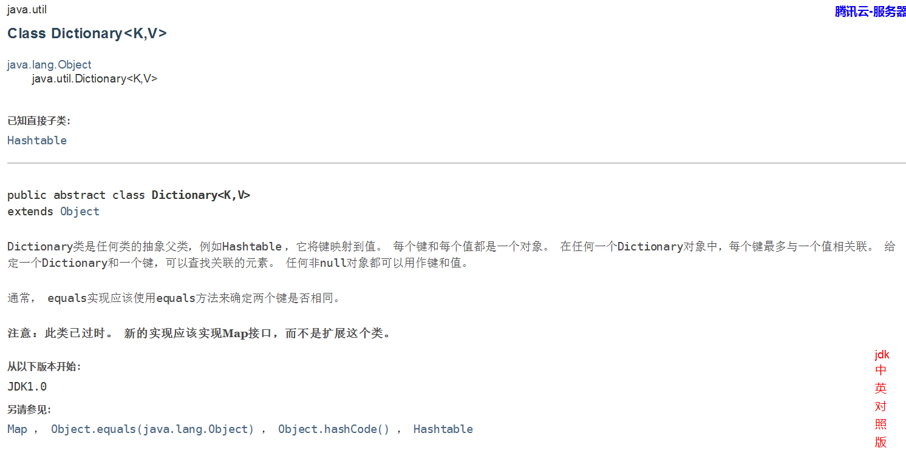

`Dictionary`是一个存储键值对的类型，在这里是一个原始类型，因为实现JSlider类时Java还不存在泛型。不过填充字典时要使用到泛型类型。

```java
Dictionary<Integer, Component> labelTable = new HashTable<>();
labelTable.put(0, new JLabel(new ImageIcon("nine.gif")));
labelTable.put(20, new JLabel(new ImageIcon("ten.gif")));
```

将Dictinary\<Integer, Component>对象传递给setLabelTable时，编译器会发出一个警告：

```java
slider.setLabelTable(labelTable);	//编译器会发出警告
```

因为编译器无法确定setLabelTable方法可能会对Dictionary对象做出什么操作，可能会用字符串替换所有的关键字。这就打破了关键字类型为整型的承诺，未来的操作可能会产生强制类型转换的异常。但我们也可以选择忽略这个警告，因为我们清楚我们的代码。

---

假设由一个遗留的类得到一个原始类型的对象。可以将它赋给一个参数化的类型变量，当然也会得到警告：

```java
Dictionary<Integer, Component> labelTable = slider.getLabelTable();	//编译器会发出警告
```

警告会提示我们确保labelTable包含Integer和Component对象。

在查看了警告之后，可以利用**注解（annotation）**使之消失。注解必须放在生成这个警告的代码所在的方法前面：

```java
@SuppressWarning("unchecked")
Dictionary<Integer, Component> labelTable = slider.getLabelTable();
```

或者标注整个方法：

```java
@SuppressWarning("unchecked")
public void configureSlider(){...}
```

这个注解会关闭对方法中所有代码的检查。注解在以后会详细讲解。


# 8.6 约束性和局限性

在下面几节中，将阐述使用Java泛型时需要考虑的一些限制。大多数限制都是由类型擦除所引起的。

## 8.6.1 不能用基本类型实例化类型参数

==不能用类型参数代替基本类型。==因此，没有`Pair<double>`，只有`Pair<Double>`。当然这样的原因是类型擦除。擦除之后Pair类含有Object类型的域，而Object不能存储double值。

现在只有8种基本类型，当包装器类型（wrapper type）不能接受替换时，可以使用独立的类和方法处理它们。

## 8.6.2 运行时类型查询只适用于原始类型

虚拟机中的对象总有一个特定的非泛型类型。因此，所有的类型查询（instanceof）只产生原始类型。例如：

```java
if(a instanceof Pair<String>)	//error
```

实际上仅仅测试a是否是任意类型的一个Pair，因此会产生一个编译器错误。

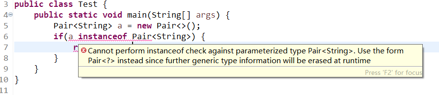

```java
if(a instanceof Pair<T>)		//error
```

上面的语句同样会产生编译器错误

正确的类型查询应该是这样的：

```java
if(a instanceof Pair<?>) {...}	//right
或者
if(a instanceof Pair){...}		//right
```

---

强制类型转换同样需要注意，例如：

```java
Pair<String> p = (Pair<String>) a;	//waring
```

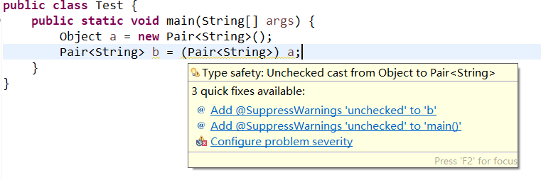

---

`getClass`方法总是返回原始类型。例如：

```java
Pair<String> stringPair = ...;
Pair<Employee> employeePair = ...;
if(stringPair.getClass() == employeePair.getClass())	//它们是相等的，返回true
```

## 8.6.3 不能创建参数化类型的数组

不能实例化参数化类型的的数组，例如：

```java
Pair<String>[] table = new Pair<String>[10];	//error
```

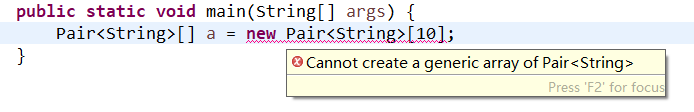

假设可以创建，擦除类型之后，table的类型是Pair[]。可以把它转换为Object[]：

```java
Object[] objarray = table;
```

==数组会记住它的元素类型，如果试图存储其他类型的元素，就会抛出一个`ArrayStoreException`异常==：

```java
objarray[0] = "Hello";	//error
```

不过对于泛型类型，擦除会使这种机制无效，如下：

```java
objarray[0] = new Pair<Employee>();
```

能够通过数组检查，但是仍会导致一个类型错误。出于这个原因，不允许创建参数化类型的数组。

**需要说明的是：**只是不允许创建这些数组，而声明类型为Pair\<String>[]的变量仍是合法的。不过不能用new Pair\<String>[10]初始化这个变量。

> 可以声明通配类型的数组，然后进行类型转换：
>
> ```java
> Pair<String>[] table = (Pair<String>[]) new Pair<?>[10];
> ```
>
> 但是结果仍然是不安全的。如果在table[0]中存储一个Pair\<Employee>，然后对table[0].getFirst调用一个String方法，会得到一个ClassCastException异常。

---

==如果我们需要收集参数化类型对象，只有一种安全且有效的方法：使用`ArrayList:ArrayList<Pair<String>>`。==

## 8.6.4 Varargs警告

上一节介绍了Java不支持泛型类型的数组，假如像参数个数可变的方法传递一个泛型类型的实例：

```java
public static <T> void addAll(Collection<T> coll, T... ts){
    for(T t : ts)
        coll.add(t);
}
```

==实际上ts是一个数组==，包含提供的所有实参。现在考虑调用：

```java
Collection<Pair<String>> table = ...;
Pair<String> pair1 = ...;
Pair<String> pair2 = ...;
addAll(table, pair1, pair2);
```

为了调用这个方法，Java虚拟机会建立一个Pair\<String>类型的数组，这就违反了==不能创建泛型类型数组==的规则。不过对于这种情况，规则有所放松，只会得到一个警告，而不是错误。

---

可以采取两种方式来抑制这个警告：

1. 为包含addAll调用的方法增加注解`@SuppressWarnings("unchecked")`

2. Java7之后还可以用`@SafeVarargs`直接标注addAll方法：

   ```java
   @SafeVarargs
   public static <T> void addAll(Collection<T> coll, T... ts)
   ```

对于只需要读取泛型类型数组元素的所有方法，都可以使用这个注解。

> 可以使用`@SafeVarargs`标注来消除创建泛型数组的有关限制：
>
> ```java
> @SafeVarargs
> static <E> E[] array(E... array){
>     return array;
> }
> ```
>
> 现在就可以调用：
>
> ```java
> Pair<String>[] table = array(pair1, pair2);
> ```
>
> 不过这还是不符合安全的初衷：
>
> ```java
> Object[] objarray = table;
> objarray[0] = new Pair<Employee>()
> ```
>
> 可以顺利运行而不会出现`ArrayStoreException`异常（因为数组存储只会检查擦除之后的类型），但在处理table[0]时会得到异常。

## 8.6.5 不能实例化类型变量

==不能l使用像new T(...), new T[...]或T.class这样的表达式中的类型变量。==例如下面的Pair\<T>构造器就是非法的：

```java
public Pair(){
    first = new T();
    second = new T();
}	//error
```

类型擦除之后T变为Object，而且我们的本意也不是调用new Object()。在Java SE 8之后，最好的解决方法是让调用这提供一个构造器表达式，可参见[6.3.5 构造器引用](./第6章 接口、lambda表达式与内部类.md)：

```java
Pair<String> p = Pair.makePair(String::new);
```

makePair方法接收一个Supplier\<T>，这是一个函数式接口，表示一个无参数而且返回类型为T的函数：

```java
public static <T> Pair<T> makePair(Supplier<T> constr){
    return new Pair<>(constr.get(), constr.get());
}
```

---

比较传统的解决方法是通过反射调用`Class.newInstance`方法来构造泛型对象。必须像下面这样设计API以便得到一个Class对象：

```java
public static <T> Pair<T> makePair(Class<T> cl){
    try{
        return new Pair<>(cl.newInstance(), cl.newInstance());
    }catch(Exception ex){
        return null;
    }
}
```

这个方法可以按照下面的方式调用：

```java
Pair<String> p = Pair.makePair(String.class);
```

**注意：Class类本身是泛型。**例如String.class是Class\<String>的实例（事实上是唯一的实例）。因此makePair方法能够推断出pair的类型。


## 8.6.6 不能构造泛型数组

就像不能构造一个泛型实例一样，也不能实例化泛型数组。不过原因有所不同，毕竟数组会填充null值，构造的时候看上去是安全的。不过数组本身也有类型，用于监控存储在虚拟机中的数组，这个类型会被擦除。例如：

```java
public static <T extends Comparable> T[] minmax(T[] a){
    T[] mm = new T[2];	//error
}
```

类型擦除后会让这个方法永远构造Comparable[2]数组。

如果数组仅仅作为一个类的私有实例域，就可以将这个数组声明为Object[]，并且在获取数组元素的时候进行类型转换。例如，ArrayList类可以这样实现：

```java
public class ArrayList<E>{
    private Object[] elements;
    ...
    @SuppressWarnings("unchecked")
    public E get(int n){
        return (E)elements[n];
    }
    public void set(int n, E e){
        elements[n] = e;
    }
}
```

实际的实现没有这么清晰：

```java
public class ArrayList<E>{
    private Object[] elements;
    ...
    public ArrayList(){
        elements = (E[]) new Object[10];
    }    
}
```

这里强制类型转换E[]是一个假象，而类型擦除使其无法察觉。

由于minmax方法返回T[]数组，使得这一技术无法展现，如果掩盖这个类型会有运行时错误结果：

```java
public static <T> T[] minmax(T... a){
    Object[] mm = new Object[2];
    ...
    return (T[])mm;	//编译时会产生警告
}
```

调用`String[] ss = ArrayAlg.minmax("Tom", "Dick", "Harry")`编译时不会有任何警告。当Object[]引用赋给Comparable[]对象的时候，将会发生ClassCastException异常。

---

在这种情况下，最好让用户提供一个数组构造器表达式：

```java
String[] ss = ArrayAlg.minmax(String[]::new, "Tom", "Dick", "Harry");
```

构造器表达式String[]::new指定一个函数，给定所需要的长度，会构造一个指定长度的String数组。minmax方法会使用这个参数生成一个有正确类型的数组：

```java
public static <T extends Comparable> T[] minmax(IntFunction<T[]> constr, T... a){
    T[] mm = constr.apply(2);
    ...
} 
```

---

比较老式的方法是利用反射，调用`Array.newInstance`:

```java
public static <T extends Comparable> T[] minmax(T... a){
    T[] mm = (T[])Array.newInstance(a.getClass.getComponentType(), 2);
    ...
}
```

`ArrayList`类的toArray方法需要生成一个T[]数组，但没有成分类型，因此有下面两种不同的形式：

```java
Object[] toArray()
T[] toArray(T[] result);
```

第二个方法接收一个数组参数。如果数组足够大，就使用这个数组。否则用result的成分类型构造一个足够大的新数组。

## 8.6.7 泛型类的静态上下文中类型变量无效

==不能在静态域或方法中引用类型变量。==例如：

```java
public class Singleton<T>{
    private static T singleInstance;			//error
    private static T getSingleInstance(){...}	//error
}
```

假如这个程序可以正常运行，那么我们可以声明Singleton\<Random>，也可以声明Singleton\<JFileChooser>。类型擦除之后只剩下Singleton类，它只包含一个Object类型的singleInstance域。因此禁止使用带有类型变量的静态域和方法。

## 8.6.8 不能抛出或捕获泛型类的实例

==既不能抛出也不能捕获泛型类对象。==实际上泛型类扩展Throwable都是不合法的。例如：

```java
public class Problem<T> extends Exception{...}	//error
```

==catch子句中不能使用类型变量。==例如：

```java
public static <T extends Throwable> void doWork(T t){
    try{
        do work
    }catch(T e){	//error
        Logger.global.info(...)
    }
}
```

不过在异常规范中使用类型变量是允许的。例如：

```java
public static <T extends Throwable> void doWork(T t){
    try{
        do work
    }catch(Throwable realCause){
        t.initCause(realCause);
        throw t;
    }
}
```

## 8.6.9 可以消除受查异常的检查

==Java中必须为所有的受查异常（继承Exception而不是RuntimeException）提供一个处理器。==不过可以利用泛型来消除这个限制。关键在于这个方法：

```java
@SuppressWarnings("unchecked")
public static <T extends Throwable> void throwAs(Throwable e) throws T{
    throw (T) e;
}
```

假设这个方法在类Block中，如果调用`Block.<RuntimeException>throwAs(t)`，那么编译器就会认为t是一个非受查异常。以下的代码会把所有异常都转换为编译器认为的非受查异常：

```java
try{
    do work
}catch(Throwable t){
    Block.<RuntimeException>throwAs(t);
}
```

下面把这些代码包装在一个抽象类中：

```java
public abstract class Block{
    public abstract void body() throws Exception;
    
    public Thread toThread(){
        return new Thread(){
            public void run(){
                try{
                    body();
                }catch(Throwable t){
                    Block.<RuntimeException>throwAs(t);
                }
            }
        };
    }
    
    @SuppressWarnings("unchecked")
    public static <T extends Throwable> void throwAs(Throwable t){
        throw (T) t;
    } 
}
```

用户可以覆盖body方法来提供一个具体的动作。调用toThread时会得到Thread类的一个对象，它的run方法不会介意受查异常，例如以下程序运行了一个线程，它会抛出一个受查异常：

```java
public class Test{
    public static void main(String[] args){
        new Block(){
            public void body() throws Exception{
                Scanner in = new Scanner(new File("ququx"), "UTF-8");
                while(in.hasNext)
                    System.out.println(in.next());
            }
        }.toThread().start();
    }
}
```

运行这个程序时，假设没有提供一个名为ququx的文件，那么就会得到一个StackTrace，其中包含一个FileNotFoundException。正常情况下，我们必须捕获线程run方法中的任何受查异常，因为run方法声明为不抛出任何受查异常。但是在这里我们只是抛出了一个非受查异常，让编译器认为这不是一个受查异常。

## 8.6.10 注意擦除后的冲突

假定像下面这样将equals方法添加到Pair类中：

```java
public class Pair<T>{
    ...
    public boolean equals(T value){
        return first.equals(value) && second.equals(value);
    }
}
```

考虑一个Pair\<String>。从概念上它有两个equals方法：

1. boolean equals(String)——在Pair\<T>中定义
2. boolean equals(Object) ——从Object中继承

但是方法擦除后，boolean equals(T)实际上就是boolean equals(Object)，与Object.equals方法发生冲突。这样迫使我们重新命名引发错误的方法。

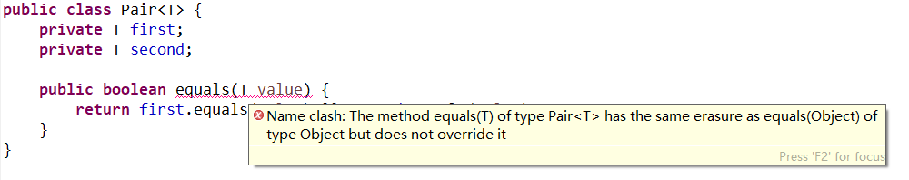

我们可以这样理解：类型擦除是在编译器进行编译时的动作，我们编写Pair.equals(T)的目的绝对不是重写Object.equals(Object)方法（重写的话应该是Pair.equals(Object)），但是类型擦除后确确实实是我们进行重写了。因此为了避免这种误会，直接在编译的时候就不通过。

---

此外泛型规范说明还提到了：==要想支持擦除的转换，就需要强行限制一个类或类型变量不能同时成为同一个接口不同参数化的两个接口类型的子类。==如下：

```java
class Employee implements Comparable<Employee>{...}
class Manager extends Employee implements Comparable<Manager>{...}	//error
```

Manager会实现Comparable\<Employee>和Comparable\<Manager>。这是同一接口的不同参数化。其原因有可能和桥方法有关。实现了Comparable\<X>的类可以获得一个桥方法，对于不同类型的X不能有两个这样的方法：

```java
public int compareTo(Object other){
    return compareTo((X) other);
}
```

但是需要注意非泛型版本是合法的：

```java
class Employee implements Comparable{...}
class Manager extends Employee implements Comparable{...}	//合法
```

>注意桥方法和擦除后冲突的区别：
>
>桥方法是某一个类的方法参数类型已经明确了，但是超类中的对应方法参数类型是T，为了不与多态产生矛盾，此时会生成一个桥方法。
>
>擦除后方法产生冲突是某一个类的方法参数类型不明确，擦除后和超类的对应方法参数类型一致，产生冲突。


# 8.7 泛型类型的继承规则

考虑一个类和一个子类，如Employee和Manager。Pair\<Manager>不是Pair\<Employee>的超类，因此下面的代码并不能编译成功：

```java
Manager[] topHonchos = ...;
Pair<Employee> result = ArrayAlg.minmax(topHonchos);	//error
```

minmax方法返回Pair\<Manager>，而不是Pair\<Employee>，并且这样的赋值是不合法的。

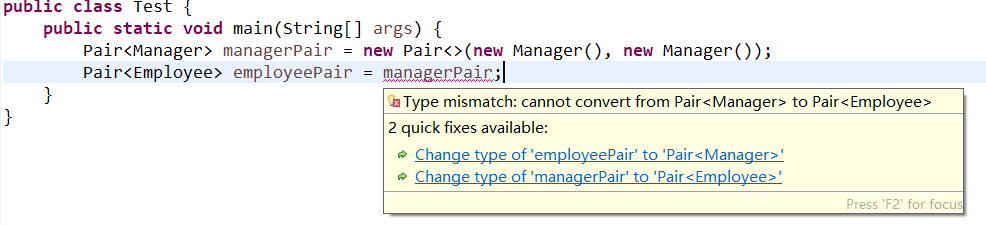

无论S与T之间有什么联系（继承、实现），但是Pair\<S>和pair\<T>之间没有联系。如下图所示：

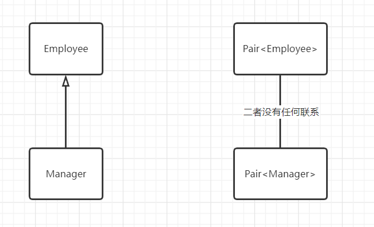

假设我们允许将Pair\<Manager>转换为Pair\<Employee>，如下：

```java
Pair<Manager> managerBuddies = new Pair<>(ceo, cfo);
Pair<Employee> employeeBuddies = managerBuddies;	//error，但是假设合法
employeeBuddies.setFirst(lowlyEmployee);
```

显然最后一句是合法的，但是此时managerBuddies和employeeBuddies引用了同样的对象，将cfo和一名普通员工组成一对，这显然不符合Pair\<Manager>设计的初衷。

> 必须注意泛型与Java数组之间的重要区别。可以将一个Manager[]数组赋给一个类型为Employee[]的变量：
>
> ```java
> Manager[] managerBuddies = {ceo, cfo};
> Employee[] employeeBuddies = managerBuddies;
> ```
>
> 但是数组带有特别的保护。如果试图将一个低级别的雇员存储到employeeBuddies[0]，虚拟机会抛出ArrayStoreException异常。

---

==泛型类可以扩展或实现其他的泛型类。==例如，ArrayList\<T>类实现List\<T>接口。这意味着一个ArrayList\<Manager>类实现List\<Manager>接口。但是一个ArrayList\<Manager>不是ArrayList\<Employee>或List\<Employee>。它们之间的关系如下图所示：

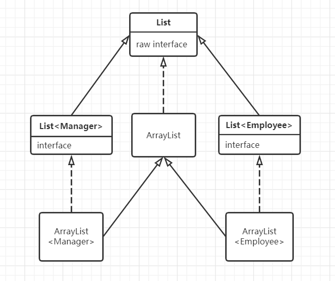


# 8.8 通配符类型

## 8.8.1 通配符概念

通配符类型中，允许类型参数变化。例如通配符类型：`Pair<? extends Employee>`表示任何泛型Pair类型，它的类型参数是Employee的子类，如Pair\<Manager>，但不是Pair\<String>。

假如说我们编写一个打印雇员对的方法，如下：

```java
public static void printBuddies(Pair<Employee> p){
    Employee first = p.getFirst();
    Employee second = p.getSecond();
    System.out.println(first.getName() + "and" + second.getName() + "are buddies.")
}
```

我们不能将Pair\<Manager>传进这个方法。解决的方法是使用通配符类型：

```java
public static void printBuddies(Pair<? extends Employee> p)
```

类型Pair\<Manager>是Pair\<? extends Employee>的子类型。

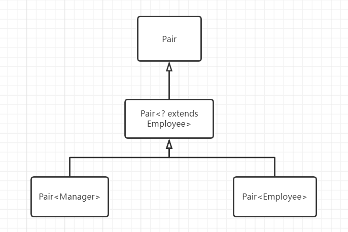

```java
Pair<Manager> managerBuddies = new Pair<>(ceo, cfo);
Pair<? extends Employee> wildcardBuddies = managerBuddies;	//正确
wildcardBuddies.setFirst(lowlyEmployee);	//编译错误
```

为什么get方法正确，set方法会编译错误呢？可以理解为**PESC（Produce-Extends, Consume-Super）**

<iframe height='500' scrolling='yes' title='Fancy Animated SVG Menu' src='https://blog.csdn.net/qq_29951485/article/details/88068338' ></iframe>

## 8.8.2 通配符的超类型限定

通配符限定还可以指定一个**超类型限定（supertype bound）**，如下：

```java
? super Manager
```

这个通配符限制为Manager的所有超类型。带有超类型限定的通配符的行为与子类型限定通配符的行为相反。可以为方法提供参数，但是不能使用返回值。例如，Pair\<? super Manager>有方法

```java
void setFirst(? super Manager)
? super Manager getFirst()
```

编译器无法知道setFirst方法参数的具体类型，但是知道参数类型有下界。根据多态，超类类型指向子类对象，调用这个方法时不能接受类型为Employee或Object的参数，==但是可以传递Manager类型或Manager子类型的对象。==

==带有超类型限定的通配符可以向泛型对象写入，带有子类型限定的通配符可以从泛型对象读出。==

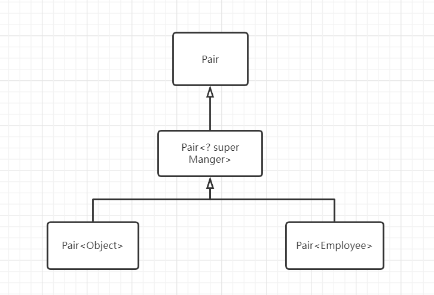

---

下面是超类型限定的另一种应用。Comparable接口本身就是一个泛型类型：

```java
public interface Comparable<T>{
    public int compareTo(T other);
}
```

 假设有一个方法，选取数组中的最小值：

```java
public static <T extends Comparable<T>> T min(T[] a)
```

对于很多类来说工作得更好（因为省去了强制类型转换）。但是处理一个LocalDate对象的数组时就会出现问题：LocalDate实现了ChronoLocalDate，而ChronoLocalDate扩展了Comparable\<ChronoLocalDate>。因此，LocalDate实现的是Comparable\<ChronoLocalDate>，而不是Comparable\<LocalDate>。这就不满足T的要求。

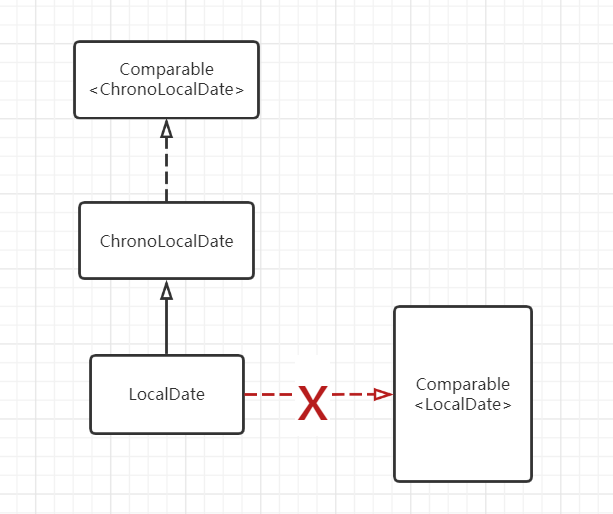

在这种情况下最好使用：

```java
public static <T extends Comparable<? super T>>
```

现在T所实现的Comparable类型参数，既可以为类型T的对象，也可以使用T的超类型。

----

子类型限定的另一个常见的用法是作为一个函数式接口的参数类型。例如：

```java
default boolean removeIf(Predicate<? super E> filter)
```

以上方法会删除所有满足给定谓语条件的元素，假如我们希望传入一个Predicate\<Object>，而不是Predicate\<Employee>，可以使用super通配符。

## 8.8.3 无限定通配符

还可以使用无限定的通配符，例如Pair\<?>。类型Pair\<?>有以下方法：

```java
? getFirst()
void setFirst(?)
```

==getFirst的返回值只能赋给一个Object，setFirst方法不能被调用，除了setFirst(null)。==

Pair\<?>和原始Pair本质的不同在于：可以用任意Object对象调用原始Pair类的setFirst方法。

为什么要引入Pair<?>呢？它对于许多简单的操作非常有用，如测试一个Pair是否包含一个null引用，它不需要实际的类型：

```java
public static boolean hasNulls(Pair<?> p){
    return p.getFirst() == null || p.getSecond() == null;
}
```

通过hasNulls转换成泛型方法，可以避免使用通配符类型：

```java
public static <T> boolean hasNulls(Pair<T> p)
```

## 8.8.4 通配符捕获

编写一个交换成对元素的方法：

```java
public static void swap(Pair<?> p)
```

通配符不是类型变量，因此不能在编写代码时使用？作为一种类型。但是在交换的时候必须临时保存一个元素，我们可以编写一个解决方法，如下：

```java
public static <T> void swapHelper(Pair<T> p){
    T t = p.getFirst();
    p.setFirst(p.getSecond());
    p.setSecond(t);
}

public static void swap(Pair<?> p){
    swapHelper(p);
}
```

在这种情况下swapHelper方法的参数T捕获通配符。它不知道是那种类型的通配符，但是这是一种明确的类型。在这种情况下，并不是一定要使用通配符，我们已经实现了没有通配符的泛型方法\<T> void swap(Pair\<T> p)。

通配符捕获只有在有许多限制的情况下才是合法的。编译器必须能够确信通配符表达的是单个、确定的类型。例如ArrayList<Pair\<T>>中的T永远不能捕获ArrayList\<Pair\<?>>中的通配符。数组列表可以保存两个Pair<?>，分别针对?的不同类型。


# 8.9 反射和泛型

反射允许在运行的时候分析任意的对象。如果对象是泛型类的实例，关于泛型类型参数得不到太多的信息，因为类型参数会被擦除。

## 8.9.1 泛型Class类

现在Class类是泛型的。例如String.class实际上是Class\<String>类的一个对象。事实上也是唯一的对象。

类型参数十分有用，这是因为它允许Class\<T>方法的返回类型更加具有针对性，如下：

```java
T newInstance()
T cast(Object obj)
T[] getEnumConstants()
Constructor<T> getConstructor(Class... parameterTypes)
Constructor<T> getDeclaredConstructor(Class... parameterTypes)
```

newInstance方法返回一个实例，这个实例所属的类由默认的构造器获得。它的返回类型被声明为T，其类型与Class\<T>描述的类相同，这样就免除了类型转换。

如果给定的类型确实是T的一个子类型，cast方法就会返回一个现在声明为类型T的对象，否则抛出一个BadCastException异常。

如果这个类不是enums类或类型T的枚举值的数组，getEnumConstants方法将返回null。

最后getConstrutor与getDeclaredConstrutor方法返回一个Constructor\<T>对象。Constructor类也已经变成泛型，以便newInstance方法有一个正确的返回类型。

> java.lang.Class<T> 1.0

- T newInstance()

  返回无参数构造器构造的一个新实例

- T cast(Object obj)

  如果obj为null或有可能转换成类型T，则返回obj；否则抛出BadCastException异常。

- T[] getEnumConstants() 5.0

  如果T为枚举类型，则返回所有值组成的数组，否则返回null。

- Class<? super T> getSuperClass()

  返回这个类的超类。如果T不是一个类或Object类，则返回null。

- Constructor\<T> getConstructor(Class... parameterTypes) 1.1

- Constructor\<T> getDeclaredConstruct(Class... parameterTypes) 1.1

  获得公有的构造器，或带有给定参数类型的构造器。

> java.lang.reflect.Constructor\<T> 1.1

- T newInstance(Object... parameters)

  返回用指定参数构造的新实例。


## 8.8.2 使用Class\<T>参数进行类型匹配

匹配泛型方法中的Class\<T>参数的类型变量很有实用价值，如下：

```java
public static <T> Pair<T> makePair(Class<T> c) throws InstantiationException,IllegalAccessException{
	return new Pair<>(c.newInstance(), c.newInstance());
}
```

如果调用makePair(Employee.class)，makePair方法的类型参数T同Employee匹配，并且编译器可以推断出这个方法将返回一个Pair\<Employee>。

## 8.9.3 虚拟机中的泛型类型信息

Java泛型的卓越特性之一是在虚拟机中泛型类型的擦除。但是擦除的类仍然保留一些泛型祖先的微弱记忆。例如，原始的Pair类知道源于泛型类Pair\<T>，即使一个Pair类型的对象无法区分是由Pair\<String>构造还是Pair\<Employee>构造的。

看一下方法：

```java
public static Comparable min(Comparable[] a)
```

这是一个泛型方法的擦除：

```java
public static <T extends Comparable<? super T>> T min(T[] a)
```

可以使用反射API来确定：

- 这个泛型方法有一个叫做T的类型参数
- 这个类型参数有一个子类型限定，其自身又是一个泛型类型
- 这个限定类型有一个通配符参数
- 这个通配符参数有一个超类型限定
- 这个泛型方法有一个泛型数组参数

为了表达泛型类型声明，使用java.lang.reflect包中提供的接口Type。这个接口包含下列子类型：

- Class类，描述具体对象
- TypeVariable接口，描述类型变量（如T extends Comparable<? super T>）
- WildcardType接口，描述通配符（如? super T）
- ParameterizedType接口，描述泛型类或接口类型（如Comparable\<? super T>）
- GenericArrayType接口，描述泛型数组（如T[]）

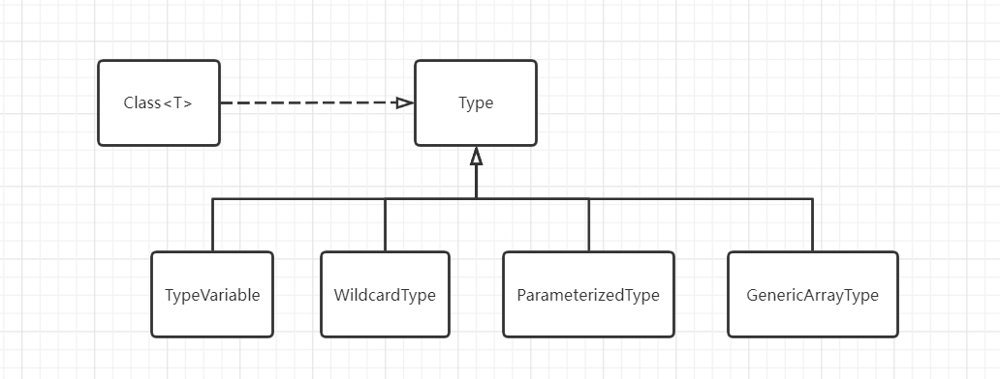

> java.lang.Class\<T> 1.0  

- TypeVariable[] getTypeParameters() 5.0

  如果这个类型被声明为泛型类型，则获得泛型类型变量，否则获得一个长度为0的数组。

- Type getGenericSuperclass() 5.0

  获得被声明为这一类型的超类的泛型类型；如果这个类型是Object或不是一个类类型，则返回null。

- Type[] getGenericInterfaces() 5.0

  获得被声明为这个类型的接口的泛型数组（以声明的顺序），否则如果这个类型没有实现接口，返回长度为0的数组。

> java.lang.reflect.Method 1.1

- TypeVariable[] getTypeParameters() 5.0

  如果这个方法被声明为泛型方法，则获得泛型类型变量，否则返回长度为0的数组。

- Type getGenericReturnType() 5.0

  获得这个方法被声明的泛型返回类型。

- Type[] getGenericParameterTypes() 5.0

  获得这个方法被声明的泛型参数类型。如果这个方法没有参数，返回长度为0的数组。

> java.lang.reflect.TypeVariable 5.0

- String getName()

  获得类型变量的名字。

- Type[] getBounds()

  获得类型变量的子类限定，否则，如果该变量无限定，则返回长度为0的数组。

> java.lang.reflect.WildcardType 5.0

- Type[] getUpperBounds()

  获得这个类型变量的子类（extends）限定，否则，如果没有子类限定，则返回长度为0的数组。

- Type[] getLowerBounds()

  获得这个类型变量的超类（super）限定，否则，如果没有超类限定，则返回长度为0的数组。

> java.lang.reflect.ParameterizedType 5.0

- Type getRawType()

  获得这个参数化类型的原始类型。

- Type[] getActualTypeArguments()

  获得这个参数化类型声明时所使用的类型参数。

- Type getOwnerType()

  如果是内部类型，则返回其外部类型，如果是一个顶级类型，则返回null。

> java.lang.reflect.GenericArrayType 5.0

- Type getGenericComponentType()

  获得声明该数组类型的泛型组件类型。 
