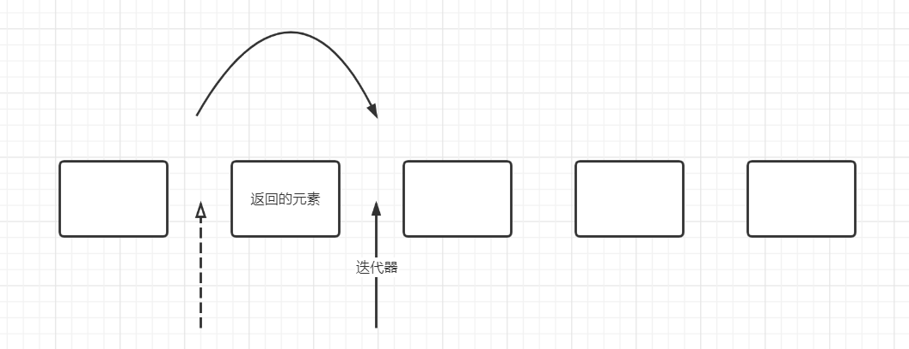

# 第9章 集合

本章将讲述如何利用Java类库帮助我们在程序设计中实现传统的数据结构。


# 9.1 Java集合框架

## 9.1.1 将集合的接口与实现分离

Java集合类库将**接口（interface）**与**实现（implementation）**分离。首先看一下队列（queue）是如何分离的。

队列接口指出可以在队列的尾部添加元素，在队列的头部删除元素，并且可以查找队列中元素的个数。当需要收集对象，并按照“先进先出”的规则检索对象时就应该使用队列。

下面为队列接口的最简形式：

```java
public interface Queue<E>{
    void add(E element);
    E remove();
    int size();
}
```

这个接口并没有说明队列是如何实现的。队列通常有两种形式：一种是使用循环数组，另一种是使用链表。


每一个实现都可以通过一个实现了Queue接口的类表示。

```java
public class CircularArrayQueue<E> implements Queue<E>{	//这并不是一个真正的库类，只是为了说明
	private int head;
    private int tail;
    
    CircularArrayQueue(int capacity){...}
    public void add(E element){...}
    public E remove(){...}
    public int size(){...}
    private E[] elements;
}    
```

```java
public class LinkedListQueue<E> implements Queue<E>{ //这并不是一个真正的库类，只是为了说明
    private Link Head;
    private Link tail;
    
    LinkedListQueue(){...}
    public void add(E element){...}
    public E remove(){...}
    public int size(){...}
}
```

> 实际上Java类库中并没有CircularArrayQueue和LinkedListQueue。如果需要一个循环队列，可以使用ArrayDeque（double-ended queue，双端队列）；如果需要一个链表队列，就可以直接使用LinkedList类。

当在程序中使用队列时，一旦构建了集合就无需知道究竟使用了哪种实现。因此只有在构建集合对象的时候，使用具体的类才有意义。==可以使用接口类型存放集合的引用：==

```java
Queue<Customer> expressLane = new CircularArray<>(100);
expressLane.add(new Customer("Harry"));
```

假如说我们觉得LinkedListQueue是个更好的选择，就可以将引用指向新创建的LinkedListQueue对象。

接口本身并不能说明哪种实现的效率究竟如何。循环数组要比链表更加高效，因此很多人会选择循环数组，但是循环数组也有自身的缺点（扩容困难）。

----

Java标准类库中也有另外一组以**Abstract**开头的类，例如`AbstractQueue`。这些类是为类库实现者而设计的。如果想要实现自己的队列类，会发现扩展`Abstract`类要比实现`Queue`接口所有方法轻松得多。

## 9.1.2 Collection接口

在Java类库中，集合类的基本接口是`Collection`接口：

```java
public interface<E> Collection{
    boolean add(E element);
    Iterator<E> iterator();
	……
}
```

add方法用于向集合中添加元素，如果添加元素确实改变了集合就返回true，如果集合没有发生变化就返回false。

iterator方法用于返回一个实现了`Iterator`接口的对象，可以使用这个迭代器一次访问集合中的元素。

## 9.1.3 迭代器

`Iterator`接口包含4个方法：

```java
public interface Interator<E>{
    E next();
    boolean hasNext();
    void remove();
    default void forEachRemaining(Consumer<? super E> action);
}
```

通过反复调用next方法，可以逐个访问集合中的每个元素。但是如果到达了集合的末尾，next方法将抛出一个`NoSuchElementException`。

因此需要在调用next之前调用hasNext方法。如果迭代器对象还有多个供访问的元素，这个方法就返回true。

如果想要查看集合中的所有元素，就请求一个迭代器，并在hasNext返回true时反复地调用next方法。

```java
Collection<String> c = ...;
Iterator<String> iter = c.iterator();
while(iter.hasNext()){
    String element = iter.next();
    ...
}
```

用foreach循环可以更加简练地表示同样的循环操作：

```java
for(String element : c){
    ...
}
```

编译器简单地将foreach循环翻译为带有迭代器的循环。因此foreach循环可以与任何实现了`Iterable`接口的对象一起工作，这个接口只包含了一个抽象方法：

```java
public interface Iterable<E>{
    Iterator<E> iterator();
    ...
}
```

`Collection`接口扩展了`Iterable`接口。因此对于标准类库中的任何集合都可以使用foreach循环。

---

在Java SE 8中甚至不用写循环。可以调用`forEachRemaining`方法并提供一个lambda表达式（它会处理一个元素）。将对迭代器的所属Collection中每一个**剩余的**元素都调用这个lambda表达式，直至没有元素为止：

```java
iterator.forEachRemaining(element -> ...);
```

元素被访问的顺序取决于集合类型。如果对ArrayList进行迭代，迭代器将从索引0开始，每迭代一次，索引值加1。但是如果访问HashSet中的元素，每个元素将会按照某种随机的次序出现。

> Java集合类库中的迭代器与其他类库的迭代器有着重要的区别。
>
> 在传统的集合类库（例如C++的标准模板库），迭代器是根据数组索引建模的。如果给定这样一个迭代器，就可以查看指定位置上的元素，就像知道数组索引i就可以查看数组元素a[i]一样。不需要查找元素，就可以将迭代器向前移动一个位置。这与不需要执行查找操作就可以通过i++将数组索引向前移动一样。
>
> 但是Java迭代器查找操作与变更操作是紧密相连的。查找一个元素的唯一方式就是调用next，而在执行查找操作的同时迭代器的位置随之移动。
>
> 因此，==应该将Java迭代器认为是位于两个元素之间。==当调用next时，迭代器就越过下一个元素，并返回刚刚越过的那个元素的引用。



Iterator接口的remove方法将会删除上次调用next方法时返回的元素。在大多数情况下，在决定删除某个元素之前应该先看一下这个元素。然而，如果想要删除指定位置上的元素，仍然需要越过这个元素。例如，下面是如何删除字符串集合中第一个元素的方法：

```java
Iterator<String> it = c.iterator();
it.next();	//跳过第一个元素
it.remove();//删除第一个元素
```

对next方法和remove方法的调用具有相互依赖性。如果在调用remove之前没有调用next将是不合法的。如果这样做将会抛出一个`IllegalStateException`异常。

如果想要删除两个相邻的元素，应该先调用next方法越过将要删除的元素：

```java
it.remove();
it.next();
it.remove();
```

## 9.1.4 泛型实用方法

由于Collection与Iterator都是泛型接口，可以编写操作任何集合类型的实用方法。例如下面是一个检测任意集合是否包含指定元素的泛型方法：

```java
public static <E> boolean contains(Collection<E> c, Object obj){
    for(E element : c){
        if(element.equals(obj)){
            return true;
        }
    }
    return false;
}
```

这些实用方法中的某些方法非常有用，所以Java类库的设计者提供了很多这些方法。事实上Collection接口声明了很多这样有用的方法，所有的实现了都必须提供这些方法，例如：

- int size()
- boolean isEmpty()
- boolean contains(Object obj)
- boolean containsAll(Collection<?> c)
- boolean equals(Object other)
- boolean addAll(Collection<? extends E> from)
- boolean remove(Object obj)
- boolean removeAll(Collection<?> c)
- void clear()
- boolean retainAll(Collection<?> c)
- Object[] toArray()
- \<T> T[] toArray(T[] arraytoFill)

当然如果实现Collection接口的每一个类都要提供这么多的方法将是很烦人的事情，因此为了实现者更容易地实现这个接口，Java类库提供了一个类`AbstrctCollection`，他将基础方法size和iterator抽象化了，但是提供了其他的例行方法。

```java
public abstract class AbstractCollection<E> implements Collection<E>{
    ...
    public abstract Iterator<E> iterator();
    public boolean contains(Object obj){
        for(E element : c){
            if(element.equals(obj)){
                return true;
            }
    	}
    	return false;
    }
    ...
}
```

一个具体的集合类就可以扩展`AbstractCollection`类了，现在要由这个具体的集合类提供iterator方法，而contains方法已由`AbstractCollection`超类提供。当然如果子类想要覆盖contain方法也是可以的。

假如由Collection接口提供默认（default）方法岂不是更好？只不过default是在Java SE 8中才提出，因此Collection中的默认方法基本都与流的处理有关。

另外还有一个很有用的方法：

```java
default boolean removeIf(Predicate<? super E> filter)
```

这个方法用于删除某个满足条件的元素。

> java.util.Collection\<E> 1.2 

- Iterator\<E> iterator()
- int size()
- boolean isEmpty()
- boolean contains(Object obj)
- boolean containsAll(Collection<?> other)
-  
