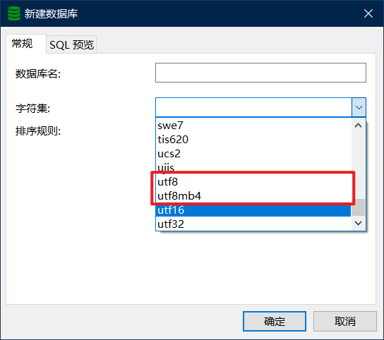
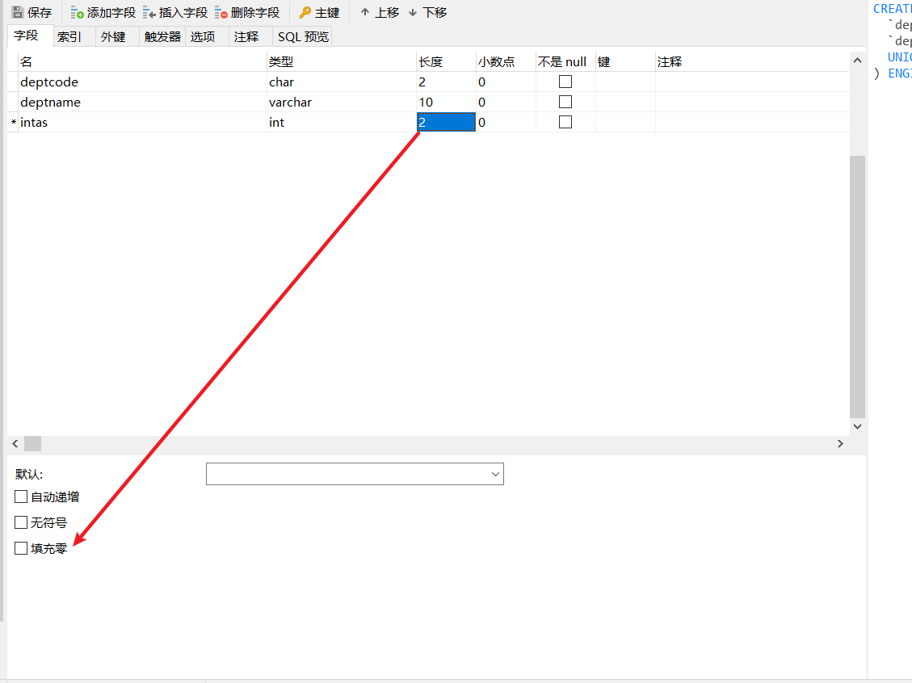

# 数据库语句操作

数据库名、表名、列名不区分大小写，如果要区分单词，单词之间加上下划线。

```sql
show create database 数据库名; # 查看数据库建库语句
```

## utf8mb3和utf8mb4

utf8mb3就是通常说的utf8，utf8mb4是utf8的拓展，可以使用4个字节存储emoji表情，所以建库时一般使用utf8mb4。



## 修改数据库字符集

```sql
alter database 数据库名 character set utf8mb4;
```

# 表操作

## 数据类型

### 整数

| **MySQL的整数类型** | **占用字节** |              **有符号**              | **无符号**             | **说明**   |
| :------------------ | ------------ | :----------------------------------: | ---------------------- | ---------- |
| TINYINT(M)          | 1            |             -128  ~  127             | 0  ~  255              | 很小的整数 |
| INT/INTEGER(M)      | 4            | -2<sup>31</sup>  ~  2<sup>31</sup>-1 | 0  ~  2<sup>32</sup>-1 | 普通整数   |
| BIGINT(M)           | 8            | -2<sup>63</sup>  ~  2<sup>63</sup>-1 | 0  ~  2<sup>64</sup>-1 | 大整数     |

可以在添加字段时指定长度，但是只是与填充0或者填充空格（默认）有关，**与数据可以存储的长度没有关系。**



### 浮点数

| **MySQL的浮点数** | **占用字节** | **说明** |
| ----------------- | ------------ | -------- |
| FLOAT(M, D)       | 4            | 单精度   |
| DOUBLE(M, D)      | 8            | 双精度   |

* M: 精度, 表示总数据位数。 取值范围为(1～255)。
* D: 标度, 表示小数位的位数。 取值范围为(1～30，且不能大于 M-2)。
* FLOAT 和 DOUBLE 在不指定精度时，默认会按照实际的精度(由计算机硬件和操作系统决定)。

设置精度和标度后，如果小数位数超过标度，会发生截断。

### 日期

| **MySQL日期**                           | **字节** | **日期格式**        | **表示范围**                              |
| --------------------------------------- | -------- | ------------------- | ----------------------------------------- |
| YEAR                                    | 1        | YYYY                | 1901 ~ 2155                               |
| TIME                                    | 3        | HH:MM:SS            | -838:59:59 ~ 838:59:59                    |
| DATE                                    | 3        | YYYY-MM-DD          | 1000-01-01 ~ 9999-12-31                   |
| <span style="color:red">DATETIME</span> | 8        | YYYY-MM-DD HH:MM:SS | 1000-01-01 00:00:00 ~ 9999-12-31 23:59:59 |
| TIMESTAMP                               | 4        | YYYY-MM-DD HH:MM:SS | 1970-01-01 00:00:01 ~ 2038-01-19 03:14:07 |

### 字符串

| MySQL字符串 | 内存占用                           | 说明             |
| ----------- | ---------------------------------- | ---------------- |
| CHAR(M)     | M * 单个字符占用字节（与编码有关） | 固定长度字符串   |
| VARCHAR(M)  | L+1  或者  L+2 字节 。             | 变长字符串       |
| TEXT(M)     | L+2字节 。  L: 0~2<sup>16</sup>    | 变长文本字符串   |
| LONGTEXT(M) | L+4字节 。  L: 0~2<sup>32</sup>    | 变长大文本字符串 |

char类型中存储多少字符与占用的字节数没有关系。默认M为1，最大为255。

变长字符串中需要存储描述数据的信息，VARCHAR最多可存储65535个字节，超过255就需要2个字节存储描述数据的信息。VARCHAR一般用于存储姓名。

TEXT最多可以存储65535字符。一般存储评论信息。

 ## 建表语句

```SQL
CREATE TABLE  employee1  (
	id int(11) NOT NULL AUTO_INCREMENT COMMENT 'id',
	name varchar(255) CHARACTER SET utf8mb4 COLLATE utf8mb4_general_ci NOT NULL DEFAULT '' COMMENT '姓名',
	gender varchar(255) CHARACTER SET utf8mb4 COLLATE utf8mb4_general_ci NOT NULL DEFAULT '男' COMMENT '性别',
	graduate_year year NULL DEFAULT NULL COMMENT '毕业时间',
	birthday date NOT NULL COMMENT '生日',
	job varchar(255) CHARACTER SET utf8 COLLATE utf8_bin NULL DEFAULT NULL COMMENT '职位名称',
	salary double(10, 2) NULL DEFAULT 0.00 COMMENT '薪资',
	create_time datetime NULL DEFAULT NULL COMMENT '信息创建时间',
	PRIMARY KEY (id)
) ;
```

## 查看表结构

```sql
SHOW TABLES;			 # 查看该数据库中所有表
SHOW CREATE TABLE <表名>;	# 查看表的创建语句
DESCRIBE <表名>;			# 查看表结构
DESC <表名>;				# 查看表结构
```

## 插入数据

```sql
INSERT INTO <表名> [ (<列名1>, … <列名n> )]  VALUES (值1, … 值n), … (值1, … 值n);
INSERT INTO <表名> SET <列名1>=<值1>, … <列名n>=<值n>;

eg:
insert into employee1 (id, name, gender, graduate_year, birthday, job, salary, create_time) values(1, 'zs', '男', 2022, '1999-01-01', '程序员',  100.2, '2022-09-09 16:51:49');

insert into employee1 (id, name, gender, graduate_year, birthday, job, salary, create_time) values(1, 'zs', '男', 2022, '1999-01-01', '程序员',  100.2, '2022-09-09 16:51:49'),(2, 'ls', '男', 2020, '1997-01-01', '程序员',  10000.2, '2022-09-09 16:51:50');

insert into employee1  set id=4, name='ls', gender='男', graduate_year=2022, birthday='1999-01-01', job='程序员', salary=220.05,  create_time='2022-09-09 16:55:49';
```

如果没有指定自增字段的值，自增字段会在之前最后一条数据（包括已删除）的字段基础上加1。

## 查询语句

```sql
SELECT  *  FROM <表名字>  [ WHERE  <条件> ];
SELECT  <列名1>, …<列名n>  FROM <表名字>  [ WHERE  <条件> ];

eg:
select * from employee1;
select * from employee1 where id<20;
select name from employee1 where id>1;
select name, job, salary from employee1 where salary> 200;
```

## 更新语句

```sql
UPDATE <表名> SET 列1=值1 [, 列2=值2 … ] [WHERE <条件> ]

eg:
update employee1 set job='老程序员'where salary >10000;
```

## 删除语句

```sql
DELETE FROM <表名> [WHERE <条件>]

ag:
delete from employee;
delete from employee where id=4;
```

## 逻辑运算符

| 运算符      | 作用       | 运算符      | 作用                      |
| ----------- | ---------- | ----------- | ------------------------- |
| =           | 等于       | <=>         | 等于(可比较null)          |
| !=          | 不等于     | <>          | 不等于                    |
| <           | 小于       | >           | 大于                      |
| <=          | 小于等于   | >=          | 大于等于                  |
| is null     | 是否为null | is not null | 是否不为null              |
| between and | 在闭区间内 | in          | 是否在列表内              |
| not in      | 不在列表内 | like        | 通配符匹配(%:通配, _占位) |
| and         | 与         | &&          | 与                        |
| or          | 或         | \|\|        | 或                        |

**注意：=不能比较null**

## 关键字

### distinct

多列去重时，两列都相同认为是相同的。**当对一个或多个字段去重时，DISTINCT 要写在所有字段的最前面**，对所有字段去重。

### limit

```sql
SELECT <查询内容|列等> FROM  <表名字> LIMIT 记录数目
SELECT <查询内容|列等> FROM  <表名字> LIMIT 初始位置，记录数目;
SELECT <查询内容|列等> FROM  <表名字> LIMIT 记录数目 OFFSET 初始位置;

eg:
-- 限制数目 为number个
select * from tableName where condition limit number;

-- 偏移量为offsetNumber 从0开始
select * from tableName where condition limit offsetNumber, number;

-- 偏移量offsetNumber
select * from tableName where condition limit number offset offsetNumber;
```

LIMIT 记录数目: 从第一条开始, 限定记录数目

LIMIT 初始位置，记录数目: 从起始位置开始, 限定记录数目

LIMIT 记录数目 OFFSET 初始位置: 从起始位置开始, 限定记录数目

注意: 数据(默认下标从0开始)

### order by

```sql
SELECT <查询内容|列等> FROM  <表名字> ORDER BY <字段名> [ASC|DESC];

eg:
-- 按学生语文成绩升序排列
-- 按学生语文成绩降序排列
-- 按学生语文成绩和英语成绩升序排列
-- 按学生语文成绩和英语成绩和数学成绩降序排列


select * from students order by chinese;
select * from students order by chinese asc;
select * from students order by chinese desc;
select * from students order by chinese, english;
select * from students order by chinese desc, english desc, math desc;
```

注意:  如上查询, 当我们进行多字段排序的时候, 会先满足第一个列的排序要求, 如果第一列一致的话, 再按照第二列进行排序, 以此类推。

### group by

使用group by后，select的字段只能是group by后的字段和聚合函数。

`GROUP_CONCAT()`：会把每个分组的字段值都显示出来，如`select class, group_concat(name) from student group by class`可以用于查询班级的所有同学名称。

`AVG()`：获取字段的平均值，如`select class, avg(chinese) from student group by class`可以计算每一个班级的语文平均分。`select class, avg(chinese + english + math) from student group by class`可以计算班级的总分平均值。

> **having和where的区别**
>
> where用于对原始表进行过滤，having用于对分组后的结果进行过滤

`count()`：对字段进行计数。`COUNT(*)`  表示表中总行数；`COUNT(列)`计算除了列值为NULL以外的总行数。

## SQL执行顺序及书写顺序

```sql
(5) SELECT column_name, ... 
(1) FROM table_name, ... 
(2) [WHERE ...] 
(3) [GROUP BY ...] 
(4) [HAVING ...] 
(6) [ORDER BY ...];
(7)	[Limit ...]
```

可以先排序，然后limit，就可以获取最值所在行的全部信息。

# 数据完整性

数据完整性包括实体完整性，域完整性，参照完整性。

实体可以理解为对象，一行对应一个实体（一个对象）。实体完整性表示每一行数据都是表中唯一的实体，可以用主键实现。

域完整性表示字段的取值在有效范围内并且符合特定的数据类型约束。比如not null来实现字段不能设置为null。

参照完整性表示确保相关联的表的数据相一致。可以用外键和主键来实现参照完整性。

## 外键

```sql                    
alter table `students` 

add constraint `班级` foreign key (`class_id`) references `class` (`id`);
-- CONSTRAINT 外键名 FOREIGN KEY(要作为外键字段名) REFERENCES 主表名(主表中关联的字段);
-- ALTER TABLE <表名> DROP FOREIGN KEY <外键约束名>;删除外键
```

因为影响增加、删除、修改的性能，大部分公司禁止使用外键。

# 多表设计

## 一对一

一张表，两个表的数据存在一对一的关系，则这两张表可以合并成一张表。

## 一对多

两张表，多的表加外键。

## 多对多

三张表，第三张作为关系表，关系表加两个外键。

# 数据库设计范式

数据库范式是数据库的设计规则，旨在减少数据冗余，减少依赖，增加数据完整性。

## 第一范式：原子性

原子性指的是表中的每一列都是原子属性，不可再分。比如联系方式包括电话和邮箱，就可以拆分成两个字段：电话和邮箱。

## 第二范式：唯一性

数据的唯一性，要求表中每行数据有唯一标识，不存在部分依赖。可以通过主键满足。

## 第三范式：不冗余

字段不要冗余。

# 多表查询

## 交叉连接

求多个表的笛卡尔积。

笛卡尔积在SQL中的关键字是`cross join`，也可以省略该关键字，两张表通过`,`连接。

## 内连接

`inner join`：`inner`可以省略，on子句指定了匹配条件。一般数据量小的为主表，数据量大的为副表。

 内连接看似和笛卡尔积一样，在MySQL底层不同。内连接是求两张表的交集，交叉连接是求全集后再筛选。所以内连接比交叉连接效率高。

## 外连接

`left outer join` 和`right outer join`：其中`outer`可以省略，左外连接返回左表中的所有行和右表中与坐标匹配的行，右表中如果没有匹配的行，会填充为null，右外连接同理。

`A left join B`可以理解为A是主表，`A right join B`可以理解为B是主表，主表的所有行无论匹不匹配都会返回，不匹配的话字段会赋值为null。

## 联合查询

`union`：写在两条查询语句之间，联合查询返回两条语句（必须返回字段相同）的并集，并且去除重复的行。

# 数据库备份和恢复

## 命令行操作

```cmd
# 数据库备份 cmd命令
mysqldump -u *** -p *** 数据库名称>文件名.sql

# 数据库恢复，先创建数据库并选择该数据库
source 文件名.sql
```

