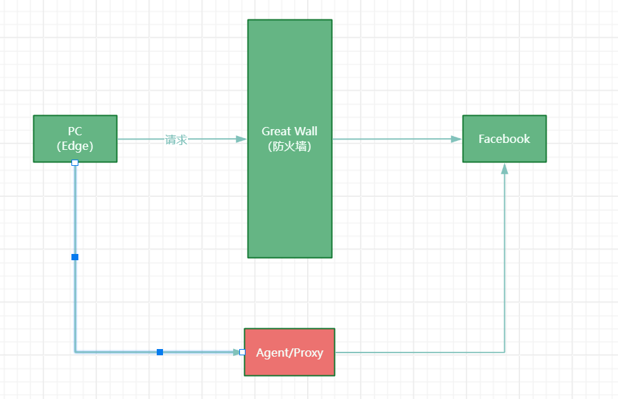
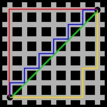

# 基准代码

`img`项目图片

`map`地图，可以编辑和修改

`src`项目源码

- `agent`代理（中介），替代别人做了别人本来应该做的事情

- `config	`加载配置文件的信息
- `draw`画图的代码
- `model`模型
  - `coordinate`横纵坐标
  - `Ghost`幽灵
    - `coordinate`坐标，记录幽灵的位置
    - `routerPlan`==行进计划，用来指导幽灵如何前进==
    - `agent`代理，来获得行进计划，和配置文件中的值有关系
  - `Node`
- `Pacman`吃豆人，获得一个pacman的对象就可以获得一系列的信息
  - `coordinate`坐标，记录当前pacman的坐标
  - `routerPlan`==行进计划，用于指导pacman如何前进==
  - `agent`代理，用于获得行进计划的代理
  - `routerPaint`路径，后面研究路径规划提供的变量，为了路径可视化提供的成员变量
  - `pacmanTraversedNodes`后面研究可行路线时的变量
  - `position`pacman的运动方向

`start`游戏开始的控制器

- `GameStartUp`main方法是游戏开始的入口

`status`游戏状态的一些值

- `Runstatus`记录移动还是移动
- `GameStatus`==整个画板中的全部信息==，想要获得游戏中的任何信息，都是可以通过GameStatus来获得的
  - 幽灵信息
  - pacman信息
  - 食物
  - 墙
  - `xNum,yNum`当前地图横纵坐标的最大值
  - `gameMap: Character[][]`地图信息的二维数组，加载地图信息将其变为二维数组
  - `walls: boolean[][]`可以提供一组横纵坐标，根据这个横纵坐标，判断当前位置是否是墙，如果pacman接下来的坐标是墙，pacman会挂掉。pacman如果不想撞墙，规划路径的时候要躲着墙走。
  - `food: boolean[][]`记录x，y处是否是食物，如果pacman的坐标和食物的坐标重合，食物就被pacman吃掉
  - `totalFoods: int`当前还有几个食物，如果食物被吃掉，totalFoods--；如果totalFoods的值为0，则意味着pacman游戏结束。
  - `Ghost`
  - `Pacman`

`Util`工具类

# 配置文件

`gameMap`地图文件

`pacmanAgent`pacman要获得的行进计划是由哪个类提供的

`GhostAgent`ghost要获得的行进计划是由哪个类提供的

`timedRedraw`游戏界面多长时间重绘一次，相当于刷新率

`ratio`控制一行或者一列的像素值

`foodRatio`食物像素值大小

# 代理Agent

Pacman的Agent提供Pacman的行进计划，Ghost的Agent提供Ghost的行进计划。

pacman的代理`PacmanStop`实现了Agent接口，实现了其中的`getPlan`方法，这个方法用来提供行进计划所用的队列。pacman会不断从队列中出队一个Position用于移动，一旦队列为空，就又会调用getPlan获取新的行进计划。

## PacmanManual

## PacmanDFS

## PacmanBFS

# 盲目式搜索

BFS和DFS都是盲目式搜索，也叫无信息搜索/非启发式搜索

# 启发式搜索

以目标为启发信息，规划一条路径。基于直观或经验构造算法，在可以接受的范围内，给出待解决问题的一个可行解。

## 启发函数

启发函数：
$$
f(x) = g(x) + h(x)
$$
，用来计算消耗。

`f(x)`整体的花费

`g(x)`初始位置到当前位置的花费（沉没成本）

`h(x)`当前位置到目标位置的未来的预估的花费（未来成本）

## a*/a-star算法

属于贪心算法，是启发算法的一个分类。每次做出局部最优解，大的问题拆分为若干小的问题，每个阶段的决策也不会影响后续阶段做出的决策。

> [!NOTE]
>
> 背包问题： 放进去的东西不能拿出来。

在本项目中，有两种比较简单的方式可以用来评估预估花费。分别是曼哈顿距离(`Manhattan Distance`)和欧几里得距离(欧氏距离)(`Euclidean Distance`)

图中红线代表的是曼哈顿距离，绿线代表的是欧几里得距离。对应的数学公式(二维空间)如下：

曼哈顿距离：
$$
d(i,j) = |X_1 - X_2| + |Y_1 - Y_2|
$$
欧几里得距离：
$$
d(i,j) = \sqrt{(X_2 - X_1)^2 + (Y_2 - Y_1)^2}
$$
A\*算法是一种1968年提出的基于采样搜索的粗略路径规划算法。A\*算法是一种静态网中求解最短路径最有效的注解搜索方法，也是解决许多搜索问题的有效算法。本项目中，pacman寻找食物的这一过程我们便可以使用A*算法来加以实现。

# 对抗问题

## 幽灵

### 随机移动

### A*算法

## Pacman

### 硬编码（距离阈值固定 ）

pacman与幽灵的距离

- 过近时躲避幽灵
- 如果幽灵比较近，停下来观望
- 如果幽灵比较远，不管他

## Minmax

极大极小（Minmax）或MiniMax（极小化极大算法）搜索算法，是指在零和博弈中，玩家均会选择将其N步后优势最大化或令对手优势最小化的选择。
