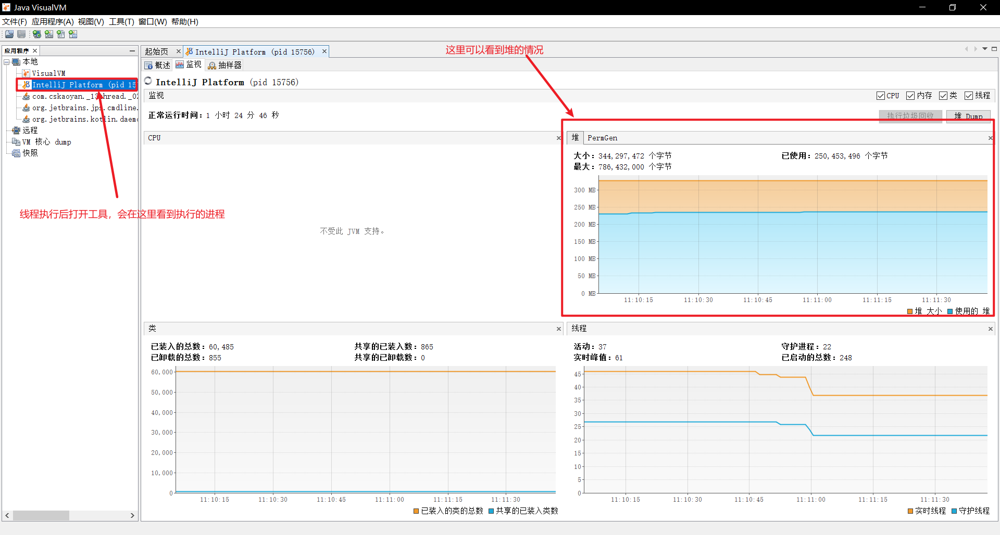
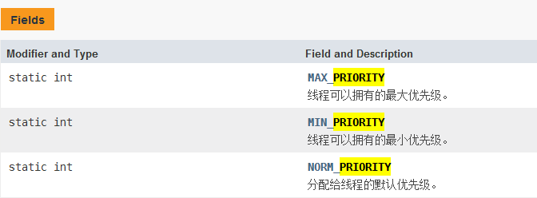
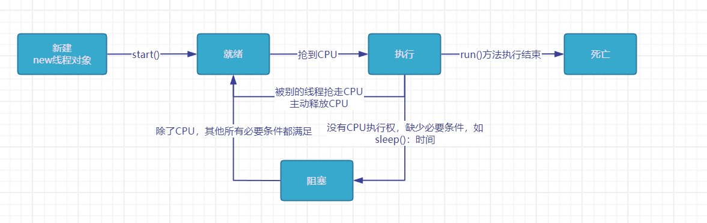
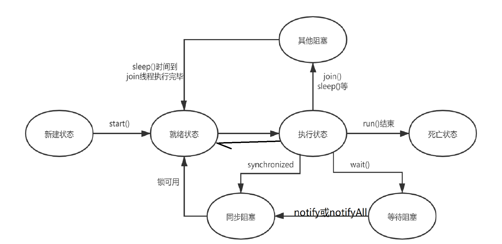
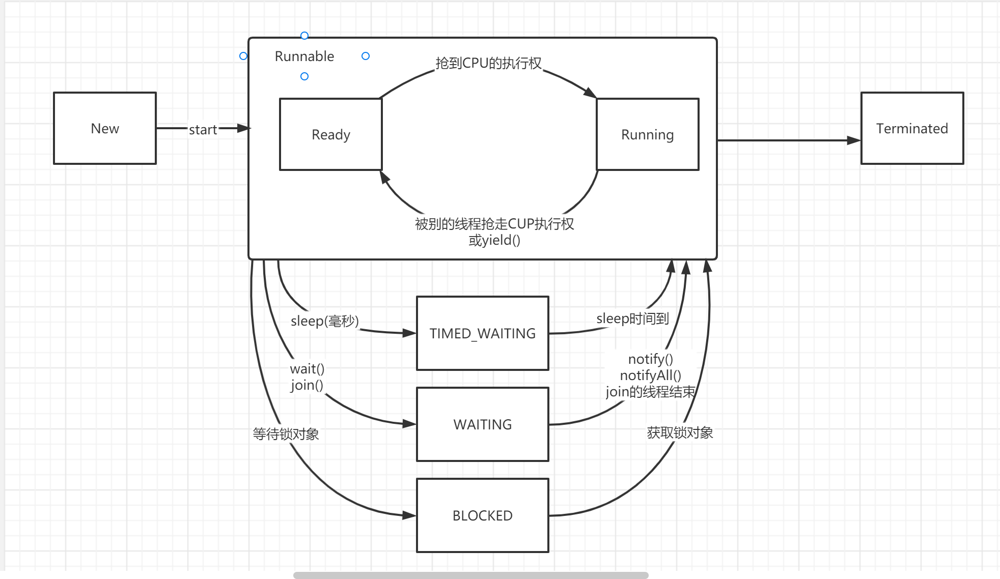

# JVM是多线程还是单线程的？

JVM是多线程的，除了main进程外，至少还有一个垃圾回收进程

# **jvisualvm**

jdk自带的用来监控java运行程序的cpu、内存、线程等的使用情况的工具

路径：jdk安装路径下的bin目录




# 线程的两种方式

一是新建子类继承Thread类，二是新建子类实现Runnable接口，二者的区别如下：

- 方式一通过继承的方式，方式二通过实现接口的方式。方式二更灵活。
- 方式二把线程和线程的任务区分开来，耦合度更低。（即线程通过创建Thread类，线程的任务通过实现Runnable接口）
- 方式二便于数据共享，可以把要共享的数据在实现Runnable接口的类中作为field，这样把Runnable子类对象作为参数传递给不同的线程对象时，线程对象可以同时共享该数据。而方式一只能通过静态成员变量或者额外在Thread子类中新设成员变量来实现数据共享。

综上所述，一般使用方式二实现Runnable接口来创建线程。

## 1. 通过Thread的子类对象

1. 创建一个继承Thread类的子类
2. 重写其中的run()方法，把线程要执行的内容写进去
3. 在main()方法中创建子类对象
4. 调用该对象的start()方法

### run()方法和start()方法的区别

- run()方法可以理解为普通方法，如果在main()方法中调用不会开辟新的执行流，只会从上至下正常执行
- start()方法是启动线程，会开辟新的线程执行流（start里面有一个start0()方法，本地方法）

### 不能对同一个线程对象多次start()

线程对象有生命周期，run()中的方法结束后该线程对象就相当于消亡了，再次start()会抛出IllegalThreadStateException

### 获取线程名称

Thread类中的getName()方法

```
public final String getName()
```

返回此线程的名称。

Thread类中有一个静态成员变量Thread：private static int threadInitNumber

每new一个Thread对象会自动加1

### 设置线程名称

Thread类中的setName()方法

```
public final void setName(String name)
```

将此线程的名称更改为等于参数`name` 。 

还可以通过构造器方法设置线程名称

```
public Thread(String name)
```

分配一个新的`Thread`对象。 此构造具有相同的效果[Thread](../../java/lang/Thread.html#Thread-java.lang.ThreadGroup-java.lang.Runnable-java.lang.String-)  `(null, null, name)` 。 

### 拿到当前执行的线程对象的引用

Thread类的静态方法：

```
public static Thread currentThread()
```

返回对当前正在执行的线程对象的引用。 

### 线程优先级



可以设置优先级1-10，通过setPriority()设置优先级，通过getPriority()获取线程优先级。

**但正常设置优先级并没有太大用处**，不能完全保证优先级高的线程先执行：因为优先级分动态优先级和静态优先级，Java中是静态优先级，操作系统是动态优先级（执行过程中优先级会动态变化），设置静态优先级只是向操作系统提建议，根本上还是要看操作系统的调度策略。

## 2. 实现Runnable接口

如果这个线程是使用单独的Runnable运行对象构造的，则执行Runnable对象的run方法；否则，此方法不执行任何操作并返回。 

```java
public void run() {
    if (target != null) {
        target.run();
    }
}
```

实现Runnable接口创建线程的方法：

1. 新建一个类实现Runnable接口
2. 重写`run()`方法
3. 创建实现Runnable接口的子类的对象
4. 创建Thread类的对象t，构造方法中把3创建的对象作为参数传入
5. `t.start()`启动线程

### 实现方式一：匿名内部类

```java
new Thread(new Runnable(){
    public void run() {
        ...
    }
}).start();
```

### 实现方式二：lambda表达式

```java
new Thread(() -> {
    重写的run方法体
}).start(); // Runnable是功能接口，可以用lambda表达式代替
```


# 调度方式的分类

## 协同式线程调度

线程执行时间由线程本身决定。

问题：有一个线程死循环，其他任何线程都不能执行

## 抢占式线程调度

Java采用的线程调度默认是抢占式的，线程执行时间由系统决定，哪个线程抢到CPU哪个线程就执行。

优点：不会发生线程死循环后其他线程不能执行的情况

# 线程控制API

## 线程休眠sleep

`public static void sleep(long millis) throws InterruptedException`

使当前正在执行的线程以指定的毫秒数暂停（暂时停止执行），具体取决于系统定时器和调度程序的精度和准确性。 线程不会丢失任何显示器的所有权。 

- 参数 

  `millis` - 以毫秒为单位的睡眠时间长度 

- 异常 

  `IllegalArgumentException`  - 如果 `millis`值为负数 

  `InterruptedException`  - 如果任何线程中断当前线程。 当抛出此异常时，当前线程的*中断状态*将被清除。 

在哪个线程调用`Thread.sleep()`哪个线程就会暂停执行。

## 线程合并join

`public final void join() throws InterruptedException`

等待这个线程死亡。 

看起来像是单线程，在哪个地方调用，就好像在哪里阻塞一样。等待该对象run执行结束后，才会继续执行。<br>谁等待：join运行在哪个线程中，哪个线程就等待<br>等待谁：等待的是调用join的对象的run()方法执行完成

## 线程礼让yield

`public static void yield()`

对调度程序的一个暗示，即当前线程愿意暂停当前使用的处理器。 调度程序可以自由地忽略这个提示。 

实际上，**使用Thread.yield()并不能实现真正的线程礼让**。Java中采用抢占式的调度方式，假设线程此刻放弃了CPU，但是CPU执行调度时又可能调度该线程，放弃CPU的线程仍可能被调度。

## 守护线程setDaemon

用户线程：系统的工作线程（如main线程和普通创建的线程）<br>守护线程：为用户线程服务的线程（如回收垃圾的线程），系统的后台线程

---

`public final void setDaemon(boolean on)`

将此线程标记为daemon线程或用户线程。 当运行的唯一线程都是守护进程线程时，Java虚拟机将退出。 
**线程启动（start方法）前必须调用此方法，**否则会抛出`IllegalThreadStateException` 

# 线程的生命周期

## 理论层面的状态



## 代码层面

- NEW：尚未启动的线程处于此状态。 
- RUNNABLE：在Java虚拟机中执行的线程处于此状态。（实际上就是就绪和执行的组合）
- BLOCKED：被阻塞等待监视器锁定的线程处于此状态。 
- WAITING：正在等待另一个线程执行特定动作的线程处于此状态。 
- TIMED_WAITING：正在等待另一个线程执行动作达到指定等待时间的线程处于此状态。 
- TERMINATED：已退出的线程处于此状态。

BLOCKED、WAITING、TIMED_WAITING统称为阻塞状态

# 同步

## 同步代码块

``` java
synchronized(锁对象) {
    // 对共享数据的访问操作
}
```

锁对象：可以是任意Java对象，但要保证是同一把锁。对象结构中的对象头中的锁信息记录了访问当前对象的线程信息，如果其他线程想要访问该对象，需要等待锁释放。

 

## 同步方法

在成员方法权限后加synchronized，相当于方法体外面加了锁对象为this的同步代码块。

```java
public synchronized void method() {
    方法体
}
//等价于
public void method() {
    synchronized(this) {
    	方法体
    }
}
```

在静态成员方法权限后加synchronized，相当于方法体外面加了锁对象为类的字节码对象的同步代码块。

```java
public synchronized static void method() {
    方法体
}
//等价于
public static void method() {
    synchronized(Class对象) {
    	方法体
    }
}
```

## 释放锁的情形

- 同步方法或者同步代码块执行完成
- 拿到锁的线程出现异常（异常只针对单个线程）
- 执行`wait()`方法

## 可重入锁

synchronized是可重入锁，锁关联对象的monitor中有一个`entry count`计数器，如果一个线程拥有锁，那它可以再次进入锁，并且计数器加1。只有计数器为0时，线程才会放弃锁的所有权。

synchronized的同步操作是通过字节码指令`monitorenter`和`monitorexit`实现的，`monitorenter`会将计数器加1，`monitorexit`会将计数器减1。

## Lock接口

sychronized请求锁和释放锁的过程是JVM自动完成的，如果想要看到请求锁和释放锁，可以使用Lock接口。实际上一般使用synchronized，避免死锁。

```java
Lock l = new ReentrantLock(); // 使用ReentrantLock类作为Lock接口的实现类
l.lock(); // 加锁
try {
    
    //对共享数据的访问操作
} finally {
    -
        
    l.unlock(); // 释放锁
}
```

# 死锁

死锁一般发生在同步代码块嵌套

```java
synchronized(A) {
	synchronized(B) {
    
	}   
}

synchronized(B) {
	synchronized(A) {
    
	}   
}
```

## 解决死锁方式一

使加锁顺序一致

```java
synchronized(A) {
	synchronized(B) {
    
	}   
}

synchronized(A) {
	synchronized(B) {
    
	}   
}
```

## 解决死锁方式二

把非原子操作变成原子操作（一次性拿完所有锁）

```java
synchronized(mutex) {
	synchronized(A) {
		synchronized(B) {
    
		}   
	}
}

synchronized(mutex) {
    synchronized(B) {
        synchronized(A) {

        }   
    }
}
```

# 线程间通信

`wait() `导致当前线程等待，直到另一个线程调用该对象的 notify()方法或 notifyAll()方法。 在调用wait()前，线程必须获得锁对象。

`notify()`  唤醒正在等待对象监视器的单个线程。 在调用notify()之前，线程必须获得锁对象。执行notify()时如果有多个线程，随即唤醒其中一个线程。**注意：执行notify()后不会马上释放锁，当退出synchronized代码块时才会释放锁。**

`notifyAll()`  唤醒正在等待对象监视器的所有线程。 

拥有相同锁的线程才可以实现wait/notify机制。

## wait()

### 阻塞功能

在哪个线程中调用wait()，哪个线程就会阻塞。即该线程在该对象上阻塞。

### 唤醒条件

在其他线程中调用同一对象的notify()方法或notifyAll()方法

### 运行条件

当前进程必须拥有该对象的对象监视器。即我们只能在当前线程持有的synchronized块中的锁对象调用wait()

### 和sleep()方法的区别

Thread的sleep方法，执行的时候该线程不丢失任何监视器的所属权<br>而wait()方法执行后，线程会马上释放该对象的锁，使其他线程可以获取该对象的锁。

# 线程的所有状态





# 编写线程的一般规则

## 线程重复直至完成一个任务

1. 在线程任务中，使用一个循环体，可以使用true条件或者正常的循环条件。
2. 循环体内写一个同步代码块或者同步方法，如果1中使用true条件，这里要写退出循环的条件并使用break语句，如果1中使用正确的循环条件，需要在同步代码块或者同步方法中更改循环条件中的变量后再使用notify语句

### 使用true条件

```java
while (true) {
    sychronized() {
        notify();
        if (满足退出循环条件) {
            break;
        }
        wait();
    }
}
```

## 使用正常循环条件

```java
while (正常循环条件) {
    sychronized() {
        更改循环条件;
        notify();
        wait();
    }
}
```


## 保证其中一个线程先执行，另外一个线程后执行

设置一个boolean类型的flag变量，初始为true

- 后执行的线程在同步代码块中先写一个判断语句，如果flag为true则阻塞起来
- 先执行的线程在同步代码块中先将flag置为true

```java
static flag = true;

//先执行的线程
sychronized() {
    flag = false;
    ...;
    notify();
    wait();
}

//后执行的线程
sychronized() {
    if (flag) {
        wait();
    }
    ...;
    notify();
    wait();
}
```


## 两个线程轮流执行子任务

线程在一轮子任务的末尾，先唤醒另外一个线程，自己再阻塞

**注意：两个线程需要在退出任务后，使用notify()唤醒线程，否则另一个线程会无限阻塞**

# 线程安全的懒加载单例

## 在获取实例的方法加锁

```java
public class Singleton {
    private static Singleon instance; // 自身成员的静态变量
    private Singleton() { // 构造方法私有
        
    }
    
    /*静态获取实例方法*/
    public static synchronized Singleton getInstance() {
        if (instance == null) {
            instance = new Singleton();
        }
        return instance;
    }
}
```

这种方法的颗粒度较大，整个方法都被锁起来

## 使用double check方式保证线程安全

```java
public class Singleton {
    private static Singleon instance; // 自身成员的静态变量
    private Singleton() { // 构造方法私有
        
    }
    
    /*静态获取实例方法*/
    public static Singleton getInstance() {
        // 第一次check
        if(instance == null) {
            synchronized(Singleton.class) {
                // 第二次check
                if (instance == null) {
                    instance = new Singleton();
                }
            }
        }
        return instance;
    }
}
```

只有在多个线程第一次获取实例时，才可能争抢锁，颗粒度较小
