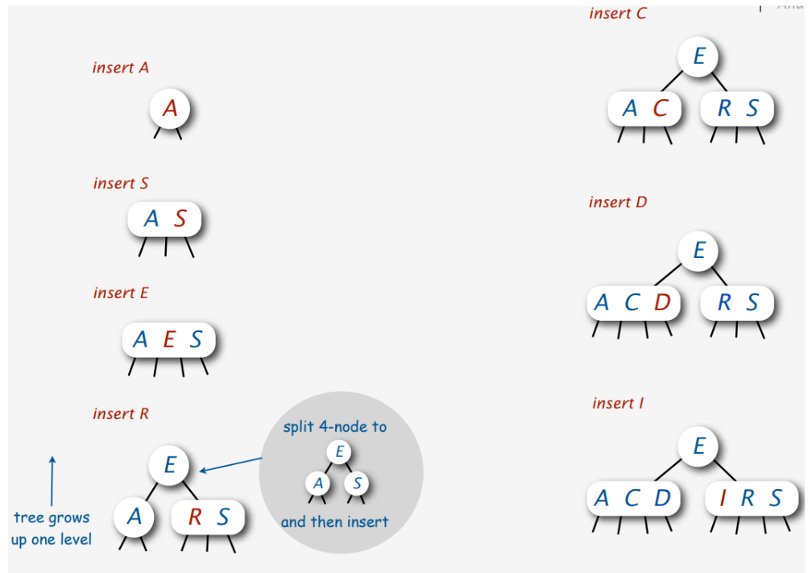
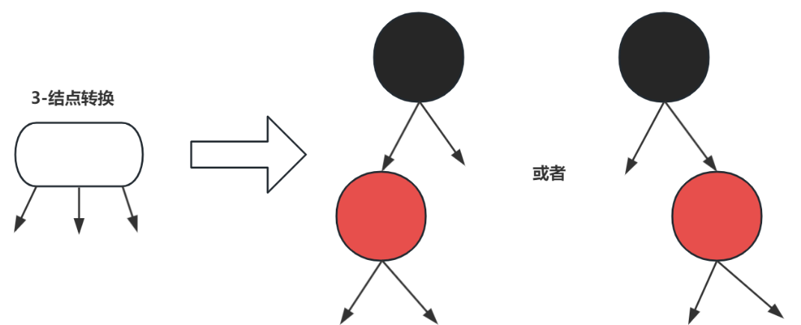
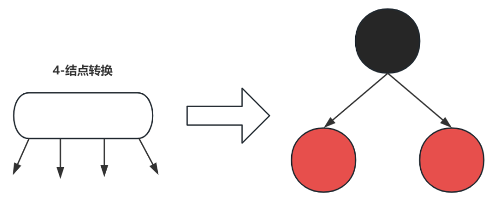
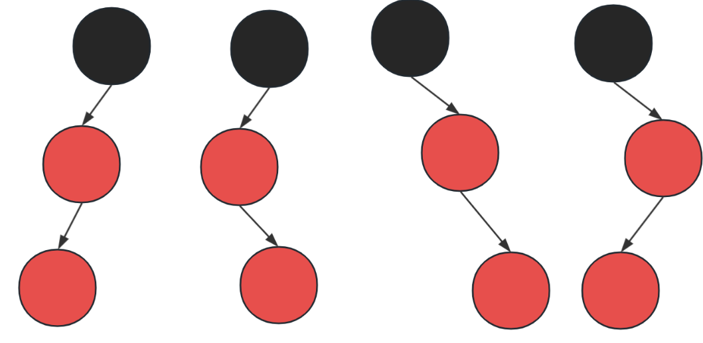
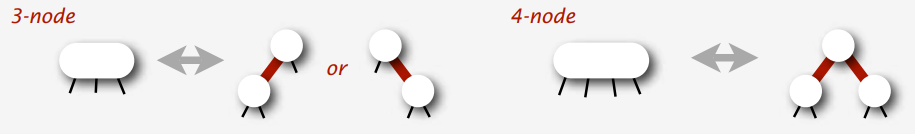
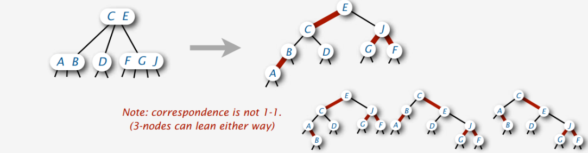

# 二叉树

## 非递归先序遍历

1. 创建一个栈
2. 将根节点入栈
3. 循环执行以下操作（栈不空）
4. 弹栈，访问弹栈的结点
5. 如果该结点有右孩子，将其入栈
6. 如果该结点有左孩子，将其入栈

```java
public static void preOrder(Node node) {
    if (node != null) {
        Stack<Node> stack = new Stack();
        stack.push(node);
        while (!stack.isEmpty()) {
            Node top = stack.pop();
            printf(node.value);
            if (node.right != null) {
                stack.push(right);
            }
            if (node.left != null) {
                stack.push(left);
            }
        }
    }
}
```

## 非递归中序遍历

1. 创建一个栈
2. 循环执行以下操作（栈不空或者当前结点不是null）
3. 整个左边界依次入栈
4. 如果没有左子树，弹出栈顶元素，输出该元素
5. 如果该元素有右孩子，将右孩子的整个左边界入栈

```java
public static void inOrder(Node node) {
    Stack<Node> stack = new Stack();
    while(node != null || !stack.isEmpty()) {
		while (node.left != null) {
            node = node.left;
            stack.push(node);
        }
        node = stack.pop();
        print(node.val);
        if (node.right != null) {
            node = node.right;
            stack.push(node);
        } else {
            node = null;
        }
    }
}
```


## 非递归后序遍历

1. 创建一个栈s1用于遍历
2. 创建一个栈s2用于存放后序遍历的结果，作为辅助栈
3. 将根结点入栈s1
4. 循环执行以下操作（栈s1未空）
5. 弹出栈顶元素，结果入栈s2
6. 如果该元素有左子树，将左子树入栈s1
7. 如果该元素有右子树，将右子树入栈s1
8. 如果栈s1为空，结束循环
9. 依次弹出栈s2，打印

```java
public static void postOrder(Node node) {
    if (node != null) {
        Stack<Node> s1 = new Stack();
        Stack<Node> s2 = new Stack();
        s1.push(node);
        while (!s1.isEmpty) {
            node = s1.pop();
            s2.push(node);
            if (node.left != null) {
                s1.push(node.left);
            }
            if (node.right != null) {
                s1.push(node.right);
            }
        }
        while (!s2.isEmpty()) {
            printf(s2.pop().value);
        }
    }
}
```

# 多路查找树

### 2-3-4树

2-3-4树是一棵多路查找树(4阶B树)：

- 每个结点都具有2个孩子（2-结点），或3个孩子（3-结点）,或4个孩子(4-结点)
- 一个2-结点包含一个元素(key)和2个孩子（或没有孩子）
- 一个3-结点包含一小一大2个元素和3个孩子（或没有孩子）
- 一个4-结点包含3个元素和4个孩子（或没有孩子）
- 2-3-4树是一种能够动态保持完美平衡的树，所有叶子结点都在同一层，这样从根结点到任意一个叶子结点的路径都是一样长的(完美平衡)。

> n-node：可以有n个孩子结点的node

## 插入分裂

如果在4-结点中插入key, 被插入结点的父节点是4-结点

有两种解决办法：

1. 自底向上分裂法：

   1. 如果分裂一个4-子结点时发现它的父节点也是4-结点，那么就继续分裂这个4-父节点。
   2. 这个过程自底向上，沿着查找路径一直分裂，可以一直分裂到根结点。(如果根结点也是4-结点，那么需要增加树的高度)
   3. 这个方式，相当于走回头路，需要来回遍历树，效率不高。一般更推荐下面的"自顶向下分裂法"

2. <span style=color:red;background:yellow>**自顶向下分裂法：**</span>

   1. 在查找插入位置的过程中，只要遇到4-结点就分裂它。
   2. 这种分裂方式分裂一个4-结点时，它的父节点肯定不是4-结点，所以它不会来回遍历树。(因为父节点如果是4-结点，已经被分裂了)
   3. 这种分裂方式还会带来一个好处，在查找到插入位置时，一定可以直接进行插入。(因为当前结点肯定不是4-结点了)

## 插入过程

2-3-4树的生长过程

1. **插入A**：树开始时为空。首先插入关键字"A"，创建了一个2-节点。
2. **插入S**：接着插入"S"，它被添加到现有的2-节点中，使之成为一个3-节点。
3. **插入E**：然后插入"E"，它被添加到现有的3-节点中，使之成为一个4-节点。
4. **插入R，树增长一个层级：**然后插入"R"，此时树仅有一个4-结点，按照上面的<span style=color:red;background:yellow>**自顶向下分裂法**</span>，需要分裂这个4-结点。
   1. 由于这个4-结点是一个根结点，所以分裂这个4-结点会使得树的高度增加一层。
   2. 这个分裂过程会把中间key值"E"作为新的根结点，A和S分别成为新的左右子树。
   3. R比S小，所以它和S组成了一个新的3-结点。
5. **插入C**：当插入"C"时，它被放在"A"和"E"之间的位置，导致原先的2-节点（包含"A"）变成了一个3-节点。
6. **插入D**：插入"D"后，由于"A"和"C"之间有空间，它被插入，形成一个满载的4-节点，现在包含"A"、"C"和"D"。
7. **插入I**：最后插入"I"。这个关键字适合在"E"的右子节点中插入，这是一个3-节点包含"R"和"S"。由于3-节点还有空间，"I"被插入，形成了另一个满载的4-结点



## 性能

2-3-4 树的增加，删除，查找操作的时间复杂度都取决于树的高度 h

假设树的key数量是N，那么：

1. 最坏情况下，树中全部是2-结点，那么树的高度 h = log2 N
2. 最好情况时，树中全部都是4-结点，那么树的高度 h = log4 N = (1 / 2) * log2 N

可能大家对这个对数结果的高度没什么感觉和概念，那么我们可以举两个例子：

1. 当N = 100万时，2-3-4树的高度在 10 到 20 之间。
2. 当N = 10亿时，2-3-4树的高度在 15 到 30 之间。

# 红黑树与2-3-4树的关系

**那么红黑树如何通过颜色描述2-3-4树的三种结点呢?** 这里就存在一个结点转换的过程：

- 2-结点直接对应红黑树中的一个黑色节点。
- 3-结点对应红黑树中的一个黑色节点再加上一个红色节点。
- 4-结点对应红黑树中的一个黑色节点再加上两个红色节点。

**3-结点转换**

转换后的每个结点都只有一个key，一个黑结点和红结点就构成了以往的3-结点。




4-结点转换,如下图



4-结点转换只有上述一种方式，下列几种方式都是不可以的，目的是为了保证红黑树的高度最低，提升效率。





除了上面的结点颜色理解方式，理解红黑树还可以用"黑边红边"来理解，如下图所示：



这个红色的边，可以理解成：<span style=color:red;background:yellow>**被红色边链接的几个结点就是逻辑上的同一个结点。**</span>

比如根据上图：

1. 一个2-3-4树中的3-结点，可以转换成红黑树中一个父结点用"红边"链接左子树或者右子树。
2. 一个2-3-4树中的4-结点，可以转换成红黑树中一个父结点用"红边"同时链接左子树和右子树。
3. 一个2-3-4树中的2-结点，它和父节点之间的链接肯定是"黑边"。

**2-3-4 树和红黑树之间是有一种对应关系的，不过这种对应关系不是 1-1 的 (3-结点可以倾向任意一边)。**


