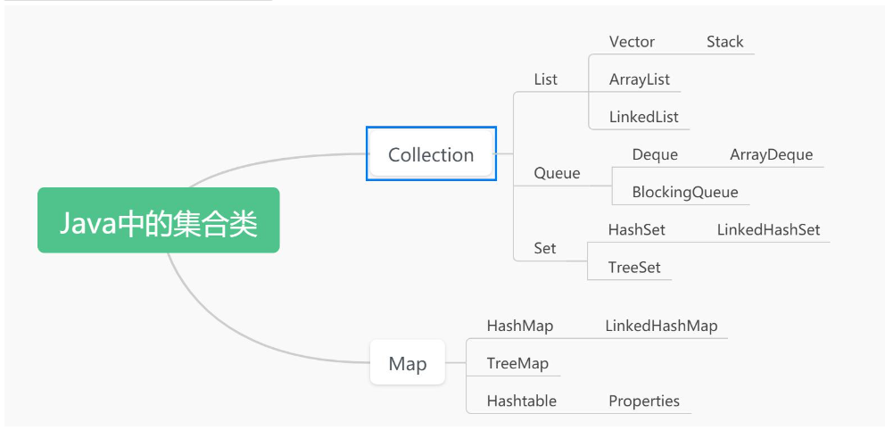
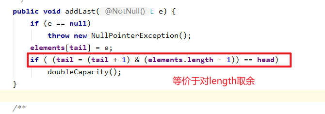

`Collection`存储单个数据，`Map`存储键值对。

学习集合类需要学习的内容：

1. 集合类的父子关系
2. 逻辑表现
3. 底层表现（默认初始长度，扩容问题）
4. 是否有序
5. 是否可以有重复数据
6. 是否可以存储null
7. 是否线程安全

**注意：`LinkedList`既是List，也是Deque**

# Collection

## 利用迭代器遍历

```java
Iterator it = list.iterator();
while (it.hasNext()) {
    ElementType data = it.next();
}
```

# ArrayList

ArrayList的特点

1. ArrayList是List接口的子实现

2. ArrayList数据结构是线性表

3. ArrayList底层是数组

4. ArrayList底层持有的数组默认初始长度10, 扩容机制1.5倍

5. ArrayList存储数据有序

6. ArrayList允许存储重复数据

7. ArrayList允许存储null

8. ArrayList线程不安全

# Vector

**工作基本不用，可以用ArrayList代替。**

1. Vector是List的子实现

2. Vector数据结构为线性表

3. Vector的底层结构是数组

4. Vector底层数组的默认长度10,  扩容机制(如果Vector有大于0的增量, 那么,每次扩容扩大增量个, 如果增量是小于等于0, 每次扩容扩为原来的2倍)

5. Vector存储数据有序

6. Vector允许存储重复数据

7. Vector允许存储null

8. 线程安全 (锁)

9. Vector是jdk1.0的时候出现 (ArrayList在jdk1.2时候出现, ArrayList出现就是为了取代Vector)

# Stack

Stack是一个栈, 但是是线程安全(效率略低), 所以Java提供了另个一个集合类, 也可以表示为栈, Queue接口下的Deque. (Deque接口主要是作为双端队列, 但是也定义了栈这种数据结构)

```java
Deque<Integer> stack2 = new ArrayDeque<Integer>();
```

# LinkedList

1. LinkedList是List的子实现, 同时还是Deque接口的子实现.(主要把LinkedList看做List的子实现)

2. LinkedList数据结构表现为: 线性表, 队列, 双端队列, 栈

3. LinkedList底层是一个双向链表

4. LinkedList存储元素有序

5. LinkenList允许存储重复数据

6. LinkedList允许存储null

7. 线程不安全

## List方法

`add()`

`remove()`

## 队列方法

`offer()`

`poll()`

## 栈方法

`push()`

`pop()`

## 双端队列

`offerFirst()`

`offerLast()`

`pollFirst()`

`pollLast()`

`peekFirst()`

`peekLast()`

# Queue

1. Queue接口是Collection的子接口

2. Queue数据结构定义队列

3. Queue存储数据有序

4. Queue允许存储重复数据

5. Queue不允许存储null  (LinkedList除外)

   如果存储null，那么队列为空出队也是null，这样就分不清楚是队列为空，还是队列中本来存储null。

# ArrayDeque

1. ArrayDeque是Deque接口的子实现

2. 数据结构表现:  队列, 双端队列, 栈

3. 底层结构是数组: 循环数组

4. 默认初始长度:16;  默认扩容机制:2倍 --> 数组长度保持2的幂值

5. 存储元素有序

6. 允许存储重复数据

7. 不允许存储null

8. 线程不安全

## 取余的另一种表示

> num % size = index
>
> num & (size - 1) = index
>
> 当size为2的幂次时，这两个式子等价

                                                                                           

## 如何保证创建对象时初始容量保证2的幂次

```java
private static int calculateSize(int numElements) {
    int initialCapacity = MIN_INITIAL_CAPACITY;
    // Find the best power of two to hold elements.
    // Tests "<=" because arrays aren't kept full.
    if (numElements >= initialCapacity) {
        initialCapacity = numElements;
        initialCapacity |= (initialCapacity >>>  1);
        initialCapacity |= (initialCapacity >>>  2);
        initialCapacity |= (initialCapacity >>>  4);
        initialCapacity |= (initialCapacity >>>  8);
        initialCapacity |= (initialCapacity >>> 16);
        initialCapacity++;

        if (initialCapacity < 0)   // Too many elements, must back off
            initialCapacity >>>= 1;// Good luck allocating 2 ^ 30 elements
    }
    return initialCapacity;
}
```

1. **方法定义**:
   - `private static int calculateSize(int numElements)`: 这是一个私有静态方法，它接受一个整数`numElements`作为参数，并返回一个整数作为结果。
2. **初始容量**:
   - `int initialCapacity = MIN_INITIAL_CAPACITY;`: 初始化一个变量`initialCapacity`为`MIN_INITIAL_CAPACITY`。这可能是一个预先定义的常量，表示数组的最小初始容量。
3. **选择最佳的2的幂容量**:
   - 如果`numElements`大于或等于`initialCapacity`，则代码会执行一系列位移和位或操作来计算最接近且大于`numElements`的2的幂。这是通过右移`initialCapacity`并将其与自身进行位或操作来实现的。例如，如果`initialCapacity`是16，右移一位后是32，再右移一位后是64，依此类推。
4. **处理过大元素数量的情况**:
   - 如果计算出的`initialCapacity`小于0（这意味着元素数量过多），则通过右移一位来减少容量。这是通过`initialCapacity >>>= 1;`实现的。
5. **返回结果**:
   - `return initialCapacity;`: 返回计算出的初始容量。

# BlockingQueue

阻塞队列:

1. 一个大小容量有限的队列
2. 添加操作的时候, 队列添加满了, 添加线程等待
3. 删除操作的时候, 队列删除空了, 删除线程等待

BlockingQueue关于添加和删除的方法有四类:

1. 不满足条件抛出异常: add, remove
2. 不满足条件返回特殊值: offer(布尔值), poll(null)
3. 不满足条件一直阻塞: put, take
4. 在指定时间内阻塞:  超时的offer/poll

# Map

1. Map是Map集合体系的顶级接口

2. Map是一个存储映射数据(key-value; 键值对)的数据容器

3. Map的一些子实现有序, 一些子实现存储数据无序: (指key)

4. Map不允许存储重复数据: (指key)

5. Map的一些子实现允许存储null, Map的一些子实现不允许存储null: (指key)

## 遍历

```java
Map<String, Integer> map = new HashMap<>();
Set<String> keySet = map.keySet();
Interator<String> iterator = keySet.iterator();
while(iterator.hasNext()) {
    System.out.println(iterator.next());
}
```

# HashMap

1. HashMap是Map接口的子实现
2. HashMap的底层结构:  数组+链表+红黑树(红黑树是在Jdk1.8时候引入的结构)
3. 数组的默认初始长度16,  扩容机制2倍, 加载因子默认是0.75
4. HashMap存储数据无序
5. HashMap不允许存储重复的key (什么叫重复? )
6. HashMap允许存储null作为key
7. 线程不安全

HashMap在jdk1.8前是数组加链表，1.8之后是数组加链表加红黑树。

```java
public class HashMap<K,V> {
    transient Node<K,V>[] table; // 存放键值对结点的散列表

    /*键值对结点*/
	static class Node<K,V> implements Map.Entry<K,V> {
        final int hash;
        final K key;
        V value;
        Node<K,V> next; // 相同散列表位置的下一个结点的引用

        Node(int hash, K key, V value, Node<K,V> next) {
            this.hash = hash;
            this.key = key;
            this.value = value;
            this.next = next;
        }
	}
    
    public V put(K key, V value) {
        return putVal(hash(key), key, value, false, true);
    }
    
    /*计算哈希值*/
    static final int hash(Object key) {
        int h;
        return (key == null) ? 0 : (h = key.hashCode()) ^ (h >>> 16);
        /*这里，将h右移16位（相当于除以2的16次方）是为了将哈希码分散到更大的范围，从而减少哈希冲突的可能性。然后，使用异或操作确保哈希码在不同的平台上具有一致性（因为不同的平台可能会以不同的方式计算哈希码）。*/
    }
    
    final V putVal(int hash, K key, V value, boolean onlyIfAbsent,
                   boolean evict) {
        Node<K,V>[] tab; Node<K,V> p; int n, i;
        if ((tab = table) == null || (n = tab.length) == 0)
            n = (tab = resize()).length;
        if ((p = tab[i = (n - 1) & hash]) == null)
            tab[i] = newNode(hash, key, value, null);
        else {
            Node<K,V> e; K k;
            if (p.hash == hash &&
                ((k = p.key) == key || (key != null && key.equals(k))))
                e = p;
            else if (p instanceof TreeNode)
                e = ((TreeNode<K,V>)p).putTreeVal(this, tab, hash, key, value);
            else {
                for (int binCount = 0; ; ++binCount) {
                    if ((e = p.next) == null) {
                        p.next = newNode(hash, key, value, null);
                        if (binCount >= TREEIFY_THRESHOLD - 1) // -1 for 1st
                            treeifyBin(tab, hash);
                        break;
                    }
                    if (e.hash == hash &&
                        ((k = e.key) == key || (key != null && key.equals(k))))
                        break;
                    p = e;
                }
            }
            if (e != null) { // existing mapping for key
                V oldValue = e.value;
                if (!onlyIfAbsent || oldValue == null)
                    e.value = value;
                afterNodeAccess(e);
                return oldValue;
            }
        }
        ++modCount;
        if (++size > threshold)
            resize();
        afterNodeInsertion(evict);
        return null;
    }
}

```

# LinkedHashMap

1. LinkedHashMap是HashMap的子类

2. LinkedHashMap底层基本上完全复用了HashMap的结构 --> LinkedHashMap的特点基本上和HashMap一样 (结构: 数组+链表+红黑树, hash, 重复)
3. LinkedHashMap在HashMap的基础上额外定义了一个双向链表, 用以保证迭代顺序 (重要)
4. LinkedHashMap存储数据有序
5. LinkedHashMap不允许存储重复数据
6. LinkedHashMap允许存储null
7. 线程不安全

# HashTable

一般使用`HashMap`，注意区别就行

1. Hashtbale是Map的子实现
2. Hashtable底层结构是: 数组+链表  (和HashMap在jdk1.8之前一样)
3. Hashtable底层数组长度11, 扩容机制2倍+1
4. Hashtable存储数据无序
5. Hashtable不允许存储重复数据 (重复的定义和HashMap一样)
6. Hashtable不允许存储null作为key, 也不允许存储null作为value
7. 线程安全.
8. jdk1.0时候出现, HashMap是1.2出现 (HashMap出现就是为了取代Hashtable)

# Properties

```properties
# 使用properties保存或者读取k-v数据
# 注释
# 存放k-v数据，全部都是String类型
name=zs
password=123456
```

```java
Properties properties = new Properties();
// 从流中加载配置文件
properties.load(new FileInputStream("xxx.properties"));
// 读取配置信息，通过key获取value值，如果key不存在则会返回null
String name = properties.getProperty("name");
String password = properties.getProperty("password");
```

# TreeMap

1. TreeMap是Map接口子实现
2. TreeMap数据结构表现是红黑树
3. TreeMap存储数据大小有序
4. TreeMap不允许存储重复数据  (什么叫重复?  key的大小一样)
5. TreeMap不允许null作为key
6. TreeMap线程不安全

# HashSet

1. HashSet是Set的子实现
2. HashSet底层持有了一个HashMap对象, 我们添加到HashSet的数据实际上都添加到底层持有的HashMap的key上了.
3. HashSet的特点基本上要遵照于HashMap的key的特点
4. 存储数据无序
5. 不允许存储重复数据(   重复的依据: hashCode, equals )
6. 允许存储null
7. 线程不安全
