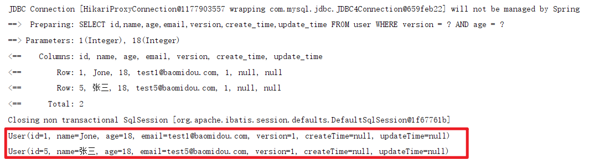

# 1. MyBatis-Plus简介

​		[MyBatis-Plus](https://github.com/baomidou/mybatis-plus)（简称 MP）是一个 [MyBatis](https://www.mybatis.org/mybatis-3/)的增强工具，在 MyBatis 的基础上只做增强不做改变，为简化开发、提高效率而生。


## 1.1 特性

- **无侵入**：只做增强不做改变，引入它不会对现有工程产生影响，如丝般顺滑
- **损耗小**：启动即会自动注入基本 CURD，性能基本无损耗，直接面向对象操作
- **强大的 CRUD 操作**：内置通用 Mapper、通用 Service，仅仅通过少量配置即可实现单表大部分 CRUD 操作，更有强大的条件构造器，满足各类使用需求
- **支持 Lambda 形式调用**：通过 Lambda 表达式，方便的编写各类查询条件，无需再担心字段写错
- **支持主键自动生成**：支持多达 4 种主键策略（内含分布式唯一 ID 生成器 - Sequence），可自由配置，完美解决主键问题
- **支持 ActiveRecord 模式**：支持 ActiveRecord 形式调用，实体类只需继承 Model 类即可进行强大的 CRUD 操作
- **支持自定义全局通用操作**：支持全局通用方法注入（ Write once, use anywhere ）
- **内置代码生成器**：采用代码或者 Maven 插件可快速生成 Mapper 、 Model 、 Service 、 Controller 层代码，支持模板引擎，更有超多自定义配置等您来使用
- **内置分页插件**：基于 MyBatis 物理分页，开发者无需关心具体操作，配置好插件之后，写分页等同于普通 List 查询
- **分页插件支持多种数据库**：支持 MySQL、MariaDB、Oracle、DB2、H2、HSQL、SQLite、Postgre、SQLServer 等多种数据库
- **内置性能分析插件**：可输出 SQL 语句以及其执行时间，建议开发测试时启用该功能，能快速揪出慢查询
- **内置全局拦截插件**：提供全表 delete 、 update 操作智能分析阻断，也可自定义拦截规则，预防误操作

## 1.2 框架结构


# 2. 快速入门

## 2.1 新建一个数据库


## 2.2 在新建的数据库下面新建一张表`user`

```sql
DROP TABLE IF EXISTS user;

CREATE TABLE user
(
    id BIGINT(20) NOT NULL COMMENT '主键ID',
    name VARCHAR(30) NULL DEFAULT NULL COMMENT '姓名',
    age INT(11) NULL DEFAULT NULL COMMENT '年龄',
    email VARCHAR(50) NULL DEFAULT NULL COMMENT '邮箱',
    PRIMARY KEY (id)
);
```

## 2.3 在新建的表`user`中插入数据

```sql
DELETE FROM user;

INSERT INTO user (id, name, age, email) VALUES
(1, 'Jone', 18, 'test1@baomidou.com'),
(2, 'Jack', 20, 'test2@baomidou.com'),
(3, 'Tom', 28, 'test3@baomidou.com'),
(4, 'Sandy', 21, 'test4@baomidou.com'),
(5, 'Billie', 24, 'test5@baomidou.com');
```

|  id  |  name  | age  |       email        |
| :--: | :----: | :--: | :----------------: |
|  1   |  Jone  |  18  | test1@baomidou.com |
|  2   |  Jack  |  20  | test2@baomidou.com |
|  3   |  Tom   |  28  | test3@baomidou.com |
|  4   | Sandy  |  21  | test4@baomidou.com |
|  5   | Billie |  24  | test5@baomidou.com |

## 2.4 新建一个SpringBoot工程 

## 2.5 导入相关依赖

```xml
<dependencies>
    <!--数据库驱动-->
    <!-- https://mvnrepository.com/artifact/mysql/mysql-connector-java -->
    <dependency>
        <groupId>mysql</groupId>
        <artifactId>mysql-connector-java</artifactId>
        <version>5.1.49</version>
    </dependency>

    <!--junit-->
    <!-- https://mvnrepository.com/artifact/junit/junit -->
    <dependency>
        <groupId>junit</groupId>
        <artifactId>junit</artifactId>
        <version>4.13.2</version>
        <scope>test</scope>
    </dependency>

    <!--lombok-->
    <!-- https://mvnrepository.com/artifact/org.projectlombok/lombok -->
    <dependency>
        <groupId>org.projectlombok</groupId>
        <artifactId>lombok</artifactId>
        <version>1.18.20</version>
    </dependency>

    <!--mybatisplus，不要和mybatis共同导入-->
    <!-- https://mvnrepository.com/artifact/com.baomidou/mybatis-plus-boot-starter -->
    <dependency>
        <groupId>com.baomidou</groupId>
        <artifactId>mybatis-plus-boot-starter</artifactId>
        <version>3.4.3.3</version>
    </dependency>

    <dependency>
        <groupId>org.springframework.boot</groupId>
        <artifactId>spring-boot-starter-web</artifactId>
    </dependency>

    <dependency>
        <groupId>org.springframework.boot</groupId>
        <artifactId>spring-boot-starter-test</artifactId>
        <scope>test</scope>
    </dependency>
</dependencies>
```

## 2.6 连接数据库

```yaml
# 数据库连接配置
# 如果使用mysql8.0以上版本，驱动改为com.mysql.cj.jdbc.Driver,url后面要添加时区serverTimezone
spring:
  datasource:
    driver-class-name: com.mysql.jdbc.Driver
    url: jdbc:mysql://localhost:3306/mybatis-plus?useSSL=true&useUnicode=true&characterEncoding=utf-8
    username: root
    password: 333
```

## 2.7 编写实体类

​		这里的实体类是指数据库映射对象。

```java
package pers.yujia.pojo;

import lombok.AllArgsConstructor;
import lombok.Data;
import lombok.NoArgsConstructor;

@Data
@NoArgsConstructor
@AllArgsConstructor
public class User {
    private Integer id;
    private String name;
    private int age;
    private String email;
}
```

## 2.8 编写Mapper

​		和传统的`MyBatis`在编写`Mapper.java`接口的同时需要编写`Mapper.xml`文件不同，`MyBatis-Plus`只需要编写`Mapper.java`接口，并继承`BaseMapper<T>`（T为数据库映射对象DMO），便可以自动生成多个简单的查询语句，无需我们手动编写。

```java
package pers.yujia.mapper;

import com.baomidou.mybatisplus.core.mapper.BaseMapper;
import org.springframework.stereotype.Repository;
import pers.yujia.pojo.User;

@Repository
public interface UserMapper extends BaseMapper<User> {
}
```

## 2.9 在SpringBoot主启动类上添加扫描Mapper的注解

​		由于我们无需编写`Mapper.xml`，因此在配置文件中的`mybatis.mapper-locations`就不适用于`MyBatis-Plus`，我们需要在SpringBoot项目的主启动类上添加`@MapperScan(包名)`，就可以自动扫描。

```java
package pers.yujia;

import org.mybatis.spring.annotation.MapperScan;
import org.springframework.boot.SpringApplication;
import org.springframework.boot.autoconfigure.SpringBootApplication;

@MapperScan("pers.yujia.mapper")	//必须使用这种方式来扫描mapper
@SpringBootApplication
public class MybatisplusApplication {

    public static void main(String[] args) {
        SpringApplication.run(MybatisplusApplication.class, args);
    }

}
```

## 2.10 进行测试

```java
@SpringBootTest
class MybatisplusApplicationTests {

    @Autowired
    private UserMapper userMapper;

    @Test
    void contextLoads() {
        /*查询所有用户，参数是wrapper，条件构造器，用于筛选查询结果*/
        List<User> users = userMapper.selectList(null);	
        /*遍历结果集*/
        users.forEach(System.out::println);
    }

}
```

最后的运行结果如下图所示：


# 3. 配置日志

​		由于使用`MyBatis-Plus`时没有编写SQL语句，因此我们需要使用日志来查看它帮我们默认生成的SQL语句是怎么样的。使用系统默认的控制台标准输出日志。

```yaml
# 配置日志
mybatis-plus:
  configuration:
    log-impl: org.apache.ibatis.logging.stdout.StdOutImpl
```

​		配置之后的效果如下：


# 4. CRUD扩展

## 4.1 插入操作

### 4.1.1 不进行主键赋值的插入测试

```java
@Test
void insertTest(){
    User user = new User();
    user.setName("张三");
    user.setAge(15);
    user.setEmail("1692585584@qq.com");
    int result = userMapper.insert(user);
    System.out.println("result=>" + result);
    System.out.println(user);
}
```

​		不进行User的id赋值，进行用户的添加，最后的执行结果如下。


​		可以看到，==在进行插入操作后，`MyBatis-plus`自动为我们创建的User添加了主键。==

### 4.1.2 默认的唯一主键生成策略

​		自3.3.0开始,`MyBatis-plus`使用的默认主键生成策略是雪花算法+UUID(不含中划线)。==源代码默认的id生成器是`IdType.NONE`，但是注解默认值里设置`NONE`相当于跟随全局，全局的默认生成策略是`ASSIGN_ID`和`ASSIGN_UUID`，因此本质上默认的id生成器是`ASSIGN_ID`和`ASSIGN_UUID`。==


### 4.1.3 `MyBatis-Plus`的主键生成策略

`MyBatis-Plus`的内置主键生成策略有以下几种：

- `IdType.AUTO`：数据库ID自增，使用时要确保数据库设置了ID自增。
- `IdType.NONE`：该类型为未设置主键类型(注解设置里等于跟随全局,全局设置里约等于 INPUT)。
- `IdType.INPUT`：由用户来输入ID，该类型可以通过自己注册自动填充插件进行填充。
- `IdType.ASSIGN_ID`：雪花算法。当插入的ID为空时，会自动填充ID。主键类型为number或string。
- `IdType.ASSIGN_UUID`：UUID。当插入的ID为空时，会自动填充ID。主键类型为string。

### 4.1.4 扩展主键生成策略

参考博客：[https://www.cnblogs.com/haoxinyue/p/5208136.html](https://www.cnblogs.com/haoxinyue/p/5208136.html)

- **数据库自增长序列或字段**

  ​		最常见的方式。利用数据库，全数据库唯一。

- **UUID**

  ​		常见的方式。可以利用数据库也可以利用程序生成，一般来说全球唯一。UUID是由32个的16进制数字组成，所以每个UUID的长度是128位（16^32 = 2^128）。UUID作为一种广泛使用标准，有多个实现版本，影响它的因素包括时间、网卡MAC地址、自定义Namesapce等等。
  
- **UUID的变种**
  
- **Redis生成ID**
  
  ​		当使用数据库来生成ID性能不够要求的时候，我们可以尝试使用Redis来生成ID。这主要依赖于Redis是单线程的，所以也可以用生成全局唯一的ID。可以用Redis的原子操作 INCR和INCRBY来实现。可以使用Redis集群来获取更高的吞吐量。
  
- **Twitter的snowflake算法（重点学习）**

  ​		snowflake是Twitter开源的分布式ID生成算法，结果是一个long型的ID。其核心思想是：使用41bit作为毫秒数，10bit作为机器的ID（5个bit是数据中心，5个bit的机器ID），12bit作为毫秒内的流水号（意味着每个节点在每毫秒可以产生 4096 个 ID），最后还有一个符号位，永远是0。

- **利用zookeeper生成唯一ID**

- **MongoDB的ObjectId**

### 4.1.5 `MyBatis-Plus`中设置主键生成策略

在`MyBatis-Plus`中使用`@TableId`注解来标注DMO（数据库映射对象）中的主键。

| 属性  |  类型  | 必须指定 |   默认值    |    描述    |
| :---: | :----: | :------: | :---------: | :--------: |
| value | String |    否    |     ""      | 主键字段名 |
| type  |  Enum  |    否    | IdType.NONE |  主键类型  |

|      主键类型      |                             描述                             |
| :----------------: | :----------------------------------------------------------: |
|    IdType.AUTO     |                         数据库ID自增                         |
|    IdType.NONE     | 无状态,该类型为未设置主键类型(注解里等于跟随全局,全局里约等于 INPUT) |
|    IdType.INPUT    |                    insert前自行set主键值                     |
|  IdType.ASSIGN_ID  | 分配ID(主键类型为Number(Long和Integer)或String)(since 3.3.0),使用接口`IdentifierGenerator`的方法`nextId`(默认实现类为`DefaultIdentifierGenerator`雪花算法) |
| IdType.ASSIGN_UUID | 分配UUID,主键类型为String(since 3.3.0),使用接口`IdentifierGenerator`的方法`nextUUID`(默认default方法) |
|   ~~ID_WORKER~~    |     分布式全局唯一ID 长整型类型(please use `ASSIGN_ID`)      |
|      ~~UUID~~      |           32位UUID字符串(please use `ASSIGN_UUID`)           |
| ~~ID_WORKER_STR~~  |     分布式全局唯一ID 字符串类型(please use `ASSIGN_ID`)      |

下面为设置主键生成策略的示例：

```java
@Data
@NoArgsConstructor
@AllArgsConstructor
public class User {
    @TableId(type= IdType.AUTO)//使用时必须将数据库主键设置为自增
    private Integer id;
    private  String name;
    private int age;
    private String email;
}
```

## 4.2 更新操作

`MyBatis-Plus`的更新操作会根据传入的实体动态生成SQL语句。

```java
@Test
void updateTest(){
    User user = new User();
    user.setId(5);
    user.setName("张三");
    user.setAge(18);
    int result = userMapper.updateById(user);
    System.out.println("result=>" + result);
}
```

执行的结果如下所示：


## 4.3 自动填充

如果是创建时间或者更新时间这样的数据库字段，我们希望能够自动填充，而不是手动更新。

### 4.3.1 数据库级别（不建议使用）

1. 修改数据库的`user`表结构

   

2. 在`update_time`上勾选根据当前时间戳更新，并且默认值设为`CURRENT_TIMESTAMP`。

   

3. 在实体类中添加相关字段

   

4. 插入用户测试

   

### 4.3.2 代码级别

1. 在需要自动填充的字段上面添加注解`@TableField`

   `@TableField`的`fill`属性可以设置自动填充的时间，具体的填充时间如下：

   - `FieldFill.DEFAULT`：默认不处理
   - `FieldFill.INSERT`：插入时自动填充字段
   - `FieldFill.UPDATE`：更新时自动填充字段
   - `FieldFill.INSERT_UPDATE`：插入和更新时都会自动填充字段

   ```java
   public class User {
       @TableId(type= IdType.AUTO)
       private Integer id;
       private  String name;
       private int age;
       private String email;
   
       /*在插入数据库时自动填充*/
       @TableField(fill = FieldFill.INSERT)
       private Date createTime;    //默认开启驼峰命名映射
   
       /*在插入数据库或者更新数据库时自动填充*/
       @TableField(fill = FieldFill.INSERT_UPDATE)
       private Date updateTime;    //默认开启驼峰命名映射
   }
   ```

2. 实现元对象处理器接口`MetaObjectHandler`

   ```java
   package pers.yujia.mybatisplus.handler;
   
   import com.baomidou.mybatisplus.core.handlers.MetaObjectHandler;
   import org.apache.ibatis.reflection.MetaObject;
   import org.springframework.stereotype.Component;
   
   import java.util.Date;
   
   @Component
   public class MyMetaObjectHandler implements MetaObjectHandler {
       /**
        * 代码级别的触发器，在插入一行记录时自动填充
        * @param metaObject
        */
       @Override
       public void insertFill(MetaObject metaObject) {
           /*设置创建时间在插入时自动填充*/
           this.fillStrategy(metaObject, "createTime", new Date());
   
           /*设置更新时间在插入时自动填充*/
           this.fillStrategy(metaObject, "updateTime", new Date());
       }
   
       /**
        * 代码级别的触发器，在更新记录时自动填充
        * @param metaObject
        */
       @Override
       public void updateFill(MetaObject metaObject) {
           /*设置更新时间在记录更新时自动填充*/
           this.fillStrategy(metaObject, "updateTime", new Date());
       }
   }
   ```

   **注意事项：**

   - 填充处理器`MyMetaObjectHandler`在 Spring Boot 中需要声明`@Component`或`@Bean`注入
   - `MetaObjectHandler`提供的默认方法的策略均为:如果属性有值则不覆盖,如果填充值为`null`则不填充
   - 要想根据注解`FieldFill.xxx`和==字段名==以及==字段类型==来区分必须使用父类的`strictInsertFill`或者`strictUpdateFill`方法
   - 不需要根据任何来区分可以使用父类的`fillStrategy`方法

## 4.4 乐观锁

### 4.4.1 乐观锁和悲观锁

- **乐观锁**

  乐观锁是相对悲观锁而言的，乐观锁假设数据一般情况不会造成冲突，所以在数据进行提交更新的时候，才会正式对数据的冲突与否进行检测，如果冲突，则返回给用户异常信息，让用户决定如何去做。乐观锁适用于读多写少的场景，这样可以提高程序的吞吐量。

  ==乐观锁可以使用`version`字段来实现==，如下：

  ```sql
  update user set username = ‘张三’, version = version + 1 where id = 1 and version = 1
  ```

- **悲观锁**

  当要对数据库中的一条数据进行修改的时候，为了避免同时被其他人修改，最好的办法就是直接对该数据进行加锁以防止并发。这种借助数据库锁机制，在修改数据之前先锁定，再修改的方式被称之为悲观并发控制【Pessimistic Concurrency Control，缩写“PCC”，又名“悲观锁”】。

  ==如数据库的共享锁（S锁、读锁）和排他锁（X锁、写锁）都属于悲观锁。==

### 4.4.2 `MyBatis-Plus`中的乐观锁插件实现方式

1. 取出记录时，获取当前version

2. 更新时，带上这个version

3. 执行更新时， set version = newVersion where version = oldVersion

4. 如果version不对，就更新失败

### 4.4.3 `MyBatis-Plus`配置乐观锁

1. 配置乐观锁插件

   ```java
   @Configuration
   public class MyBatisPlusConfig {
       @Bean
       public MybatisPlusInterceptor mybatisPlusInterceptor() {
           MybatisPlusInterceptor interceptor = new MybatisPlusInterceptor();
           interceptor.addInnerInterceptor(new OptimisticLockerInnerInterceptor());
           return interceptor;
       }
   }
   ```

2. 数据库中的`user`表添加`version`字段

   

3. 在实体类的版本字段`version`添加`@version`注解

   ```java
   @Data
   @NoArgsConstructor
   @AllArgsConstructor
   public class User {
       @TableId(type= IdType.AUTO)
       private Integer id;
       private  String name;
       private int age;
       private String email;
   
       /*乐观锁*/
       @Version
       private Integer version;
   
       /*在插入数据库时自动填充*/
       @TableField(fill = FieldFill.INSERT)
       private Date createTime;    //默认开启驼峰命名映射
   
       /*在插入数据库或者更新数据库时自动填充*/
       @TableField(fill = FieldFill.INSERT_UPDATE)
       private Date updateTime;    //默认开启驼峰命名映射
   }
   ```

4. 进行乐观锁测试

   ```java
   @Test
   void optimisticLockTest(){
       User user = userMapper.selectById(1807867906);
       user.setName("李四");
       user.setEmail("huoyujia081@126.com");
   
       /*模拟线程被其他线程抢占*/
       User user1 = userMapper.selectById(1807867906);
       user1.setName("王五");
       user1.setEmail("huoyujia@126.com");
       userMapper.updateById(user1);
   
       userMapper.updateById(user);
   }
   ```

5. 测试结果

   

## 4.5 查询操作

```java
// 根据 ID 查询
T selectById(Serializable id);
// 根据 entity 条件，查询一条记录
T selectOne(@Param(Constants.WRAPPER) Wrapper<T> queryWrapper);

// 查询（根据ID 批量查询）
List<T> selectBatchIds(@Param(Constants.COLLECTION) Collection<? extends Serializable> idList);
// 根据 entity 条件，查询全部记录
List<T> selectList(@Param(Constants.WRAPPER) Wrapper<T> queryWrapper);
// 查询（根据 columnMap 条件）
List<T> selectByMap(@Param(Constants.COLUMN_MAP) Map<String, Object> columnMap);
// 根据 Wrapper 条件，查询全部记录
List<Map<String, Object>> selectMaps(@Param(Constants.WRAPPER) Wrapper<T> queryWrapper);
// 根据 Wrapper 条件，查询全部记录。注意： 只返回第一个字段的值
List<Object> selectObjs(@Param(Constants.WRAPPER) Wrapper<T> queryWrapper);

// 根据 entity 条件，查询全部记录（并翻页）
IPage<T> selectPage(IPage<T> page, @Param(Constants.WRAPPER) Wrapper<T> queryWrapper);
// 根据 Wrapper 条件，查询全部记录（并翻页）
IPage<Map<String, Object>> selectMapsPage(IPage<T> page, @Param(Constants.WRAPPER) Wrapper<T> queryWrapper);
// 根据 Wrapper 条件，查询总记录数
Integer selectCount(@Param(Constants.WRAPPER) Wrapper<T> queryWrapper);
```

- **参数说明**

  |                类型                |    参数名    |                   描述                   |
  | :--------------------------------: | :----------: | :--------------------------------------: |
  |            Serializable            |      id      |                  主键ID                  |
  |             Wrapper<T>             | queryWrapper |    实体对象封装操作类（可以为 null）     |
  | Collection<? extends Serializable> |    idList    |    主键ID列表(不能为 null 以及 empty)    |
  |        Map<String, Object>         |  columnMap   |             表字段 map 对象              |
  |              IPage<T>              |     page     | 分页查询条件（可以为 RowBounds.DEFAULT） |

### 4.5.1 根据ID查询单条记录

```java
@Test
void selectByIdTest(){
    User user = userMapper.selectById(1);
    System.out.println(user);
}
```

**查询结果：**


### 4.5.2 根据ID批量查询

```java
@Test
void selectBatchIdsTest(){
    List<User> users = userMapper.selectBatchIds(Arrays.asList(1, 2, 3));
    users.forEach(System.out :: println);
}
```

**查询结果：**


### 4.5.3 根据columnMap进行条件查询

```java
@Test
void selectByMapTest(){
    Map map = new HashMap();
    map.put("age", 18);
    map.put("version", 1);
    List users = userMapper.selectByMap(map);
    users.forEach(System.out :: println);
}
```

**查询结果：**



## 4.6 分页

1. **添加分页拦截器**

   使用分页拦截器时，也可以进行一些自定义操作，如单页分页条数限制、溢出总页数后是否进行处理等。具体操作可以查看`PaginationInnerInterceptor`源代码。

   ```java
   @Configuration
   @MapperScan("pers.yujia.mybatisplus")
   public class MyBatisPlusConfig {
       @Bean
       public MybatisPlusInterceptor mybatisPlusInterceptor() {
           MybatisPlusInterceptor interceptor = new MybatisPlusInterceptor();
   
           /*添加乐观锁拦截器*/
           interceptor.addInnerInterceptor(new OptimisticLockerInnerInterceptor());
   
           /*添加分页拦截器，在使用单个拦截器时推荐指明数据库类型DbType*/
           interceptor.addInnerInterceptor(new PaginationInnerInterceptor(DbType.MYSQL));
   
           return interceptor;
       }
   
   }
   ```

2. **直接使用`Page`对象**

   ```java
   @Test
   void paginationTest(){
       /*参数1：当前页码，参数2：页面大小*/
       Page<User> page = new Page<>(1, 5);
   
       /*进行页面查询*/
       userMapper.selectPage(page, null);
   
       /*获得页面的全部记录*/
       page.getRecords().forEach(System.out :: println);
   
       /*获取页面的总记录条数*/
       System.out.println("total=>" + page.getTotal());
   }
   ```

3. **查询结果**

   

## 4.7 删除操作

```java
/**
* 根据id删除单条记录
*/
@Test
void deleteByIdTest(){
    userMapper.deleteById(1807867906);
}

/**
* 根据id批量删除记录
*/
@Test
void deleteBatchIdsTest(){
    userMapper.deleteBatchIds(Arrays.asList(1807867907, 1807867908));
}

/**
* 根据map删除记录
*/
@Test
void deleteByMapTest(){
    Map map = new HashMap();
    map.put("name", "张三");
    map.put("age", 15);
    userMapper.deleteByMap(map);
}
```

## 4.8 逻辑删除

- **逻辑删除**

  逻辑删除的本质是==修改操作==，所谓的逻辑删除其实并不是真正的删除，而是在表中将对应的是否删除标识（is_delete）或者说是状态字段（status）做修改操作。比如0是未删除，1是删除。在逻辑上数据是被删除的，但数据本身依然存在库中。

- **物理删除**

  真正从数据库中删除记录。

==回收站的原理就是使用逻辑删除==。对于删除文件进入回收站的本质只是在操作系统的帮助下对文件加上了某个标记，资源管理器中对含有这种标记的文件不会显示。当从回收站恢复的时候只是移除了加上的标记而已，而清空回收站就是进行了物理删除。

### 4.8.1 在数据库`user`表中添加`deleted`字段


### 4.8.2 实体类`User`添加`deleted`属性，并添加注解`@TableLogic`

```java
@Data
@NoArgsConstructor
@AllArgsConstructor
public class User {
    @TableId(type= IdType.AUTO)
    private Integer id;
    
    private  String name;
    private int age;
    private String email;

    /*乐观锁*/
    @Version
    private Integer version;

    /*逻辑删除*/
    @TableLogic
    private int deleted;

    /*在插入数据库时自动填充*/
    @TableField(fill = FieldFill.INSERT)
    private Date createTime;    //默认开启驼峰命名映射

    /*在插入数据库或者更新数据库时自动填充*/
    @TableField(fill = FieldFill.INSERT_UPDATE)
    private Date updateTime;    //默认开启驼峰命名映射
}
```

### 4.8.3 进行逻辑删除的配置

```yaml
mybatis-plus:
  # 配置日志
  configuration:
    log-impl: org.apache.ibatis.logging.stdout.StdOutImpl
  #配置逻辑删除
  global-config:
    db-config:
      logic-delete-value: 1
      logic-not-delete-value: 0
```

### 4.8.4 测试逻辑删除

```java
@Test
void logicDeleteTest(){
    userMapper.deleteById(1807867910);
}
```

**删除结果如下：**


逻辑删除本质上执行的是更新操作。

### 4.8.5 `MyBatis-Plus`逻辑删除的说明

只对自动注入的sql起效:

- 插入: 不作限制
- 查找: 追加where条件过滤掉已删除数据,且使用 wrapper.entity 生成的where条件会忽略该字段
- 更新: 追加where条件防止更新到已删除数据,且使用 wrapper.entity 生成的where条件会忽略该字段
- 删除: 转变为 更新

例如:

- 删除: `update user set deleted=1 where id = 1 and deleted=0`
- 查找: `select id,name,deleted from user where deleted=0`

字段类型支持说明:

- 支持所有数据类型(推荐使用 `Integer`,`Boolean`,`LocalDateTime`)
- 如果数据库字段使用`datetime`,逻辑未删除值和已删除值支持配置为字符串`null`,另一个值支持配置为函数来获取值如`now()`

# 5. 条件查询器

条件查询器即java代码级别的条件筛选，可以构造出复杂的SQL语句。

**说明：**

- 出现的第一个入参`boolean condition`表示该条件**是否**加入最后生成的sql中
- 不支持以及不赞成在 RPC 调用中把 Wrapper 进行传输
- 以下方法入参中的`R column`均表示数据库字段，当`R`具体类型为`String`时则为数据库字段名(**字段名是数据库关键字的自己用转义符包裹!**)，而不是实体类数据字段名，另当`R`具体类型为`SFunction`时项目runtime不支持eclipse自家的编译器!!!

## 5.1 小于等于大于

```java
@Test
void conditionConstrutorTest(){
    QueryWrapper<User> wrapper = new QueryWrapper<>();
    wrapper.ge("age", 20);
    List<User> users = userMapper.selectList(wrapper);
    users.forEach(System.out :: println);
}
```

**查询结果：**


### 5.1.1 等于

- **allEq(所有条件都等于)**

  ```java
  allEq(Map<R, V> params)
  allEq(Map<R, V> params, boolean null2IsNull)
  allEq(boolean condition, Map<R, V> params, boolean null2IsNull)
  ```

  `params` : `key`为数据库字段名,`value`为字段值
  `null2IsNull` : 为`true`则在`map`的`value`为`null`时调用 [isNull](https://mp.baomidou.com/guide/wrapper.html#isnull) 方法,为`false`时则忽略`value`为`null`的

- **eq（等于）**

  ```java
  eq(R column, Object val)
  eq(boolean condition, R column, Object val)
  ```

- **ne（不等于）**

  ```java
  ne(R column, Object val)
  ne(boolean condition, R column, Object val)
  ```

### 5.1.2 大于

- **gt（大于）**

  ```java
  gt(R column, Object val)
  gt(boolean condition, R column, Object val)
  ```

- **ge（大于等于）**

  ```java
  ge(R column, Object val)
  ge(boolean condition, R column, Object val)
  ```

### 5.1.3 小于

- **lt（小于）**

  ```java
  lt(R column, Object val)
  lt(boolean condition, R column, Object val)
  ```

- **le（小于等于）**

  ```java
  le(R column, Object val)
  le(boolean condition, R column, Object val)
  ```

## 5.2 区间取值

```java
@Test
void conditionConstrutorTest(){
    QueryWrapper<User> wrapper = new QueryWrapper<>();
    wrapper.between("age", 20, 30);
    List<User> users = userMapper.selectList(wrapper);
    users.forEach(System.out :: println);
}
```

**查询结果**


### 5.2.1 between

```java
between(R column, Object val1, Object val2)
between(boolean condition, R column, Object val1, Object val2)
```

```java
notBetween(R column, Object val1, Object val2)
notBetween(boolean condition, R column, Object val1, Object val2)
```

### 5.2.2 in

```java
in(R column, Collection<?> value)
in(boolean condition, R column, Collection<?> value)
in(R column, Object... values)
in(boolean condition, R column, Object... values)
```

```java
notIn(R column, Collection<?> value)
notIn(boolean condition, R column, Collection<?> value)
notIn(R column, Object... values)
notIn(boolean condition, R column, Object... values)    
```

## 5.3 模糊查询

```java
@Test
void conditionConstrutorTest(){
    QueryWrapper<User> wrapper = new QueryWrapper<>();
    wrapper.likeRight("name", "张");
    List<User> users = userMapper.selectList(wrapper);
    users.forEach(System.out :: println);
}
```

**查询结果**


### 5.3.1 like

```java
like(R column, Object val)
like(boolean condition, R column, Object val)
notLike(R column, Object val)
notLike(boolean condition, R column, Object val)    
```

- NOT LIKE '%值%'
- 例: `notLike("name", "王")`--->`name not like '%王%'`

### 5.3.2 likeLeft

```java
likeLeft(R column, Object val)
likeLeft(boolean condition, R column, Object val)
```

- LIKE '%值'
- 例: `likeLeft("name", "王")`--->`name like '%王'`

### 5.3.3 likeRight

```java
likeRight(R column, Object val)
likeRight(boolean condition, R column, Object val)
```

- LIKE '值%'
- 例: `likeRight("name", "王")`--->`name like '王%'`

## 5.4 空值查询

```java
@Test
void conditionConstrutorTest(){
    QueryWrapper<User> wrapper = new QueryWrapper<>();
    wrapper.isNull("create_time");
    List<User> users = userMapper.selectList(wrapper);
    users.forEach(System.out :: println);
}
```

**查询结果**


```java
isNull(R column)
isNull(boolean condition, R column)
isNotNull(R column)
isNotNull(boolean condition, R column)    
```

## 5.5 嵌入子查询

```java
@Test
void conditionConstrutorTest(){
    QueryWrapper<User> wrapper = new QueryWrapper<>();
    wrapper.inSql("age", "select age from user where age > 20");
    List<User> users = userMapper.selectList(wrapper);
    users.forEach(System.out :: println);
}
```

**查询结果**


```java
inSql(R column, String inValue)
inSql(boolean condition, R column, String inValue)
```

- 字段 IN ( sql语句 )
- 例: `inSql("age", "1,2,3,4,5,6")`--->`age in (1,2,3,4,5,6)`
- 例: `inSql("id", "select id from table where id < 3")`--->`id in (select id from table where id < 3)`

```java
notInSql(R column, String inValue)
notInSql(boolean condition, R column, String inValue)
```

- 字段 NOT IN ( sql语句 )
- 例: `notInSql("age", "1,2,3,4,5,6")`--->`age not in (1,2,3,4,5,6)`
- 例: `notInSql("id", "select id from table where id < 3")`--->`id not in (select id from table where id < 3)`

## 5.6 排序

```java
@Test
void conditionConstrutorTest(){
    QueryWrapper<User> wrapper = new QueryWrapper<>();
    wrapper.orderByAsc("id");
    List<User> users = userMapper.selectList(wrapper);
    users.forEach(System.out :: println);
}
```

**查询结果**


### 5.6.1 升序排序

```java
orderByAsc(R... columns)
orderByAsc(boolean condition, R... columns)
```

- 排序：ORDER BY 字段, ... ASC
- 例: `orderByAsc("id", "name")`--->`order by id ASC,name ASC`

### 5.6.2 降序排序

```java
orderByDesc(R... columns)
orderByDesc(boolean condition, R... columns)
```

- 排序：ORDER BY 字段, ... DESC
- 例: `orderByDesc("id", "name")`--->`order by id DESC,name DESC`

# 6. 代码生成器

## 6.1 新建一个SpringBoot项目

该项目就作为我们代码生成器生成模块的父项目。

## 6.2 导入相关依赖

这里导入的依赖不仅仅包含`MyBatisPlus-Generator`，还包含一个项目所需的其他依赖。

```xml
<dependencies>
    <!--lombok-->
    <!-- https://mvnrepository.com/artifact/org.projectlombok/lombok -->
    <dependency>
        <groupId>org.projectlombok</groupId>
        <artifactId>lombok</artifactId>
        <version>1.18.20</version>
    </dependency>

    <!--MyBatisPlus-AutoGenerator-->
    <!-- https://mvnrepository.com/artifact/com.baomidou/mybatis-plus-generator -->
    <dependency>
        <groupId>com.baomidou</groupId>
        <artifactId>mybatis-plus-generator</artifactId>
        <version>3.5.0</version>
    </dependency>

    <!--MyBatis-Plus-->
    <!-- https://mvnrepository.com/artifact/com.baomidou/mybatis-plus-boot-starter -->
    <dependency>
        <groupId>com.baomidou</groupId>
        <artifactId>mybatis-plus-boot-starter</artifactId>
        <version>3.4.3.3</version>
    </dependency>

    <!--代码模板velocity-->
    <!-- https://mvnrepository.com/artifact/org.apache.velocity/velocity -->
    <dependency>
        <groupId>org.apache.velocity</groupId>
        <artifactId>velocity</artifactId>
        <version>1.7</version>
    </dependency>

    <!--mysql-->
    <!-- https://mvnrepository.com/artifact/mysql/mysql-connector-java -->
    <dependency>
        <groupId>mysql</groupId>
        <artifactId>mysql-connector-java</artifactId>
        <version>5.1.49</version>
    </dependency>

    <!--swagger2-->
    <!-- https://mvnrepository.com/artifact/io.springfox/springfox-swagger2 -->
    <dependency>
        <groupId>io.springfox</groupId>
        <artifactId>springfox-swagger2</artifactId>
        <version>3.0.0</version>
    </dependency>

    <!--SpringBoot-web-->
    <dependency>
        <groupId>org.springframework.boot</groupId>
        <artifactId>spring-boot-starter-web</artifactId>
    </dependency>

    <!--SpringBoot-test-->
    <dependency>
        <groupId>org.springframework.boot</groupId>
        <artifactId>spring-boot-starter-test</artifactId>
        <scope>test</scope>
    </dependency>
</dependencies>
```

## 6.3 在SpringBoot的主启动类中添加如下代码

更多自定义设置详见：[https://gitee.com/baomidou/generator/blob/master/README.md](https://gitee.com/baomidou/generator/blob/master/README.md)

需要注意的是主键生成策略，当数据库表的id字段为自增时，主键生成策略默认为`IdType.AUTO`，无法更改。

```java
package pers.yujia.autogenerator;

import com.baomidou.mybatisplus.generator.AutoGenerator;
import com.baomidou.mybatisplus.generator.config.*;
import com.baomidou.mybatisplus.generator.config.converts.MySqlTypeConvert;
import com.baomidou.mybatisplus.generator.config.querys.MySqlQuery;
import com.baomidou.mybatisplus.generator.config.rules.DateType;
import com.baomidou.mybatisplus.generator.config.rules.NamingStrategy;
import com.baomidou.mybatisplus.generator.keywords.MySqlKeyWordsHandler;
import org.springframework.boot.SpringApplication;
import org.springframework.boot.autoconfigure.SpringBootApplication;

import java.util.Scanner;

@SpringBootApplication
public class MybatisplusAutogeneratorApplication {

    public static void main(String[] args) {
        /*交互式生成*/
        /*new SimpleAutoGenerator(){

         *//*配置数据源*//*
            @Override
            public IConfigBuilder<DataSourceConfig> dataSourceConfigBuilder() {
                return new DataSourceConfig.Builder("jdbc:mysql://localhost:3306/mybatis-plus?useSSL=true&useUnicode=true&characterEncoding=utf-8","root","333");
            }

        }.execute();*/
        
        /*快速生成*/
        Scanner scanner = new Scanner(System.in);
        System.out.println("请输入模块名称：");
        String moduleName = scanner.nextLine();
        System.out.println("请输入要包含的表（多个表用逗号分隔）:");
        String tableName = scanner.nextLine();
        scanner.close();
        
        new AutoGenerator(new DataSourceConfig.Builder("jdbc:mysql://localhost:3306/mybatis-plus?useSSL=true&useUnicode=true&characterEncoding=utf-8", "root", "333")
                .dbQuery(new MySqlQuery())                      //数据库数据查询
                .keyWordsHandler(new MySqlKeyWordsHandler())    //数据库关键字处理
                .schema("mybatis-plus")                         //数据库schema
                .typeConvert(new MySqlTypeConvert())            //数据库类型转换器
                .build()
        ).global(new GlobalConfig.Builder()
                .author("HuoYujia")                             //开发人员
                .fileOverride()                                 //覆盖已有文件
                .openDir(true)                                  //打开生成文件
                .outputDir(System.getProperty("user.dir") + "/src" + "/main" + "/java")//生成文件的输出目录
                .enableSwagger()                                //开启swagger注解
                .dateType(DateType.ONLY_DATE)                   //数据库类型和实体类时间类型映射，使用 java.util.date 代替
                .build()
        ).packageInfo(new PackageConfig.Builder()
                .parent("pers.yujia")                           //父包名
                .moduleName(moduleName)                         //模块名，通过人工输入获取
                .entity("model")                                //实体类包名
                .service("service")                             //Service包名
                .serviceImpl("service")                         //service实现类包名
                .mapper("mapper")                               //mapper类包名
                .xml("mapper")                                  //mapper.xml存放的包
                .controller("controller")                       //controller包名
                .build()
        ).strategy(new StrategyConfig.Builder()
                .addInclude(tableName.split(","))
                /*开启lombok，开启生成实体时生成字段注解，乐观锁，逻辑删除，主键生成策略为雪花算法，下划线转驼峰命名*/
                .entityBuilder().enableLombok().enableTableFieldAnnotation().versionColumnName("version").versionPropertyName("version").logicDeleteColumnName("deleted").logicDeletePropertyName("deleted").idType(IdType.ASSIGN_ID).columnNaming(NamingStrategy.underline_to_camel)
                /*service接口命名*/
                .serviceBuilder().formatServiceFileName("%sService")
                .build()
        ).execute();
        SpringApplication.run(MybatisplusAutogeneratorApplication.class, args);
    }

}
```

## 6.4 在application.yaml中配置数据源

虽然这一步不配置数据源也可以正常生成代码，但是不配置运行项目时会发出警告。

```yaml
spring:
  datasource:
    driver-class-name: com.mysql.jdbc.Driver
    url: jdbc:mysql://localhost:3306
    username: root
    password: 333
```

## 6.5 运行SpringBoot主启动类

启动SpringBoot的主启动类，需要手动输入生成的模块名和需要映射的数据库表名。


等待一段时间，自动生成的模块的结构如下所示：


