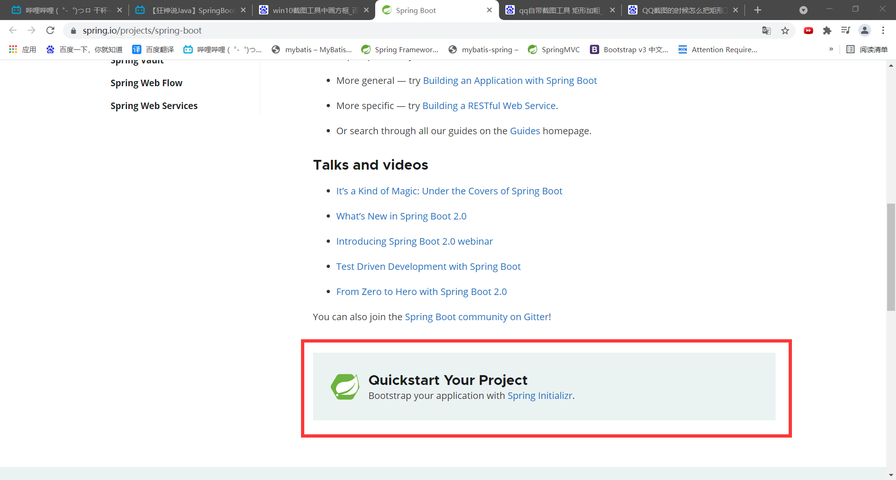
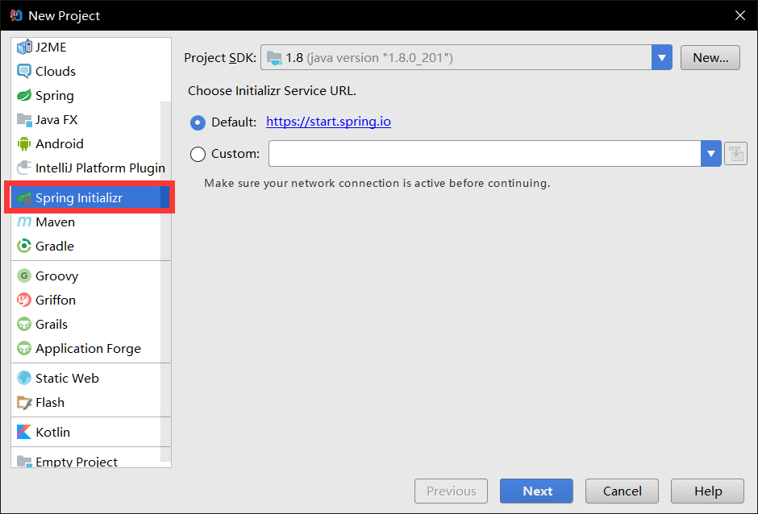
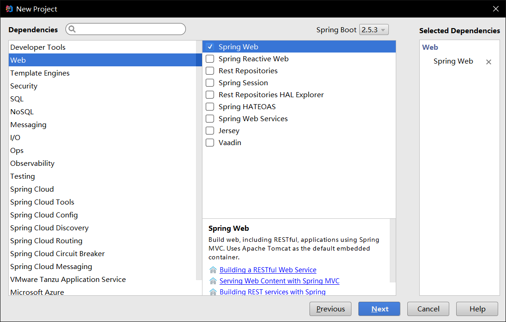
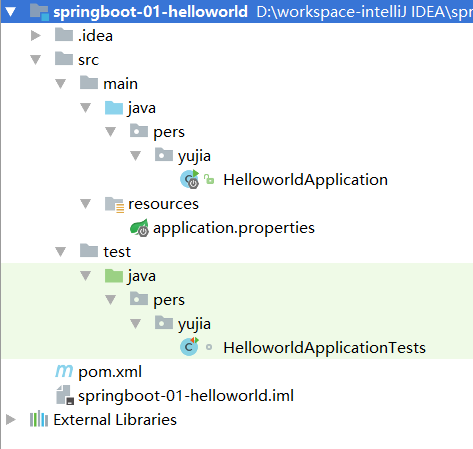
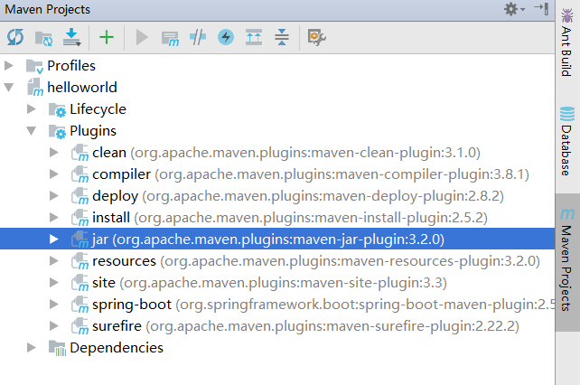
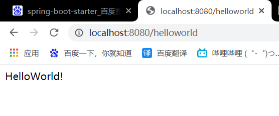
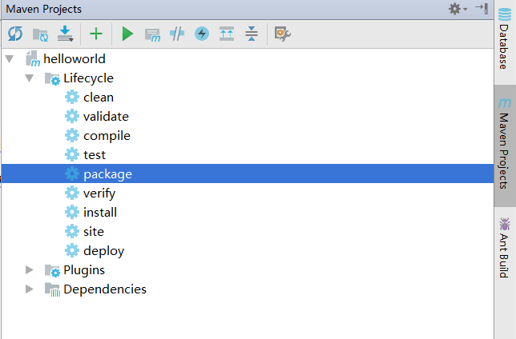
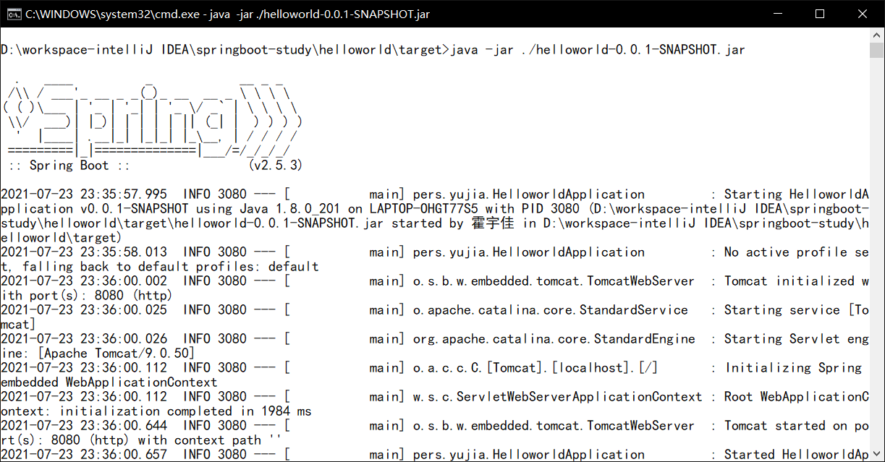

**[SpringBoot官网](https://spring.io/projects/spring-boot)**

# 什么是SpringBoot

​		Spring Boot是由Pivotal团队提供的全新框架，其设计目的是用来**简化新Spring应用的初始搭建以及开发过程**。

> *Spring Boot makes it easy to create stand-alone, production-grade Spring based Applications that you can "just run".*
>
> *We take an opinionated（顽固的） view of the Spring platform and third-party libraries so you can get started with minimum fuss. ==**Most Spring Boot applications need minimal Spring configuration**==.*

​		一言以蔽之，SpringBoot可以简化Spring中繁琐的配置过程，让开发人员能够更快速更便捷地开发一个新的基于Spring的WEB应用程序。但是，SpringBoot的出现并不是为了替代Spring，本身SpringBoot也并不具备Spring的核心特性，SpringBoot只是为了能够更快地构建Spring项目，相当于一个工具。

# SpringBoot的特点

- 创建独立的 Spring 应用程序
- 直接嵌入Tomcat、Jetty或Undertow（无需部署WAR文件）
- 提供“入门”依赖项以简化您的构建配置
- 尽可能自动配置 Spring 和第三方库
- 提供生产就绪功能，例如指标、运行状况检查和外部化配置
- 完全不需要代码生成，也不需要 XML 配置

# 第一个SpringBoot程序

## 方法一：使用SpringBoot官网中的网页进行快速构建



## 方法二：使用idea自带集成的SpringBoot来构建项目



1. 创建一个新项目

2. 选择spring initalizr ， 可以看到默认就是去官网的快速构建工具那里实现

3. 填写项目信息

4. 选择初始化的组件（初学勾选 Web 即可）

   

5. 填写项目路径

6. 等待项目构建成功

----------

构建好的SpringBoot项目如下：



------

# SpringBoot初始构建的几个文件

## 1. HelloworldApplication.java

```java
package pers.yujia;

import org.springframework.boot.SpringApplication;
import org.springframework.boot.autoconfigure.SpringBootApplication;

@SpringBootApplication
public class HelloworldApplication {

	public static void main(String[] args) {
		SpringApplication.run(HelloworldApplication.class, args);
	}

}
```

​		为程序的主启动类，一旦运行该类的main方法，则自动启动默认的Tomcat服务器。之后就可以在浏览器输入url访问资源了。

## 2. pom.xml

**与SpringBoot有关的依赖都以spring-boot-starter开头。**

```xml
<?xml version="1.0" encoding="UTF-8"?>
<project xmlns="http://maven.apache.org/POM/4.0.0" xmlns:xsi="http://www.w3.org/2001/XMLSchema-instance"
	xsi:schemaLocation="http://maven.apache.org/POM/4.0.0 https://maven.apache.org/xsd/maven-4.0.0.xsd">
	<modelVersion>4.0.0</modelVersion>
	<parent>
		<groupId>org.springframework.boot</groupId>
		<artifactId>spring-boot-starter-parent</artifactId>
		<version>2.5.3</version>
		<relativePath/> <!-- lookup parent from repository -->
	</parent>
	<groupId>pers.yujia</groupId>
	<artifactId>helloworld</artifactId>
	<version>0.0.1-SNAPSHOT</version>
	<name>helloworld</name>
	<description>Demo project for Spring Boot</description>
	<properties>
		<java.version>1.8</java.version>
	</properties>
	<dependencies>
		<dependency>
			<groupId>org.springframework.boot</groupId>
			<artifactId>spring-boot-starter-web</artifactId>
		</dependency>

		<dependency>
			<groupId>org.springframework.boot</groupId>
			<artifactId>spring-boot-starter-test</artifactId>
			<scope>test</scope>
		</dependency>
	</dependencies>

	<build>
		<plugins>
			<plugin>
				<groupId>org.springframework.boot</groupId>
				<artifactId>spring-boot-maven-plugin</artifactId>
			</plugin>
		</plugins>
	</build>

</project>
```

1. **org.springframework.boot.spring-boot-starter-web**

   ​		这是Spring Boot的核心启动器，包含了自动配置、日志和YAML。

2. **org.springframework.boot.spring-boot-starter-test**

   ​		用于Spring单元测试。

3. **org.springframework.boot.spring-boot-maven-plugin**

   		

   ​		引入插件。其中的打包插件，可以通过maven的jar命令将项目打成jar包。

## 3. application.properties

​		SpringBoot项目的主要配置文件。

​		如server.port=8081，则默认的服务器端口号改为8081。

## 4. HelloworldApplicationTests.java

```java
package pers.yujia;

import org.junit.jupiter.api.Test;
import org.springframework.boot.test.context.SpringBootTest;

@SpringBootTest
class HelloworldApplicationTests {

	@Test
	void contextLoads() {
	}

}
```

​		用于SpringBoot项目的单元测试。

# 通过主启动类的main方法进行服务器的启动

1. 在HelloworldApplication的同级包下新建一个controller包。必须在同一级包下创建，否则SpringBoot自动扫描无法生效。

2. 新建controller类。

   ```java
   package pers.yujia.controller;
   
   import org.springframework.web.bind.annotation.RequestMapping;
   import org.springframework.web.bind.annotation.RestController;
   
   /**
    * Created by 霍宇佳 on 2021/7/23.
    */
   @RestController
   public class HelloWorldController {
       @RequestMapping("/helloworld")
       public String HelloWorld(){
           return "HelloWorld!";
       }
   }
   ```

3. 启动主程序类的main方法，启动Tomcat。

4. 在浏览器发起请求。



# 通过插件将项目打成jar包，启动服务器

1. **使用插件将项目打成jar包**



​		在实际工作中，我们此处可能会弹出错误，这是因为测试用例错误导致，可以通过跳过测试来发布项目。

```xml
<plugin>
<groupId>org.apache.maven.plugins</groupId>
<artifactId>maven-surefire-plugin</artifactId>
<configuration>
<!--跳过项目运行测试用例-->
    <skipTests>true</skipTests>
</configuration>
</plugin>
```

​		生成的jar包默认在target目录下。

2. **使用控制台的jar命令，启动服务器，部署项目。**

   > *java -jar ./helloworld-0.0.1-SNAPSHOT.jar*



# 更改SpringBoot启动的图片

> ***https://www.bootschool.net/ascii***

将生成图片复制到文本文件中，文本文件命名为banner.txt。

然后将该文件复制到Resource目录下即可。

