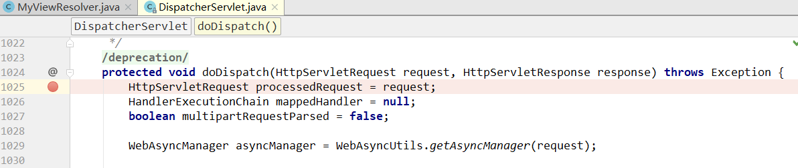
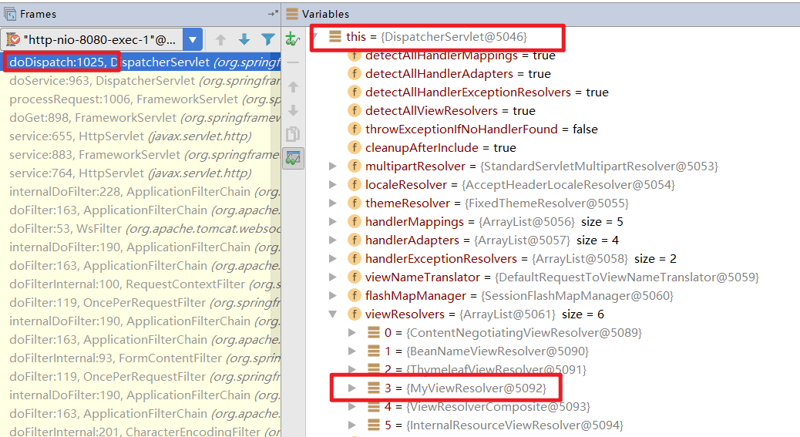
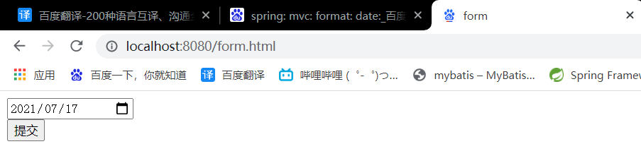
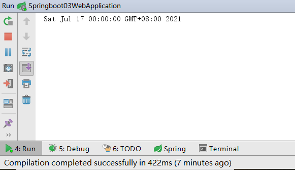

# SpringMVC自动配置

​		在传统的SpringMVC应用程序中，我们需要手动配置`HandlerMapping`，`HandlerAdapter`，`ViewResolver`，以及自动扫描Controller，甚至还需要手动配置不匹配静态资源。但是，使用SpringBoot后，以上的配置通通都不需要我们手动配置。接下来将会分析SpringBoot是如何自动配置SpringMVC的。

[官方文档](https://docs.spring.io/spring-boot/docs/2.6.0-SNAPSHOT/reference/html/web.html#web.servlet.spring-mvc.auto-configuration)

> Spring Boot provides auto-configuration for Spring MVC that works well with most applications.
>
> The auto-configuration adds the following features on top of Spring’s defaults:
>
> - Inclusion of `ContentNegotiatingViewResolver` and `BeanNameViewResolver` beans.
> - Support for serving static resources, including support for WebJars (covered [later in this document](https://docs.spring.io/spring-boot/docs/2.6.0-SNAPSHOT/reference/html/features.html#web.servlet.spring-mvc.static-content)).
> - Automatic registration of `Converter`, `GenericConverter`, and `Formatter` beans.
> - Support for `HttpMessageConverters` (covered [later in this document](https://docs.spring.io/spring-boot/docs/2.6.0-SNAPSHOT/reference/html/features.html#web.servlet.spring-mvc.message-converters)).
> - Automatic registration of `MessageCodesResolver` (covered [later in this document](https://docs.spring.io/spring-boot/docs/2.6.0-SNAPSHOT/reference/html/features.html#web.servlet.spring-mvc.message-codes)).
> - Static `index.html` support.
> - Automatic use of a `ConfigurableWebBindingInitializer` bean (covered [later in this document](https://docs.spring.io/spring-boot/docs/2.6.0-SNAPSHOT/reference/html/features.html#web.servlet.spring-mvc.binding-initializer)).
>
> Spring Boot 为 Spring MVC 提供了自动配置，适用于大多数应用程序。
>
> 自动配置在 Spring 的默认值之上添加了以下功能：
>
> - 包括`ContentNegotiatingViewResolver`和`BeanNameViewResolver`的bean。（视图解析器）
>
> - 支持提供静态资源的文件夹，包括对 WebJars 的支持。
>
> - 自动注册`Converter`，`GenericConverter`和`Formatter`的bean。（类型转换器）
>
>   Converter：用于将网页提交数据到后台自动封装成为对象，比如把"1"字符串自动转换为int类型
>   Formatter：格式化器，比如页面给我们了一个2019-8-10，它会给我们自动格式化为Date对象
>
> - 支持`HttpMessageConverters`。
>
>   convert HTTP requests and responses，可以使用该转换器来实现对象到JSON的自动转换。
>
> - 自动注册`MessageCodesResolver`。
>
>   为错误代码提供错误信息。
>
> - 静态`index.html`支持。
>
> - `ConfigurableWebBindingInitializer`bean 的自动使用。
>
>   初始化数据绑定器：帮我们把请求数据绑定到JavaBean中，参数可以从request或者response中取出。

# ContentNegotiatingViewResolver的作用

​		`ContentNegotiatingViewResolver`即内容协商视图解析器。根据方法的返回值取得视图对象（View），然后由视图对象决定如何渲染（转发，重定向）。

​		首先查看 WebMvcAutoConfiguration ， 然后搜索ContentNegotiatingViewResolver。

```java
@Bean
@ConditionalOnBean(ViewResolver.class)
@ConditionalOnMissingBean(name = "viewResolver", value = ContentNegotiatingViewResolver.class)
public ContentNegotiatingViewResolver viewResolver(BeanFactory beanFactory) {
    ContentNegotiatingViewResolver resolver = new ContentNegotiatingViewResolver();
    resolver.setContentNegotiationManager(beanFactory.getBean(ContentNegotiationManager.class));
    // ContentNegotiatingViewResolver uses all the other view resolvers to locate
    // a view so it should have a high precedence
    resolver.setOrder(Ordered.HIGHEST_PRECEDENCE);
    return resolver;
}
```

​		官方的注释：`ContentNegotiatingViewResolver`使用其他所有的视图解析器来定位一个视图，所以该方法返回的`ContentNegotiatingViewResolver`具有解析器的最高优先级。

​		接下来查看`ContentNegotiatingViewResolver`，该类有一个`resolveViewName()`方法，用于解析视图名字。

## `resolveViewName()`

```java
@Override
@Nullable
public View resolveViewName(String viewName, Locale locale) throws Exception {
    RequestAttributes attrs = RequestContextHolder.getRequestAttributes();
    Assert.state(attrs instanceof ServletRequestAttributes, "No current ServletRequestAttributes");
    List<MediaType> requestedMediaTypes = getMediaTypes(((ServletRequestAttributes) attrs).getRequest());
    if (requestedMediaTypes != null) {
        /*getCandidateViews()获取候选的视图*/
        List<View> candidateViews = getCandidateViews(viewName, locale, requestedMediaTypes);
        /*getBestView()获取最佳视图*/
        View bestView = getBestView(candidateViews, requestedMediaTypes, attrs);
        if (bestView != null) {
            return bestView;
        }
    }

    String mediaTypeInfo = logger.isDebugEnabled() && requestedMediaTypes != null ?
        " given " + requestedMediaTypes.toString() : "";

    if (this.useNotAcceptableStatusCode) {
        if (logger.isDebugEnabled()) {
            logger.debug("Using 406 NOT_ACCEPTABLE" + mediaTypeInfo);
        }
        return NOT_ACCEPTABLE_VIEW;
    }
    else {
        logger.debug("View remains unresolved" + mediaTypeInfo);
        return null;
    }
}
```

### `getCandidateViews()`

```java
private List<View> getCandidateViews(String viewName, Locale locale, List<MediaType> requestedMediaTypes)
    throws Exception {

    List<View> candidateViews = new ArrayList<>();
    if (this.viewResolvers != null) {
        Assert.state(this.contentNegotiationManager != null, "No ContentNegotiationManager set");
        /*遍历所有的视图解析器，依次解析视图名字，如果成功解析则将该视图放进集合中返回*/
        for (ViewResolver viewResolver : this.viewResolvers) {
            View view = viewResolver.resolveViewName(viewName, locale);
            /*直接解析视图名字成功*/
            if (view != null) {
                candidateViews.add(view);
            }
            for (MediaType requestedMediaType : requestedMediaTypes) {
                List<String> extensions = this.contentNegotiationManager.resolveFileExtensions(requestedMediaType);
                for (String extension : extensions) {
                    String viewNameWithExtension = viewName + '.' + extension;
                    view = viewResolver.resolveViewName(viewNameWithExtension, locale);
                    /*解析视图名字加扩展名成功*/
                    if (view != null) {
                        candidateViews.add(view);
                    }
                }
            }
        }
    }
    if (!CollectionUtils.isEmpty(this.defaultViews)) {
        candidateViews.addAll(this.defaultViews);
    }
    return candidateViews;
}
```

### `getBestView()`

```java
@Nullable
private View getBestView(List<View> candidateViews, List<MediaType> requestedMediaTypes, RequestAttributes attrs) {
    for (View candidateView : candidateViews) {
        if (candidateView instanceof SmartView) {
            SmartView smartView = (SmartView) candidateView;
            /*如果视图属于智能视图&&重定向视图，则该视图即最佳视图*/
            if (smartView.isRedirectView()) {
                return candidateView;
            }
        }
    }
    for (MediaType mediaType : requestedMediaTypes) {
        for (View candidateView : candidateViews) {
            if (StringUtils.hasText(candidateView.getContentType())) {
                MediaType candidateContentType = MediaType.parseMediaType(candidateView.getContentType());
                /*如果请求的媒体类型和候选视图的内容类型匹配，则该候选试图即最佳视图*/
                if (mediaType.isCompatibleWith(candidateContentType)) {
                    mediaType = mediaType.removeQualityValue();
                    if (logger.isDebugEnabled()) {
                        logger.debug("Selected '" + mediaType + "' given " + requestedMediaTypes);
                    }
                    attrs.setAttribute(View.SELECTED_CONTENT_TYPE, mediaType, RequestAttributes.SCOPE_REQUEST);
                    return candidateView;
                }
            }
        }
    }
    return null;
}
```

# 自己添加视图解析器

​		`ContentNegotiatingViewResolver`实现了ViewResolver接口，所以猜测所有实现ViewResolver的类都会被自动扫描注册到容器，每当需要视图解析器解析时，就会自动扫描视图解析器，选择最佳的视图解析器解析后的视图。

## 1. 编写自定义视图解析器

```java
package pers.yujia.config;

import org.springframework.lang.Nullable;
import org.springframework.stereotype.Component;
import org.springframework.web.servlet.View;
import org.springframework.web.servlet.ViewResolver;

import java.util.Locale;

/**
 * Created by 霍宇佳 on 2021/7/31.
 */
@Component
public class MyViewResolver implements ViewResolver {
    @Nullable
    @Override
    public View resolveViewName(String viewName, Locale locale) throws Exception {
        return null;
    }
}
```

## 2. 编写配置类

​		由于需要将自定义的视图解析器注册进容器中，所以我们需要自己编写JavaConfig。

```java
package pers.yujia.config;

import org.springframework.beans.factory.annotation.Autowired;
import org.springframework.context.annotation.Bean;
import org.springframework.context.annotation.Configuration;
import org.springframework.web.servlet.ViewResolver;

/**
 * Created by 霍宇佳 on 2021/7/31.
 */
@Configuration

public class MyConfig {
    @Autowired
    private ViewResolver viewResolver;

    public void setViewResolver(ViewResolver viewResolver) {
        this.viewResolver = viewResolver;
    }

    @Bean
    public ViewResolver getViewResolver(){
        return viewResolver;
    }
}
```

## 3. 添加断点

​		由于所有的请求都会经过`DispatcherServlet`类的`doDispatcher()`方法，所以在该方法处添加一个断点。



## 4. 浏览器请求测试

​		SpringBoot进入debug模式，然后在浏览器发出请求。无论是什么请求，自己添加的视图解析器都应该会在解析器列表中。

​		之后查看this的viewResolvers属性。



​		可以看到，我们编写的MyViewResolver视图解析器已经被添加到List。

# 格式器和转换器

- Formatter：格式器，比如页面给我们了一个2019-8-10，它会给我们自动格式化为Date对象

- Converter：转换器，用于将网页提交数据到后台自动封装成为对象，比如把"1"字符串自动转换为int类型

## `WebMvcAutoConfiguration.mvcConversionService()`

```java
@Bean
@Override
public FormattingConversionService mvcConversionService() {
    Format format = this.mvcProperties.getFormat();
    WebConversionService conversionService = new WebConversionService(new DateTimeFormatters() .dateFormat(format.getDate()).timeFormat(format.getTime()).dateTimeFormat(format.getDateTime()));
    addFormatters(conversionService);
    return conversionService;
}
```

其中的`format.getDate()`，`format.getTime()`，`format.getDateTime()`表示获得日期，时间，日期时间格式。

### `format.getDate()`

以`format.getDate()`为例，查看Format类。

```java
@ConfigurationProperties(prefix = "spring.mvc")
public class WebMvcProperties {
    ……    
	public static class Format {
    	private String date;
        
        public String getDate() {
			return this.date;
		}

		public void setDate(String date) {
			this.date = date;
		}
        ……
    }
}
```

因此，我们可以通过配置文件来更改SpringBoot默认的日期格式（默认日期格式为dd/MM/yyyy）。

## 更改请求的日期格式

### 1. 配置文件

```yaml
spring:  mvc:    format:      date: yyyy-MM-dd
```

### 2. 通过网页表单提交日期

```html
<!DOCTYPE html><html lang="en">
    <head> 
        <meta charset="UTF-8"> 
        <title>form</title>
    </head>
    <body> 
        <form action="/format" method="post">   
            <input type="date" name="date"><br>  
            <input type="submit" value="提交">   
        </form>
    </body>
</html>
```

**注意：**

- 如果网页表单的日期标签type="date"，则配置文件中spring.mvc.format.date的分隔符必须为`-`。
- 其他情况，按照表单的日期分隔符填写配置文件中日期的分隔符

### 3. 控制器

```java
package pers.yujia.controller;import org.springframework.stereotype.Controller;
import org.springframework.web.bind.annotation.RequestMapping;
import org.springframework.web.bind.annotation.RestController;
import java.util.Date;
/** 
* Created by 霍宇佳 on 2021/7/31.
*/
@RestControllerpublic class DateController {   
    @RequestMapping("/format")  
    public String format(Date date){    
        System.out.println(date);      
        return date.toString();   
    }
}
```

### 4. 网页测试





# 扩展SpringBoot中的SpringMVC

> If you want to keep those Spring Boot MVC customizations and make more MVC customizations (interceptors, formatters, view controllers, and other features), you can add your own `@Configuration` class of type `WebMvcConfigurer` but **without** `@EnableWebMvc`.
>
> 如果您想保留这些Spring Boot MVC定制并进行更多的MVC定制（拦截器、格式化程序、视图控制器和其他功能），您可以添加自己的`WebMvcConfiguer`类型（实现`WebMvcConfiguer`接口）的`@Configuration`类，但不能带`@EnableWebMvc`。

例子：

```java
package pers.yujia.config;

import org.springframework.beans.factory.annotation.Autowired;
import org.springframework.context.annotation.Bean;
import org.springframework.context.annotation.Configuration;
import org.springframework.web.servlet.ViewResolver;
import org.springframework.web.servlet.config.annotation.ViewControllerRegistry;
import org.springframework.web.servlet.config.annotation.WebMvcConfigurer;

/**
 * Created by 霍宇佳 on 2021/7/31.
 */
@Configuration
public class MyConfig implements WebMvcConfigurer{
    @Override
    public void addViewControllers(ViewControllerRegistry registry) {
        /*uri为/test时显示test视图*/
        registry.addViewController("/test").setViewName("test");
    }
}
```

## 分析底层原理

1. `WebMvcAutoConfiguration`是 SpringMVC的自动配置类，里面有一个静态内部类`WebMvcAutoConfigurationAdapter`

2. `WebMvcAutoConfigurationAdapter`上有一个注解，在做其他自动配置时会导入：`@Import(EnableWebMvcConfiguration.class)`

3. 我们点进`EnableWebMvcConfiguration`这个类看一下，它继承了一个父类：`DelegatingWebMvcConfiguration`

4. 在`DelegatingWebMvcConfiguration`中有一个方法`setConfigurers(List<WebMvcConfigurer> configurers)`

   ```java
   @Configuration(proxyBeanMethods = false)
   public class DelegatingWebMvcConfiguration extends WebMvcConfigurationSupport {
   
       private final WebMvcConfigurerComposite configurers = new WebMvcConfigurerComposite();
   
       @Autowired(required = false)
       public void setConfigurers(List<WebMvcConfigurer> configurers) {
           if (!CollectionUtils.isEmpty(configurers)) {
               this.configurers.addWebMvcConfigurers(configurers);
           }
       }
       ……
   }
   ```

5. 再点进去`addWebMvcConfigurers(configurers)`方法
	```java
   public void addWebMvcConfigurers(List<WebMvcConfigurer> configurers) {
      if (!CollectionUtils.isEmpty(configurers)) {
         this.delegates.addAll(configurers);
      }
   }
   ```
   
   其中，delegates是List。
   
   因此SpringBoot会将所有的WebMvcConfigurer都会添加到List中，所有的WebMvcConfigurer都会被调用。

## 为何不能添加@EnableWebMvc

> If you want to take complete control of Spring MVC, you can add your own `@Configuration` annotated with `@EnableWebMvc`, or alternatively add your own `@Configuration`-annotated `DelegatingWebMvcConfiguration` as described in the Javadoc of `@EnableWebMvc`.
>
> 如果您想完全控制Spring MVC，您可以添加自己的带有“@EnableWebMvc”注释的“@Configuration”，或者添加自己的带有“@Configuration”注释的“DelegatingWebMvcConfiguration”，如“@EnableWebMvc”的Javadoc中所述。

1. 查看`@EnableWebMvc`源码

   ```java
   @Retention(RetentionPolicy.RUNTIME)
   @Target(ElementType.TYPE)
   @Documented
   @Import(DelegatingWebMvcConfiguration.class)
   public @interface EnableWebMvc {
   }
   ```

   发现@EnableWebMvc只是引入了`DelegatingWebMvcConfiguration`这个类。

2. 查看`DelegatingWebMvcConfiguration`源码

   ```java
   @Configuration(proxyBeanMethods = false)
   public class DelegatingWebMvcConfiguration extends WebMvcConfigurationSupport {
   	……
   }
   ```
   
   该类继承了`WebMvcConfigurationSupport`类
   
3.  查看`WebMvcAutoConfiguration`源码

   ```java
   @Configuration(proxyBeanMethods = false)
   @ConditionalOnWebApplication(type = Type.SERVLET)
   @ConditionalOnClass({ Servlet.class, DispatcherServlet.class, WebMvcConfigurer.class })
   @ConditionalOnMissingBean(WebMvcConfigurationSupport.class)
   @AutoConfigureOrder(Ordered.HIGHEST_PRECEDENCE + 10)
   @AutoConfigureAfter({ DispatcherServletAutoConfiguration.class, TaskExecutionAutoConfiguration.class,
                        ValidationAutoConfiguration.class })
   public class WebMvcAutoConfiguration {
       ……
   }
   ```

   该类有一个注解为`@ConditionalOnMissingBean(WebMvcConfigurationSupport.class)`，即如果`WebMvcConfigurationSupport.class`不存在则该配置类生效。

   ​		因此，如果自己编写的WebMvcConfigurer加上了注解`@EnableWebMvc`，相当于引入了`WebMvcConfigurationSupport`，SpringBoot原本的`WebMvcAutoConfiguration`就会失效，SpringBoot自动配置在 Spring 的默认值之上添加了的功能就会全部失效，包括静态资源文件夹，视图解析器等等内容。

