# 准备工作

## pojo

### Department

```java
package pers.yujia.pojo;

import lombok.AllArgsConstructor;
import lombok.Data;
import lombok.NoArgsConstructor;

/**
 * Created by 霍宇佳 on 2021/8/2.
 */
@Data
@AllArgsConstructor
@NoArgsConstructor
public class Department {
    private Integer id;
    private String departmentName;
}

```

### Employee

```java
package pers.yujia.pojo;

import lombok.AllArgsConstructor;
import lombok.Data;
import lombok.NoArgsConstructor;

import java.util.Date;

/**
 * Created by 霍宇佳 on 2021/8/2.
 */
@Data
@AllArgsConstructor
@NoArgsConstructor
public class Employee {
    private Integer id;
    private String lastName;
    private String email;
    private Integer gender; //0：女   1：男
    private Department department;
    private Date birthday;

    public Employee(Integer id, String lastName, String email, Integer gender, Department department) {
        this.id = id;
        this.lastName = lastName;
        this.email = email;
        this.gender = gender;
        this.department = department;
        this.birthday = new Date();
    }
}
```

## dao

### DepartmentDao

```java
package pers.yujia.dao;

import org.springframework.stereotype.Repository;
import pers.yujia.pojo.Department;

import java.util.Collection;
import java.util.HashMap;
import java.util.Map;

/**
 * Created by 霍宇佳 on 2021/8/2.
 */
@Repository
public class DepartmentDao {
    private static Map<Integer,Department> departments = null;

    /*模拟数据库中的数据*/
    static {
        departments = new HashMap<>();
        departments.put(101,new Department(101,"教学部"));
        departments.put(102,new Department(102,"市场部"));
        departments.put(103,new Department(103,"教研部"));
        departments.put(104,new Department(104,"运营部"));
        departments.put(105,new Department(105,"后勤部"));
    }

    /*获取所有的部门信息*/
    public Collection<Department> getAllDepartments(){
        return departments.values();
    }

    /*通过id获取某个部门信息*/
    public Department getDepartmentById(Integer id){
        return departments.get(id);
    }
}
```

### EmployeeDao

```java
package pers.yujia.dao;

import org.springframework.beans.factory.annotation.Autowired;
import org.springframework.stereotype.Repository;
import pers.yujia.pojo.Department;
import pers.yujia.pojo.Employee;

import java.util.Collection;
import java.util.HashMap;
import java.util.Map;

/**
 * Created by 霍宇佳 on 2021/8/2.
 */
@Repository
public class EmployeeDao {
    private static Map<Integer,Employee> employees = null;
    @Autowired
    private static DepartmentDao departmentDao;

    /*模拟数据库中的数据*/
    static {
        employees = new HashMap<>();
        employees.put(1001,new Employee(1001,"AA","AA123456@126.com",1,new Department(101,"教学部")));
        employees.put(1002,new Employee(1002,"BB","BB123456@126.com",0,new Department(102,"市场部")));
        employees.put(1003,new Employee(1003,"CC","CC123456@126.com",1,new Department(103,"教研部")));
        employees.put(1004,new Employee(1004,"DD","DD123456@126.com",0,new Department(104,"运营部")));
        employees.put(1005,new Employee(1005,"EE","EE123456@126.com",1,new Department(105,"后勤部")));
    }

    /*主键自增*/
    private static Integer initId = 1006;

    /*增加员工*/
    public void insertEmployee(Employee employee){
        if (employee.getId() == null){
            employee.setId(initId++);
        }
        employees.put(employee.getId(),employee);
    }

    /*删除员工*/
    public void deleteEmployeeById(Integer id){
        employees.remove(id);
    }

    /*查询所有员工*/
    public Collection<Employee> getAllEmployees(){
        return employees.values();
    }

    /*根据员工id查询某个员工*/
    public Employee getEmployeeById(Integer id){
        return employees.get(id);
    }
}
```

## 静态资源存放位置

- js，css和图片都放在/resource/static文件夹下

- 网页模板放在/resource/template文件夹下

# 网页中的静态资源处理

使用Thymeleaf网页模板时，定义url可以使用@{}的格式。

```html
<link th:href="@{/css/bootstrap.min.css}" rel="stylesheet">
```

这种做法有一种好处就是可以把引用的内容中添加Thymeleaf自己的内容，如：

```html
<a th:href="@{/product/show(skuid=${product.id})}" target="_blank">产品</a>
<a th:href="/product/show?skuid=12" target="_blank">产品</a>
<!--二者效果等同-->
```

或者是

```html
<a th:href="@{'/product/show/'+${product.id}}" target="_blank">产品</a>
<a th:href="/product/show/12" target="_blank">产品</a>
<!--二者效果等同-->
```

修改后可能网页不发生变化，这时候可能是因为缓存，在配置文件中添加下述语句即可解决：

```yaml
spring:
  thymeleaf:
    cache: false
```

此外，如果server.servlet.context-path修改，即项目的url映射修改，上述静态路径也会自动修改。但是传统的方法无法做到自动修改。

# 页面国际化

什么是国际化？不改变页面的代码，使页面在各种语言间切换。

## 1. 设置properties文件编码

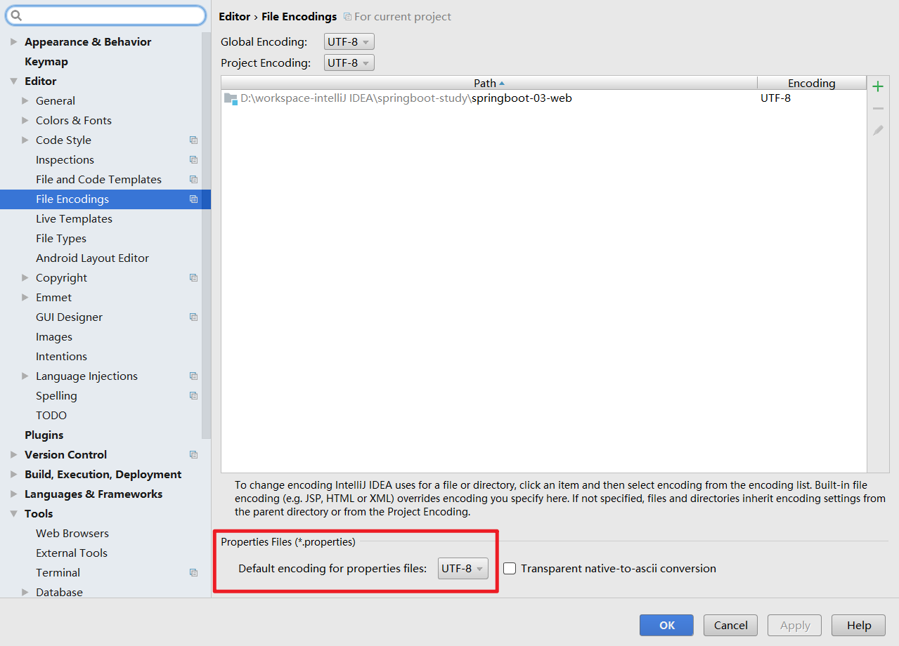

## 2. 配置文件编写

1. 在resource文件夹下添加i18n文件夹(internationalization缩写)。

2. 在i18n文件夹下建立一个login.properties文件和login_zh_CN.properties文件。IDEA自动识别了我们要做国际化操作。

   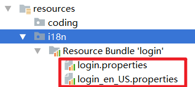

3. 再添加login_en_US.properties文件。

   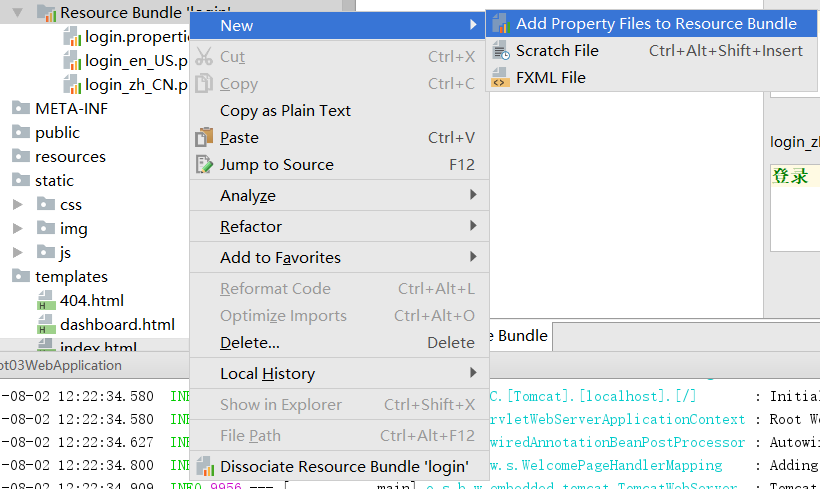

   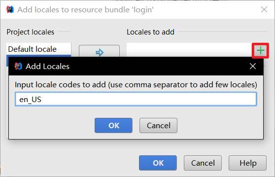

4. 在Resource Bundle可视化视图下添加键值对。

   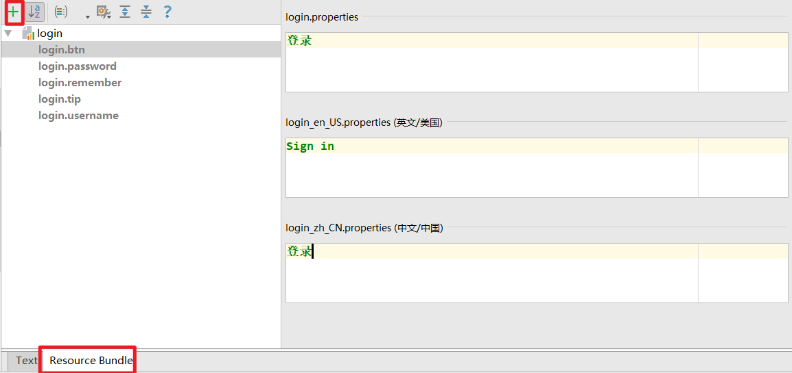

5. 最终的配置文件。

   - login.properties

   ```properties
   login.btn=登录  
   login.password=密码
   login.remember=记住我
   login.tip=请登录
   login.username=用户名
   ```

   - login_zh_CN.properties

   ```properties
   login.btn=登录
   login.password=密码
   login.remember=记住我
   login.tip=请登录
   login.username=用户名
   ```

   - login_en_US.properties

   ```properties
   login.btn=Sign in
   login.password=Password
   login.remember=Remember me
   login.tip=Please sign in
   login.username=Username
   ```

## 3. 使配置文件生效

在`application.yaml`添加下述配置

```yaml
spring:
  messages:
    basename: i18n.login
```

## 4. 配置页面国际化值

Message Expressions: `#{...}`表示获取国际化内容

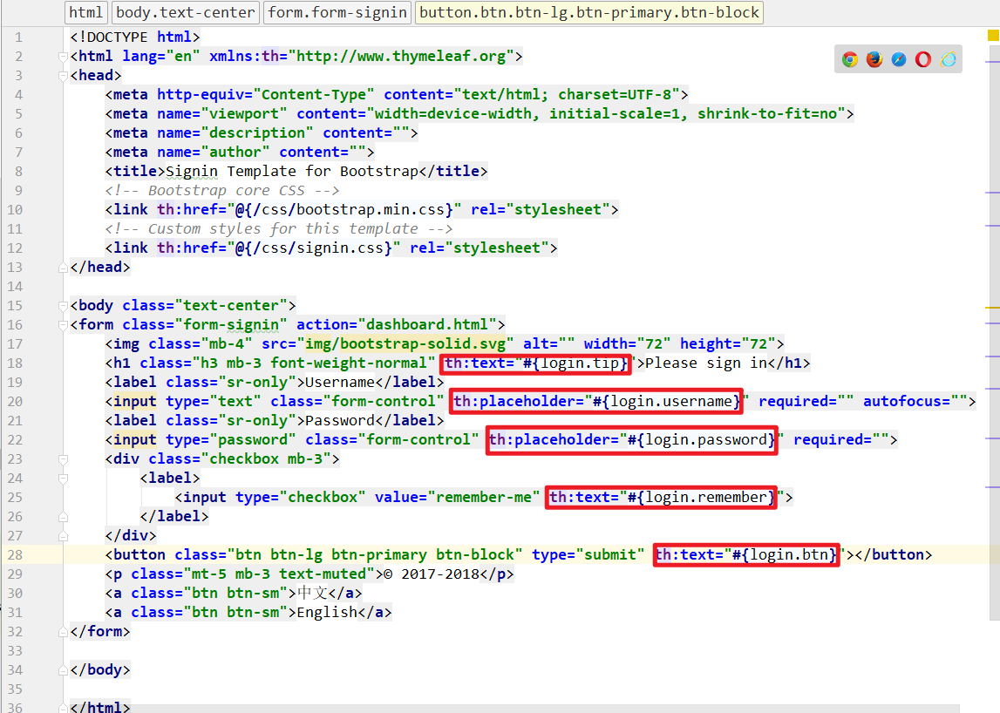

## 5. 通过按钮切换页面语言

现在我们已经配置了页面的信息，并且可以在页面上显示中文字样，下面将介绍如果实现点击按钮来切换页面的语言。

### `WebMvcAutoConfiguration.localeResolver()`

在WebMvcAutoConfiguration类下有一个方法是localeResolver()，即地区解析器。

```java
public class WebMvcAutoConfiguration {
    @Override
    @Bean
    @ConditionalOnMissingBean(name = DispatcherServlet.LOCALE_RESOLVER_BEAN_NAME)
    @SuppressWarnings("deprecation")
    public LocaleResolver localeResolver() {
        if (this.webProperties.getLocaleResolver() == WebProperties.LocaleResolver.FIXED) {
            return new FixedLocaleResolver(this.webProperties.getLocale());
        }
        if (this.mvcProperties.getLocaleResolver() == WebMvcProperties.LocaleResolver.FIXED) {
            return new FixedLocaleResolver(this.mvcProperties.getLocale());
        }
        AcceptHeaderLocaleResolver localeResolver = new AcceptHeaderLocaleResolver();
        Locale locale = (this.webProperties.getLocale() != null) ? this.webProperties.getLocale()
            : this.mvcProperties.getLocale();
        localeResolver.setDefaultLocale(locale);
        return localeResolver;
    }
    ……
}
```

配置的原理也和很多的其他配置类似，都是先搜索用户的自定义地区解析器，如果没有则创建默认的地区解析器。

查看SpringBoot默认的地区解析器AcceptHeaderLocaleResolver，其中有一个方法resolveLocale(HttpServletRequest request)

### `AcceptHeaderLocaleResolver.resolveLocale(HttpServletRequest request)`

```java
public class AcceptHeaderLocaleResolver implements LocaleResolver {
    @Override
    public Locale resolveLocale(HttpServletRequest request) {
        /*Locale.getDefault()涉及操作系统，表示获取操作系统的首选地区和语言*/
        Locale defaultLocale = getDefaultLocale();
        if (defaultLocale != null && request.getHeader("Accept-Language") == null) {
            return defaultLocale;
        }
        Locale requestLocale = request.getLocale();
        List<Locale> supportedLocales = getSupportedLocales();
        if (supportedLocales.isEmpty() || supportedLocales.contains(requestLocale)) {
            return requestLocale;
        }
        Locale supportedLocale = findSupportedLocale(request, supportedLocales);
        if (supportedLocale != null) {
            return supportedLocale;
        }
        return (defaultLocale != null ? defaultLocale : requestLocale);
    }
    ……
}
```

### 自定义地区解析器

```java
package pers.yujia.config;

import org.springframework.lang.Nullable;
import org.springframework.web.servlet.LocaleResolver;
import org.thymeleaf.util.StringUtils;

import javax.servlet.http.HttpServletRequest;
import javax.servlet.http.HttpServletResponse;
import java.util.Locale;

/**
 * Created by 霍宇佳 on 2021/8/2.
 */

public class MyLocaleResolver implements LocaleResolver{
    @Override
    public Locale resolveLocale(HttpServletRequest request) {
        /*Locale.getDefault()涉及操作系统，表示获取操作系统的首选地区和语言*/
        Locale locale = Locale.getDefault();
        String language = request.getParameter("l");
        /*如果有请求的语言及地区，则返回自定义的locale
        * 否则返回默认的locale*/
        if (!StringUtils.isEmpty(language)){
            String[] split = language.split("_");
            locale = new Locale(split[0], split[1]);
        }
        return locale;
    }

    @Override
    public void setLocale(HttpServletRequest request, @Nullable HttpServletResponse response, @Nullable Locale locale) {

    }
}
```

对应的超链接为

```html
<a class="btn btn-sm" th:href="@{/index.html(l='zh_CN')}">中文</a>
<a class="btn btn-sm" th:href="@{/index.html(l='en_US')}">English</a>
```

th:href="@{/index.html(l='zh_CN')}表示请求参数为l='zh_CN'

## 6. 实现效果

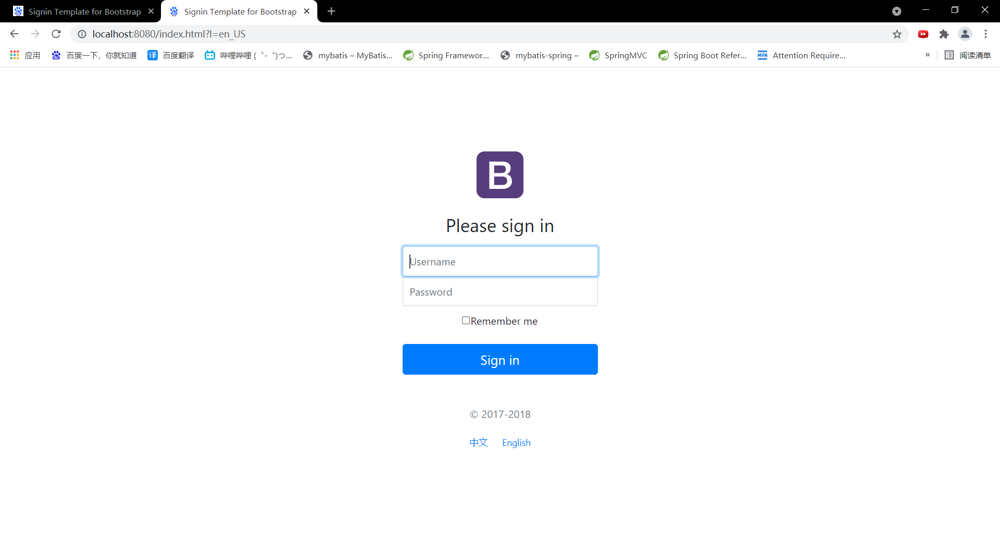


# 登录功能实现

## index.html的改写

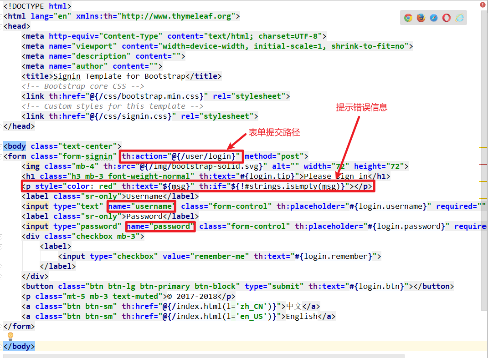

`th:if=${!#strings.isEmpty(msg)}`表示如果msg不为空则显示该p标签，否则不显示该p标签。

## controller

```java
package pers.yujia.controller;

import org.springframework.stereotype.Controller;
import org.springframework.ui.Model;
import org.springframework.web.bind.annotation.RequestMapping;
import org.springframework.web.bind.annotation.RequestParam;

/**
 * Created by 霍宇佳 on 2021/8/2.
 */
@Controller
public class IndexController {
    @RequestMapping({"/","/index.html"})
    public String index(){
        return "index";
    }
    @RequestMapping("/user/login")
    public String login(@RequestParam("username") String username,@RequestParam("password") String password, Model model){
        /*如果用户名和密码正确，则重定向到main.html*/
        if ("张三".equals(username) && "123".equals(password)){
            return "redirect:/main.html";
        }else {
            /*用户名和密码不正确，回到首页并提示错误信息*/
            model.addAttribute("msg","用户名或密码错误");
            return "index";
        }
    }
}
```

`return "redirect:/main.html"`表示重定向到main.html，但是资源里并不存在该页面资源，原因是需要隐藏资源的真实名字。

在`WebMvcConfiguer`类中可以添加下述代码，实现视图解析器的扩展，这样可以隐藏资源的真实名字。

```java
@Override
public void addViewControllers(ViewControllerRegistry registry) {
    registry.addViewController("/main.html").setViewName("dashboard");
}
```

# 使用拦截器设置登录权限

​		一般情况下，只有登录后才能够访问dashboard.html和其他资源。如果不登录直接访问这些资源，应当直接返回到登录页面，并提示相关信息。这些功能可以使用拦截器`HandlerInterceptor`来实现。

## 1. 更改LoginController

​		如何判断用户是否登录，最简单的方法是：

​		登录验证信息时，如果登录成功则在session域中添加用户名字。

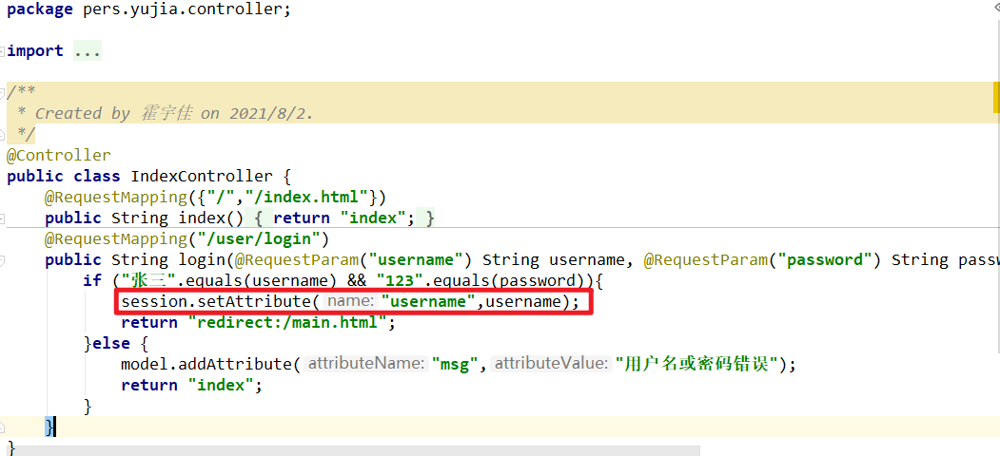

## 2. 拦截器

```java
package pers.yujia.config;

import org.springframework.web.servlet.HandlerInterceptor;

import javax.servlet.http.HttpServletRequest;
import javax.servlet.http.HttpServletResponse;
import javax.servlet.http.HttpSession;

/**
 * Created by 霍宇佳 on 2021/8/3.
 */
public class LoginHandlerInterceptor implements HandlerInterceptor {
    @Override
    public boolean preHandle(HttpServletRequest request, HttpServletResponse response, Object handler) throws Exception {
        HttpSession session = request.getSession();
        if(session.getAttribute("username") == null){
            request.setAttribute("msg","请先登录");
            request.getRequestDispatcher("/index.html").forward(request,response);
            return false;
        }
        return true;
    }
}
```

​		SpringBoot的拦截器和SpringMVC中的拦截器完全一样，都要实现`HandlerInterceptor`接口，重写`preHandler()`或者`postHandler()`方法。

## 3. 在`WebMvcConfigurer`中进行拦截器的注册

```java
@Override
public void addInterceptors(InterceptorRegistry registry) {
    registry.addInterceptor(new LoginHandlerInterceptor()).addPathPatterns("/**").excludePathPatterns("/","/index.html","/user/login","/css/**","/img/**","/js/**");
}
```

​		**注意：**拦截器会将静态资源（js，css，img等）都拦截下来，所以需要排除。

## 4. Thymeleaf模板引擎处理session域和request域的值

- 要想获取session域中属性值attribute，可以用${session.attribute}来获取。

- 要想获取request域中属性值attribute，可以用${attribute}来直接获取。

  控制器Cotroller中model存储的属性值，默认是通过request域存储，所以一般使用请求转发的方式。

# html代码复用

像侧边导航栏和顶部导航栏等内容，都会在多个网页中被反复使用，所以代码复用可以大大减少我们的工作量。

在`templates/commons`文件夹中单独新建一个`common.html`，作为存放重复代码的网页

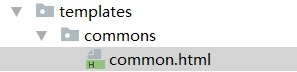

```html
<!DOCTYPE html>
<html lang="en" xmlns:th="http://www.thymeleaf.org">
    <!--顶部导航栏-->
    <nav class="navbar navbar-dark sticky-top bg-dark flex-md-nowrap p-0" th:fragment="topbar" ...></nav>
    <!--侧边导航栏-->
    <nav class="col-md-2 d-none d-md-block bg-light sidebar" th:fragment="sidebar" ...></nav>
</html>
```

使用`th:fragment`来设置复用html代码。

我们可以使用`th:insert`或`th:replace`属性之一轻松地将其包含在我们的主页中。


**th:insert和th:replace（和`th:include`，从 3.0 开始不推荐）有什么区别？**

- `th:insert` 是最简单的：它会简单地插入指定的片段作为其宿主标签的主体。
- `th:replace`实际上用指定的片段替换其主机标记。
- `th:include`与 类似`th:insert`，但它不插入片段，而是仅插入此片段的*内容*

所以一个像这样的 HTML 片段：

```html
<footer th:fragment="copy">
  &copy; 2011 The Good Thymes Virtual Grocery
</footer>
```

在主机`<div>`标签中包含了 3 次，如下所示：

```html
<body>

  ...

  <div th:insert="footer :: copy"></div>

  <div th:replace="footer :: copy"></div>

  <div th:include="footer :: copy"></div>
  
</body>
```

将导致：

```html
<body>

  ...

  <div>
    <footer>
      &copy; 2011 The Good Thymes Virtual Grocery
    </footer>
  </div>

  <footer>
    &copy; 2011 The Good Thymes Virtual Grocery
  </footer>

  <div>
    &copy; 2011 The Good Thymes Virtual Grocery
  </div>
  
</body>
```

# 显示员工列表

## 1. 超链接

在侧边导航栏处设置显示员工列表的超链接

```html
<a th:class="${active=='list.html'?'nav-link active':'nav-link'}" th:href="@{/emps}">
    员工列表
</a>
```

## 2. controller

接着编写控制器`EmployeeController`，将员工集合放到request域中。

```java
package pers.yujia.controller;

@Controller
public class EmployeeController {
    @Autowired
    private EmployeeDao employeeDao;
    @RequestMapping("/emps")
    public String list(Model model){
        Collection<Employee> allEmployees = employeeDao.getAllEmployees();
        model.addAttribute("emps",allEmployees);
        return "emp/list";
    }
}
```

## 3. Thymeleaf遍历员工集合

```html
<table class="table table-striped table-sm">
    <thead>
        <tr>
            <th>id</th>
            <th>lastName</th>
            <th>email</th>
            <th>gender</th>
            <th>department</th>
            <th>birthday</th>
            <th>operation</th>
        </tr>
    </thead>
    <tbody>
        <tr th:each="emp:${emps}">
            <td th:text="${emp.id}"></td>
            <td th:text="${emp.lastName}"></td>
            <td th:text="${emp.email}"></td>
            <td th:text="${emp.gender == 0 ? '女' : '男'}"></td>
            <td th:text="${emp.department.departmentName}"></td>
            <td th:text="${#dates.format(emp.birthday, 'yyyy-MM-dd')}"></td>
            <td>
                <button class="btn btn-sm btn-primary">编辑</button>
                <button class="btn btn-sm btn-danger">删除</button>
            </td>
        </tr>
    </tbody>
</table>
```

- `th:each="emp:${emps}"`表示对于${emps}的结果中的每个元素，使用名为emp的变量重复此模板片段
- th:each放在重复代码的第一个标签。
- 和jsp类似，Thymeleaf的`${对象.属性}`也是默认使用get方法来获取属性值。

# 添加员工

## 1. 跳转到添加员工页面

在显示所有员工信息的页面中添加一个按钮

```html
<h2><a class="btn btn-sm btn-success" th:href="@{/toAdd}">添加员工</a></h2>
```

控制器controller控制跳转到添加员工页面，由于要列表下拉选择部门，所以request域中添加所有部门的信息。

如果是直接跳转到该页面，则不能实现动态添加部门。

```java
@GetMapping("/toAdd")
public String toAdd(Model model){
    Collection<Department> allDepartments = departmentDao.getAllDepartments();
    model.addAttribute("allDepartments",allDepartments);
    return "emp/add";
}
```

## 2. 编写添加员工的页面

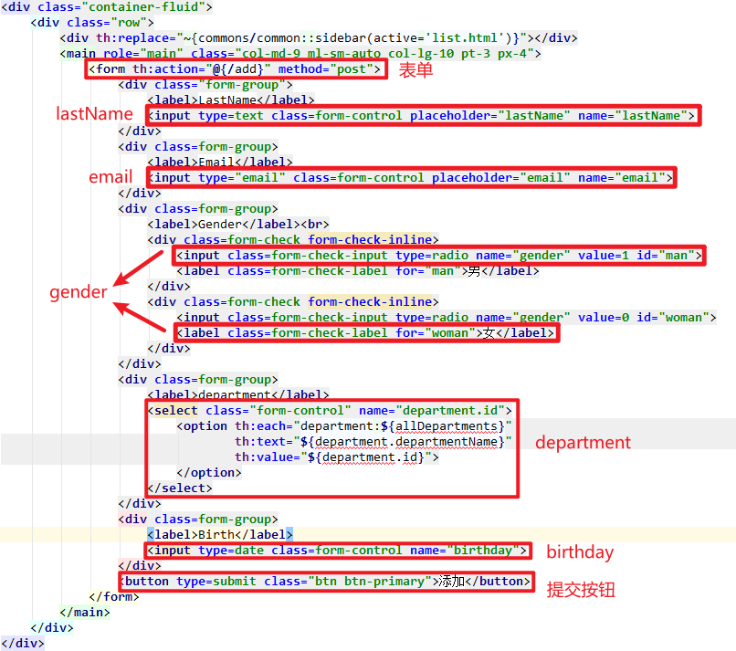

- 在department的下拉列表中，name属性不能是department。因为Employee类中的属性department属性的类型是Department类，如果name=“department”，则自动封装时类型为Integer的id不能转换为Department类型，网页会报错。所以name=“department.id”。

- birthday的标签类型为date，这是html5新增的input标签类型。使用该标签类型时，必须在`application.yaml`更改日期的格式，这样才会自动转换为Date类型。

  ```yaml
  spring:
    mvc:
      format:
        date: yyyy-MM-dd
  ```

## 3. 添加员工的Controller

```java
@PostMapping("/add")
public String add(Employee employee){
    System.out.println(employee);
    employee.setDepartment(departmentDao.getDepartmentById(employee.getDepartment().getId()));
    employeeDao.insertEmployee(employee);
    return "redirect:/emps";
}
```

- 由于传过来的是department.id，所以自动封装时会创建一个departmentName=null的Department类型的对象。需要从departmentDao中查询出id相同的department进行注入。
- 重定向时不能直接转向显示员工列表的页面，需要再经过一次显示员工列表的controller，否则不能显示员工信息。

# 修改员工

## 1. 跳转到修改员工的页面

在显示所有员工信息的页面给每一个员工添加一个修改按钮

```html
<tr th:each="emp:${emps}">
    <td th:text="${emp.id}"></td>
    <td th:text="${emp.lastName}"></td>
    <td th:text="${emp.email}"></td>
    <td th:text="${emp.gender == 0 ? '女' : '男'}"></td>
    <td th:text="${emp.department.departmentName}"></td>
    <td th:text="${#dates.format(emp.birthday, 'yyyy-MM-dd')}"></td>
    <td>
        <a class="btn btn-sm btn-primary" th:href="@{'/toUpdate/'+${emp.id}}">编辑</a>
        <button class="btn btn-sm btn-danger">删除</button>
    </td>
</tr>
```

这里使用的是RESTful风格的请求，利用字符串拼接而成。

也可以用request域来存储：`th:href="@{/toUpdate(id=${emp.id})}"`

对应的跳转Controller如下，由于也包含部门的下拉列表，所以也需要将所有的部门信息存储进model。

```java
@RequestMapping("/toUpdate/{id}")
public String toUpdate(@PathVariable("id")int id,Model model){
    Employee employee = employeeDao.getEmployeeById(id);
    model.addAttribute("emp",employee);
    Collection<Department> allDepartments = departmentDao.getAllDepartments();
    model.addAttribute("allDepartments",allDepartments);
    System.out.println(employee);
    return "emp/update";
}
```

## 2. 编写更改员工的页面

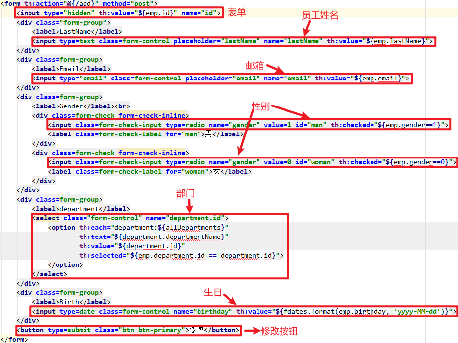

- 由于是修改页面，所以所有的input标签都需要有员工原来的信息。

- 与添加员工不同，修改员工时员工已经有自己的id，所有需要添加一个隐藏的input标签来提交id。

- 部门的下拉列表中需要预先选中员工原有的部门。使用option标签中的selected属性来完成该功能。

  **注意：selected属性是在option标签中，而不是在select标签。**

- 如果要给类型为date的input标签预设值，依旧使用`yyyy-MM-dd`的格式，而不是`yyyy/MM/dd`。

- 修改员工依旧可以使用添加员工的Controller，也可以自己重新编写一个。

# 删除员工

## 1. 添加删除员工按钮

```html
<a class="btn btn-sm btn-danger" th:href="@{'/delete/' + ${emp.id}}">删除</a>
```

## 2. 删除员工的Controller

```java
@GetMapping("/delete/{id}")
public String delete(@PathVariable("id") int id){
    employeeDao.deleteEmployeeById(id);
    return "redirect:/emps";
}
```

# 404页面处理

我们可以自己编写404页面，一旦用户请求服务器中的资源不存在，则跳转到该页面。

在`templates`文件夹中新建一个`error`文件夹，将我们编写的404页面命名为`404.html`，并放到`error`文件夹下。

这样就可以实现自定义的404页面。

# 注销

## 1. 添加注销的超链接

```html
<a class="nav-link" th:href="@{/user/logout}">注销</a>
```

## 2. 注销Controller

```java
@RequestMapping("/user/logout")
public String logout(HttpSession session){
    session.removeAttribute("username");
    return "redirect:/index.html";
}
```

对于网页来说，注销就是移除掉session里面的属性，可以使用`session.removeAttribute`或者`session.invalidate()`。
