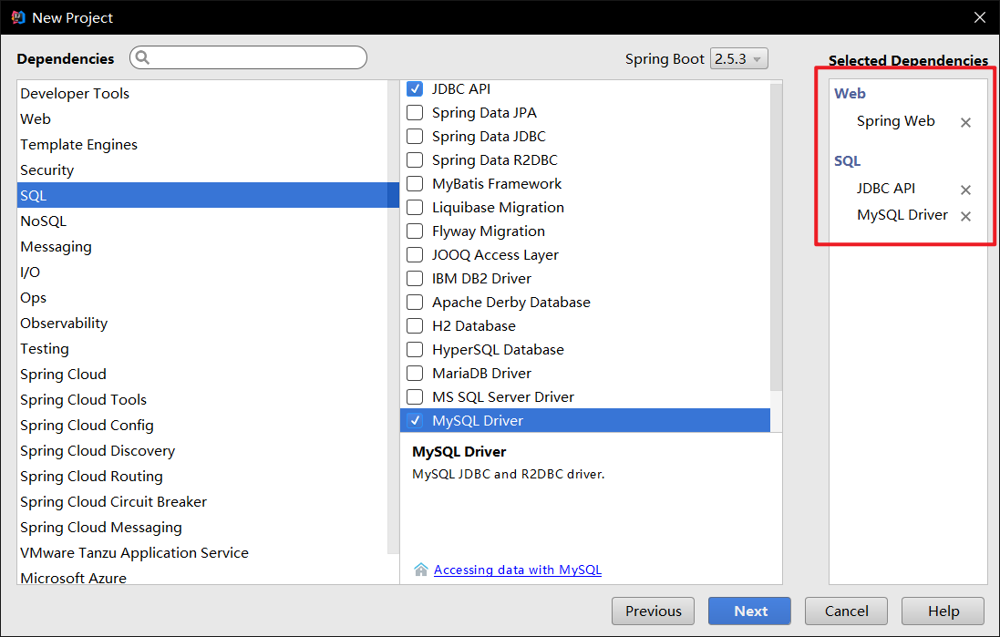

# 环境搭建

## 1. 新建SpringBoot项目



## 2. junit降低版本

​		对于idea2017.1.4版本来说，不支持junit5。所以需要降低junit依赖的版本。

​		首先需要排除junit-jupiter-api的依赖。

```xml
<dependency>
   <groupId>org.springframework.boot</groupId>
   <artifactId>spring-boot-starter-test</artifactId>
          <exclusions>
              <exclusion>
                  <groupId>org.junit.jupiter</groupId>
                  <artifactId>junit-jupiter-api</artifactId>
              </exclusion>
          </exclusions>
   <scope>test</scope>
</dependency>
```

​		接着修改SpringBoot的测试类。

```java
@SpringBootTest
@RunWith(SpringRunner.class)
public class Springboot04DataApplicationTests {

    @Autowired
    @Qualifier("dataSource")
    DataSource dataSource;
    @Test
    public void contextLoads() {
        System.out.println(dataSource.getClass());
    }
}
```

- 需要添加`@RunWith(SpringRunner.class)`注解，表示以SpringBoot启动junit。
- 去掉原来的`@Test`，重新加上`@Test`。
- 类和方法都需要加上public修饰词。

## 3. 配置数据源

在application.yaml中配置jdbc的数据源。

```yaml
spring:
  datasource:
    driver-class-name: com.mysql.jdbc.Driver
    url: jdbc:mysql://localhost:3306/mybatis?useSSL=true&useUnicode=true&characterEncoding=utf-8
    username: "root"
    password: "333"
```

## 4. 测试搭建的环境

SpringBoot测试类如下：

```java
package pers.yujia;

import org.junit.Test;
import org.junit.runner.RunWith;
import org.springframework.beans.factory.annotation.Autowired;
import org.springframework.beans.factory.annotation.Qualifier;
import org.springframework.boot.test.context.SpringBootTest;
import org.springframework.test.context.junit4.SpringRunner;

import javax.sql.DataSource;
import java.sql.Connection;
import java.sql.SQLException;

@SpringBootTest
@RunWith(SpringRunner.class)
public class Springboot04DataApplicationTests {

    @Autowired
    @Qualifier("dataSource")
    DataSource dataSource;

    @Test
    public void contextLoads() throws SQLException {
        System.out.println(dataSource.getClass());
        Connection connection = dataSource.getConnection();
        System.out.println(connection);
        connection.close();
    }

}
```

点击运行后发现`com.zaxxer.hikari.HikariDataSource`为SpringBoot的默认jdbc数据源（和c3p0属于同一类）。

可能出现的异常信息：

- mysql驱动版本为8.0以上，会提示使用`com.mysql.cj.jdbc.Driver`的mysql驱动，而不是`com.mysql.jdbc.Driver`。
- 时区serverTimezone可能报错，url添加参数值：`serverTimezone=Asia/Shanghai`（上海时间）或者`serverTimezone=UTC`（比北京时间慢8小时的世界标准时间）。

# 使用JdbcTemplate来便捷操控数据库

```java
package pers.yujia.controller;

import org.springframework.beans.factory.annotation.Autowired;
import org.springframework.jdbc.core.JdbcTemplate;
import org.springframework.stereotype.Controller;
import org.springframework.web.bind.annotation.PathVariable;
import org.springframework.web.bind.annotation.RequestMapping;
import org.springframework.web.bind.annotation.RestController;
import pers.yujia.pojo.User;

import java.util.List;
import java.util.Map;

/**
 * Created by 霍宇佳 on 2021/8/4.
 */
@RestController
public class UserController {

    @Autowired
    JdbcTemplate jdbcTemplate;

    /*查询所有用户*/
    @RequestMapping("/allUsers")
    public List<Map<String, Object>> allUsers(){
        String sql = "select * from user";
        List<Map<String, Object>> maps = jdbcTemplate.queryForList(sql);
        return maps;
    }

    /*添加用户*/
    @RequestMapping("/addUser")
    public String addUser(){
        String sql = "insert into user values(7,'张三','1234567')";
        jdbcTemplate.update(sql);
        return "addUser OK";
    }

    /*更新用户*/
    @RequestMapping("/updateUser/{id}")
    public String updateUser(@PathVariable("id") int id){
        String sql = "update user set name=?,pwd=? where id=" + id;
        Object[] obj = new Object[2];
        obj[0] = "王五";
        obj[1] = "111111111";
        jdbcTemplate.update(sql,obj);
        return "updateUser OK";
    }

    /*删除用户*/
    @RequestMapping("/deleteUser/{id}")
    public String deleteUser(@PathVariable("id") int id){
        String sql = "delete from user where id = " + id;
        jdbcTemplate.update(sql);
        return "deleteUser OK";
    }
}
```

**注意：**

- `jdbcTemplate.queryForList(String sql)`返回的是`List<Map<String,Object>>`

  List集合中每个Map都代表一个对象。

  每个Map中的key代表属性名字段，value代表对应的值。

- 增删改都是直接使用`jdbcTemplate.update(String sql,Object[])`。
- 无论增删改都不需要手动提交事务，说明`JdbcTemplate`已经自动提交了事务。

