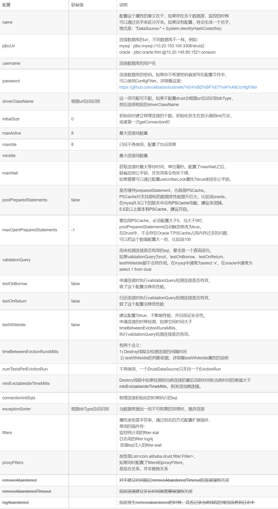
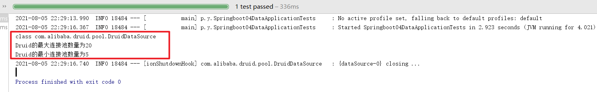
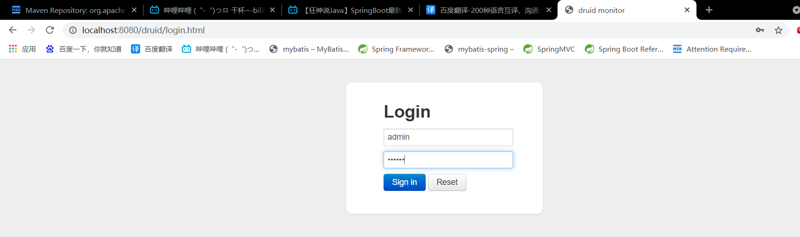

# Druid简介

​		之前我们已经了解过C3P0,DPCP,hikari等数据库连接池。现在来介绍Druid。

​		Druid是Java语言中最好的数据库连接池。Druid能够提供强大的监控和扩展功能。我们可以通过Druid配置的后台监控，来清晰地观察数据库的访问情况。

​		GitHub地址：[https://github.com/alibaba/druid](https://github.com/alibaba/druid)
​		
​		Druid的基本配置参数如下：
​		

# 配置Druid数据源

## 1. 引入Druid依赖

```xml
<!-- https://mvnrepository.com/artifact/com.alibaba/druid -->
<dependency>
    <groupId>com.alibaba</groupId>
    <artifactId>druid</artifactId>
    <version>1.2.6</version>
</dependency>
```

## 2. 数据源配置文件

​		SpringBoot默认的数据源为hikari，需要将其更改。

```yaml
spring:
  datasource:
    driver-class-name: com.mysql.cj.jdbc.Driver
    url: jdbc:mysql://localhost:3306/mybatis?useSSL=true&useUnicode=true&characterEncoding=utf-8
    username: "root"
    password: "333"
    #更换SpringBoot的数据源为Druid
    type: com.alibaba.druid.pool.DruidDataSource
```

## 3. Druid的基本配置参数

Druid的相关配置参数一般公司都会给，只需要了解参数的大致意思即可。

```yaml
#Spring Boot 默认是不注入这些属性值的，需要自己绑定
#druid 数据源专有配置
initialSize: 5
minIdle: 5
maxActive: 20
maxWait: 60000
timeBetweenEvictionRunsMillis: 60000
minEvictableIdleTimeMillis: 300000
validationQuery: SELECT 1 FROM DUAL
testWhileIdle: true
testOnBorrow: false
testOnReturn: false
poolPreparedStatements: true
#配置监控统计拦截的filters，stat:监控统计、log4j：日志记录、wall：防御sql注入
#如果运行时报错 java.lang.ClassNotFoundException: org.apache.log4j.Priority
#则导入log4j依赖即可，需要2.0以下的版本
filters: stat,wall,log4j
maxPoolPreparedStatementPerConnectionSize: 20
useGlobalDataSourceStat: true
connectionProperties: druid.stat.mergeSql=true;druid.stat.slowSqlMillis=500
```

## 4. 使Druid配置参数生效

​		不同于默认的数据源自动配置参数，Druid数据源需要我们在配置文件中注册（一般在JavaConfig），并且同时配置属性值。

```java
package pers.yujia.config;

import com.alibaba.druid.pool.DruidDataSource;
import org.springframework.beans.factory.annotation.Autowired;
import org.springframework.boot.context.properties.ConfigurationProperties;
import org.springframework.context.annotation.Bean;
import org.springframework.context.annotation.Configuration;

import javax.sql.DataSource;

/**
 * Created by 霍宇佳 on 2021/8/5.
 */
@Configuration
public class MyConfig {
    @Bean
    @ConfigurationProperties(prefix = "spring.datasource")
    public DataSource dataSource(){
        return new DruidDataSource();
    }
}
```

## 5. 进行测试

在SpringBoot的测试类中进行测试。

```java
package pers.yujia;

import com.alibaba.druid.pool.DruidDataSource;
import org.junit.Test;
import org.junit.runner.RunWith;
import org.springframework.beans.factory.annotation.Autowired;
import org.springframework.beans.factory.annotation.Qualifier;
import org.springframework.boot.test.context.SpringBootTest;
import org.springframework.test.context.junit4.SpringRunner;

import javax.sql.DataSource;
import java.sql.Connection;
import java.sql.SQLException;

@SpringBootTest
@RunWith(SpringRunner.class)
public class Springboot04DataApplicationTests {

    @Autowired
    @Qualifier("dataSource")
    DataSource dataSource;

    @Test
    public void contextLoads() throws SQLException {
        DruidDataSource druidDataSource = (DruidDataSource)dataSource;
        System.out.println(druidDataSource.getClass());
        System.out.println("Druid的最大连接池数量为" + druidDataSource.getMaxActive());
        System.out.println("Druid的最小连接池数量为" + druidDataSource.getMinIdle());
    }

}
```



# 配置Druid的数据源监控

​		Druid的核心功能就在于它强大的监控，并提供了一个web页面来让管理者便捷地查看数据库的访问情况。

## 1. 设置Druid的后台访问界面

```java
@Bean
public ServletRegistrationBean<StatViewServlet> statViewServletServletRegistrationBean(){
    
    ServletRegistrationBean<StatViewServlet> bean = new ServletRegistrationBean<>(new StatViewServlet(),"/druid/*");
    
    Map<String,String> initParameters = new HashMap<>();

    /*只有本机可以访问：initParameters.put("loginUsername","localhost");*/
    /*拒绝某个ip地址访问：initParameters.put("kuangshen","192.168.1.20")*/
    /*允许所有人都可以访问*/
    initParameters.put("allow","");

    /*设置登录用户名和密码*/
    initParameters.put("loginUsername","admin");
    initParameters.put("loginPassword","123456");
    
    bean.setInitParameters(initParameters);
    return bean;
}
```

​		在SpringBoot中没有web.xml，所以可以通过这种注册bean的方式来设置servlet。

​		其中，`ServletRegistrationBean(T servlet, String... urlMappings)`的第一个参数为servlet类，第二个参数为映射的url。

## 2. Druid的后台页面

​		配置完之后启动SpringBoot服务，通过localhost:8080/druid来访问后台界面。



## 3. 设置过滤器

​		和Servlet类似，Filter也可以使用JavaConfig的方式来注册。

```java
@Bean
public FilterRegistrationBean bean(){
    FilterRegistrationBean<WebStatFilter> bean = new FilterRegistrationBean<>(new WebStatFilter());
    Map<String,String> initParameters = new HashMap<>();
    /*过滤这些请求，使其不被统计*/
    initParameters.put("exclusions", "*.js,*.css,/druid/*,/jdbc/*");
    bean.setInitParameters(initParameters);
    return bean;
}
```

