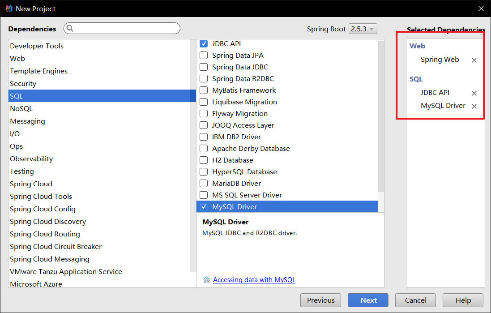
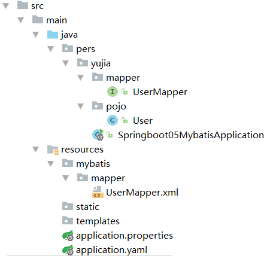

#    1. 创建SpringBoot项目



# 2. 导入相关依赖

需要导入SpringBoot关于mybatis的启动器

```xml
<!-- https://mvnrepository.com/artifact/org.mybatis.spring.boot/mybatis-spring-boot-starter -->
<dependency>
    <groupId>org.mybatis.spring.boot</groupId>
    <artifactId>mybatis-spring-boot-starter</artifactId>
    <version>2.2.0</version>
</dependency>
```

需要降低junit版本

```xml
<dependency>
    <groupId>org.springframework.boot</groupId>
    <artifactId>spring-boot-starter-test</artifactId>
    <exclusions>
        <exclusion>
            <groupId>org.junit.jupiter</groupId>
            <artifactId>junit-jupiter-api</artifactId>
        </exclusion>
    </exclusions>
    <scope>test</scope>
</dependency>
<dependency>
    <groupId>junit</groupId>
    <artifactId>junit</artifactId>
</dependency>
```

需要导入lombok依赖

```xml
<dependency>
            <groupId>org.projectlombok</groupId>
            <artifactId>lombok</artifactId>
</dependency>
```

# 3. 配置数据源和MyBatis相关配置

选择SpringBoot默认的数据源hikara，在application.yaml配置数据源如下：

```yaml
spring:
  datasource:
    driver-class-name: com.mysql.cj.jdbc.Driver
    url: jdbc:mysql://localhost:3306/mybatis?useSSL=true&useUnicode=true&characterEncoding=utf-8
    username: root
    password: 333
```

也可以在该配置文件下同时配置MyBatis，如下：

```yaml
mybatis:
  #mapper文件存放位置。"classpath:"后不能加"/"
  #否则表示项目名下面的mybatis文件夹，而不是resource文件夹下面的mybatis文件夹
  mapper-locations: classpath:mybatis/mapper/*.xml
  #别名，所有pojo包下面的完整类名都可以用首字母小写的类名代替
  type-aliases-package: pers.yujia.pojo
  #config-location: 可以表示mybatis-config.xml的位置
```

# 4. pojo和mapper

包结构如下：



pojo类如下：

```java
package pers.yujia.pojo;

import lombok.AllArgsConstructor;
import lombok.Data;
import lombok.NoArgsConstructor;
import org.springframework.beans.factory.annotation.Autowired;

/**
 * Created by 霍宇佳 on 2021/8/5.
 */
@Data
@NoArgsConstructor
@AllArgsConstructor
public class User {
    private int id;
    private String name;
    private String pwd;
}
```

UserMapper接口如下：

```java
package pers.yujia.mapper;

import org.apache.ibatis.annotations.Mapper;
import org.apache.ibatis.annotations.Param;
import org.springframework.stereotype.Repository;
import pers.yujia.pojo.User;

import java.util.List;

/**
 * Created by 霍宇佳 on 2021/8/5.
 */
/*@Mapper:表示本类是一个 MyBatis 的 Mapper*/
@Mapper
/*@Repository注册到容器*/
@Repository
public interface UserMapper {
    public List<User> selectAllUsers();
    public User selectUserById(@Param("id") int id);
    public void insertUser(User user);
    public void deleteUserById(@Param("id") int id);
    public void updateUser(User user);
}
```

UserMapper.xml如下:

```xml
<?xml version="1.0" encoding="UTF-8" ?>
<!DOCTYPE mapper
        PUBLIC "-//mybatis.org//DTD Mapper 3.0//EN"
        "http://mybatis.org/dtd/mybatis-3-mapper.dtd">
<mapper namespace="pers.yujia.mapper.UserMapper">
    <select id="selectAllUsers" resultType="user">
        select * from user;
    </select>
    <select id="selectUserById" resultType="user" parameterType="int">
        select * from user
        <where>
            and id = #{id}
        </where>
    </select>
    <insert id="insertUser" parameterType="user">
        insert into user values(#{id},#{name},#{pwd})
    </insert>
    <delete id="deleteUserById" parameterType="int">
        delete from user
        <where>
            and id = #{id}
        </where>
    </delete>
    <update id="updateUser" parameterType="user">
        update user set name=#{name},pwd=#{pwd}
        <where>
            id = #{id}
        </where>
    </update>
</mapper>
```

# 5. controller

```java
package pers.yujia.controller;

import org.springframework.beans.factory.annotation.Autowired;
import org.springframework.stereotype.Controller;
import org.springframework.web.bind.annotation.PathVariable;
import org.springframework.web.bind.annotation.RequestMapping;
import org.springframework.web.bind.annotation.RestController;
import pers.yujia.mapper.UserMapper;
import pers.yujia.pojo.User;

import java.util.List;

/**
 * Created by 霍宇佳 on 2021/8/6.
 */
@RestController
public class UserController {
    @Autowired
    UserMapper userMapper;
    @RequestMapping("/selectAllUsers")
    public List<User> selectAllUsers(){
        return userMapper.selectAllUsers();
    }
    @RequestMapping("/selectUserById/{id}")
    public User selectUserById(@PathVariable("id") int id){
        return userMapper.selectUserById(id);
    }
    @RequestMapping("/insertUser")
    public String insertUser(){
        userMapper.insertUser(new User(7,"李六","12145"));
        return "insertUser OK";
    }
    @RequestMapping("/deleteUserById/{id}")
    public String deleteUserById(@PathVariable("id") int id){
        userMapper.deleteUserById(id);
        return "deleteUserById OK";
    }
    @RequestMapping("/updateUser")
    public String updateUser(){
        userMapper.updateUser(new User(5,"李无","12145"));
        return "updateUser OK";
    }
}
```

