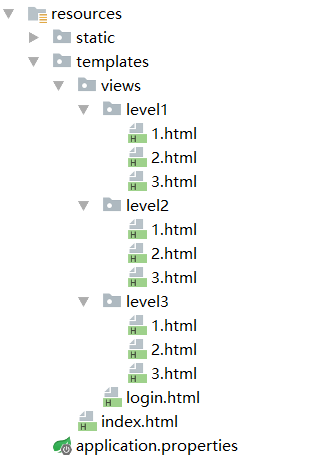
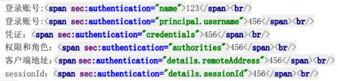

# Spring Security概述

> Spring Security is a powerful and highly customizable authentication and access-control framework. It is the de-facto standard for securing Spring-based applications.
>
> Spring Security is a framework that focuses on providing both authentication and authorization to Java applications. Like all Spring projects, the real power of Spring Security is found in how easily it can be extended to meet custom requirements
>
> Spring Security 是一个功能强大且高度可定制的身份验证和访问控制框架。它实际是保护基于 Spring 的应用程序上的标准。
>
> Spring Security 是一个专注于为 Java 应用程序提供身份验证和授权的框架。与所有 Spring 项目一样，Spring Security 的真正强大之处在于它可以轻松扩展以满足自定义要求。

​		在Web应用中，安全需要在项目的一开始就应该被考虑。一方面，如果在项目上线之后再考虑安全，可能会存在巨大的安全漏洞，极有可能会威胁到用户的信息隐私；另一方面，如果在项目整体架构确定之后再考虑安全，可能需要对项目的整体架构进行很大的调整，费时费力。因此，安全应该贯穿项目的开发始终。

​		在Spring Security中，可以整体分为**授权(Authorization)**和**认证(authentication)**两大部分。

​		**授权**又可以分为功能权限，菜单权限，访问权限。即授予用户某种行为的权限。**认证**是指验证某个用户是否为系统中的合法主体，也就是说用户能否访问该系统。现在一般的Web应用都是通过用户名和密码来进行认证，同时根据判断用户身份来授予用户的权限，因此授权和认证一般是相辅相成。

​		在使用Spring Sucurity之前，授权和认证往往要通过繁琐的过滤器或者拦截器来实现，使用Spring Sucurity可以简化代码，快速实现授权和认证。

# Spring Security特点

- 对身份验证和授权的全面且可扩展的支持
- 防止会话固定、点击劫持、跨站点请求伪造等攻击
- Servlet API 集成
- 与 Spring Web MVC 的可选集成
- 等等

# 搭建环境

## 1. 导入Spring Srcurity依赖

```xml
<dependency>
   <groupId>org.springframework.boot</groupId>
   <artifactId>spring-boot-starter-security</artifactId>
</dependency>
```

## 2. 导入静态资源



## 3. 控制页面跳转Controller

```java
package pers.yujia.controller;

import org.springframework.stereotype.Controller;
import org.springframework.web.bind.annotation.PathVariable;
import org.springframework.web.bind.annotation.RequestMapping;

/**
 * Created by 霍宇佳 on 2021/8/6.
 */
@Controller
public class RouteController {
    @RequestMapping({"/","/index"})
    public String index(){
        return "index";
    }

    @RequestMapping("/toLogin")
    public String toLogin(){
        return "views/login";
    }

    @RequestMapping("/level1/{id}")
    public String level1(@PathVariable("id") int id){
        return "views/level1/" + id;
    }
    @RequestMapping("/level2/{id}")
    public String level2(@PathVariable("id") int id){
        return "views/level2/" + id;
    }
    @RequestMapping("/level3/{id}")
    public String level3(@PathVariable("id") int id){
        return "views/level3/" + id;
    }
}
```

# Spring Security初体验

在Spring Security中，需要记住三个类：

- `WebSecurityConfigurerAdapter`：Web安全配置适配器，我们的安全配置需要继承该类并重写里面的方法。
- `AuthenticationManagerBuilder`：认证管理，通过该类可以指定用户具有某些权限。
- `@EnableWebSecurity`：配置类注解，标注该类为Spring Security配置类。

## 认证和授权

- **“认证”（Authentication）**
  身份验证是关于验证您的凭据，如用户名/用户ID和密码，以验证您的身份。
  身份验证通常通过用户名和密码完成，有时与身份验证因素结合使用。
- **“授权” （Authorization）**
  授权发生在系统成功验证您的身份后，最终会授予您访问资源（如信息，文件，数据库，资金，位置，几乎任何内容）的完
  全权限。

### 1. 编写Spring Security配置类

```java
@EnableWebSecurity
public class Config extends WebSecurityConfigurerAdapter {
    ……
}
```

### 2. 进行网页资源的访问权限控制

```java
@Override
protected void configure(HttpSecurity http) throws Exception {
    http
        .formLogin()
        .and().authorizeRequests()
        .antMatchers("/level1/**").hasRole("level1")
        .antMatchers("/level2/**").hasRole("level2")
        .antMatchers("/level3/**").hasRole("level3")
        .antMatchers("/").permitAll();
}
```

**注意：antMatchers和mvcMatchers的区别：**

- `antMatchers("/secured")`仅匹配*确切的* `/secured` URL。
- `mvcMatchers("/secured")`匹配`/secured`以及`/secured/`，`/secured.html`，`/secured.xyz`，因此更通用，还可以处理一些可能的配置错误。
- `formLogin()`：没有权限会默认跳到登录页面。

### 3. 进行登录用户的认证和授权

```java
@Override
protected void configure(AuthenticationManagerBuilder auth) throws Exception {
    BCryptPasswordEncoder passwordEncoder = new BCryptPasswordEncoder();
    auth.inMemoryAuthentication().passwordEncoder(passwordEncoder)
        .withUser("root").password(passwordEncoder.encode("123456")).roles("level1","level2","level3")
        .and().withUser("huoyujia").password(passwordEncoder.encode("12345")).roles("level1","level2")
        .and().withUser("guest").password(passwordEncoder.encode("123")).roles("level1");
}
```

**注意：**

- 在Spring Security高版本中必须要指定编码器。指定的编码器必须要和密码的编码器相同。

- 如果要使用`SCryptPasswordEncoder`，必须要添加以下依赖

  ```xml
  <!-- https://mvnrepository.com/artifact/org.bouncycastle/bcprov-jdk15on -->
  <dependency>
      <groupId>org.bouncycastle</groupId>
      <artifactId>bcprov-jdk15on</artifactId>
      <version>1.69</version>
  </dependency>
  ```

## 注销

  ### 1. 在配置文件中开启注销功能

```java
@Override
protected void configure(HttpSecurity http) throws Exception {
    ……
    http.logout();
}
```

### 2. 在首页中添加注销按钮

```html
<a class="item" th:href="@{/logout}">
    <i class="sign-out card icon"></i> 注销
</a>
```

### 3. 指定注销后的跳转页面

默认注销后跳转到的页面是登录页面，我们可以指定该页面。

```java
@Override
protected void configure(HttpSecurity http) throws Exception {
    ……
    http.logout().logoutSuccessUrl("/");
}
```

## 不同用户显示不同页面

​		由于不同用户的权限不同，所以可以千人千页，每个用户都有属于自己的页面设置。比如登录后的页面没有登录按钮；注销后的页面没有注销按钮；不同等级的用户显示的内容不同等等。

​		这时候需要结合Thymeleaf与Spring Security的整合包来实现。

### 1. 导入依赖

```xml
<!-- https://mvnrepository.com/artifact/org.thymeleaf.extras/thymeleaf-extras-springsecurity5 -->
<dependency>
    <groupId>org.thymeleaf.extras</groupId>
    <artifactId>thymeleaf-extras-springsecurity5</artifactId>
    <version>3.0.4.RELEASE</version>
</dependency>
```

### 2. 修改前端页面

​		

​		首先需要添加命名空间：`xmlns:sec="http://www.thymeleaf.org/extras/spring-security"`

​		其次修改按钮，使用`sec:authorize="!isAuthenticated()"`来判断用户是否登录。

```html
<!--未登录-->
<a class="item" th:href="@{/toLogin}" sec:authorize="!isAuthenticated()">
    <i class="address card icon"></i> 登录
</a>
<!--已登录-->
<a class="item" th:href="@{/logout}" sec:authorize="isAuthenticated()">
    <i class="sign-out card icon"></i> 注销
</a>
```

​		其次修改登录后显示用户名和权限，不登录则不显示。

​		使用`sec:authentication="principal.username"`取出用户名，使用`sec:authentication="principal.authorities"`取出用户权限。

```html
<!--未登录-->
<a class="item" th:href="@{/toLogin}" sec:authorize="!isAuthenticated()">
    <i class="address card icon"></i> 登录
</a>
<!--已登录-->
<span class="item">
    <i class="user icon" sec:authorize="isAuthenticated()"></i>
    <span sec:authentication="principal.username" sec:authorize="isAuthenticated()">
    </span>
</span>
<span class="item">
    <i class="id card icon" sec:authorize="isAuthenticated()"></i>
    <span sec:authentication="principal.authorities" sec:authorize="isAuthenticated()"></span>
</span>
```

​		接着改变不同权限所显示的页面内容。

​		使用`sec:authorize="hasRole('level1')"`判断用户是否具有该权限。

```html
<div class="column" sec:authorize="hasRole('level1')">
    <div class="ui raised segment">
        <div class="ui">
            <div class="content">
                <h5 class="content">Level 1</h5>
                <hr>
                <div><a th:href="@{/level1/1}"><i class="bullhorn icon"></i> Level-1-1</a></div>
                <div><a th:href="@{/level1/2}"><i class="bullhorn icon"></i> Level-1-2</a></div>
                <div><a th:href="@{/level1/3}"><i class="bullhorn icon"></i> Level-1-3</a></div>
            </div>
        </div>
    </div>
</div>

<div class="column" sec:authorize="hasRole('level2')">
    <div class="ui raised segment">
        <div class="ui">
            <div class="content">
                <h5 class="content">Level 2</h5>
                <hr>
                <div><a th:href="@{/level2/1}"><i class="bullhorn icon"></i> Level-2-1</a></div>
                <div><a th:href="@{/level2/2}"><i class="bullhorn icon"></i> Level-2-2</a></div>
                <div><a th:href="@{/level2/3}"><i class="bullhorn icon"></i> Level-2-3</a></div>
            </div>
        </div>
    </div>
</div>

<div class="column" sec:authorize="hasRole('level3')">
    <div class="ui raised segment">
        <div class="ui">
            <div class="content">
                <h5 class="content">Level 3</h5>
                <hr>
                <div><a th:href="@{/level3/1}"><i class="bullhorn icon"></i> Level-3-1</a></div>
                <div><a th:href="@{/level3/2}"><i class="bullhorn icon"></i> Level-3-2</a></div>
                <div><a th:href="@{/level3/3}"><i class="bullhorn icon"></i> Level-3-3</a></div>
            </div>
        </div>
    </div>
</div>
```

## 自定义登录页面

​		之前我们一直使用的是Spring Security自带的登录页面，但实际开发一定是使用我们自己的登录页面。

​		可以在配置类里指定我们的自定义登录页面。如下表示我们的登陆页面为“/toLogin”。

```java
@Override
protected void configure(HttpSecurity http) throws Exception {
    http.formLogin().loginPage("/toLogin");
}
```

​		指定登录页面后，再指定表单提交的url。该url需要与表单中form标签的action属性保持一致。

```java
@Override
protected void configure(HttpSecurity http) throws Exception {
    http.formLogin().loginPage("/toLogin").loginProcessingUrl("/login");
}
```

​		接着开启记住用户名密码功能。

```java
@Override
protected void configure(HttpSecurity http) throws Exception {
    http.rememberMe().rememberMeParameter("remember-me");
}
```

​		在表单中添加“记住我”的checkbox。

```html
<div class="field">
    <span>
        <input style="vertical-align: middle" type="checkbox" id="remember-me"
               name="remember-me"/>
        <label for="remember-me" style="vertical-align: middle">记住我</label>
    </span>
</div>
```

**注意：**checkbox和label对齐需要都添加` style="vertical-align: middle"`

## 解决注销404问题

​		如果注销404了，就是因为它默认防止csrf跨站请求伪造，因为会产生安全问题，我们可以将请求改为post表单
提交，或者在spring security中关闭csrf功能

​		我们试试：在配置中增加`http.csrf().disable()`	

```java
http.csrf().disable();//关闭csrf功能:跨站请求伪造,默认只能通过post方式提交logout请求
```

