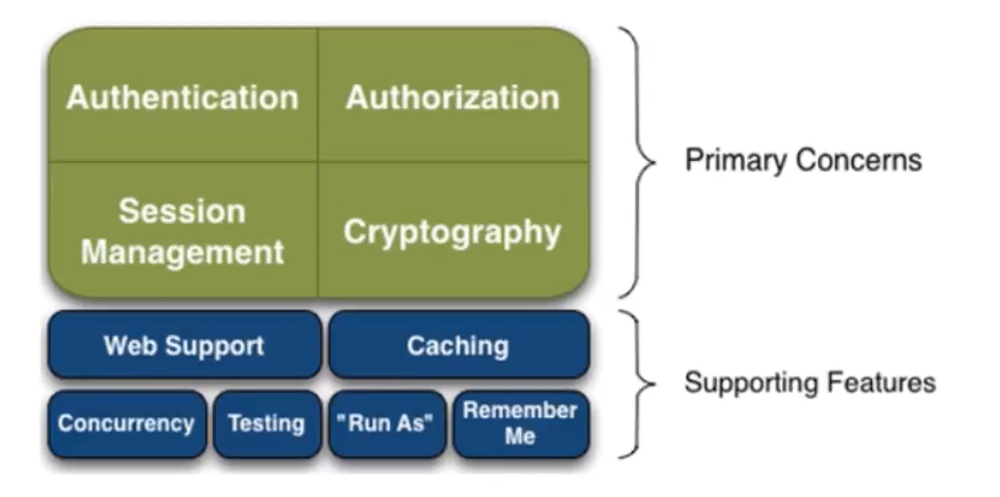
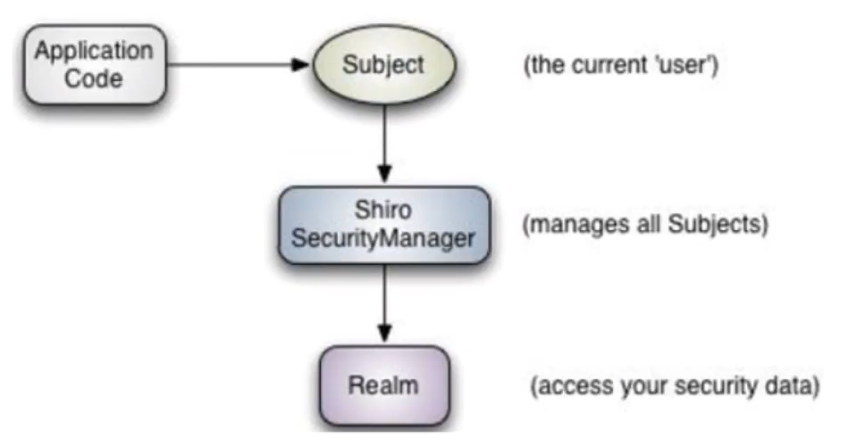
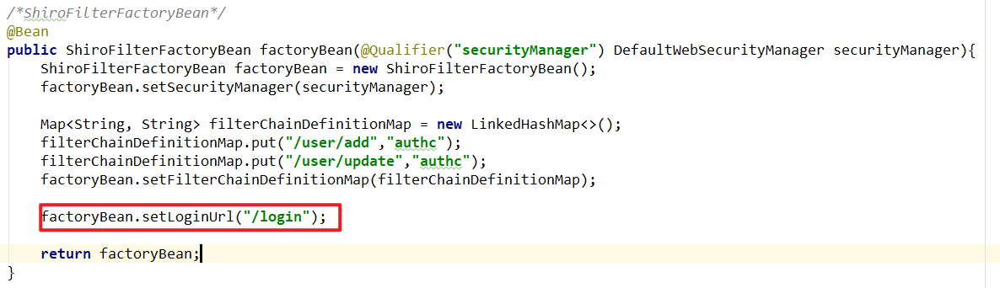
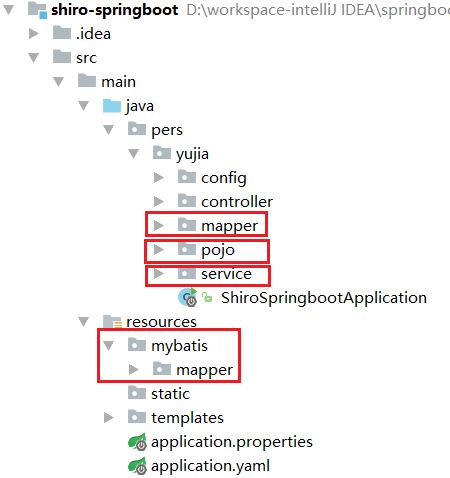
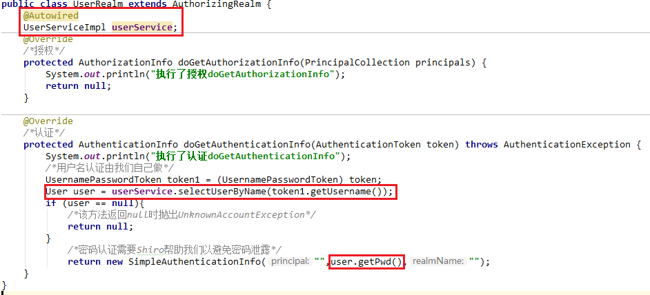
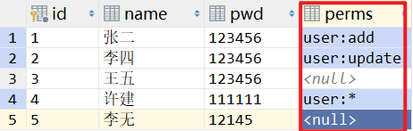
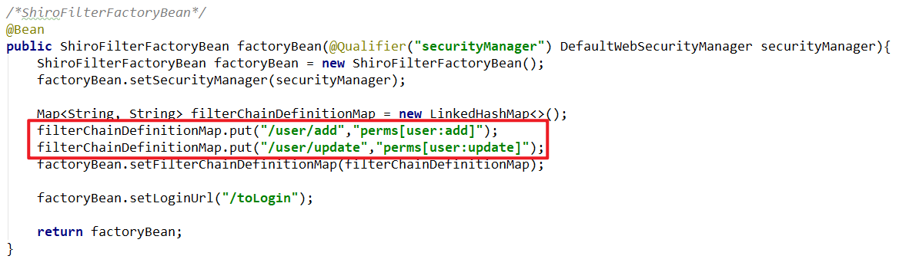
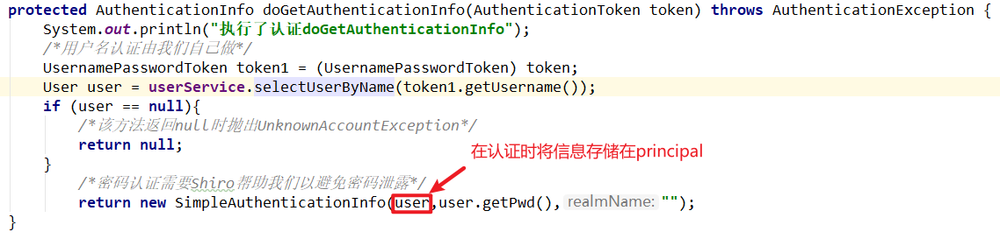
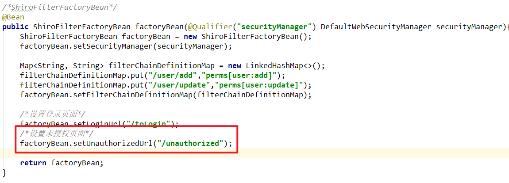

# 1. Shiro简介

## 1.1 什么是Shiro

- Apache Shiro是一个Java安全（权限）框架。
- Shiro既可以应用在JavaSE，也可以应用在JavaEE。
- Shiro可以完成认证、授权、加密、会话管理、Web集成、缓存等功能。
- Shiro的官方地址：[http://shiro.apache.org/index.html](http://shiro.apache.org/index.html)

- Shiro的github地址：[https://github.com/apache/shiro](https://github.com/apache/shiro)

## 1.2 Shiro有什么功能



- **Authentication**：身份验证，检测用户是否具有合法身份。
- **Authorization**：授权，验证用户具有什么权限，具有什么操作的权利。
- **Session Manager**：会话管理。
- **Cryptography**：加密，保护数据的安全性。
- **Caching**：缓存，如用户登录后，用户的用户名和相关信息都无需再次到内存中查找。
- **Concurrency**：Shiro支持多线程应用的并发验证。如在一个线程中开启新线程，会把当前线程的权限自动传播。
- **Run As**：允许一个用户伪装成另一个用户进行访问。
- **Remember Me**：记住我。当登录时开启该功能，下次登录无需用户名和密码。

## 1.3 Shiro架构



- **Subject**：应用代码直接进行交互的对象是Subject。Subject代表当前的用户（包括爬虫和机器人等），与Subject进行的所有交互都会委托给Shiro SecurityManager。
- **Shiro SecurityManager**：安全管理器，所有有关安全的操作都会和安全管理器进行交互，并且它管理着所有的Subject。因此，SecurityManager是Shiro的核心。
- **Realm**：Shiro从Realm中获取用户的角色和权限。在进行用户的身份验证时，Shiro会从Reaml中获取到相应的用户进行对比，从而判定用户的操作是否合法。

# 2. QuickStart解读

```java
/**
 * Simple Quickstart application showing how to use Shiro's API.
 *
 * @since 0.9 RC2
 */
public class Quickstart {

    private static final transient Logger log = LoggerFactory.getLogger(Quickstart.class);


    public static void main(String[] args) {

        /*设置Shiro的配置文件shiro.ini*/
        DefaultSecurityManager securityManager = new DefaultSecurityManager();
        IniRealm iniRealm = new IniRealm("classpath:shiro.ini");
        securityManager.setRealm(iniRealm);

        /*设置安全管理器*/
        SecurityUtils.setSecurityManager(securityManager);

        /*获取当前用户*/
        Subject currentUser = SecurityUtils.getSubject();

        /*在session域中存值取值*/
        Session session = currentUser.getSession();
        session.setAttribute("someKey", "aValue");
        String value = (String) session.getAttribute("someKey");
        if (value.equals("aValue")) {
            log.info("Retrieved the correct value! [" + value + "]");
        }

        /*判断当前用户是否被认证*/
        if (!currentUser.isAuthenticated()) {
            /*token：令牌*/
            UsernamePasswordToken token = new UsernamePasswordToken("lonestarr", "vespa");
            /*设置记住我*/
            token.setRememberMe(true);
            try {
                /*执行登陆操作*/
                currentUser.login(token);
            } catch (UnknownAccountException uae) {
                /*用户名异常*/
                log.info("There is no user with username of " + token.getPrincipal());
            } catch (IncorrectCredentialsException ice) {
                /*密码错误*/
                log.info("Password for account " + token.getPrincipal() + " was incorrect!");
            } catch (LockedAccountException lae) {
                /*用户被锁定*/
                log.info("The account for username " + token.getPrincipal() + " is locked.  " +
                        "Please contact your administrator to unlock it.");
            }
            // ... catch more exceptions here (maybe custom ones specific to your application?
            catch (AuthenticationException ae) {
                /*认证错误*/
                //unexpected condition?  error?
            }
        }

        /*输出登录的用户名*/
        log.info("User [" + currentUser.getPrincipal() + "] logged in successfully.");

        /*判断用户权限*/
        if (currentUser.hasRole("schwartz")) {
            log.info("May the Schwartz be with you!");
        } else {
            log.info("Hello, mere mortal.");
        }

        /*同样是判断用户权限，只不过相比hasRole具有更细的粒度*/
        if (currentUser.isPermitted("lightsaber:wield")) {
            log.info("You may use a lightsaber ring.  Use it wisely.");
        } else {
            log.info("Sorry, lightsaber rings are for schwartz masters only.");
        }

        /*同样是判断用户权限，只不过相比hasRole具有更细的粒度*/
        if (currentUser.isPermitted("winnebago:drive:eagle5")) {
            log.info("You are permitted to 'drive' the winnebago with license plate (id) 'eagle5'.  " +
                    "Here are the keys - have fun!");
        } else {
            log.info("Sorry, you aren't allowed to drive the 'eagle5' winnebago!");
        }

        /*进行注销*/
        currentUser.logout();

        System.exit(0);
    }
}
```


# 3. 环境搭建

## 3.1 导入依赖

```xml
<!-- https://mvnrepository.com/artifact/org.apache.shiro/shiro-spring -->
<!--SpringBoot整合Shiro所需依赖-->
<dependency>
    <groupId>org.apache.shiro</groupId>
    <artifactId>shiro-spring</artifactId>
    <version>1.7.1</version>
</dependency>
<!-- https://mvnrepository.com/artifact/org.springframework.boot/spring-boot-starter-thymeleaf -->
<!--Thymeleaf-->
<dependency>
    <groupId>org.springframework.boot</groupId>
    <artifactId>spring-boot-starter-thymeleaf</artifactId>
    <version>2.5.3</version>
</dependency>
```

## 3.2 编写网页

​		需要两个首页和用户操作网页。

​		首页如下：

```html
<!DOCTYPE html>
<html lang="en" xmlns:th=http://www.thymeleaf.org>
    <head>
        <meta charset="UTF-8">
        <title>index</title>
    </head>
    <body>
        <h1>首页</h1>
        <p th:text="${msg}"></p>
        <a th:href="@{/user/add}">添加</a> | <a th:href="@{/user/update}">修改</a>
    </body>
</html>
```

​		用户操作页面如下：

```html
<!DOCTYPE html>
<html lang="en">
<head>
    <meta charset="UTF-8">
    <title>add</title>
</head>
<body>
    <h1>add</h1>
</body>
</html>
```

```html
<!DOCTYPE html>
<html lang="en">
<head>
    <meta charset="UTF-8">
    <title>update</title>
</head>
<body>
    <h1>update</h1>
</body>
</html>
```

## 3.3 自定义Realm

​		自定义Realm需要我们继承`AuthorizingRealm`，并且重写里面的两个方法进行授权和认证。

```java
package pers.yujia.config;

import org.apache.shiro.authc.AuthenticationException;
import org.apache.shiro.authc.AuthenticationInfo;
import org.apache.shiro.authc.AuthenticationToken;
import org.apache.shiro.authz.AuthorizationInfo;
import org.apache.shiro.realm.AuthorizingRealm;
import org.apache.shiro.subject.PrincipalCollection;

/**
 * Created by 霍宇佳 on 2021/8/9.
 */
public class UserRealm extends AuthorizingRealm {
    @Override
    /*授权*/
    protected AuthorizationInfo doGetAuthorizationInfo(PrincipalCollection principals) {
        System.out.println("执行了授权doGetAuthorizationInfo");
        return null;
    }

    @Override
    /*认证*/
    protected AuthenticationInfo doGetAuthenticationInfo(AuthenticationToken token) throws AuthenticationException {
        System.out.println("执行了认证doGetAuthenticationInfo");
        return null;
    }
}

```

## 3.4 编写JavaConfig

​		接下来我们需要记住三个类:`Realm`,`DefaultWebSecurityManager`,`ShiroFilterFactoryBean`。

​		还需要注意在同一个JavaConfig里面两个Bean如何联系在一起：需要在方法参数中添加`@Qualifier()`注解，默认的Bean的名字为方法名字。

```java
package pers.yujia.config;

import org.apache.shiro.spring.web.ShiroFilterFactoryBean;
import org.apache.shiro.web.mgt.DefaultWebSecurityManager;
import org.springframework.beans.factory.annotation.Qualifier;
import org.springframework.context.annotation.Bean;
import org.springframework.context.annotation.Configuration;

/**
 * Created by 霍宇佳 on 2021/8/9.
 */
@Configuration
public class ShiroConfig {

    /*ShiroFilterFactoryBean*/
    @Bean
    public ShiroFilterFactoryBean factoryBean(@Qualifier("securityManager") DefaultWebSecurityManager securityManager){
        ShiroFilterFactoryBean factoryBean = new ShiroFilterFactoryBean();
        factoryBean.setSecurityManager(securityManager);
        return factoryBean;
    }

    /*DefaultWebSecurityManager*/
    @Bean(name = "securityManager")
    public DefaultWebSecurityManager securityManager(@Qualifier("userRealm") UserRealm userRealm){
        DefaultWebSecurityManager securityManager = new DefaultWebSecurityManager();
        securityManager.setRealm(userRealm);
        return securityManager;
    }

    /*Realm*/
    @Bean
    public UserRealm userRealm(){
        return new UserRealm();
    }
}
```

## 3.5 实现登录拦截

Shiro常用的过滤器有以下几种：

- `anno`：无需认证就可以访问。
- `authc`：必须认证才能访问。
- `user`：必须“记住我”才能访问，一般很少使用。
- `perms`：拥有某个资源的权限才能访问。
- `role`：拥有某个角色权限才能访问。

需要使用`filterChainDefinitionMap`类存储资源的权限。Map中的key是资源的前台路径，即RequestMapping中的值，value是上述的过滤器。

```java
@Bean
public ShiroFilterFactoryBean factoryBean(@Qualifier("securityManager") DefaultWebSecurityManager securityManager){
    ShiroFilterFactoryBean factoryBean = new ShiroFilterFactoryBean();
    factoryBean.setSecurityManager(securityManager);
    
    Map<String, String> filterChainDefinitionMap = new LinkedHashMap<>();
    filterChainDefinitionMap.put("/user/add","authc");
    filterChainDefinitionMap.put("/user/update","authc");
    factoryBean.setFilterChainDefinitionMap(filterChainDefinitionMap);
    
    return factoryBean;
}
```

接着设置拦截之后需要跳转到的登陆页面。



## 3.6 实现用户认证

### 3.6.1 简单的登录页面

```html
<!DOCTYPE html>
<html lang="en" xmlns:th=http://www.thymeleaf.org>
    <head>
        <meta charset="UTF-8">
        <title>login</title>
    </head>
    <body>
        <h1>登录</h1>
        <p th:text="${msg}" style="color: red"></p>
        <form th:action="@{/login}" method="post">
            用户名：<input type="text" name="username"><br>
            密码：<input type="text" name="password"><br>
            <button type="submit">登录</button>
        </form>
    </body>
</html>
```

### 3.6.2 在进行路径控制时用户登录

```java
@RequestMapping("/login")
public String login(String username, String password, Model model) {
    /*获取当前用户*/
    Subject currentUser = SecurityUtils.getSubject();
    /*封装用户名密码到令牌中*/
    UsernamePasswordToken token = new UsernamePasswordToken(username, password);
    try {
        /*进行用户登录*/
        currentUser.login(token);
        return "index";
    } catch (UnknownAccountException e) {
        model.addAttribute("msg", "用户名不存在");
        return "login";
    } catch (IncorrectCredentialsException e) {
        model.addAttribute("msg", "密码错误");
        return "login";
    }
}
```

### 3.6.3 在Realm的Bean中进行认证

```java
package pers.yujia.config;

import org.apache.shiro.SecurityUtils;
import org.apache.shiro.authc.*;
import org.apache.shiro.authz.AuthorizationInfo;
import org.apache.shiro.realm.AuthorizingRealm;
import org.apache.shiro.subject.PrincipalCollection;
import org.apache.shiro.subject.Subject;

/**
 * Created by 霍宇佳 on 2021/8/9.
 */
public class UserRealm extends AuthorizingRealm {
    @Override
    /*授权*/
    protected AuthorizationInfo doGetAuthorizationInfo(PrincipalCollection principals) {
        System.out.println("执行了授权doGetAuthorizationInfo");
        return null;
    }

    @Override
    /*认证*/
    protected AuthenticationInfo doGetAuthenticationInfo(AuthenticationToken token) throws AuthenticationException {
        System.out.println("执行了认证doGetAuthenticationInfo");
        String username = "root";
        String password = "123456";
        /*用户名认证由我们自己做*/
        UsernamePasswordToken token1 = (UsernamePasswordToken) token;
        if (!token1.getUsername().equals(username)){
            /*该方法返回null时抛出UnknownAccountException*/
            return null;
        }
            /*密码认证需要Shiro帮助我们以避免密码泄露，这里参数密码为用户真实的密码*/
        	/*SimpleAuthenticationInfo是AuthenticationInfo接口的实现类*/
            return new SimpleAuthenticationInfo("",password,"");
    }
}
```

## 3.7 整合MyBatis

### 3.7.1 导入依赖

```xml
<!--junit降低版本-->
<dependency>
    <groupId>org.springframework.boot</groupId>
    <artifactId>spring-boot-starter-test</artifactId>
    <exclusions>
        <exclusion>
            <groupId>org.junit.jupiter</groupId>
            <artifactId>junit-jupiter-api</artifactId>
        </exclusion>
    </exclusions>
    <scope>test</scope>
</dependency>
<dependency>
    <groupId>junit</groupId>
    <artifactId>junit</artifactId>
</dependency>

<!-- https://mvnrepository.com/artifact/org.mybatis.spring.boot/mybatis-spring-boot-starter -->
<!--mybatis-->
<dependency>
    <groupId>org.mybatis.spring.boot</groupId>
    <artifactId>mybatis-spring-boot-starter</artifactId>
    <version>2.2.0</version>
</dependency>

<!-- https://mvnrepository.com/artifact/mysql/mysql-connector-java -->
<!--mysql驱动-->
<dependency>
    <groupId>mysql</groupId>
    <artifactId>mysql-connector-java</artifactId>
    <version>8.0.26</version>
</dependency>

<!-- https://mvnrepository.com/artifact/com.alibaba/druid-spring-boot-starter -->
<!--Druid-->
<dependency>
    <groupId>com.alibaba</groupId>
    <artifactId>druid-spring-boot-starter</artifactId>
    <version>1.2.6</version>
</dependency>

<!--lombok-->
<dependency>
    <groupId>org.projectlombok</groupId>
    <artifactId>lombok</artifactId>
</dependency>
</dependencies>
```

### 3.7.2 新建包和文件夹



### 3.7.3 配置数据源和MyBatis

```yaml
spring:
  datasource:
    driver-class-name: com.mysql.cj.jdbc.Driver
    url: jdbc:mysql://localhost:3306/mybatis?useSSL=true&useUnicode=true&characterEncoding=utf-8
    username: "root"
    password: "333"
    #更换SpringBoot的数据源为Druid
    type: com.alibaba.druid.pool.DruidDataSource
    #Spring Boot 默认是不注入这些属性值的，需要自己绑定
    #druid 数据源专有配置
    initialSize: 5
    minIdle: 5
    maxActive: 20
    maxWait: 60000
    timeBetweenEvictionRunsMillis: 60000
    minEvictableIdleTimeMillis: 300000
    validationQuery: SELECT 1 FROM DUAL
    testWhileIdle: true
    testOnBorrow: false
    testOnReturn: false
    poolPreparedStatements: true
    #配置监控统计拦截的filters，stat:监控统计、log4j：日志记录、wall：防御sql注入
    #如果运行时报错 java.lang.ClassNotFoundException: org.apache.log4j.Priority
    #则导入log4j依赖即可，需要2.0以下的版本
    filters: stat,wall,log4j
    maxPoolPreparedStatementPerConnectionSize: 20
    useGlobalDataSourceStat: true
    connectionProperties: druid.stat.mergeSql=true;druid.stat.slowSqlMillis=500

#MyBatis配置
mybatis:
  #完整类名别名
  type-aliases-package: pers.yujia.pojo
  #mapper.xml存放位置
  mapper-locations: classpath:mybatis/mapper/*.xml
```

### 3.7.4 pojo

```java
@Data
@AllArgsConstructor
@NoArgsConstructor
public class User {
    private int id;
    private String name;
    private String pwd;
}
```

### 3.7.5 dao层

`UserMapper.java`

```java
@Repository
@Mapper
public interface UserMapper {
    public User selectUserByName(@Param("name") String name);
}
```

`UserMapper.xml`

```xml
<?xml version="1.0" encoding="UTF-8" ?>
<!DOCTYPE mapper
        PUBLIC "-//mybatis.org//DTD Mapper 3.0//EN"
        "http://mybatis.org/dtd/mybatis-3-mapper.dtd">
<mapper namespace="pers.yujia.mapper.UserMapper">
    <select id="selectUserByName" resultType="user">
        select * from user
        <where>
            and name = #{name}
        </where>
    </select>
</mapper>
```

### 3.7.6 service层

`UserService.java`

```java
public interface UserService {
    public User selectUserByName(String name);
}
```

`UserServiceImpl.java`

```java
@Service
public class UserServiceImpl implements UserService {
    @Autowired
    UserMapper userMapper;

    @Override
    public User selectUserByName(String name) {
        return userMapper.selectUserByName(name);
    }
}
```

### 3.7.7 更改Realm中的用户认证



## 3.8 授权

### 3.8.1 在数据库中的user表添加“perms”字段



### 3.8.2 修改pojo

```java
@Data
@AllArgsConstructor
@NoArgsConstructor
public class User {
    private int id;
    private String name;
    private String pwd;
    private String perms;
}

```

### 3.8.3 资源设置权限限制



### 3.8.4 在用户访问资源时检查权限

在自定义的Realm中，`doGetAuthorizationInfo()`和`doGetAuthenticationInfo()`方法的执行时刻是：

- `doGetAuthorizationInfo()`授权：是在用户请求资源时执行。

- `doGetAuthenticationInfo()`认证：是在用户登录时执行。

因此，一个用户一般认证只有一次，但授权可以有多次。因此，用户的权限可以通过访问数据库获得，也可以通过认证时封装的principal中获取。

  ```java
  @Override
  /*授权*/
  protected AuthorizationInfo doGetAuthorizationInfo(PrincipalCollection principals) {
      System.out.println("执行了授权doGetAuthorizationInfo");
  
      Subject currentUser = SecurityUtils.getSubject();
      /*在认证时可以将用户信息存放在principal里*/
      User user = (User) currentUser.getPrincipal();
  
      SimpleAuthorizationInfo simpleAuthorizationInfo = new SimpleAuthorizationInfo();
  
      /*进行用户授权，用户在请求资源时Shiro会自动判断该用户行为是否合法*/
      simpleAuthorizationInfo.addStringPermission(user.getPerms());
      return simpleAuthorizationInfo;
  }
  ```

  

### 3.8.5 设置用户权限不够时的跳转页面



### 3.8.6 整合Thymeleaf

1. 导入依赖

```xml
<!-- https://mvnrepository.com/artifact/com.github.theborakompanioni/thymeleaf-extras-shiro -->
<!--Shiro整合Thymeleaf-->
<dependency>
    <groupId>com.github.theborakompanioni</groupId>
    <artifactId>thymeleaf-extras-shiro</artifactId>
    <version>2.0.0</version>
</dependency>
```

2. 添加`ShiroDialect`类到JavaConfig

```java
/*ShiroDialect*/
@Bean
public ShiroDialect shiroDialect(){
    return new ShiroDialect();
}
```

3. 修改首页

```html
<!DOCTYPE html>
<html lang="en" xmlns:th=http://www.thymeleaf.org
      xmlns:shiro=http://www.pollix.at/thymeleaf/shiro>
    <head>
        <meta charset="UTF-8">
        <title>index</title>
    </head>
    <body>
        <h1>首页</h1>
        <a th:href="@{/toLogin}" shiro:notAuthenticated="">登录</a>
        <p th:text="${msg}"></p>
        <a th:href="@{/user/add}" shiro:hasPermission="user:add">添加</a> |
        <a th:href="@{/user/update}" shiro:hasPermission="user:update">修改</a>
    </body>
</html>
```

​		除了`shiro:notAuthenticated=""`外，还可以在认证时将用户名存到session域，通过`th:if=${session.username==null}`来进行动态增减内容。

