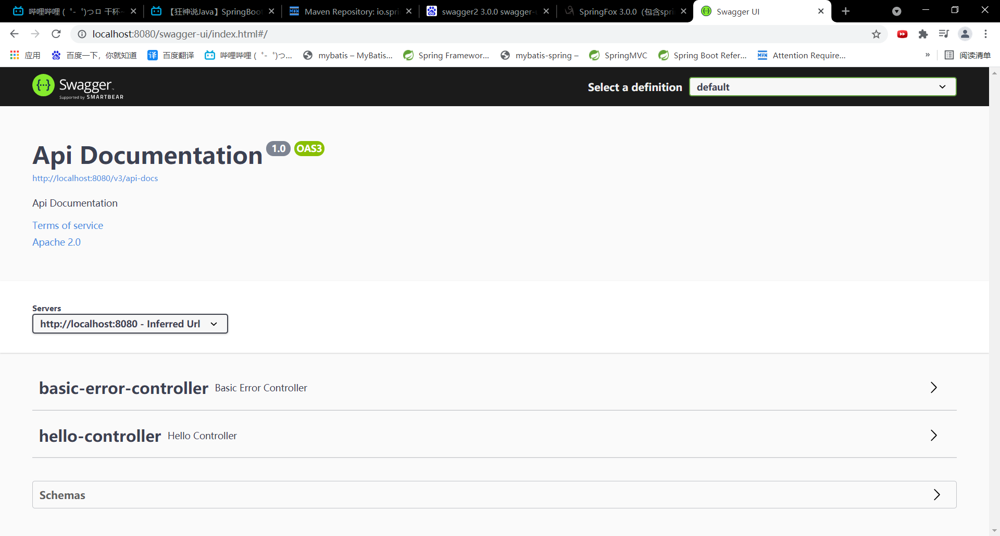
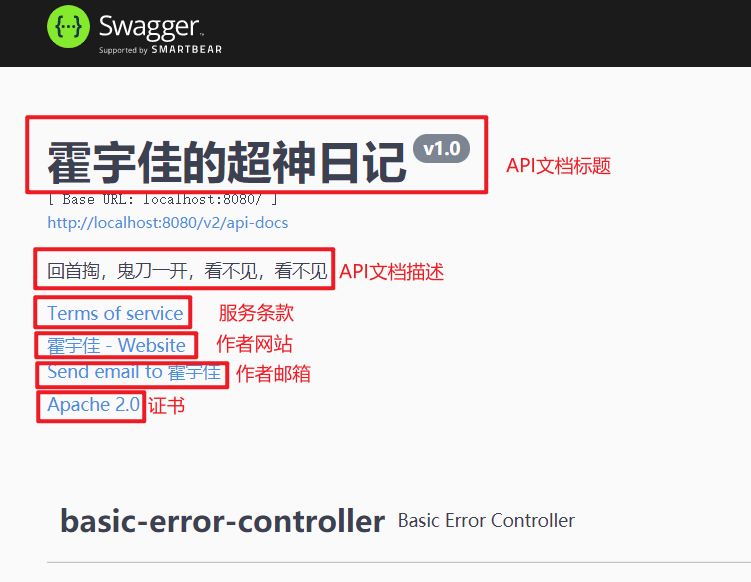
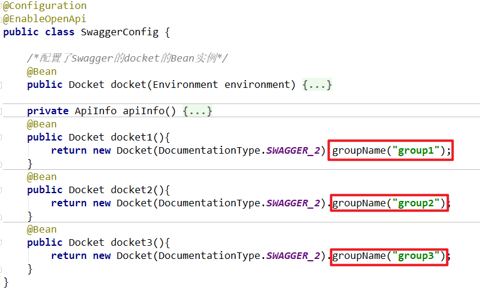
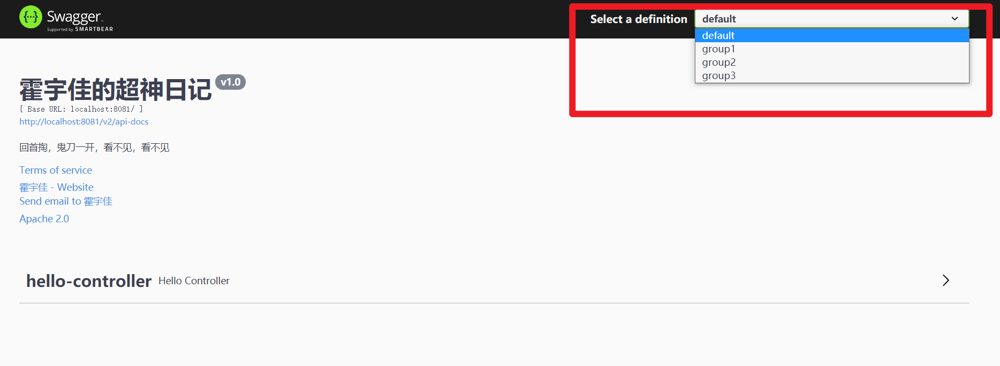
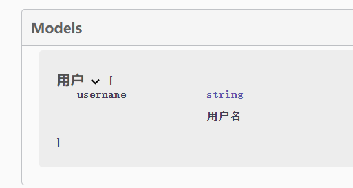
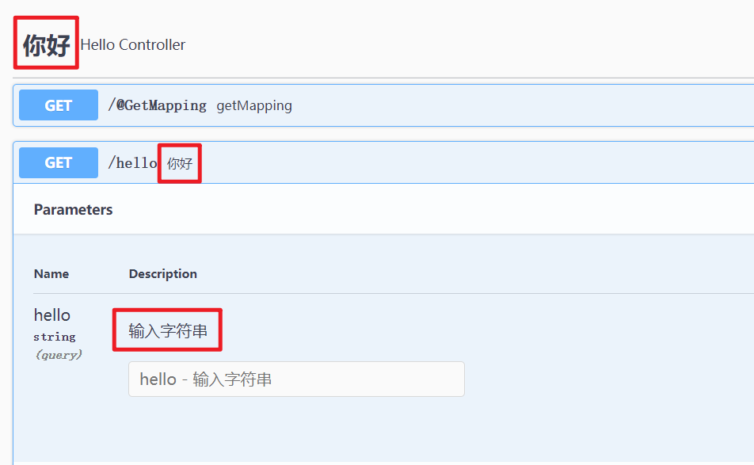

# Swagger简介

- 目前的Web主流框架是Vue+SpringBoot
- 目前Web开发越来越趋向于前后端分离，前端负责数据的展示，后端负责数据的处理。
- 前端和后端如何进行交互呢？通过API（应用程序接口）进行前后端的交流。以前是通过word文档来描述API，但是现在程序的体量越来越大，动辄上百万行代码。显然通过传统的方式来描述API会造成前后端信息的不一致，无法做到“及时协商，尽早解决”。
- Swagger正是基于“前后端及时沟通”，==实现API文档和API定义同步更新==。

Swagger官方网址：https://swagger.io/

​		Swagger 是一个用于生成、描述和调用 RESTful 接口的 Web 服务。通俗的来讲，Swagger 就是将项目中所有（想要暴露的）接口展现在页面上，并且可以进行接口调用和测试的服务。

Swagger的作用如下：

- **将项目中所有的接口展现在页面上**，这样后端程序员就不需要专门为前端使用者编写专门的接口文档。
- 当接口更新之后，只需要修改代码中的 Swagger 描述就可以实时生成新的接口文档了，从而**规避了接口文档老旧不能使用的问题**。
- 通过 Swagger 页面，我们可以**直接进行接口调用，降低了项目开发阶段的调试成本**。

# SpringBoot整合Swagger

1. 新建一个SpringBoot-web项目

2. 导入依赖

   注意版本，3.0.0版本和其他版本略有不同，如果使用其他版本百度即可。

```xml
<!-- https://mvnrepository.com/artifact/io.springfox/springfox-boot-starter -->
<dependency>
    <groupId>io.springfox</groupId>
    <artifactId>springfox-boot-starter</artifactId>
    <version>3.0.0</version>
</dependency>
```

3. 配置Swagger(JavaConfig)

```java
@Configuration
@EnableOpenApi
public class SwaggerConfig {

}
```

4. 访问测试

`localhost:8080/swagger-ui/index.html`

**注意：Swagger2的3.0.0版本的页面访问路径也和其他版本不同。**



# Swagger配置信息

​		Swagger的核心配置为`Docket`

```java
@Configuration
@EnableOpenApi
public class SwaggerConfig {

    /*配置了Swagger的docket的Bean实例*/
    @Bean
    public Docket docket(){
        return new Docket(DocumentationType.SWAGGER_2)
                .apiInfo(apiInfo());
    }

    /*配置文档信息*/
    private ApiInfo apiInfo(){
        /*描写作者联系方式*/
        Contact contact = new Contact("霍宇佳","http://www.baidu.com","huoyujia081@126.com");
        return new ApiInfo(
                /*API文档的标题*/
                "霍宇佳的超神日记",
                /*API文档的描述*/
                "回首掏，鬼刀一开，看不见，看不见",
                /*版本文档版本*/
                "v1.0",
                /*服务条款网站*/
                "http://www.baidu.com",
                /*作者的联系方式，包括网站和邮箱*/
                contact,
                /*证书*/
                "Apache 2.0",
                /*证书url*/
                "http://www.apache.org/licenses/LICENSE-2.0",
                /*供应商扩展*/
                new ArrayList()
        );
    }
}
```

配置后的Swagger页面如下：



# 配置扫描的接口

​		我们可以选择Swagger扫描的位置，通过==Docket.select()【.apis()】【.paths()】.build()==来实现。

```java
@Bean
public Docket docket() {
    return new Docket(DocumentationType.SWAGGER_2)
        .apiInfo(apiInfo())
        .select()
        /**
         * RequestHandlerSelectors配置要扫描接口的方式
         * basePackage(String) 只扫描包中的接口
         * any()扫描全部的接口
         * none()不扫描接口
         * withMethodAnnotation(final Class<? extends Annotation> annotation) 扫描方法上的注解
         * withClassAnnotation(final Class<? extends Annotation> annotation) 扫描类上的注解
         */
        .apis(RequestHandlerSelectors.basePackage("pers.yujia.controller"))
        /**
         * PathSelectors 配置要扫描的路径（和@RequestMapping中的参数对应）
         * any() // 任何请求都扫描
         * none() // 任何请求都不扫描
         * regex(final String pathRegex) // 通过正则表达式控制
         * ant(final String antPattern) // 通过ant()控制
         */
        .paths(PathSelectors.ant("/user*//**"))
        .build();
}
```

**注意：**

- `.apis()`对应的是RequestHandlerSeletors
- `.paths()`对应的是PathSelectors

# 配置是否启动Swagger

- 当项目正式上线之后，我们的Swagger页面肯定不能让用户直接访问。我们需要实现这样的功能：当开发时Swagger开启，当上线后Swagger关闭。

- 我们可以控制Docket的**enabled**属性来实现该功能。如果enabled=true，Swagger开启；enabled=false，Swagger关闭。

可以将该功能分为两个步骤：

		1. 判断当前的环境，flag
		2. 设置Docket的enabled属性。

```java
@Bean
public Docket docket(Environment environment) {
    /*设置要显示Swagger的环境*/
    Profiles profiles = Profiles.of("dev");
    /*判断当前是否处于该环境*/
    boolean flag = environment.acceptsProfiles(profiles);

    return new Docket(DocumentationType.SWAGGER_2)
        .apiInfo(apiInfo())
        .enable(flag)	/*设置Swagger是否生效*/
        .select()
        .apis(RequestHandlerSelectors.basePackage("pers.yujia.controller"))
        .build();
}
```

环境可以通过SpringBoot的yaml配置文件来设置。

- application.yaml中设置要激活的配置文件：

  ```yaml
  spring:
    profiles:
      active: dev
  ```

- appliaction-dev.yaml

  ```yaml
  spring:
    config:
      activate:
        on-profile: dev
  server:
    port: 8081
  ```

- application-pro.yaml

  ```yaml
  spring:
    config:
      activate:
        on-profile: pro
  server:
    port: 8082
  ```

# 配置API分组

可以通过配置多个Docket来生成多个分组。

每个分组名可用`Docket.groupName(String)`来指定。



最终的效果为：



# Swagger常见注解

由于Swagger是前后端交互使用，所以我们必须解释每个接口以及接口的参数。Swagger的注解就是用来解决该问题。

Swagger的常见注解如下：

- `@Api(tags = "xxx模块说明")` 作用在模块类上
- `@ApiOperation("xxx接口说明") `作用在接口方法上
- `@ApiParam("xxx参数说明")`作用在参数、方法和字段上，类似@ApiModelProperty
- `@ApiModel("xxxPOJO说明")` 作用在模型类上：如VO、BO
- `@ApiModelProperty(value = "xxx属性说明",hidden = true)` 作用在类方法和属性上，hidden设置为true可以隐藏该属性

## model注解

先来测试model的注解`@ApiModel("xxxPOJO说明")`和`@ApiModelProperty(value = "xxx属性说明",hidden = true)`

```java
@ApiModel("用户")
public class User {
    @ApiModelProperty("用户名")
    private String username;
    
    /*隐藏密码*/
    @ApiModelProperty(value = "密码",hidden = true)
    private String password;
}
```

请求接口如下：

```java
@RequestMapping("/user")
@ResponseBody
public User user(){
    return new User("张三","123456");
}
```

由于设置password属性不显示，所以实现的效果如下：



​		**注意：并不是因为@ApiModel这个注解让实体显示在这里了，而是只要出现在接口方法的返回值上的实体都会显示在这里，
而@ApiModel和@ApiModelProperty这两个注解只是为实体添加注释的。**

## controller注解

用于controller的注解如下：

- `@Api(tags = "xxx模块说明")`，用于注解controller整个类。注意属性必须要写tags，否则该注解无效。
- `@ApiOperation("xxx接口说明")`，用于注解每个方法。
- `@ApiParam("xxx参数说明")`，用于注解方法中的参数。

```java
@Controller
@Api(tags = "你好")
public class HelloController {
    @ResponseBody
    @RequestMapping("/hello")
    @ApiOperation("你好")
    public String hello(@ApiParam("输入字符串") String hello){
        return "HelloSwagger!";
    }
}
```

实现的效果如下：



