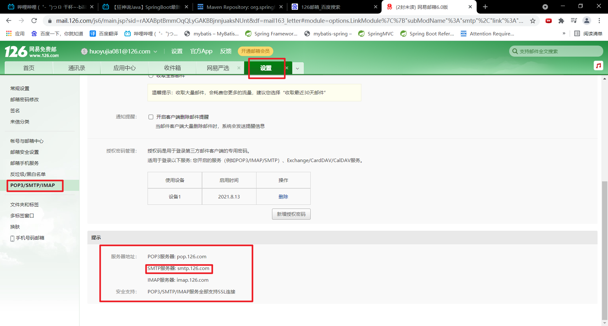

# 异步任务

​		异步任务在我们的实际开发过程中经常被使用。

​		比如我们需要发送邮件，把邮件提交给服务器这个过程需要一定的时间，这个过程中浏览器前端不停地在加载，但是此时用户可能等待不耐烦而提前关闭网页。我们需要在邮件发送给服务器完成之前，提前给用户发送信息提示用户。这时候就需要使用到异步任务。

1. 在SpringBoot的主类上添加`@EnableAsync`注解，表示启动异步处理。

   ```java
   @SpringBootApplication
   @EnableAsync
   public class Springboot08TaskApplication {
   
   	public static void main(String[] args) {
   		SpringApplication.run(Springboot08TaskApplication.class, args);
   	}
   
   }
   ```

2. 编写Service，在异步处理的方法上添加`@Async`注解，表示该方法为异步处理。

   ```java
   @Service
   public class AsyncService {
       @Async
       public void async(){
           try {
               Thread.sleep(10000);
           } catch (InterruptedException e) {
               e.printStackTrace();
           }
           System.out.println("正在处理数据");
       }
   }
   ```

3. Controller调用异步处理方法。

   ```java
   @RestController
   public class AsyncController {
       @Autowired
       AsyncService asyncService;
       @RequestMapping("/async")
       public String async(){
           asyncService.async();
           return "OK";
       }
   }
   ```

然后我们在浏览器请求，发现直接得到响应，但是Java后台10s后才打印消息，说明页面响应和后台处理是异步进行的。

# 邮件任务

邮件发送，在我们的日常开发中，也非常的多，Springboot也帮我们做了支持。

- 邮件发送需要引入`spring-boot-start-mail`
- SpringBoot 自动配置`MailSenderAutoConfiguration`
- 定义MailProperties内容，配置在`application.yaml`中
- 自动装配`JavaMailSender`
- 测试邮件发送

## 1. 导入相关依赖

```xml
<!-- https://mvnrepository.com/artifact/org.springframework.boot/spring-boot-starter-mail -->
<dependency>
    <groupId>org.springframework.boot</groupId>
    <artifactId>spring-boot-starter-mail</artifactId>
    <version>2.5.3</version>
</dependency>
```

## 2. 查看`MailSenderAutoConfiguration`


​		该类没有Bean，但是导入了`MailSenderJndiConfiguration`类。

## 3. 查看`MailSenderJndiConfiguration`

	

这个类存在类型为`JavaMailSenderImpl`的Bean，因此这个Bean就是我们邮件任务主要需要配置的。


## 4. 查看`MailSenderAutoConfiguration`中的`MailProperties`，看看我们需要配置什么邮箱信息。

```java
@ConfigurationProperties(prefix = "spring.mail")
public class MailProperties {

    private static final Charset DEFAULT_CHARSET = StandardCharsets.UTF_8;

    /**
	 * SMTP server host. For instance, `smtp.example.com`.
	 */
    private String host;

    /**
	 * SMTP server port.
	 */
    private Integer port;

    /**
	 * Login user of the SMTP server.
	 */
    private String username;

    /**
	 * Login password of the SMTP server.
	 */
    private String password;

    /**
	 * Protocol used by the SMTP server.
	 */
    private String protocol = "smtp";

    /**
	 * Default MimeMessage encoding.
	 */
    private Charset defaultEncoding = DEFAULT_CHARSET;

    /**
	 * Additional JavaMail Session properties.
	 */
    private Map<String, String> properties = new HashMap<>();

    /**
	 * Session JNDI name. When set, takes precedence over other Session settings.
	 */
    private String jndiName;
}
```

## 5. 配置邮箱信息

```yaml
spring:
  mail:
    host: smtp.126.com
    username: huoyujia081@126.com
    password: ASQKFXBBXJFOSXOS
    #qq需要配置ssl
    #smtp:
      #ssl:
        #enable: true
```

- host可以在登录邮箱后，查看邮箱的设置获取。

  

- username即邮箱账号，但是密码需要开启SMTP服务后才能获取。


## 6. 发送邮件

```java
package pers.yujia;

import org.junit.Test;
import org.junit.runner.RunWith;
import org.springframework.beans.factory.annotation.Autowired;
import org.springframework.boot.test.context.SpringBootTest;
import org.springframework.mail.SimpleMailMessage;
import org.springframework.mail.javamail.JavaMailSenderImpl;
import org.springframework.mail.javamail.MimeMessageHelper;
import org.springframework.test.context.junit4.SpringRunner;

import javax.mail.MessagingException;
import javax.mail.internet.MimeMessage;
import java.io.File;

@SpringBootTest
@RunWith(SpringRunner.class)
public class Springboot08TaskApplicationTests {

    @Autowired
    JavaMailSenderImpl mailSender;

    @Test
    public void mailSend_1() {
        /*SimpleMailMessage只能包含收件人，发件人，邮件主题以及邮件正文，不能发送附件*/
        SimpleMailMessage message = new SimpleMailMessage();

        /*设置邮件主题*/
        message.setSubject("SimpleMailMessage");

        /*设置邮件正文*/
        message.setText("text");

        /*设置发送邮箱，需要和配置文件中的username一致*/
        message.setFrom("huoyujia081@126.com");

        /*设置接收邮箱*/
        message.setTo("huoyujia081@126.com");

        /*发送邮件*/
        mailSender.send(message);
    }

    @Test
    public void mailSend_2() throws MessagingException {
        /*MimeMessage可以包含附件，但不能够直接new出来，需要通过mailSender帮忙创建*/
        MimeMessage message = mailSender.createMimeMessage();

        /*MimeMessage获取帮助，必须设置multipart为true*/
        MimeMessageHelper helper = new MimeMessageHelper(message,true);

        /*设置邮件主题*/
        helper.setSubject("MimeMessage");

        /*设置邮件正文（可以使用html语言）*/
        helper.setText("<p style='color:red'>HelloWorld</p>",true);

        /*设置发送附件，包括附件名称和附件内容*/
        helper.addAttachment("附件.jpg",new File("C:\\Users\\霍宇佳\\Desktop\\霍宇佳.jpg"));

        /*设置接收邮箱*/
        helper.setTo("huoyujia081@126.com");

        /*设置发送邮箱*/
        helper.setFrom("huoyujia081@126.com");

        /*发送邮件*/
        mailSender.send(message);
    }
}
```

# 定时任务

​		定时任务也是我们开发过程中经常使用的，如每天的凌晨12点输出前一天的日志信息。

​		定时任务的实现很简单，只需要在SpringBoot的主启动类上添加`@EnableScheduling`注解和在需要定时的方法上添加`@@Scheduled(cron = "")`方法即可实现。需要重点关注的是cron的使用语法。

## cron的语法格式

在网上的相关资料中介绍cron有两种表达方式：

*Seconds Minutes Hours DayofMonth Month DayofWeek Year或
Seconds Minutes Hours DayofMonth Month DayofWeek*

但是==Spring 3.0之后只支持6个参数的cron表达式==。因此，我们开发中一般只用到6个参数的cron表达式。

## cron的特殊字符

在cron中，除了数字之外还可以添加特殊字符，所有的特殊字符含义如下：

- ==\*==：表示匹配该域的任意值，假如在Minutes域使用\*, 即表示每分钟都会触发事件。

- ==?==：只能用在DayofMonth和DayofWeek两个域。它也匹配域的任意值，但实际不会。因为DayofMonth和DayofWeek会相互影响。例如想在每月的20日触发调度，不管20日到底是星期几，则只能使用如下写法： 13 13 15 20 * ?，其中最后一位只能用？，而不能使用\*，如果使用\*表示不管星期几都会触发，实际上并不是这样。

- ==-==：表示范围，例如在Minutes域使用5-20，表示从5分到20分钟每分钟触发一次

- ==/==：表示起始时间开始触发，然后每隔固定时间触发一次，例如在Minutes域使用5/20，则意味着每小时的第5分钟，第25分钟，第45分钟分别触发一次.

- ==,==：表示列出枚举值值。例如：在Minutes域使用5,20，则意味着在第5和第20分钟分别触发一次。

- ==L==：表示最后，只能出现在DayofWeek和DayofMonth域，如果在DayofWeek域使用5L,意味着在最后的一个星期四触发。

- ==W==：表示有效工作日(周一到周五),只能出现在DayofMonth域，系统将在离指定日期的最近的有效工作日触发事件。例如：在 DayofMonth使用5W，如果5日是星期六，则将在最近的工作日：星期五，即4日触发。如果5日是星期天，则在6日(周一)触发；如果5日在星期一到星期五中的一天，则就在5日触发。另外一点，W的最近寻找不会跨过月份

- ==LW==：这两个字符可以连用，表示在某个月最后一个工作日，即最后一个非周六周末的日期。

- ==#==：用于确定每个月第几个星期几，只能出现在DayofWeek域。例如在4#2，表示某月的第二个星期三。

## 每个域可以出现的字符

- Seconds：可出现", - * /"四个字符，有效范围为0-59的整数

- Minutes：可出现", - * /"四个字符，有效范围为0-59的整数

- Hours：可出现", - * /"四个字符，有效范围为0-23的整数

- DayofMonth：可出现", - * / ? L W C"八个字符，有效范围为0-31的整数

- Month：可出现", - * /"四个字符，有效范围为1-12的整数或JAN-DEc

- DayofWeek：可出现", - * / ? L C #"八个字符，有效范围为1-7的整数或SUN-SAT两个范围。1表示星期天，2表示星期一， 依次类推

## cron语法举例

- 0 0 2 1 * ? * 表示在每月的1日的凌晨2点调度任务

- 0 15 10 ? * MON-FRI 表示周一到周五每天上午10：15执行作业

- 0 15 10 ? * 6L 2002-2006 表示2002-2006年的每个月的最后一个星期五上午10:15执行

- 0 0 10,14,16 * * ? 每天上午10点，下午2点，4点

- 0 0/30 9-17 * * ? 朝九晚五工作时间内每半小时

- 0 0 12 ? * WED 表示每个星期三中午12点

- "0 0 12 * * ?" 每天中午12点触发

- "0 15 10 ? * *" 每天上午10:15触发

- "0 15 10 * * ?" 每天上午10:15触发

- "0 15 10 * * ? *" 每天上午10:15触发

- "0 * 14 * * ?" 在每天下午2点到下午2:59期间的每1分钟触发

- "0 0/5 14 * * ?" 在每天下午2点到下午2:55期间的每5分钟触发

- "0 0/5 14,18 * * ?" 在每天下午2点到2:55期间和下午6点到6:55期间的每5分钟触发

- "0 0-5 14 * * ?" 在每天下午2点到下午2:05期间的每1分钟触发

- "0 10,44 14 ? 3 WED" 每年三月的星期三的下午2:10和2:44触发

- "0 15 10 ? * MON-FRI" 周一至周五的上午10:15触发

- "0 15 10 15 * ?" 每月15日上午10:15触发

- "0 15 10 L * ?" 每月最后一日的上午10:15触发

- "0 15 10 ? * 6L" 每月的最后一个星期五上午10:15触发

- "0 15 10 ? * 6#3" 每月的第三个星期五上午10:15触发

## 测试定时任务

1. SpringBoot主启动类

   ```java
   @SpringBootApplication
   @EnableAsync
   @EnableScheduling   //开启定时任务
   public class Springboot08TaskApplication {
   
   	public static void main(String[] args) {
   		SpringApplication.run(Springboot08TaskApplication.class, args);
   	}
   
   }
   ```

2. Service服务

   ```java
   @Service
   public class ScheduledService {
       @Scheduled(cron = "0/2 * * * * ?")  //每两秒执行一次
       public void test(){
           SimpleDateFormat sdf = new SimpleDateFormat("yyyy-MM-dd HH:mm:ss");
           String format = sdf.format(new Date());
           System.out.println(format);
       }
   }
   ```

   

