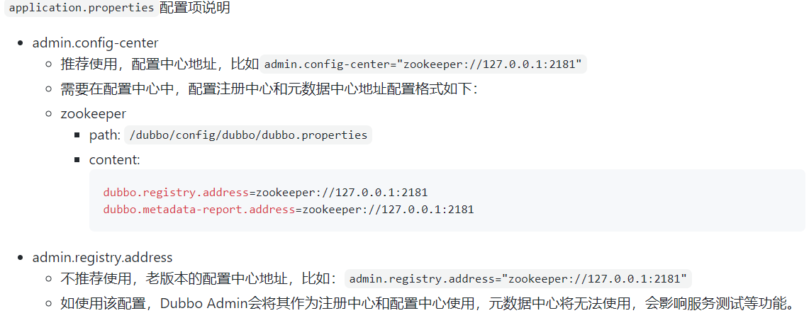
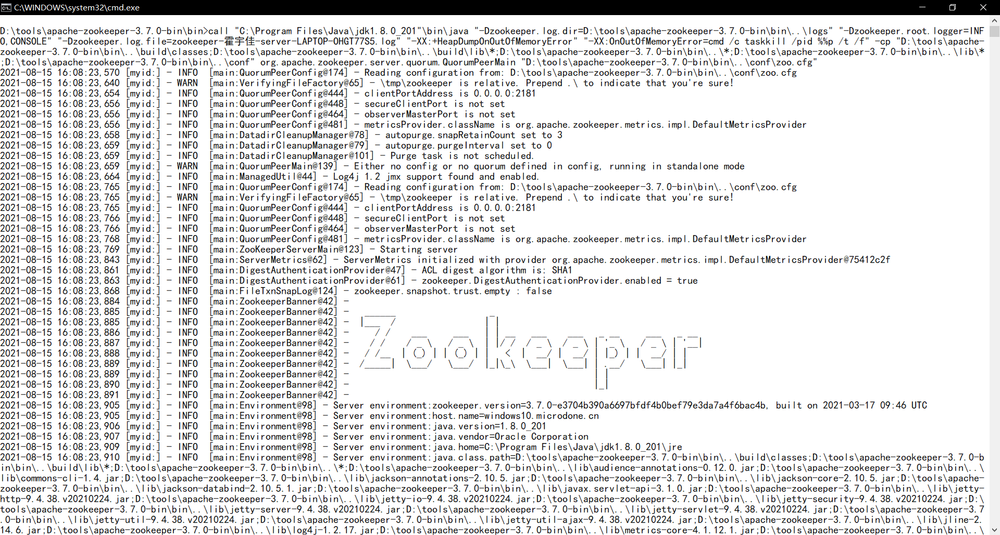

# 分布式系统简述

## 什么是分布式系统

​		**分布式系统是一组通过网络通信、为了完成任务而协同工作的计算机节点组成的系统。**分布式系统的出现是为了解决单一计算机无法独立完成的计算任务和存储任务。其目的是为了**利用更多的机器来处理更多的数据。**

## 为什么要引入分布式系统

​		当首先需要明确的是，只有当单个节点的处理能力无法满足日益增长的计算、存储任务的时候，且硬件的提升（加内存、加磁盘、使用更好的CPU）高昂到得不偿失的时候，应用程序也不能进一步优化的时候，我们才需要考虑分布式系统。因为，分布式系统要解决的问题本身就是和单机系统一样的，而由于分布式系统多节点、通过网络通信的拓扑结构，会引入很多单机系统没有的问题，为了解决这些问题又会引入更多的机制、协议，带来更多的问题。

## 分布式系统的特征

- **分布性**。分布式系统由多台计算机组成，它们在地域上是分散的，可以散布在一个单位、一个城市、一个国家，甚至全球范围内。整个系统的功能是分散在各个节点上实现的，因而分布式系统具有数据处理的分布性。  

* **自治性**。分布式系统中的各个节点都包含自己的处理机和内存，各自具有独立的处理数据的功能。通常，彼此在地位上是平等的，无主次之分，既能自治地进行工作，又能利用共享的通信线路来传送信息，协调任务处理。  

- **并行性**。一个大的任务可以划分为若干个子任务，分别在不同的主机上执行。 

- **全局性**。分布式系统中必须存在一个单一的、全局的进程通信机制，使得任何一个进程都能与其他进程通信，并且不区分本地通信与远程通信。同时，还应当有全局的保护机制。系统中所有机器上有统一的系统调用集合，它们必须适应分布式的环境。在所有CPU上运行同样的内核，使协调工作更加容易。

# 应用程序架构的发展


## 1. 单一应用架构（All in One）


​		在最初设计应用程序的时候，通常把所有的应用通通部署在一起，这样既减少了开发的成本，又提高了开发的效率。适用于小型的管理系统和网站。缺点是：

- 性能扩展比较困难
- 难以升级维护
- 不利于协同开发

## 2. 垂直应用架构


​		当网站的代码开发量越来越大，维护成本越来越高时，传统的单一应用架构已经不太适合了，这时候提出了垂直应用架构。垂直应用架构是将应用的几个耦合度较低的模块分离，交给不同的团队分别进行开发和维护。

​		但是缺点是不同的项目的公共模块无法重复利用，引起开发效率的降低。

## 3. 分布式服务架构


​		当网站开发越来越多时，不同的应用的重复业务必定越来越多，这时候为了提高开发效率，将核心的业务抽取出来，形成独立的服务。然后当开发某个应用需要该服务时，就使用远程方法调用（RPC）来完成该功能，极大提升开发的效率。同时由于不同的服务可能分布在不同的服务器上，所以每个服务器的负载也会小很多，处理的速度也会快很多。

## 4. 面向服务的分布式架构


​		当服务越来越多，容量的评估，小服务资源的浪费等问题逐渐显现，此时需增加一个调度中心基于访问压力实时管理集群容
量，提高集群利用率。此时，用于提高机器利用率的资源调度和治理中心(SOA)[Service Oriented Architecture]是关键。

# 远程过程调用（RPC）

​		RPC是**远程过程调用**（Remote Procedure Call）的缩写形式。RPC是一种通信的方式，是一种编程的思想，而不是某一个特定的应用程序或者规范。RPC允许程序员在编写程序时调用另外一台机器上的程序来完成自己的特定功能，被调用的程序通常不在同一个地址空间甚至是同一台机器上，而是在可见网络的另外一端。

​		同时，RPC允许程序员不必自己编写具体的通信协议，即远程过程调用和本地过程调用的代码没有太大的区别。

​		粗略理解RPC：https://www.jianshu.com/p/2accc2840a1b

## RPC的实现过程


​		如何进行远距离的网络传输，以便服务端知道客户端需要调用哪个服务？我们一般会想到使用http协议，但是频繁的使用http协议来调用，也会造成服务端的负载过重。毕竟远程过程调用也不需要传输大量的文字或者图片，只需要告诉服务器需要调用哪个方法即可。

​		因此，一般的RPC实现都是采用二进制传输的方式实现，如Java的Socket通信。因此需要了解序列化和反序列化，Java的对象需要转化成字节序列才能通过Socket通信进行传输，这个过程称为序列化。接收到字节序列后，需要进行反序列化才能转化成Java对象，这个过程称为反序列化。

​		

## RPC和RMI的区别

- RMI（远程方法调用）是Java已经实现好的API，可以直接使用。
- RPC（远程过程调用）只是一种编程的思想，一种框架。可以在RPC的框架里面嵌入RMI来实现。

# Dubbo

## Dubbo简介

​		Apache Dubbo是一款微服务开发框架，它提供了**RPC通信**与**微服务治理**两大关键能力。这意味着，使用 Dubbo 开发的微服务，将具备相互之间的远程发现与通信能力， 同时利用 Dubbo 提供的丰富服务治理能力，可以实现诸如**服务发现**、**负载均衡**、**流量调度**等服务治理诉求。同时 Dubbo 是高度可扩展的，用户几乎可以在任意功能点去定制自己的实现，以改变框架的默认行为来满足自己的业务需求。

​		Dubbo的官方网址为[https://dubbo.apache.org/zh/](https://dubbo.apache.org/zh/)


## Dubbo的实现原理


- 服务提供者（Provider）：暴露服务的服务提供方，服务提供者在启动时，向注册中心注册自己提供的服务。
- 服务消费者（Consumer）：调用远程服务的服务消费方，服务消费者在启动时，向注册中心订阅自己所需的服务，服务
  消费者，从提供者地址列表中，基于软负载均衡算法，选一台提供者进行调用，如果调用失败，再选另一台调用。
- 注册中心（Registry）：注册中心返回服务提供者地址列表给消费者，如果有变更，注册中心将基于长连接推送变更数据
  给消费者
- 监控中心（Monitor）：服务消费者和提供者，在内存中累计调用次数和调用时间，定时每分钟发送一次统计数据到监控
  中心

0. Dubbo容器首先加载启动服务的提供者。
1. 服务的提供者向注册中心注册自己的服务。
2. 服务的消费者向注册中心订阅服务。
3. 服务中心通知消费者服务提供者的地址列表。如果有变更，注册中心将基于长连接推送变更数据给消费者。
4. 服务消费者基于软负载均衡算法，从提供者地址列表中选一个服务的提供者进行调用，如果调用失败，再选另一台调用。
5. 服务消费者和提供者，在内存中累计调用次数和调用时间，定时每分钟发送一次统计数据到监控中心。

# Dubbo-Admin

## Dubbo-Admin简介

​		Dubbo的控制台，本身是一个SpringBoot+Vue的项目，用于监控Dubbo中的消费者和提供者。因此如果不下载配置Dubbo-Admin，对于Dubbo服务是没有影响的。

​		Dubbo-Admin的官方网址：[https://hub.fastgit.org/apache/dubbo-admin](https://hub.fastgit.org/apache/dubbo-admin)

​		

## 生产环境配置

1. 下载代码: `git clone https://github.com/apache/dubbo-admin.git`
2. 在 `dubbo-admin-server/src/main/resources/application.properties`中指定注册中心地址。

- **修改配置中心地址**



- **修改用户名和密码**

  ```properties
  admin.root.user.name=root
  admin.root.user.password=root
  ```

- **修改访问Dubbo Admin的端口号**

  ```properties
  server.port=7001
  ```

3. 将maven项目打包成jar包，在cmd中到项目的根路径输入命令：`mvn clean package -Dmaven.test.skip=true`。完成之后的jar包会在各个模块的target文件夹。整合的jar包也会在某个模块的target文件夹中，而不是在项目的target文件夹。整个过程可能花费的时间比较长。

   

   

4. 启动

   - `mvn --projects dubbo-admin-server spring-boot:run`
     或者
   - `cd dubbo-admin-distribution/target; java -jar dubbo-admin-0.1.jar`

5. 访问 `http://localhost:端口号`，端口号可以在`dubbo-admin-server`模块中的`application.properties`文件中修改：

   ```properties
   server.port=端口号
   ```

   修改后要再次打包。

## 使用ZooInspector配置数据中心和元数据地址

​		在生产环境配置中的第二步需要在配置中心中配置注册中心和元数据中心地址。我们可以使用ZooInspector工具。

### 1. 下载并解压ZooInspector

下载地址：[https://issues.apache.org/jira/secure/attachment/12436620/ZooInspector.zip](https://issues.apache.org/jira/secure/attachment/12436620/ZooInspector.zip)

### 2. 启动

进入目录ZooInspector\build，运行zookeeper-dev-ZooInspector.jar。

> java -jar zookeeper-dev-ZooInspector.jar

### 3. 点击左上角连接按钮，输入ZooKeeper服务地址：ip或者主机名:2181


   ### 4. 进行注册中心和元数据中心地址配置 


### 5. 修改原来的配置文件

​		到`dubbo-admin-server/src/main/resources/application.properties`中注释掉：

```properties
#admin.registry.address=zookeeper://127.0.0.1:2181
#admin.metadata-report.address=zookeeper://127.0.0.1:2181
```

​		如果使用该配置，Dubbo Admin会将其作为注册中心和配置中心使用，元数据中心将无法使用，会影响服务测试等功能。

​		修改后要重新进行打包。

# ZooKeeper

## ZooKeeper简介

​		ZooKeeper 是一个集中式服务，用于维护配置信息、命名、提供分布式同步和提供组服务。分布式应用程序以某种形式使用所有这些类型的服务。每次实现它们时，都需要进行大量工作来修复不可避免的错误和竞争条件。由于实现这些服务的难度，应用程序最初通常会吝啬它们，这使得它们在发生变化时变得脆弱且难以管理。即使正确完成，在部署应用程序时，这些服务的不同实现也会导致管理复杂性。

​		ZooKeeper 旨在将这些不同服务的本质提炼成一个非常简单的接口，用于集中协调服务。服务本身是分布式且高度可靠的。共识、组管理和存在协议将由服务实现，因此应用程序不需要自己实现它们。这些特定于应用程序的用途将包括 Zoo Keeper 的特定组件和特定于应用程序的约定的混合。[ZooKeeper Recipes](http://hadoop.apache.org/zookeeper/docs/current/recipes.html)展示了如何使用这个简单的服务来构建更强大的抽象。

​		简而言之，Dubbo推荐使用ZooKeeper作为RPC的注册中心。

## 1. 下载并解压ZooKeeper

​		ZooKeeper下载的官方网址为[https://zookeeper.apache.org/releases.html](https://zookeeper.apache.org/releases.html)

## 2. 修改配置文件

​		将conf文件夹下面的zoo_sample.cfg复制一份改名为zoo.cfg即可。可以修改配置的内容：

- dataDir=./ 临时数据存储的目录（可写相对路径）
- clientPort=2181 zookeeper的端口号

## 3. 运行/bin/zkServer.cmd

​		启动ZooKeeper服务端。



## 4. 测试ZooKeeper

1. 启动ZooKeeper服务端，运行/bin/zkcli.cmd

2. 列出zookeeper根下保存的所有节点


3. 创建仅在本次会话中的新节点


4. 获取节点的值


# SpringBoot整合Dubbo和ZooKeeper

## 1. 新建一个空项目


## 2. 在项目中新建提供者的SpringBoot模块：provider-server

### 2.1 导入Dubbo和ZooKeeper的Maven依赖

```xml
<!-- https://mvnrepository.com/artifact/org.apache.dubbo/dubbo-spring-boot-starter -->
<dependency>
    <groupId>org.apache.dubbo</groupId>
    <artifactId>dubbo-spring-boot-starter</artifactId>
    <version>3.0.0</version>
</dependency>

<!-- https://mvnrepository.com/artifact/org.apache.dubbo/dubbo-dependencies-zookeeper -->
<dependency>
    <groupId>org.apache.dubbo</groupId>
    <artifactId>dubbo-dependencies-zookeeper</artifactId>
    <version>${dubbo.version}</version>
    <type>pom</type>
</dependency>
```

不同版本的Dubbo导入的依赖不同，3.x以上的版本建议使用上面的方式。

### 2.2 配置文件中进行Dubbo的配置

```properties
#服务的端口号
server.port=8001
#当前应用名字
dubbo.application.name=provider-server
#注册中心地址
dubbo.registry.address=zookeeper://127.0.0.1:2181
#扫描指定包下服务进行注册
dubbo.scan.base-packages=pers.yujia.service
```

### 2.3 编写服务

服务的接口为：

```java
public interface TicketService {
    public String getTecket();
}
```

服务的实现类为：

```java
@Service        //将服务放到容器中
@DubboService   //将服务注册到ZooKeeper
public class TicketServiceImpl implements TicketService {
    @Override
    public String getTecket() {
        return "HelloRPC!";
    }
}
```

**注意：Dubbo2.7以下的版本中没有`@DubboService`注解，而是`@Service`注解，和Spring中的相同注解要注意区分**

### 2.4 启动应用，将服务注册到ZooKeeper中

​		需要注意的是，在此之前要将ZooKeeper的服务端提前开启。运行`/bin/zkServer.cmd`。


## 3. 在项目中新建消费者的SpringBoot模块：consumer-server

### 3.1 导入Dubbo和ZooKeeper的Maven依赖

```xml
<!-- https://mvnrepository.com/artifact/org.apache.dubbo/dubbo-spring-boot-starter -->
<dependency>
    <groupId>org.apache.dubbo</groupId>
    <artifactId>dubbo-spring-boot-starter</artifactId>
    <version>3.0.0</version>
</dependency>
<!-- https://mvnrepository.com/artifact/org.apache.dubbo/dubbo-dependencies-zookeeper -->
<dependency>
    <groupId>org.apache.dubbo</groupId>
    <artifactId>dubbo-dependencies-zookeeper</artifactId>
    <version>${dubbo.version}</version>
    <type>pom</type>
</dependency>
```

### 3.2 配置文件中进行Dubbo的配置

```properties
#消费端的端口号
server.port=8002
#当前应用名字
dubbo.application.name=consumer-server
#注册中心地址
dubbo.registry.address=zookeeper://127.0.0.1:2181
```

### 3.3 编写服务

有两种方式可以将提供者和消费者建立起联系：

- 在消费者中构建与需要调用服务相同的包结构，将调用的接口复制过来。
- 使用POM坐标引入

我们使用第一种。

#### 3.3.1 复制所需要调用服务的接口


#### 3.3.2 调用提供者提供的服务

```java
@Service
public class UserService {
    @DubboReference	//表示从注册中心中寻找该服务
    TicketService ticketService;
    public void getTicket(){
        System.out.println(ticketService.getTecket());
    }
}
```

### 3.4 进行测试

```java
@SpringBootTest
@RunWith(SpringRunner.class)
public class ConsumerServerApplicationTests {
    @Autowired
    UserService userService;

    @Test
    public void contextLoads() throws InterruptedException {
        userService.getTicket();
    }

}
```

输出结果如下：


## 4. 在Dubbo Admin中查看


