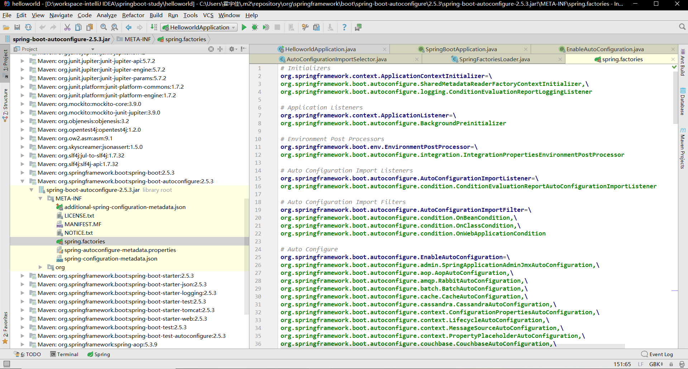
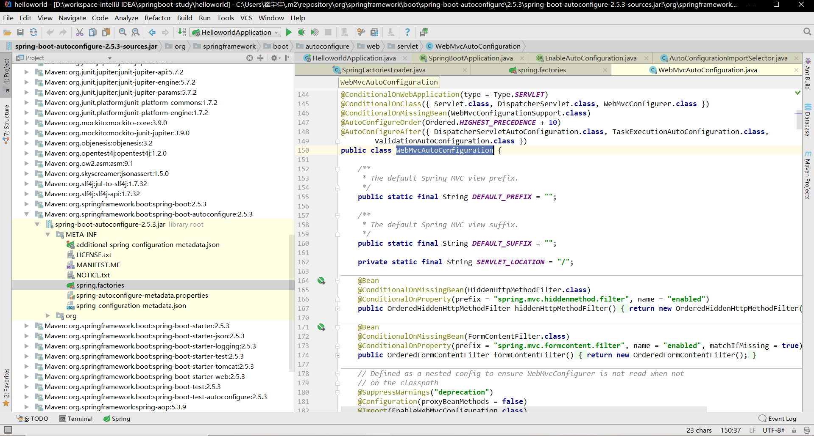
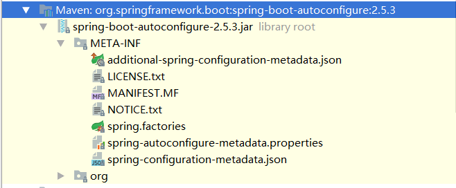

# pom.xml

## 依赖

默认有一个父依赖**spring-boot-starter-parent**

```xml
<parent>
		<groupId>org.springframework.boot</groupId>
		<artifactId>spring-boot-starter-parent</artifactId>
		<version>2.5.3</version>
		<relativePath/> <!-- lookup parent from repository -->
</parent>
```

该父依赖主要负责插件的管理和资源的过滤

该父依赖还有一个父依赖**spring-boot-dependencies**

```xml
<parent>
    <groupId>org.springframework.boot</groupId>
    <artifactId>spring-boot-dependencies</artifactId>
    <version>2.5.3</version>
</parent>
```

**spring-boot-dependencies**主要负责管理SpringBoot的所有依赖，控制导入的依赖版本。

- 我们导入某些依赖后不用写版本就是因为这里的properties已经注明版本。

- 如果依赖不在这里管理，则需要注明版本。

## 启动器

  ```xml
  <dependency>
  	<groupId>org.springframework.boot</groupId>
  	<artifactId>spring-boot-starter-web</artifactId>
  </dependency>
  ```

在SpringBoot中有很多种启动器，对应着不同的启动场景，意味着需要导入不同的依赖。

如**spring-boot-starter-web**帮我们导入了web场景下的Spring依赖。

# 主启动类

```java
package pers.yujia;

import org.springframework.boot.SpringApplication;
import org.springframework.boot.autoconfigure.SpringBootApplication;

@SpringBootApplication
public class HelloworldApplication {

	public static void main(String[] args) {
		SpringApplication.run(HelloworldApplication.class, args);
	}

}
```

## @SpringBootApplication

表示该类为SpringBoot的主配置类，说明这是一个SpringBoot的主程序，SpringBoot可以通过该类的main方法启动服务。

查看该注解类的源码，主要关心该注解类中的注解。

```java
@Target(ElementType.TYPE)
@Retention(RetentionPolicy.RUNTIME)
@Documented
@Inherited
@SpringBootConfiguration
@EnableAutoConfiguration
@ComponentScan(excludeFilters = { @Filter(type = FilterType.CUSTOM, classes = TypeExcludeFilter.class),
		@Filter(type = FilterType.CUSTOM, classes = AutoConfigurationExcludeFilter.class) })
```

- 前四行的**@Target(ElementType.TYPE)，@Retention(RetentionPolicy.RUNTIME)，@Documented，@Inherited**为SpringBoot中的每个注解类的标准注解，所以无需关注。

- 最后一行的ComponentScan为组件的扫描，扫描到的bean会自动装配到Spring容器。里面的filter表示过滤掉某些组件。
- 重点为==**@SpringBootConfiguration和@EnableAutoConfiguration**==

### @SpringBootConfiguration

```java
@Target({ElementType.TYPE})
@Retention(RetentionPolicy.RUNTIME)
@Documented
@Configuration
@Indexed
```

#### @Indexed

> **https://www.cnblogs.com/54chensongxia/p/14389134.html**

- 在应用中使用`@ComponentScan`扫描 package 时，如果 package 中包含很多的类，那么 Spring 启动的时候就会变慢。

- 提升性能的一个方案就是提供一个 Component 的候选列表，Spring 启动时直接扫描注入这些列表就行了，而不需要一个个类去扫描，再筛选出候选 Component。

- 需要注意的是：在这种模式下，所有组件扫描的目标模块都必须使用这种机制——大白话将就所有的 Component 组件都必须生成到列表文件中去。即不添加@Indexed的组件不会被扫描到。

#### @Configuration

- 说明这是一个配置类，相当于xml文件，继续点进去查看注解类源码，有**@Component**，说明配置类也是一个组件。
- 总而言之，启动类本身也是一个组件，负责启动SpringBoot应用。

### @EnableAutoConfiguration

#### @AutoConfigurationPackage

​		自动配置包，主要的作用就是扫描**HelloworldApplication.java**同级包下的组件，里面的注解==@Import(AutoConfigurationPackages.Registrar.class)==是核心。

##### @Import(AutoConfigurationPackages.Registrar.class)

```java
static class Registrar implements ImportBeanDefinitionRegistrar, DeterminableImports {

	@Override
	public void registerBeanDefinitions(AnnotationMetadata metadata, BeanDefinitionRegistry registry) {
        //此处有一个方法为getPackageNames()，说明是获取包的名字，将主启动类的所在包及包下面所有子包里面的所有组件扫描到Spring容器 ；
		register(registry, new PackageImports(metadata).getPackageNames().toArray(new String[0]));
	}

	@Override
	public Set<Object> determineImports(AnnotationMetadata metadata) {
		return Collections.singleton(new PackageImports(metadata));
	}

}
```

#### @Import(AutoConfigurationImportSelector.class)

自动配置导入选择器，即具体选择需要导入什么依赖。

##### AutoConfigurationImportSelector.class

###### selectImports(AnnotationMetadata annotationMetadata)

该类的第一个方法为==selectImports(AnnotationMetadata annotationMetadata)==，选择导入。

```java
public String[] selectImports(AnnotationMetadata annotationMetadata) {
	if (!isEnabled(annotationMetadata)) {
		return NO_IMPORTS;
	}
	AutoConfigurationEntry autoConfigurationEntry = getAutoConfigurationEntry(annotationMetadata);
	return StringUtils.toStringArray(autoConfigurationEntry.getConfigurations());
}
```

###### getAutoConfigurationEntry(annotationMetadata)

里面有一个方法==getAutoConfigurationEntry(annotationMetadata)==，获取自动配置入口。

```java
protected AutoConfigurationEntry getAutoConfigurationEntry(AnnotationMetadata annotationMetadata) {
	if (!isEnabled(annotationMetadata)) {
		return EMPTY_ENTRY;
	}
	AnnotationAttributes attributes = getAttributes(annotationMetadata);
	List<String> configurations = getCandidateConfigurations(annotationMetadata, attributes);
	configurations = removeDuplicates(configurations);
	Set<String> exclusions = getExclusions(annotationMetadata, attributes);
	checkExcludedClasses(configurations, exclusions);
	configurations.removeAll(exclusions);
	configurations = getConfigurationClassFilter().filter(configurations);
	fireAutoConfigurationImportEvents(configurations, exclusions);
	return new AutoConfigurationEntry(configurations, exclusions);
}
```

###### getCandidateConfigurations(annotationMetadata, attributes)

里面又有一个方法==getCandidateConfigurations(annotationMetadata, attributes)==，获取候选配置。

```java
protected List<String> getCandidateConfigurations(AnnotationMetadata metadata, AnnotationAttributes attributes) {
	List<String> configurations = SpringFactoriesLoader.loadFactoryNames(getSpringFactoriesLoaderFactoryClass(),getBeanClassLoader());
	Assert.notEmpty(configurations, "No auto configuration classes found in META-INF/spring.factories. If you " + "are using a custom packaging, make sure that file is correct.");
	return configurations;
}
```

###### getSpringFactoriesLoaderFactoryClass()

这里的==getSpringFactoriesLoaderFactoryClass()==方法返回的就是我们最开始看的启动自动导入配置文件的注解类。

```java
protected Class<?> getSpringFactoriesLoaderFactoryClass() {
	return EnableAutoConfiguration.class;
}
```

即==loadFactoryNames()==方法的第一个参数为==EnableAutoConfiguration.class==。下面打开该方法所属的类SpringFactoriesLoader。

##### SpringFactoriesLoader.java

```java
public static List<String> loadFactoryNames(Class<?> factoryType, @Nullable ClassLoader classLoader) {
	ClassLoader classLoaderToUse = classLoader;
	if (classLoaderToUse == null) {
		classLoaderToUse = SpringFactoriesLoader.class.getClassLoader();
	}
	String factoryTypeName = factoryType.getName();
	return loadSpringFactories(classLoaderToUse).getOrDefault(factoryTypeName, Collections.emptyList());
}
```

其中==loadSpringFactories(classLoaderToUse)==为核心。

###### loadSpringFactories(classLoaderToUse)

```java
private static Map<String, List<String>> loadSpringFactories(ClassLoader classLoader) {
	Map<String, List<String>> result = cache.get(classLoader);
	if (result != null) {
		return result;
	}

	result = new HashMap<>();
	try {
		Enumeration<URL> urls = classLoader.getResources(FACTORIES_RESOURCE_LOCATION);
		while (urls.hasMoreElements()) {
			URL url = urls.nextElement();
			UrlResource resource = new UrlResource(url);
			Properties properties = PropertiesLoaderUtils.loadProperties(resource);
			for (Map.Entry<?, ?> entry : properties.entrySet()) {
				String factoryTypeName = ((String) entry.getKey()).trim();
				String[] factoryImplementationNames =
						StringUtils.commaDelimitedListToStringArray((String) entry.getValue());
				for (String factoryImplementationName : factoryImplementationNames) {
					result.computeIfAbsent(factoryTypeName, key -> new ArrayList<>())
						.add(factoryImplementationName.trim());
				}
			}
		}

		// Replace all lists with unmodifiable lists containing unique elements
		result.replaceAll((factoryType, implementations) -> implementations.stream().distinct()
			.collect(Collectors.collectingAndThen(Collectors.toList(), Collections::unmodifiableList)));
		cache.put(classLoader, result);
	}
	catch (IOException ex) {
		throw new IllegalArgumentException("Unable to load factories from location [" +
				FACTORIES_RESOURCE_LOCATION + "]", ex);
	}
	return result;
}
```

- ==Enumeration<URL> urls = classLoader.getResources(FACTORIES_RESOURCE_LOCATION)==。

- 该方法参数==FACTORIES_RESOURCE_LOCATION==在SpringFactoriesLoader中为静态常量。

```java
public static final String FACTORIES_RESOURCE_LOCATION = "META-INF/spring.factories";
```

##### META-INF/spring.factories

打开==META-INF/spring.factories==查看。



可以看到该factories文件中有很多完整的类名。查看其中的==WebMvcAutoConfiguration==类。



- 该类就是一个Configuration，相当于Spring中的xml文件，用于注册bean。
- 该类的注解有ConditionalOnXXX，是指只有满足相关条件该配置中的bean才会被注册。如conditionalOnClass表示只有标注的类在依赖中被引入，该配置类才会生效。
- 综上所述，自动配置真正实现是从classpath中搜寻所有的==META-INF/spring.factories==配置文件 ，并将其中对应的
  ==org.springframework.boot.autoconfigure==包下的配置项，通过反射实例化为对应标注了 @Configuration的
  JavaConfig形式的IOC容器配置类 ， 然后将这些都汇总成为一个实例并加载到IOC容器中。

# 总结

==SpringBoot自动配置的核心总结：==

**@SpringBootApplication**→**@EnableAutoConfiguration**→**@Import(AutoConfigurationImportSelector.class)**→

**selectImports()**→**getAutoConfigurationEntry()**→**getCandidateConfigurations()**→

**SpringFactoriesLoader.loadFactoryNames()**→**SpringFactoriesLoader.loadSpringFactories()**→

通过解析**META-INF/spring.factories**→**全部配置类**→**配置类中的@ConditionalOnxxx注解**→**完成自动配置**


​		SpringBoot从==META-INF/spring.factories==中获取所有的配置类，但是这些配置类不一定生效（每个配置类都会有@ConditionalOnxxx类似的注解来判断条件），需要我们在==pom.xml==中添加对应的starter条件才会成立，即配置类才会生效，配置类中的Bean才会正式生效。

1. SpringBoot在启动时会根据==pom.xml==中的starter依赖来扫描==META-INF/spring.factories==，判断哪些配置类应该生效，那些配置类不应该生效。

2. 以前我们需要手动描述依赖，比如Spring-webmvc和aop依赖，但是现在只要在pom.xml中写对应场景的starter，这些依赖通通都会被引入。

3. 自动配置需要的资源（配置类的完整类名，jar包）全部在==spring-boot-autoconfigure-2.5.3.jar==中

   

4. 所有需要的组件（配置类）会以完整类名的形式被扫描进来，这些组件就会被Spring容器注册。这些组件都是@Configuration，相当于JavaConfig方式编写配置文件（和Spring中的xml文件作用一样），每个配置文件都会有该场景所需要的Bean。

5. 正是因为有了这些配置类，我们才不用编写Spring中如此多的xml文件。

   

