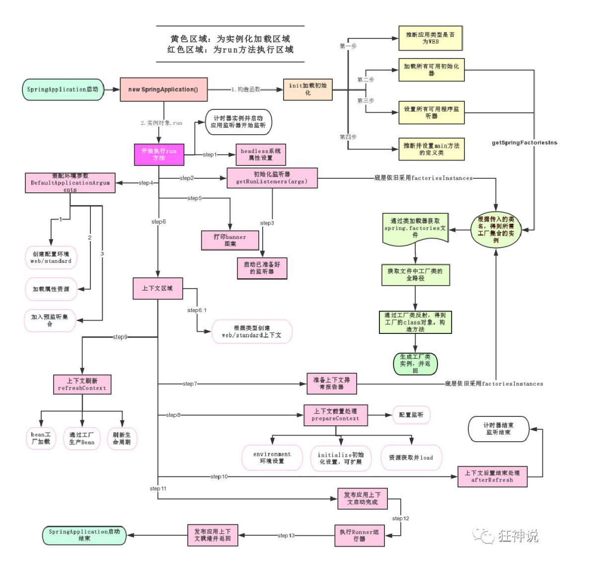

# 源码

```java
package pers.yujia;

import org.springframework.boot.SpringApplication;
import org.springframework.boot.autoconfigure.SpringBootApplication;

@SpringBootApplication
public class HelloworldApplication {

	public static void main(String[] args) {
		SpringApplication.run(HelloworldApplication.class, args);
	}

}
```

在每个SpringBoot应用中，都会有一个主类，该主类有一个main方法，用于启动SpringBoot应用。

在main方法中，都会有==SpringApplication.run(HelloworldApplication.class, args)==。下面简单分析该语句的作用。

# SpringApplication类实例化

SpringApplication并不是静态类，需要自动装载到Spring容器。装载的时候会运行构造方法，主要用途如下：

1. ==推断应用的类型是普通的项目还是Web项目==

    ```java
this.webApplicationType = WebApplicationType.deduceFromClasspath();
    ```

2. 查找并加载所有可用==初始化器== ， 设置到initializers属性中

   ```java
   setInitializers((Collection) getSpringFactoriesInstances(ApplicationContextInitializer.class));
   ```

3. 找出所有的应用程序==监听器==，设置到listeners属性中

    ```
    setListeners((Collection) getSpringFactoriesInstances(ApplicationListener.class));
    ```

4. 推断并设置main方法的定义类，==找到运行的主类==

    ```
    this.mainApplicationClass = deduceMainApplicationClass();
    ```

# SpringApplication.run



