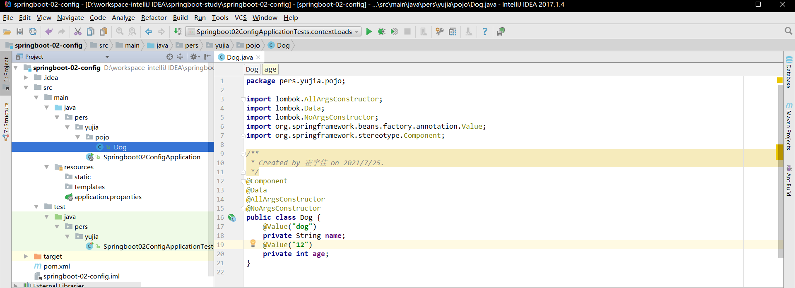
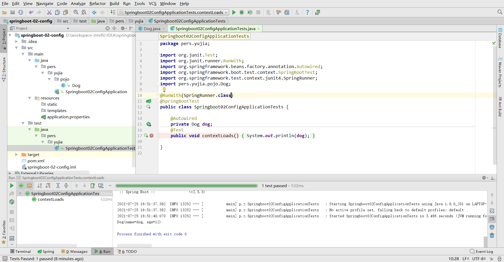
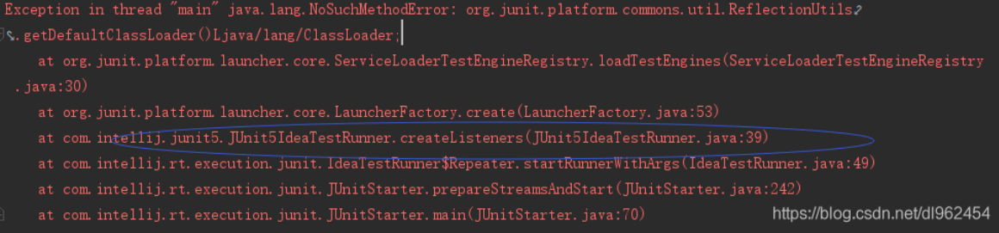
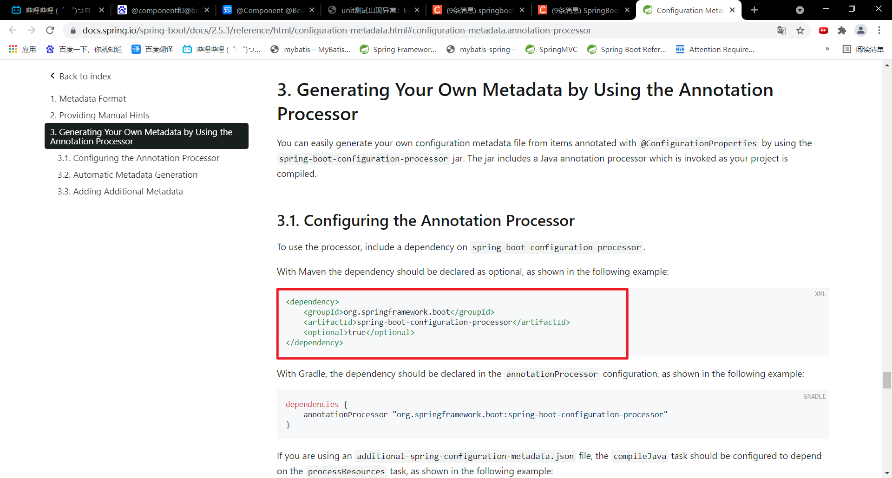
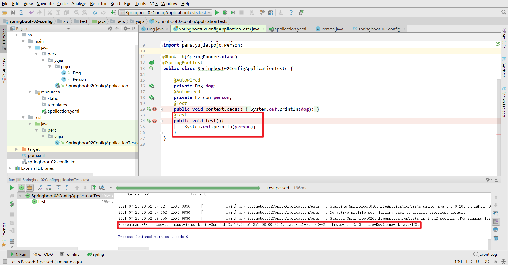
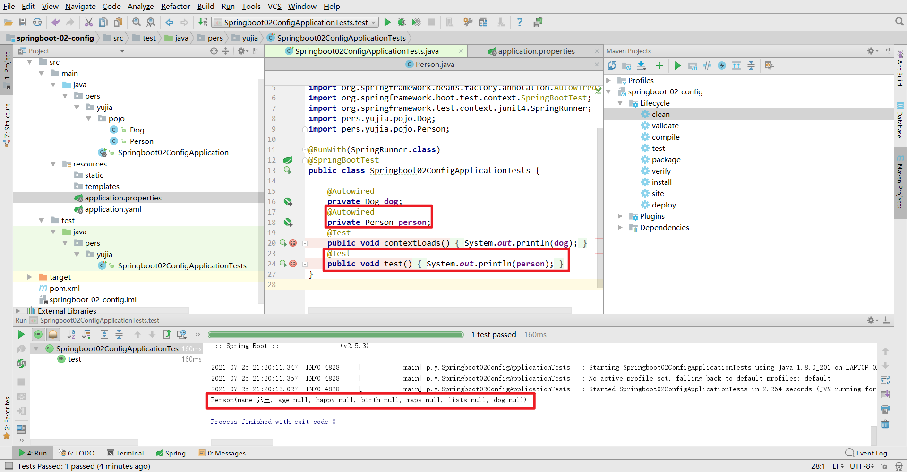
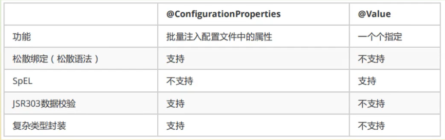

#  YAML概述

> ​		*YAML*是"YAML Ain't a Markup Language"（YAML不是一种[标记语言](https://baike.baidu.com/item/标记语言)）的[递归缩写](https://baike.baidu.com/item/递归缩写)。在开发的这种语言时，*YAML* 的意思其实是："Yet Another Markup Language"（仍是一种[标记语言](https://baike.baidu.com/item/标记语言)），但为了强调这种语言以数据做为中心，而不是以标记语言为重点，而用反向缩略语重命名。

SpringBoot可以使用yaml格式的文件来替代properties格式的文件，以进行SpringBoot的文件配置。

# YAML文件的语法

YAML文件和properties文件的数据描述一样，都采用键值对的形式描述数据。但是二者存在一定的区别。

1. YAML对于空格的要求极为严格，不可以忽略空格。
2. - application.properties
   - 语法结构 ：key=value
   - application.yml
   - 语法结构 ：key:空格 value

3. yaml文件支持对象和数组的概念，properties文件不支持。

```yaml
#对象
#成员属性要在对象名称的下面一行，并且开头必须有空格或者制表符
#字面量：普通的值 [ 数字，布尔值，字符串 ]
#字面量直接写在后面就可以，字符串默认不用加上双引号或者单引号
user:
#属性的值和属性名之间要有一个空格
 name: 张三
 #不同属性之间必须左边对齐，不可以加两个空格。如果加两个空格则代表为name对象的age属性，不符合常规。
 age: 18
#对象的行内写法(依旧要空格)
user: {name: 张三,age: 18}

#数组
array:
 - 1
 - 2
 - 3
#数组的行内写法
array: [1,2,3]
```

**注意：**

- “ ” 双引号，不会转义字符串里面的特殊字符 ， 特殊字符会作为本身想表示的意思；
  比如 ：name: "kuang \n shen" 输出 ：kuang 换行 shen
- '' 单引号，会转义特殊字符 ， 特殊字符最终会变成和普通字符一样输出
  比如 ：name: ‘kuang \n shen’ 输出 ：kuang \n shen

# SpringBoot注入yaml配置文件

可以使用yaml配置文件给实体类注入属性值，这是properties文件不能够实现的。

## 环境搭建

1. 在SpringBoot项目的Application的同级包下创建pojo包，并编写Dog类



**注意：@Component和@Bean的区别**

> https://zhuanlan.zhihu.com/p/145852514

2. 在SpringBoot的测试类中进行测试

   

   

**注意：**idea2017.3之前的版本都不支持junit5，如果直接使用模板生成的测试类，会报出如下错误：



因此，需要对测试环境进行修改：

- 在pom.xml中去除SpringBoot-test下的依赖

  ```xml
  <dependency>
  	<groupId>org.springframework.boot</groupId>
  	<artifactId>spring-boot-starter-test</artifactId>
      	<exclusions>
          	<exclusion>
              	<groupId>org.junit.jupiter</groupId>
                  <artifactId>junit-jupiter-api</artifactId>
              </exclusion>
          </exclusions>
      <scope>test</scope>
  </dependency>
  ```
  
- 导入junit依赖

  ```xml
  <dependency>
  	<groupId>junit</groupId>
      <artifactId>junit</artifactId>
  </dependency>
  ```

- 在类上添加@RunWith(SpringRunner.class)，使用Spring的驱动器而不是Junit，这样就会启动SpringBoot。
- 重新导入org.junit.Test包。

## 注入yaml配置

### 1. 编写pojo类

```java
package pers.yujia.pojo;

import lombok.AllArgsConstructor;
import lombok.Data;
import lombok.NoArgsConstructor;
import org.springframework.stereotype.Component;

import java.util.Date;
import java.util.List;
import java.util.Map;

/**
 * Created by 霍宇佳 on 2021/7/25.
 */
@Data
@AllArgsConstructor
@NoArgsConstructor
@Component
public class Person {
    private String name;
    private Integer age;
    private Boolean happy;
    private Date birth;
    private Map<String,Object> maps;
    private List<Object> lists;
    private Dog dog;
}
```

###  2. 编写yaml配置文件

```yaml
person:
  name: 张三
  age: 15
  happy: true
  birth: 2021/07/25 12:03:51
  maps: {k1: v1,k2: v2}
  lists: [1,2,3]
  Dog:
    name: 狗
    age: 12
```

- 日期类型Date可以用2021/07/25 12:03:51这样的日期格式。
- map可以用类似于JavaScript的对象表示，但注意键和值之间还要有空格。
- list可以用数组来表示。

### 3. yaml配置文件注入对象

在需要注入属性的类前添加注解：@ConfigurationProperties(prefix = "xx")

- 注意：这一步可能会报错，提示找不到SpringBoot配置注解处理器。


点击Open Documentation弹出SpringBoot官方文档[Configuration Metadata](https://docs.spring.io/spring-boot/docs/2.5.3/reference/html/configuration-metadata.html#configuration-metadata)



将该依赖复制进pom.xml解决该问题。

### 4. 在SpringBoot的测试类编写方法进行测试



# SpringBoot注入properties配置文件

## 1.编写properties配置文件

```properties
name=张三
```

## 2.properties配置文件注入对象

需要在pojo中导入properties文件

```java
@PropertySource(value="classpath:/application.properties")
```

使用Spring的SPEL表达式注入

```java
@Value("${name}")
private String name;
```

## 3. 在SpringBoot的测试类中编写方法测试



- **注意：**

  如果出现中文乱码问题，可以使用@propertySource(encoding=“utf-8”)解决

  如果还是中文乱码，重新编写properties文件即可解决。

# 配置文件占位符

```yaml
person:
  #占位符${random.uuid}
  name: 张三_${random.uuid}
  age: ${random.int}
  happy: true
  birth: 2021/07/25 12:03:51
  maps: {k1: v1,k2: v2}
  lists: [1,2,3]
  Dog:
    #{person.hello:hello}表示优先使用person对象的hello属性值，如果该属性不存在，则使用hello代替。
    name: ${person.hello:hello}狗
    age: 12
```

# yaml和properties对比



1. @ConfigurationProperties只需要写一次即可，@Value需要搭配@propertySource使用，并且需要每个字段都添加。
2. 松散绑定：这个什么意思呢? 比如我的yml中写的last-name，这个和lastName是一样的， - 后面跟着的字母默认是大
   写的。这就是松散绑定。可以测试一下。
3. JSR303数据校验 ， 这个就是我们可以在字段是增加一层过滤器验证 ， 可以保证数据的合法性。
4. 复杂类型封装，yml中可以封装对象 ， 使用value就不支持。
