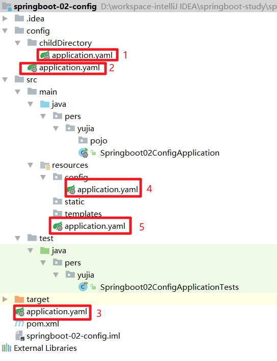

# 几个文件路径说明

1. From the classpath

   ​	a. The classpath root（ java或者resources文件夹中的配置文件）

   ​	b. The classpath `/config` package（java或者resources文件夹中的/config目录中的配置文件）

2. From the current directory

   ​	a. The current directory（项目目录中的配置文件）

   ​	b. The `/config` subdirectory in the current directory（项目目录对下来的/config目录中的配置文件）

   ​	c. Immediate child directories of the `/config` subdirectory（项目名对下来的/config目录下的直接子目录中的配置文件）

   
   
   该列表按优先级从低到高排序（较低的配置文件覆盖较高的配置文件），但是只是覆盖二者都存在的属性（互补配置）。
   
   最后的配置文件优先级如下图所示（1表示优先级最高）
   
   

  # 搭建多个配置文件的环境

profile是SpringBoot为不同环境提供不同配置文件的支持，用于激活配置文件，从而实现SpringBoot运行环境的快速切换。

 ## 配置文件的规范命名

对于一般的默认环境来说，配置文件可以命名为application-{profile}.properties或者application-{profile}.yaml。

- 比如application-test.properties表示测试环境下的SpringBoot配置文件
- application-dev.properties表示开发环境下的SpringBoot配置文件

这些配置文件同样需要保存在上述的路径。

## 激活某个配置文件

一般来说，SpringBoot优先扫描上述几个路径中文件名为application.properties或者application.yaml的配置文件。

在我们需要激活application-test.properties配置文件时，需要在application.yaml中编写下述语句：

```yaml
spring:
	profiles: 
		active: test
```

或者在application.properties编写下述语句：

```properties
spring.profiles.active=test
```

## 多文档块

对于一些小型SpringBoot项目来说，如果编写多个配置文件可能显得有点多余。

所以可以在application.yaml中统一编写多个配置，然后单独激活某个配置。具体的使用方法如下：

```yaml
#使用三个减号来分割每个配置
#激活的配置会覆盖掉原来的配置，下面的代码最终端口号为8084
---
server:
  port: 8081
spring:
  profiles:
    active: prod

---
server:
  port: 8083
#推荐使用这种方式，SpringBoot 2.4为了提升对Kubernetes的支持而作的修改。
spring:
  config:
    activate:
      on-profile: dev

---
server:
  port: 8084
spring:
  profiles: prod
```

**注意**：

- 如果yaml和properties同时都配置了端口，并且没有激活其他环境，默认会使用==properties==配置文件的！

- idea默认有代码提示，只要输入profiles或者on-profile即可。

