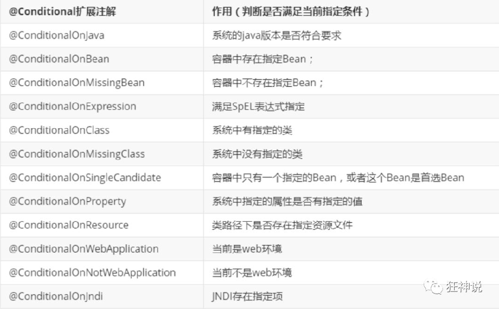

# SpringBoot如何自动导入在yaml或者properties中编写的配置信息

​		在[4.yaml配置注入.md](4.yaml配置注入.md)中，简要描述了SpringBoot可以使用yaml或者properties文件来进行组件的属性注入。

​		在[6.多个配置文件.md](6.多个配置文件.md)中，简要描述了SpringBoot可以通过yaml文件配置服务器端口。

​		这里将会介绍SpringBoot是如何自动配置yaml或者properties文件中编写的相关信息的，即SpringBoot是如何将在配置文件中的配置信息自动进行配置。

## HttpEncodingAutoConfiguration（Http编码自动配置）的分析

```java
@Configuration(proxyBeanMethods = false)
/*@Configuration表示这是一个配置类，可以添加组件到Spring容器中
* proxyBeanMethods = false表示用@Bean标注的bean不经过容器代理，获取bean的速度会提高*/

@EnableConfigurationProperties(ServerProperties.class)
/*这是SpringBoot自动配置的核心注解，具体作用在下面讲解*/

@ConditionalOnWebApplication(type = ConditionalOnWebApplication.Type.SERVLET)
/*@ConditionalOnWebApplication(type = ConditionalOnWebApplication.Type.SERVLET)
* 用来判断该应用是否为Web应用，如果不是Web应用则该配置类不生效*/

@ConditionalOnClass(CharacterEncodingFilter.class)
/*@ConditionalOnClass(CharacterEncodingFilter.class)
* 如果CharacterEncodingFilter没有被引入，则该配置类不生效*/

@ConditionalOnProperty(prefix = "server.servlet.encoding", value = "enabled", matchIfMissing = true)
/*@ConditionalOnProperty(prefix = "server.servlet.encoding", value = "enabled", matchIfMissing = true)
* 如果配置文件中的server.servlet.encoding.enabled为false，则该配置文件不生效
* matchIfMissing = true表示该属性默认为true*/

public class HttpEncodingAutoConfiguration {

	private final Encoding properties;

	/*只有一个有参构造器的情况下，参数的值会默认从容器中取出*/
	public HttpEncodingAutoConfiguration(ServerProperties properties) {
		this.properties = properties.getServlet().getEncoding();
	}

	@Bean
	@ConditionalOnMissingBean
    /*@ConditionalOnMissingBean表示CharacterEncodingFilter只能有一个Bean，即单例模式
    如果有两个类名为CharacterEncodingFilter的对象，则会报出异常*/

	public CharacterEncodingFilter characterEncodingFilter() {
		CharacterEncodingFilter filter = new OrderedCharacterEncodingFilter();
		filter.setEncoding(this.properties.getCharset().name());
		filter.setForceRequestEncoding(this.properties.shouldForce(Encoding.Type.REQUEST));
		filter.setForceResponseEncoding(this.properties.shouldForce(Encoding.Type.RESPONSE));
		return filter;
	}

	@Bean
	public LocaleCharsetMappingsCustomizer localeCharsetMappingsCustomizer() {
		return new LocaleCharsetMappingsCustomizer(this.properties);
	}

	static class LocaleCharsetMappingsCustomizer
			implements WebServerFactoryCustomizer<ConfigurableServletWebServerFactory>, Ordered {

		private final Encoding properties;

		LocaleCharsetMappingsCustomizer(Encoding properties) {
			this.properties = properties;
		}

		@Override
		public void customize(ConfigurableServletWebServerFactory factory) {
			if (this.properties.getMapping() != null) {
				factory.setLocaleCharsetMappings(this.properties.getMapping());
			}
		}

		@Override
		public int getOrder() {
			return 0;
		}

	}

}
```

## @EnableConfigurationProperties(ServerProperties.class)的作用

### @EnableConfigurationProperties的含义

下述为官方对于该注解的解释

> Enable support for {@link ConfigurationProperties `@ConfigurationProperties`} annotated beans. {@code `@ConfigurationProperties`} beans can be registered in the standard way (for example using {@link Bean `@Bean`} methods) or, for convenience, can be specified directly on this annotation.
>
> 启用对{@link ConfigurationProperties@ConfigurationProperties}注释bean的支持。{@code@ConfigurationProperties}Bean可以标准方式注册（例如使用{@link Bean@Bean}方法），或者为了方便起见，可以直接在此注释上指定。

- 简而言之，@EnableConfigurationProperties(ServerProperties.class)的作用是使`ServerProperties.java`生效，封装配置文件中的属性。
- @EnableConfigurationProperties和@ConfigurationProperties配合来使用，目的是让定义组件的JavaConfig类和定义组件属性的Java类分开，使耦合度降低。

-----

**注意**：

​		使用@EnableConfigurationProperties(xxx.class)的前提是xxx只是一个有@ConfigurationProperties注解的普通Java类（全是成员变量或者静态内部类），二者要搭配使用。

### 简要介绍ServerProperties.java

```java
@ConfigurationProperties(prefix = "server", ignoreUnknownFields = true)
public class ServerProperties {
    private Integer port;
    ……
}
```

由[4.yaml配置注入.md](4.yaml配置注入.md)可以得知，该属性可以使用配置文件来注入。

```yaml
server:
	port: 8080
```

SpringBoot中的规则为xxxProperties类的yyy属性可以通过xxx.yyy=value来注入。

# Conditional派生注解



​		Conditional派生注解的主要作用是只有满足一定的条件，该注解类才会生效，里面的组件才能注册到Spring容器中。

# 如何知道哪些SpringBoot的配置类生效

可以在SpringBoot的配置文件中添加下述语句：

```yaml
debug: true
```

这样SpringBoot在启动服务时就会打印日志，输出生效的配置类。

- Positive matches:（自动配置类启用的：正匹配）
- Negative matches:（没有启动，没有匹配成功的自动配置类：负匹配）
- Unconditional classes: （没有条件的类，必定会被扫描注册进Spring容器）
- Exclusions：手动排除的类（可以使用`@SpringBootApplication`注解的属性值`exclude`或`excludeName`来禁用某些自动配置类。）
