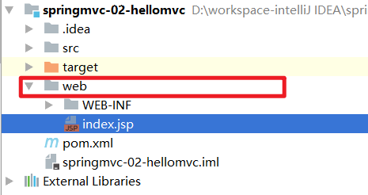
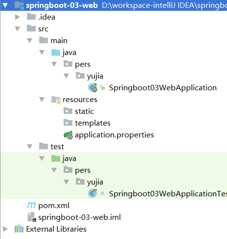
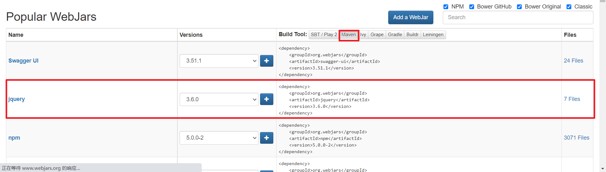
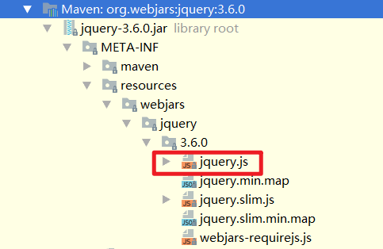
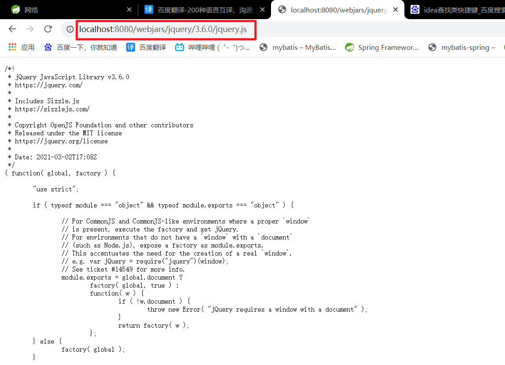
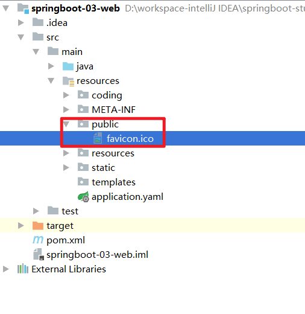
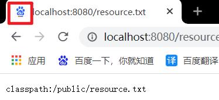

# 静态资源和动态资源

- 静态资源：一般客户端发送请求到web服务器，web服务器从内存在取到相应的文件，返回给客户端，客户端解析并渲染显示出来。
- 动态资源：一般客户端请求的动态资源，先将请求交于web容器，web容器连接数据库，数据库处理数据之后，将内容交给web服务器，web服务器返回给客户端解析渲染处理。

以前项目静态资源（网页、JS、CSS）可以放在web或者webapp文件夹下，如SpringMVC中最简单的HelloSpringMVC：



但是，使用idea的SpringBoot生成的项目中并没有web或者webapp这个文件夹，那么静态资源应该放在哪里呢？



# SpringBoot静态资源存放位置

## 1. classpath下的目录

> By default, Spring Boot serves static content from a directory called `/static` (or `/public` or `/resources` or `/META-INF/resources`) in the classpath or from the root of the `ServletContext`.
>
> 默认情况下，SpringBoot 的静态资源可以存储在classpath中名为`/static`（或`/public`或`/resources`或`/META-INF/resources`）的目录或`ServletContext`的根目录。

即可以通过以下4个路径来存放静态资源：

1. classpath:/static
2. classpath:/public
3. classpath:/resources
4. classpath:/META-INF/resources

优先级：`/META-INF/resources` > `/resources` > `/static` > `/public`

启动SpringBoot服务后，可以通过url：`localhost:8080/资源名字`来访问静态资源。

## 2. 拓展：通过WebJars存放静态资源

Webjars本质就是以jar包的方式引入我们的静态资源。

我们可以通过[WebJars官网](https://www.webjars.org/)来导入我们需要的WebJars：



导入jquery依赖之后查看WebJars目录结构：



SpringBoot对于WebJars的静态资源的访问说明：

> To use version agnostic URLs for Webjars, add the `webjars-locator-core` dependency. Then declare your Webjar. Using jQuery as an example, adding `"/webjars/jquery/jquery.min.js"` results in `"/webjars/jquery/x.y.z/jquery.min.js"` where `x.y.z` is the Webjar version.

则访问`jquery.js`需要使用`/webjars/jquery/3.6.0/jquery.js`的资源路径。



## 3. 更改url前缀

可以使用配置文件修改资源的映射。

> By default, resources are mapped on `/**`, but you can tune that with the `spring.mvc.static-path-pattern` property.
>
> 默认情况下，资源映射在 `/**`，但您可以使用`spring.mvc.static-path-pattern`属性对其进行调整。例如，将所有资源重新分配到`/resources/**`可以实现如下：

```yaml
spring:
  mvc:
    static-path-pattern: "/resources/**"
#更改静态资源的url映射
```

或者是

```yaml
server:
  servlet:
    context-path: /resources
#更改项目的url映射
```

设置了以上配置后，如果需要访问aaa.txt，可以通过`localhost:8080/resources/aaa.txt`来访问资源，而不是`localhost:8080/aaa.txt`

## 4. 更改静态资源存放位置

可以使用配置文件配置静态资源的存放位置，配置的内容如下：

```yaml
spring:
  resources:
    static-locations: classpath:/coding/
```

**注意**：一旦在配置文件中配置上述内容，则SpringBoot的默认静态文件存放的位置就无效了。

# 设置首页

> Spring Boot supports both static and templated welcome pages. It first looks for an `index.html` file in the configured static content locations. If one is not found, it then looks for an `index` template. If either is found, it is automatically used as the welcome page of the application.
>
> Spring Boot 支持静态和模板化欢迎页面。它首先`index.html`在配置的静态内容位置中查找文件。如果没有找到，它就会寻找一个`index`模板。如果找到其中之一，它会自动用作应用程序的欢迎页面。

下面通过源代码来分析：

```java
private Resource getWelcomePage() {
    /*从配置的静态资源存放位置中依次查找index.html*/
    for (String location : this.resourceProperties.getStaticLocations()) {
        Resource indexHtml = getIndexHtml(location);
        if (indexHtml != null) {
            /*找到则直接返回*/
            return indexHtml;
        }
    }
    ServletContext servletContext = getServletContext();
    if (servletContext != null) {
        return getIndexHtml(new ServletContextResource(servletContext, SERVLET_LOCATION));
    }
    return null;
}

private Resource getIndexHtml(String location) {
    return getIndexHtml(this.resourceLoader.getResource(location));
}

private Resource getIndexHtml(Resource location) {
    try {
        Resource resource = location.createRelative("index.html");
        if (resource.exists() && (resource.getURL() != null)) {
            return resource;
        }
    }
    catch (Exception ex) {
    }
    return null;
}
```

因此，我们的主页index.html可以存放在任一个静态资源文件夹，访问主页时就会扫描这些文件夹。

# 扩展：更改网站图标

SpringBoot会自动扫描静态资源文件夹中的favicon.ico，如果找到了就会使用该图片来替代网站图标。



**注意**：不一定是在public文件夹下，随便一个静态资源文件夹都可以。

更改网站图标后，可以启动SpringBoot服务，然后在浏览器中请求资源，会发现网站的图标已经更改。



