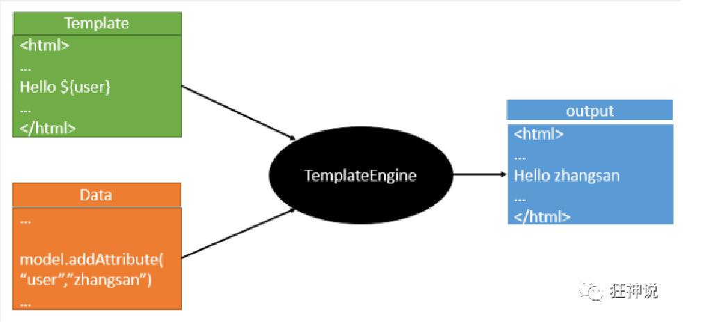
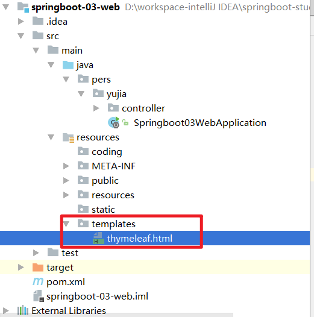
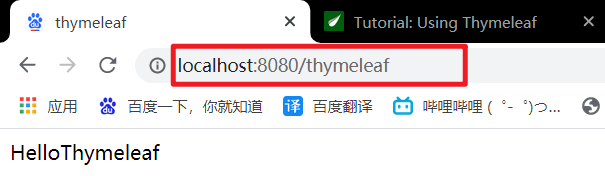

# 模板引擎概述

​		我们以前所使用的jsp其实就是一个模板引擎，现在常用的模板引擎常用的是freemarker以及SpringBoot所推荐的Thymeleaf，以上所提及的模板引擎，底层原理是一样的。



​		我们可以编写一些页面模板，里面有一些数据需要动态展示，这些数据需要通过后台处理才能获得。我们可以把页面模板和处理得到的数据一起交给模板引擎，让模板引擎来解析表达式，填充到页面模板中来，这就是模板引擎的作用。

​		不同的模板引擎，使用不同的语法结构。如jsp使用${}来动态表示数据内容。但Thymeleaf的语法较jsp来说更为简单，功能更加强大。下面来介绍Thymeleaf。

# 引入Thymeleaf

Thymeleaf的官方网站为[https://www.thymeleaf.org/](https://www.thymeleaf.org/)。

导入Thymeleaf依赖，导入后需要观察Thymeleaf是否是3.x版本的，如果是2.x可能会报错，需要把SpringBoot的版本升高。

```xml
<dependency>
    <groupId>org.springframework.boot</groupId>
    <artifactId>spring-boot-starter-thymeleaf</artifactId>
</dependency>
```

查看源码`ThymeleafProperties.java`源码

```java
public class ThymeleafProperties {

    private static final Charset DEFAULT_ENCODING = StandardCharsets.UTF_8;

    public static final String DEFAULT_PREFIX = "classpath:/templates/";

    public static final String DEFAULT_SUFFIX = ".html";

    ……
}
```

可以看出页面模板需要在/templates文件夹下面，默认只能使用html文件作为模板。

# 测试Thymeleaf

## 1. 在pom.xml下添加Thymeleaf的SpringBoot启动器依赖

```xml
<dependency>
    <groupId>org.springframework.boot</groupId>
    <artifactId>spring-boot-starter-thymeleaf</artifactId>
</dependency>
```

**注意：**如果添加的Thyemleaf版本低于3.x，可能会报错，需要将SpringBoot升级。

## 2. 在templates文件夹下添加网页模板html



```html
<!DOCTYPE html>
<!--要使用Thymeleaf需要添加命名空间约束-->
<html lang="en" xmlns:th="http://www.thymeleaf.org">
    <head>
        <meta charset="UTF-8">
        <title>thymeleaf</title>
    </head>
    <body>
        <div th:text="${msg}"></div>
    </body>
</html>
```

**注意：**需要在html标签下添加命名空间约束`xmlns:th="http://www.thymeleaf.org"` 

## 3. 编写Controller

```java
package pers.yujia.controller;

import org.springframework.stereotype.Controller;
import org.springframework.ui.Model;
import org.springframework.web.bind.annotation.RequestMapping;

/**
 * Created by 霍宇佳 on 2021/7/29.
 */
@Controller
public class ThymeleafController {
    @RequestMapping("/thymeleaf")
    public String thymeleaf(Model model){
        model.addAttribute("msg","HelloThymeleaf");
        return "thymeleaf";
    }
}
```

## 4. 在浏览器中测试



# Thymeleaf语法

## 标准表达式

- Simple expressions:

  - Variable Expressions: `${...}`	

    需要和Controller中model的attributeName保持一致

  - Selection Variable Expressions: `*{...}`

    和${}功能一致

  - Message Expressions: `#{...}`

    获取国际化内容

  - Link URL Expressions: `@{...}`

    定义url

  - Fragment Expressions: `~{...}`

    片段引用表达

- Literals（字面值）

  - Text literals: `'one text'`, `'Another one!'`,…
  - Number literals: `0`, `34`, `3.0`, `12.3`,…
  - Boolean literals: `true`, `false`
  - Null literal: `null`
  - Literal tokens: `one`, `sometext`, `main`,…

- Text operations（文本操作）:

  - String concatenation: `+`

    字符串连接

  - Literal substitutions: `|The name is ${name}|`

    常量替换

- Arithmetic operations（算数运算）:

  - Binary operators: `+`, `-`, `*`, `/`, `%`
  - Minus sign (unary operator): `-`

- Boolean operations（布尔运算）:

  - Binary operators: `and`, `or`
  - Boolean negation (unary operator): `!`, `not`

- Comparisons and equality（逻辑运算）:

  - Comparators: `>`, `<`, `>=`, `<=` (`gt`, `lt`, `ge`, `le`)
  - Equality operators: `==`, `!=` (`eq`, `ne`)

- Conditional operators（条件运算，使用三元运算符较多）:

  - If-then: `(if) ? (then)`
  - If-then-else: `(if) ? (then) : (else)`
  - Default: `(value) ?: (defaultvalue)`

- Special tokens（特殊符号）:

  - No-Operation: `_`

    不作任何操作，用于数字分割。如100_0000。

## 内置基本对象

- `#ctx`: the context object.
- `#vars:` the context variables.
- `#locale`: the context locale.
- `#request`: (only in Web Contexts) the `HttpServletRequest` object.
- `#response`: (only in Web Contexts) the `HttpServletResponse` object.
- `#session`: (only in Web Contexts) the `HttpSession` object.
- `#servletContext`: (only in Web Contexts) the `ServletContext` object.

## 内置工具对象

- `#execInfo`: information about the template being processed.
- `#messages`: methods for obtaining externalized messages inside variables expressions, in the same way as they would be obtained using #{…} syntax.
- `#uris`: methods for escaping parts of URLs/URIs
- `#conversions`: methods for executing the configured *conversion service* (if any).
- `#dates`: methods for `java.util.Date` objects: formatting, component extraction, etc.
- `#calendars`: analogous to `#dates`, but for `java.util.Calendar` objects.
- `#numbers`: methods for formatting numeric objects.
- `#strings`: methods for `String` objects: contains, startsWith, prepending/appending, etc.
- `#objects`: methods for objects in general.
- `#bools`: methods for boolean evaluation.
- `#arrays`: methods for arrays.
- `#lists`: methods for lists.
- `#sets`: methods for sets.
- `#maps`: methods for maps.
- `#aggregates`: methods for creating aggregates on arrays or collections.
- `#ids`: methods for dealing with id attributes that might be repeated (for example, as a result of an iteration).

# 遍历List

## 1. 编写Controller传送List

```java
package pers.yujia.controller;

import org.springframework.stereotype.Controller;
import org.springframework.ui.Model;
import org.springframework.web.bind.annotation.RequestMapping;

import java.util.Arrays;
import java.util.List;

/**
 * Created by 霍宇佳 on 2021/7/29.
 */
@Controller
public class ThymeleafController {
    @RequestMapping("/thymeleaf")
    public String thymeleaf(Model model){
        model.addAttribute("msg", Arrays.asList("张三","李四"));
        return "thymeleaf";
    }
}
```

## 2. 使用th:each来遍历List

```html
<!DOCTYPE html>
<!--要使用Thymeleaf需要添加命名空间约束-->
<html lang="en" xmlns:th="http://www.thymeleaf.org">
    <head>
        <meta charset="UTF-8">
        <title>thymeleaf</title>
    </head>
    <body>
        <div th:each="user:${msg}" th:text="${user}"></div>
    </body>
</html>
```

- `th:each="user:${msg}"`中的user代表List中的每个元素
- `th:text="${user}"`打印输出List元素

