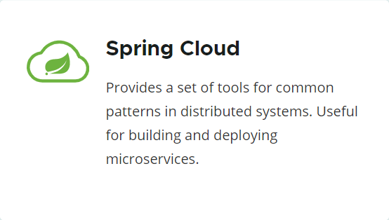
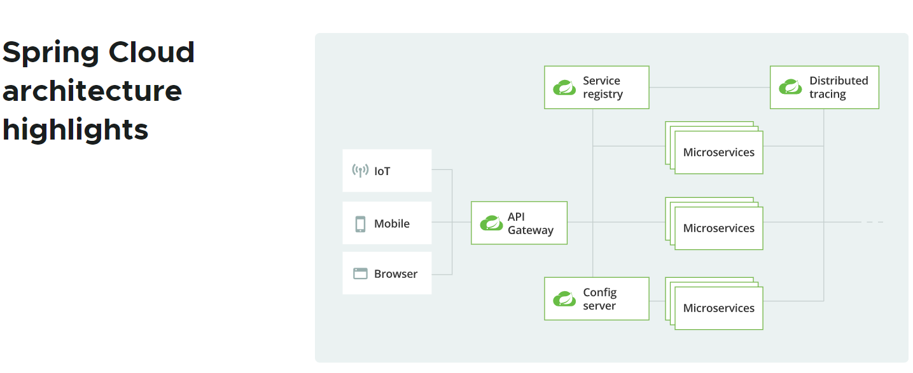
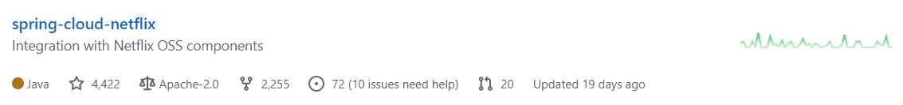
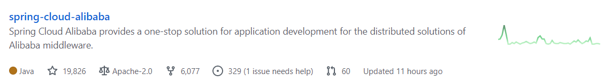
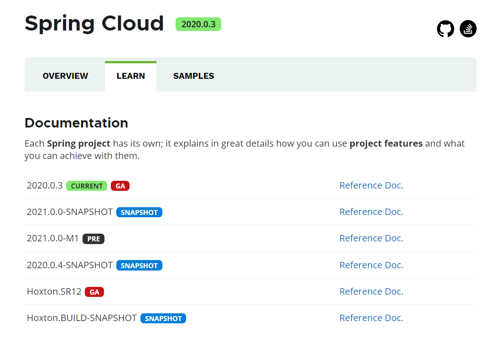
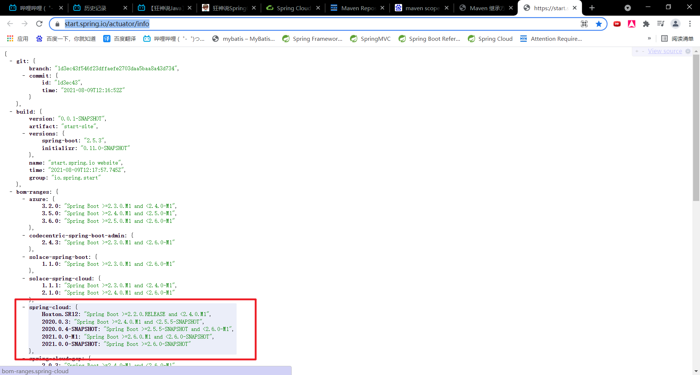

# 1. 什么是SpringCloud

## 1.1 SpringCloud概述

​		Spring官网对于SpringCloud的简述是：**为分布式系统的常规模式提供技术集合。对于构建和部署微服务十分有用。**

​		SpringCloud官方文档：[https://spring.io/projects/spring-cloud#overview](https://spring.io/projects/spring-cloud#overview)

> Spring Cloud provides tools for developers to quickly build some of the common patterns in distributed systems (e.g. configuration management, service discovery, circuit breakers, intelligent routing, micro-proxy, control bus, one-time tokens, global locks, leadership election, distributed sessions, cluster state). Coordination of distributed systems leads to boiler plate（样板） patterns, and using Spring Cloud developers can quickly stand up services and applications that implement those patterns. They will work well in any distributed environment, including the developer’s own laptop, bare metal data centres, and managed platforms such as Cloud Foundry.
>
> Spring Cloud为开发人员提供工具，用于快速构建分布式系统中的一些常见模式（例如配置管理、服务发现、熔断器、智能路由、微代理、控制总线、一次性令牌、全局锁、领导选举、分布式会话、集群状态）。分布式系统的协调导致样板模式，使用SpringCloud的开发人员可以快速建立实现这些模式的服务和应用程序。它们在任何分布式环境中都能很好地工作，包括开发人员自己的笔记本电脑、裸机数据中心和Cloud Foundry等托管平台。

> Spring Cloud focuses on providing good out of box experience for typical use cases and extensibility mechanism to cover others.
>
> SpringCloud专注于为典型用例提供良好的开箱即用体验，并提供覆盖其他用例的扩展机制。（开箱即用、易扩展）

## 1.2 SpringCloud的特性

- Distributed/versioned configuration（分布式/版本化控制）
- Service registration and discovery（服务注册与发现）
- Routing（路由）
- Service-to-service calls（程序间调用）
- Load balancing（负载均衡）
- Circuit Breakers（熔断器）
- Distributed messaging（分布式消息传递）

无论是SpringCloud Alibaba还是SpringCloud Netflix，都为微服务架构提供了一站式的解决方案，因此需要解决上述的问题。

# 2. SpringCloud和SpringBoot的关系

- SpringBoot专注于如何迅速地开发出单个个体的微服务，SpringCloud则聚焦于整个微服务框架的整体协调（全局的服务治理框架）
- SpringCloud是将由SpringBoot开发的一个个服务整合并管理起来，为各个微服务提供配置管理、服务发现、熔断器、路由、伪代理、事件总栈、全局锁、决策竞选、分布式会话等等集成服务。
- SpringBoot可以单独地开发某个微服务或某个项目，但SpringCloud必须依托SpringBoot进行开发，二者存在依赖关系。

# 3. Dubbo和SpringCloud技术选型

## 3.1 2021年热度比较

## 3.2 相关特性比较

|              | Dubbo         | SpringCloud                  |
| ------------ | ------------- | ---------------------------- |
| 服务注册中心 | Zookeeper     | Spring Cloud Netfilx Eureka  |
| 服务调用方式 | RPC           | REST API                     |
| 服务监控     | Dubbo-monitor | Spring Boot Admin            |
| 断路器       | 不完善        | Spring Cloud Netfilx Hystrix |
| 服务网关     | 无            | Spring Cloud Netfilx Zuul    |
| 分布式配置   | 无            | Spring Cloud Config          |
| 服务跟踪     | 无            | Spring Cloud Sleuth          |
| 消息总栈     | 无            | Spring Cloud Bus             |
| 数据流       | 无            | Spring Cloud Stream          |
| 批量任务     | 无            | Spring Cloud Task            |

​	**最大区别：SpringCloud舍弃了RPC服务调用，使用基于HTTP的REST来代替。这样做的好处是更加灵活，服务提供方和调用方之间的依赖仅仅依靠契约，不存在代码上的强依赖。**

## 3.3 总结

​		SpringCloud提供的是微服务框架的一站式解决方案，Dubbo更注重RPC通信机制，属于RPC框架。

# 4. SpringCloud的版本号说明

- 在2020年以前，SpringCloud采用版本号+版本名的方式。其中版本号又采用从‘A’到‘Z’的伦敦地铁站名，如最早的Realse版本：Angel，第二个Realse版本：Brixton，然后是Camden、Dalston、Edgware等等。

- 在2021年之后，SpringCloud发布的版本号构成为：年份.辅助版本号.补丁版本号，如2020.0.3。

# 5. 自学参考

**自学参考书：**

- SpringCloud Netflix 中文文档：https://springcloud.cc/spring-cloud-netflix.html
- SpringCloud 中文API文档(官方文档翻译版)：https://springcloud.cc/spring-cloud-dalston.html
- SpringCloud中国社区：http://springcloud.cn/
- SpringCloud中文网：[https://springcloud.cc](https://springcloud.cc/)

# 6. SpringBoot和SpringCloud的对应版本

查看网址：[https://start.spring.io/actuator/info](https://start.spring.io/actuator/info)

可以使用谷歌浏览器的Json插件JSONView来转化，使其更加美观。

