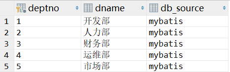

# 1. 项目的父工程

## 1.1 创建一个空的maven项目

## 1.2 管理整个项目的依赖版本

SpringCloud和SpringBoot的依赖版本可通过https://start.spring.io/actuator/info查看。

```xml
<?xml version="1.0" encoding="UTF-8"?>
<project xmlns="http://maven.apache.org/POM/4.0.0"
         xmlns:xsi="http://www.w3.org/2001/XMLSchema-instance"
         xsi:schemaLocation="http://maven.apache.org/POM/4.0.0 http://maven.apache.org/xsd/maven-4.0.0.xsd">
    <modelVersion>4.0.0</modelVersion>

    <groupId>pers.yujia</groupId>
    <artifactId>springcloud</artifactId>
    <version>1.0-SNAPSHOT</version>
    <modules>
        <module>springcloud-api</module>
        <module>springcloud-provider-dept-8001</module>
    </modules>

    <!--打包方式改为pom-->
    <packaging>pom</packaging>

    <properties>
        <!--项目构建的编码-->
        <project.build.sourceEncoding>UTF-8</project.build.sourceEncoding>
        <!--只是告诉推荐使用，并不是真正使用jdk8来编译-->
        <maven.compiler.source>1.8</maven.compiler.source>
        <maven.compiler.target>1.8</maven.compiler.target>
        <junit.version>4.12</junit.version>
        <log4j.version>1.2.17</log4j.version>
        <lombok.version>1.18.20</lombok.version>
    </properties>

    <!--
        父工程用来管理项目依赖版本
        只有子模块导入依赖，这些依赖才会被正式导入项目
    -->
    <dependencyManagement>
        <dependencies>

            <!--SpringCloud依赖，scope改为import-->
            <!-- https://mvnrepository.com/artifact/org.springframework.cloud/spring-cloud-dependencies -->
            <dependency>
                <groupId>org.springframework.cloud</groupId>
                <artifactId>spring-cloud-dependencies</artifactId>
                <version>2020.0.3</version>
                <type>pom</type>
                <scope>import</scope>
            </dependency>

            <!--SpringBoot依赖，如果是以parent的方式导入，则不能够继承公司的父依赖pom，因此我们一般以该方式导入-->
            <!-- https://mvnrepository.com/artifact/org.springframework.boot/spring-boot-dependencies -->
            <dependency>
                <groupId>org.springframework.boot</groupId>
                <artifactId>spring-boot-dependencies</artifactId>
                <version>2.5.4</version>
                <type>pom</type>
                <scope>import</scope>
            </dependency>

            <!--mysql-->
            <!-- https://mvnrepository.com/artifact/mysql/mysql-connector-java -->
            <dependency>
                <groupId>mysql</groupId>
                <artifactId>mysql-connector-java</artifactId>
                <version>8.0.26</version>
            </dependency>

            <!--druid-->
            <!-- https://mvnrepository.com/artifact/com.alibaba/druid -->
            <dependency>
                <groupId>com.alibaba</groupId>
                <artifactId>druid</artifactId>
                <version>1.2.6</version>
            </dependency>

            <!--SpringBoot启动器-->
            <!-- https://mvnrepository.com/artifact/org.mybatis.spring.boot/mybatis-spring-boot-starter -->
            <dependency>
                <groupId>org.mybatis.spring.boot</groupId>
                <artifactId>mybatis-spring-boot-starter</artifactId>
                <version>2.2.0</version>
            </dependency>


            <!--junit-->
            <dependency>
                <groupId>junit</groupId>
                <artifactId>junit</artifactId>
                <version>${junit.version}</version>
            </dependency>

            <!--log4j-->
            <dependency>
                <groupId>log4j</groupId>
                <artifactId>log4j</artifactId>
                <version>${log4j.version}</version>
            </dependency>

            <!--lombok-->
            <dependency>
                <groupId>org.projectlombok</groupId>
                <artifactId>lombok</artifactId>
                <version>${lombok.version}</version>
            </dependency>
        </dependencies>
    </dependencyManagement>
</project>
```

# 2. 服务提供者

## 2.1 api（实际上就是类库关系映射）

### 2.1.1 依赖导入

​		在父项目中的依赖是以dependencyManagement来进行管理的，所以此时并不会直接将依赖的jar包添加进项目。只有在子模块中声明才会被真正导入。

```xml
<dependencies>
    <dependency>
        <groupId>org.projectlombok</groupId>
        <artifactId>lombok</artifactId>
    </dependency>
</dependencies>
```

​		**注意：只有在父项目的dependencyManagement中声明的依赖，在子模块中才不用声明版本号。如果父项目没有对某个依赖进行管理，子模块依旧需要声明依赖的版本号。**

### 2.1.2 类库关系映射

类库关系映射实际上是**将数据库中的某个对象以Java对象的形式表示**。

数据库中的表如下，其中db_source表示该表所在的数据库名称：



该表的对象进行类库关系映射如下：

```java
package pers.yujia.springcloud.pojo;

import lombok.Data;
import lombok.NoArgsConstructor;
import lombok.experimental.Accessors;

import java.io.Serializable;

@Data
@NoArgsConstructor

/*允许链式编程，即dept.setDeptno(1).setDb_source("das");*/
@Accessors(chain = true)
public class Dept implements Serializable {
    private int deptno;
    private String dname;
    private String db_source;

    public void setDname(String dname) {
        this.dname = dname;
    }
}

```

## 2.2 provider

### 2.2.1 导入相关依赖

```xml
<?xml version="1.0" encoding="UTF-8"?>
<project xmlns="http://maven.apache.org/POM/4.0.0"
         xmlns:xsi="http://www.w3.org/2001/XMLSchema-instance"
         xsi:schemaLocation="http://maven.apache.org/POM/4.0.0 http://maven.apache.org/xsd/maven-4.0.0.xsd">
    <parent>
        <artifactId>springcloud</artifactId>
        <groupId>pers.yujia</groupId>
        <version>1.0-SNAPSHOT</version>
    </parent>
    <modelVersion>4.0.0</modelVersion>

    <artifactId>springcloud-provider-dept-8001</artifactId>

    <dependencies>
        <!--导入实体类-->
        <dependency>
            <groupId>pers.yujia</groupId>
            <artifactId>springcloud-api</artifactId>
            <version>1.0-SNAPSHOT</version>
        </dependency>

        <!--junit-->
        <dependency>
            <groupId>junit</groupId>
            <artifactId>junit</artifactId>
        </dependency>

        <!--log4j-->
        <dependency>
            <groupId>log4j</groupId>
            <artifactId>log4j</artifactId>
        </dependency>

        <!--lombok-->
        <dependency>
            <groupId>org.projectlombok</groupId>
            <artifactId>lombok</artifactId>
        </dependency>

        <!--mysql-->
        <dependency>
            <groupId>mysql</groupId>
            <artifactId>mysql-connector-java</artifactId>
        </dependency>

        <!--druid-->
        <dependency>
            <groupId>com.alibaba</groupId>
            <artifactId>druid</artifactId>
        </dependency>

        <!--mybatis-->
        <dependency>
            <groupId>org.mybatis.spring.boot</groupId>
            <artifactId>mybatis-spring-boot-starter</artifactId>
        </dependency>

        <!--SpringBoot-web-->
        <dependency>
            <groupId>org.springframework.boot</groupId>
            <artifactId>spring-boot-starter-web</artifactId>
        </dependency>

        <!--jetty，和tomcat都属于服务器-->
        <dependency>
            <groupId>org.springframework.boot</groupId>
            <artifactId>spring-boot-starter-jetty</artifactId>
        </dependency>

        <!--热部署，每次修改代码只需要刷新(具体在idea上的使用方法进行百度)-->
        <dependency>
            <groupId>org.springframework.boot</groupId>
            <artifactId>spring-boot-devtools</artifactId>
        </dependency>

    </dependencies>

</project>
```

### 2.2.2 application.yaml（SpringBoot配置）

```yaml
#服务器端口号
server:
  port: 8001

#MyBatis
mybatis:
  type-aliases-package: pers.yujia.springcloud.pojo
  config-location: classpath:mybatis/mybatis-config.xml
  mapper-locations: classpath:mybatis/mapper/*.xml

#Spring
spring:
  datasource:
    type: com.alibaba.druid.pool.DruidDataSource
    driver-class-name: com.mysql.cj.jdbc.Driver
    url: jdbc:mysql://localhost:3306/mybatis?useSSL=true&useUnicode=true&characterEncoding=utf-8
    username: root
    password: 333
```

### 2.2.3 mybatis-config.xml（MyBatis配置）

```xml
<?xml version="1.0" encoding="UTF-8" ?>
<!DOCTYPE configuration
        PUBLIC "-//mybatis.org//DTD Config 3.0//EN"
        "http://mybatis.org/dtd/mybatis-3-config.dtd">
<configuration>
    <!--开启二级缓存-->
    <settings>
        <setting name="cacheEnabled" value="true"/>
    </settings>
</configuration>
```

### 2.2.4 dao层

​		dao层涉及的实体类是另外一个模块的，所以需要在依赖中导入另外一个模块。

#### DeptDao.java

```java
@Repository
@Mapper
public interface DeptDao {
    public void insertDept(Dept dept);
    public Dept selectDeptByDeptno(@Param("deptno") int deptno);
    public List<Dept> selectAllDept();
}
```

#### DeptDao.xml

```xml
<?xml version="1.0" encoding="UTF-8" ?>
<!DOCTYPE mapper
        PUBLIC "-//mybatis.org//DTD Config 3.0//EN"
        "http://mybatis.org/dtd/mybatis-3-mapper.dtd">
<mapper namespace="pers.yujia.springcloud.dao.DeptDao">
    <insert id="insertDept" parameterType="dept">
        insert into dept values(#{deptno},DATABASE())
    </insert>
    <select id="selectDeptByDeptno" resultType="dept">
        select * from dept
        <where>
            deptno=#{deptno}
        </where>
    </select>
    <select id="selectAllDept" resultType="dept">
        select * from dept
    </select>
</mapper>
```

### 2.2.5 service层

#### DeptService.java

```java
public interface DeptService {
    public void insertDept(Dept dept);
    public Dept selectDeptByDeptno(int deptno);
    public List<Dept> selectAllDept();
}
```

#### DeptServiceImpl.java

```java
@Service
public class DeptServiceImpl implements DeptService {

    @Autowired
    private DeptDao deptDao;
    @Override
    public void insertDept(Dept dept) {
        deptDao.insertDept(dept);
    }

    @Override
    public Dept selectDeptByDeptno(int deptno) {
        return deptDao.selectDeptByDeptno(deptno);
    }

    @Override
    public List<Dept> selectAllDept() {
        return deptDao.selectAllDept();
    }
}
```

### 2.2.6 controller层

```java
@RestController
public class DeptController {
    //@Autowired默认按照类型进行匹配，如果没有该类，则找该类的子类，直到找到为止。
    @Autowired
    private DeptService deptService;

    @PostMapping("/dept/add")
    public void addDept(Dept dept) {
        deptService.insertDept(dept);
    }

    @GetMapping("/dept/get/{id}")
    public Dept getDeptByDeptno(@PathVariable("id") int deptno) {
        return deptService.selectDeptByDeptno(deptno);
    }

    @GetMapping("/dept/list")
    public List<Dept> getAllDept() {
        return deptService.selectAllDept();
    }
}
```

### 2.2.7 主启动类

```java
/*主启动类*/
@SpringBootApplication
public class DeptProvider_8001 {
    public static void main(String[] args) {
        SpringApplication.run(DeptProvider_8001.class,args);
    }
}
```


# 3. 服务消费者

##  3.1 导入相关依赖

```xml
<?xml version="1.0" encoding="UTF-8"?>
<project xmlns="http://maven.apache.org/POM/4.0.0"
         xmlns:xsi="http://www.w3.org/2001/XMLSchema-instance"
         xsi:schemaLocation="http://maven.apache.org/POM/4.0.0 http://maven.apache.org/xsd/maven-4.0.0.xsd">
    <parent>
        <artifactId>springcloud</artifactId>
        <groupId>pers.yujia</groupId>
        <version>1.0-SNAPSHOT</version>
    </parent>
    <modelVersion>4.0.0</modelVersion>

    <artifactId>springcloud-consumer-dept-80</artifactId>

    <dependencies>
        <dependency>
            <groupId>pers.yujia</groupId>
            <artifactId>springcloud-api</artifactId>
            <version>1.0-SNAPSHOT</version>
        </dependency>
        <dependency>
            <groupId>org.springframework.boot</groupId>
            <artifactId>spring-boot-starter-web</artifactId>
        </dependency>
    </dependencies>

</project>
```

## 3.2 RestTemplate

​		由于Rest风格中服务的消费者是没有业务层的，所以需要通过http协议来远程请求服务提供者来提供服务。Spring为此提供了`RestTemplate`类来简化程序。

​		Spring的`RestTemplate`类为使用HTTP协议来访问远程服务提供了便捷的方式。

| Method group      | Description                                                  |
| :---------------- | :----------------------------------------------------------- |
| ==getForObject==  | Retrieves a representation via GET.                          |
| `getForEntity`    | Retrieves a `ResponseEntity` (that is, status, headers, and body) by using GET. |
| `headForHeaders`  | Retrieves all headers for a resource by using HEAD.          |
| `postForLocation` | Creates a new resource by using POST and returns the `Location` header from the response. |
| ==postForObject== | Creates a new resource by using POST and returns the representation from the response. |
| `postForEntity`   | Creates a new resource by using POST and returns the representation from the response. |
| `put`             | Creates or updates a resource by using PUT.                  |
| `patchForObject`  | Updates a resource by using PATCH and returns the representation from the response. Note that the JDK `HttpURLConnection` does not support the `PATCH`, but Apache HttpComponents and others do. |
| `delete`          | Deletes the resources at the specified URI by using DELETE.  |
| `optionsForAllow` | Retrieves allowed HTTP methods for a resource by using ALLOW. |
| `exchange`        | More generalized (and less opinionated) version of the preceding methods that provides extra flexibility when needed. It accepts a `RequestEntity` (including HTTP method, URL, headers, and body as input) and returns a `ResponseEntity`.These methods allow the use of `ParameterizedTypeReference` instead of `Class` to specify a response type with generics. |
| `execute`         | The most generalized way to perform a request, with full control over request preparation and response extraction through callback interfaces. |

## 3.3 JavaConfig

​		通过JavaConfig的方式将RestTemplate实例通过Spring容器进行管理。

```java
@Configuration
public class DeptConsumerConfig {
    @Bean
    public RestTemplate getRestTemplate(){
        return new RestTemplate();
    }
}
```

## 3.4 controller

```java
@RestController
public class DeptConsumerController {
    /*服务提供者的域名*/
    public static final String REST_URL_PREFIX = "http://localhost:8001";
    @Autowired
    private RestTemplate restTemplate;

    @RequestMapping("/consumer/dept/add/{dname}")
    public String addDept(@PathVariable("dname") String dname) {
        Dept dept = new Dept(dname);
        System.out.println(dept);
        restTemplate.postForObject(REST_URL_PREFIX + "/dept/add", dept, Void.class);
        return "success";
    }

    @RequestMapping("/consumer/dept/get/{id}")
    public Dept getDeptById(@PathVariable int id) {
        return restTemplate.getForObject(REST_URL_PREFIX + "/dept/get/" + id, Dept.class);
    }

    @RequestMapping("/consumer/dept/list")
    public List<Dept> getAllDept(){
        return restTemplate.getForObject(REST_URL_PREFIX + "/dept/list",List.class);
    }
}
```

- RestTemplate的postForObject方法和getForObject方法一般有两个到三个参数

  第一个参数为服务提供者的controller对外接口，一般是http://域名/mapping

  第二个参数为请求的参数，如果请求没有参数则可以不加。

  第三个参数为从服务提供者返回的参数类型的class。如果不返回则为Void.class。

## 3.5 主启动类

  ```java
  @SpringBootApplication
  public class DeptConsumer_80 {
      public static void main(String[] args) {
          SpringApplication.run(DeptConsumer_80.class,args);
      }
  }
  ```


  

