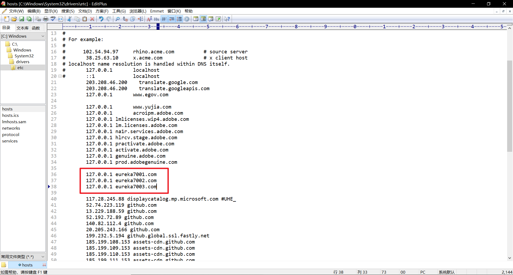

# 1. Eureka概述


## 1.1 什么是Eureka

> Service Discovery is one of the key tenets of a microservice-based architecture. Trying to hand-configure each client or some form of convention can be difficult to do and can be brittle. Eureka is the Netflix Service Discovery Server and Client. The server can be configured and deployed to be highly available, with each server replicating state about the registered services to the others.
>
> 服务发现是基于微服务的体系结构的关键原则之一。试图手动配置每个客户机或某种形式的约定可能很难做到，而且可能很脆弱。Eureka是Netflix服务发现服务器和客户端。服务器可以配置和部署为高可用，每台服务器都将注册服务的状态复制给其他服务器。

​		Eureka是Netflix的一个子模块，也是核心模块之一。Eureka是基于Rest的服务，用于微服务的服务注册与发现。只要使用某个服务的标识符，就能访问到该服务。功能类似于Dubbo的注册中心ZooKeeper。


## 1.2 Eureka的基本架构

- Eureka采用的是C-S的整体框架。
- EurekaServer作为服务的注册中心，是server端。服务的提供者需要将服务注册到EurekaServer。
- 其他的模块如果想要使用EurekaServer中已经注册的服务，需要通过Eureka的客户端连接到EurekaServer并且维持心跳连接（如每5秒发送消息）。这样系统维护人员就可以监控系统中的各个微服务是否正常运行。


## 1.3 Eureka的三个角色

- Eureka Server：服务的注册中心。提供服务注册与发现功能。
- Service Provide：服务提供者，需要到服务注册中心中注册自己的服务。
- Server Consumer：服务消费者，需要到服务注册中心获取注册服务列表，以获取服务。


# 2. 构建Eureka服务器

## 2.1 导入相关依赖

```xml
<dependency>
    <groupId>org.springframework.cloud</groupId>
    <artifactId>spring-cloud-starter-netflix-eureka-server</artifactId>
    <version>3.0.3</version>
</dependency>
```


## 2.2 配置application.yaml

```yaml
server:
  port: 7001

eureka:
  instance:
    hostname: localhost #Eureka服务器名字
  client:
    registerWithEureka: false #表示该模块不向注册中心注册
    fetchRegistry: false #表示该模块就是注册中心
    serviceUrl:
      defaultZone: http://${eureka.instance.hostname}:${server.port}/eureka/ #服务提供者和消费者访问的url
```


## 2.3 主启动类

```java
@SpringBootApplication
@EnableEurekaServer	//表示这是一个Eureka服务器
public class EurekaServer_7001 {
    public static void main(String[] args) {
        SpringApplication.run(EurekaServer_7001.class,args);
    }
}
```


## 2.4 Eureka监控页面

​		Eureka监控页面的地址是**http://${eureka.instance.hostname}:${server.port}**，而不是http://${eureka.instance.hostname}:${server.port}/eureka/


# 3. 服务提供者向注册中心注册服务

## 3.1 服务提供者额外导入依赖

```xml
<!-- https://mvnrepository.com/artifact/org.springframework.cloud/spring-cloud-starter-netflix-eureka-client -->
<dependency>
    <groupId>org.springframework.cloud</groupId>
    <artifactId>spring-cloud-starter-netflix-eureka-client</artifactId>
    <version>3.0.3</version>
</dependency>
```


## 3.2 修改相关配置文件（application.yaml）

```yaml
eureka:
  client:
    serviceUrl:
      defaultZone: http://localhost:7001/eureka/  #Eureka服务器的url
  instance:
    instance-id: spring-cloud-provider-dept-8001 #在eureka注册的此实例的唯一ID
```


## 3.3 开启Eureka客户端，自动向注册中心注册服务

```java
@SpringBootApplication
@EnableEurekaClient	//开启Eureka客户端，自动向注册中心注册服务
public class DeptProvider_8001 {
    public static void main(String[] args) {
        SpringApplication.run(DeptProvider_8001.class,args);
    }
}
```


## 3.4 测试服务注册情况

先开启Eureka服务器服务，再开启服务提供者的服务。访问http://localhost:7001查看服务注册的情况。


## 3.5 Eureka自我保护机制

### 3.5.1 Eureka自我保护机制简述

​		默认情况下，当Eureka Server一定时间内（默认为90秒）没有收到实例的心跳，就会将该实例从服务注册表中删除。如果在短时间内丢失大量实例心跳（Renews threshold>Renews lastmin），那么就会触发Eureka的自我保护机制。


​		Eureka的自我保护机制是指Eureka短时间内丢失大量心跳后，就会识别Eureka服务器和服务提供者之间的网络出现了故障。**虽然收不到实例的心跳，但Eureka服务器仍然认为这些服务是健康的，因此不会从注册表中删除实例。**

### 3.5.2 Eureka自我保护机制的作用

​		首先，假设服务提供者与Eureka服务器之间的网络出现故障，因为服务提供者仅在服务开启时向Eureka服务器注册服务，所以网络恢复时服务提供者不会向Eureka服务器注册服务。一旦删除实例，如果服务提供者不重启，那么服务消费者就永远无法获取该服务。因此我们要保证删除实例是大概率因为服务提供者的服务出现健康问题，而不是服务提供者与Eureka服务器的网络出现问题。

​		如果Eureka自我保护机制关闭并且Eureka服务器和服务提供者之间的网络出现故障，Eureka经过一段时间就会将该实例从服务注册表中删除。但是此时服务提供者的服务是健康的，服务者-消费者和消费者-服务器两条路仍然是通畅的，服务消费者事实上仍然能够获取服务提供者提供的服务，但是注册表里已经没有该实例了，因此就会造成资源上的浪费。


## 3.6 获取在Eureka服务器上的服务注册信息

​		当我们单人开发某个项目时，不需要了解服务器上的服务注册信息。但是一旦项目有很多人参与进来，我们需要了解别人的开发情况，需要了解有什么服务注册在Eureka服务器上。

​		SpringCloud提供了`DiscoveryClient`接口，来让服务注册中心（Eureka、Zookeeper等）来实现。我们可以调用注册在Spring容器中的`DiscoveryClient`的方法来发现注册在Eureka服务器中的服务信息。

```java
@Autowired
private DiscoveryClient discoveryClient;

/*获取注册到Eureka服务器的微服务信息*/
@GetMapping("/dept/discovery")
public DiscoveryClient discoveryClient(){
    /*获取在Eureka服务器上注册的所有服务*/
    List<String> services = discoveryClient.getServices();
    System.out.println("discovery services=>" + services);

    /*获取某个服务的所有实例*/
    List<ServiceInstance> instances = discoveryClient.getInstances("SPRING-CLOUD-PROVIDER-DEPT-8001");
    for (ServiceInstance instance : instances) {
        System.out.println(instance.getHost() + ":" + instance.getPort() + "\t" + instance.getUri() + "\t" + instance.getInstanceId());
    }
    return this.discoveryClient;
}
```


# 4. 集群环境配置

​		Eureka集群是指多个Eureka服务器共享一个服务注册表，即使其中的某一个Eureka服务器宕机，服务消费者仍能从其他的Eureka服务器获取服务，增强服务的健壮性。

## 4.1 新建两个额外的Eureka服务器

新建两个额外的Eureka服务器`springcloud-eureka-7002`和`springcloud-eureka-7003`模块。

### 4.1.1 导入相关依赖

```xml
<dependencies>
    <!-- https://mvnrepository.com/artifact/org.springframework.cloud/spring-cloud-starter-netflix-eureka-server -->
    <dependency>
        <groupId>org.springframework.cloud</groupId>
        <artifactId>spring-cloud-starter-netflix-eureka-server</artifactId>
        <version>3.0.3</version>
    </dependency>
</dependencies>
```

### 4.1.2 修改配置文件application.yaml

```yaml
server:
  port: 7002

eureka:
  instance:
    hostname: eureka7002.com #Eureka服务器的主机名字，集群中服务注册是根据主机名注册的，因此不能相同
  client:
    serviceUrl: #这里没有registerWithEureka:false和fetchRegistry:false，说明需要自注册和向其他节点注册自己。
      defaultZone: http://eureka7001.com:7001/eureka/,http://eureka7003.com:7003/eureka/ #集群中的其他节点，必须为http://主机名:端口号/eureka/
      
spring:
  application:
    name: springcloud	#集群中的各服务器应用名应相同
```

### 4.1.3 主启动类

```java
@SpringBootApplication
@EnableEurekaServer
public class EurekaServer_7002 {
    public static void main(String[] args) {
        SpringApplication.run(EurekaServer_7002.class,args);
    }
}
```

## 4.2 修改系统hosts配置文件



## 4.3 测试Eureka集群

依次启动`springcloud-eureka-7001`、`springcloud-eureka-7002`、`springcloud-eureka-7003`服务。

打开网页http://eureka7001.com:7001/，查看Eureka集群信息。


# 5. Eureka和ZooKeeper的区别

 ## 5.1 回顾CAP原则

关系型数据库 RDBMS (MySQL\Oracle\sqlServer) ===> ACID

非关系型数据库 NoSQL (Redis\MongoDB) ===> CAP

## 5.2 ACID是什么？

- A (Atomicity) 原子性
- C (Consistency) 一致性
- I (Isolation) 隔离性
- D (Durability) 持久性

## 5.3 CAP是什么?

- **C (Consistency) 强一致性**：在一个一致性的系统中，客户端向任何服务器发起一个写请求，将一个值写入服务器并得到响应，那么之后向任何服务器发起读请求，都必须读取到这个值(或者更加新的值)。
- **A (Availability) 可用性：**在一个可用的分布式系统中，客户端向其中一个服务器发起一个请求且该服务器未崩溃，那么这个服务器最终必须响应客户端的请求。
- **P (Partition tolerance) 分区容错性：**网络将被允许任意丢失从一个节点发送到另一个节点的许多消息。

CAP的三进二：CA、AP、CP

## 5.4 CAP理论的核心

- 一个分布式系统不可能同时很好的满足一致性，可用性和分区容错性这三个需求
- 根据CAP原理，将NoSQL数据库分成了满足CA原则，满足CP原则和满足AP原则三大类
  - CA：单点集群，满足一致性，可用性的系统，通常可扩展性较差
  - CP：满足一致性，分区容错的系统，通常性能不是特别高
  - AP：满足可用性，分区容错的系统，通常可能对一致性要求低一些

## 5.5 作为分布式服务注册中心，Eureka比Zookeeper好在哪里？

著名的CAP理论指出，一个分布式系统不可能同时满足C (一致性) 、A (可用性) 、P (容错性)，由于分区容错性P再分布式系统中是必须要保证的，因此我们只能再A和C之间进行权衡。

- Zookeeper 保证的是 CP —> 满足一致性，分区容错的系统，通常性能不是特别高
- Eureka 保证的是 AP —> 满足可用性，分区容错的系统，通常可能对一致性要求低一些

## 5.6 总结
**Zookeeper保证的是CP**

当向注册中心查询服务列表时，我们可以容忍注册中心返回的是几分钟以前的注册信息，但不能接收服务直接down掉不可用。也就是说，**服务注册功能对可用性的要求要高于一致性**。但zookeeper会出现这样一种情况，当master节点因为网络故障与其他节点失去联系时，剩余节点会重新进行leader选举。问题在于，选举leader的时间太长，30-120s，且选举期间整个zookeeper集群是不可用的，这就导致在选举期间注册服务瘫痪。在云部署的环境下，因为网络问题使得zookeeper集群失去master节点是较大概率发生的事件，虽然服务最终能够恢复，但是，漫长的选举时间导致注册长期不可用，是不可容忍的。

**Eureka保证的是AP**

Eureka看明白了这一点，因此在设计时就优先保证可用性。**Eureka各个节点都是平等的**，几个节点挂掉不会影响正常节点的工作，剩余的节点依然可以提供注册和查询服务。而Eureka的客户端在向某个Eureka注册时，如果发现连接失败，则会自动切换至其他节点，只要有一台Eureka还在，就能保住注册服务的可用性，只不过查到的信息可能不是最新的，除此之外，Eureka还有之中自我保护机制，如果在15分钟内超过85%的节点都没有正常的心跳，那么Eureka就认为客户端与注册中心出现了网络故障，此时会出现以下几种情况：

- Eureka不在从注册列表中移除因为长时间没收到心跳而应该过期的服务
- Eureka仍然能够接受新服务的注册和查询请求，但是不会被同步到其他节点上 (即保证当前节点依然可用)
- 当网络稳定时，当前实例新的注册信息会被同步到其他节点中

因此，Eureka可以很好的应对因网络故障导致部分节点失去联系的情况，而不会像zookeeper那样使整个注册服务瘫痪
