# 1. 负载均衡

百度百科：[https://baike.baidu.com/item/%E8%B4%9F%E8%BD%BD%E5%9D%87%E8%A1%A1/932451?fr=aladdin](https://baike.baidu.com/item/%E8%B4%9F%E8%BD%BD%E5%9D%87%E8%A1%A1/932451?fr=aladdin)

- 负载均衡，英文名称为Load Balance，其含义就是指将负载（工作任务）进行平衡、分摊到多个操作单元上进行运行，例如FTP服务器、Web服务器、企业核心应用服务器和其它主要任务服务器等，从而协同完成工作任务。简单来说，**负载均衡就是把用户的请求平摊给各个服务（或者说是把请求给最适合的服务器处理），从而达到系统的高可用。**

- 负载均衡构建在原有网络结构之上，它提供了一种透明且廉价有效的方法扩展服务器和网络设备的带宽、加强网络数据处理能力、增加吞吐量、提高网络的可用性和灵活性。

- 负载均衡简单分类：

  - 集中式LB

    即在服务的提供方和消费方之间使用独立的LB设施，如**Nginx(反向代理服务器)**，由该设施负责把访问请求通过某种策略转发至服务的提供方！

  - 进程式 LB

    将LB逻辑集成到消费方，消费方从服务注册中心获知有哪些地址可用，然后自己再从这些地址中选出一个合适的服务器。**Ribbon 就属于进程内LB**，它只是一个类库，集成于消费方进程，消费方通过它来获取到服务提供方的地址！

# 2. Ribbon概述(了解)

Ribbon is a client side IPC（进程间通信） library that is battle-tested in cloud. It provides the following features

- Load balancing（负载均衡）
- Fault tolerance（容错）
- Multiple protocol (HTTP, TCP, UDP) support in an asynchronous and reactive model（多种协议支持）
- Caching and batching（缓存和批处理）

# 3. 集成Ribbon（了解）

## 3.1 添加多个服务提供者

​		**需要注意**：负载均衡并不是指多个注册中心，而是指多个服务提供者。服务消费者需要服务时，向注册中心请求服务，注册中心返回可用的服务消费者的地址，由服务消费者决定从哪个服务提供者获取服务。为了避免启动提供者服务时端口号冲突，将三个模块的server.port分别设置为8001、8002、8003。


​		每个服务提供者可以使用不同的数据库来提供服务，因此新建三个内容相同的数据库DB01，DB02，DB03。

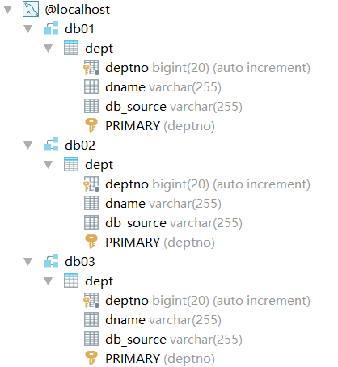

​		复制服务提供者，每个服务提供者的数据库各不相同，因此需要修改`application.yaml`中的数据库配置。

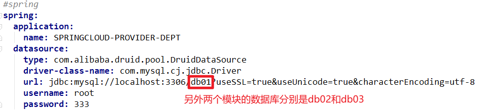

​		在负载均衡环境下，服务的消费者通过服务名来从注册中心获取服务，之后从注册中心返回的结果中选出该服务的某个实例进行调用。因此，**每个服务提供者的服务名应该相同，实例名应该不同。**

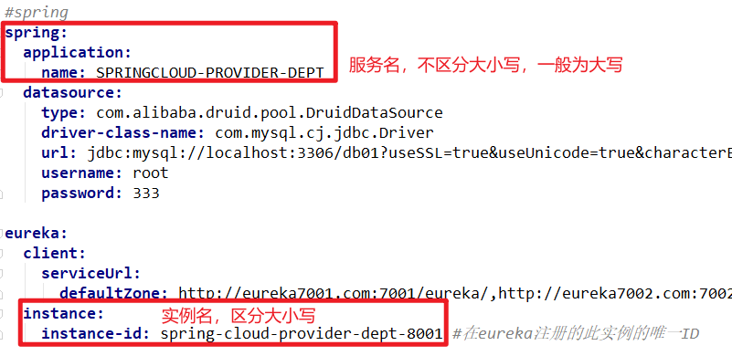

## 3.2 服务消费者导入相关依赖

由于Eureka中已经集成了Ribbon，所以**无需添加额外依赖**，只需添加Eureka客户端依赖即可。

额外添加Ribbon依赖会导致服务消费者找不到服务实例，所以请慎重添加相关依赖。

```xml
<!-- https://mvnrepository.com/artifact/org.springframework.cloud/spring-cloud-starter-netflix-eureka-client -->
<dependency>
    <groupId>org.springframework.cloud</groupId>
    <artifactId>spring-cloud-starter-netflix-eureka-client</artifactId>
    <version>3.0.3</version>
</dependency>
```

## 3.3 服务消费者Eureka相关配置

```yaml
eureka:
  client:
    register-with-eureka: false #服务消费者无需向注册中心注册
    service-url:
      defaultZone: http://eureka7001.com:7001/eureka,http://eureka7002.com:7002/eureka,http://eureka7003.com:7003/eureka	#从以上的注册中心中获取服务
```

## 3.4 服务消费者使用负载均衡方式获取服务

```java
@Configuration

public class DeptConsumerConfig {
    @Bean
    @LoadBalanced   //开启Ribbon负载均衡
    public RestTemplate getRestTemplate(){
        return new RestTemplate();
    }
}
```

## 3.5 修改服务消费者获取服务的url

```java
@RestController
public class DeptConsumerController {
    /*Ribbon负载均衡在识别服务名时不区分大小写*/
    //服务名要和服务提供者的spring.application.name相同
    public static final String REST_URL_PREFIX = "http://springcloud-PROVIDER-DEPT";
    @Autowired
    private RestTemplate restTemplate;

    @RequestMapping("/consumer/dept/add/{dname}")
    public String addDept(@PathVariable("dname") String dname) {
        Dept dept = new Dept(dname);
        System.out.println(dept);
        restTemplate.postForObject(REST_URL_PREFIX + "/dept/add", dept, Void.class);
        return "success";
    }

    @RequestMapping("/consumer/dept/get/{id}")
    public Dept getDeptById(@PathVariable int id) {
        return restTemplate.getForObject(REST_URL_PREFIX + "/dept/get/" + id, Dept.class);
    }

    @RequestMapping("/consumer/dept/list")
    public List<Dept> getAllDept(){
        return restTemplate.getForObject(REST_URL_PREFIX + "/dept/list",List.class);
    }
}
```

​		**注意：如果不使用负载均衡的方式获取服务，则通过url+端口号的方式获取服务；如果使用负载均衡的方式获取服务，则需要通过服务名来获取服务。**

## 3.6 服务消费者开启Eureka客户端

```java
@SpringBootApplication
@EnableEurekaClient	//开启Eureka客户端
public class DeptConsumer_80 {
    public static void main(String[] args) {
        SpringApplication.run(DeptConsumer_80.class,args);
    }
}
```

## 3.7 测试负载均衡

依次启动`springcloud-eureka-7001`、`springcloud-provider-dept-8001`、`springcloud-provider-dept-8002`、`springcloud-provider-dept-8003`、`springcloud-consumer-dept-80`。

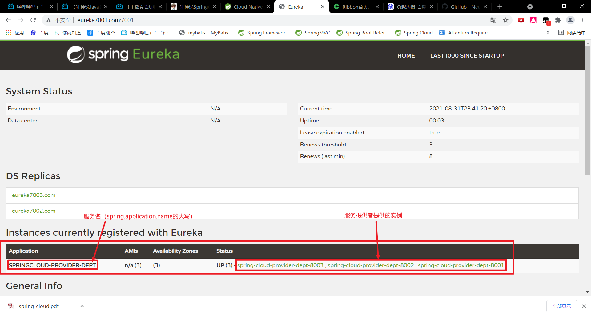

不断通过服务消费者访问服务，发现Ribbon的负载均衡默认是按照轮询的方式。

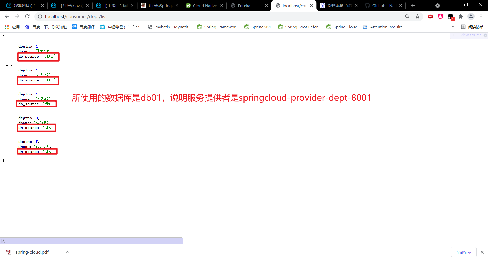

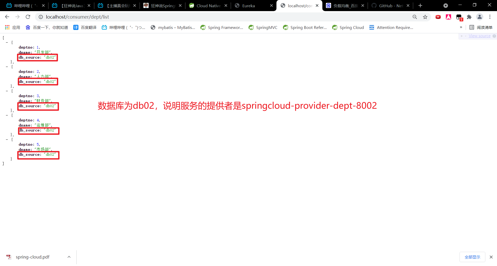

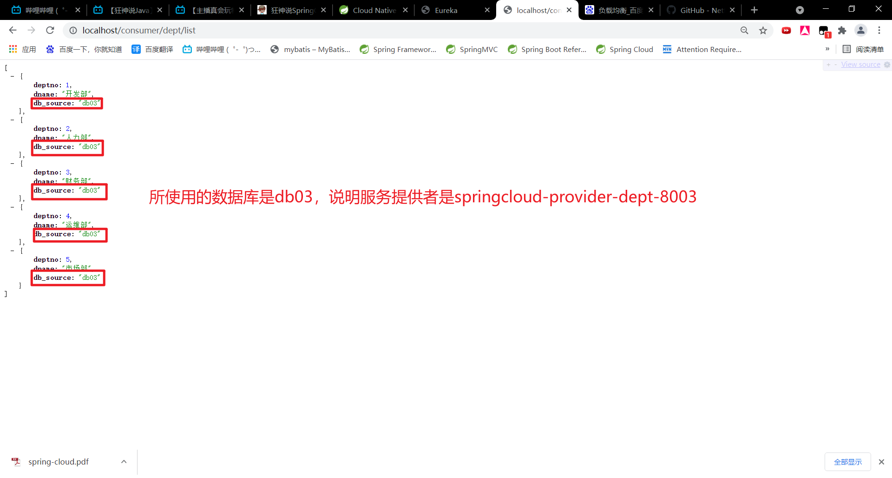

# 4. Spring Cloud LoadBalancer概述(重点)

​		自从2020年后，Spring Cloud的Ribbon就进入了维护模式，不再进行更新，Spring Cloud 2020以上的版本对于Ribbon不再支持，替代Ribbon的是**Spring Cloud LoadBalancer**。

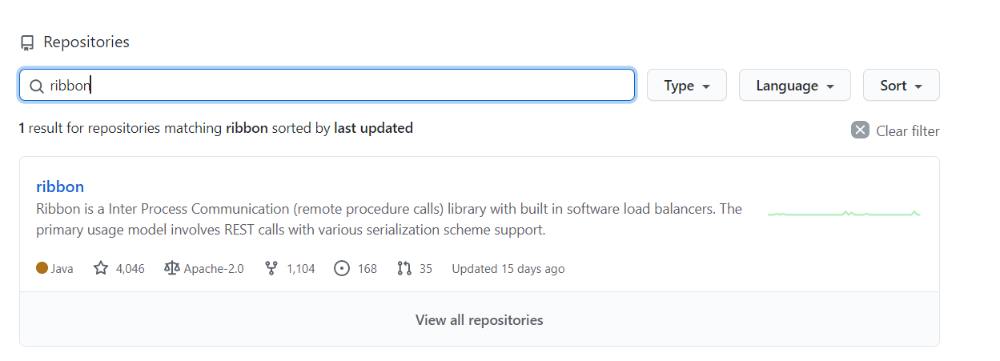

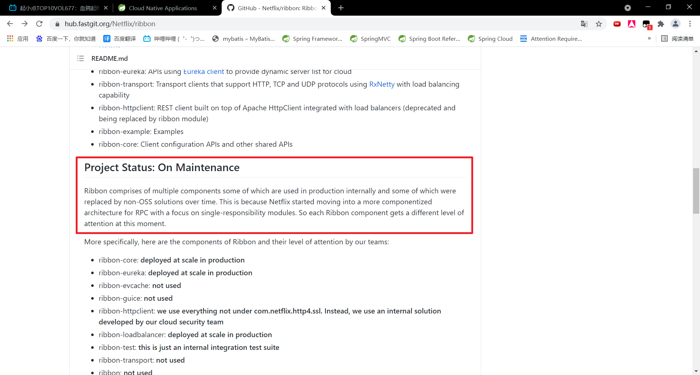

> Spring Cloud provides its own client-side load-balancer abstraction and implementation. For the load-balancing mechanism, `ReactiveLoadBalancer` interface has been added and a **Round-Robin-based** and **Random** implementations have been provided for it. In order to get instances to select from reactive `ServiceInstanceListSupplier` is used. Currently we support a service-discovery-based implementation of `ServiceInstanceListSupplier` that retrieves available instances from Service Discovery using a [Discovery Client](https://docs.spring.io/spring-cloud-commons/docs/3.0.3/reference/html/#discovery-client) available in the classpath.
>
> SpringCloud提供了自己的客户端负载平衡器抽象和实现。对于负载平衡机制，添加了ReactiveLoadBalancer接口，并为其提供了基于基于轮询和随机的实现。为了从反应式服务中选择实例，使用InstanceListSupplier。目前，我们支持ServiceInstanceListSupplier的基于服务发现的实现，该实现使用类路径中可用的发现客户端从服务发现中检索可用实例。

# 5. Spring Cloud LoadBalancer集成（重点）

## 5.1 添加多个服务提供者

步骤和3.1一样，不再赘述

## 5.2 服务消费者导入相关依赖

```xml
<!-- https://mvnrepository.com/artifact/org.springframework.cloud/spring-cloud-starter-netflix-eureka-client -->
<dependency>
    <groupId>org.springframework.cloud</groupId>
    <artifactId>spring-cloud-starter-netflix-eureka-client</artifactId>
    <version>3.0.3</version>
</dependency>
```

eureka客户端的依赖已经集成了Spring Cloud LoadBalancer，无需添加其他依赖。

## 5.3 服务消费者Eureka相关配置

```yaml
eureka:
  client:
    register-with-eureka: false #服务消费者无需向注册中心注册
    #fetch-registry: true    默认值为true，由于消费者需要从注册中心获取服务，因此必须为true不能为false
    service-url:
      defaultZone: http://eureka7001.com:7001/eureka,http://eureka7002.com:7002/eureka,http://eureka7003.com:7003/eureka 
      #从以上的注册中心中获取服务
```

## 5.4 服务消费者开启负载均衡服务

​		开启负载均衡服务需要创建负载均衡的`RestTemplate`，而不是在主类上。

```java
@Configuration
public class DeptConsumerConfig {
    @Bean
    @LoadBalanced   //开启Ribbon负载均衡
    public RestTemplate getRestTemplate(){
        return new RestTemplate();
    }
}
```

## 5.5 修改服务消费者获取服务的url

```java
@RestController
public class DeptConsumerController {
    /*Ribbon负载均衡在识别服务名时不区分大小写*/
    //服务名要和服务提供者的spring.application.name相同
    public static final String REST_URL_PREFIX = "http://springcloud-PROVIDER-DEPT";
    @Autowired
    private RestTemplate restTemplate;

    @RequestMapping("/consumer/dept/add/{dname}")
    public String addDept(@PathVariable("dname") String dname) {
        Dept dept = new Dept(dname);
        System.out.println(dept);
        restTemplate.postForObject(REST_URL_PREFIX + "/dept/add", dept, Void.class);
        return "success";
    }

    @RequestMapping("/consumer/dept/get/{id}")
    public Dept getDeptById(@PathVariable int id) {
        return restTemplate.getForObject(REST_URL_PREFIX + "/dept/get/" + id, Dept.class);
    }

    @RequestMapping("/consumer/dept/list")
    public List<Dept> getAllDept(){
        return restTemplate.getForObject(REST_URL_PREFIX + "/dept/list",List.class);
    }
}
```

## 5.6 服务消费者开启Eureka客户端

```java
@SpringBootApplication
@EnableEurekaClient
public class DeptConsumer_80 {
    public static void main(String[] args) {
        SpringApplication.run(DeptConsumer_80.class,args);
    }
}
```

## 5.7 测试负载均衡

结果同3.7一样，不再赘述。

## 5.8 修改负载均衡算法

​		Spring Cloud LoadBalancer的默认负载均衡算法是**轮询** `RoundRobinLoadBalancer`。我们可以修改负载均衡算法为随机或者是我们自定义的负载均衡算法。接下来介绍如何将负载均衡算法改为**随机** `RandomLoadBalancer`。

### 5.8.1 创建ReactorLoadBalancer的Bean

```java
public class CustomLoadBalancerConfiguration {

    @Bean
    ReactorLoadBalancer<ServiceInstance> randomLoadBalancer(Environment environment,
            LoadBalancerClientFactory loadBalancerClientFactory) {
        String name = environment.getProperty(LoadBalancerClientFactory.PROPERTY_NAME);
        return new RandomLoadBalancer(loadBalancerClientFactory
                .getLazyProvider(name, ServiceInstanceListSupplier.class),
                name);
    }
}
```

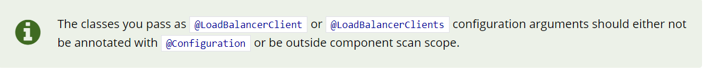

​		**注意：该配置类不应该使用`@Configuration`来修饰，也不应该在组件扫描的范围之外，应该放在和主类同级的包或者子包中**。

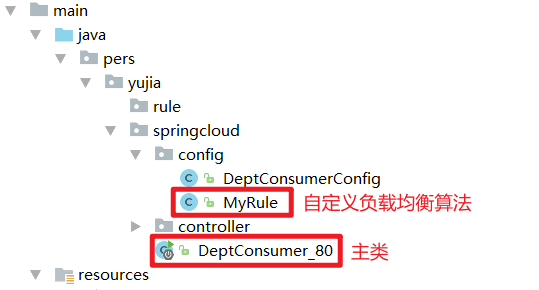

### 5.8.2 指定自定义的负载均衡算法

```java
@SpringBootApplication
@EnableEurekaClient
//指定服务的消费者获取SPRINGCLOUD-PROVIDER-DEPT服务时，使用MyRule中定义的负载均衡算法
@LoadBalancerClient(name = "SPRINGCLOUD-PROVIDER-DEPT",configuration = MyRule.class)
public class DeptConsumer_80 {
    public static void main(String[] args) {
        SpringApplication.run(DeptConsumer_80.class,args);
    }
}
```

### 5.8.3 测试随机负载均衡算法

​		首先需要注意的是：如果restTemplate.getForObject的responseType是list.class，==方法返回的是`List<LinkedHashMap>`,其中`LinkedHashMap`的key是对象的属性名，value是属性值==。LinkedHashMap并不能直接强转为我们的bean，因此restTemplate.getForObject得到的List需要先转化为Json字符串，再转换回来我们需要的List<Dept>。

```java
@RequestMapping("/consumer/dept/list")
    public List<Dept> getAllDept() throws JsonProcessingException {
        /*使用Jackson*/
        ObjectMapper objectMapper = new ObjectMapper();
        
        /*实际上，如果restTemplate.getForObject的responseType是list.class，方法返回的是List<LinkedHashMap>
        * LinkedHashMap的key是对象的属性名，value是属性值
        * LinkedHashMap并不能直接强转为我们的bean
        * 因此，restTemplate.getForObject得到的List需要先转化为Json字符串，再转换回来List<Dept>*/
        List objects = restTemplate.getForObject(REST_URL_PREFIX + "/dept/list",List.class);
        
        /*返回结果转化为Json字符串*/
        String json = objectMapper.writeValueAsString(objects);
        
        /*Json字符串转化为我们需要的List泛型集合*/
        List<Dept> depts = objectMapper.readValue(json, new TypeReference<List<Dept>>() {});
        /*for (Dept dept : depts) {
            System.out.println(dept);
        }*/
        System.out.println("服务消费者使用的服务者是" + "springcloud-provider-dept-80" + depts.get(0).getDb_source().substring(2,4));
        return depts;
    }
```

最后测试的结果如下，证明我们自定义的随机负载均衡算法生效。

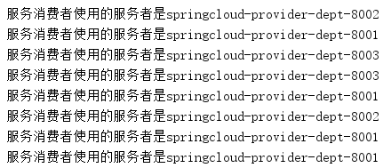

