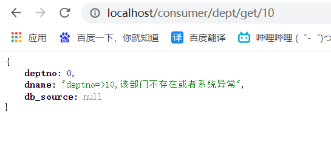
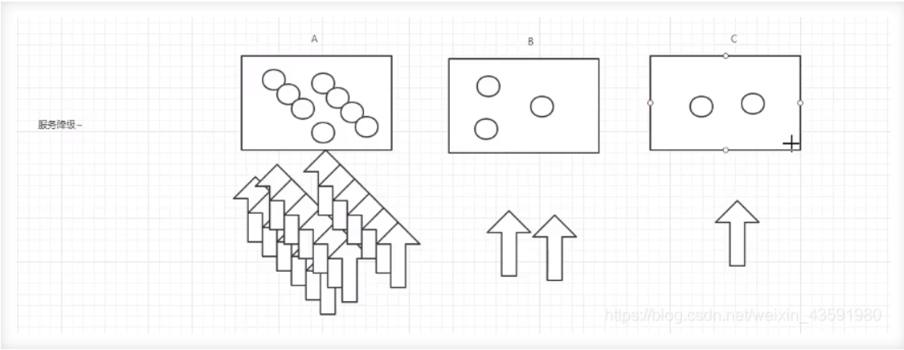
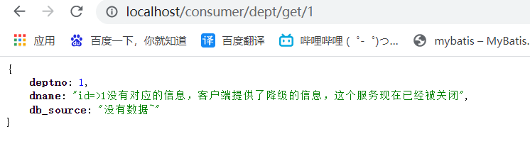
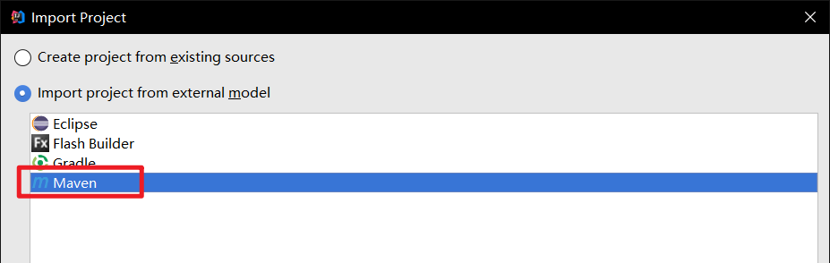
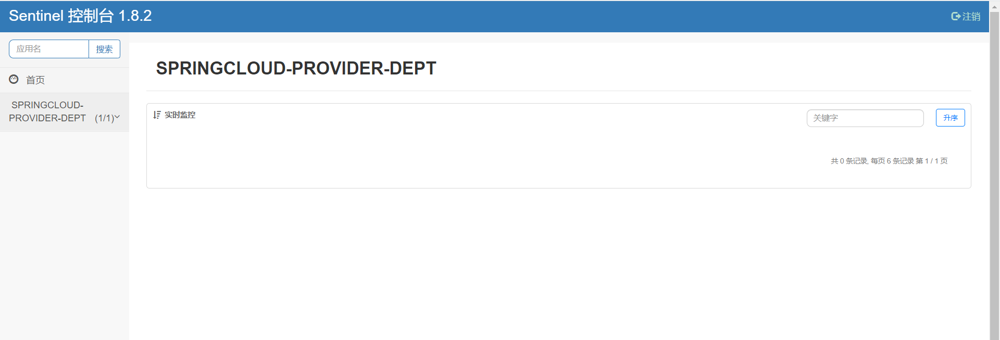
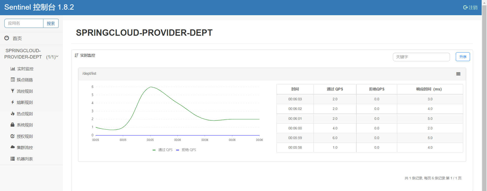

# 1. Sentinel概述

## 1.1 Sentinel是什么

​		随着微服务的流行，服务和服务之间的稳定性变得越来越重要。Sentinel以流量为切入点，从流量控制、熔断降级、系统负载保护等多个维度保护服务的稳定性。

Sentinel介绍：[https://hub.fastgit.org/alibaba/Sentinel/wiki/%E4%BB%8B%E7%BB%8D](https://hub.fastgit.org/alibaba/Sentinel/wiki/%E4%BB%8B%E7%BB%8D)

## 1.2 为什么要引入断路器（Circuit Breaker）

​		多个微服务之间相互调用时，如A调用B，B调用C，C调用D……这就是所谓的“扇出”，如果扇出的链路上某个微服务的调用时间过长，或者某个微服务不可用，对微服务A的调用就会占用越来越多的资源，由于A处于一个服务器中，就会造成单一服务器负载过大，从而造成服务器崩溃，整个系统不可用，这就是“雪崩效应”。

​		引入断路器的目的就是为了对故障和延迟进行隔离和管理，以达到单个依赖关系的失败不会影响到整个应用系统的运行。

​		断路器本身是一个开关装置，当某个服务单元出现故障时，通过断路器的故障监控，向调用方返回一个服务预期的、可处理的备选响应（**fallback**），而不是长时间的等待或者抛出调用方法无法运行的异常，这样就保证了服务调用方的线程不会长时间的占用资源，避免某一部分出现故障从而整个系统瘫痪。

## 1.3 Sectinel的特征

- **丰富的应用场景**：Sentinel 承接了阿里巴巴近 10 年的双十一大促流量的核心场景，例如秒杀（即突发流量控制在系统容量可以承受的范围）、消息削峰填谷、集群流量控制、实时熔断下游不可用应用等。
- **完备的实时监控**：Sentinel 同时提供实时的监控功能。您可以在控制台中看到接入应用的单台机器秒级数据，甚至 500 台以下规模的集群的汇总运行情况。
- **广泛的开源生态**：Sentinel 提供开箱即用的与其它开源框架/库的整合模块，例如与 Spring Cloud、Apache Dubbo、gRPC、Quarkus 的整合。您只需要引入相应的依赖并进行简单的配置即可快速地接入 Sentinel。同时 Sentinel 提供 Java/Go/C++ 等多语言的原生实现。
- **完善的 SPI 扩展机制**：Sentinel 提供简单易用、完善的 SPI 扩展接口。您可以通过实现扩展接口来快速地定制逻辑。例如定制规则管理、适配动态数据源等。


# 2. 服务熔断概述

​		**熔断机制是赌赢雪崩效应的一种微服务链路保护机制**。

​		现代微服务架构都是分布式的，由非常多的服务组成。不同服务之间相互调用，组成复杂的调用链路。以上的问题在链路调用中会产生放大的效果。复杂链路上的某一环不稳定，就可能会层层级联，最终导致整个链路都不可用。因此我们需要对不稳定的**弱依赖服务调用**进行熔断降级，暂时切断不稳定调用，避免局部不稳定因素导致整体的雪崩。熔断降级作为保护自身的手段，通常在客户端（调用端）进行配置。

​		当扇出链路的某个微服务不可用或者响应时间太长时，会进行服务的降级，**进而熔断该节点微服务的调用，快速返回错误的响应信息**。检测到该节点微服务调用响应正常后恢复调用链路。

​		服务熔断解决如下问题：

- 当所依赖的对象不稳定时，能够起到快速失败的目的；
- 快速失败后，能够根据一定的算法动态试探所依赖对象是否恢复。


# 3. Sentinel的熔断策略

- 慢调用比例 (`SLOW_REQUEST_RATIO`)：选择以慢调用比例作为阈值，需要设置允许的慢调用 RT（即最大的响应时间），请求的响应时间大于该值则统计为慢调用。当单位统计时长（`statIntervalMs`）内请求数目大于设置的最小请求数目，并且慢调用的比例大于阈值，则接下来的熔断时长内请求会自动被熔断。经过熔断时长后熔断器会进入探测恢复状态（HALF-OPEN 状态），若接下来的一个请求响应时间小于设置的慢调用 RT 则结束熔断，若大于设置的慢调用 RT 则会再次被熔断。

- 异常比例 (`ERROR_RATIO`)：当单位统计时长（`statIntervalMs`）内请求数目大于设置的最小请求数目，并且异常的比例大于阈值，则接下来的熔断时长内请求会自动被熔断。经过熔断时长后熔断器会进入探测恢复状态（HALF-OPEN 状态），若接下来的一个请求成功完成（没有错误）则结束熔断，否则会再次被熔断。异常比率的阈值范围是 `[0.0, 1.0]`，代表 0% - 100%。

- 异常数 (`ERROR_COUNT`)：当单位统计时长内的异常数目超过阈值之后会自动进行熔断。经过熔断时长后熔断器会进入探测恢复状态（HALF-OPEN 状态），若接下来的一个请求成功完成（没有错误）则结束熔断，否则会再次被熔断。

  **注意异常降级仅针对业务异常，对 Sentinel 限流降级本身的异常（`BlockException`）不生效**


# 4. 集成Sentinel的熔断机制

## 4.1 服务提供者导入相关依赖

```xml
<!--断路器Sentinel（哨兵）-->
<!-- https://mvnrepository.com/artifact/com.alibaba.cloud/spring-cloud-starter-alibaba-sentinel -->
<dependency>
    <groupId>com.alibaba.cloud</groupId>
    <artifactId>spring-cloud-starter-alibaba-sentinel</artifactId>
    <version>2021.1</version>
</dependency>
```

## 4.2 修改服务提供者的service层

```java
@Service
public class DeptServiceImpl implements DeptService{

    @Autowired
    private DeptDao deptDao;

    @Override
    public void insertDept(Dept dept) {
        deptDao.insertDept(dept);
    }

    @Override
    /*SentinelResource为哨兵监控的资源，value是必需值，fallback为发生熔断时的备用方案*/
    @SentinelResource(value = "getDeptByDeptno", fallback = "fallbackSelectDeptByDeptno")
    public Dept selectDeptByDeptno(int deptno) {
        Dept dept = deptDao.selectDeptByDeptno(deptno);
        if (dept == null){
            throw new RuntimeException("deptno=>" + deptno + ",该部门不存在或者系统异常");
        }
        return dept;
    }

    /*断路器的备选方案，一般在同一个类*/
    public Dept fallbackSelectDeptByDeptno(int deptno) {
        return new Dept("deptno=>" + deptno + ",该部门不存在或者系统异常");
    }

    @Override
    public List<Dept> selectAllDept() {
        return deptDao.selectAllDept();
    }
}
```

## 4.3 测试熔断



搜索一个deptno不存在的部门，仍然可以正常显示页面，不会一直占用资源导致服务器崩溃。


# 5. 服务降级概述

## 5.1 服务降级是什么

​		服务降级是指当服务器压力剧增的情况下，根据实际业务情况及流量，对一些服务和页面有策略的不处理，或换种简单的方式处理，从而释放服务器资源以保证核心业务正常运作或高效运作。说白了，**就是尽可能的把系统资源让给优先级高的服务**。

​		资源有限，而请求是无限的。如果在并发高峰期，不做服务降级处理，一方面肯定会影响整体服务的性能，严重的话可能会导致宕机某些重要的服务不可用。所以，一般在高峰期，为了保证核心功能服务的可用性，都要对某些服务降级处理。比如当双11活动时，把交易无关的服务统统降级，如查看蚂蚁深林，查看历史订单等等。

​		服务降级主要用于什么场景呢？当整个微服务架构整体的负载超出了预设的上限阈值或即将到来的流量预计将会超过预设的阈值时，为了保证重要或基本的服务能正常运行，可以**将一些不重要或不紧急的服务或任务进行服务的延迟使用或暂停使用**。

​		降级的方式可以根据业务来，可以延迟服务，比如延迟给用户增加积分，只是放到一个缓存中，等服务平稳之后再执行；或者在粒度范围内关闭服务，比如关闭相关文章的推荐。



​		**当某一时间内服务A的访问量暴增，而B和C的访问量较少，为了缓解A服务的压力，这时候需要B和C暂时关闭一些服务功能，去承担A的部分服务，从而为A分担压力，叫做服务降级**。

## 5.2 服务降级需要考虑什么问题

- 哪些服务是核心服务，哪些服务是非核心服务
- 哪些服务可以支持降级，哪些服务不能支持降级，降级策略是什么
- 除服务降级之外是否存在更复杂的业务放通场景，策略是什么？

## 5.3 自动降级的分类

- **超时降级**：主要配置好超时时间和超时重试次数和机制，并使用异步机制探测回复情况

- **失败次数降级**：主要是一些不稳定的api，当失败调用次数达到一定阀值自动降级，同样要使用异步机制探测回复情况

- **故障降级**：比如要调用的远程服务挂掉了（网络故障、DNS故障、http服务返回错误的状态码、rpc服务抛出异常），则可以直接降级。降级后的处理方案有：默认值（比如库存服务挂了，返回默认现货）、兜底数据（比如广告挂了，返回提前准备好的一些静态页面）、缓存（之前暂存的一些缓存数据）

- **限流降级**：秒杀或者抢购一些限购商品时，此时可能会因为访问量太大而导致系统崩溃，此时会使用限流来进行限制访问量，当达到限流阀值，后续请求会被降级；降级后的处理方案可以是：排队页面（将用户导流到排队页面等一会重试）、无货（直接告知用户没货了）、错误页（如活动太火爆了，稍后重试）。


# 6. 集成Sentinel的降级机制

​		Sentinel的降级机制和Feign息息相关。由于服务降级时请求将不经过服务端，因此需要在服务消费者开启服务降级。

## 6.1 在springcloud-api模块中编写服务降级的处理类

```java
@Component	//必须要将服务注册进容器
public class DeptServiceFallbackFactory implements FallbackFactory {
    @Override
    public FeignDeptService create(Throwable throwable) {
        return new FeignDeptService() {
            @Override
            public void addDept(Dept dept) {

            }

            @Override
            public Dept getDeptById(@PathVariable("id") int id) {
                Dept dept = new Dept();
                dept.setDeptno(id);
                dept.setDname("id=>" + id + "没有对应的信息，客户端提供了降级的信息，这个服务现在已经被关闭");
                dept.setDb_source("没有数据~");
                return dept;
            }

            @Override
            public List<Dept> getAllDepts() {
                return null;
            }
        };
    }
}
```


## 6.2 在FeignClient中指定服务的降级方案(也在springcloud-api模块)

```java
@Component  //注册进Spring容器
@FeignClient(value = "SPRINGCLOUD-PROVIDER-DEPT", fallbackFactory = DeptServiceFallbackFactory.class)   //Feign的客户端，value值为服务提供者的服务名
public interface FeignDeptService {
    @RequestMapping("/dept/add")    //和服务提供者的controller的url接口一致
    public void addDept(Dept dept);

    @RequestMapping("/dept/get/{id}")
    public Dept getDeptById(@PathVariable("id") int id);

    @RequestMapping("/dept/list")
    public List<Dept> getAllDepts();
}
```


## 6.3 在服务消费者模块中导入相关依赖

```xml
<!--断路器Sentinel（哨兵）-->
<!-- https://mvnrepository.com/artifact/com.alibaba.cloud/spring-cloud-starter-alibaba-sentinel -->
<dependency>
    <groupId>com.alibaba.cloud</groupId>
    <artifactId>spring-cloud-starter-alibaba-sentinel</artifactId>
    <version>2021.1</version>
</dependency>
```


## 6.4 服务消费者开启降级

```yaml
feign:
  sentinel:
    enabled: true
```


## 6.5 进行服务降级的测试

​		不开启服务提供者，服务消费者进行服务的请求。




# 7. 集成Sentinel监控

​		Sentinel 控制台提供一个轻量级的控制台，它提供机器发现、单机资源实时监控、集群资源汇总，以及规则管理的功能。您只需要对应用进行简单的配置，就可以使用这些功能。

## 7.1 构建Sentinel控制台

​		可以从最新版本的源码自行构建 Sentinel 控制台： [https://hub.fastgit.org/alibaba/Sentinel/tree/master/sentinel-dashboard](https://hub.fastgit.org/alibaba/Sentinel/tree/master/sentinel-dashboard) 

​		下载源码后，可以在idea导入项目。选择导入maven工程。导入后启动SpringBoot主类。



​		启动完成后，可以通过localhost:8080访问Sentinel控制台，如下所示：



## 7.2 为服务提供者绑定Sentinel控制台		

​		首先服务提供者需要导入相关依赖。

```xml
<!-- https://mvnrepository.com/artifact/com.alibaba.cloud/spring-cloud-starter-alibaba-sentinel -->
<dependency>
    <groupId>com.alibaba.cloud</groupId>
    <artifactId>spring-cloud-starter-alibaba-sentinel</artifactId>
    <version>2021.1</version>
</dependency>
```

​		然后在配置文件中绑定Sentinel控制台。

```yaml
spring: 
	cloud:
    	sentinel:
      		transport:
        		dashboard: localhost:8080
```


## 7.3 启动服务提供者，访问服务

1. 依次启动注册中心、Sentinel控制台、服务提供者、服务消费者。
2. 在浏览器中请求服务。（Sentinel使用懒加载方式，必须访问过服务才会显示在控制台）
3. 在控制台中查看信息。



