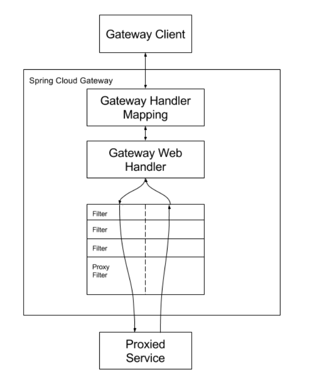
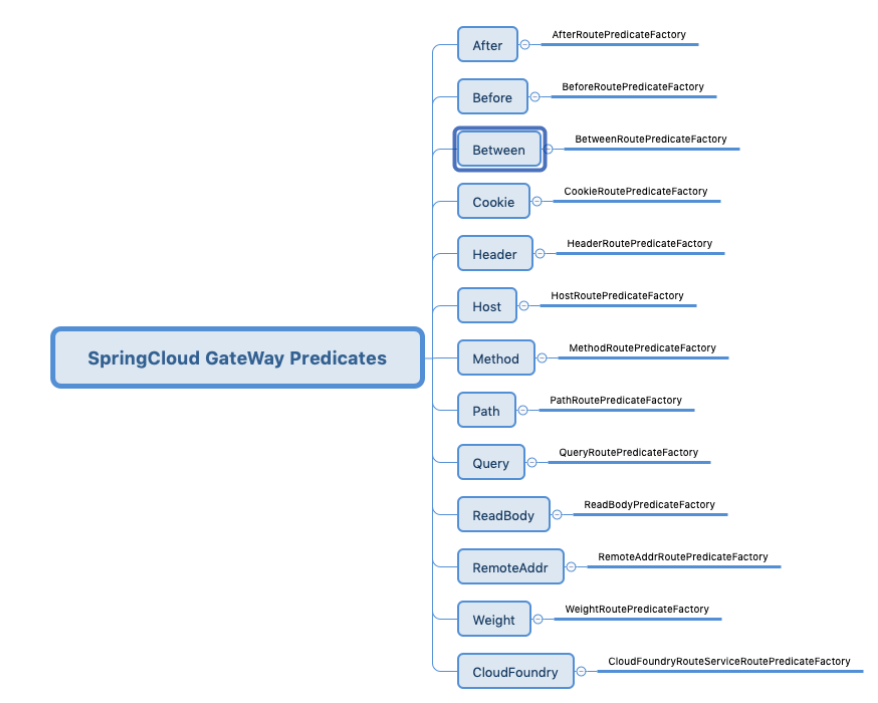
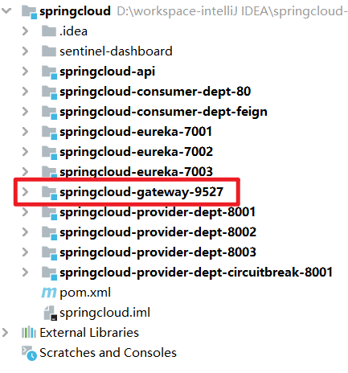
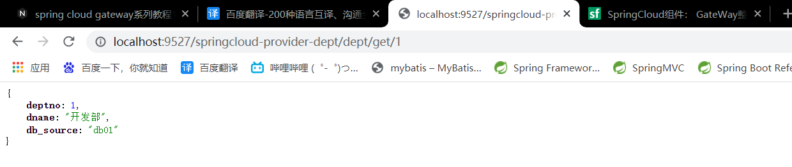

# 1. Spring Cloud Gateway概述

> This project provides an API Gateway built on top of the Spring Ecosystem, including: Spring 5, Spring Boot 2 and Project Reactor. Spring Cloud Gateway aims to provide a simple, yet effective way to route to APIs and provide cross cutting concerns to them such as: security, monitoring/metrics, and resiliency.
>
> 这个项目提供了一个构建在Spring生态系统之上的API网关，包括：Spring5、SpringBoot2和ProjectReactor。
>
> Spring Cloud Gateway旨在提供一种简单而有效的方式来路由到API，并为API提供交叉关注点，如：安全性、监控/度量和弹性。

## 1.1 专业术语解释

- **Route**: The basic building block of the gateway. It is defined by an ID, a destination URI, a collection of predicates, and a collection of filters. A route is matched if the aggregate predicate is true.

  **路由**：网关的基本构建块。它由一个ID、一个目标URI、一组谓词和一组筛选器定义。如果聚合谓词为true，则匹配路由。

- **Predicate**: This is a [Java 8 Function Predicate](https://docs.oracle.com/javase/8/docs/api/java/util/function/Predicate.html). The input type is a [Spring Framework `ServerWebExchange`](https://docs.spring.io/spring/docs/5.0.x/javadoc-api/org/springframework/web/server/ServerWebExchange.html). This lets you match on anything from the HTTP request, such as headers or parameters.

  **谓词：**这是一个Java8函数谓词。输入类型是Spring Framework ServerWebExchange。这允许您匹配来自HTTP请求的任何内容，例如头或参数。

- **Filter**: These are instances of [GatewayFilter](https://github.com/spring-cloud/spring-cloud-gateway/tree/main/spring-cloud-gateway-server/src/main/java/org/springframework/cloud/gateway/filter/GatewayFilter.java) that have been constructed with a specific factory. Here, you can modify requests and responses before or after sending the downstream request.

  **过滤器：**这些是使用特定工厂构建的[GatewayFilter](https://github.com/spring-cloud/spring-cloud-gateway/tree/main/spring-cloud-gateway-server/src/main/java/org/springframework/cloud/gateway/filter/GatewayFilter.java)实例。在这里，您可以在发送下游请求之前或之后修改请求和响应。

## 1.2 Spring Cloud Gateway工作原理



1. 客户端发送请求到Spring Cloud网关。
2. 如果`Gateway Handler Mapping`确定请求与路由匹配，则将请求发送到`Gateway Web Handler`。
3. `Gateway Web Handler`通过特定于请求的筛选器链运行请求。
4. `Filter`被虚线分隔的原因是，`Filter`可以在发送代理请求之前和之后运行逻辑。执行所有“pre”过滤器逻辑，然后发出代理请求，发出代理请求后，将运行“post”过滤器逻辑。

## 1.3 为什么Spring Cloud Gateway不能和Spring Cloud Web同时工作

> Spring Cloud Gateway requires the Netty runtime provided by Spring Boot and Spring Webflux. It does not work in a traditional Servlet Container or when built as a WAR.

​		`Spring Cloud Gateway`需要SpringBoot和SpringWebFlux提供的Netty运行时。它在传统的Servlet容器中或作为WAR构建时不起作用。但是Spring Cloud Web本身就嵌入有Tomcat（Servlet容器），因此不能同时运行。

# 2.Spring Cloud Gateway Predicates

> Spring Cloud Gateway matches routes as part of the Spring WebFlux `HandlerMapping` infrastructure. Spring Cloud Gateway includes many built-in route predicate factories. All of these predicates match on different attributes of the HTTP request. You can combine multiple route predicate factories with logical `and` statements.
>
> `Spring Cloud Gateway`将路由作为Spring Web Flux `HandlerMapping`基础设施的一部分进行匹配。`Spring Cloud Gateway`包含许多内置的路由谓词工厂。所有这些谓词都匹配HTTP请求的不同属性。您可以将多个路由谓词工厂与逻辑and语句相结合。

​		简单地说，当请求满足predicate（谓词）所预设的条件时，才能够被转发。如果同时预设了多个predicates，则需要同时满足。



## 2.1 配置predicates和filters的两种方式。

​		`Spring Cloud Gateway`提供了两种配置predicates和filters的方法：快捷方式(shortcut)和完全扩展参数方式(fully expanded arguments)。大多数情况下都使用快捷方式。

### 2.1.1 快捷方式

​		快捷方式配置由筛选器名称识别，后跟等号（=），再跟由逗号（，）分隔的参数值。

```yaml
spring:
  cloud:
    gateway:
      routes:
      - id: after_route
        uri: https://example.org
        predicates:
        - Cookie=mycookie,mycookievalue
```

### 2.1.2 完全扩展参数方式

​		完全展开的参数更像是带有键值对的标准yaml配置。通常，将有一个名称键和一个args键。args键是用于配置谓词或筛选器的键值对的映射。

```yaml
spring:
  cloud:
    gateway:
      routes:
      - id: after_route
        uri: https://example.org
        predicates:
        - name: Cookie
          args:
            name: mycookie
            regexp: mycookievalue
```

​		以上两种方式完全等价。

## 2.2 几个常见的匹配转发方式

​		下面使用的都是快捷方式。

​		如果想查询所有的匹配转发方式，请访问[https://docs.spring.io/spring-cloud-gateway/docs/3.0.3/reference/html/#gateway-request-predicates-factories](https://docs.spring.io/spring-cloud-gateway/docs/3.0.3/reference/html/#gateway-request-predicates-factories)，也可以访问[https://segmentfault.com/a/1190000019101829](https://segmentfault.com/a/1190000019101829)

### 2.2.1 Path匹配转发方式

```yaml
spring:
  application:
    name: spring-cloud-gateway-path
  cloud:
    gateway:
      routes:
        - id: blog
          uri: http://blog.yuqiyu.com
          predicates:
            - Path=/api-boot-datasource-switch.html # 匹配路径转发
# 端口号
server:
  port: 9090
```

​		在上面的配置中，当访问[http://localhost:9090/api-boot-datasource-switch.html]()时就会被自动转发到[http://blog.yuqiyu.com/api-boot-datasource-switch.html]()，这里要注意完全匹配`Path`的值时才会进行路由转发。

### 2.2.2 Before匹配转发方式

```yaml
spring:
  cloud:
    gateway:
      routes:
        - id: blog
          uri: http://blog.yuqiyu.com
          predicates:
            - Before=2019-05-01T00:00:00+08:00[Asia/Shanghai]
server:
  port: 9090
```

​		在上面配置中，我们允许中国北京时间2019年5月1日00:00:00之前通过访问[http://localhost:9090]()转发到[http://blog.yuqiyu.com]()。

### 2.2.3 After匹配转发方式

```yaml
spring:
  cloud:
    gateway:
      routes:
        - id: blog
          uri: http://blog.yuqiyu.com
          predicates:
            - After=2019-04-29T00:00:00+08:00[Asia/Shanghai]
server:
  port: 9090
```

​		在上面配置中，我们允许中国北京时间2019年4月29日00:00:00之前通过访问[http://localhost:9090]()转发到[http://blog.yuqiyu.com]()。

### 2.2.4 Between匹配转发方式

​		如果是一个时间段内允许请求转发，通过`Before`、`After`组合配置也可以完成，不过`Spring Cloud Gateway`还是提供了`Between`方式，如下所示：

```yaml
spring:
  cloud:
    gateway:
      routes:
        - id: blog
          uri: http://blog.yuqiyu.com
          predicates:
            - Between=2019-04-29T00:00:00+08:00[Asia/Shanghai], 2019-05-01T00:00:00+08:00[Asia/Shanghai]
server:
  port: 9090
```

​		在上面配置中，我们允许中国北京时间2019年4月29日00:00:00之后，并且在2019年5月1日00:00:00之前，通过访问[http://localhost:9090]()转发到[http://blog.yuqiyu.com]()。

### 2.2.5 Cookie匹配转发方式

```yaml
spring:
  cloud:
    gateway:
      routes:
        - id: blog
          uri: http://blog.yuqiyu.com
          predicates:
            - Cookie=hengboy, yuqiyu
server:
  port: 9090
```

​		在上面配置中，如果客户端发送请求时携带了`"hengboy=yuqiyu"`的Cookie信息，则允许请求转发。

### 2.2.6 Host匹配转发方式

```yaml
spring:
  cloud:
    gateway:
      routes:
        - id: blog
          uri: http://blog.yuqiyu.com
          predicates:
            - Host=**.yuqiyu.com
```

​		`Spring Cloud Gateway`可以根据`Host`主机名进行匹配转发，上面的配置中我们的接口只允许`**.yuqiyu.com`域名进行访问。

- curl http://localhost:9090 -H "Host: yuqiyu.com"          // 匹配

- curl http://localhost:9090 -H "Host: api.yuqiyu.com"        // 匹配

- curl http://localhost:9090 -H "Host: admin.yuqiyu.com"  // 匹配

- curl http://localhost:9090 -H "Host: hengboy.com"          // 不匹配

# 3. Spring Cloud Gateway Filters

> Route filters allow the modification of the incoming HTTP request or outgoing HTTP response in some manner. Route filters are scoped to a particular route. Spring Cloud Gateway includes many built-in GatewayFilter Factories.
>
> 路由筛选器允许以某种方式修改传入HTTP请求或传出HTTP响应。路由筛选器的作用域为特定路由。`Spring Cloud Gateway`包括许多内置网关过滤器工厂。

​		简单地来说，Filter可以修改满足predicate（谓词）所预设条件的请求，并且可以修改代理服务返回的响应。

## 3.1 几种常见的过滤方式

​		如果想了解全部的过滤方式，请访问[https://docs.spring.io/spring-cloud-gateway/docs/3.0.3/reference/html/#gatewayfilter-factories](https://docs.spring.io/spring-cloud-gateway/docs/3.0.3/reference/html/#gatewayfilter-factories)。

​		常用的过滤方式如下：

- AddRequestHeader：添加请求头
- RemoveRequestHeader：移除请求头
- AddRequestParameter：添加请求参数
- RemoveRequestParameter：移除请求参数
- AddResponseHeader：添加响应头
- RemoveResponseHeader：移除响应头
- PrefixPath：添加请求前缀
- RedirectTo：重定向
- SetPath：添加请求前缀，和PrefixPath不同的是提供了特定路径的添加方式。
- StripPrefix：去掉路径的某个部分。

# 4. Eureka集成Spring Cloud Gateway

​		我们可以将网关配置为基于向DiscoveryClient兼容服务注册表注册的服务创建路由。

> The default predicate is a path predicate defined with the pattern `/serviceId/**`, where `serviceId` is the ID of the service from the `DiscoveryClient`.
>
> 默认谓词是使用模式“/serviceId/**”定义的路径谓词，其中“serviceId”是来自“DiscoveryClient”的服务的ID。
>
> The default filter is a rewrite path filter with the regex `/serviceId/?(?<remaining>.*)` and the replacement `/${remaining}`. This strips the service ID from the path before the request is sent downstream.
>
> 默认筛选器是一个重写路径筛选器，带有`regex/serviceId/?(?<remain>.*)`，替换为`/${remaining}`。这将在请求发送到下游之前从路径中剥离服务ID。

​		**注意：这里采用的是Java的正则表达式分组语法。？表示后面的字符出现0次或者1次；`(?<remain>capturing text)`表示将捕获到的字符串capturing text存放到remain中，使用${remain}获取；.表示任意字符；\*表示前面的字符出现0次或者n次。**

## 4.1 新建一个maven模块



## 4.2 导入相关依赖

​		由于需要将Spring Cloud Gateway注册到服务注册中心，所以需要导入Eureka的客户端依赖。

```xml
<dependencies>
    <dependency>
        <groupId>org.springframework.cloud</groupId>
        <artifactId>spring-cloud-starter-gateway</artifactId>
    </dependency>
    <!-- https://mvnrepository.com/artifact/org.springframework.cloud/spring-cloud-starter-netflix-eureka-client -->
    <dependency>
        <groupId>org.springframework.cloud</groupId>
        <artifactId>spring-cloud-starter-netflix-eureka-client</artifactId>
        <version>3.0.3</version>
    </dependency>
</dependencies>
```

## 4.3 修改配置文件

```yaml
#修改端口号
server:
  port: 9527

spring:
  #注册到注册中心时使用的服务名称
  application:
    name: springcloud-gateway

  cloud:
    gateway:
      discovery:
        locator:
          #开启Gateway服务注册中心服务发现
          enabled: true
          #开启服务名称大写转小写模式（原来的服务大写服务名称无效）
          lower-case-service-id: true

#Spring Cloud Gateway注册到Eureka注册中心
eureka:
  client:
    serviceUrl:
      defaultZone: http://eureka7001.com:7001/eureka/,http://eureka7002.com:7002/eureka/,http://eureka7003.com:7003/eureka/
  instance:
    instance-id: springcloud-gateway
```

## 4.4 编写SpringBoot主类

```java
package pers.yujia.springcloud;

import org.springframework.boot.SpringApplication;
import org.springframework.boot.autoconfigure.SpringBootApplication;

@SpringBootApplication
public class Gateway_9527 {
    public static void main(String[] args) {
        SpringApplication.run(Gateway_9527.class,args);
    }
}
```

## 4.5 进行测试

​		依次开启Eureka注册中心(springcloud-eureka-7001)、服务提供者(springcloud-provider-dept-8001)、网关(springcloud-gateway-9527)。

​		然后通过[http://localhost:9527/springcloud-provider-dept/get/1]()来获取服务。



