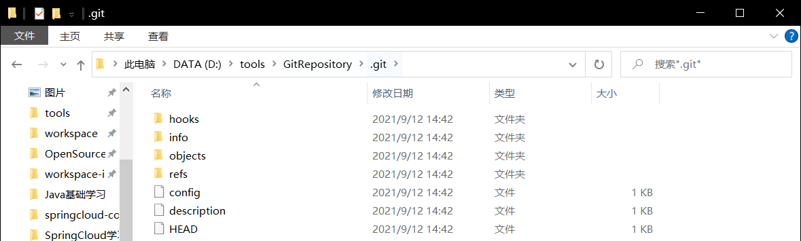

# 1. Spring Cloud Config概述

> Spring Cloud Config provides server-side and client-side support for externalized configuration in a distributed system. With the Config Server, you have a central place to manage external properties for applications across all environments. The concepts on both client and server map identically to the Spring `Environment` and `PropertySource` abstractions, so they fit very well with Spring applications but can be used with any application running in any language. As an application moves through the deployment pipeline from dev to test and into production, you can manage the configuration between those environments and be certain that applications have everything they need to run when they migrate. The default implementation of the server storage backend uses git, so it easily supports labelled versions of configuration environments as well as being accessible to a wide range of tooling for managing the content. It is easy to add alternative implementations and plug them in with Spring configuration.
>
> `Spring Cloud Config`为分布式系统中的外部化配置提供服务器端和客户端支持。使用配置服务器，您可以在中心位置管理所有环境中应用程序的外部属性。客户机和服务器上的概念映射到Spring `Environment`和`PropertySource`抽象，因此它们非常适合Spring应用程序，但可以用于以任何语言运行的任何应用程序。当应用程序在部署管道中从开发人员移动到测试人员并进入生产环境时，您可以管理这些环境之间的配置，并确保应用程序在迁移时拥有运行所需的一切。服务器存储后端的默认实现使用git，因此它可以轻松地支持配置环境的标记版本，并且可以访问用于管理内容的各种工具。添加替代实现并使用Spring配置插入它们是很容易的。

​		微服务是将应用中的业务拆分成一个个粒度很小的服务，因此系统中会出现大量的微服务。由于每个服务都需要必要的配置信息才能运行，所以一套集中式的动态的配置管理设施是必不可少的。因此，Spring Cloud Config能够很好地解决该问题。

## 1.1 什么是Spring Cloud Config分布式配置中心


​		Spring Cloud Config可以分成客户端和服务端。服务端也称为分布式配置中心，它是一个独立的微服务应用，用来连接配置服务器并为客户端提供获取配置信息，加密，解密信息等访问接口；客户端则是通过指定的配置中心来管理应用资源，以及与业务相关的配置内容，并在启动的时候从配置中心获取和加载配置信息。

## 1.2 Spring Cloud Config分布式配置中心的作用

- 集中式管理配置文件
- 不同环境，不同配置，动态化的配置更新，分环境部署，比如 /dev /test /prod /beta /release
- 运行期间动态调整配置，不再需要在每个服务部署的机器上编写配置文件，服务会向配置中心统一拉取配置自己的信息
- 当配置发生变动时，服务不需要重启，即可感知到配置的变化，并应用新的配置
- 将配置信息以REST接口的形式暴露

# 2. Git环境搭建

Git官方网址：[https://git-scm.com/](https://git-scm.com/)

> Git is a [free and open source](https://git-scm.com/about/free-and-open-source) distributed version control system designed to handle everything from small to very large projects with speed and efficiency.
>
> Git is [easy to learn](https://git-scm.com/doc) and has a [tiny footprint with lightning fast performance](https://git-scm.com/about/small-and-fast). It outclasses SCM tools like Subversion, CVS, Perforce, and ClearCase with features like [cheap local branching](https://git-scm.com/about/branching-and-merging), convenient [staging areas](https://git-scm.com/about/staging-area), and [multiple workflows](https://git-scm.com/about/distributed).
>
> Git是一个[免费和开源的](https://git-scm.com/about/free-and-open-source)分布式版本控制系统，设计用于以快速高效的方式处理从小型到大型的所有项目。
> Git[易学](https://git-scm.com/doc)并且具有[小巧的占地面积和闪电般的性能](https://git-scm.com/about/small-and-fast). 它比Subversion、CVS、Perforce和ClearCase等SCM工具更具[便捷的本地分支](https://git-scm.com/about/branching-and-merging)的功能，方便[集结区](https://git-scm.com/about/staging-area)，和[多个工作流](https://git-scm.com/about/distributed).

## 2.1 下载Git


​		按照默认设置安装即可。安装完成后，还需要最后一步设置，在命令行输入：

```
$ git config --global user.name "Your Name"
$ git config --global user.email "email@example.com"
```

​		上面用于设置Git仓库的用户名和邮箱。

​		注意`git config`命令的`--global`参数，用了这个参数，表示你这台机器上所有的Git仓库都会使用这个配置，当然也可以对某个仓库指定不同的用户名和Email地址。

## 2.2 创建版本库

​		什么是版本库呢？版本库又名仓库，英文名**repository**，你可以简单理解成一个目录，这个目录里面的所有文件都可以被Git管理起来，每个文件的修改、删除，Git都能跟踪，以便任何时刻都可以追踪历史，或者在将来某个时刻可以“还原”。

### 2.2.1 新建一个空目录

​		在系统中新建一个空目录，在空目录中点击鼠标右键，选择`Git Bash Here`。

​		**注意：如果你使用Windows系统，为了避免遇到各种莫名其妙的问题，请确保目录名（包括父目录）不包含中文。**


### 2.2.2 初始化Git仓库	

​		通过`git init`命令把这个目录变成Git可以管理的仓库。

```
$ git init
```

​		运行init命令后该目录会出现一个`.git`的隐藏文件夹，用于跟踪管理版本库。一般情况下不要轻易修改。



## 2.3 把文件添加到版本库

​		在进行了初始化的Git仓库文件夹中新建一个文件（我这里新建的是`application.yaml`）。

​		**注意：一定要放在进行Git初始化的文件夹或者文件夹的子文件夹下，不然Git无法找到文件。**

```yaml
spring:
  profiles: 
    active: dev

---
spring:
  profiles: dev
  application:
    name: springcloud-config-dev

---
spring:
  profiles: test
  application:
    name: springcloud-config-test
```


1. 用命令`git add`告诉Git，把文件添加到仓库。

   ```
   $ git add application.yaml
   ```

2. 用命令`git commit`告诉Git，把文件提交到仓库。

   ```
   $ git commit -m "first commit"
   ```

   `-m`后面输入的是本次提交的说明，可以输入任意内容，当然最好是有意义的，这样你就能从历史记录里方便地找到改动记录。

## 2.4 使用Git的注意事项

​		首先这里再明确一下，所有的版本控制系统，其实只能跟踪文本文件的改动，比如TXT文件，网页，所有的程序代码等等，Git也不例外。版本控制系统可以告诉你每次的改动，比如在第5行加了一个单词“Linux”，在第8行删了一个单词“Windows”。而图片、视频这些二进制文件，虽然也能由版本控制系统管理，但没法跟踪文件的变化，只能把二进制文件每次改动串起来，也就是只知道图片从100KB改成了120KB，但到底改了啥，版本控制系统不知道，也没法知道。

​		不幸的是，Microsoft的Word格式是二进制格式，因此，版本控制系统是没法跟踪Word文件的改动的，前面我们举的例子只是为了演示，如果要真正使用版本控制系统，就要以纯文本方式编写文件。

​		因为文本是有编码的，比如中文有常用的GBK编码，日文有Shift_JIS编码，如果没有历史遗留问题，强烈建议使用标准的UTF-8编码，所有语言使用同一种编码，既没有冲突，又被所有平台所支持。

​		**千万不要使用Windows自带的记事本编辑任何文本文件**。原因是Microsoft开发记事本的团队使用了一个非常弱智的行为来保存UTF-8编码的文件，他们自作聪明地在每个文件开头添加了0xefbbbf（十六进制）的字符，你会遇到很多不可思议的问题，比如网页第一行可能会显示一个“?”，明明正确的程序一编译就报语法错误等等。

​		**使用EditPlus文本编辑器也需要注意：使用tab键可能会出现意想不到的错误，尽量用空格进行缩进。**文件默认的保存方式为GB2312，我们在创建文件后需要另存为UTF-8的字符集编码。


# 3. Gitee环境搭建

​		使用GitHub时，国内的用户经常遇到的问题是访问速度太慢，有时候还会出现无法连接的情况（原因你懂的）。

​		如果我们希望体验Git飞一般的速度，可以使用国内的Git托管服务——[Gitee](https://gitee.com/?utm_source=blog_lxf)（[gitee.com](https://gitee.com/?utm_source=blog_lxf)）。

​		和GitHub相比，Gitee也提供免费的Git仓库。此外，还集成了代码质量检测、项目演示等功能。对于团队协作开发，Gitee还提供了项目管理、代码托管、文档管理的服务，5人以下小团队免费。

## 3.1 注册Gitee账号

​		按照常规方法注册即可。

## 3.2 上传SSH公钥

​		Gitee 提供了基于SSH协议的Git服务，在使用SSH协议访问仓库之前，需要先配置好账户/仓库的SSH公钥。

### 3.2.1 生成SSH公钥

​		使用如下命令生成sshkey：

```shell
ssh-keygen -t ed25519 -C "xxxxx@xxxxx.com"  
```

​		其中xxxxx@xxxxx.com为个人邮箱，填写自己的邮箱即可。

​		按照提示完成三次回车，即可生成 ssh key。生成的文件内容位于C盘用户主目录的`.ssh`文件夹下。


### 3.2.2 上传SSH公钥

​		选择右上角用户头像 -> 菜单“修改资料”，然后选择“SSH公钥”，填写一个便于识别的标题，我们需要把`.ssh`文件夹下的后缀为`.pub`的文件内容复制粘贴进去：


​		点击“确定”即可完成并看到刚才添加的Key：


## 3.3 在Gitee中新建一个仓库


## 3.4 将在Gitee创建的仓库克隆到本地Git仓库


​		在本地已初始化的Git仓库中，输入如下命令进行仓库的克隆：

```
git clone git@gitee.com:huoyujia081/springcloud-config.git
```

​		最后一部分是从Gitee中复制而来。


## 3.5 将本地Git仓库中的修改记录同步到Gitee

​		假如说我们在本地的Git仓库中新增了一个application.yaml文件，需要将其同步到Gitee仓库，需要按照以下三个步骤：

1. **用命令`git add`告诉Git，把文件添加到仓库。**

   

2. **用命令`git commit`告诉Git，把文件提交到仓库。**

   

- 必须使用`-m`来说明本次提交的内容。


3. **用命令`git push`推送到Gitee**

   

```
git push origin master
```

- origin为远程库的名称，因为一开始我们使用的是`git clone`命令，所以默认的名称是origin。

  可以使用`git remote -v`查看远程库信息，如下：

  

- master为远程库的其中一个分支，英文为label。

# 4. 服务端连接Git配置

​		通过config-server，我们可以访问到Git中，并获取配置以及资源。

## 4.1 新建springcloud-config-3344作为Git的配置中心


## 4.2 导入相关依赖

```xml
<dependencies>
    <!--springcloud-config-server-->
    <!-- https://mvnrepository.com/artifact/org.springframework.cloud/spring-cloud-config-server -->
    <dependency>
        <groupId>org.springframework.cloud</groupId>
        <artifactId>spring-cloud-config-server</artifactId>
    </dependency>

    <!--actuator完善信息-->
    <!-- https://mvnrepository.com/artifact/org.springframework.boot/spring-boot-starter-actuator -->
    <dependency>
        <groupId>org.springframework.boot</groupId>
        <artifactId>spring-boot-starter-actuator</artifactId>
    </dependency>

    <!-- https://mvnrepository.com/artifact/org.springframework.boot/spring-boot-starter-web -->
    <dependency>
        <groupId>org.springframework.boot</groupId>
        <artifactId>spring-boot-starter-web</artifactId>
    </dependency>

</dependencies>
```

## 4.3 编写配置文件

```yaml
#通过 config-server可以连接到git，访问其中的资源以及配置
spring:
  cloud:
    config:
      server:
        git:
          uri: https://gitee.com/huoyujia081/springcloud-config.git #注意是https的地址
  application:
    name: springcloud-config
server:
  port: 3344
```

​		其中，`spring.cloud.config.server.git.uri`的值从Gitee中获取，如下：


## 4.4 编写主启动类

```java
package pers.yujia.springcloud.config;

import org.springframework.boot.SpringApplication;
import org.springframework.boot.autoconfigure.SpringBootApplication;

@SpringBootApplication
@EnableConfigServer //必须要添加
public class SpringcloudConfig_3344 {
    public static void main(String[] args) {
        SpringApplication.run(SpringcloudConfig_3344.class,args);
    }
}
```

## 4.5 访问Git中的资源

​		我们可以通过以下方式访问`application.yaml`中的内容:

- /{application}/{profile}[/{label}]

- /{application}-{profile}.yml

- /{label}/{application}-{profile}.yml2

- /{application}-{profile}.properties

- /{label}/{application}-{profile}.properties

  其中application为yaml文件的文件名，profile为配置文件中的profiles对应内容，label为Git的分支。


# 5.客户端连接服务端连接远程

​		在客户端可以连接服务端，服务端又连接远程的Git仓库，因此，我们可以在客户端获取远程Git仓库中的配置文件，从而实现配置文件和代码解耦合。

## 5.1 新建客户端的配置文件提交到Gitee

```yaml
server:
  port: 8201
#spring的配置
spring:
  profiles: dev
  application:
    name: springcloud-provider-dept
#Eureka的设置
eureka:
  client:
    serviceUrl:
      defaultZone: http://eureka7001.com:7001/eureka/  #Eureka服务器的url

---
server:
  port: 8202
#spring的配置
spring:
  profiles: test
  application:
    name: springcloud-provider-dept
#Eureka的设置
eureka:
  client:
    serviceUrl:
      defaultZone: http://eureka7001.com:7001/eureka/  #Eureka服务器的url
```

## 5.2 新建客户端模块springcloud-config-client-3355

	

### 5.2.1 导入相关依赖

```xml
<dependencies>
    <!--springcloud-config-server-->
    <!-- https://mvnrepository.com/artifact/org.springframework.cloud/spring-cloud-config-server -->
    <dependency>
        <groupId>org.springframework.cloud</groupId>
        <artifactId>spring-cloud-starter-config</artifactId>
    </dependency>

    <!--actuator完善信息-->
    <!-- https://mvnrepository.com/artifact/org.springframework.boot/spring-boot-starter-actuator -->
    <dependency>
        <groupId>org.springframework.boot</groupId>
        <artifactId>spring-boot-starter-actuator</artifactId>
    </dependency>

    <!-- https://mvnrepository.com/artifact/org.springframework.boot/spring-boot-starter-web -->
    <dependency>
        <groupId>org.springframework.boot</groupId>
        <artifactId>spring-boot-starter-web</artifactId>
    </dependency>

    <!-- https://mvnrepository.com/artifact/org.springframework.cloud/spring-cloud-starter-eureka -->
    <dependency>
        <groupId>org.springframework.cloud</groupId>
        <artifactId>spring-cloud-starter-eureka</artifactId>
        <version>1.4.7.RELEASE</version>
    </dependency>

    <!--SpringCloud 2020不再内嵌bootstrap，需要主动导入-->
    <dependency>
        <groupId>org.springframework.cloud</groupId>
        <artifactId>spring-cloud-starter-bootstrap</artifactId>
    </dependency>
</dependencies>
```

### 5.2.2 bootstrap.yaml

​		`bootstrap.yaml`和`application.yaml`不同，`bootstrap.yaml`是系统级别的配置文件，`application.yaml`是用户级别的配置文件。我们要使用`bootstrap.yaml`来导入远程Git仓库的配置文件来作为本模块的配置文件。

```yaml
# 系统级别的配置
spring:
  cloud:
    config:
      uri: http://localhost:3344 #服务端的url和端口号
      name: config-client #需要到git上面读取的资源名称（不需要后缀）
      profile: dev  #配置文件的profile
      label: master #分支
```

### 5.2.3 application.yaml

​		`application.yaml`作为用户级别的配置文件，由于引入了远程Git仓库的配置文件，所以需要配置的内容大大减少。

```yaml
# 用户级别的配置
spring:
  application:
    name: springcloud-config-3355
```

### 5.2.4 controller

​		使用controller来测试客户端是否能够获取远程Git仓库的配置文件。

​		使用@Value(“{}”)在Java代码获取配置文件的设置，如下所示：

```java
package pers.yujia.springcloud.config.controller;

import org.springframework.beans.factory.annotation.Value;
import org.springframework.web.bind.annotation.RequestMapping;
import org.springframework.web.bind.annotation.RestController;

@RestController
public class ConfigClientController {
    @Value("${spring.application.name}")
    private String applicationName;

    @Value("${eureka.client.serviceUrl.defaultZone}")
    private String eurekaServer;

    @Value("${server.port}")
    private String port;

    @RequestMapping("/config")
    public String getConfig(){
        return "application:"+ applicationName +"<br>eurekaServer:"+ eurekaServer +"<br>port:" + port;
    }
}
```

### 5.2.5 主启动类

```java
package pers.yujia.springcloud.config;

import org.springframework.boot.SpringApplication;
import org.springframework.boot.autoconfigure.SpringBootApplication;

@SpringBootApplication
public class ConfigClient_3355 {
    public static void main(String[] args) {
        SpringApplication.run(ConfigClient_3355.class,args);
    }
}
```

## 5.3 进行测试

​		依次启动springcloud-eureka-7001（Eureka服务器）、springcloud-config-3344（config服务端）、springcloud-config-client-3355（config客户端），在浏览器发出请求。

​		**注意：因为config客户端已经读入远程Git仓库中的配置文件，因此端口号为8201或者8202。**


# 6. 远程配置实战测试

## 6.1 将Eureka客户端和服务端的配置文件提交至Gitee

### 6.1.1 config-eureka-server.yaml

```yaml
spring:
  profiles: dev
  application:
    name: springcloud
server:
  port: 7001
eureka:
  instance:
    hostname: eureka7001.com #Eureka服务器名字
  client:
    serviceUrl:
      defaultZone: http://eureka7002.com:7002/eureka,http://eureka7003.com:7003/eureka
---
spring:
  profiles: test
  application:
    name: springcloud
server:
  port: 7001
eureka:
  instance:
    hostname: eureka7001.com #Eureka服务器名字
  client:
    serviceUrl:
      defaultZone: http://eureka7002.com:7002/eureka,http://eureka7003.com:7003/eureka
```

### 6.1.2 config-eureka-provider.yaml

```yaml
#服务器端口号
server:
  port: 8001

#MyBatis
mybatis:
  type-aliases-package: pers.yujia.springcloud.pojo
  config-location: classpath:mybatis/mybatis-config.xml
  mapper-locations: classpath:mybatis/mapper/*.xml

#spring
spring:
  profiles: dev
  application:
    name: springcloud-config-provider-dept
  datasource:
    type: com.alibaba.druid.pool.DruidDataSource
    driver-class-name: com.mysql.cj.jdbc.Driver
    url: jdbc:mysql://localhost:3306/db01?useSSL=true&useUnicode=true&characterEncoding=utf-8
    username: root
    password: 333

eureka:
  client:
    serviceUrl:
      defaultZone: http://eureka7001.com:7001/eureka/,http://eureka7002.com:7002/eureka/,http://eureka7003.com:7003/eureka/  #Eureka服务器的url
  instance:
    instance-id: spring-cloud-provider-dept-8001 #在eureka注册的此实例的唯一ID
---
#服务器端口号
server:
  port: 8001

#MyBatis
mybatis:
  type-aliases-package: pers.yujia.springcloud.pojo
  config-location: classpath:mybatis/mybatis-config.xml
  mapper-locations: classpath:mybatis/mapper/*.xml

#spring
spring:
  profiles: test
  application:
    name: springcloud-config-provider-dept
  datasource:
    type: com.alibaba.druid.pool.DruidDataSource
    driver-class-name: com.mysql.cj.jdbc.Driver
    url: jdbc:mysql://localhost:3306/db02?useSSL=true&useUnicode=true&characterEncoding=utf-8
    username: root
    password: 333

eureka:
  client:
    serviceUrl:
      defaultZone: http://eureka7001.com:7001/eureka/,http://eureka7002.com:7002/eureka/,http://eureka7003.com:7003/eureka/  #Eureka服务器的url
  instance:
    instance-id: spring-cloud-provider-dept-8001 #在eureka注册的此实例的唯一ID
```

## 6.2 新建Eureka服务端模块springcloud-config-eureka-7001

### 6.2.1 复制之前的Eureka服务端模块的有关内容

​		复制相关依赖、main文件夹的内容到新建模块。

​		还需要额外导入`spring-cloud-starter-config`和`spring-cloud-starter-bootstrap`依赖。


### 6.2.2 bootstrap.yaml

```yaml
spring:
  cloud:
    config:
      name: config-eureka-server
      profile: dev
      label: master
      uri: http://localhost:3344
```

### 6.2.2 application.yaml

```yaml
spring:
  application:
    name: springcloud-config-eureka-7001
```

## 6.3 新建Eureka客户端（服务提供者）模块springcloud-config-provider-dept-8001

### 6.3.1 复制之前服务提供者模块的有关内容

​		复制相关依赖、main文件夹的内容到新建模块。

​		还需要额外导入`spring-cloud-starter-config`和`spring-cloud-starter-bootstrap`依赖。


### 6.3.2 bootstrap.yaml

```yaml
spring:
  cloud:
    config:
      name: config-eureka-provider
      profile: test
      label: master
      uri: http://localhost:3344
```

### 6.3.3 application.yaml

```yaml
spring:
  application:
    name: springcloud-config-provider-dept-8001
```

## 6.4 进行测试

​		依次启动springcloud-config-3344（config服务端）、springcloud-config-eureka-7001（eureka服务端）、springcloud-config-provider-dept-8001（eureka客户端）。在浏览器上发送请求进行测试。


