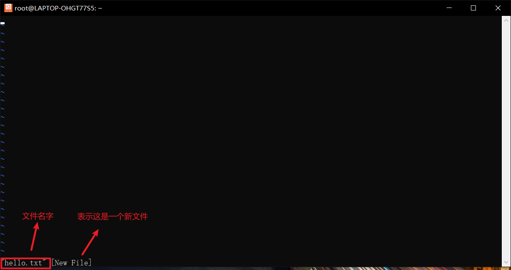

# 1. Linux操作系统组成

Linux操作系统从外层到内层分别为：

- 应用程序
  - NGINX：提供页面访问服务
  - MySQL：提供数据库服务
- Shell
- 系统库
  - C标准库（libc）
  - 数学库（libm）
  - 动态链接库（libdl）
  - 线程库（libpthread）
  - 第三方库
- 内核
  - 设备驱动程序
  - 进程管理
  - 内存管理
  - 文件系统
  - 网络协议栈

# 2. 常见虚拟机工具

## 2.1 Windows系统推荐虚拟机

- VMware：Windows的workstation和Mac的VMware Fusion提供收费和免费版。
- VirtualBox：个人和企业版均免费。
- Hyper-V：windows子系统（WSL）安装Linux。

## 2.2 MacOS系统推荐虚拟机

- Multipass：轻量、快速、支持命令行操作，只支持Ubuntu，可以使用命令管理虚拟机。
- Parallels Desktop：Mac下使用Windows体验较好，收费。
- UTM：M系列芯片模拟x86架构。

# 3. vi编辑器

## 3.1 vi和vim的关系

- vi编辑器是Unix系统下的一款文本编辑器
- vim全称是vi improved，是vi编辑器的增强版
- 如果系统既安装了vi，也安装了vim，那么使用vi命令时也会启动vim。因此以下说的vi指的是vim。

## 3.2 进入vi

在系统的命令行界面输入`vi`或者`vim`，就可以直接进入vi编辑器。

如果在后面输入文件名，那么就会进入该文件，如果文件不存在则会创建文件。



## 3.3 vi常用的3个模式


进入vim之后默认的模式为命令模式，在命令模式下输入`:`就会进入尾行模式，常用的`:q`就是`quit退出`的缩写，该命令会回到系统的命令行界面。

### 3.3.1 插入模式

在命令模式下输入`i/I/a/A/o/O`就可以进入插入模式，其中`i/I`表示insert，`a/A`表示append，`o/O`表示open。

`i`不会移动光标位置，`a`会把光标向后移动一个位置，`o`会把光标移动到下一行的第一个位置，并且会新建一行。

`I`会把光标移动到当前行的第一个位置，`A`会把光标移动到当前行的最后一个位置，`O`会把光标移动到上一行的第一个位置，并且会新建一行。


### 3.3.2 尾行模式

在命令模式下输入`:`即可进入尾行模式，常用的命令有：

`:q`：不保存文件直接退出。

`:wq`：保存文件后退出。

`:set number`或者`:set nu`：可以在内容左边显示行号。


`:set nonumber`：取消行号显示。

`:行号`：跳转到文件的某一行

`:开始行,结束行s/查找内容/替换内容/g`：从开始行到结束行之间替换内容，如果只想替换当前行可以忽略这两个数字。g表示全局替换，不然只会替换每行第一个匹配的内容。可以使用`$`表示最后一行，即`:1,$s/查找内容/替换内容/g`替换整个文件的内容。

退出后在Linux控制命令行输入`cat 文件名`即可直接查看文件内容。


### 3.3.3 命令模式

在命令模式中，`H`表示左，`J`表示下，`K`表示上，`L`表示右。也可以使用方向键控制上下左右。

与正则表达式一致，`^`移动到行首，`$`移动到行尾。也可以使用`Home`和`End`移动。

`yy`复制光标所在行内容，`dd`剪切光标所在行内容，`p`在光标的下一行粘贴内容。在之前输入数字可以控制复制和粘贴的次数，如`2yy`表示复制光标以下两行内容（包括光标所在行），`3p`会在光标的下一行粘贴三次。

`ctrl+u`向上翻半页，`ctrl+d`向下翻半页。

`G`跳转到文件的最后一行，`gg`跳转到文件的第一行。`行号+G`可以跳转到指定行号，如`100G`跳转到文件的第100行。

`/搜索内容`可以在光标所在处向下查找，`?搜索内容`可以在光标所在处向上寻找。使用`n`寻找下一个查找目标，使用`N`寻找上一个查找目标。如果想要忽略大小写，可以使用`/搜索内容\c`。也可以在尾行模式输入`:set ic`全局忽略大小写。

`u`撤销上一次操作，相当于`ctrl+z`（在vim中不支持）。

## 3.4 vi配置文件

vi的配置文件为`.vimrc`，用于保存vim的配置，可以设置一些快捷键等。

# 4. 常用命令

## 4.1 目录


`ls`（list）：显示目录内容。

`ls -l`：显示目录内容，并且显示每个文件的详细信息。


`ls -a`：显示目录的所有内容，包括隐藏的目录和文件。在Linux中，以半角英文`.`开头的文件和目录都是隐藏的。


`pwd`（print working directory）：显示当前目录。

`mkdir 目录名`：在当前目录下新创建目录。

`mkdir -p 多级目录`：在当前目录下创建多级目录。

`rmdir 目录`：删除空目录。

## 4.2 查看目录结构

`du`（disk usage）：查看文件大小，可以用来查看目录的结构，可以把当前目录的所有子文件和目录全部列出来。

`tree`：以树状图方式显示目录结构，需要先使用`sudo apt install tree`安装。

## 4.3 链接文件

软链接可以指向文件和目录，硬链接只能指向文件。

`ln 目标文件 链接文件`（link）：创建硬链接文件。本质上是指向文件系统另一个文件的指针，与原始文件共享i结点，即共享文件内容，修改某一个文件也会同时修改另一个文件。

`ln -s 目标文件 链接文件`：创建软链接文件，本身并不保存文件内容，类似于Windows中的快捷方式。

## 4.4 创建文件

`touch 文件`：更新文件修改时间，如果文件不存在则会创建文件。

`echo "文件内容" > 文件`：将文件内容重定向到文件，文件不存在会自动创建文件。

## 4.5 删除文件

`rm 文件`：删除某一个文件。若有某一个软链接文件指向该文件，那么软链接文件名会变成红色。

`rm -r 目录名`：递归删除目录及其中的所有目录文件。

## 4.6 复制文件

`cp 源文件 新创建文件`：复制文件。

`mv 源文件 移动后的文件`：移动文件或者目录，也可以把文件重命名。

`cp -r 目录 新创建目录`：将源目录及其所有子目录文件全部复制到新的目录。

## 4.7 文件权限

在`ls -l`指令中，文件权限的前三个字符表示文件所有者（user）的权限，中间三个字符表示同组用户（group）的权限，最后三个字符表示其他用户（other）的权限。

`r`表示可读，`w`表示可写，`x`表示可执行。如果没有权限会显示`-`。

`chmod`指令用于修改文件或者目录权限，示例如下：

```bash
chmod +x hello.txt # 给所有用户添加可执行权限
chmod +rw hello.txt # 给所有用户添加读写权限
chmod -x hello.txt # 移除所有用户的执行权限
chmod u+x hello.txt # 单独给文件的所有者添加执行权限
chmod ug+x hello.txt # 给文件的所有者及同组成员添加执行权限
```

`chmod`也可以使用数字表示权限，其中4表示`r`，2表示`w`，1表示`x`，将其相加即可得到权限。<br>如644表示`rw-r--r--`。

```bash
chmod 777 hello.txt # 所有用户都具有读写和执行权限
```

# 5. Linux目录结构

Linux根目录下一般有以下目录结构：


| 目录  | 说明                                   |
| ----- | -------------------------------------- |
| /     | 根目录，所有文件和目录绝对路径的起点。 |
| /bin  | 用户二进制文件。                       |
| /sbin | 系统二进制文件。                       |
| /etc  | 配置文件。                             |
| /dev  | 设备文件。                             |
| /home | 用户家目录。                           |
| /root | root用户家目录。                       |
| /lib  | 系统库文件。                           |
| /opt  | 可选的第三方软件包。                   |
| /tmp  | 临时文件。                             |
| /usr  | 用户程序。                             |
| /var  | 可变文件，如日志等。                   |
| /boot | 启动加载器文件。                       |
| /proc | 进程文件。                             |
| /sys  | 系统文件。                             |

