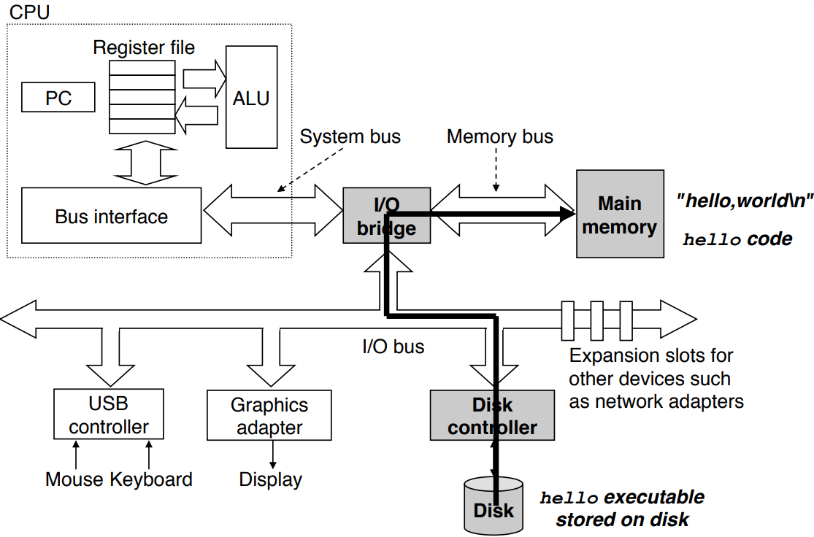
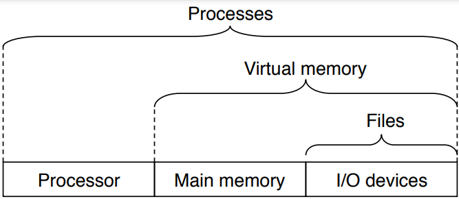

# 1.1 信息就是位+上下文

# 1.2 程序被其他程序翻译成不同的格式

在Unix系统上，从源文件到目标文件的转化是由编译器驱动程序完成的：

```bash
linux> gcc -o hello hello.c
```

编译过程分为四个阶段完成，执行这四个阶段的程序——预处理器、编译器、汇编器、链接器，共同组成编译系统（compilation system)。


1. 预处理阶段。根据以字符`#`开头的命令，修改原始的C程序。如`#include<stdio.h>`，把系统头文件`stdio.h`的内容直接插到文件开头处。
2. 编译阶段。将C语言编译成汇编语言（通用低级语言）。
3. 汇编阶段。把汇编语言翻译称为机器语言（硬件可以读得懂的语言）。此时得到的可重定位目标文件仍有缺失。
4. 链接阶段。将系统的库函数的可重定位目标文件合并到我们的程序中。得到的文件可以加载到内存上执行。

> [!NOTE]
>
> GNU项目的目标为开发一个完整的类Unix系统，其源代码可以不受约束地修改。现在已经开发出了一个包含Unix操作系统所有主要部件的环境。
>
> GNU环境包括EMACS编辑器、GCC编译器、GDB调试器、汇编器、链接器、处理二进制文件的工具等等。

# 1.3 了解编译系统如何工作是大有益处的

# 1.4 处理器读并解释储存在内存中的指令

shell是一个命令行解释器，它输出一个提示符提示我们输入内容，并等待我们输入一个命令行。如果我们输入正确的命令行，shell就会执行这个命令。

如果读取的命令的第一个单词不是系统内置的shell命令，那么shell就会假设这是一个可执行文件，并加载运行这个文件。

## 1.4.1 系统的硬件组成


1. 总线

   总线负责携带信息字节并在各个部件之间传递。通常总线传输定长的字节块，称为字（word）。字中的字节数称为字长，不同的系统可能字长不同。

2. I/O设备

   I/O设备通过控制器或者适配器与I/O总线相连，控制器是I/O设备本身或者主板上的芯片组，适配器是主板卡槽上的一张卡。

3. 主存

   物理上看，主存是一组DRAM芯片组成；逻辑上看，主存是一个线性的字节数组，每个字节都有其对应的地址。

4. 处理器

   寄存器文件（register file）是一个小的存储设备，由一些单个字长的寄存器组成。

   指令集架构描述的是每条机器代码指令的效果，CPU微体系架构描述的是处理器实际如何实现。

## 1.4.2 运行hello程序

1. 我们在shell中输入`hello`后，shell进程将会把字符经总线逐一读入寄存器，然后存放到内存中。


2. shell执行一系列指令来加载可执行的hello文件，将hello目标文件中的代码和数据从磁盘复制到内存。数据中包含最终输出的字符串`HelloWorld!`。

   > [!CAUTION]
   >
   > 通过DMA技术，文件可以不通过CPU，直接从磁盘到达内存。

   

3. 当hello文件中的代码和数据全部到达内存后，处理器开始执行hello程序中的机器语言指令。这些指令会将`HelloWorld!`字符串从内存移动到寄存器，再从寄存器文件移动到显示设备。

   

# 1.5 高速缓存至关重要

实际上，1.4节中数据在各个部件中移动，相较于CPU的处理速度来说是相当缓慢的。可以在不同的存储部件之间放置缓存设备（比上一级存储部件速度慢容量大，比下一级存储部件速度块容量小），来缓和CPU和存储设备之间速度不匹配的矛盾。

# 1.6 存储设备形成层次结构

存储器结构层次的主要思想是上一层的存储器作为下一层存储器的高速缓存，即上一层数据只是下一层数据的副本。


# 1.7 操作系统管理硬件

操作系统通过抽象来实现：

1. 防止硬件被失控的应用程序滥用
2. 为应用程序提供简单一致的机制，来控制底层复杂不同的硬件

如文件是I/O设备的抽象，虚拟内存是主存和I/O设备的抽象，进程是处理器、主存、I/O设备的抽象。



> [!NOTE]
>
> 20世纪80年代中期，IEEE标准化Unix开发而指定`Posix`标准。Posix标准涵盖众多方面，包括C语言接口、shell程序工具、线程、网络编程等等。

## 1.7.1 进程

当操作系统决定把CPU控制权从一个进程转移到另外一个进程，就会进行*上下文切换*，即保存当前进程的上下文，恢复新进程的上下文。

> [!IMPORTANT]
>
> 实现上下文的切换必须进入操作系统内核态。内核是操作系统常驻内存的部分。

## 1.7.2 线程

每个线程运行在进程的上下文中，共享代码和数据。

## 1.7.3 虚拟内存

对所有进程来说，所看到的内存区域都是一样的，如下：


## 1.7.4 文件

每个I/O设备，包括磁盘、键盘、显示器、网络，都可以看成文件。

# 1.8 系统之间利用网络通信

# 1.9 重要主题

## 1.9.1 Amdahl定律

> Amdahl定律：当我们对某个部分加速时，其对系统整体性能的影响取决于该部分的重要性和加速程度。

若系统执行某应用原来所需要的时间为$T_{old}$，执行某部分原来所需要的时间与$T_{old}$的比例为$α$，而该部分性能提升比例为$k$。则提升后的应用执行时间为
$$
T_{new}  =T_{old}[(1-\alpha )+\alpha /k]
$$
加速比$S=T_{old}/T_{new} $为
$$
S=\frac{1}{(1-\alpha )+\alpha /k} 
$$

> [!NOTE]
>
> 性能提升最好的表示方法是使用比例的形式$T_{old}/T_{new} $，如果有所改进该比例应该大于1。
>
> 使用后缀`X`表示比例，`2.2X`应该读作2.2倍。

考虑$k$趋向$\infty $的情况，即将某一部分加速到其执行时间忽略不计。此时加速比为
$$
S_{\infty } =\frac{1}{1-\alpha }
$$

## 1.9.2 并行与并发

1. 线程级并发

   当构建一个由单操作系统内核控制的多处理器组成系统时，称该系统为多处理器系统。可以使用多核处理器和超线程实现多处理器，如下图所示：

   

   多核处理器是将多个CPU（核）集成到一个集成电路芯片上，这些核一般不共享寄存器以及L1、L2层Cache，如下图所示：

   

   超线程，也称为*同时多线程*（simultaneous multi-threading）。其涉及CPU的硬件有多个备份，比如PC或者寄存器，但ALU只有一份。这样的好处是切换线程时无需进行上下文切换。

2. 指令级并行

3. 单指令、多数据并行

## 1.9.3 计算机系统中抽象的重要性

抽象使得程序员无需关注其内部复杂的实现原理和工作流程。


