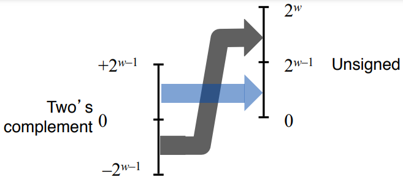
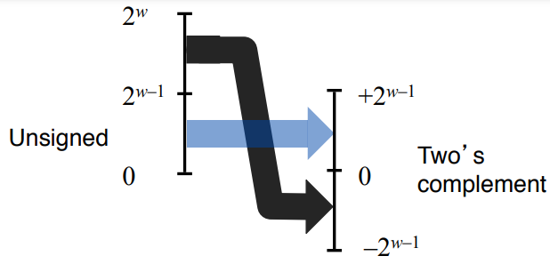
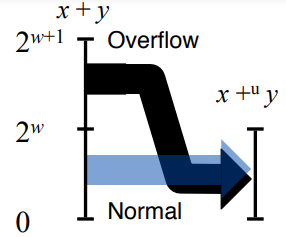
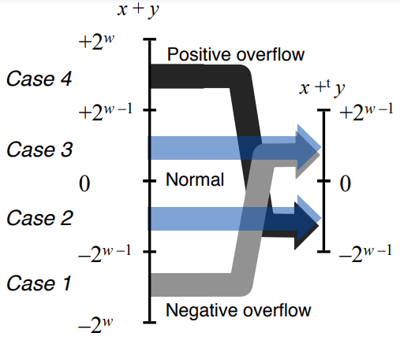
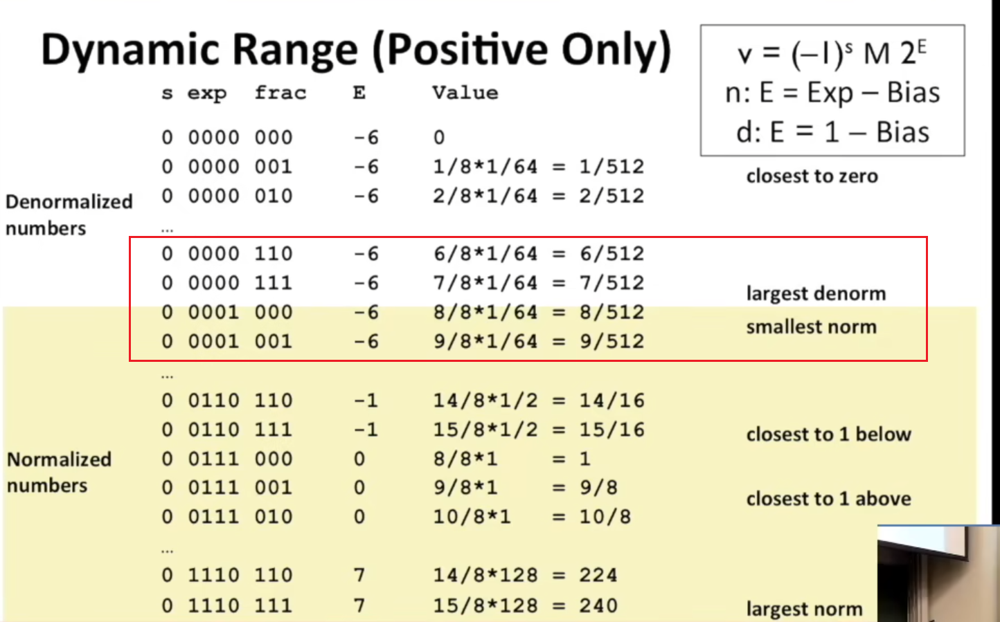

无符号（unsigned）编码基于传统的二进制表示法，表示大于或等于0的数字。补码（two’s complement）编码是表示有符号整数的最常见的方式。浮点数（floating-point）编码是表示实数的科学计数法的以2为基数的表示方法。

由于表示的精度有限，浮点运算是不可以结合的。例如`(3.14+1e20)-1e20`的结果为0.0，而`3.14+(1e20-1e20)`的结果是3.14。

| 推出时间 | C语言标准 | GCC命令行选项 |
| -------- | --------- | ------------- |
| 1989年   | ANSI C    | -ansi         |
| 1990年   | ISO C90   | -std=c89      |
| 1999年   | ISO C99   | -std=c99      |
| 2011年   | ISO C11   | -std=c11      |

GCC（GNU Compiler Collection）编译器可以依照不同的C语言标准编译程序，如：

```bash
linux> gcc -std=c11 hello.c
```

> [!NOTE]
>
> 编译选项`-ansi`和`-std=c89`等效，因为ISO C90和ANSI C几乎一样。
>
> 之所以ISO C90的GCC命令行选项为`-std=c89`，是因为C90也称为C89，ISO的标准化工作是从1989年开始的。

# 2.1 信息存储

机器级程序蒋内存视为一个非常大的字节数组，称为*虚拟内存*（virtual memory）。每个字节由唯一的数字来标识，所有可能地址的集合称为*虚拟内存空间*（virtual memory space）。

## 2.1.1 十六进制表示法

当值$x=2^{n} $时，可以很容易将$x$转化为十六进制数表示。

$n$表示为$n=i+4j$，其中$0\le i\le3$，我们可以把$x$写成开头十六进制数字为1（$i=0$）、2（$i=1$）、4（$i=2$）、8（$i=3$），后面紧跟$j$个十六进制的0。

比如$2048=2^{11}$，其中$n=11=3+4\times 2$，所以2048的十六进制表示为0x800。

## 2.1.2 字数据大小

计算机字长（word size）指明指针数据的标准大小（normal size）。因为虚拟地址就是以长度为计算机字长的字来表示的，所以字长决定虚拟空间的最大大小。对于一个字长为$w$位的机器，其虚拟地址的范围是$0\sim2^{w}-1 $。

当程序使用如下命令行编译程序，程序就可以在32位或者64位机器上运行：

```bash
linux> gcc -m32 hello.c
```

如果使用如下命令行编译程序，程序就只能在64位机器上运行。：

```bash
linux> gcc -m64 hello.c
```

因此，将程序称为32位程序还是64位程序，关键是要看如何编译该程序，而不是其运行在哪些机器上。

| 有符号数类型 | 无符号数类型   | 在32位程序中的长度（字节数） | 在64位程序中的长度（字节数） |
| ------------ | -------------- | ---------------------------- | ---------------------------- |
| [signed]char | unsigned char  | 1                            | 1                            |
| short        | unsigned short | 2                            | 2                            |
| int          | unsigned int   | 4                            | 4                            |
| long         | unsigned long  | ==4==                        | ==8==                        |
| int32_t      | uint32_t       | 4                            | 4                            |
| int64_t      | uint64_t       | 8                            | 8                            |
| char *       |                | ==4==                        | ==8==                        |
| float        |                | 4                            | 4                            |
| double       |                | 8                            | 8                            |

> [!NOTE]
>
> ISO C99引入了数据大小固定的数据类型，不随编译器或者机器设置而改变，比如`int32_t`和`int64_t`。

程序可移植性的重要方面就是程序对不同数据类型的确切大小不敏感，比如`long`类型的数据在32位程序和64位程序中的大小不同，我们编写的程序要考虑到这一差异。

## 2.1.3 寻址和字节顺序

多字节对象存储为连续的字节序列，对象的地址为所使用字节中最小的地址。

某些机器按照从最低有效字节到最高有效字节的顺序存储对象，称为*小端法*（little endian）。某些机器按照从最高有效字节到最低有效字节的顺序存储对象，称为*大端法*（big endian）。

大小端存储方式不同所造成的问题如下：

1. 从大端法机器传输数据到小端法机器，或者从小端法机器传输数据到大端法机器，数据可能会反序。
2. 使用小端法存储数据，从内存视角观察的数据（无论是指令中的数据还是正常存储的数据）与正常书写的顺序相反。

## 2.1.4 表示字符串

基本所有的计算机都支持`ASCII`码，因此文本数据比二进制数据更具有平台独立性。

即字符数组在任何机器都是从左到右存储，不会从右到左存储。

## 2.1.5 表示代码

## 2.1.6 布尔代数简介

位向量就是固定长度为w、由0和1组成的串。位向量之间的运算，可以看成对应位运算结果的组合。

当考虑长度为w的位向量上的`^`（异或）、`&`（与）、`~`（取反）运算时，其数学形式称为*布尔环*（Boolean Ring）。对于整数来说，$x$的加法逆元（additive inverse）为$-x$，而在布尔环中“加法”运算为`^`，$x$的加法逆元时它本身，即$x\wedge x=0$。==^运算具有交换律和结合律，即$(a\wedge b)\wedge a=0  $​。==

> [!NOTE]
>
> 异或也可以用来进行取反操作，如$x\wedge (\sim 0)=\sim x$。
>
> 利用此特性可以实现特定位置的取反。

> [!NOTE]
>
> 异或操作可以使用与或非等价。
>
> $x\wedge y=(\sim x \And  y) | (x\And  \sim y)$

位运算的其中一个应用是表示有限的集合。可以用位向量$[a_{w-1},...,a_{1},a_{0}]$编码任何子集$A$，其中$a_{i}=1$当且仅当$i\in A$。例如位向量$a=[01101001]$表示集合$A=\left \{0,3,5,6  \right \} $。使用这种编码方式表示集合，可布尔运算`|`和`&`对应于集合的并和交，`~`对应于集合的补。

## 2.1.7 C语言中的位级运算

确定一个位级表达式的结果最好的方法，就是将十六进制数转换成二进制数进行运算，结果再转换回十六进制数。

```C
void inplace_swap(int *x, int *y) {
    *y = *x ^ *y;
    *x = *x ^ *y;
    *y = *x ^ *y;
}
```

这个函数的作用是交换指针变量x和y所指向存储位置存放的值，并且无需额外空间。

> [!CAUTION]
>
> 如果x和y所指向的存储位置相同，那么x和y指向的存储位置的值会变为0。

位级运算的常见用法就是实现*掩码运算*。例如位级运算$x\And 0xFF$生成由$x$的最低有效字节组成的值，其他的字节置为0。表达式$\sim 0$生成一个全1的掩码，不管机器字长大小，这样的好处是程序可移植。

## 2.1.8 C语言中的逻辑运算

逻辑运算认为所有非零的数都表示TRUE，而0表示FALSE。C语言中的逻辑运算包括`&&`（与）、`||`（或）、`!`（非）。进行逻辑运算的结果只有1或者0，分别表示TRUE和FALSE。

逻辑运算符与位级运算符的最大不同，就是如果第一个参数的值能够确定结果，第二个参数就不会进行求值。

## 2.1.9 C语言中的移位运算

移位运算是可以结合的，如$x\ll j\ll k$等价于$(x\ll j)\ll k$。

对C语言的`>>`运算符，几乎所有的编译器/机器组合都对有符号数进行算数右移操作，而对无符号数进行逻辑右移操作。

Java的`>>`运算符进行算数右移操作，`>>>`运算符进行逻辑右移操作。

> [!WARNING]
>
> 一般来说，当移动一个w位的值，位移量还需对w取余得到，即最终移动的位数必定小于w。

# 2.2 整数表示

一些数学术语的表示如下：

| 符号         | 类型 | 含义             |
| ------------ | ---- | ---------------- |
| $B2T_{w}$    | 函数 | 二进制转补码     |
| $B2U_{w}$    | 函数 | 二进制转无符号数 |
| $U2B_{w}$    | 函数 | 无符号数转二进制 |
| $U2T_{w}$    | 函数 | 无符号数转补码   |
| $T2B_{w}$    | 函数 | 补码转二进制     |
| $T2U_{w}$    | 函数 | 补码转无符号数   |
| $TMin_{w}$   | 常数 | 最小补码值       |
| $TMax_{w}$   | 常数 | 最大补码值       |
| $UMax_{w}$   | 常数 | 最大无符号数     |
| $+_{w}^{t} $ | 操作 | 补码加法         |
| $+_{w}^{u} $ | 操作 | 无符号数加法     |
| $*_{w}^{t} $ | 操作 | 补码乘法         |
| $*_{w}^{u} $ | 操作 | 无符号数乘法     |
| $-_{w}^{t} $ | 操作 | 补码取反         |
| $-_{w}^{u} $ | 操作 | 无符号数取反     |

## 2.2.1 整型数据类型

C语言标准定义了每种数据类型必须能够表示的==最小==的取值范围，如下：

| C数据类型      | 最小值          | 最大值     |
| -------------- | --------------- | ---------- |
| char           | -127            | 127        |
| unsigned char  | 0               | 255        |
| short          | -32767          | 32767      |
| unsigned short | 0               | 65535      |
| int            | -35767          | 32767      |
| unsigned       | 0               | 65535      |
| long           | -2147483647     | 2147483647 |
| unsigned long  | 0               | 4294967295 |
| int32_t        | ==-2147483648== | 2147483647 |
| uint32_t       | 0               | 4294967295 |
| int64_t        | ==-2^63^==      | 2^63^-1    |
| uint64_t       | 0               | 2^64^-1    |

除了固定大小的数据类型（`int32_t`、`int64_t`）之外，其他的数据类型正数和负数的取值范围是对称的。

此外，`int`类型的数据可以用2个字节表示，`long`类型的数据可以用4个字节表示。

程序员如果希望代码具有最大可移植性，能够在所有可能的机器上运行，那么除了上述的表示范围外不应该假设任何其他数据范围。

> [!note]
>
> C和C++都支持有符号数和无符号数，Java只支持有符号数。

## 2.2.2 无符号数的编码

$$
B2U_{w} (\vec{x} )\doteq \sum_{i=0}^{w-1}x_{i}2_{i}
$$

## 2.2.3 补码编码

$$
B2T_{w} (\vec{x} )\doteq -x_{w-1}2^{w-1}  +\sum_{i=0}^{w-2}x_{i}2_{i} 
$$

其中，最高有效位$x_{w-1}$也成为符号位，其权值是$-2^{w-1}$，即无符号数表示中权值的负数。

> [!note]
>
> 确定宽度类型的带格式打印需要使用宏，以与系统相关的方式扩展为格式串。
>
> ```c
> printf("x = %" PRId32 ", y = %" PRIu64 "\n", x, y); // x和y的类型分别为int32_t和uint64_t
> ```
>
> 当编译64位程序时，宏`PRId32`扩展为字符串`“d”`，宏`PRId64`扩展为字符串`“lu”`。当C语言编译器遇到仅用空格（或者其他空白字符）分隔的一个字符串常量序列时，就把它们串联起来。

> [!note]
>
> 之所以补码的英文是two’s complement，是因为对于非负数$x$，我们使用$2^{w}-x$来表示$-x$的w位二进制。
>
> 之所以反码的英文是ones’ complement，是因为对于非负数$x$，我们使用$[111...1]-x$来表示$-x$的w位二进制。

## 2.2.4 有符号数和无符号数之间的转换

处理同样字长的有符号数和无符号数之间相互转换的一般规则是：数值可能会改变，但是位模式保持不变。

1. 补码转换为无符号数：

   对满足$Tmin_{w}\le x\le Tmax_{w}$的$x$，有：

$$
T2U_{w}(x)=\left\{\begin{matrix} x+2^{w}, & x< 0 \\ x, &x\ge 0\end{matrix}\right.
$$



2. 无符号数转换为补码：

   对满足$0\le u\le UMax_{w}$的$u$，有：
   $$
   U2T_{w}(u)=\left\{\begin{matrix}
    u, & u\le TMax_{w}\\
    u-2^{w}, &u> TMax_{w} 
   \end{matrix}\right.
   $$
   

## 2.2.5 C语言中的有符号数与无符号数

通常声明一个数字常量默认是有符号的，要创建一个无符号数的常量，需要加上后缀字母`U`或者`u`。例如`12345u`或者`0x1A2BU`。

当一种类型的表达式被直接赋值为另外一种类型的表达式时，转换会隐式发生。如下：

```C
int tx, ty;
unsigned ux, uy;

/*隐式转型*/
tx = ux;
uy = ty;

/*显式转型*/
tx = (int)ux;
uy = (unsigned)ty;
```

> [!note]
>
> 当使用`printf`输出数值时，分别用指示符`%d`、`%u`和`%x`，以有符号十进制、无符号十进制和十六进制格式输出一个数字。

==当执行一个运算时，如果其中一个运算数是有符号的，另外一个运算数是无符号的，那么C语言会隐式地将有符号数参数强制类型转换为无符号数，并且假设这两个数都是非负的。==

## 2.2.6 扩展一个数字的位表示

要将一个无符号数转换为一个更大的数据类型时，我们只要简单地在表示开头添加0。这种方式称为*零扩展*（zero extension）。

要将一个补码数字转换为一个更大地数据类型时，可以执行一个*符号扩展*（sign extension），在表示开头添加原来最高有效位的值。

一般来说，如果是范围较小的数转换为范围较大的数，会先进行扩展，然后再进行有符号数或者无符号数的转化。如`short`转换成`unsigned`时，先要改变大小，然后再完成有符号数到无符号数的转换。

扩展位表示也可以用来提取某些位，如下：

```c
/*从低8位提取位，结果是0~255*/
int fun1(unsigned word) {
    return (int) ((word << 24) >> 24);
}

/*从低8位提取位，结果是-128~127*/
int fun2(unsigned word) {
    return ((int) word << 24) >> 24;
}
```

## 2.2.7 截断数字

1. 将w位的数截断成k位的无符号数，其中$0< k< w$：

   令$x=B2U_{w}(\vec{x} )$，${x}' =B2U_{k}(\vec{x} )$。则有${x}' =x \bmod  2^{k}$。

2. 将w位的数截断成为k位的补码，其中$0< k< w$​：

   令$x=B2U_{w}(\vec{x} )$，${x}' =B2T_{k}(\vec{x} )$。则有${x}' =U2T_{k}(x \bmod  2^{k})$。即先取模再解释。

# 2.3 整数运算

## 2.3.1 无符号加法

### 2.3.1.1 计算无符号数加法

对满足$0\le x,y<2^{w}$的$x$和$y$有：
$$
x+_{w}^{u}y=\left\{\begin{matrix}
x+y,  & x+y<2^{w}&正常\\
x+y-2^{w},  & 2^{w}\le x+y<2^{w+1}&溢出
\end{matrix}\right. 
$$


### 2.3.1.2 检测无符号数加法溢出

对在范围$0\le x,y\le UMax_{w}$中的$x$和$y$，令$s\doteq x+^{u}_{w}y$，则当且仅当$s<x$或者$s<y$时发生溢出。==只需判断一个条件即可。==

> [!note]
>
> 模数加法形成的数学结构成为*阿贝尔群*（Abelian group），也就是说它是可交换和可结合的。==其中加上取反操作一样成立。==

### 2.3.1.3 计算无符号数求反

对满足$0\le x,y< 2^{w}$的$x$有，其w位的无符号逆元$-^{u}_{w}x$为：
$$
-x^{u}_{w}=\left\{\begin{matrix}
x,  &x=0 \\
2^{w}-x,  &x>0
\end{matrix}\right.
$$

## 2.3.2 补码加法

### 2.3.2.1 计算补码加法

对满足$-2^{w-1}\le x,y\le 2^{w-1}-1$的整数$x$和$y$，有：
$$
x+^{t}_{x}y=\left\{\begin{matrix}
x+y-2^{w},  &2^{w-1}\le x+y  &正溢出 \\
x+y,  &-2^{w-1}\le x+y<2^{w-1}  &正常 \\
x+y+2^{w},  &x+y<-2^{w}  &负溢出
\end{matrix}\right.
$$


==两个数的w位补码之和与无符号之和有完全相同的位级表示。==

### 2.3.2.2 检测补码加法溢出

对满足$Tmin_{w}\le x,y \le Tmax_{w}$的$x$和$y$，令$s\doteq x+^{t}_{w}y$，

- 当且仅当$x>0,y>0$，但是$s\le 0$​时，发生正溢出；

- 当且仅当$x<0,y<0$，但是$s\ge 0$时，发生负溢出。

```c
/*不用条件语句判断是否溢出*/
int tadd_ok(int x, int y) {
    int pos_over = x > 0 && y > 0 && x + y <= 0;
    int neg_over = x < 0 && y < 0 && x + y >= 0;
    return !pos_over && !neg_over; // 既不发生正溢出，也不发生负溢出，则不发生溢出
}
```

## 2.3.3 补码的非

对满足$-2^{w-1}\le x,y\le 2^{w-1}-1$的整数$x$，其补码的非$-_{w}^{t}x$为：
$$
-^{t}_{w}x=\left\{\begin{matrix}
TMin_{w},  &x=TMin_{w} \\
-x,  & x > TMin_{w}
\end{matrix}\right.
$$

> [!CAUTION]
>
> 由于补码表示的不平衡性，因此$TMin_{w}$及其特殊，需要对其进行特殊判断。

```c
/*判断补码减法是否会产生溢出*/
int tsub_ok(int x, int y) {
    return tadd_ok(x, -y); // 实际有BUG
}
/**
* 当y为TMin时，-y为TMin，x取任何数都会错误判断溢出。下面是正确版本
*/
int tsub_ok(int x, int y) {
    return (y == TMin) ^ tadd_ok(x, -y); // 利用异或进行取反
}
```

==两个数的w位补码非与无符号非有完全相同的位级表示。==

### 2.3.3.1 执行位级补码非

- 第一种方法是，对每一位求反（`~`）再对结果加1。
- 第二种方法是，假设k是最右边的1所在的位置，需要对位k左边（不含位k）的所有位取反（`~`）。

由第一种方法，我们可以知道`~x`相当于`-x - 1`。

## 2.3.4 无符号乘法

对满足$0\le x,y< UMax_{w}$的$x$和$y$​有：
$$
x *_{w}^{u} y = (x \cdot y) \bmod 2^{w}
$$

## 2.3.5 补码乘法

### 2.3.5.1 计算补码乘法

对满足$-2^{w-1}\le x,y\le 2^{w-1}-1$的整数$x$和$y$，有：
$$
x *_{w}^{t} y = U2T((x \cdot y) \bmod 2^w)
$$

### 2.3.5.2 无符号和补码乘法的位级等价性

给定长度为w的位向量$\vec{x}$和$\vec{y}$，用补码形式的位向量表示来定义整数$x$和$y$，用无符号数形式的位向量来表示非负整数${x}'$和${y}'$。则
$$
T2B_{w}(x *_{w}^{t} y) = U2B_{w}({x}' *_{w}^{u} {y}')
$$
即无论按照补码乘法还是无符号数乘法规则，两个向量相乘之后得到的向量截断之后仍然相同。

### 2.3.5.3 检测补码乘法溢出

```c
/*检测补码乘法溢出*/
int tmul_ok(int x, int y) {
    int p = x * y;
    return !x || p / x == y;
}

/*或者*/
int tmul_ok(int x, int y) {
    int64_t res = (int64_t)x * y;
    return res == (int)res; // 截断前和截断后的值是否相等
}
```

> [!CAUTION]
>
> 对于乘法和除法，补码不具有阿贝尔群的条件。

## 2.3.6 乘以常数

显然，乘以2的幂$k$相当于将数左移$k$位。只要$0 \le k< w$，则对于无符号数乘法或者补码乘法都成立。

考虑一组从位位置n到位位置m的连续的1（$n \ge m$）。例如对14（1110）来说，n=3，m=1。可以使用两种形式计算这部分对乘积的影响：

- 形式A：$(x \ll n) + (x \ll (n - 1)) + ...+(x \ll m)$
- 形式B：$(x \ll (n + 1)) - (x \ll m)$

假设加法和减法的运算时间一样，则

- n=m时使用形式A
- n=m+1时使用形式A或者形式B
- n>m+1时使用形式B

> [!TIP]
>
> 甚至可以使用这种方法计算乘以负数，如$x * (-6)$可以转化为$(x \ll 1) - (x \ll 3)$，即$x * 2 - x * 8$。

## 2.3.7 除以2的幂

在C语言中，整数除法总是*舍入到零*。即向下舍入一个非负值，向上舍入一个负值，如下：

- 对于$x \ge 0$和$y > 0$，结果会是$\left \lfloor x / y \right \rfloor $
- 对于$x < 0$和$y > 0$，结果会是$\left \lceil x / y \right \rceil $

==而右移操作`>>`表示除以2的幂向下取整，即无论正负都向下舍入。==因此为了消除这种差异，可以在移位之前进行进行偏置（biasing），修正不正当的舍入。

对于整数$x$和$y（y > 0）$，$\left \lceil x / y \right \rceil = \left \lfloor (x + y - 1) / y \right \rfloor $。利用这一原理，C语言表达式

```c
(x < 0 ? (x + (1 << k) - 1) : x) >> k
```

将会计算数值$x / 2 ^ {k}$。

> [!CAUTION]
>
> 这种方法只适用于计算除以2的幂，不适用于除以任意整数。

```c
/*计算偏置值可以使用符号位右移然后进行掩码操作*/
/*例如计算除以16*/
int bias = (x >> 31) && 0xFF;
return (x + bias) >> 4;
```

# 2.4 浮点数

## 2.4.1 二进制小数

小数的二进制表示法只能表示那些能够表示为$x \times 2^{y}$，其他的值只能够被近似地表示。

## 2.4.2 IEEE浮点表示

IEEE浮点标准使用$V = (-1)^{S} \times M \times 2^{E}$的形式表示一个数：

- 符号（sign）：S决定该数是负数（S=1）还是正数（S=0）。
- 尾数（significand）：M是一个二进制小数。
- 阶码（exponent）：权重是2的E次幂。

通常IEEE标准浮点格式由三部分构成：s（符号）+exp（阶码）+frac（尾数）。

### 2.4.2.1 规格化的值

通常exp使用原码表示。当exp（k位）既不全为0，也不全为1时，IEEE浮点数表示的是规格化数。

- 阶码的值是$E = exp - Bias$，其中$Bias = 2^{k-1} - 1$，即单精度时$Bias=127$，双精度时$Bias = 1023$。
- 尾数定义为$M=1+frac$。称这种表示方式为*隐含的1开头*（implied leading 1）的表示。

### 2.4.2.2 非规格化的值

- 阶码exp全为0

  - 尾数frac不全为0

    非规格化小数：$\pm (0.frac) \times 2^{1-Bias}$

  - 尾数frac全为0

    真值$\pm0$，其中$s=0$时是$+0.0$，$s=1$时是$-0.0$。

- 阶码exp全为0

  - 尾数frac不全为0

    非数值$NaN$，例如$\sqrt{-1} $或者$\infty - \infty$。

  - 尾数frac全为0

    无穷大$\pm \infty $，其中$s=0$时是$+\infty$，$s=1$时是$-\infty$。

> [!NOTE]
>
> 非规格化数之所以2的幂为$1-Bias$而不是$0-Bias$，是因为这样可以提供一种称为*逐渐溢出*（gradual overflow）的属性——可能的数值均匀地接近0.0，均匀的范围从$exp=1$表示的绝对值最大的数开始，一直到最小的非规格数。如下所示，规格化小数的最短步长为$\frac{1}{512} $，而非规格化小数的步长也是$\frac{1}{512} $：
>
> 
>
> 通常来说，可表示的数并不是均匀分布的——越靠近原点越稠密。

## 2.4.3 数字示例

IEEE浮点数可以使用整数排序函数来进行排序：

- 浮点数大于等于0时，对应的无符号数越大，浮点数所表示的值越大。
- 浮点数小于0时，对应的无符号数越小，浮点数所表示的值越小。

```c
/*判断浮点数大小，测试第一个参数是否小于或等于第二个参数*/
int float_le(float x, float y) {
    unsigned ux = (unsigned)x;
    unsigned uy = (unsigned)y;
    
    unsigned sx = ux >> 31;
    unsigned sy = uy >> 31;
    
    return ((sx && sy) && (ux <= uy)) || ((!sx && !sy) && (ux >= uy)) || (sx && !sy) || (sx == 0 && sy = 0x80000000); // 正0负0相等
}
```

## 2.4.4 舍入

舍入（rounding）的任务是：对于x，找到“最接近的”匹配值x‘，它可以用期望的浮点形式表示出来。通常采用四舍五入的方式舍入，主要是中间数的舍入方向。==舍入的关键是确定对于两个可能值恰好中间位置的数的舍入方向。==

- 向偶数舍入方式：将数字向上舍入或者向下舍入，使得舍入结果的最低有效数字是偶数。如1.5美元舍入结果是2美元，4.5美元舍入结果是4美元。
- 向零舍入方式：把正数向下舍入，把负数向上舍入，得到舍入结果的绝对值小于等于原来的绝对值。
- 向下舍入方式：把正负数都向下舍入，得到的舍入结果小于等于原来的数。
- 向上舍入方式：把正负数都向上舍入，得到的舍入结果大于等于原来的数。

> [!NOTE]
>
> 如果采用向上舍入，所有舍入结果的平均值会比原来的平均值略高；如果采用向下舍入，所有舍入结果的平均值会比原来的平均值略低。
>
> 向偶数舍入的方式避免了这种统计误差。

我们将二进制小数的最低有效位的值0视为偶数，最低有效位的值1视为奇数。

## 2.4.5 浮点运算

### 2.4.5.1 浮点运算满足的原则

- 可交换

  对于所有$x$和$y$的值，浮点数加法是可交换的，即$x +_{f} y = y +_{f} x$。浮点数乘法也是可交换的，即$x *_{f} y = y *_{f} x$。

- 逆元

  除了$\pm \infty$以及$NaN$，所有的值在加法运算中都有逆元，即$x +_{f}(-x)=0$​。

- 加法单调性

  如果$a\ge b$，对于任何a、b以及x的值，除了$NaN$，都有$x+a \ge x+b$。（包括$\pm \infty$​，因为无穷加减任何数还是无穷）。

  显然无符号数和补码加法不具备单调性。
  
- 乘法单调性

  对于任何a、b以及c的值，除了$NaN$，浮点乘法满足：
  $$
  \begin{matrix}
  a \ge b且c\ge 0 \Longrightarrow a*^{f}c \ge b *^{f}c \\
  {a \ge b且c\le 0 \Longrightarrow a*^{f}c \le b *^{f}c}
  \end{matrix}
  $$
  此外，可以保证$a *^{f}a \ge 0$。

### 2.4.5.2 浮点运算不满足的原则

- 不可结合

  如使用单精度浮点，$(3.14+1e10)-1e10$的结果为$0.0$。因为舍入，$3.14+1e10$的结果为$1e10$；而$3.14+(1e10-1e10)$的结果是$3.14$​。因此编译器避免任何对功能产生影响的优化。

  同理，由于舍入或者溢出，浮点乘法同样不可结合。

- 不可分配

  例如单精度情况下，$1e20*(1e20 -1e20)$结果为0，而$1e20 * 1e20 - 1e20 * 1e20$结果是$NaN$。

##   2.4.6 C语言中的浮点数

当程序出现以下句子时，GNU编译器GCC会定义程序常数`INFINITY`（表示$+ \infty$）和`NAN`（表示NaN）。

```c
#include <math.h>
```

通常来说，与Intel兼容的微处理器指定位模式[100...00]为*整数不确定*（integer indefinite）值。

# 2.5 常见的等价关系

$x\wedge y=(\sim x \And  y) | (x\And  \sim y)$

$x|y=\sim(\sim x\And \sim y)$

# 2.6 lab

## 2.6.1 使用与非实现异或

```c
int bitXor(int x, int y) {
	int flag1 = ~x & y;
	int flag2 = x & ~y;
	return ~(~flag1 & ~flag2);	
}
```

## 2.6.2 判断最大有符号数

```c
int isTmax(int x) {
	return !(!(x + 1)) & !(~(x + 1) ^ x); // 若x+1取反后仍是x，并且x不是0xFFFFFFFF，则x就是Tmax
}
```

## 2.6.3 判断区间

```c
/*判断x是否在0x30到0x3A之间*/
int isAsciiDigit(int x) {
	int flag1 = (x + (~(0x3A) + 1)) >> 31; 
	int flag2 = !((x + (~(0x30) + 1)) >> 31);
	return flag1 & flag2;
}
```

思路：判断x减去某个数后的结果正负。

## 2.6.4 实现三目运算符`x?y:z`

```c
int conditional(int x, int y, int z) {
	int flag = ~(!!x) + 1;
	return (flag & y) + ((~flag) & z); 
}
```

`~(!!x) + 1`相当于如果x为0结果为全0，如果x不为0结果为全1。

## 2.6.5 实现逻辑非

```c
/*如果x为0，结果返回1；如果x不为0，结果返回0*/
int logicalNeg(int x) {
	return ((x | (~x + 1)) >> 31) + 1; 
}
```

思路：x为0的显著标志是x的相反数仍是0，特别是其符号位都是0；x为TMin的显著标志是x的相反数仍是TMin，特别是符号位都是1。

## 2.6.6 一个数表示所需的最少位数

```c
int howManyBits(int x) {
	int temp, bits_16, bits_8, bits_4, bits_2, bits_1, staticPart;
	temp = x ^ (x << 1);
	bits_16 = !!(temp >> 16); // temp能否被16位数字表示
	temp >>= (bits_16 << 4);
	bits_8 = !!(temp >> 8); // temp的剩下部分能否被8位数字表示
	temp >>= (bits_8 << 3);
	bits_4 = !!(temp >> 4); // temp的剩余部分能否被4位数字表示
	temp >>= (bits_4 << 2);
	bits_2 = !!(temp >> 2); // temp的剩余部分能否被2位数字表示
	temp >>= (bits_2 << 1);
	bits_1 = !!(temp >> 1); // temp的剩余部分能否被1位数字表示
	staticPart = 1; // 不管怎样，temp至少都由1位数字表示
	return (bits_16 << 4) + (bits_8 << 3) + (bits_4 << 2) + (bits_2 << 1) + bits_1 + staticPart;
}
```

- `temp = x ^ (x << 1)`：正数的最高有效位为最左边的1的位置，负数的最高有效位为最左边的0的位置。这一步的目的是将正负数统一转成正数处理，找到最高有效位1的位置。（此时最高有效位1的位置为原来符号位的位置）
- `bits_16 = !!(temp >> 16)`：32位的高16位是否有1存在。
- `temp >>= (bits_16 << 4)`：若32位高16位有1存在的话，那么低16位必定需要表示，接下来只需要考虑高16位即可；若32位高16位没有1存在，那么高16位不用表示，接下来只需考虑低16位即可。
- `staticPart = 1`：最后的步骤是判断2位中的高1位是否有1存在，若有那么低1位必定需要表示，最终还有高1位需要考虑；若没有那么高1位就无需表示，最终还有低1位需要考虑。因此最终还剩下最后1位需要考虑，由于是0还是1都需要表示，因此无论如何都需要用一位来表示最后剩下的1位数字。

## 2.6.7 浮点数取整

在C语言中，浮点数取整使用的方式是向零取整，==注意区别于舍入之后的向偶数取整。==

```c
int floatFloat2Int(unsigned uf) {
	int sign = (uf & 0x80000000) >> 31; // 符号
	int exp = (uf & 0x7F800000) >> 23; // 指数
	int frac = uf & 0x007FFFFF; // 尾数
	if (exp == 255) { // 正负无穷或者NaN
		return 0x80000000;
	} else if(exp == 0) { // 正负零或者非规格化小数
		return 0;
	} else { // 规格化小数
		exp = exp - 127; // 指数减去偏置值
		if(exp >= 31) {
			return 0x80000000; // 指数过大
		}
		if (exp < 0) { // 指数过小
			return 0;
		}
		frac = frac | 0x00800000; // 加上隐含1
		if (exp >= 23) { // 移动小数点
			frac <<= (exp - 23);
		} else if (exp < 23) {
            /*不用在这里加上向上取整的偏量*/
			// if (sign != 0) {
			// 	frac += (2 << (23 - exp)) - 1;
			// }
			frac >>= (23 - exp);
		}
		if (sign == 0) {
			return frac;
		} else {
			return -frac;
		}
	}
}
```

> [!WARNING]
>
> 如果是向零取整，意味着负数要向上取整。但是这里不用加上向上取整的偏量。
>
> 这是因为我们是在最后一步做取相反数的操作，原来是当作正数处理，而正数向下取整，取相反数后相当于向上取整。

