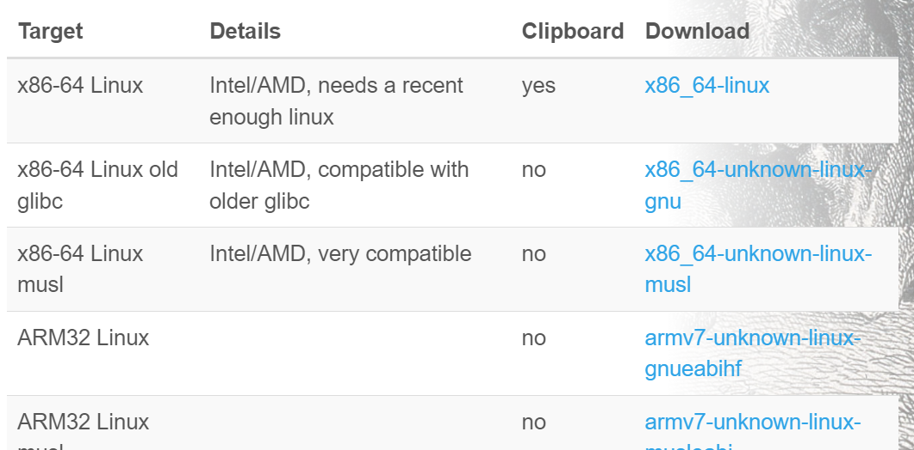

# 1. shell脚本

## 1.0 shell函数

可以在某个`.sh`文件中定义以下函数：

```bash
mcd () {
    mkdir -p "$1"
    cd "$1"
}
```

然后使用`source`命令加载该函数。

之后可以直接在命令行输入命令`mcd 文件路径`运行该函数。

## 1.1 变量赋值

在bash中，为变量赋值的语法为`foo=bar`。

> [!WARNING]
>
> 注意变量赋值语句不能包含空格，比如`foo = bar`会将`=`和`bar`视作`foo`命令的参数。

## 1.2 单引号与双引号

以单引号`‘`定义的字符串为原义字符串，变量不会被转义；以双引号`“`定义的字符串，其中的变量会被替换成值。如下：

```bash
➜  ~ foo=bar
➜  ~ echo "$foo"
bar
➜  ~ echo '$foo'
$foo
```

## 1.3 特殊变量

bash有很多特殊变量表示参数、错误代码以及相关变量，常用的特殊变量如下：

```bash
$0 - 脚本名
$1 到 $9 - 脚本的参数。 $1 是第一个参数，依此类推。
$@ - 所有参数
$# - 参数个数
$? - 前一个命令的返回值
$$ - 当前脚本的进程识别码
!! - 完整的上一条命令，包括参数。常见应用：当你因为权限不足执行命令失败时，可以使用 sudo !!再尝试一次。
$_ - 上一条命令的最后一个参数。如果你正在使用的是交互式 shell，你可以通过按下 Esc 之后键入 . 来获取这个值。
```

## 1.4 返回值

命令通常使用`STDOUT`（标准输出流）返回输出值，如`echo $?`将上一个命令的结果输出到STDOUT；使用`STDERR`（标准错误流）返回错误信息，如`echo "Error occurred!" >&2`将错误信息发送到STDERR。

通常来说，返回值0表示命令正常执行，其他返回值表示有错误发生。

退出码可以配合短路逻辑运算符使用，以便确定后一个命令是否执行。注意，`true`对应于返回码0，`false`对应于返回码1。因此程序返回0，实际相当于返回`true`。如下：

```bash
false || echo "Oops, fail"
# Oops, fail

true || echo "Will not be printed"
#

true && echo "Things went well"
# Things went well

false && echo "Will not be printed"
#
```

同一行的多个命令可以使用分号`;`进行分隔，如下：

```bash
false ; echo "This will always run"
# This will always run
```

## 1.5 获取`STDOUT`的内容

通过`$(CMD)`的方式执行CMD命令，其标准输出流`STDOUT`的内容会替换掉`$(CMD)`。

*进程替换*（process substitution）：`<(CMD)`会执行CMD命令并将其STDOUT的内容保存到一个临时文件，并将`<(CMD)`替换为临时文件名。

```bash
#!/bin/bash

echo "Starting program at $(date)" # date会被替换成日期和时间

# $0表示脚本名字，$#表示参数的个数，$$表示进程id
echo "Running program $0 with $# arguments with pid $$"

# $@表示所有参数
for file in "$@"; do
    grep foobar "$file" > /dev/null 2> /dev/null # /dev/null是一个特殊的设备文件，表示不进行任何输出。“2> /dev/null”表示标准错误流不进行任何输出。
    
    # 如果模式没有找到，则grep退出状态为 1
    if [[ $? -ne 0 ]]; then # -ne表示不等于
        echo "File $file does not have any foobar, adding one"
        echo "# foobar" >> "$file"
    fi
done
```

## 1.6 test

bash的条件判断可以使用`test`，如下：

```bash
# 检查文件是否存在
if test -e "file.txt"; then
    echo "File exists"
fi
```

`test`可以使用方括号`[]`代替，如下：

```bash
# 检查文件是否存在
if [-e "file.txt"]; then
    echo "File exists"
fi
```

`[[]]`是`[]`的改进版本，尽量使用双反括号`[[]]`代替`[]`，降低错误的几率。

> [!Note]
>
> - `[[]]`不会进行通配符扩展或者空格分割（识别成参数），因此参数不需要引用。
>
> - `[[]]`中的括号不需要转义。

通常来说，`[[]]`用来比较字符串和文件，`(())`用来比较数字。

## 1.7 通配（globbing）

可以使用`?`和`*`匹配一个和任意多个字符。

```bash
# 文件夹下有文件foo,foo1,foo2,foo10,bar
rm foo? # 删除foo1和foo2
```

当一系列的指令都有一段公共子串时，可以使用花括号自动展开命令：

```bash
convert image.{png,jpg}
# 会展开为
convert image.png image.jpg

cp /path/to/project/{foo,bar,baz}.sh /newpath
# 会展开为
cp /path/to/project/foo.sh /path/to/project/bar.sh /path/to/project/baz.sh /newpath

# 也可以结合通配使用
mv *{.py,.sh} folder
# 会移动所有 *.py 和 *.sh 文件

mkdir foo bar

# 下面命令会创建foo/a, foo/b, ... foo/h, bar/a, bar/b, ... bar/h这些文件
touch {foo,bar}/{a..h}
touch foo/x bar/y
# 比较文件夹 foo 和 bar 中包含文件的不同
diff <(ls foo) <(ls bar)
# 输出
# < x
# ---
# > y
```

> [!Note]
>
> 在zsh中，如果输入花括号，可以使用`TAB`将花括号扩展为完整命令。

## 1.8 shellcheck

安装VSCode插件`shellcheck`，可以帮助你定位sh/bash脚本中的错误。

## 1.9 env

在shebang行使用`env`，可以利用环境变量中的程序解析脚本，这样可以提高脚本的可移植性。

例如，`#! /usr/bin/env python`可以使用`$PATH`环境变量进行定位。

## 1.10 shell函数和脚本的差异

- 函数只能与shell使用相同的语言，脚本可以使用任意语言。因此在脚本中包含 `shebang` 是很重要的。
- 函数仅在定义时被加载，脚本会在每次被执行时加载。这让函数的加载比脚本略快一些，但每次修改函数定义，都要重新加载一次。
- 函数会在当前的shell环境中执行，脚本会在单独的进程中执行。因此，函数可以对环境变量进行更改，比如改变当前工作目录，脚本则不行。脚本需要使用 [`export`](https://man7.org/linux/man-pages/man1/export.1p.html) 将环境变量导出，并将值传递给环境变量。
- 与其他程序语言一样，函数可以提高代码模块性、代码复用性并创建清晰性的结构。shell脚本中往往也会包含它们自己的函数定义。

# 2. Shell工具

## 2.1 查看命令如何使用

最常用的方法是在对应的命令行添加`-h`或者`--help`。如果想要更加详细的信息，可以使用`man`命令，它提供了命令的用户手册。例如`man ls`会输出`ls`的说明。

### 2.1.1 使用tldr

**tldr-pages**项目是社区维护的命令行工具帮助页面的集合，旨在成为传统man手册页的更简单、更平易近人的补充。

使用以下命令安装`tldr-bash-client`：

```bash
L=/usr/local/bin/tldr  # elevated privileges needed for some locations
sudo wget -qO $L good4.eu/tldr
sudo chmod +x $L
tldr --update # 更新tldr本地页面
```

在`/usr/local/bin/tldr`中修改以下内容，使tldr页面显示中文：

```bash
: ${TLDR_LANG="zh"}
```

此后如果想要搜索某个命令`cmd`的用法，可以输入命令`tldr cmd`即可。

## 2.2 查找文件

`find`命令会递归搜索符合条件的文件，如下：

```bash
# 查找所有名称为src的文件夹
find . -name src -type d
# 查找所有文件夹路径中包含test的python文件
find . -path '*/test/*.py' -type f
# 查找前一天修改的所有文件
find . -mtime -1
# 查找所有大小在500k至10M的tar.gz文件
find . -size +500k -size -10M -name '*.tar.gz'
```

`find`还能对查找到的文件进行操作，如下：

```bash
# 删除全部扩展名为.tmp 的文件
find . -name '*.tmp' -exec rm {} \;
# 查找全部的 PNG 文件并将其转换为 JPG
find . -name '*.png' -exec convert {} {}.jpg \; # "\;"表示命令的结尾。
```

可以使用通配符查找文件，如`find -name '*PATTERN*'`，如果希望匹配时不区分大小写，可以使用`-iname`选项。

### 2.2.1 fd

`fd` 是一个在你文件系统中查找条目的程序。它是一个简单、快速、友好的 `find`替代品。虽然它的目标不是支持 `find` 的所有强大功能，但它为大多数的使用情况提供了合理的（有意见的）默认值。

使用`apt install fd-find`安装fd。

> [!Note]
>
> 建议在安装后，通过执行 `ln -s $(which fdfind) /usr/bin/fd` 命令来添加 `fd` 的链接，以便使用 `fd`命令，否则可能要使用`fdfind`命令。

#### 2.2.1.1 简单搜索

如果只有一个参数，那么fd会递归搜索当前目录中任何包含该模式的条目。

#### 2.2.1.2 指定根目录

如果我们想搜索一个特定的目录，可以把它作为fd的第二个参数：`fd passwd /etc`。

#### 2.2.1.3 列出所有条目

如果没有参数，那么fd会列出当前目录下的所有条目。

#### 2.2.1.4 搜索文件扩展名

可以使用`-e`选项搜索扩展名，如`fd -e md`会搜索所有md文件。

#### 2.2.1.5 搜索指定文件名

要找到与所提供的搜索模式完全一致的文件，请使用 `-g`（或 `--glob`）选项：`fd -g libc.so /usr`。

#### 2.2.1.6 搜索隐藏文件

通常情况下fd不搜索隐藏目录，也不会显示隐藏文件。如果要显示需要添加`-H`或者`--hidden`。

#### 2.2.1.7 匹配完整路径

通常情况下fd只匹配文件名。如果要匹配路径，需要添加`-p`选项。

#### 2.2.1.8 命令执行

- `-x`/`--exec` 选项为每个搜索结果运行一个外部命令（并行）。
- `-X`/`--exec-batch` 选项启动一次外部命令，将所有搜索结果作为参数。

## 2.3 查找文件内容

`grep`用于对输入文本进行匹配。

`-C`选项用于查找结果的上下文，`-v`将对结果进行反选，`-R`会递归地进入子目录搜索所有文件。

## 2.4 查找shell命令

`history`命令用于访问shell中输入的历史命令。如果要搜索某个特定的命令，可以与grep搭配使用，如`history | grep find`。

使用`CTRL+R`后可以输入子串进行匹配。如果找到了想要的历史记录项，可以按下Enter键来执行该命令，或者按下右箭头键来编辑该命令；如果找到的历史记录项不是您要找的，可以继续按下Ctrl+R，直到找到满意的历史记录项。

### 2.4.1 使用fzf进行模糊搜索

fzf 是一个通用的命令行模糊查找器。它是一个交互式 Unix 命令行过滤器，可以与任何列表一起使用；文件、命令历史记录、进程、主机名、书签、git 提交等。

使用`apt install fzf`安装fzf。可以在命令后面添加管道`| fzf`，以启动fzf的模糊查询。

| 模式      | 匹配类型         | 描述                          |
| --------- | ---------------- | ----------------------------- |
| `sbtrkt`  | 模糊匹配         | 匹配的项目`sbtrkt`            |
| `'wild`   | 完全匹配（引用） | 项目包括`wild`                |
| `^music`  | 前缀精确匹配     | 以以下开头的项目`music`       |
| `.mp3$`   | 后缀精确匹配     | 以以下结尾的项目`.mp3`        |
| `!fire`   | 逆向精确匹配     | 不包括的项目`fire`            |
| `!^music` | 反向前缀精确匹配 | 不以以下内容开头的项目`music` |
| `!.mp3$`  | 反向后缀精确匹配 | 不以以下内容结尾的项目`.mp3`  |

## 2.5 文件夹导航

### 2.5.1 autojump

可以使用`autojump`来查找最常用或者最近使用的文件和目录。

如果您经常访问`/home/user/files/cool_project`目录，对于autojump，则使用`j cool`代替即可。

安装步骤如下：

1. 使用`apt install autojump`安装

2. 修改`~/.zshrc`，如下所示：

   ```bash
   plugins=(git autojump)
   
   # autojump
   [[ -s ~/.autojump/etc/profile.d/autojump.sh ]] && . ~/.autojump/etc/profile.d/autojump.sh
   ```


### 2.5.2 broot

broot用于目录导航。

#### 2.5.2.1 安装

在网站https://dystroy.org/broot/install/下载对应OS版本的文件后，将其移动到`/usr/local/bin`目录下，然后添加执行权限：`chmod +x broot`。

`br`可以用于`alt+enter`跳转目录。默认下载完成`broot`后会提示下载`br`shell工具，输入`Y`进行下载，`source ~/.zshrc`命令后即可使用`br`命令。



#### 2.5.2.2 查找

使用`br -s`从当前目录启动`br`。通常的用法是直接输入目录名的某个关键词，键入`tab`选择另一个目录或者文件，然后键入`alt+enter`进入目录。`:q`会返回shell。

可以使用`c/内容`查找文件内容。

#### 2.5.2.3 预览

键入`ctrl+→`可以预览文件内容。

#### 2.5.2.4 编辑文件

键入`:e+enter`可以编辑光标所指文件。

# 3. 课后练习

## 3.1 ls的使用

### 3.1.1 打印所有文件（包括隐藏文件）

```bash
ls -a
```

### 3.1.2 文件打印以人类可以理解的格式输出 (例如，使用454M 而不是 454279954)

```bash
➜  ~ ls -lh
total 16K
drwxr-xr-x 10 root root 4.0K Apr 24 17:21 VisionFive2
drwxr-xr-x 28 root root 4.0K Apr 28 13:33 WSL2-Linux-Kernel
drwxr-xr-x  5 root root 4.0K May  5 01:48 study
drwxr-xr-x  8 root root 4.0K Apr 29 14:23 u-boot
```

### 3.1.3 文件以最近访问顺序排序

```bash
➜  ~ ls -ltu
total 16
drwxr-xr-x  5 root root 4096 May  5 01:48 study
drwxr-xr-x 10 root root 4096 May  4 21:50 VisionFive2
drwxr-xr-x 28 root root 4096 May  4 21:50 WSL2-Linux-Kernel
drwxr-xr-x  8 root root 4096 May  4 21:50 u-boot
```

### 3.1.4 以彩色文本显示输出结果

```bash
ls -l --color
```

## 3.2 shell函数

```bash
#! /bin/sh

#每当你执行 marco 时，当前的工作目录应当以某种形式保存
marco() {
    dir=$(pwd)
}

#当执行 polo 时，无论现在处在什么目录下，都应当 cd 回到当时执行 marco 的目录。
polo() {
    cd "$dir"
}
```

## 3.3 shell脚本

### 3.3.1 算术运算

在shell脚本中，变量运算有以下方式：

- 加法

```bash
bashCopy codea=10
b=5
c=$((a + b))
echo "Sum is: $c"
```

- 减法

```bash
bashCopy codea=10
b=5
c=$((a - b))
echo "Difference is: $c"
```

- 增量

```bash
bashCopy codea=10
((a++))
echo "Incremented value: $a"
```

- 减量

```bash
bashCopy codea=10
((a--))
echo "Decremented value: $a"
```

### 3.3.2 控制语句

if条件判断语句如下：

```bash
if [[ ! -e ./test.log ]]; then
    touch ./test.log
fi
```

while循环语句如下：

```bash
while [[ $? -ne 1 ]]
do
    ((count++))
    ./test.sh >> ./test.log 2>> ./test.log
done
```

> [!WARNING]
>
> 条件语句中的空格需要保留，不然会报语法错误。

## 3.4 find命令

`-exec`参数可以对查找的文件进行单个操作，而`-xargs`可以使用STDOUT中的内容作为参数。

```bash
#递归地查找文件夹中所有的HTML文件，并将它们压缩成zip文件。
 find . -type f -name "*.html" | xargs -d '\n' tar -cvzf 'test.tar.gz'
```

