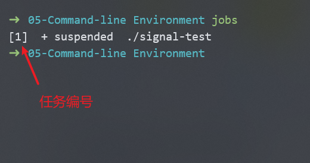
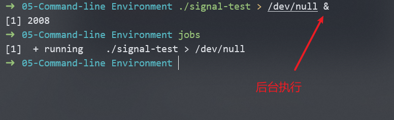
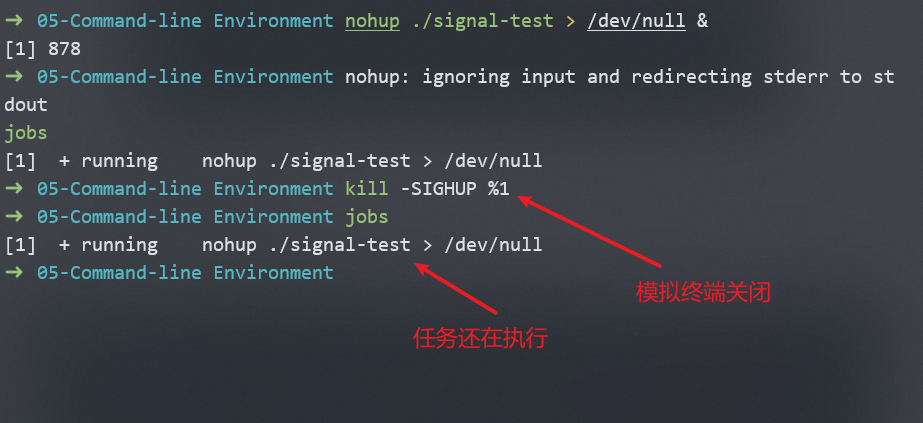
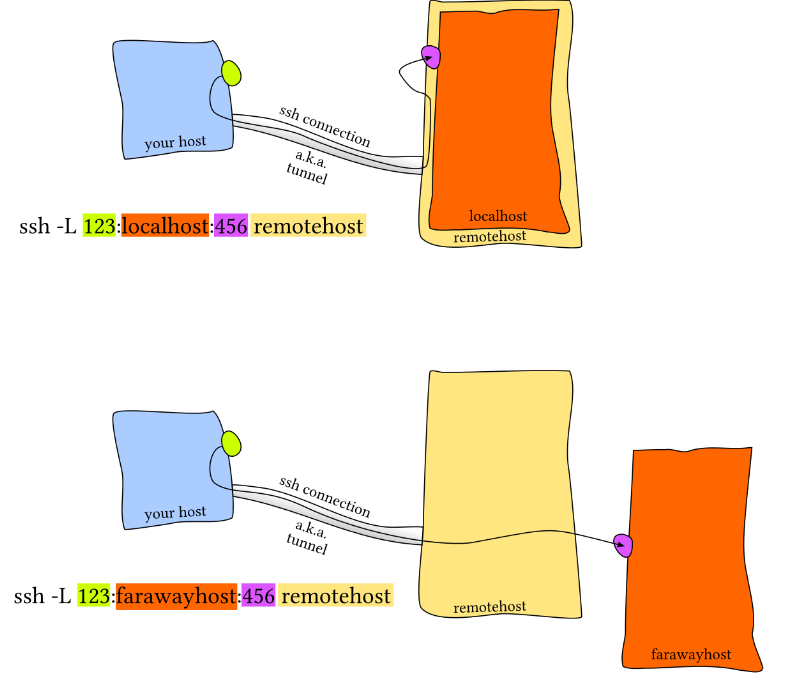
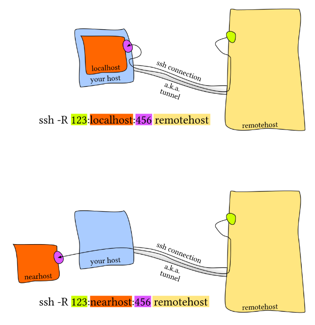
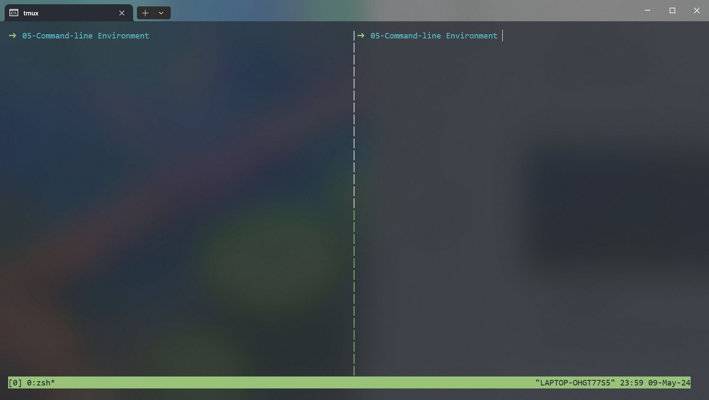
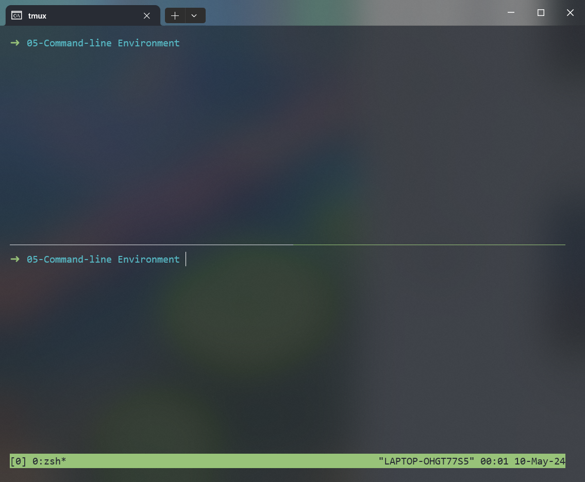
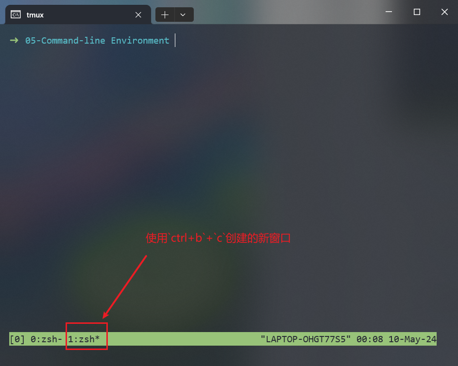
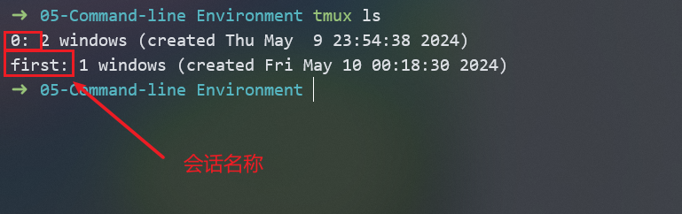

# 1. 任务控制

## 1.1 结束进程

shell使用UNIX提供的==信号机制==执行进程间通信。当一个进程收到信号时，会停止执行、处理信号、基于信号传递的信息改变执行。信号是一种==软件中断==。

- 如果需要`SIGINT`信号，可以输入`CTRL+C`。
- 如果需要`SIGQUIT`信号，可以输入`CTRL+\`。
- 如果需要`SIGTERM`信号，可以使用`kill -TERM <PID>`命令。

## 1.2 暂停和后台执行进程

### 1.2.1 暂停进程

`SIGSTOP`会让进程暂停，在终端中键入`CTRL+Z`会让shell发送`SIGTSTP`信号。

> [!Note]
>
> `SIGTSTP`是Terminal Stop的缩写，即terminal版本的`SIGSTOP`。

### 1.2.2 继续执行进程

可以使用`fg`命令在前台继续让暂停的工作执行，使用`bg`命令在后台继续让暂停的工作执行。

### 1.2.3 获取进程信息

`jobs`命令会列出当前终端会话中尚未完成的全部任务，可以使用`%任务编号`选取任务。如果选择最近的任务，可以使用`$!`代替。



### 1.2.4 后台执行进程

可以在命令中添加`&`后缀让命令直接在后台执行，此时可以在shell中做其他操作，但是STDOUT还是会占用终端（使用重定向避免这种情况）。



也可以键入`CTRL+Z`然后键入`bg`，使进程后台执行。

### 1.2.5 nohup

后台的进程是终端进程的子进程，一旦关闭终端（发送信号`SIGHUP`），通常后台的进程也会终止。但是如果使用`nohup`（忽略`SIGHUP`）运行程序，终端关闭也不会退出进程。



> [!Note]
>
> 参考资料：https://www.zhihu.com/question/594212481
>
> 对于WSL，关闭终端窗口时，系统会尝试向该子系统的所有正在运行的进程发出 SIGTERM 信号，以请求它们进行清理和保存工作，然后再发出 SIGKILL 信号，以强制终止它们。这与在 Linux 系统中通过 "sudo shutdown" 等指令关闭系统是不同的处理方式。

# 2. 终端多路复用

## 2.1 tmux对象继承结构

### 2.1.1 会话

每个会话都是一个独立的工作区，其中包含一个或多个窗口

- `tmux` 开始一个新的会话
- `tmux new -s NAME` 以指定名称开始一个新的会话
- `tmux ls` 列出当前所有会话
- 在 `tmux` 中输入 `<C-b> d` ，从当前会话离开。
- `tmux a` 重新连接最后一个会话。您也可以通过 `-t` 来指定具体的会话

### 2.1.2 窗口

窗口相当于编辑器或是浏览器中的标签页，从视觉上将一个会话分割为多个部分。

- `<C-b> c` 创建一个新的窗口，使用 `<C-d>`关闭
- `<C-b> N` 跳转到第 *N* 个窗口，注意每个窗口都是有编号的
- `<C-b> p` 切换到前一个窗口
- `<C-b> n` 切换到下一个窗口
- `<C-b> ,` 重命名当前窗口
- `<C-b> w` 列出当前所有窗口

### 2.1.3 面板

面板像vim中的分屏一样，面板使我们可以在一个屏幕里显示多个shell。

- `<C-b> "` 水平分割
- `<C-b> %` 垂直分割
- `<C-b> <方向>` 切换到指定方向的面板，<方向> 指的是键盘上的方向键
- `<C-b> z` 切换当前面板的缩放
- `<C-b> [` 开始往回卷动屏幕。您可以按下空格键来开始选择，回车键复制选中的部分
- `<C-b> <空格>` 在不同的面板排布间切换

# 3. 别名

bash中别名语法如下：

```bash
alias alias_name="command_to_alias arg1 arg2"
```

> [!WARNING]
>
> `=`两边没有空格，`alias`命令只接受一个参数。

# 4. 配置文件（Dotfiles）

程序配置通常以纯文本格式的配置文件（被称为点文件）来完成。它们默认是隐藏文件，`ls`通常不会显示。

对于bash来说，可以通过编辑`.bashrc`或者`.bash_profile`来配置。在文件中可以添加启动时执行的命令，比如别名或者环境变量。

各个工具的点文件如下：

- `bash` - `~/.bashrc`, `~/.bash_profile`
- `git` - `~/.gitconfig`
- `vim` - `~/.vimrc` 和 `~/.vim` 目录
- `ssh` - `~/.ssh/config`
- `tmux` - `~/.tmux.conf`

## 4.1 可移植性

### 4.1.1 使用if语句

针对不同的设备编写不同的配置，如下：

```bash
if [[ "$(uname)" == "Linux" ]]; then {do_something}; fi

# 使用和 shell 相关的配置时先检查当前 shell 类型
if [[ "$SHELL" == "zsh" ]]; then {do_something}; fi

# 您也可以针对特定的设备进行配置
if [[ "$(hostname)" == "myServer" ]]; then {do_something}; fi
```

### 4.1.2 使用include

如果配置文件支持`include`功能，比如`~/.gitconfig`，可以这样写：

```bash
[include]
	path = ~/.gitconfig_local
```

然后不同的设备创建不同的`~/.gitconfig_local`来包含与设备有关的特定配置。

### 4.1.3 共享配置

例如，如果想在`bash`和`zsh`中同时启用别名，可以把共用的别名写在`.aliases`中，然后在`~/.bashrc`和`~/.zsh`中同时添加以下语句：

```bash
# Test if ~/.aliases exists and source it
if [ -f ~/.aliases ]; then
    source ~/.aliases
fi
```

# 5. 远端设备

可以通过命令`ssh foo@bar.mit.edu`连接到其他服务器：

- 用户名为`foo`。
- 服务器为`bar.mit.edu`，可以为IP地址或者域名。

## 5.1 执行命令

`ssh foobar@server ls`可以直接在foo的终端中执行`ls`命令。

如果使用管道，比如`ssh foobar@server ls | grep PATTERN`，那么会在本地获取到远端`ls`的结果后本地执行`grep PATTERN`；而`ls | ssh foobar@server grep PATTERN`会在本地执行`ls`后传输给远端，由远端执行`grep PATTERN`。

## 5.2 SSH密钥

在加密通信中，发送方使用接收方的公钥来加密消息，而接收方则使用其私钥来解密消息。在数字签名中，发送方使用私钥来生成签名，接收方使用发送方的公钥来验证签名的真实性。

### 5.2.1 密钥生成

使用以下命令生成一对密钥（公钥和私钥）：

```bash
ssh-keygen -o -a 100 -t ed25519 -f ~/.ssh/id_ed25519
```

- `-o`：使用新的私钥文件格式。
- `-a 100`：加密密钥迭代次数为100次，通常迭代次数越高越安全，但是生成时间也越多。
- `-t ed25519`：使用ed25519加密算法。
- `-f ~/.ssh/id_ed25519`：生成的密钥文件为`~/.ssh/id_ed25519`。

生成过的密钥可以使用以下命令检查其有效性：

```bash
ssh-keygen -y -f /path/to/key # 读取文件打印公钥
```

### 5.2.2 基于密钥的认证机制

远端的ssh服务器会查询`.ssh/authorized_keys`确认哪些用户可以登录。可以通过以下命令将公钥拷贝过去：

```bash
cat .ssh/id_ed25519.pub | ssh foobar@remote 'cat >> ~/.ssh/authorized_keys'
```

或者

```bash
ssh-copy-id -i .ssh/id_ed25519.pub foobar@remote
```

## 5.3 通过SSH复制文件

### 5.3.1 ssh+tee

可以使用以下命令往服务器上传文件：

```bash
cat localfile | ssh remote_server tee serverfile
```

> [!Note]
>
> `tee`命令会将标准输出写入到文件。

### 5.3.2 scp

也可以使用`scp`命令往服务器上传文件：

```bash
scp path/to/local_file remote_host:path/to/remote_file
```

或者下载文件：

```bash
scp remote_host:path/to/remote_file path/to/local_file
```

## 5.4 端口转发

> 参考文档：
>
> [1]https://unix.stackexchange.com/questions/115897/whats-ssh-port-forwarding-and-whats-the-difference-between-ssh-local-and-remot

### 5.4.1 本地端口转发

常见的情景是使用本地端口转发，即远端设备上的服务监听一个端口，而您希望在本地设备上的一个端口建立连接并转发到远程端口上。

例如，我们在远端服务器上运行Jupyternotebook并监听`8888`端口。然后，建立从本地端口`9999`的转发，使用`ssh -L 9999:localhost:8888 foobar@remote_server`。这样只需要访问本地的`localhost:9999`即可。

#### 5.4.1.1 本地端口转发



- `ssh -L 123:localhost:456 remotehost`

  把请求本地123端口的请求转发给远端`remotehost`的456端口。

- `ssh -L 123:farawayhost:456 remotehost`

  把请求本地123端口的请求通过`remotehost`转发给`farawayhost`主机的456端口。

#### 5.4.1.2 远程端口转发



- `ssh -R 123:localhost:456 remotehost`

  把请求远端`remotehost`123端口的请求转发到本机456端口。

- `ssh -R 123:nearhost:456 remotehost`

  把请求远端`remotehost`123端口的请求经由本机转发给`nearhost`主机的456端口。

## 5.5 SSH配置

将以下内容添加进`~/.ssh/config`：

```bash
Host vm
    User foobar
    HostName 172.16.174.141
    Port 2222
    IdentityFile ~/.ssh/id_ed25519
    LocalForward 9999 localhost:8888
    
# 在配置文件中也可以使用通配符
Host *.mit.edu
    User foobaz
```

之后可以使用`ssh vm`直接deng'lu。

或者使用`scp /path/to/local_file vm:/path/to/remote_file`替代`scp path/to/local_file HostName:port/path/to/remote_file`。

服务器端的配置一般存放在`/etc/ssh/sshd_config`。可以在这里配置免密认证、修改ssh端口、开启X11转发等等。

## 5.6 杂项

# 6. Shell & 框架

# 7. 终端模拟器

# 8. 课后练习

## 8.1 pgrep及pkill的使用

通常来说使用`ps aux | grep <process name>`来查找某个进程名字对应的进程id，再通过`kill <pid>`来终止进程。

而更简便的方法是使用`pgrep <process name>`查找进程对应的id。使用`pkill <process name>`直接终止进程。

## 8.2 等待其他进程完成

`wait <process id>`可以等待其他进程执行完成，注意`wait`命令只对子进程生效。

`kill -0 <pid>`会返回一个状态码，该命令不会对进程发送任何信号，而是仅仅查询进程状态——进程存在时返回0，进程不存在时返回其他数字。在函数中可以通过`$?`获取该状态码。

> [!CAUTION]
>
> 状态码通过`$?`获取，标准输出通过`$(cmd)`获取。

```bash
#! /bin/env bash
# 某个进程结束后再开启另一个进程，同时需要使用sleep避免CPU浪费
pidwait() {
    kill -0 $1
    while [[ $? -eq 0 ]] do
        sleep 5
        kill -0 $1
    done
}
```

## 8.3 tmux快速指南

> 参考资料：
>
> [1]https://hamvocke.com/blog/a-quick-and-easy-guide-to-tmux/

### 8.3.1 开启第一个会话

```bash
tmux
```

tmux底部有一个状态栏，当前显示的窗口显示在左端，系统信息（日期时间等）显示在右端，如下图所示：


### 8.3.2 分割窗格

tmux中所有命令都是通过前缀键`ctrl+b`加命令键触发。

将窗格拆分为左窗格和右窗格的快捷方式为`ctrl+b`+`%`。如下图所示：



将窗格拆分为上窗格和下窗格的快捷方式为`Ctrl+b`+`“`，如下图所示：



### 8.3.3 导航窗格

使用`Ctrl+b`+`方向键`切换不同的窗格，比如如果想要切换到左边的窗格，需要使用`Ctrl+b`+`←`。

### 8.3.4 关闭窗格

使用`Ctrl+d`关闭窗格，也可以直接输入命令`exit`关闭窗格。

### 8.3.5 创建窗口

使用`ctrl+b`+`c`创建一个新的窗口，如下所示：



> [!Note]
>
> 窗口的英文为`window`，窗格的英文为`pane`。

使用`ctrl+b`+`p`切换前一个窗口，使用使用`ctrl+b`+`n`切换后一个窗口。也可以使用`ctrl+b`+`number`切换到对应数字的窗口。

### 8.3.6 会话处理

退出会话中的所有窗格，就相当于退出会话。

如果要保留会话状态，只是分离当前会话，可以使用`ctrl+b`+`d`。也可以使用`ctrl+b`+`D`以选择退出会话。

使用命令`tmux ls`查看所有还在运行的会话，如下所示：



如果要重新连接某个会话，使用以下命令：

```bash
tmux attach -t <会话名称>
```

使用以下命令在创建会话的时候指定会话名称：

```bash
tmux new -s <会话名称>
```

使用以下命令对会话进行重命名：

```bash
tmux rename-session -t <旧名称>  <新名称>
```

### 8.3.7 扩展

- `ctrl+b`+`z`：将当前窗格全屏显示，再次按下`ctrl+b`+`z`可以恢复原来大小。
- `ctrl+b+方向键`：按住`ctrl+b`不放，并且反复按下方向键，可以不断调整当前窗格的大小。
- `ctrl+b`+`,`：重命名当前窗口。
