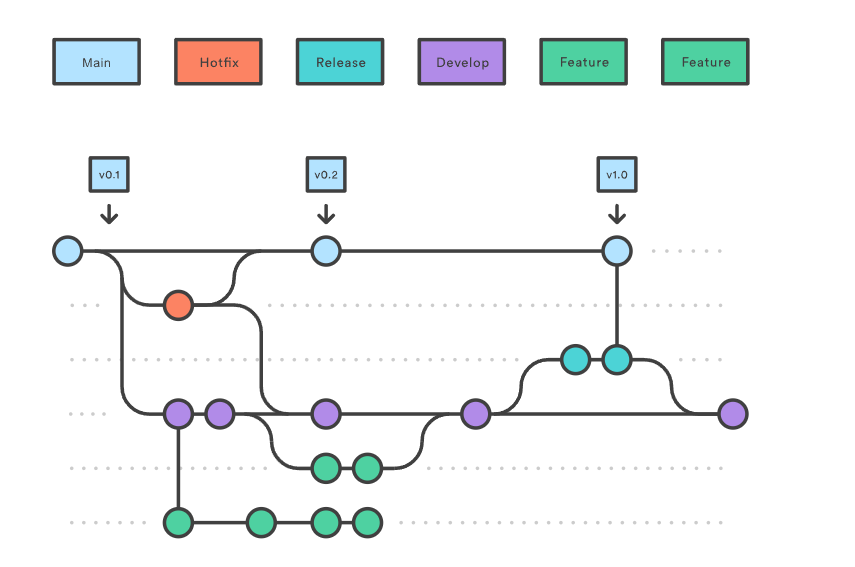
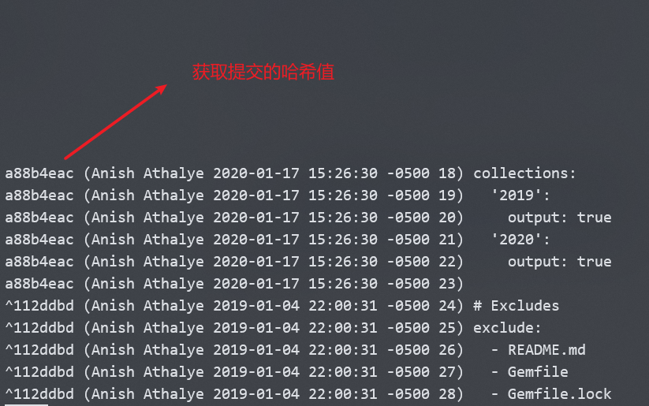

版本控制系统（VCSs）通过一系列的快照将某个文件夹及其内容保存了起来，每个快照都包含了文件或文件夹的完整状态，同时还包含快照创建者的信息以及每个快照的相关信息等等。

# 1. Git的数据模型

## 1.1 快照

在Git中，文件称为`Blob`对象（数据对象），也就是一组数据。目录则被称为`树`，它将名字与Blob对象或树对象进行映射。快照则是被追踪的最顶层的树。以下是一棵树的结构：

```
<root> (tree)
|
+- foo (tree)
|  |
|  + bar.txt (blob, contents = "hello world")
|
+- baz.txt (blob, contents = "git is wonderful")
```

顶层的树包含两个元素，一个是名为“foo”的树，一个名为“baz.text”的blob对象。

## 1.2 历史记录建模：关联快照

在Git中，历史记录是一个由快照组成的有向无环图。快照可能有多个“父辈”，也就是之前的一系列快照，类似于数据结构中树的祖先结点。

一系列的快照可以用以下的图表示，注意：箭头是父辈，箭尾是子辈：

```
o <-- o <-- o <-- o
            ^  
             \
              --- o <-- o
```

即在第三次提交之后，历史记录分岔成了两条独立的分支，而独立的分支也有可能再次合并，如下所示：

```
o <-- o <-- o <-- o <---- o
            ^            /
             \          v
              --- o <-- o
```

## 1.3 数据模型及其伪代码表示

```c++
// 文件就是一组数据
type blob = array<byte>

// 一个包含文件和目录的目录
type tree = map<string, tree | blob>

// 每个提交都包含一系列父辈，元数据和顶层树
type commit = struct {
    parent: array<commit> // 可能有多个父辈
    author: string
    message: string
    snapshot: tree
}
```

## 1.4 对象和内存寻址

Git中对象可能是数据对象（blob）、树（tree）、提交（commit）。

Git在存储数据的时候，所有的对象都会基于它们的`SHA-1 Hash`进行寻址。

```C++
objects = map<string, object>

def store(object):
    id = sha1(object)
    objects[id] = object

def load(id):
    return objects[id]
```

当树以及提交对象引用其他对象时，实际上只保存了其他对象的哈希值。

假如我们通过某种方式获得某个tree的哈希值`698281bc680d1995c5f4caaf3359721a5a58d48d`，可以通过以下命令查看其包含的blob对象和tree对象的哈希值：

```bash
git cat-file -p 698281bc680d1995c5f4caaf3359721a5a58d48d
```

其结果为：

```bash
100644 blob 4448adbf7ecd394f42ae135bbeed9676e894af85    baz.txt
040000 tree c68d233a33c5c06e0340e4c224f0afca87c8ce87    foo
```

如果上述命令引用的是一个文件，可以获得文件的内容。

## 1.5 引用

把对象的哈希值赋予人类可读的名字，称为==引用==（reference）。引用可以被更新，指向新的对象。

Git有一个指向当前位置的引用`HEAD`，如果想要知道当前所在的位置，以便创建新的快照时设置相对位置（知道在哪个父辈后），可以使用该引用。

> [!note]
>
> - 引用可以是分支（branch）、标签（tag）或HEAD。它们都是对特定提交的引用，但具有不同的特性和用途。
> - 分支是引用的一种，它是可变的，意味着在不同的时刻可以指向不同的提交记录。

## 1.6 仓库

Git仓库实际就是对象和引用。所有的Git命令都对应于对对象和应用的操作。

# 2. 暂存区

GIt并不是简单地如果把当前工作目录的状态作为快照，比如开发了两个新的特性，第一次只提交一个特性，第二次提交另一个特性；或者提交忽略调试代码时的打印语句。

Git处理以上场景的方法称为==暂存区==机制，允许指定下次快照中要包含的改动。

将文件加入暂存区的命令为`git add <filename>`。

> [!caution]
>
> 实际上我们每次提交之后，暂存区并不会实际清空，而是会维持刚刚提交的内容。
>
> 如果暂存区里有同名文件，使用`git add <filename>`只是会把暂存区里面同名文件的内容覆盖。

# 3. Git的命令行语句

## 3.1 基础

- `git help <command>`: 获取 git 命令的帮助信息

- `git init`: 创建一个新的 git 仓库，其数据会存放在一个名为 `.git` 的目录下

- `git status`: 显示当前的仓库状态

- `git add <filename>`: 添加文件到暂存区

- `git commit`: 创建一个新的提交

  - 如何编写 [良好的提交信息](https://tbaggery.com/2008/04/19/a-note-about-git-commit-messages.html)!

    > 一份良好的提交信息如下：
    >
    > ```
    > Capitalized, short (50 chars or less) summary
    > 
    > More detailed explanatory text, if necessary.  Wrap it to about 72
    > characters or so.  In some contexts, the first line is treated as the
    > subject of an email and the rest of the text as the body.  The blank
    > line separating the summary from the body is critical (unless you omit
    > the body entirely); tools like rebase can get confused if you run the
    > two together.
    > 
    > Write your commit message in the imperative: "Fix bug" and not "Fixed bug"
    > or "Fixes bug."  This convention matches up with commit messages generated
    > by commands like git merge and git revert.
    > 
    > Further paragraphs come after blank lines.
    > 
    > - Bullet points are okay, too
    > 
    > - Typically a hyphen or asterisk is used for the bullet, followed by a
    >   single space, with blank lines in between, but conventions vary here
    > 
    > - Use a hanging indent
    > ```
    >
    > - 第一行为标题，字符数控制在50个以内，标题==不需要==用句号结尾。
    > - 标题的第一个字母应该大写。
    > - 标题与下面的正文之间要有一行空行。
    > - 正文每行的字符在72个左右。
    > - 尽量使用祈使句，比如“Fix bug”而不是“Fixed bug”。
    > - 如果要分点，使用`-`或者`*`，之后跟一个空格，分论点之间有无空行都行。
    > - 分点要使用悬挂缩进。

  - 为何要 [编写良好的提交信息](https://chris.beams.io/posts/git-commit/)

    > 用正文解释改变了什么，为什么要改变，如何改变。

- `git log`: 显示历史日志

- `git log --all --graph --decorate`: 可视化历史记录（有向无环图）

- `git diff <filename>`: 显示与暂存区文件的差异

- `git diff <revision> <filename>`: 显示某个文件两个版本之间的差异

- `git checkout <revision>`: 更新 HEAD 和目前的分支

- `git cat-file -p <hash>`：打印hash对应的节点的内容

- `git checkout <filename>`：放弃file的当前改动，将其回退到最近一次提交的状态。

> [!note]
>
> `<revision>`指某一次提交的引用或者hash。
>
> - `git diff <revision> <filename>`指的是file的当前状态与revision状态之间的差别。
> - `git diff <filename>`指的是file的当前状态与暂存区状态之间的差别。
> - `git diff <a revision> <another revision> <filename>`指的是file从`<a revision>`状态到`<another revistion>`状态之间的差别。
> - `git diff --cached <filename>`指的是查看file暂存区状态与最近一次提交的状态之间的差别。

## 3.2 分支和合并

- `git branch`: 显示分支
- `git branch <name>`: 创建分支，其指向HEAD所指向的commit节点。
- `git checkout -b <name>`: 创建分支并切换到该分支
  - 相当于 `git branch <name>; git checkout <name>`
- `git merge <revision>`: 合并到当前分支
- `git mergetool`: 使用工具来处理合并冲突
- `git rebase`: 用于将一个分支的修改合并到另一个分支上。它的作用是重新应用一系列提交到另一个分支上，而不是像git merge那样产生一个新的合并提交。

> [!note]
>
> `git merge <revision>`如果当前节点是`<revision>`所引用节点的祖先节点，那么当前节点的引用会移动到`<revision>`节点。
>
> 一般情况下，`git merge <revision>`会创建一个新的commit节点，但是`<revision>`的引用不会移动到该节点。

## 3.3 远端操作

- `git remote`: 列出远端
- `git remote add <name> <url>`: 添加一个远端
- `git push <remote> <local branch>:<remote branch>`: 将对象传送至远端并更新远端引用
- `git branch --set-upstream-to=<remote>/<remote branch>`: 创建本地分支和远端分支的关联关系，之后在本地commit之后，可以直接使用`git push`，不用指定将本地的哪个分支推送至远端的哪个分支。
- `git fetch`: 从远端获取对象/索引
- `git pull`: 相当于 `git fetch; git merge`
- `git clone`: 从远端下载仓库

## 3.4 撤销

- `git commit --amend`: 编辑提交的内容或信息
- `git reset HEAD <file>`: 恢复暂存的文件
- `git checkout -- <file>`: 丢弃修改
- `git restore`: git2.32版本后取代git reset 进行许多撤销操作

## 3.5 Git高级操作

- `git config`: Git 是一个 [高度可定制的](https://git-scm.com/docs/git-config) 工具

- `git clone --depth=1`: 浅克隆（shallow clone），不包括完整的版本历史信息

- `git add -p`: 交互式暂存，可以进行排除某些不想暂存的内容。

  > y - stage this hunk
  > n - do not stage this hunk
  > q - quit; do not stage this hunk or any of the remaining ones
  > a - stage this hunk and all later hunks in the file
  > d - do not stage this hunk or any of the later hunks in the file
  > g - select a hunk to go to
  > / - search for a hunk matching the given regex
  > j - leave this hunk undecided, see next undecided hunk
  > J - leave this hunk undecided, see next hunk
  > k - leave this hunk undecided, see previous undecided hunk
  > K - leave this hunk undecided, see previous hunk
  > s - split the current hunk into smaller hunks
  > e - manually edit the current hunk
  > ? - print help

- `git rebase -i`: 交互式变基
- `git blame`: 查看最后修改某行的人
- `git stash`: 暂时移除工作目录下的修改内容
- `git bisect`: 通过二分查找搜索历史记录
- `.gitignore`: [指定](https://git-scm.com/docs/gitignore) 故意不追踪的文件

# 4. 杂项

- **图形用户界面**: Git 的 [图形用户界面客户端](https://git-scm.com/downloads/guis) 有很多，但是我们自己并不使用这些图形用户界面的客户端，我们选择使用命令行接口

- **Shell 集成**: 将 Git 状态集成到您的 shell 中会非常方便。([zsh](https://github.com/olivierverdier/zsh-git-prompt), [bash](https://github.com/magicmonty/bash-git-prompt))。[Oh My Zsh](https://github.com/ohmyzsh/ohmyzsh)这样的框架中一般以及集成了这一功能

- **编辑器集成**: 和上面一条类似，将 Git 集成到编辑器中好处多多。[fugitive.vim](https://github.com/tpope/vim-fugitive) 是 Vim 中集成 GIt 的常用插件

- **工作流**: 我们已经讲解了数据模型与一些基础命令，但还没讨论到进行大型项目时的一些惯例 ( 有[很多](https://nvie.com/posts/a-successful-git-branching-model/) [不同的](https://www.endoflineblog.com/gitflow-considered-harmful) [处理方法](https://www.atlassian.com/git/tutorials/comparing-workflows/gitflow-workflow))

  `git flow`模型如下

  

  

  ```bash
  # 演示功能分支流的完整示例如下。假设我们有一个带有分支的存储库设置`main` 。
  git checkout main
  git checkout -b develop
  git checkout -b feature_branch
  # work happens on feature branch
  git checkout develop
  git merge feature_branch
  git checkout main
  git merge develop
  git branch -d feature_branch
  
  # 除了`feature`and`release`流程外，`hotfix`还有一个例子如下：
  git checkout main
  git checkout -b hotfix_branch
  # work is done commits are added to the hotfix_branch
  git checkout develop
  git merge hotfix_branch
  git checkout main
  git merge hotfix_branch
  ```

- **GitHub**: Git 并不等同于 GitHub。 在 GitHub 中您需要使用一个被称作[拉取请求（pull request）](https://help.github.com/en/github/collaborating-with-issues-and-pull-requests/about-pull-requests)的方法来向其他项目贡献代码

- **其他 Git 提供商**: GitHub 并不是唯一的。还有像 [GitLab](https://about.gitlab.com/) 和 [BitBucket](https://bitbucket.org/) 这样的平台。

# 5. 资源

- [Pro Git](https://git-scm.com/book/en/v2) ，**强烈推荐**！学习前五章的内容可以教会您流畅使用 Git 的绝大多数技巧，因为您已经理解了 Git 的数据模型。后面的章节提供了很多有趣的高级主题。（[Pro Git 中文版](https://git-scm.com/book/zh/v2)）；
- [Oh Shit, Git!?!](https://ohshitgit.com/) ，简短的介绍了如何从 Git 错误中恢复；
- [Git for Computer Scientists](https://eagain.net/articles/git-for-computer-scientists/) ，简短的介绍了 Git 的数据模型，与本文相比包含较少量的伪代码以及大量的精美图片；
- [Git from the Bottom Up](https://jwiegley.github.io/git-from-the-bottom-up/)详细的介绍了 Git 的实现细节，而不仅仅局限于数据模型。好奇的同学可以看看；
- [How to explain git in simple words](https://smusamashah.github.io/blog/2017/10/14/explain-git-in-simple-words)；
- [Learn Git Branching](https://learngitbranching.js.org/) 通过基于浏览器的游戏来学习 Git ；

# 6. 课后练习

## 6.2 git log

### 6.2.2 最后修改某个文件的记录

```bash
$ git log --follow README.md | head -n 5
commit b41a57ef4b35fbe98aba75253c64a82eb821124a
Author: justin <2090741942@qq.com>
Date:   Fri Aug 18 20:52:21 2023 +0800

    修改了一个换行
```

### 6.2.3 最后修改某个文件行的提交信息

先使用`git blame -L '/collections:/' _config.yml`查看修改某行的所有提交记录，我们需要获取到该次提交的哈希值，如下所示：



然后根据`git show <hash>`获取该次提交的具体信息。

## 6.4 git stash

**`git stash`命令用于保存当前工作目录的临时状态，包括暂存区和已修改但未暂存的文件**。

具体来说，`git stash`命令会将修改的代码先暂存起来，让本地仓库回到最后一次提交时的状态，便于代码的更新管理，主要避免修改文件与最新代码的冲突。你可以使用`git stash pop`命令来恢复之前保存的修改。此外，git stash命令也可以多次执行，每次执行都会将当前的工作状态保存到一个新的stash中，你可以通过指定stash的名字来恢复特定的stash。

使用场景：当你正在开发一个功能或修复一个bug，但需要切换到另一个分支来处理其他任务时，使用git stash可以将当前的修改保存起来，这样你可以切换到其他分支并开始另一个任务，而无需提交或放弃你当前的修改。当你完成其他任务后，可以再回到之前的状态，继续之前的开发。

## 6.5 别名alias

在`~/.gitconfig`中配置以下内容设置别名：

```bash
[alias]
    history = log --all --graph --decorate --oneline
```

以后就可以直接使用`git history`来代替`git log --all --graph --decorate --oneline`。

## 6.6 配置全局忽略规则

可以通过执行 `git config --global core.excludesfile ~/.gitignore_global` 在 `~/.gitignore_global` 中创建全局忽略规则。