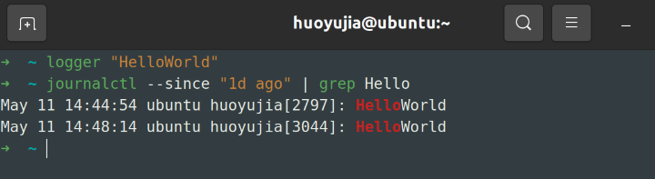

# 1. 调试代码

## 1.1 打印调试法与日志

## 1.2 第三方日志系统

### 1.2.1 系统日志

对于UNIX系统，程序的日志一般存放在`/var/log`目录下。

系统自身使用的是system log，大多数Linux系统都会使用`systemd`，它会将日志以某种特殊格式存放于`/var/log/journal`，可以使用`journalctl`命令显示这些日志。

### 1.2.2 内核日志

大多数UNIX系统，可以使用`dmesg`命令读取内核日志。

### 1.2.3 自定义程序加入系统日志

如果希望自定义程序加入到系统日志中，可以使用`logger`shell程序，如下所示：

```bash
logger "Hello Logs"
# On Linux
journalctl --since "1m ago" | grep Hello
```



## 1.3 调试器

## 1.4 专门工具

`strace`可以帮助跟踪程序执行的系统调用，下面的例子展现如何使用`strace`显示`ls`执行时，对`stat`系统调用进行追踪。

```bash
➜  ~ sudo strace -e lstat ls -l > /dev/null
lstat("bin", {st_mode=S_IFDIR|0755, st_size=4096, ...}) = 0
lstat("u-boot", {st_mode=S_IFDIR|0755, st_size=4096, ...}) = 0
lstat("LICENSE", {st_mode=S_IFREG|0644, st_size=35149, ...}) = 0
lstat("WSL2-Linux-Kernel", {st_mode=S_IFDIR|0755, st_size=4096, ...}) = 0
lstat("VisionFive2", {st_mode=S_IFDIR|0755, st_size=4096, ...}) = 0
lstat("README.md", {st_mode=S_IFREG|0644, st_size=54, ...}) = 0
lstat("study", {st_mode=S_IFDIR|0755, st_size=4096, ...}) = 0
lstat("snap", {st_mode=S_IFDIR|0700, st_size=4096, ...}) = 0
+++ exited with 0 +++
```

## 1.5 静态分析

静态分析是指不需要程序执行就能够发现问题，类似于Java的编译时异常。静态分析会将程序源码作为输入，然后基于编码规则对其进行分析并对代码的正确性进行推理。

`shellcheck`就是一个分析shell脚本的静态分析工具。

IDE在编辑界面显示静态分析工具的分析结果、高亮有错误和警告的位置，这个过程称为`code linting`。

# 2. 性能分析

大多数情况下，我们只需要打印两处代码之间的时间，就可以得到哪里耗费的时间比较长。不过这种方法也有可能误导，因为同时可能运行其他进程时发生了等待。

通常来说，用户时间+系统时间代表了进程所耗费的实际CPU。

- 真实时间 - 从程序开始到结束流失掉的真实时间，包括其他进程的执行时间以及阻塞消耗的时间（例如等待 I/O或网络）；
- 用户时间 - CPU 执行用户代码所花费的时间；
- 系统时间 - CPU 执行系统内核代码所花费的时间。

在命令前面键入`time`，即可查看命令运行的用户时间和系统时间。

```bash
➜  ~ time curl https://missing.csail.mit.edu &> /dev/null
curl https://missing.csail.mit.edu &> /dev/null  0.02s user 0.00s system 9% cpu 0.190 total
```

## 2.1 性能分析工具（profilers）

### 2.1.1 CPU

CPU性能分析工具有两种：追踪分析器（tracing）和采样分析器（sampling）。追踪分析器会记录程序的每一次函数调用，采用分析器只会周期性地检测（通常是每毫秒）程序并记录程序堆栈。

### 2.1.2 内存

为了应对C语言内存泄漏地问题，可以使用`Valgrind`检查。

1. 安装`Valgrind`

   ```bash
   apt install Valgrind
   ```

2. 在`Memcheck`下运行程序

   如果平时使用`myprog arg1 arg2`运行程序，改成使用一下命令运行：

   ```bash
   valgrind --leak-check=yes myprog arg1 arg2
   ```

3. 解释`Memcheck`输出

   以下是访问错误的信息：

   ```bash
   ==3052== Invalid write of size 4
   ==3052==    at 0x10916B: f (in /root/study/missing semester/07-Debugging and Profiling/myprog)
   ==3052==    by 0x109180: main (in /root/study/missing semester/07-Debugging and Profiling/myprog)
   ==3052==  Address 0x4a4c068 is 0 bytes after a block of size 40 alloc'd
   ==3052==    at 0x483B7F3: malloc (in /usr/lib/x86_64-linux-gnu/valgrind/vgpreload_memcheck-amd64-linux.so)
   ==3052==    by 0x10915E: f (in /root/study/missing semester/07-Debugging and Profiling/myprog)
   ==3052==    by 0x109180: main (in /root/study/missing semester/07-Debugging and Profiling/myprog)
   ```

   - `==3052==`是进程ID。
   - 第一行`Invalid write of size 4`表示错误类型。

   以下是内存泄漏的信息：

   ```bash
   ==3052== LEAK SUMMARY:
   ==3052==    definitely lost: 40 bytes in 1 blocks
   ==3052==    indirectly lost: 0 bytes in 0 blocks
   ==3052==      possibly lost: 0 bytes in 0 blocks
   ==3052==    still reachable: 0 bytes in 0 blocks
   ==3052==         suppressed: 0 bytes in 0 blocks
   ```

## 2.2 事件分析

`perf`命令不会报告事件和空间的消耗，而是报告与程序相关的系统事件。

- `perf list` - 列出可以被 pref 追踪的事件；
- `perf stat COMMAND ARG1 ARG2` - 收集与某个进程或指令相关的事件；
- `perf record COMMAND ARG1 ARG2` - 记录命令执行的采样信息并将统计数据储存在`perf.data`中；
- `perf report` - 格式化并打印 `perf.data` 中的数据。

## 2.3 可视化

最常见的显示CPU分析数据的形式是 [火焰图](http://www.brendangregg.com/flamegraphs.html)，火焰图会在 Y 轴显示函数调用关系，并在 X 轴显示其耗时的比例。

调用图和控制流图可以显示子程序之间的关系，并且将函数调用作为边，可以帮助分析程序的流程。

## 2.4 资源监控

有很多很多的工具可以被用来显示不同的系统资源，例如 CPU 占用、内存使用、网络、磁盘使用等。

- **通用监控** - 最流行的工具要数 [`htop`](https://htop.dev/),了，它是 [`top`](http://man7.org/linux/man-pages/man1/top.1.html)的改进版。`htop` 可以显示当前运行进程的多种统计信息。`htop` 有很多选项和快捷键，常见的有：`<F6>` 进程排序、 `t` 显示树状结构和 `h` 打开或折叠线程。 还可以留意一下 [`glances`](https://nicolargo.github.io/glances/) ，它的实现类似但是用户界面更好。如果需要合并测量全部的进程， [`dstat`](http://dag.wiee.rs/home-made/dstat/) 是也是一个非常好用的工具，它可以实时地计算不同子系统资源的度量数据，例如 I/O、网络、 CPU 利用率、上下文切换等等；
- **I/O 操作** - [`iotop`](http://man7.org/linux/man-pages/man8/iotop.8.html) 可以显示实时 I/O 占用信息而且可以非常方便地检查某个进程是否正在执行大量的磁盘读写操作；
- **磁盘使用** - [`df`](http://man7.org/linux/man-pages/man1/df.1.html) 可以显示每个分区的信息，而 [`du`](http://man7.org/linux/man-pages/man1/du.1.html) 则可以显示当前目录下每个文件的磁盘使用情况（ **d**isk **u**sage）。`-h` 选项可以使命令以对人类（**h**uman）更加友好的格式显示数据；[`ncdu`](https://dev.yorhel.nl/ncdu)是一个交互性更好的 `du` ，它可以让您在不同目录下导航、删除文件和文件夹；
- **内存使用** - [`free`](http://man7.org/linux/man-pages/man1/free.1.html) 可以显示系统当前空闲的内存。内存也可以使用 `htop` 这样的工具来显示；
- **打开文件** - [`lsof`](http://man7.org/linux/man-pages/man8/lsof.8.html) 可以列出被进程打开的文件信息。 当我们需要查看某个文件是被哪个进程打开的时候，这个命令非常有用；
- **网络连接和配置** - [`ss`](http://man7.org/linux/man-pages/man8/ss.8.html) 能帮助我们监控网络包的收发情况以及网络接口的显示信息。`ss` 常见的一个使用场景是找到端口被进程占用的信息。如果要显示路由、网络设备和接口信息，您可以使用 [`ip`](http://man7.org/linux/man-pages/man8/ip.8.html) 命令。注意，`netstat` 和 `ifconfig` 这两个命令已经被前面那些工具所代替了。
- **网络使用** - [`nethogs`](https://github.com/raboof/nethogs) 和 [`iftop`](http://www.ex-parrot.com/pdw/iftop/) 是非常好的用于对网络占用进行监控的交互式命令行工具。

## 2.5 专用工具

如果只需要对黑盒程序进行基准测试，并依此对软件选择进行评估， 类似 [`hyperfine`](https://github.com/sharkdp/hyperfine) 这样的工具可以帮您快速进行基准测试。

# 3. 课后练习

## 3.1 调试

### 3.1.1 journalctl

使用 Linux 上的 `journalctl` 或 macOS 上的 `log show` 命令来获取最近一天中超级用户的登录信息及其所执行的指令。

```bash
journalctl --since "1d ago" | grep sudo
```

### 3.1.3 shellcheck

最好不要在迭代中使用`ls`命令，可以直接使用通配符。比如使用`for f in *.m3u`，而不是使用`for f in $(ls *.m3u)`。

## 3.2 性能分析

### 3.2.4 taskset

通过使用 `taskset`，系统管理员或用户可以将进程绑定到特定的 CPU 核心，以提高系统性能、减少缓存未命中等问题。