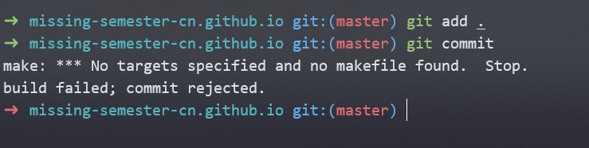

# 1. 构建系统

通常，需要在构建系统的工具定义依赖、目标和规则。如果目标的依赖没有发生变动，可以从之前的构建中复用这些依赖，那么与其相关的构建规则并不会执行。

`make`是最常用的构建系统之一。当执行`make`时系统会去参考当前目录下的`Makefile`文件，所有构建目标、依赖、规则都需要在该文件中定义，以下是`Makefile`文件的示例：

```makefile
paper.pdf: paper.tex plot-data.png
	pdflatex paper.tex

plot-%.png: %.dat plot.py
	./plot.py -i $*.dat -o $@
```

冒号的左侧是构建目标，冒号的右侧是构建左侧文件的所需的依赖。缩进部分是从依赖构建目标所需要的一段命令。

在`make`中，第一条指令指明了构建的目的，如果使用不带参数的`make`命令，这便是最终的构建结果。或者可以使用这样的命令构建其他目标：`make plot-data.png`。

规则中的`%`是一种模式，会匹配其左右两侧相同的字符串。例如左侧目标为`plot-foo.png`，`make`会去寻找`foo.dat`和`plot.py`作为依赖。

# 2. 依赖管理

大多数的依赖可以通过某些软件仓库来获取，这些仓库会在一个地方托管大量的依赖。例如Ubuntu系统下面有Ubuntu软件包仓库，可以通过`apt`工具来访问。

大多数被其他项目所依赖的项目都会在每次发布新版本时创建一个*版本号*，如`8.1.3`或者`20.06.4`等。版本号一般是由数字构成的。我们可以指定当前项目需要基于哪个版本，或者某个范围内的版本，或者某些项目来构建。即使某个被依赖的库发生了改变，依赖它的软件仍然可以基于之前的版本进行构建。

## 2.1 语义版本号

> 参考资料：
>
> [1]https://semver.org/lang/zh-CN/

常用的标准为语义版本号，这种版本号具有不同的语义，它的格式为：`主版本号.次版本号.修订号`。相关的规则如下：

- 如果新的版本没有改变API，将修订号递增。
- 如果添加了API并且改动向后兼容，将次版本号递增。
- 如果修改了API并且改动不向后兼容，将主版本号递增。

> [!note]
>
> 只要最新版本的主版本号没变就是安全的，次版本号不低于之前使用的版本即可。

> 语义化版本控制规范
>
> 1. 使用语义化版本控制的软件必须定义公共API。
>
> 2. 标准的版本号必须采用X.Y.Z的格式。其中X、Y、Z为非负整数，且禁止在数字前面补零。每个元素以数值递增。
>
> 3. 标记版本号的软件发行后，禁止改变该版本软件的内容。任何修改都必须迁移到新版本。
>
> 4. 主版本号为0的软件处于开发初始阶段。
>
> 5. 1.0.0版本号用于界定公共API的形成。这一版本之后所有的版本号更新都基于公共API及其修改内容。
>
> 6. 修订号Z必须做了向下兼容的修正才递增。这里的修正是指针对不正确的结果进行的内部修改。
>
> 7. 次版本号Y必须有向下兼容的新功能出现时递增。任何公共API的功能被启用也必须递增。也可以在内部程序有大量新功能或改进加入时递增，包括修订级别的改变。每当次版本号递增时，修订号必须清零。
>
> 8. 主版本号必须在有任何不兼容的修改被加入公共API时递增。可以包括次版本号和修订级别的改变。主版本号递增时，次版本号和修订号必须清零。
>
> 9. 先行版本号可以（MAY）被标注在修订版之后，先加上一个连接号再加上一连串以句点分隔的标识符来修饰。标识符必须（MUST）由 ASCII 字母数字和连接号 [0-9A-Za-z-] 组成，且禁止（MUST NOT）留白。数字型的标识符禁止（MUST NOT）在前方补零。先行版的优先级低于相关联的标准版本。被标上先行版本号则表示这个版本并非稳定而且可能无法满足预期的兼容性需求。范例：1.0.0-alpha、1.0.0-alpha.1、1.0.0-0.3.7、1.0.0-x.7.z.92。
>
> 10. 版本编译信息可以（MAY）被标注在修订版或先行版本号之后，先加上一个加号再加上一连串以句点分隔的标识符来修饰。标识符必须（MUST）由 ASCII 字母数字和连接号 [0-9A-Za-z-] 组成，且禁止（MUST NOT）留白。当判断版本的优先层级时，版本编译信息可（SHOULD）被忽略。因此当两个版本只有在版本编译信息有差别时，属于相同的优先层级。范例：1.0.0-alpha+001、1.0.0+20130313144700、1.0.0-beta+exp.sha.5114f85。
>
> 11. 
>     版本的优先层级指的是不同版本在排序时如何比较。
>
>     1. 判断优先层级时，必须（MUST）把版本依序拆分为主版本号、次版本号、修订号及先行版本号后进行比较（版本编译信息不在这份比较的列表中）。
>
>     2. 由左到右依序比较每个标识符，第一个差异值用来决定优先层级：主版本号、次版本号及修订号以数值比较。
>
>        例如：1.0.0 < 2.0.0 < 2.1.0 < 2.1.1。
>
>     3. 当主版本号、次版本号及修订号都相同时，改以优先层级比较低的先行版本号决定。
>
>        例如：1.0.0-alpha < 1.0.0。
>
>     4. 有相同主版本号、次版本号及修订号的两个先行版本号，其优先层级必须（MUST）透过由左到右的每个被句点分隔的标识符来比较，直到找到一个差异值后决定：
>
>        1. 只有数字的标识符以数值高低比较。
>        2. 有字母或连接号时则逐字以 ASCII 的排序来比较。
>        3. 数字的标识符比非数字的标识符优先层级低。
>        4. 若开头的标识符都相同时，栏位比较多的先行版本号优先层级比较高。
>
>        例如：1.0.0-alpha < 1.0.0-alpha.1 < 1.0.0-alpha.beta < 1.0.0-beta < 1.0.0-beta.2 < 1.0.0-beta.11 < 1.0.0-rc.1 < 1.0.0。

## 2.2 锁文件

锁文件（lock files）列出了每个依赖对应的版本号。通常执行升级程序才能够更新依赖的版本，以便避免不必要的重新编译、创建可复现的软件版本、禁止自动升级到最新版本。

还有一种依赖锁定称为*vendoring*，会把依赖中所有的代码直接拷贝到项目里。

# 3. 持续集成系统

持续集成（CI）指的是当代码变动之后自动运行的东西，常见的免费开源CI工具包括Travis CI、Azure Pipelines 和 GitHub Actions。

CI工具的工作原理为：需要在代码仓库添加一个文件，描述当前仓库发生任何修改时，应该如何应对。比如如果有人提交代码，执行测试套件。当事件被触发时，CI工具会启动一个或多个虚拟机，执行指定的规则，并且记录下相关的执行结果。可以进行某些设置，当测试套件失败时可以收到通知，或者测试全部通过时仓库主页显示一个徽标。

## 3.1 测试简介

与测试相关的术语如下：

- 测试套件：所有测试的统称。
- 单元测试：一种“微型测试”，用于对某个封装的特性进行测试。
- 集成测试：一种“宏观测试”，针对系统的某一大部分进行，测试其不同的特性或组件是否能*协同*工作。
- 回归测试：一种实现特定模式的测试，用于保证之前引起问题的 bug 不会再次出现。
- 模拟（Mocking）: 使用一个假的实现来替换函数、模块或类型，屏蔽那些和测试不相关的内容。例如，您可能会“模拟网络连接” 或 “模拟硬盘”。

# 4. 课后练习

## 4.1 make clean

`make clean`的一般写法为：

```makefile
.phony: clean

clean:
	rm *.pdf *.png
```

`.phony: clean`的作用是：无论文件夹里是否有clean文件，`make clean`都会进行重新构建，即执行`rm *.pdf *.png`命令。

`git ls-files -o`命令可以列出文件夹中没有被Git追踪的文件，即符合`.gitinnore`模式的文件。如果`make clean`要删除没有被git追踪的文件，如下所示：

```makefile
.phony: clean

clean:
	git ls-files -o | xargs rm -f
```

## 4.2 CI

在Git仓库中的`.git/hooks`中定义了一些事件，可以编写每当事件发生时触发的脚本。

以`pre-commit`为例，新增`.git/hooks/pre-commit`，该脚本会在`git commit`之前触发，一般脚本返回非零值，`git commit`命令将不会执行。

```bash
#! /bin/sh
if ! make ; then
    echo "build failed; commit rejected."
    exit 1
fi
```

以上的脚本为：执行`git commit`之前执行`make`命令，一旦make失败，则提交失败。

