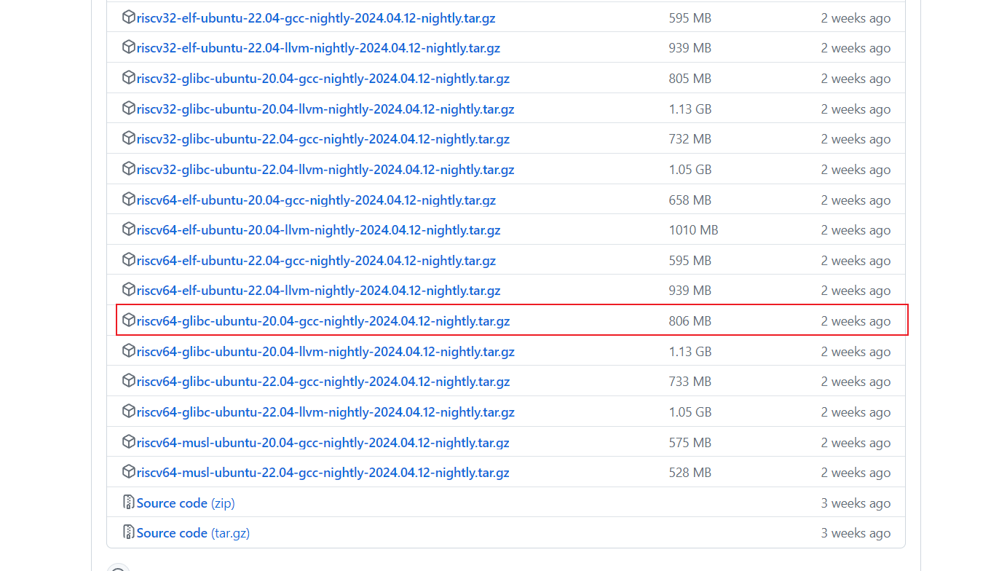
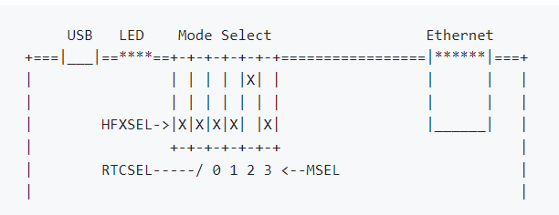
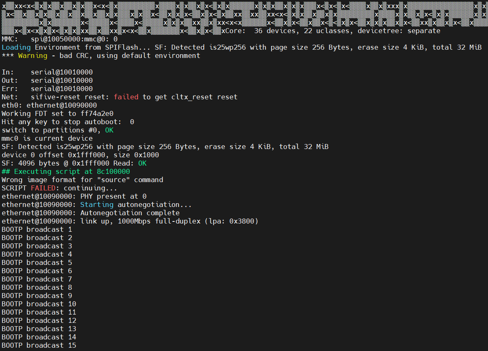

# 1. 获取toolchain

从https://github.com/riscv-collab/riscv-gnu-toolchain上获取toolchain，也可以从发布页面https://github.com/riscv-collab/riscv-gnu-toolchain/releases直接下载。

选择直接下载版本为标准glibc版本：[riscv64-glibc-ubuntu-20.04-gcc-nightly-2024.04.12-nightly.tar.gz](https://github.com/riscv-collab/riscv-gnu-toolchain/releases/download/2024.04.12/riscv64-glibc-ubuntu-20.04-gcc-nightly-2024.04.12-nightly.tar.gz)



构建toolchain的过程如下：

1. 使用`tar -xvzf`命令解压后，将生成的`riscv`文件夹移动至`/opt`目录下。
2. 设置环境变量`export CROSS_COMPILE=/opt/riscv/bin/`。

# 2. 构建OpenSBI

```bash
git clone https://github.com/riscv/opensbi.git
cd opensbi
make PLATFORM=generic
export OPENSBI=<path to opensbi/build/platform/generic/firmware/fw_dynamic.bin>
```

# 3. 构建U-Boot SPL以及U-Boot 

```bash
git clone https://github.com/u-boot/u-boot
cd <U-Boot-dir> # 移动到git生成的目录
make sifive_unleashed_defconfig # 原来的教程中为sifive_fu540_defconfig，但是u-boot版本更新之后只有sifive_unleashed_defconfig以及sifive_unmatched_defconfig
make
```

最终会在`u-boot`目录下生成`spl/u-boot-spl.bin`以及`u-boot.itb`（FIT Image）。

# 4. 文件系统分区生成

首先需要对sd卡进行格式化，生成所需的文件系统分区：

```bash
sudo sgdisk --clear \
  --set-alignment=2 \
  --new=1:34:2081 --change-name=1:loader1 --typecode=1:5B193300-FC78-40CD-8002-E86C45580B47 \
  --new=2:2082:10273 --change-name=2:loader2 --typecode=2:2E54B353-1271-4842-806F-E436D6AF6985 \
  --new=3:10274: --change-name=3:rootfs --typecode=3:0FC63DAF-8483-4772-8E79-3D69D8477DE4 \
  /dev/sdX # 需要将sdX换成插入的sd卡对应的文件名
```

- ZSBL（Zero Stage Bootloader）负责从GUID类型为`5B193300-FC78-40CD-8002-E86C45580B47`的分区加载u-boot SPL，即`u-boot-spl.bin`。

- U-Boot SPL需要GUID类型为`2E54B353-1271-4842-806F-E436D6AF6985`的分区中的U-Boot FIT image ，即`u-boot.itb`。

  > [!Note]
  >
  > FIT映像（u-boot.itb）包含fw_dynamic.bin、u-boot-nodtb.bin和设备树blob（hifive-unleased-a00.dtb）。

# 5. 烧录SD卡

```bash
cd <U-Boot-dir> # 移动到git生成的目录 
sudo dd if=spl/u-boot-spl.bin of=/dev/sdX seek=34 # sdX需要换成sd卡对应的文件
sudo dd if=u-boot.itb of=/dev/sdX seek=2082 # sdX需要换成sd卡对应的文件
```

# 6. 启动Hifive Unleashed

在开启电源之前，将烧录完成的SD卡插入到Hifive Unleashed开发板，并且将MSEL0到MSEL3拨至（1101），表示从SD卡中恢复Image，如下：



开启开发板电源，并将USB线和网线插入电脑，可以看到u-boot启动。如下：

